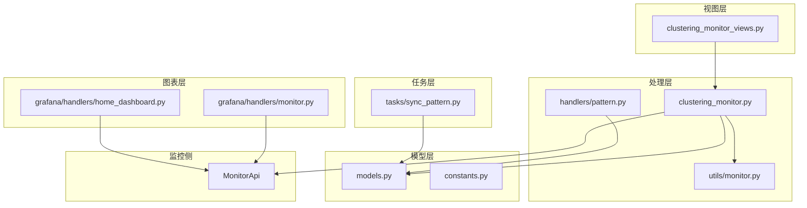
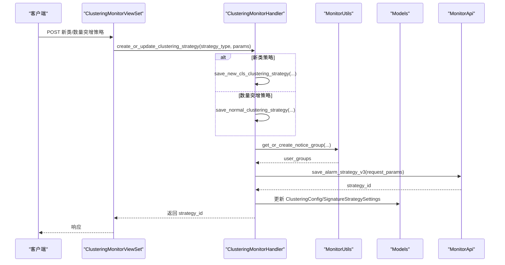
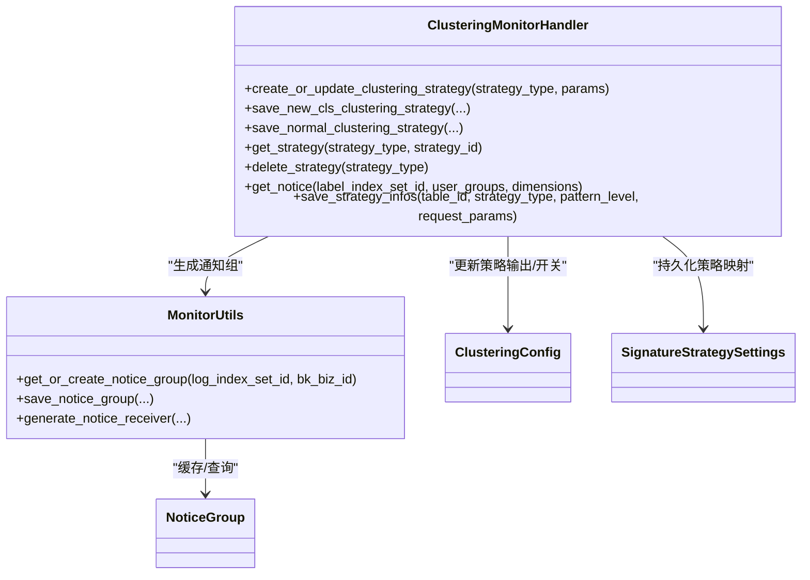
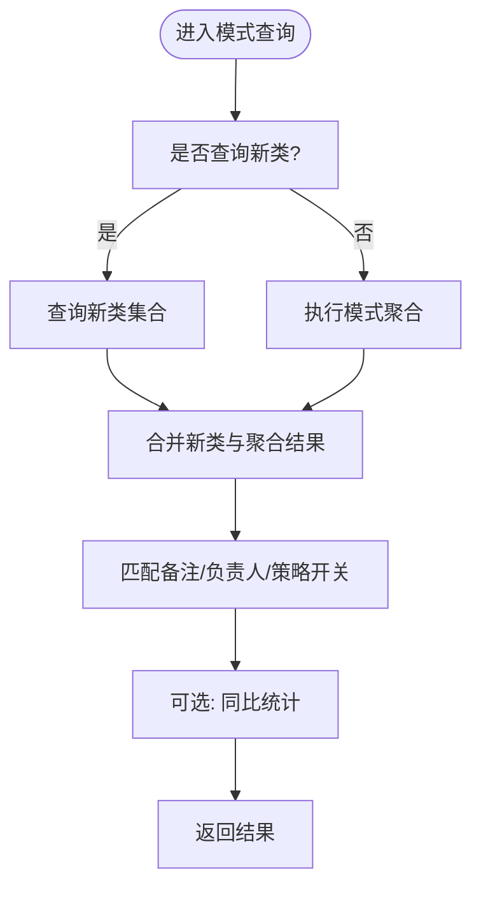
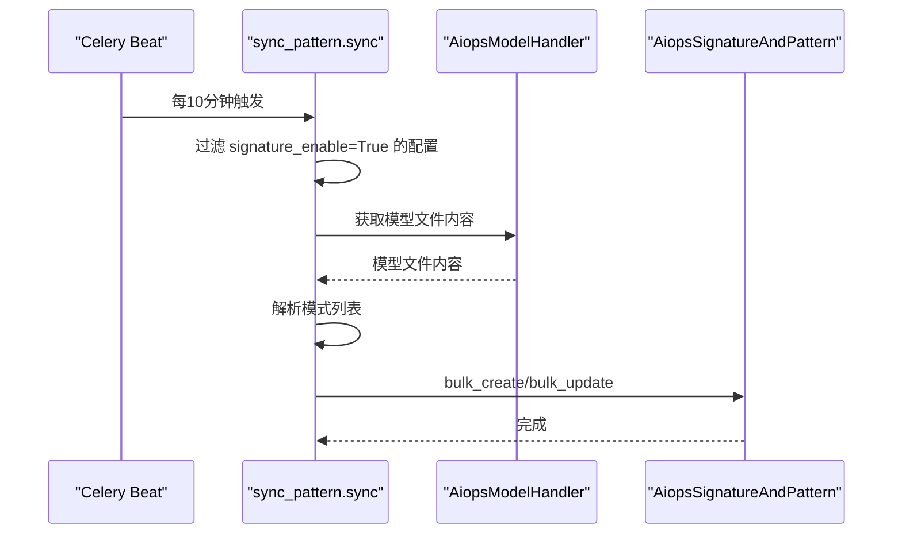
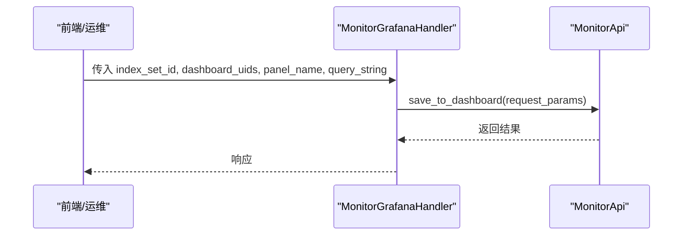
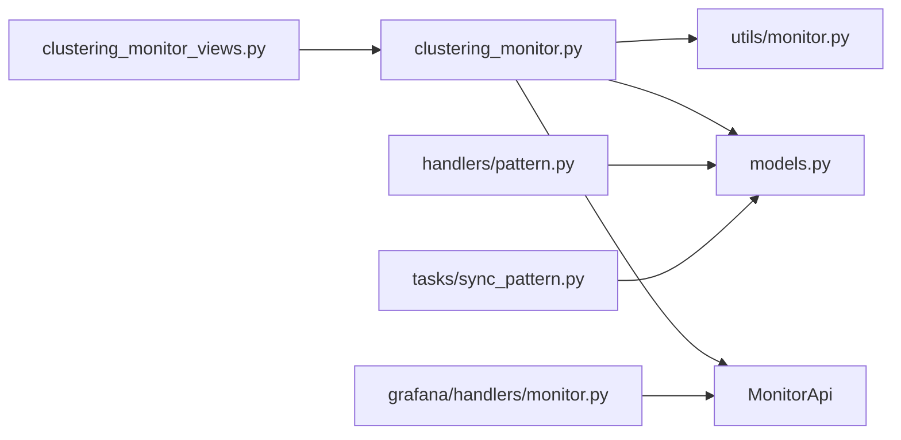

# 聚类监控与告警

<cite>
**本文引用的文件**   
- [apps/log_clustering/models.py](file://apps/log_clustering/models.py)
- [apps/log_clustering/constants.py](file://apps/log_clustering/constants.py)
- [apps/log_clustering/views/clustering_monitor_views.py](file://apps/log_clustering/views/clustering_monitor_views.py)
- [apps/log_clustering/handlers/clustering_monitor.py](file://apps/log_clustering/handlers/clustering_monitor.py)
- [apps/log_clustering/utils/monitor.py](file://apps/log_clustering/utils/monitor.py)
- [apps/log_clustering/serializers.py](file://apps/log_clustering/serializers.py)
- [apps/log_clustering/tasks/sync_pattern.py](file://apps/log_clustering/tasks/sync_pattern.py)
- [apps/log_clustering/handlers/pattern.py](file://apps/log_clustering/handlers/pattern.py)
- [apps/grafana/handlers/monitor.py](file://apps/grafana/handlers/monitor.py)
- [apps/grafana/handlers/home_dashboard.py](file://apps/grafana/handlers/home_dashboard.py)
- [bk_monitor/models.py](file://bk_monitor/models.py)
</cite>

## 目录
1. [简介](#简介)
2. [项目结构](#项目结构)
3. [核心组件](#核心组件)
4. [架构总览](#架构总览)
5. [详细组件分析](#详细组件分析)
6. [依赖分析](#依赖分析)
7. [性能考虑](#性能考虑)
8. [故障排查指南](#故障排查指南)
9. [结论](#结论)
10. [附录](#附录)

## 简介
本技术文档面向“聚类监控与告警系统”，围绕聚类结果监控、模型性能监控与系统运行状态监控展开，系统性阐述新类告警、数量突增告警与异常模式告警的设计与实现；并给出告警配置（规则、级别、接收人）与通知发送（渠道、内容、频率）的完整方案，提供性能监控与告警准确性优化策略，以及告警配置示例与监控仪表板集成建议。

## 项目结构
聚类监控与告警能力主要由以下模块协同实现：
- 视图层：提供策略查询、创建/更新、删除接口
- 处理层：封装策略构建、通知组管理、策略持久化与查询
- 模型层：定义聚类配置、策略设置、通知组、订阅等实体
- 工具层：封装监控侧通知组与策略的创建/更新
- 任务层：周期性同步聚类模式与签名
- 图表层：将监控指标嵌入 Grafana 仪表板

**图表来源**
- [apps/log_clustering/views/clustering_monitor_views.py:38-190](file://apps/log_clustering/views/clustering_monitor_views.py#L38-L190)
- [apps/log_clustering/handlers/clustering_monitor.py:68-615](file://apps/log_clustering/handlers/clustering_monitor.py#L68-L615)
- [apps/log_clustering/utils/monitor.py:38-89](file://apps/log_clustering/utils/monitor.py#L38-L89)
- [apps/log_clustering/models.py:107-344](file://apps/log_clustering/models.py#L107-L344)
- [apps/log_clustering/constants.py:1-336](file://apps/log_clustering/constants.py#L1-L336)
- [apps/log_clustering/tasks/sync_pattern.py:40-215](file://apps/log_clustering/tasks/sync_pattern.py#L40-L215)
- [apps/log_clustering/handlers/pattern.py:75-685](file://apps/log_clustering/handlers/pattern.py#L75-L685)
- [apps/grafana/handlers/monitor.py:7-39](file://apps/grafana/handlers/monitor.py#L7-L39)
- [apps/grafana/handlers/home_dashboard.py:27-131](file://apps/grafana/handlers/home_dashboard.py#L27-L131)

**章节来源**
- [apps/log_clustering/views/clustering_monitor_views.py:38-190](file://apps/log_clustering/views/clustering_monitor_views.py#L38-L190)
- [apps/log_clustering/handlers/clustering_monitor.py:68-615](file://apps/log_clustering/handlers/clustering_monitor.py#L68-L615)
- [apps/log_clustering/models.py:107-344](file://apps/log_clustering/models.py#L107-L344)
- [apps/log_clustering/constants.py:1-336](file://apps/log_clustering/constants.py#L1-L336)
- [apps/log_clustering/tasks/sync_pattern.py:40-215](file://apps/log_clustering/tasks/sync_pattern.py#L40-L215)
- [apps/log_clustering/handlers/pattern.py:75-685](file://apps/log_clustering/handlers/pattern.py#L75-L685)
- [apps/grafana/handlers/monitor.py:7-39](file://apps/grafana/handlers/monitor.py#L7-L39)
- [apps/grafana/handlers/home_dashboard.py:27-131](file://apps/grafana/handlers/home_dashboard.py#L27-L131)

## 核心组件
- 聚类配置与策略
  - ClusteringConfig：承载聚类链路配置、结果表、策略开关与输出
  - SignatureStrategySettings：索引集级策略映射（新类/数量突增）
  - ClusteringRemark：数据指纹级备注、负责人、策略开关与通知组
  - NoticeGroup：索引集级通知组缓存
- 策略与通知
  - ClusteringMonitorHandler：封装策略创建/更新/删除、通知组生成、策略查询
  - MonitorUtils：封装通知组创建/查询与默认通知配置
- 模式与新类识别
  - PatternHandler：模式聚合、同比计算、新类识别、备注与负责人管理
  - sync_pattern 定时任务：周期同步 AiopsSignatureAndPattern 模式
- 图表与仪表板
  - MonitorGrafanaHandler：将监控查询面板写入 Grafana 仪表板
  - HomeDashboard：首页仪表板布局与引导

**章节来源**
- [apps/log_clustering/models.py:107-344](file://apps/log_clustering/models.py#L107-L344)
- [apps/log_clustering/handlers/clustering_monitor.py:68-615](file://apps/log_clustering/handlers/clustering_monitor.py#L68-L615)
- [apps/log_clustering/utils/monitor.py:38-89](file://apps/log_clustering/utils/monitor.py#L38-L89)
- [apps/log_clustering/handlers/pattern.py:75-685](file://apps/log_clustering/handlers/pattern.py#L75-L685)
- [apps/log_clustering/tasks/sync_pattern.py:40-215](file://apps/log_clustering/tasks/sync_pattern.py#L40-L215)
- [apps/grafana/handlers/monitor.py:7-39](file://apps/grafana/handlers/monitor.py#L7-L39)
- [apps/grafana/handlers/home_dashboard.py:27-131](file://apps/grafana/handlers/home_dashboard.py#L27-L131)

## 架构总览
系统通过视图层暴露策略管理接口，处理层对接监控侧 API 创建/更新策略，并通过工具层生成默认通知组；模式层负责聚类结果聚合、新类识别与备注/负责人管理；定时任务同步模式签名；最终将监控查询嵌入 Grafana 仪表板。

**图表来源**
- [apps/log_clustering/views/clustering_monitor_views.py:125-170](file://apps/log_clustering/views/clustering_monitor_views.py#L125-L170)
- [apps/log_clustering/handlers/clustering_monitor.py:401-420](file://apps/log_clustering/handlers/clustering_monitor.py#L401-L420)
- [apps/log_clustering/utils/monitor.py:65-82](file://apps/log_clustering/utils/monitor.py#L65-L82)

**章节来源**
- [apps/log_clustering/views/clustering_monitor_views.py:125-170](file://apps/log_clustering/views/clustering_monitor_views.py#L125-L170)
- [apps/log_clustering/handlers/clustering_monitor.py:401-420](file://apps/log_clustering/handlers/clustering_monitor.py#L401-L420)
- [apps/log_clustering/utils/monitor.py:65-82](file://apps/log_clustering/utils/monitor.py#L65-L82)

## 详细组件分析

### 组件A：聚类监控策略管理
- 功能要点
  - 新类告警：基于智能检测算法，按敏感度与签名聚合，触发异常告警
  - 数量突增告警：基于日志计数聚合，按分组维度对比阈值
  - 策略查询与删除：支持按策略类型查询与删除
  - 通知组自动创建：若未配置，按索引集维护者生成默认通知组
- 关键流程
  - 创建/更新策略：根据策略类型构造 items/query_configs/algorithms/notice
  - 保存策略：调用监控侧 API，持久化 strategy_id 并回填 ClusteringConfig
  - 查询策略：通过监控侧 API 拉取策略配置并解析关键参数
  - 删除策略：删除本地映射并调用监控侧删除

**图表来源**
- [apps/log_clustering/handlers/clustering_monitor.py:68-615](file://apps/log_clustering/handlers/clustering_monitor.py#L68-L615)
- [apps/log_clustering/utils/monitor.py:38-89](file://apps/log_clustering/utils/monitor.py#L38-L89)
- [apps/log_clustering/models.py:107-190](file://apps/log_clustering/models.py#L107-L190)

**章节来源**
- [apps/log_clustering/handlers/clustering_monitor.py:85-420](file://apps/log_clustering/handlers/clustering_monitor.py#L85-L420)
- [apps/log_clustering/utils/monitor.py:65-82](file://apps/log_clustering/utils/monitor.py#L65-L82)
- [apps/log_clustering/models.py:107-190](file://apps/log_clustering/models.py#L107-L190)

### 组件B：聚类模式与新类识别
- 功能要点
  - 模式聚合：支持传统 ES 聚合与统一查询两种后端
  - 新类识别：基于监控新类输出或 BKBASE 链路结果
  - 同比计算：支持按小时偏移进行同比统计
  - 备注与负责人：支持为签名/模式设置备注、负责人与策略开关
- 关键流程
  - 模式聚合：根据存储类型与特性开关选择查询路径
  - 新类判定：按时间窗口与敏感度字段筛选新类
  - 备注继承：优先匹配带分组的备注，否则降级到无分组备注
  - 负责人同步：当策略启用且存在负责人时，同步通知组

**图表来源**
- [apps/log_clustering/handlers/pattern.py:89-238](file://apps/log_clustering/handlers/pattern.py#L89-L238)
- [apps/log_clustering/handlers/pattern.py:406-445](file://apps/log_clustering/handlers/pattern.py#L406-L445)

**章节来源**
- [apps/log_clustering/handlers/pattern.py:89-238](file://apps/log_clustering/handlers/pattern.py#L89-L238)
- [apps/log_clustering/handlers/pattern.py:406-445](file://apps/log_clustering/handlers/pattern.py#L406-L445)

### 组件C：定时同步聚类模式
- 功能要点
  - 周期任务：每10分钟扫描启用签名同步的聚类配置
  - 模型文件解析：从 AIOPS 或模型输出结果表解析模式
  - 批量写入：批量创建/更新 AiopsSignatureAndPattern 记录
- 关键流程
  - 任务调度：遍历满足条件的 ClusteringConfig
  - 文件解析：pickle 解码并提取模式字段
  - 写入策略：存在即更新，不存在即创建

**图表来源**
- [apps/log_clustering/tasks/sync_pattern.py:40-95](file://apps/log_clustering/tasks/sync_pattern.py#L40-L95)

**章节来源**
- [apps/log_clustering/tasks/sync_pattern.py:40-95](file://apps/log_clustering/tasks/sync_pattern.py#L40-L95)

### 组件D：监控仪表板集成
- 功能要点
  - 将监控查询面板写入指定仪表板
  - 支持多数据源与查询配置注入
  - 首页仪表板提供导航与使用指引
- 关键流程
  - 参数组装：索引集分类、名称、查询字符串、数据源
  - 调用监控侧 API：保存面板至仪表板

**图表来源**
- [apps/grafana/handlers/monitor.py:9-38](file://apps/grafana/handlers/monitor.py#L9-L38)

**章节来源**
- [apps/grafana/handlers/monitor.py:9-38](file://apps/grafana/handlers/monitor.py#L9-L38)
- [apps/grafana/handlers/home_dashboard.py:27-131](file://apps/grafana/handlers/home_dashboard.py#L27-L131)

## 依赖分析
- 组件耦合
  - 视图层仅负责参数校验与路由转发，处理层承担策略构建与持久化
  - 处理层依赖监控侧 API 与模型层，工具层负责通知组生成
  - 模式层依赖聚类配置与监控侧查询，定时任务独立于主流程
- 外部依赖
  - MonitorApi：策略创建/更新/删除、通知组管理、仪表板写入
  - BkData/UnifyQuery：聚类结果与模式数据查询
  - Celery：定时任务调度

**图表来源**
- [apps/log_clustering/views/clustering_monitor_views.py:38-190](file://apps/log_clustering/views/clustering_monitor_views.py#L38-L190)
- [apps/log_clustering/handlers/clustering_monitor.py:68-615](file://apps/log_clustering/handlers/clustering_monitor.py#L68-L615)
- [apps/log_clustering/utils/monitor.py:38-89](file://apps/log_clustering/utils/monitor.py#L38-L89)
- [apps/log_clustering/models.py:107-344](file://apps/log_clustering/models.py#L107-L344)
- [apps/log_clustering/tasks/sync_pattern.py:40-215](file://apps/log_clustering/tasks/sync_pattern.py#L40-L215)
- [apps/log_clustering/handlers/pattern.py:75-685](file://apps/log_clustering/handlers/pattern.py#L75-L685)
- [apps/grafana/handlers/monitor.py:7-39](file://apps/grafana/handlers/monitor.py#L7-L39)

**章节来源**
- [apps/log_clustering/views/clustering_monitor_views.py:38-190](file://apps/log_clustering/views/clustering_monitor_views.py#L38-L190)
- [apps/log_clustering/handlers/clustering_monitor.py:68-615](file://apps/log_clustering/handlers/clustering_monitor.py#L68-L615)
- [apps/log_clustering/utils/monitor.py:38-89](file://apps/log_clustering/utils/monitor.py#L38-L89)
- [apps/log_clustering/models.py:107-344](file://apps/log_clustering/models.py#L107-L344)
- [apps/log_clustering/tasks/sync_pattern.py:40-215](file://apps/log_clustering/tasks/sync_pattern.py#L40-L215)
- [apps/log_clustering/handlers/pattern.py:75-685](file://apps/log_clustering/handlers/pattern.py#L75-L685)
- [apps/grafana/handlers/monitor.py:7-39](file://apps/grafana/handlers/monitor.py#L7-L39)

## 性能考虑
- 聚类查询
  - 统一查询开关：在特性开关开启时走统一查询，减少 ES 聚合复杂度
  - 分组字段降级：新类查询按分组字段失败时自动降级为不分组
- 批量写入
  - 模式同步采用批量创建/更新，降低数据库往返开销
- 通知组复用
  - 索引集级通知组缓存，避免重复创建
- 仪表板写入
  - 单次写入多个面板，减少 API 调用频次

[本节为通用指导，无需列出具体文件来源]

## 故障排查指南
- 策略查询为空
  - 检查 SignatureStrategySettings 是否存在对应策略映射
  - 确认 ClusteringConfig 对应的新类/数量突增输出结果表是否正确
- 通知组未生效
  - 若未配置通知组，系统会自动创建默认通知组；检查索引集维护者是否为空
  - 确认 MonitorApi 返回的用户组 ID 是否有效
- 新类告警未触发
  - 检查监控新类输出结果表是否存在数据
  - 校验算法计划 ID 与聚合间隔配置
- 模式同步失败
  - 检查模型文件是否可解析，pickle 解码是否成功
  - 确认 AiopsSignatureAndPattern 表写入是否被阻塞

**章节来源**
- [apps/log_clustering/handlers/clustering_monitor.py:343-368](file://apps/log_clustering/handlers/clustering_monitor.py#L343-L368)
- [apps/log_clustering/utils/monitor.py:65-82](file://apps/log_clustering/utils/monitor.py#L65-L82)
- [apps/log_clustering/tasks/sync_pattern.py:67-95](file://apps/log_clustering/tasks/sync_pattern.py#L67-L95)

## 结论
本系统以“策略即配置”的思想，将聚类结果监控、模型性能监控与系统运行状态监控有机融合，通过统一的策略管理与通知机制，实现新类、数量突增与异常模式的自动化告警。配合定时任务与仪表板集成，形成闭环的监控与可视化体系。建议在生产环境中结合业务特性完善告警阈值与通知策略，并持续优化查询与写入性能。

[本节为总结性内容，无需列出具体文件来源]

## 附录

### 告警机制设计与实现
- 新类告警
  - 触发条件：智能检测算法识别新类，按敏感度与签名聚合
  - 配置参数：告警间隔、阈值、告警级别
- 数量突增告警
  - 触发条件：日志计数在聚合维度上超过阈值
  - 配置参数：敏感度、告警级别
- 异常模式告警
  - 触发条件：基于数据指纹与分组维度的异常计数
  - 配置参数：维度条件、阈值、告警级别

**章节来源**
- [apps/log_clustering/constants.py:88-113](file://apps/log_clustering/constants.py#L88-L113)
- [apps/log_clustering/handlers/clustering_monitor.py:85-262](file://apps/log_clustering/handlers/clustering_monitor.py#L85-L262)

### 告警配置管理
- 告警规则设置
  - 新类策略：设置告警间隔与阈值
  - 数量突增策略：设置敏感度
  - 异常模式策略：设置维度条件与阈值
- 告警级别定义
  - 致命/预警/提醒 三级
- 告警接收人配置
  - 自动创建默认通知组（索引集维护者）
  - 支持查询现有用户组并绑定

**章节来源**
- [apps/log_clustering/serializers.py:169-187](file://apps/log_clustering/serializers.py#L169-L187)
- [apps/log_clustering/constants.py:202-211](file://apps/log_clustering/constants.py#L202-L211)
- [apps/log_clustering/utils/monitor.py:65-82](file://apps/log_clustering/utils/monitor.py#L65-L82)

### 告警通知发送机制
- 通知渠道
  - 默认使用“rtx”通知方式
- 通知内容
  - 异常消息模板包含级别、时间、目标、维度、详情、负责人、备注、示例链接
- 通知频率
  - 标准通知间隔（策略级）

**章节来源**
- [apps/log_clustering/constants.py:114-134](file://apps/log_clustering/constants.py#L114-L134)
- [apps/log_clustering/handlers/clustering_monitor.py:264-301](file://apps/log_clustering/handlers/clustering_monitor.py#L264-L301)

### 告警系统性能监控方案
- 指标建议
  - 策略创建/更新耗时、通知组创建耗时、模式同步耗时
  - 聚类查询延迟、聚合桶数量、同比计算耗时
- 监控侧数据源
  - 通过运营数据上报配置接入监控侧

**章节来源**
- [bk_monitor/models.py:8-26](file://bk_monitor/models.py#L8-L26)

### 告警准确性优化策略
- 模式同步
  - 定时同步 AiopsSignatureAndPattern，确保模式一致性
- 分组降级
  - 新类查询按分组失败时自动降级，保证可用性
- 通知组复用
  - 缓存索引集级通知组，减少重复创建

**章节来源**
- [apps/log_clustering/tasks/sync_pattern.py:40-95](file://apps/log_clustering/tasks/sync_pattern.py#L40-L95)
- [apps/log_clustering/handlers/pattern.py:425-435](file://apps/log_clustering/handlers/pattern.py#L425-L435)
- [apps/log_clustering/utils/monitor.py:65-82](file://apps/log_clustering/utils/monitor.py#L65-L82)

### 具体告警配置示例
- 新类告警
  - 告警级别：预警
  - 告警间隔：30 分钟
  - 阈值：1
  - 接收人：索引集维护者组成的默认通知组
- 数量突增告警
  - 告警级别：预警
  - 敏感度：5
  - 接收人：索引集维护者组成的默认通知组
- 异常模式告警
  - 维度条件：按签名与分组字段
  - 告警级别：预警
  - 接收人：备注中负责人对应的用户组

**章节来源**
- [apps/log_clustering/serializers.py:174-187](file://apps/log_clustering/serializers.py#L174-L187)
- [apps/log_clustering/handlers/clustering_monitor.py:85-262](file://apps/log_clustering/handlers/clustering_monitor.py#L85-L262)

### 监控仪表板展示
- 将监控查询面板写入指定仪表板，支持多数据源与查询注入
- 首页仪表板提供导航与使用指引

**章节来源**
- [apps/grafana/handlers/monitor.py:9-38](file://apps/grafana/handlers/monitor.py#L9-L38)
- [apps/grafana/handlers/home_dashboard.py:27-131](file://apps/grafana/handlers/home_dashboard.py#L27-L131)