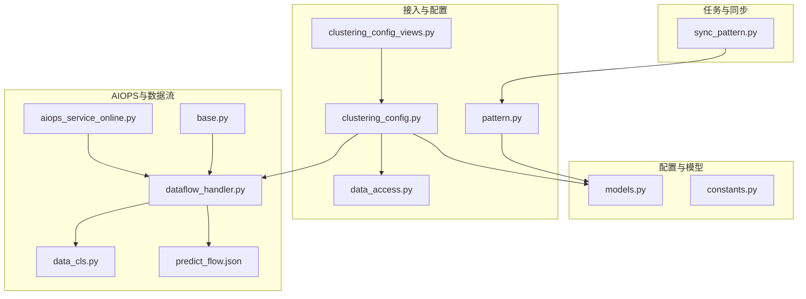
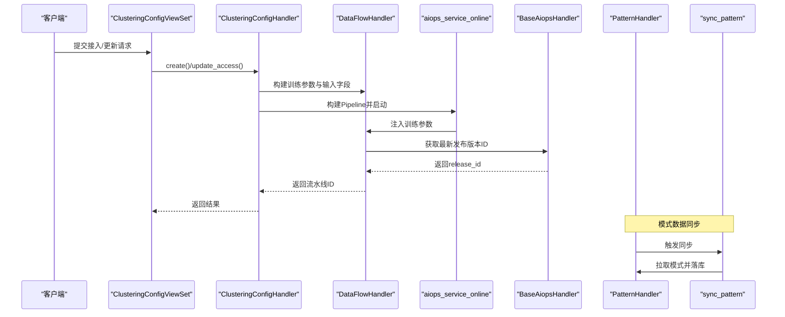
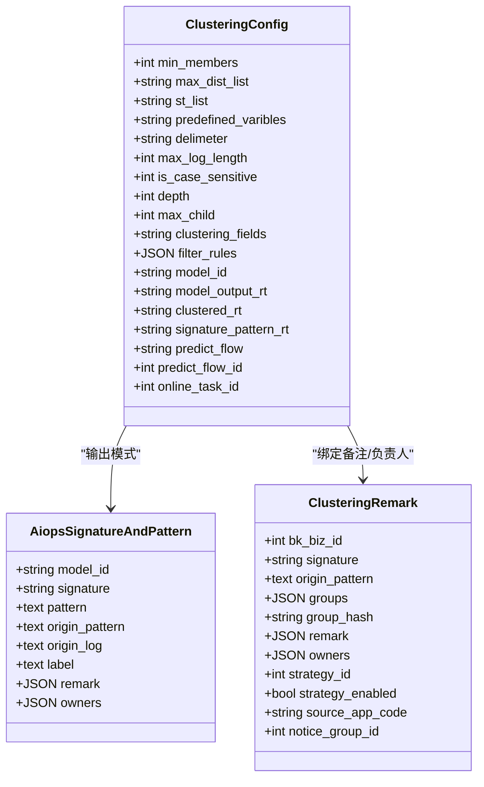
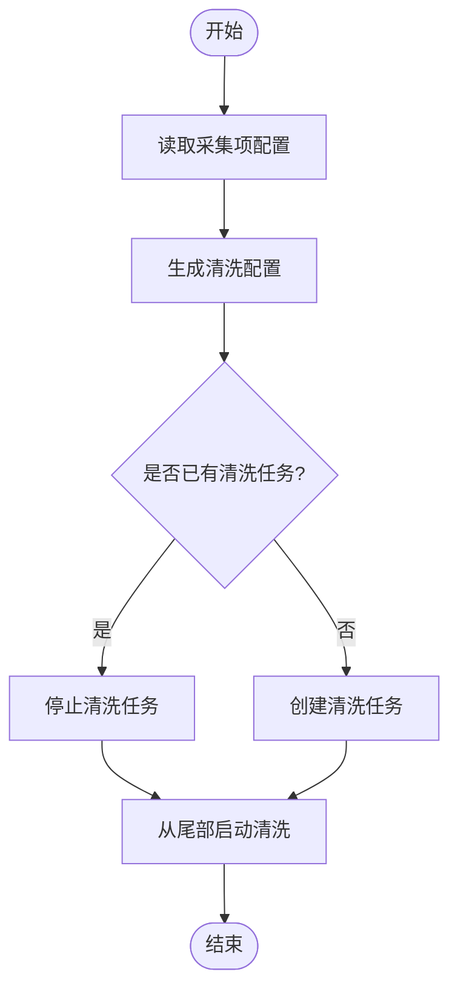
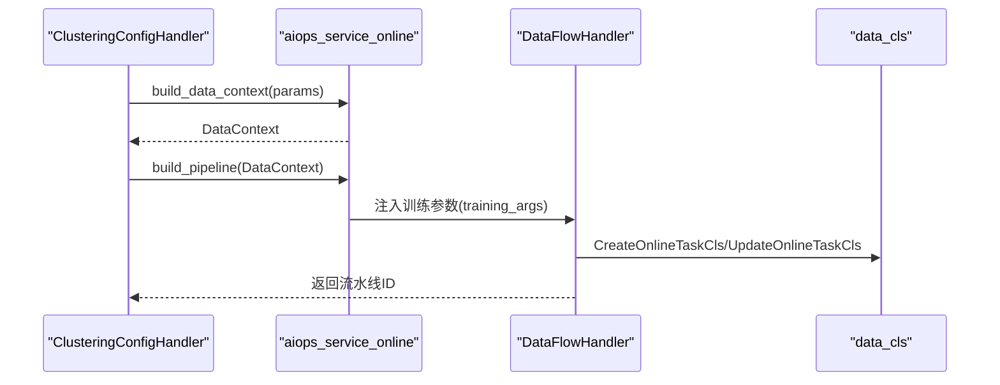
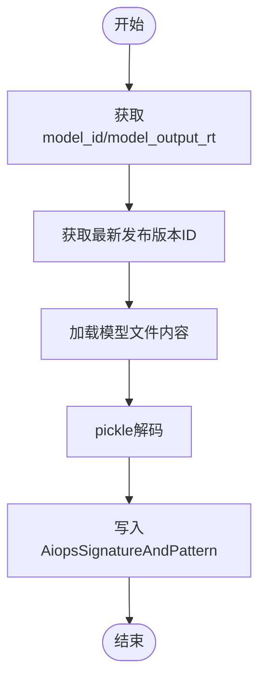
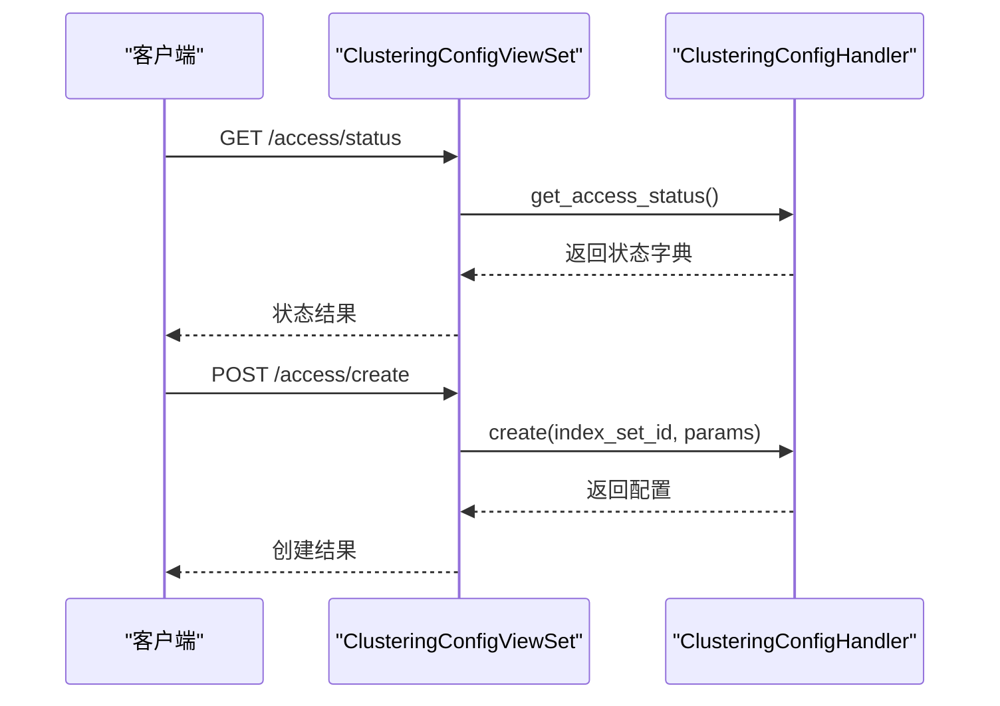
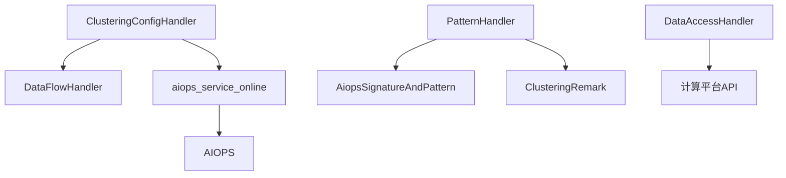

# AI模型训练

<cite>
**本文引用的文件**
- [models.py](file://apps/log_clustering/models.py)
- [clustering_config.py](file://apps/log_clustering/handlers/clustering_config.py)
- [data_access.py](file://apps/log_clustering/handlers/data_access/data_access.py)
- [pattern.py](file://apps/log_clustering/handlers/pattern.py)
- [base.py](file://apps/log_clustering/handlers/aiops/base.py)
- [dataflow_handler.py](file://apps/log_clustering/handlers/dataflow/dataflow_handler.py)
- [constants.py](file://apps/log_clustering/constants.py)
- [clustering_config_views.py](file://apps/log_clustering/views/clustering_config_views.py)
- [predict_flow.json](file://templates/flow/predict_flow.json)
- [aiops_service_online.py](file://apps/log_clustering/handlers/pipline_service/aiops_service_online.py)
- [data_cls.py](file://apps/log_clustering/handlers/dataflow/data_cls.py)
- [sync_pattern.py](file://apps/log_clustering/tasks/sync_pattern.py)
</cite>

## 目录
1. [简介](#简介)
2. [项目结构](#项目结构)
3. [核心组件](#核心组件)
4. [架构总览](#架构总览)
5. [详细组件分析](#详细组件分析)
6. [依赖分析](#依赖分析)
7. [性能考虑](#性能考虑)
8. [故障排查指南](#故障排查指南)
9. [结论](#结论)
10. [附录](#附录)

## 简介
本技术文档围绕蓝鲸日志平台中的AI聚类模型训练流程展开，覆盖数据准备、特征工程、模型训练与参数配置、模型评估与性能测试、版本管理与更新策略等方面。文档基于仓库中实际实现，结合数据流与控制流，帮助读者理解从索引集接入到在线训练、模型发布与结果同步的完整闭环。

## 项目结构
AI聚类训练相关模块主要集中在 apps/log_clustering 下，涉及配置管理、数据接入、特征与模式处理、AIOPS在线训练编排、视图接口与模板配置等。下图展示了关键文件之间的关系映射：

**图表来源**
- [models.py:107-191](file://apps/log_clustering/models.py#L107-L191)
- [clustering_config.py:67-213](file://apps/log_clustering/handlers/clustering_config.py#L67-L213)
- [data_access.py:85-101](file://apps/log_clustering/handlers/data_access/data_access.py#L85-L101)
- [pattern.py:75-129](file://apps/log_clustering/handlers/pattern.py#L75-L129)
- [dataflow_handler.py:1296-1319](file://apps/log_clustering/handlers/dataflow/dataflow_handler.py#L1296-L1319)
- [data_cls.py:470-492](file://apps/log_clustering/handlers/dataflow/data_cls.py#L470-L492)
- [base.py:33-74](file://apps/log_clustering/handlers/aiops/base.py#L33-L74)
- [predict_flow.json:183-319](file://templates/flow/predict_flow.json#L183-L319)
- [aiops_service_online.py:50-68](file://apps/log_clustering/handlers/pipline_service/aiops_service_online.py#L50-L68)
- [sync_pattern.py:67-86](file://apps/log_clustering/tasks/sync_pattern.py#L67-L86)

**章节来源**
- [models.py:107-191](file://apps/log_clustering/models.py#L107-L191)
- [clustering_config.py:67-213](file://apps/log_clustering/handlers/clustering_config.py#L67-L213)

## 核心组件
- 配置模型与实体
  - ClusteringConfig：聚类配置的核心模型，包含最小日志数量、敏感度、预定义正则、分词符、最大日志长度、大小写敏感、搜索树深度与最大子节点数、过滤规则、存储类型、模型输出结果表等字段。
  - AiopsSignatureAndPattern：数据指纹到模式与原始日志的映射，支持标签、备注、负责人等扩展信息。
  - ClusteringRemark：针对签名的备注、负责人、策略绑定等信息。
- 配置处理器
  - ClusteringConfigHandler：负责接入创建、更新、接入状态检查、调试、正则校验等；封装DataFlowHandler与AIOPS在线训练编排。
- 数据接入与ETL
  - DataAccessHandler：对接计算平台清洗，生成/更新清洗任务，启动/停止清洗。
- 模式与特征
  - PatternHandler：模式聚合、同比计算、新类识别、备注与负责人管理、模式数据同步。
- AIOPS在线训练
  - BaseAiopsHandler：AIOPS能力封装，获取最新发布版本ID、构造请求参数等。
  - DataFlowHandler：构建在线训练流水线参数，注入训练参数与输入字段。
  - aiops_service_online：构建DataContext与Pipeline，支持更新过滤规则与模型参数。
- 视图与接口
  - clustering_config_views：提供接入创建、更新、状态查询、默认配置、正则调试等接口。

**章节来源**
- [models.py:66-191](file://apps/log_clustering/models.py#L66-L191)
- [clustering_config.py:67-213](file://apps/log_clustering/handlers/clustering_config.py#L67-L213)
- [data_access.py:85-101](file://apps/log_clustering/handlers/data_access/data_access.py#L85-L101)
- [pattern.py:75-129](file://apps/log_clustering/handlers/pattern.py#L75-L129)
- [base.py:33-74](file://apps/log_clustering/handlers/aiops/base.py#L33-L74)
- [dataflow_handler.py:1296-1319](file://apps/log_clustering/handlers/dataflow/dataflow_handler.py#L1296-L1319)
- [aiops_service_online.py:50-68](file://apps/log_clustering/handlers/pipline_service/aiops_service_online.py#L50-L68)
- [clustering_config_views.py:41-106](file://apps/log_clustering/views/clustering_config_views.py#L41-L106)

## 架构总览
AI聚类训练的整体架构由“配置接入—数据清洗—在线训练—模式同步—结果消费”构成。下图展示了从视图到模型与AIOPS的关键交互：

**图表来源**
- [clustering_config_views.py:127-178](file://apps/log_clustering/views/clustering_config_views.py#L127-L178)
- [clustering_config.py:92-108](file://apps/log_clustering/handlers/clustering_config.py#L92-L108)
- [dataflow_handler.py:1296-1319](file://apps/log_clustering/handlers/dataflow/dataflow_handler.py#L1296-L1319)
- [aiops_service_online.py:50-68](file://apps/log_clustering/handlers/pipline_service/aiops_service_online.py#L50-L68)
- [base.py:60-71](file://apps/log_clustering/handlers/aiops/base.py#L60-L71)
- [pattern.py:447-457](file://apps/log_clustering/handlers/pattern.py#L447-L457)
- [sync_pattern.py:67-86](file://apps/log_clustering/tasks/sync_pattern.py#L67-L86)

## 详细组件分析

### 组件A：聚类配置与模型参数
- 关键职责
  - 定义聚类配置字段（最小日志数量、敏感度、预定义正则、分词符、最大日志长度、大小写敏感、搜索树深度与最大子节点数、过滤规则、存储类型、模型输出结果表等）。
  - 提供接入创建、更新、接入状态检查、调试、正则校验等功能。
- 参数与默认值
  - 默认最小日志数量、默认敏感度、默认ST阈值、默认DELIMETER、默认最大日志长度、默认大小写敏感等来自OnlineTaskTrainingArgs。
- 数据流
  - 视图层提交参数，处理器根据FeatureToggle与默认配置填充ClusteringConfig，随后触发DataFlow与AIOPS在线训练。

**图表来源**
- [models.py:107-191](file://apps/log_clustering/models.py#L107-L191)
- [models.py:66-96](file://apps/log_clustering/models.py#L66-L96)

**章节来源**
- [models.py:107-191](file://apps/log_clustering/models.py#L107-L191)
- [constants.py:1110-1121](file://apps/log_clustering/constants.py#L1110-L1121)
- [clustering_config.py:170-213](file://apps/log_clustering/handlers/clustering_config.py#L170-L213)

### 组件B：数据接入与ETL
- 关键职责
  - 根据采集项ETL配置生成/更新清洗任务，启动/停止清洗，确保清洗结果表可用。
- 流程要点
  - 校验业务ID、生成清洗配置、去重字段、创建/更新清洗任务、从尾部启动清洗。

**图表来源**
- [data_access.py:85-101](file://apps/log_clustering/handlers/data_access/data_access.py#L85-L101)
- [data_access.py:102-188](file://apps/log_clustering/handlers/data_access/data_access.py#L102-L188)
- [data_access.py:190-210](file://apps/log_clustering/handlers/data_access/data_access.py#L190-L210)

**章节来源**
- [data_access.py:85-210](file://apps/log_clustering/handlers/data_access/data_access.py#L85-L210)

### 组件C：在线训练参数与流水线
- 关键职责
  - 构建在线训练参数（最小日志数量、敏感度、ST阈值、预定义正则、分词符、最大日志长度、大小写敏感、搜索树深度、最大子节点数、是否使用离线模型），并注入DataFlow。
- 参数来源
  - 从ClusteringConfig读取字段，结合OnlineTaskTrainingArgs默认值。
- 流水线构建
  - aiops_service_online根据参数构建DataContext与Pipeline，支持更新过滤规则与模型参数。

**图表来源**
- [clustering_config.py:215-271](file://apps/log_clustering/handlers/clustering_config.py#L215-L271)
- [aiops_service_online.py:50-68](file://apps/log_clustering/handlers/pipline_service/aiops_service_online.py#L50-L68)
- [dataflow_handler.py:1296-1319](file://apps/log_clustering/handlers/dataflow/dataflow_handler.py#L1296-L1319)
- [data_cls.py:470-492](file://apps/log_clustering/handlers/dataflow/data_cls.py#L470-L492)

**章节来源**
- [clustering_config.py:215-271](file://apps/log_clustering/handlers/clustering_config.py#L215-L271)
- [aiops_service_online.py:50-68](file://apps/log_clustering/handlers/pipline_service/aiops_service_online.py#L50-L68)
- [dataflow_handler.py:1296-1319](file://apps/log_clustering/handlers/dataflow/dataflow_handler.py#L1296-L1319)
- [data_cls.py:470-492](file://apps/log_clustering/handlers/dataflow/data_cls.py#L470-L492)

### 组件D：模式聚合与同步
- 关键职责
  - 聚合签名维度的模式与原始日志，支持同比计算、新类识别、备注与负责人管理。
  - 从模型输出结果表或签名-模式结果表拉取模式数据，进行pickle解码与落库。
- 同步策略
  - 根据model_id或model_output_rt获取最新release_id，拉取模型文件内容并解析。

**图表来源**
- [sync_pattern.py:67-86](file://apps/log_clustering/tasks/sync_pattern.py#L67-L86)
- [pattern.py:447-457](file://apps/log_clustering/handlers/pattern.py#L447-L457)

**章节来源**
- [pattern.py:75-129](file://apps/log_clustering/handlers/pattern.py#L75-L129)
- [pattern.py:447-457](file://apps/log_clustering/handlers/pattern.py#L447-L457)
- [sync_pattern.py:67-86](file://apps/log_clustering/tasks/sync_pattern.py#L67-L86)

### 组件E：接口与接入状态
- 关键职责
  - 提供接入创建、更新、状态查询、默认配置、正则调试等接口。
  - 接入状态检查包含“流程创建状态”“流程运行状态”“数据检查状态”，并支持重启flow。
- 接口示例
  - GET /clustering_config/{index_set_id}/access/status：查询接入状态
  - POST /clustering_config/{index_set_id}/access/create：创建接入
  - POST /clustering_config/{index_set_id}/access/update：更新接入

**图表来源**
- [clustering_config_views.py:234-265](file://apps/log_clustering/views/clustering_config_views.py#L234-L265)
- [clustering_config_views.py:127-178](file://apps/log_clustering/views/clustering_config_views.py#L127-L178)
- [clustering_config.py:307-394](file://apps/log_clustering/handlers/clustering_config.py#L307-L394)

**章节来源**
- [clustering_config_views.py:41-106](file://apps/log_clustering/views/clustering_config_views.py#L41-L106)
- [clustering_config_views.py:234-265](file://apps/log_clustering/views/clustering_config_views.py#L234-L265)
- [clustering_config.py:307-394](file://apps/log_clustering/handlers/clustering_config.py#L307-L394)

## 依赖分析
- 组件耦合
  - ClusteringConfigHandler依赖DataFlowHandler与AIOPS在线训练服务，用于构建与启动流水线。
  - PatternHandler依赖AiopsSignatureAndPattern与ClusteringRemark，用于模式与备注管理。
  - DataAccessHandler依赖计算平台API，用于清洗任务的创建与启停。
- 外部依赖
  - 计算平台（清洗、结果表、资源组）
  - AIOPS（模型发布、版本ID获取）
  - 监控（告警组、通知）

**图表来源**
- [clustering_config.py:92-108](file://apps/log_clustering/handlers/clustering_config.py#L92-L108)
- [pattern.py:119-129](file://apps/log_clustering/handlers/pattern.py#L119-L129)
- [data_access.py:85-101](file://apps/log_clustering/handlers/data_access/data_access.py#L85-L101)
- [base.py:51-71](file://apps/log_clustering/handlers/aiops/base.py#L51-L71)

**章节来源**
- [clustering_config.py:92-108](file://apps/log_clustering/handlers/clustering_config.py#L92-L108)
- [pattern.py:119-129](file://apps/log_clustering/handlers/pattern.py#L119-L129)
- [data_access.py:85-101](file://apps/log_clustering/handlers/data_access/data_access.py#L85-L101)
- [base.py:51-71](file://apps/log_clustering/handlers/aiops/base.py#L51-L71)

## 性能考虑
- 清洗任务启停策略
  - 新建清洗任务时从尾部启动，减少历史数据影响；更新清洗任务时先停止再启动，保证一致性。
- 模式数据拉取限制
  - 限定拉取时间窗口与最大条数，避免历史数据膨胀导致查询性能下降。
- 并行查询
  - 使用多执行器并发查询模式聚合、同比与新类数据，缩短响应时间。
- 存储类型选择
  - 支持Elasticsearch与Doris存储类型，按场景选择最优存储以提升查询效率。

[本节为通用指导，不直接分析具体文件]

## 故障排查指南
- 接入状态异常
  - 检查DataFlow状态与最新部署状态，确认“流程创建状态”“流程运行状态”“数据检查状态”的具体信息。
  - 若状态为失败，可通过视图提供的重试、跳过、强制失败等节点操作进行修复。
- 清洗任务问题
  - 确认业务ID有效性、清洗配置字段去重与清洗任务启停是否正确。
- 模式同步失败
  - 检查模型发布状态与最新release_id获取是否成功，确认pickle解码流程是否异常。
- 正则调试
  - 使用调试接口验证正则表达式是否有效，避免因正则错误导致聚类失败。

**章节来源**
- [clustering_config.py:396-432](file://apps/log_clustering/handlers/clustering_config.py#L396-L432)
- [clustering_config_views.py:108-125](file://apps/log_clustering/views/clustering_config_views.py#L108-L125)
- [data_access.py:190-210](file://apps/log_clustering/handlers/data_access/data_access.py#L190-L210)
- [sync_pattern.py:67-86](file://apps/log_clustering/tasks/sync_pattern.py#L67-L86)
- [clustering_config_views.py:335-366](file://apps/log_clustering/views/clustering_config_views.py#L335-L366)

## 结论
该AI聚类训练体系通过清晰的配置模型、完善的接入与ETL流程、可配置的在线训练参数与流水线编排，以及模式数据的同步与管理，实现了从数据接入到模型上线与结果消费的全链路闭环。配合接口化的状态检查与调试能力，能够有效支撑生产环境的稳定运行与持续优化。

[本节为总结性内容，不直接分析具体文件]

## 附录

### 训练参数配置与优化建议
- 关键参数
  - 最小日志数量：决定聚类稳定性与召回，建议结合业务日志密度与告警策略设定。
  - 敏感度与ST阈值：影响聚类粒度，需通过A/B测试与业务反馈逐步调优。
  - 预定义正则与分词符：提升特征提取质量，建议结合日志结构与模板统一管理。
  - 最大日志长度与大小写敏感：平衡内存占用与匹配精度。
  - 搜索树深度与最大子节点数：控制聚类复杂度与性能。
  - 是否使用离线模型：作为初始基线，有助于快速收敛。
- 参数来源与默认值
  - 参数来源于ClusteringConfig字段与OnlineTaskTrainingArgs默认值，视图提供默认配置接口。

**章节来源**
- [clustering_config.py:170-213](file://apps/log_clustering/handlers/clustering_config.py#L170-L213)
- [constants.py:1110-1121](file://apps/log_clustering/constants.py#L1110-L1121)
- [dataflow_handler.py:1296-1319](file://apps/log_clustering/handlers/dataflow/dataflow_handler.py#L1296-L1319)
- [predict_flow.json:183-319](file://templates/flow/predict_flow.json#L183-L319)

### 模型评估与性能测试
- 模式聚合与同比
  - 使用PatternHandler进行模式聚合与同比计算，辅助评估聚类效果与异常波动。
- 新类识别
  - 基于新类策略输出结果表进行新类识别，结合告警策略验证召回与误报。
- 性能测试
  - 通过接入状态检查与DataFlow状态监控，评估训练与推理性能。

**章节来源**
- [pattern.py:298-307](file://apps/log_clustering/handlers/pattern.py#L298-L307)
- [pattern.py:406-445](file://apps/log_clustering/handlers/pattern.py#L406-L445)
- [clustering_config.py:396-432](file://apps/log_clustering/handlers/clustering_config.py#L396-L432)

### 版本管理与更新策略
- 发布版本
  - 通过BaseAiopsHandler获取最新发布版本ID，确保训练与推理使用一致版本。
- 模式同步
  - 依据model_id或model_output_rt获取最新release_id，拉取模型文件并解析，同步至AiopsSignatureAndPattern。
- 在线更新
  - 支持更新过滤规则与模型参数，自动重启相关flow以应用变更。

**章节来源**
- [base.py:60-71](file://apps/log_clustering/handlers/aiops/base.py#L60-L71)
- [sync_pattern.py:67-86](file://apps/log_clustering/tasks/sync_pattern.py#L67-L86)
- [aiops_service_online.py:143-172](file://apps/log_clustering/handlers/pipline_service/aiops_service_online.py#L143-L172)