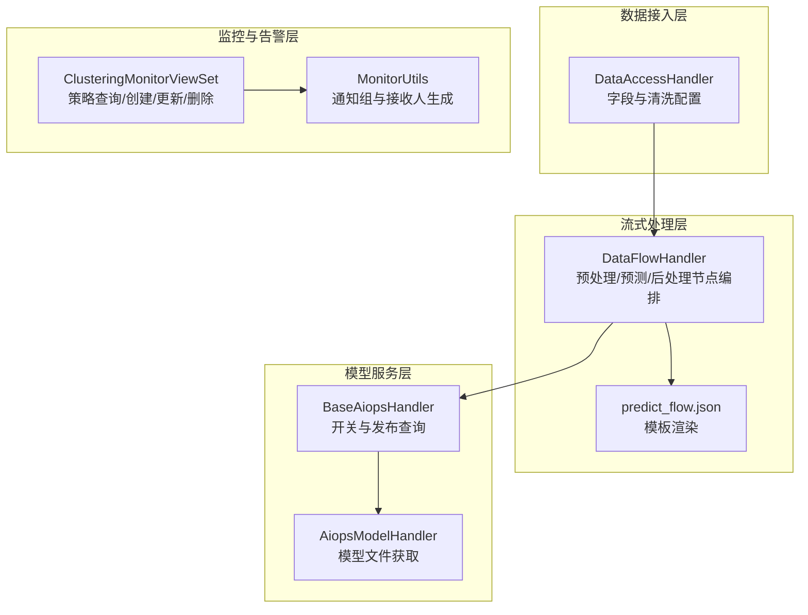
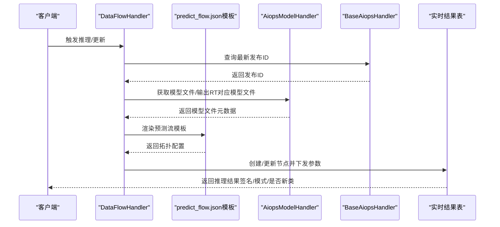
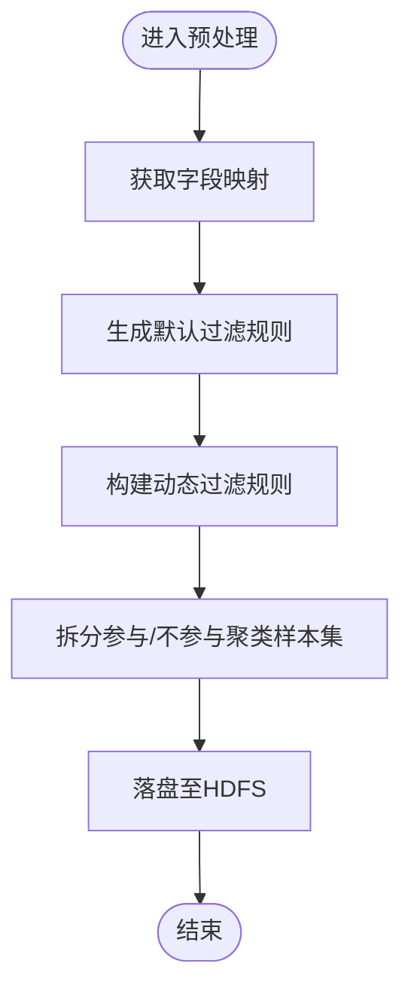
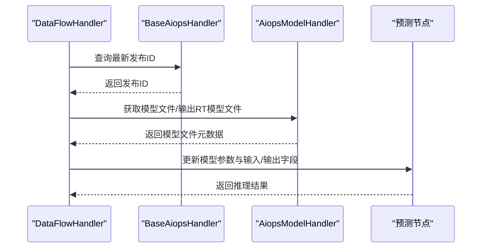
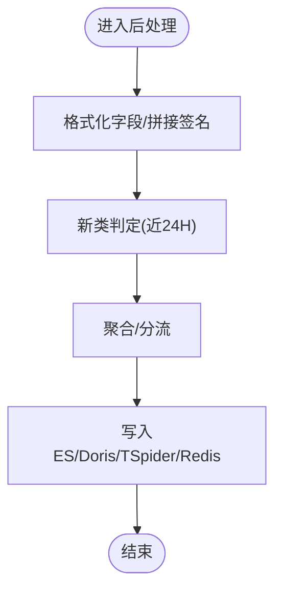
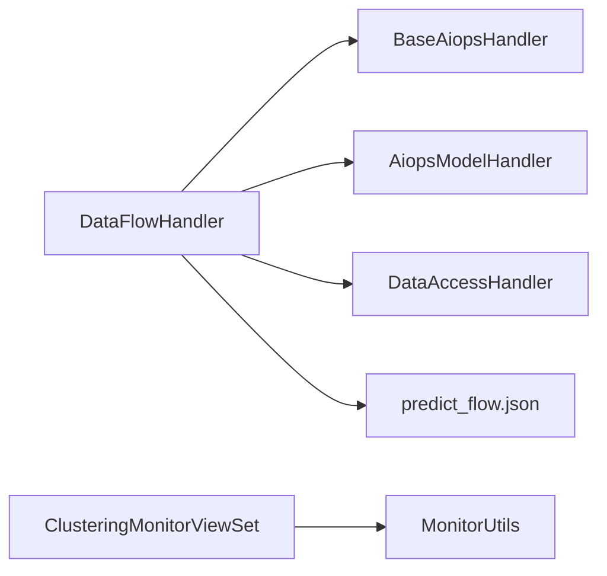

# 实时推理

<cite>
**本文引用的文件**
- [apps/log_clustering/handlers/dataflow/dataflow_handler.py](file://apps/log_clustering/handlers/dataflow/dataflow_handler.py)
- [apps/log_clustering/handlers/aiops/base.py](file://apps/log_clustering/handlers/aiops/base.py)
- [apps/log_clustering/handlers/aiops/aiops_model/aiops_model_handler.py](file://apps/log_clustering/handlers/aiops/aiops_model/aiops_model_handler.py)
- [apps/log_clustering/handlers/data_access/data_access.py](file://apps/log_clustering/handlers/data_access/data_access.py)
- [apps/log_clustering/constants.py](file://apps/log_clustering/constants.py)
- [apps/log_clustering/views/clustering_monitor_views.py](file://apps/log_clustering/views/clustering_monitor_views.py)
- [apps/log_clustering/utils/monitor.py](file://apps/log_cl_clustering/utils/monitor.py)
- [templates/flow/predict_flow.json](file://templates/flow/predict_flow.json)
</cite>

## 目录
1. [简介](#简介)
2. [项目结构](#项目结构)
3. [核心组件](#核心组件)
4. [架构总览](#架构总览)
5. [详细组件分析](#详细组件分析)
6. [依赖分析](#依赖分析)
7. [性能考量](#性能考量)
8. [故障排查指南](#故障排查指南)
9. [结论](#结论)
10. [附录：实时推理API与使用示例](#附录实时推理api与使用示例)

## 简介
本文件面向“聚类算法的实时推理模块”，系统化阐述实时日志聚类推理的实现原理、服务架构、性能优化策略、后处理与过滤机制、扩展与负载均衡方案，以及推理服务的API接口与使用示例。目标读者既包括一线研发工程师，也包括需要理解整体流程的非技术读者。

## 项目结构
围绕实时推理的关键模块，主要涉及以下层次：
- 数据接入层：负责从采集/ETL结果表读取原始日志字段，构建清洗与存储配置。
- 流式数据处理层：基于计算平台DataFlow，构建预处理、聚类预测、后处理等实时节点。
- AI/模型服务层：对接AIOPS模型发布与加载，支持模型参数动态下发与模型文件获取。
- 监控与告警层：提供策略管理、通知组生成、告警策略创建与更新能力。
- 模板与配置层：以JSON模板渲染方式生成DataFlow拓扑，确保可复用与可维护性。

图表来源
- [apps/log_clustering/handlers/data_access/data_access.py:46-232](file://apps/log_clustering/handlers/data_access/data_access.py#L46-L232)
- [apps/log_clustering/handlers/dataflow/dataflow_handler.py:124-1200](file://apps/log_clustering/handlers/dataflow/dataflow_handler.py#L124-L1200)
- [apps/log_clustering/handlers/aiops/base.py:33-75](file://apps/log_clustering/handlers/aiops/base.py#L33-L75)
- [apps/log_clustering/handlers/aiops/aiops_model/aiops_model_handler.py:33-59](file://apps/log_clustering/handlers/aiops/aiops_model/aiops_model_handler.py#L33-L59)
- [apps/log_clustering/views/clustering_monitor_views.py:38-190](file://apps/log_clustering/views/clustering_monitor_views.py#L38-L190)
- [apps/log_clustering/utils/monitor.py:38-89](file://apps/log_clustering/utils/monitor.py#L38-L89)
- [templates/flow/predict_flow.json:1-645](file://templates/flow/predict_flow.json#L1-L645)

章节来源
- [apps/log_clustering/handlers/data_access/data_access.py:46-232](file://apps/log_clustering/handlers/data_access/data_access.py#L46-L232)
- [apps/log_clustering/handlers/dataflow/dataflow_handler.py:124-1200](file://apps/log_clustering/handlers/dataflow/dataflow_handler.py#L124-L1200)
- [apps/log_clustering/handlers/aiops/base.py:33-75](file://apps/log_clustering/handlers/aiops/base.py#L33-L75)
- [apps/log_clustering/handlers/aiops/aiops_model/aiops_model_handler.py:33-59](file://apps/log_clustering/handlers/aiops/aiops_model/aiops_model_handler.py#L33-L59)
- [apps/log_clustering/views/clustering_monitor_views.py:38-190](file://apps/log_clustering/views/clustering_monitor_views.py#L38-L190)
- [apps/log_clustering/utils/monitor.py:38-89](file://apps/log_clustering/utils/monitor.py#L38-L89)
- [templates/flow/predict_flow.json:1-645](file://templates/flow/predict_flow.json#L1-L645)

## 核心组件
- 数据接入与字段映射
  - 依据采集配置或索引集字段，生成字段字典，用于SQL过滤规则构建与节点字段选择。
- 预处理流（Pre-Treat）
  - 将原始日志转换为目标聚类字段，按过滤规则拆分“参与聚类”与“不参与聚类”的样本集，并落盘至HDFS。
- 预测流（Predict）
  - 加载已发布模型，将预处理后的样本集送入模型进行实时推理，输出聚类标签、签名、模式等字段。
- 后处理流（After-Treat）
  - 对预测结果进行格式化、签名拼接、新类判定（近24小时）、聚合与分流，最终写入ES/Doris等存储。
- 模型与发布
  - 通过AIOPS查询最新发布版本，支持模型参数动态下发与模型文件获取。
- 监控与告警
  - 提供新类与数量突增两类策略的查询、创建、更新与删除；自动为索引集生成通知组并绑定接收人。

章节来源
- [apps/log_clustering/handlers/dataflow/dataflow_handler.py:150-163](file://apps/log_clustering/handlers/dataflow/dataflow_handler.py#L150-L163)
- [apps/log_clustering/handlers/dataflow/dataflow_handler.py:281-323](file://apps/log_clustering/handlers/dataflow/dataflow_handler.py#L281-L323)
- [apps/log_clustering/handlers/dataflow/dataflow_handler.py:1456-1482](file://apps/log_clustering/handlers/dataflow/dataflow_handler.py#L1456-L1482)
- [apps/log_clustering/handlers/dataflow/dataflow_handler.py:356-472](file://apps/log_clustering/handlers/dataflow/dataflow_handler.py#L356-L472)
- [apps/log_clustering/handlers/aiops/base.py:51-71](file://apps/log_clustering/handlers/aiops/base.py#L51-L71)
- [apps/log_clustering/handlers/aiops/aiops_model/aiops_model_handler.py:34-58](file://apps/log_clustering/handlers/aiops/aiops_model/aiops_model_handler.py#L34-L58)
- [apps/log_clustering/views/clustering_monitor_views.py:89-170](file://apps/log_clustering/views/clustering_monitor_views.py#L89-L170)
- [apps/log_clustering/utils/monitor.py:65-82](file://apps/log_clustering/utils/monitor.py#L65-L82)

## 架构总览
实时推理采用“模板驱动 + 节点编排”的架构：
- 通过JSON模板定义DataFlow拓扑，包含“参与聚类日志”“聚类预测”“签名字段打平”等节点。
- 预处理阶段将原始字段映射到聚类字段，构造过滤规则；预测阶段加载模型并下发参数；后处理阶段完成格式化、新类判定与存储。
- 模型发布与参数更新由AIOPS与DataFlow协同完成，支持热更新与弹性资源配置。

图表来源
- [apps/log_clustering/handlers/dataflow/dataflow_handler.py:124-1200](file://apps/log_clustering/handlers/dataflow/dataflow_handler.py#L124-L1200)
- [apps/log_clustering/handlers/aiops/base.py:51-71](file://apps/log_clustering/handlers/aiops/base.py#L51-L71)
- [apps/log_clustering/handlers/aiops/aiops_model/aiops_model_handler.py:34-58](file://apps/log_clustering/handlers/aiops/aiops_model/aiops_model_handler.py#L34-L58)
- [templates/flow/predict_flow.json:1-645](file://templates/flow/predict_flow.json#L1-L645)

## 详细组件分析

### 预处理流（Pre-Treat）与过滤规则
- 字段映射与默认过滤
  - 将维度字段映射到聚类字段，构造“默认过滤规则”（如聚类字段非空且长度>1），确保仅对有效日志参与聚类。
- 动态过滤规则
  - 支持多字段、多逻辑操作符（包含/不包含、等于/不等于等），并支持嵌套字段JSON提取，最终拼接为WHERE子句。
- 节点拆分
  - “参与聚类”样本集与“不参与聚类”样本集分别落盘至HDFS，便于后续模型训练与对比分析。

图表来源
- [apps/log_clustering/handlers/dataflow/dataflow_handler.py:197-280](file://apps/log_clustering/handlers/dataflow/dataflow_handler.py#L197-L280)
- [apps/log_clustering/handlers/dataflow/dataflow_handler.py:281-323](file://apps/log_clustering/handlers/dataflow/dataflow_handler.py#L281-L323)

章节来源
- [apps/log_clustering/handlers/dataflow/dataflow_handler.py:197-280](file://apps/log_clustering/handlers/dataflow/dataflow_handler.py#L197-L280)
- [apps/log_clustering/handlers/dataflow/dataflow_handler.py:281-323](file://apps/log_clustering/handlers/dataflow/dataflow_handler.py#L281-L323)

### 预测流（Predict）与模型参数
- 模型加载
  - 通过AIOPS查询最新发布ID，确保推理使用最新模型。
- 参数下发
  - 将聚类训练参数（如最小簇大小、最大距离列表、是否区分大小写等）注入预测节点，支持在线更新。
- 输出字段
  - 输出字段集合根据模型输出动态扩展，统一标记输出标记位，便于后处理阶段识别。

图表来源
- [apps/log_clustering/handlers/dataflow/dataflow_handler.py:150-163](file://apps/log_clustering/handlers/dataflow/dataflow_handler.py#L150-L163)
- [apps/log_clustering/handlers/dataflow/dataflow_handler.py:789-836](file://apps/log_clustering/handlers/dataflow/dataflow_handler.py#L789-L836)
- [apps/log_clustering/handlers/aiops/base.py:51-71](file://apps/log_clustering/handlers/aiops/base.py#L51-L71)
- [apps/log_clustering/handlers/aiops/aiops_model/aiops_model_handler.py:34-58](file://apps/log_clustering/handlers/aiops/aiops_model/aiops_model_handler.py#L34-L58)

章节来源
- [apps/log_clustering/handlers/dataflow/dataflow_handler.py:150-163](file://apps/log_clustering/handlers/dataflow/dataflow_handler.py#L150-L163)
- [apps/log_clustering/handlers/dataflow/dataflow_handler.py:789-836](file://apps/log_clustering/handlers/dataflow/dataflow_handler.py#L789-L836)
- [apps/log_clustering/handlers/aiops/base.py:51-71](file://apps/log_clustering/handlers/aiops/base.py#L51-L71)
- [apps/log_clustering/handlers/aiops/aiops_model/aiops_model_handler.py:34-58](file://apps/log_clustering/handlers/aiops/aiops_model/aiops_model_handler.py#L34-L58)

### 后处理流（After-Treat）与结果后处理
- 格式化与签名拼接
  - 将预测输出字段标准化，拼接签名字段，形成最终输出。
- 新类判定
  - 对近24小时内的事件进行特殊标记，避免首次启动时产生大量异常新类噪声。
- 聚合与分流
  - 对结果进行聚合与分流，写入ES或Doris存储，同时支持TSpider回流与Redis队列。

图表来源
- [apps/log_clustering/handlers/dataflow/dataflow_handler.py:356-472](file://apps/log_clustering/handlers/dataflow/dataflow_handler.py#L356-L472)
- [apps/log_clustering/constants.py:27-42](file://apps/log_clustering/constants.py#L27-L42)

章节来源
- [apps/log_clustering/handlers/dataflow/dataflow_handler.py:356-472](file://apps/log_clustering/handlers/dataflow/dataflow_handler.py#L356-L472)
- [apps/log_clustering/constants.py:27-42](file://apps/log_clustering/constants.py#L27-L42)

### 数据接入与字段映射
- 字段来源
  - 若为采集项：从采集配置获取全量字段；否则从索引集字段中获取。
- 字段去重与清洗
  - 去除解析失败字段，保证字段唯一性与一致性。
- Kafka/ES存储配置
  - 根据结果表存储配置，补充ES索引字段、过期时间、副本与doc_values等信息，确保查询与存储一致性。

章节来源
- [apps/log_clustering/handlers/data_access/data_access.py:160-188](file://apps/log_clustering/handlers/data_access/data_access.py#L160-L188)
- [apps/log_clustering/handlers/data_access/data_access.py:212-232](file://apps/log_clustering/handlers/data_access/data_access.py#L212-L232)

### 模板与拓扑渲染
- 模板驱动
  - 使用Jinja2模板渲染DataFlow拓扑，确保节点配置可复用、可维护。
- 节点类型
  - 包含流式源、实时节点、模型节点、存储节点等，覆盖从数据接入到结果落库的完整链路。

章节来源
- [apps/log_clustering/handlers/dataflow/dataflow_handler.py:348-354](file://apps/log_clustering/handlers/dataflow/dataflow_handler.py#L348-L354)
- [templates/flow/predict_flow.json:1-645](file://templates/flow/predict_flow.json#L1-L645)

### 监控与告警
- 策略管理
  - 支持查询、创建/更新、删除两类策略：新类策略与数量突增策略。
- 通知组
  - 自动为索引集生成通知组，绑定维护人与默认通知渠道，确保告警触达。

章节来源
- [apps/log_clustering/views/clustering_monitor_views.py:89-170](file://apps/log_clustering/views/clustering_monitor_views.py#L89-L170)
- [apps/log_clustering/utils/monitor.py:65-82](file://apps/log_clustering/utils/monitor.py#L65-L82)

## 依赖分析
- 组件耦合
  - DataFlowHandler依赖AIOPS查询最新发布ID与模型文件，依赖模板渲染生成拓扑，依赖DataAccessHandler获取字段与存储配置。
  - 监控视图依赖策略模型与通知工具类，实现策略生命周期管理与通知组生成。
- 外部依赖
  - 计算平台API（DataFlow、AIOPS、Meta、Databus等）用于节点创建、模型发布与元数据查询。
  - 监控API用于通知组与告警策略管理。

图表来源
- [apps/log_clustering/handlers/dataflow/dataflow_handler.py:124-1200](file://apps/log_clustering/handlers/dataflow/dataflow_handler.py#L124-L1200)
- [apps/log_clustering/handlers/aiops/base.py:33-75](file://apps/log_clustering/handlers/aiops/base.py#L33-L75)
- [apps/log_clustering/handlers/aiops/aiops_model/aiops_model_handler.py:33-59](file://apps/log_clustering/handlers/aiops/aiops_model/aiops_model_handler.py#L33-L59)
- [apps/log_clustering/handlers/data_access/data_access.py:46-232](file://apps/log_clustering/handlers/data_access/data_access.py#L46-L232)
- [apps/log_clustering/views/clustering_monitor_views.py:38-190](file://apps/log_clustering/views/clustering_monitor_views.py#L38-L190)
- [apps/log_clustering/utils/monitor.py:38-89](file://apps/log_clustering/utils/monitor.py#L38-L89)
- [templates/flow/predict_flow.json:1-645](file://templates/flow/predict_flow.json#L1-L645)

## 性能考量
- 资源弹性与执行配置
  - 支持Flink/Spark两种运行环境的资源参数下发（批大小、CPU/内存、Worker数量、副本数等），按环境动态调整。
- 过滤前置与字段裁剪
  - 在预处理阶段尽早过滤无效日志与冗余字段，减少下游模型与存储压力。
- 存储与索引优化
  - ES存储配置中设置doc_values字段、分析字段与过期时间，提升查询与归档效率。
- 模板复用与增量更新
  - 通过模板渲染与节点增量更新，降低拓扑变更成本，缩短上线周期。

章节来源
- [apps/log_clustering/handlers/dataflow/dataflow_handler.py:693-726](file://apps/log_clustering/handlers/dataflow/dataflow_handler.py#L693-L726)
- [apps/log_clustering/handlers/dataflow/dataflow_handler.py:197-280](file://apps/log_clustering/handlers/dataflow/dataflow_handler.py#L197-L280)
- [apps/log_clustering/handlers/data_access/data_access.py:54-56](file://apps/log_clustering/handlers/data_access/data_access.py#L54-L56)
- [apps/log_clustering/handlers/data_access/data_access.py:570-588](file://apps/log_clustering/handlers/data_access/data_access.py#L570-L588)

## 故障排查指南
- 开关与权限
  - 若聚类功能关闭，初始化将抛出异常；确认FeatureToggle开关状态与项目配置。
- 发布ID缺失
  - 若AIOPS未找到最新发布ID，将抛出异常；检查模型发布状态与项目ID配置。
- 存储配置缺失
  - 若ES存储配置不存在，后处理阶段会报错；检查结果表存储配置与集群授权。
- 节点更新失败
  - 若找不到目标节点或SQL拼接错误，需检查模板渲染结果与节点表名前缀匹配情况。
- 告警策略
  - 若策略查询为空，检查策略类型与索引集是否存在；若创建失败，检查通知组与接收人配置。

章节来源
- [apps/log_clustering/handlers/aiops/base.py:33-37](file://apps/log_clustering/handlers/aiops/base.py#L33-L37)
- [apps/log_clustering/handlers/aiops/base.py:60-71](file://apps/log_clustering/handlers/aiops/base.py#L60-L71)
- [apps/log_clustering/handlers/dataflow/dataflow_handler.py:452-472](file://apps/log_clustering/handlers/dataflow/dataflow_handler.py#L452-L472)
- [apps/log_clustering/views/clustering_monitor_views.py:113-123](file://apps/log_clustering/views/clustering_monitor_views.py#L113-L123)

## 结论
实时推理模块通过“模板驱动 + 节点编排 + AIOPS模型发布”的组合，实现了从日志接入到聚类结果输出的全链路自动化。其关键优势在于：
- 高度可配置：过滤规则、模型参数、存储配置均可在线调整。
- 可观测与可运维：模板化拓扑、策略化告警、通知组自动管理。
- 可扩展与弹性：支持Flink/Spark双引擎、资源参数动态下发、存储多后端。

## 附录：实时推理API与使用示例

### API概览
- 获取通知组
  - 方法：POST
  - 路径：/clustering_monitor/{index_set_id}/search_user_groups/
  - 请求体：包含业务ID与通知组ID列表
  - 响应：通知组列表
- 获取告警策略
  - 方法：GET
  - 路径：/clustering_monitor/{index_set_id}/get_strategy/?strategy_type={strategy_type}
  - 响应：策略详情（阈值、周期、级别、通知组）
- 创建/更新新类策略
  - 方法：POST
  - 路径：/clustering_monitor/{index_set_id}/new_cls_strategy/
  - 请求体：策略参数（阈值、周期、级别、通知组）
  - 响应：策略ID
- 创建/更新数量突增策略
  - 方法：POST
  - 路径：/clustering_monitor/{index_set_id}/normal_strategy/
  - 请求体：策略参数（阈值、周期、级别、通知组）
  - 响应：策略ID
- 删除告警策略
  - 方法：DELETE
  - 路径：/clustering_monitor/{index_set_id}/
  - 请求体：策略类型
  - 响应：策略ID

章节来源
- [apps/log_clustering/views/clustering_monitor_views.py:41-87](file://apps/log_clustering/views/clustering_monitor_views.py#L41-L87)
- [apps/log_clustering/views/clustering_monitor_views.py:89-123](file://apps/log_clustering/views/clustering_monitor_views.py#L89-L123)
- [apps/log_clustering/views/clustering_monitor_views.py:125-146](file://apps/log_clustering/views/clustering_monitor_views.py#L125-L146)
- [apps/log_clustering/views/clustering_monitor_views.py:148-170](file://apps/log_clustering/views/clustering_monitor_views.py#L148-L170)
- [apps/log_clustering/views/clustering_monitor_views.py:172-190](file://apps/log_clustering/views/clustering_monitor_views.py#L172-L190)

### 使用示例（步骤说明）
- 步骤1：准备索引集与聚类配置
  - 确认索引集字段、过滤规则、聚类字段与模型参数。
- 步骤2：启动预处理流
  - 生成过滤规则，拆分样本集，落盘至HDFS。
- 步骤3：启动预测流
  - 查询最新模型发布ID，渲染模板，更新预测节点参数，启动推理。
- 步骤4：启动后处理流
  - 格式化输出、新类判定、聚合分流，写入ES/Doris。
- 步骤5：配置告警策略
  - 通过接口创建新类与数量突增策略，绑定通知组。

章节来源
- [apps/log_clustering/handlers/dataflow/dataflow_handler.py:124-1200](file://apps/log_clustering/handlers/dataflow/dataflow_handler.py#L124-L1200)
- [apps/log_clustering/views/clustering_monitor_views.py:89-170](file://apps/log_clustering/views/clustering_monitor_views.py#L89-L170)
- [apps/log_clustering/utils/monitor.py:65-82](file://apps/log_clustering/utils/monitor.py#L65-L82)