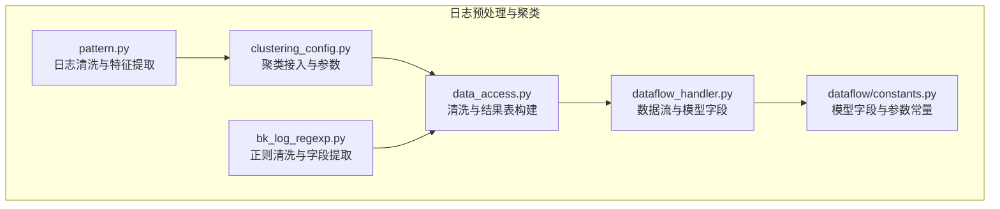
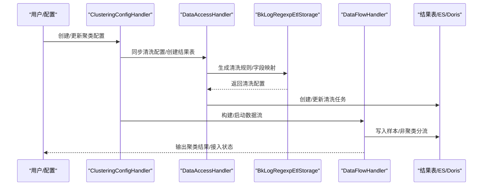
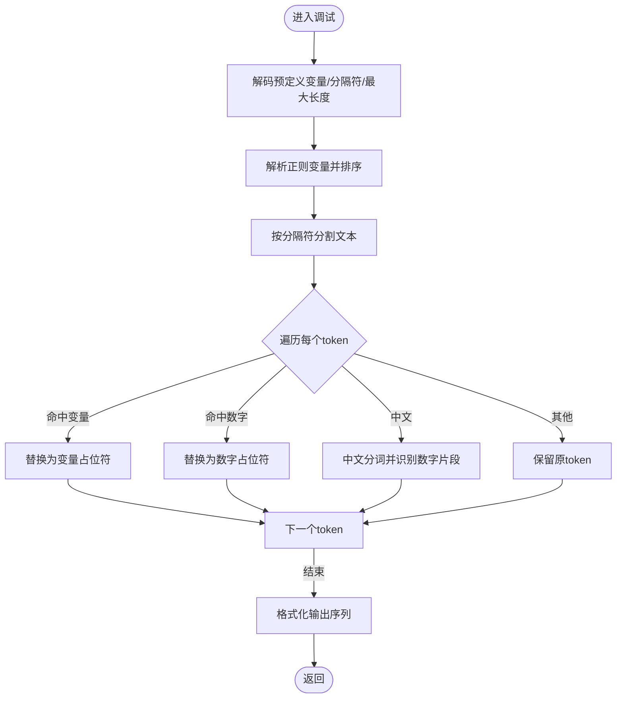
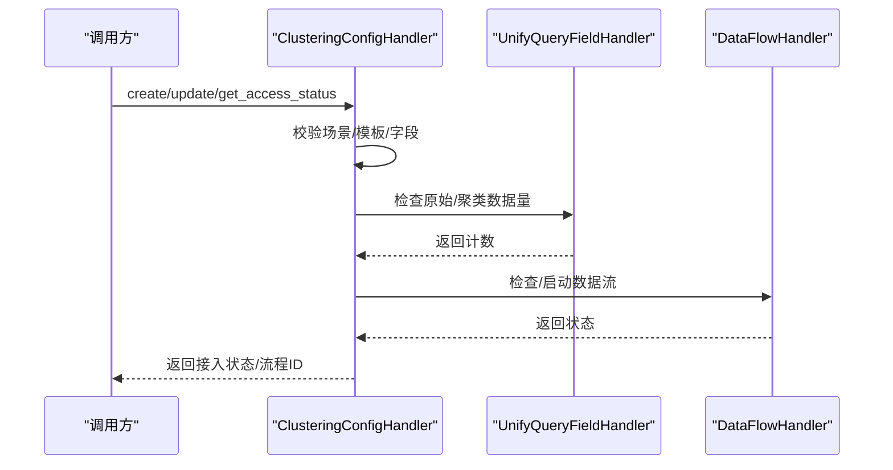
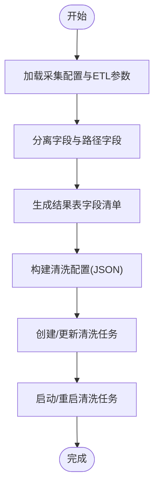
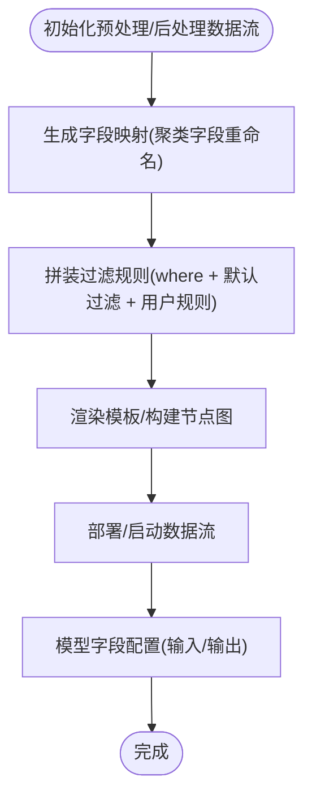
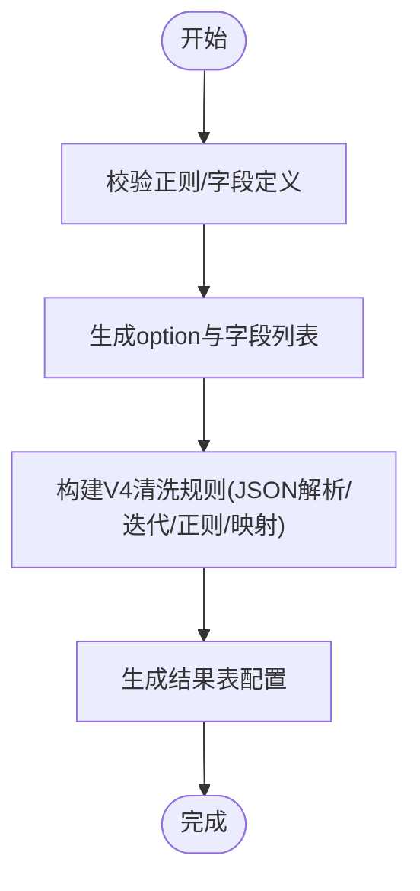
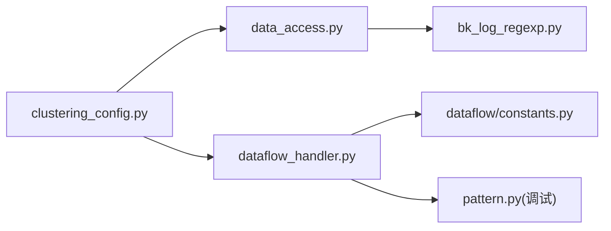

# 数据预处理

<cite>
**本文引用的文件**
- [apps/log_clustering/utils/pattern.py](file://apps/log_clustering/utils/pattern.py)
- [apps/log_clustering/handlers/clustering_config.py](file://apps/log_clustering/handlers/clustering_config.py)
- [apps/log_clustering/handlers/data_access/data_access.py](file://apps/log_clustering/handlers/data_access/data_access.py)
- [apps/log_clustering/handlers/dataflow/constants.py](file://apps/log_clustering/handlers/dataflow/constants.py)
- [apps/log_clustering/handlers/dataflow/dataflow_handler.py](file://apps/log_clustering/handlers/dataflow/dataflow_handler.py)
- [apps/log_databus/handlers/etl_storage/bk_log_regexp.py](file://apps/log_databus/handlers/etl_storage/bk_log_regexp.py)
</cite>

## 目录
1. [简介](#简介)
2. [项目结构](#项目结构)
3. [核心组件](#核心组件)
4. [架构总览](#架构总览)
5. [详细组件分析](#详细组件分析)
6. [依赖分析](#依赖分析)
7. [性能考虑](#性能考虑)
8. [故障排查指南](#故障排查指南)
9. [结论](#结论)
10. [附录](#附录)

## 简介
本文件面向“聚类算法的数据预处理模块”，系统性阐述日志数据的预处理流程，包括日志清洗、标准化、特征提取、格式转换与向量化、异常值检测与数据质量控制、特征选择与降维应用、性能优化与配置调优等。文档基于仓库中的聚类与数据清洗相关实现，结合数据流与ETL处理链路，提供可操作的实践指导。

## 项目结构
围绕数据预处理的关键模块与文件如下：
- 预处理与特征工程：apps/log_clustering/utils/pattern.py
- 聚类接入与参数管理：apps/log_clustering/handlers/clustering_config.py
- 清洗与结果表构建：apps/log_clustering/handlers/data_access/data_access.py
- 数据流与模型字段定义：apps/log_clustering/handlers/dataflow/constants.py、apps/log_clustering/handlers/dataflow/dataflow_handler.py
- 正则清洗与字段提取：apps/log_databus/handlers/etl_storage/bk_log_regexp.py

**图表来源**
- [apps/log_clustering/utils/pattern.py:1-182](file://apps/log_clustering/utils/pattern.py#L1-L182)
- [apps/log_clustering/handlers/clustering_config.py:100-213](file://apps/log_clustering/handlers/clustering_config.py#L100-L213)
- [apps/log_clustering/handlers/data_access/data_access.py:102-188](file://apps/log_clustering/handlers/data_access/data_access.py#L102-L188)
- [apps/log_clustering/handlers/dataflow/dataflow_handler.py:150-163](file://apps/log_clustering/handlers/dataflow/dataflow_handler.py#L150-L163)
- [apps/log_clustering/handlers/dataflow/constants.py:1110-1123](file://apps/log_clustering/handlers/dataflow/constants.py#L1110-L1123)
- [apps/log_databus/handlers/etl_storage/bk_log_regexp.py:121-158](file://apps/log_databus/handlers/etl_storage/bk_log_regexp.py#L121-L158)

**章节来源**
- [apps/log_clustering/utils/pattern.py:1-182](file://apps/log_clustering/utils/pattern.py#L1-L182)
- [apps/log_clustering/handlers/clustering_config.py:100-213](file://apps/log_clustering/handlers/clustering_config.py#L100-L213)
- [apps/log_clustering/handlers/data_access/data_access.py:102-188](file://apps/log_clustering/handlers/data_access/data_access.py#L102-L188)
- [apps/log_clustering/handlers/dataflow/constants.py:1110-1123](file://apps/log_clustering/handlers/dataflow/constants.py#L1110-L1123)
- [apps/log_clustering/handlers/dataflow/dataflow_handler.py:150-163](file://apps/log_clustering/handlers/dataflow/dataflow_handler.py#L150-L163)
- [apps/log_databus/handlers/etl_storage/bk_log_regexp.py:121-158](file://apps/log_databus/handlers/etl_storage/bk_log_regexp.py#L121-L158)

## 核心组件
- 日志清洗与特征提取（pattern.py）
  - 支持预定义变量正则匹配、数字/标点过滤、分词与中文分词、最大长度截断、大小写敏感控制等。
  - 提供调试接口，便于快速验证正则与分隔符效果。
- 聚类接入与参数管理（clustering_config.py）
  - 负责聚类配置创建、更新、接入状态检查；对接清洗与数据流；提供正则模板与字段校验。
- 清洗与结果表构建（data_access.py）
  - 将采集配置转换为清洗任务，生成结果表字段清单，处理路径字段与时间字段，启动/停止清洗任务。
- 数据流与模型字段（dataflow_handler.py、constants.py）
  - 定义模型输入/输出字段、聚类字段映射、过滤规则SQL拼装、数据流节点与模板渲染、执行资源配置。
- 正则清洗与字段提取（bk_log_regexp.py）
  - 提供正则字段提取预览、V4清洗链路构建、结果表配置生成与字段映射。

**章节来源**
- [apps/log_clustering/utils/pattern.py:83-181](file://apps/log_clustering/utils/pattern.py#L83-L181)
- [apps/log_clustering/handlers/clustering_config.py:100-213](file://apps/log_clustering/handlers/clustering_config.py#L100-L213)
- [apps/log_clustering/handlers/data_access/data_access.py:102-188](file://apps/log_clustering/handlers/data_access/data_access.py#L102-L188)
- [apps/log_clustering/handlers/dataflow/dataflow_handler.py:150-163](file://apps/log_clustering/handlers/dataflow/dataflow_handler.py#L150-L163)
- [apps/log_clustering/handlers/dataflow/constants.py:1110-1123](file://apps/log_clustering/handlers/dataflow/constants.py#L1110-L1123)
- [apps/log_databus/handlers/etl_storage/bk_log_regexp.py:121-158](file://apps/log_databus/handlers/etl_storage/bk_log_regexp.py#L121-L158)

## 架构总览
数据预处理从采集到聚类的整体流程如下：

**图表来源**
- [apps/log_clustering/handlers/clustering_config.py:100-213](file://apps/log_clustering/handlers/clustering_config.py#L100-L213)
- [apps/log_clustering/handlers/data_access/data_access.py:102-188](file://apps/log_clustering/handlers/data_access/data_access.py#L102-L188)
- [apps/log_databus/handlers/etl_storage/bk_log_regexp.py:121-158](file://apps/log_databus/handlers/etl_storage/bk_log_regexp.py#L121-L158)
- [apps/log_clustering/handlers/dataflow/dataflow_handler.py:124-163](file://apps/log_clustering/handlers/dataflow/dataflow_handler.py#L124-L163)

## 详细组件分析

### 日志清洗与特征提取（pattern.py）
- 功能要点
  - 预定义变量正则解析与排序，区分数字/字符类变量。
  - 文本分词与正则替换，保留变量占位符，剔除标点与空白。
  - 中文分词支持，按需切分并识别数字片段。
  - 最大日志长度限制与大小写敏感开关。
  - 调试接口：解码参数、解析正则、分词与格式化输出。
- 关键流程

**图表来源**
- [apps/log_clustering/utils/pattern.py:162-181](file://apps/log_clustering/utils/pattern.py#L162-L181)

**章节来源**
- [apps/log_clustering/utils/pattern.py:22-40](file://apps/log_clustering/utils/pattern.py#L22-L40)
- [apps/log_clustering/utils/pattern.py:83-159](file://apps/log_clustering/utils/pattern.py#L83-L159)
- [apps/log_clustering/utils/pattern.py:162-181](file://apps/log_clustering/utils/pattern.py#L162-L181)

### 聚类接入与参数管理（clustering_config.py）
- 功能要点
  - 创建聚类配置：校验场景、选择小型化链路、读取清洗配置、合并默认参数、持久化配置并异步接入。
  - 更新聚类配置：构建更新流程、重启数据流、记录任务记录。
  - 接入状态检查：检查原始数据与聚类输出、数据流运行状态、任务详情。
  - 正则模板与字段校验：根据模板注入预定义变量，校验聚类字段存在性。
- 关键流程

**图表来源**
- [apps/log_clustering/handlers/clustering_config.py:100-213](file://apps/log_clustering/handlers/clustering_config.py#L100-L213)
- [apps/log_clustering/handlers/clustering_config.py:307-394](file://apps/log_clustering/handlers/clustering_config.py#L307-L394)
- [apps/log_clustering/handlers/clustering_config.py:434-446](file://apps/log_clustering/handlers/clustering_config.py#L434-L446)

**章节来源**
- [apps/log_clustering/handlers/clustering_config.py:100-213](file://apps/log_clustering/handlers/clustering_config.py#L100-L213)
- [apps/log_clustering/handlers/clustering_config.py:307-394](file://apps/log_clustering/handlers/clustering_config.py#L307-L394)
- [apps/log_clustering/handlers/clustering_config.py:434-446](file://apps/log_clustering/handlers/clustering_config.py#L434-L446)

### 清洗与结果表构建（data_access.py）
- 功能要点
  - 将采集配置转换为清洗任务，生成结果表字段清单（去重、剔除解析失败字段）。
  - 处理路径字段与分隔符正则，追加时间字段，统一结果表命名。
  - 启停清洗任务，授权存储集群。
- 关键流程

**图表来源**
- [apps/log_clustering/handlers/data_access/data_access.py:102-188](file://apps/log_clustering/handlers/data_access/data_access.py#L102-L188)

**章节来源**
- [apps/log_clustering/handlers/data_access/data_access.py:85-101](file://apps/log_clustering/handlers/data_access/data_access.py#L85-L101)
- [apps/log_clustering/handlers/data_access/data_access.py:102-188](file://apps/log_clustering/handlers/data_access/data_access.py#L102-L188)

### 数据流与模型字段（dataflow_handler.py、constants.py）
- 功能要点
  - 在线训练参数：最小簇大小、阈值列表、深度、分隔符、最大长度、大小写敏感、预定义变量。
  - 字段映射与过滤：聚类字段重命名、DIST字段映射、默认过滤规则（非空、长度>1）、嵌套字段JSON提取。
  - 模型字段：输入/输出字段动态扩展，统一输出标记，按场景裁剪字段。
  - 执行资源配置：Spark/Flink资源参数，模型实例更新。
- 关键流程

**图表来源**
- [apps/log_clustering/handlers/dataflow/dataflow_handler.py:281-323](file://apps/log_clustering/handlers/dataflow/dataflow_handler.py#L281-L323)
- [apps/log_clustering/handlers/dataflow/dataflow_handler.py:356-472](file://apps/log_clustering/handlers/dataflow/dataflow_handler.py#L356-L472)
- [apps/log_clustering/handlers/dataflow/constants.py:1110-1123](file://apps/log_clustering/handlers/dataflow/constants.py#L1110-L1123)

**章节来源**
- [apps/log_clustering/handlers/dataflow/dataflow_handler.py:150-163](file://apps/log_clustering/handlers/dataflow/dataflow_handler.py#L150-L163)
- [apps/log_clustering/handlers/dataflow/dataflow_handler.py:198-239](file://apps/log_clustering/handlers/dataflow/dataflow_handler.py#L198-L239)
- [apps/log_clustering/handlers/dataflow/dataflow_handler.py:474-524](file://apps/log_clustering/handlers/dataflow/dataflow_handler.py#L474-L524)
- [apps/log_clustering/handlers/dataflow/constants.py:1110-1123](file://apps/log_clustering/handlers/dataflow/constants.py#L1110-L1123)

### 正则清洗与字段提取（bk_log_regexp.py）
- 功能要点
  - 字段提取预览：Python正则匹配与BkDataDatabusApi调试接口对比。
  - V4清洗链路：JSON解析 → 内置字段提取 → items迭代 → 原文提取 → 正则解析 → 字段映射 → 时间字段处理 → 路径字段处理。
  - 结果表配置：option与field_list生成，时间字段别名与选项。
- 关键流程

**图表来源**
- [apps/log_databus/handlers/etl_storage/bk_log_regexp.py:121-158](file://apps/log_databus/handlers/etl_storage/bk_log_regexp.py#L121-L158)
- [apps/log_databus/handlers/etl_storage/bk_log_regexp.py:160-268](file://apps/log_databus/handlers/etl_storage/bk_log_regexp.py#L160-L268)

**章节来源**
- [apps/log_databus/handlers/etl_storage/bk_log_regexp.py:36-69](file://apps/log_databus/handlers/etl_storage/bk_log_regexp.py#L36-L69)
- [apps/log_databus/handlers/etl_storage/bk_log_regexp.py:71-119](file://apps/log_databus/handlers/etl_storage/bk_log_regexp.py#L71-L119)
- [apps/log_databus/handlers/etl_storage/bk_log_regexp.py:121-158](file://apps/log_databus/handlers/etl_storage/bk_log_regexp.py#L121-L158)
- [apps/log_databus/handlers/etl_storage/bk_log_regexp.py:160-268](file://apps/log_databus/handlers/etl_storage/bk_log_regexp.py#L160-L268)

## 依赖分析
- 组件耦合
  - clustering_config.py 依赖 data_access.py 与 dataflow_handler.py，负责配置落地与接入状态检查。
  - data_access.py 依赖 EtlStorage 与 BkDataDatabusApi，负责清洗任务创建与启动。
  - dataflow_handler.py 依赖 constants.py 的模型字段与参数常量，负责数据流构建与执行配置。
  - pattern.py 为纯函数工具，被调试接口调用，不直接依赖其他模块。
  - bk_log_regexp.py 为 EtlStorage 实现，生成清洗配置供 data_access.py 使用。
- 外部依赖
  - BkData系列API：清洗、元数据、数据流、AIOPS。
  - Elasticsearch/Doris：存储与查询。
  - Kafka：清洗任务消费位置控制。

**图表来源**
- [apps/log_clustering/handlers/clustering_config.py:100-213](file://apps/log_clustering/handlers/clustering_config.py#L100-L213)
- [apps/log_clustering/handlers/data_access/data_access.py:102-188](file://apps/log_clustering/handlers/data_access/data_access.py#L102-L188)
- [apps/log_clustering/handlers/dataflow/dataflow_handler.py:150-163](file://apps/log_clustering/handlers/dataflow/dataflow_handler.py#L150-L163)
- [apps/log_clustering/handlers/dataflow/constants.py:1110-1123](file://apps/log_clustering/handlers/dataflow/constants.py#L1110-L1123)
- [apps/log_databus/handlers/etl_storage/bk_log_regexp.py:121-158](file://apps/log_databus/handlers/etl_storage/bk_log_regexp.py#L121-L158)
- [apps/log_clustering/utils/pattern.py:162-181](file://apps/log_clustering/utils/pattern.py#L162-L181)

**章节来源**
- [apps/log_clustering/handlers/clustering_config.py:100-213](file://apps/log_clustering/handlers/clustering_config.py#L100-L213)
- [apps/log_clustering/handlers/data_access/data_access.py:102-188](file://apps/log_clustering/handlers/data_access/data_access.py#L102-L188)
- [apps/log_clustering/handlers/dataflow/dataflow_handler.py:150-163](file://apps/log_clustering/handlers/dataflow/dataflow_handler.py#L150-L163)
- [apps/log_clustering/handlers/dataflow/constants.py:1110-1123](file://apps/log_clustering/handlers/dataflow/constants.py#L1110-L1123)
- [apps/log_databus/handlers/etl_storage/bk_log_regexp.py:121-158](file://apps/log_databus/handlers/etl_storage/bk_log_regexp.py#L121-L158)
- [apps/log_clustering/utils/pattern.py:162-181](file://apps/log_clustering/utils/pattern.py#L162-L181)

## 性能考虑
- 分词与正则匹配
  - 控制最大日志长度与分隔符复杂度，避免长文本与深层嵌套导致的匹配开销。
  - 数字/变量正则优先排序，减少重复匹配。
- 清洗任务
  - 仅在必要时重启清洗任务，避免频繁启停带来的延迟。
  - 合理设置消费位置（从尾部），降低冷启动时间。
- 数据流执行
  - Spark/Flink资源配置按环境动态调整，避免资源不足导致的排队与失败。
  - 模型字段动态扩展时，尽量复用默认字段，减少冗余列。
- 存储与查询
  - ES/Doris字段配置与索引字段优化，减少查询与写入压力。
  - 对高频字段开启doc_values与分析字段缓存。

[本节为通用性能建议，不直接分析具体文件]

## 故障排查指南
- 接入状态异常
  - 检查原始数据与聚类输出计数，确认清洗任务已启动并消费数据。
  - 核查数据流状态与最新部署状态，定位失败节点。
- 字段缺失或错误
  - 校验聚类字段是否存在于ETL字段列表，避免删除关键字段。
  - 检查正则表达式是否覆盖所有用户自定义字段。
- 清洗任务失败
  - 查看清洗任务启动参数与消费位置，确认Kafka Broker可达性。
  - 检查结果表字段去重与时间字段映射是否正确。
- 调试与验证
  - 使用正则调试接口快速验证变量与分隔符组合，定位问题范围。

**章节来源**
- [apps/log_clustering/handlers/clustering_config.py:307-394](file://apps/log_clustering/handlers/clustering_config.py#L307-L394)
- [apps/log_clustering/handlers/clustering_config.py:434-446](file://apps/log_clustering/handlers/clustering_config.py#L434-L446)
- [apps/log_clustering/handlers/data_access/data_access.py:180-210](file://apps/log_clustering/handlers/data_access/data_access.py#L180-L210)
- [apps/log_databus/handlers/etl_storage/bk_log_regexp.py:125-128](file://apps/log_databus/handlers/etl_storage/bk_log_regexp.py#L125-L128)

## 结论
该数据预处理模块通过“正则清洗 + 特征提取 + 数据流建模”的闭环，实现了从原始日志到聚类特征的高效转换。配合完善的参数管理、接入状态检查与调试能力，能够稳定支撑大规模日志聚类场景。建议在生产环境中持续优化正则与分词策略、合理配置执行资源，并建立完善的监控与告警体系。

[本节为总结性内容，不直接分析具体文件]

## 附录

### 数据预处理配置参数与调优方法
- 在线训练参数（来自常量）
  - 最小成员数、深度、阈值列表、分隔符、最大日志长度、大小写敏感、预定义变量。
- 字段与过滤规则
  - 聚类字段重命名、DIST字段映射、默认过滤规则（非空、长度>1）、嵌套字段JSON提取。
- 清洗配置
  - 正则表达式、保留原文、扁平化字段、时间字段别名与选项、V4清洗链路。
- 调优建议
  - 根据日志特点调整分隔符与变量正则，控制最大日志长度。
  - 通过调试接口验证正则命中率与分词效果。
  - 依据数据量与峰值流量调整Spark/Flink资源参数。

**章节来源**
- [apps/log_clustering/handlers/dataflow/constants.py:1110-1123](file://apps/log_clustering/handlers/dataflow/constants.py#L1110-L1123)
- [apps/log_clustering/handlers/dataflow/dataflow_handler.py:198-239](file://apps/log_clustering/handlers/dataflow/dataflow_handler.py#L198-L239)
- [apps/log_databus/handlers/etl_storage/bk_log_regexp.py:121-158](file://apps/log_databus/handlers/etl_storage/bk_log_regexp.py#L121-L158)