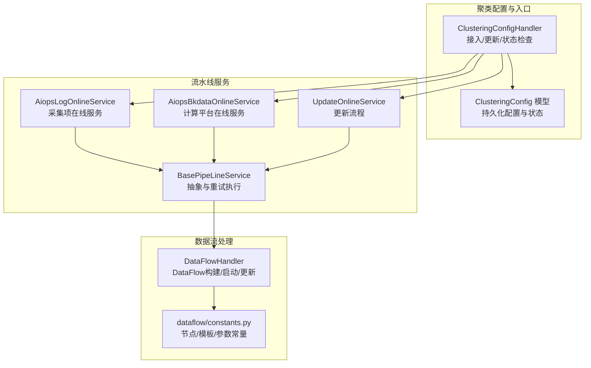
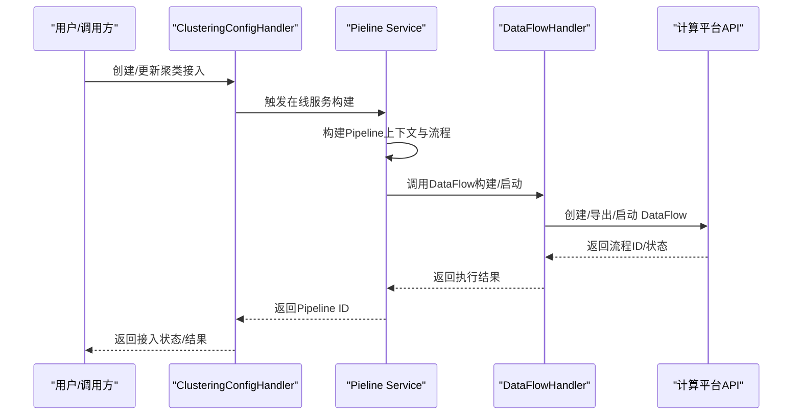
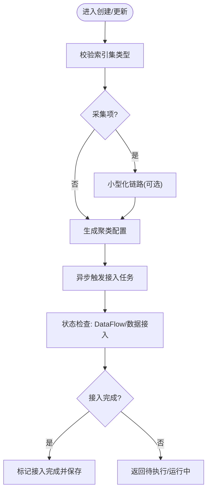
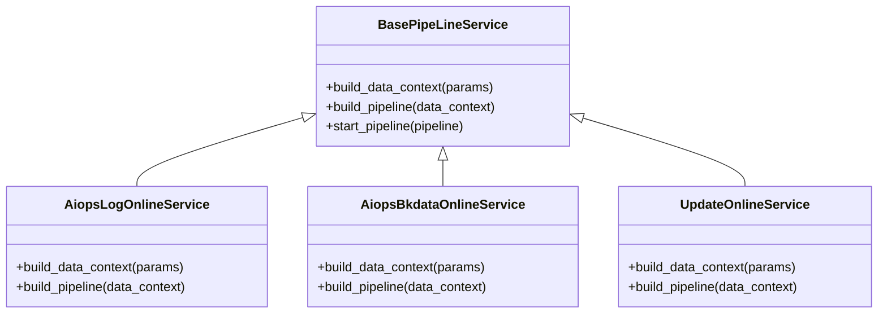
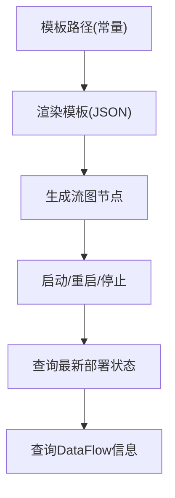
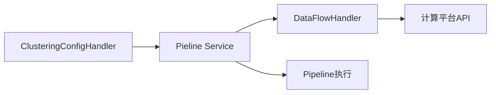

# 流水线集成

<cite>
**本文引用的文件**
- [apps/log_clustering/handlers/clustering_config.py](file://apps/log_clustering/handlers/clustering_config.py)
- [apps/log_clustering/handlers/pipline_service/aiops_service_online.py](file://apps/log_clustering/handlers/pipline_service/aiops_service_online.py)
- [apps/log_clustering/handlers/pipline_service/base_pipline_service.py](file://apps/log_clustering/handlers/pipline_service/base_pipline_service.py)
- [apps/log_clustering/handlers/pipline_service/constants.py](file://apps/log_clustering/handlers/pipline_service/constants.py)
- [apps/log_clustering/handlers/dataflow/dataflow_handler.py](file://apps/log_clustering/handlers/dataflow/dataflow_handler.py)
- [apps/log_clustering/handlers/dataflow/constants.py](file://apps/log_clustering/handlers/dataflow/constants.py)
- [apps/log_clustering/models.py](file://apps/log_clustering/models.py)
- [apps/log_clustering/constants.py](file://apps/log_clustering/constants.py)
</cite>

## 目录
1. [简介](#简介)
2. [项目结构](#项目结构)
3. [核心组件](#核心组件)
4. [架构总览](#架构总览)
5. [详细组件分析](#详细组件分析)
6. [依赖分析](#依赖分析)
7. [性能考虑](#性能考虑)
8. [故障排查指南](#故障排查指南)
9. [结论](#结论)
10. [附录](#附录)

## 简介
本技术文档聚焦“聚类算法的流水线集成模块”，系统性阐述聚类算法与数据处理流水线的集成方式，覆盖数据流转、处理协调、服务架构、组件通信、在线推理服务与部署策略、容错与重试机制、配置与监控方法，以及性能优化与扩展性设计。目标是帮助读者快速理解并高效运维该流水线体系。

## 项目结构
围绕聚类流水线的关键模块分布如下：
- 配置与入口：ClusteringConfigHandler 提供接入、更新、状态检查等能力，并触发流水线执行。
- 流水线服务：Pieline Service（AiopsLogOnlineService/AiopsBkdataOnlineService/UpdateOnlineService）基于 Pipeline 构建并调度具体流程。
- 数据流处理：DataFlowHandler 负责与计算平台对接，构建/导出/启动/更新 DataFlow，管理模型与节点。
- 模型与配置：ClusteringConfig 模型持久化聚类配置与任务状态；常量与默认参数集中于 constants 文件。

图表来源
- [apps/log_clustering/handlers/clustering_config.py](file://apps/log_clustering/handlers/clustering_config.py)
- [apps/log_clustering/handlers/pipline_service/aiops_service_online.py](file://apps/log_clustering/handlers/pipline_service/aiops_service_online.py)
- [apps/log_clustering/handlers/pipline_service/base_pipline_service.py](file://apps/log_clustering/handlers/pipline_service/base_pipline_service.py)
- [apps/log_clustering/handlers/dataflow/dataflow_handler.py](file://apps/log_clustering/handlers/dataflow/dataflow_handler.py)
- [apps/log_clustering/handlers/dataflow/constants.py](file://apps/log_clustering/handlers/dataflow/constants.py)
- [apps/log_clustering/models.py](file://apps/log_clustering/models.py)

章节来源
- [apps/log_clustering/handlers/clustering_config.py](file://apps/log_clustering/handlers/clustering_config.py)
- [apps/log_clustering/handlers/pipline_service/aiops_service_online.py](file://apps/log_clustering/handlers/pipline_service/aiops_service_online.py)
- [apps/log_clustering/handlers/dataflow/dataflow_handler.py](file://apps/log_clustering/handlers/dataflow/dataflow_handler.py)

## 核心组件
- ClusteringConfigHandler：负责聚类接入的创建、更新、状态检查与接入完成判定，触发流水线并记录任务轨迹。
- Pieline Service：封装不同场景下的流水线构建与执行，支持采集项与计算平台两类路径，以及更新流程。
- DataFlowHandler：面向计算平台的数据流编排与运行控制，负责节点构建、模板渲染、过滤规则更新、模型实例更新等。
- ClusteringConfig 模型：承载聚类配置、任务记录、DataFlow ID、结果表等关键状态。
- 常量与默认参数：统一管理节点类型、模板路径、模型字段、过滤规则等。

章节来源
- [apps/log_clustering/handlers/clustering_config.py](file://apps/log_clustering/handlers/clustering_config.py)
- [apps/log_clustering/handlers/pipline_service/aiops_service_online.py](file://apps/log_clustering/handlers/pipline_service/aiops_service_online.py)
- [apps/log_clustering/handlers/dataflow/dataflow_handler.py](file://apps/log_clustering/handlers/dataflow/dataflow_handler.py)
- [apps/log_clustering/models.py](file://apps/log_clustering/models.py)
- [apps/log_clustering/constants.py](file://apps/log_clustering/constants.py)

## 架构总览
整体架构由“配置入口”“流水线服务”“数据流处理”三层组成，形成“配置驱动—流程编排—数据流执行”的闭环。

图表来源
- [apps/log_clustering/handlers/clustering_config.py](file://apps/log_clustering/handlers/clustering_config.py)
- [apps/log_clustering/handlers/pipline_service/aiops_service_online.py](file://apps/log_clustering/handlers/pipline_service/aiops_service_online.py)
- [apps/log_clustering/handlers/dataflow/dataflow_handler.py](file://apps/log_clustering/handlers/dataflow/dataflow_handler.py)

## 详细组件分析

### 组件A：ClusteringConfigHandler（接入与状态）
职责与流程要点：
- 创建接入：根据索引集类型选择采集项或计算平台路径，校验存储与字段，生成聚类配置并异步触发接入任务。
- 更新接入：区分过滤规则、模型参数、聚类字段变更，按需构建更新流程并启动。
- 状态检查：检查 DataFlow 状态、最新部署状态与数据接入情况，判定接入完成与否。
- 在线启动：调用流水线服务执行创建或更新流程，记录任务轨迹。

图表来源
- [apps/log_clustering/handlers/clustering_config.py](file://apps/log_clustering/handlers/clustering_config.py)

章节来源
- [apps/log_clustering/handlers/clustering_config.py](file://apps/log_clustering/handlers/clustering_config.py)

### 组件B：Pieline Service（流水线服务）
职责与流程要点：
- 在线服务（采集项/计算平台）：分别构建包含数据源接入、ETL同步、预测流创建、日志计数聚合流与策略创建的完整流程。
- 更新服务：根据参数变更动态拼装更新流程，仅对变更项执行对应节点。
- 执行与重试：通过基类统一执行，并内置重试逻辑保障启动成功。

图表来源
- [apps/log_clustering/handlers/pipline_service/base_pipline_service.py](file://apps/log_clustering/handlers/pipline_service/base_pipline_service.py)
- [apps/log_clustering/handlers/pipline_service/aiops_service_online.py](file://apps/log_clustering/handlers/pipline_service/aiops_service_online.py)

章节来源
- [apps/log_clustering/handlers/pipline_service/aiops_service_online.py](file://apps/log_clustering/handlers/pipline_service/aiops_service_online.py)
- [apps/log_clustering/handlers/pipline_service/base_pipline_service.py](file://apps/log_clustering/handlers/pipline_service/base_pipline_service.py)

### 组件C：DataFlowHandler（数据流处理）
职责与流程要点：
- 模板渲染：基于模板路径渲染预处理/后处理/预测/聚合等 DataFlow JSON。
- 节点构建：生成流图节点（实时/模型/存储/分流等），支持过滤规则、字段映射、模型输入输出字段扩展。
- 运行控制：启动/重启/停止 DataFlow，查询最新部署状态与 DataFlow 信息。
- 参数与资源：根据环境（Flink/Spark）设置执行资源配置，兼容旧参数。

图表来源
- [apps/log_clustering/handlers/dataflow/dataflow_handler.py](file://apps/log_clustering/handlers/dataflow/dataflow_handler.py)
- [apps/log_clustering/handlers/dataflow/constants.py](file://apps/log_clustering/handlers/dataflow/constants.py)

章节来源
- [apps/log_clustering/handlers/dataflow/dataflow_handler.py](file://apps/log_clustering/handlers/dataflow/dataflow_handler.py)
- [apps/log_clustering/handlers/dataflow/constants.py](file://apps/log_clustering/handlers/dataflow/constants.py)

### 组件D：在线推理服务与部署策略
- 在线推理：通过 DataFlowHandler 启动预测流，结合模型实例与输入输出字段，实现在线聚类推理。
- 部署策略：根据环境变量选择 Flink 或 Spark 执行引擎，设置 CPU/内存/副本/Worker 等资源参数。
- 策略联动：创建日志数量聚合流与告警策略，支撑新类与数量突增告警。

章节来源
- [apps/log_clustering/handlers/dataflow/dataflow_handler.py](file://apps/log_clustering/handlers/dataflow/dataflow_handler.py)
- [apps/log_clustering/handlers/pipline_service/aiops_service_online.py](file://apps/log_clustering/handlers/pipline_service/aiops_service_online.py)

### 组件E：容错处理与重试机制
- 流程启动重试：Pieline Service 的启动方法内置重试，确保流程可靠启动。
- DataFlow 请求重试：DataFlowHandler 对关键 API 调用封装重试类，限定最大尝试次数与随机等待区间。
- 状态回查：通过 DataFlowHandler 查询最新部署状态与 DataFlow 信息，辅助定位异常。

章节来源
- [apps/log_clustering/handlers/pipline_service/base_pipline_service.py](file://apps/log_clustering/handlers/pipline_service/base_pipline_service.py)
- [apps/log_clustering/handlers/dataflow/dataflow_handler.py](file://apps/log_clustering/handlers/dataflow/dataflow_handler.py)

### 组件F：配置与监控
- 配置项：聚类字段、过滤规则、模型参数、存储类型（ES/Doris）、告警策略维度等。
- 监控指标：DataFlow 状态、最新部署状态、接入完成判定（原始数据/聚类数据存在性）。
- 告警策略：新类告警与数量突增告警，基于 Dist 字段与聚合维度配置。

章节来源
- [apps/log_clustering/models.py](file://apps/log_clustering/models.py)
- [apps/log_clustering/constants.py](file://apps/log_clustering/constants.py)
- [apps/log_clustering/handlers/clustering_config.py](file://apps/log_clustering/handlers/clustering_config.py)

## 依赖分析
- 组件耦合与协作：
  - ClusteringConfigHandler 依赖 Pieline Service 与 DataFlowHandler，用于接入与更新。
  - Pieline Service 依赖 Pipeline 构建器与任务服务，负责流程编排与执行。
  - DataFlowHandler 依赖计算平台 API 与模板常量，负责流图构建与运行控制。
- 外部依赖：
  - 计算平台 API（DataFlow、AIOPS、Meta、Databus）。
  - Pipeline 执行引擎与任务服务。
- 潜在风险：
  - API 调用失败与超时处理依赖重试策略。
  - 模板路径与节点类型变更需同步更新常量与模板文件。

图表来源
- [apps/log_clustering/handlers/clustering_config.py](file://apps/log_clustering/handlers/clustering_config.py)
- [apps/log_clustering/handlers/pipline_service/aiops_service_online.py](file://apps/log_clustering/handlers/pipline_service/aiops_service_online.py)
- [apps/log_clustering/handlers/dataflow/dataflow_handler.py](file://apps/log_clustering/handlers/dataflow/dataflow_handler.py)

章节来源
- [apps/log_clustering/handlers/clustering_config.py](file://apps/log_clustering/handlers/clustering_config.py)
- [apps/log_clustering/handlers/dataflow/dataflow_handler.py](file://apps/log_clustering/handlers/dataflow/dataflow_handler.py)

## 性能考虑
- 执行引擎选择：根据环境变量选择 Flink 或 Spark，合理设置资源参数（CPU/内存/副本/Worker），平衡吞吐与延迟。
- 模板与节点：复用模板与节点类型常量，减少运行期计算开销；避免不必要的字段映射与过滤。
- 重试策略：合理设置重试次数与等待区间，避免频繁重试造成资源浪费。
- 数据接入：接入完成判定采用“原始数据+聚类数据”双检策略，减少误判与无效重试。

## 故障排查指南
- 接入状态异常：
  - 使用状态检查接口核对 DataFlow 状态与最新部署状态。
  - 若状态为 failure，检查 DataFlow 信息与最近一次部署详情。
- API 调用失败：
  - 关注 DataFlowHandler 中的重试封装，确认最大尝试次数与等待区间。
  - 核对计算平台 API 返回与错误信息，定位具体节点问题。
- 流程启动失败：
  - 检查 Pieline Service 的启动重试是否生效。
  - 确认 Pipeline 构建上下文与节点连接正确。

章节来源
- [apps/log_clustering/handlers/clustering_config.py](file://apps/log_clustering/handlers/clustering_config.py)
- [apps/log_clustering/handlers/dataflow/dataflow_handler.py](file://apps/log_clustering/handlers/dataflow/dataflow_handler.py)
- [apps/log_clustering/handlers/pipline_service/base_pipline_service.py](file://apps/log_clustering/handlers/pipline_service/base_pipline_service.py)

## 结论
该流水线集成模块通过“配置驱动—流程编排—数据流执行”的架构，实现了聚类算法与数据处理流水线的无缝衔接。依托统一的常量与模板、完善的重试与状态检查机制，以及灵活的在线推理与告警策略，能够稳定支撑大规模日志聚类场景。建议在生产环境中持续优化执行资源配置、完善监控告警，并定期校验模板与节点一致性，以提升稳定性与可维护性。

## 附录
- 关键常量与默认参数：节点类型、模板路径、模型字段、过滤规则等集中于 dataflow/constants 与 log_clustering/constants。
- 模型字段扩展：支持动态扩展模型输入/输出字段，满足不同结果表字段差异。
- 告警策略：新类告警与数量突增告警的维度与阈值可按需配置。

章节来源
- [apps/log_clustering/handlers/dataflow/constants.py](file://apps/log_clustering/handlers/dataflow/constants.py)
- [apps/log_clustering/constants.py](file://apps/log_clustering/constants.py)