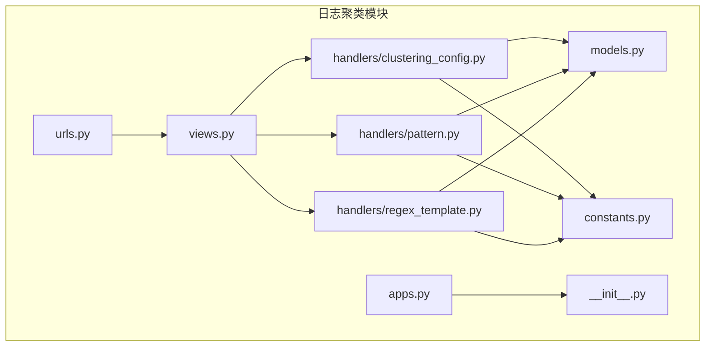
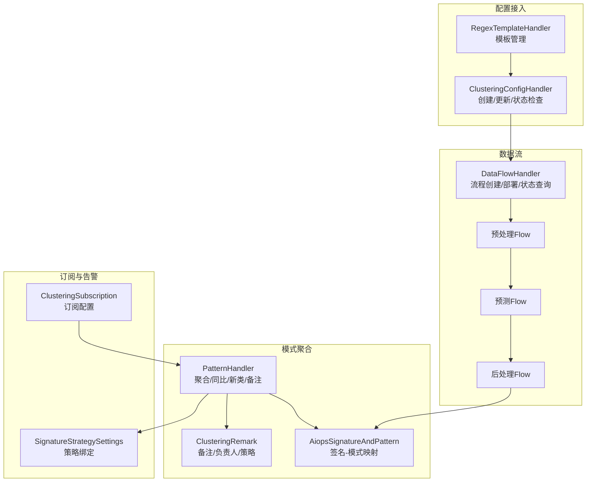
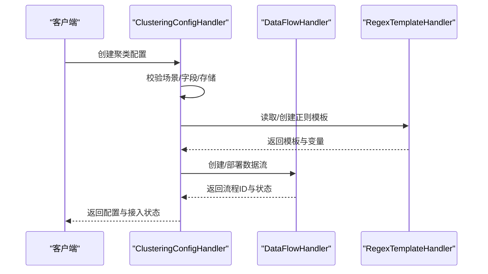
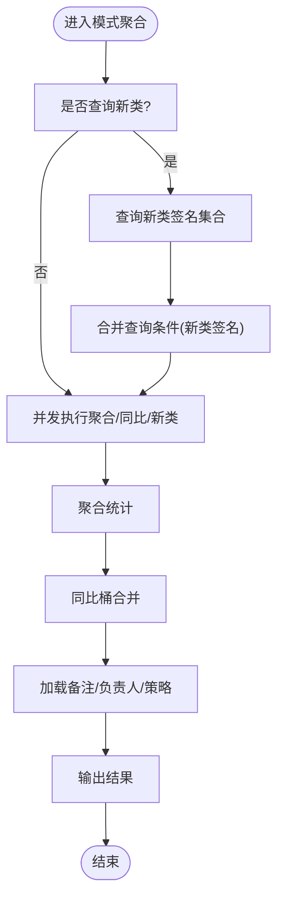
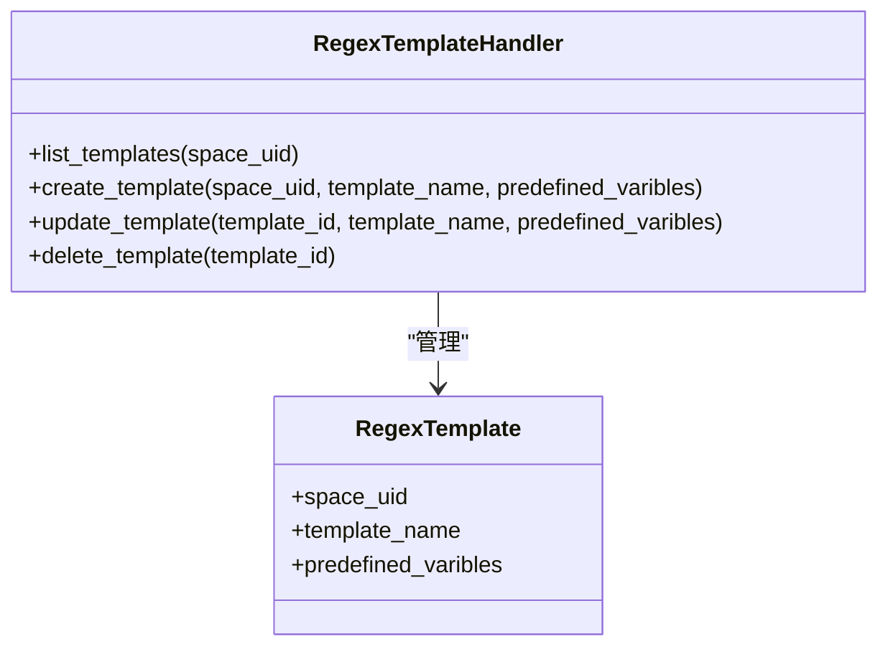
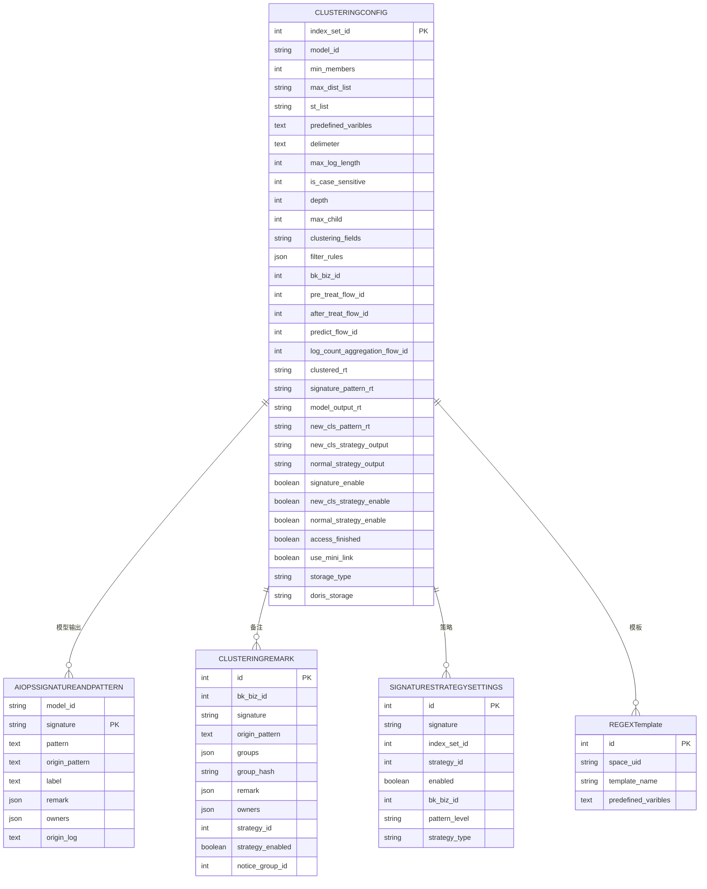
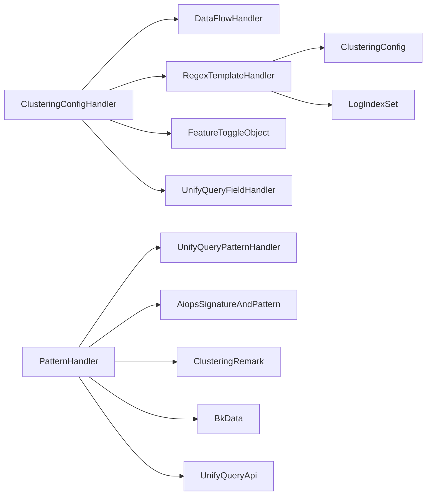

# 聚类算法实现

<cite>
**本文档引用的文件**
- [apps/log_clustering/handlers/clustering_config.py](file://apps/log_clustering/handlers/clustering_config.py)
- [apps/log_clustering/handlers/pattern.py](file://apps/log_clustering/handlers/pattern.py)
- [apps/log_clustering/handlers/regex_template.py](file://apps/log_clustering/handlers/regex_template.py)
- [apps/log_clustering/models.py](file://apps/log_clustering/models.py)
- [apps/log_clustering/constants.py](file://apps/log_clustering/constants.py)
- [apps/log_clustering/urls.py](file://apps/log_clustering/urls.py)
- [apps/log_clustering/apps.py](file://apps/log_clustering/apps.py)
- [apps/log_clustering/__init__.py](file://apps/log_clustering/__init__.py)
</cite>

## 目录
1. [简介](#简介)
2. [项目结构](#项目结构)
3. [核心组件](#核心组件)
4. [架构总览](#架构总览)
5. [详细组件分析](#详细组件分析)
6. [依赖分析](#依赖分析)
7. [性能考虑](#性能考虑)
8. [故障排查指南](#故障排查指南)
9. [结论](#结论)
10. [附录](#附录)

## 简介
本文件面向“聚类算法实现”的技术文档需求，聚焦于日志聚类的机器学习模型选择与实现细节、数据预处理流程（日志标准化、特征提取与向量化）、训练过程（参数配置、数据准备与优化策略）、实时推理（新日志聚类判断与结果输出），并提供性能优化与调参建议。文档基于仓库中日志聚类模块的实际实现进行梳理与总结，帮助读者快速理解并落地该能力。

## 项目结构
日志聚类模块位于 apps/log_clustering 下，采用按功能域划分的组织方式：
- handlers：业务处理层，包含聚类配置、模式聚合、正则模板等处理器
- models：数据模型定义，涵盖聚类配置、签名与模式、订阅等
- constants：常量与枚举定义
- urls/views：REST 接口注册与视图集合
- apps.py/__init__.py：Django 应用配置与初始化

图表来源
- [apps/log_clustering/urls.py:22-42](file://apps/log_clustering/urls.py#L22-L42)
- [apps/log_clustering/handlers/clustering_config.py:1-523](file://apps/log_clustering/handlers/clustering_config.py#L1-L523)
- [apps/log_clustering/handlers/pattern.py:1-685](file://apps/log_clustering/handlers/pattern.py#L1-L685)
- [apps/log_clustering/handlers/regex_template.py:1-159](file://apps/log_clustering/handlers/regex_template.py#L1-L159)
- [apps/log_clustering/models.py:1-344](file://apps/log_clustering/models.py#L1-L344)
- [apps/log_clustering/constants.py:1-336](file://apps/log_clustering/constants.py#L1-L336)
- [apps/log_clustering/apps.py:1-27](file://apps/log_clustering/apps.py#L1-L27)
- [apps/log_clustering/__init__.py:1-22](file://apps/log_clustering/__init__.py#L1-L22)

章节来源
- [apps/log_clustering/urls.py:22-42](file://apps/log_clustering/urls.py#L22-L42)
- [apps/log_clustering/apps.py:25-27](file://apps/log_clustering/apps.py#L25-L27)
- [apps/log_clustering/__init__.py:1-22](file://apps/log_clustering/__init__.py#L1-L22)

## 核心组件
- 聚类配置处理器：负责聚类接入的创建、更新、状态检查、正则调试与接入状态监测
- 模式聚合处理器：负责模式聚合查询、同比分析、新类识别与备注/负责人管理
- 正则模板处理器：负责模板的创建、更新、删除与引用关系管理
- 数据模型：定义聚类配置、签名与模式、订阅、正则模板等实体及字段
- 常量与枚举：定义聚类相关常量、策略类型、存储类型、分组字段等

章节来源
- [apps/log_clustering/handlers/clustering_config.py:67-523](file://apps/log_clustering/handlers/clustering_config.py#L67-L523)
- [apps/log_clustering/handlers/pattern.py:75-685](file://apps/log_clustering/handlers/pattern.py#L75-L685)
- [apps/log_clustering/handlers/regex_template.py:39-159](file://apps/log_clustering/handlers/regex_template.py#L39-L159)
- [apps/log_clustering/models.py:107-344](file://apps/log_clustering/models.py#L107-L344)
- [apps/log_clustering/constants.py:27-336](file://apps/log_clustering/constants.py#L27-L336)

## 架构总览
聚类系统由“配置接入—数据流—模式聚合—订阅与告警”构成的闭环：
- 配置接入：根据索引集与采集项生成聚类配置，触发数据流创建与部署
- 数据流：预处理、模型预测、后处理形成完整流水线
- 模式聚合：基于签名字段进行聚合统计，支持同比、新类识别与备注管理
- 订阅与告警：按订阅配置定期产出报告，触发新类与数量突增告警

图表来源
- [apps/log_clustering/handlers/clustering_config.py:92-213](file://apps/log_clustering/handlers/clustering_config.py#L92-L213)
- [apps/log_clustering/handlers/regex_template.py:39-159](file://apps/log_clustering/handlers/regex_template.py#L39-L159)
- [apps/log_clustering/handlers/pattern.py:89-238](file://apps/log_clustering/handlers/pattern.py#L89-L238)
- [apps/log_clustering/models.py:66-344](file://apps/log_clustering/models.py#L66-L344)

## 详细组件分析

### 组件A：聚类配置处理器（ClusteringConfigHandler）
职责与关键流程：
- 接入创建：校验场景类型（计算平台/采集项），读取默认配置，生成聚类配置并异步触发接入任务
- 接入更新：构建更新流水线，重启相关flow，记录任务轨迹
- 接入状态检查：检查数据写入、flow状态与任务详情，判定接入完成
- 正则调试：基于预定义变量、分隔符与最大日志长度进行正则调试
- 字段预检：确保聚类字段未被删除
- 业务ID校验：通过空间关系解析真实业务ID

图表来源
- [apps/log_clustering/handlers/clustering_config.py:100-213](file://apps/log_clustering/handlers/clustering_config.py#L100-L213)
- [apps/log_clustering/handlers/regex_template.py:39-95](file://apps/log_clustering/handlers/regex_template.py#L39-L95)

章节来源
- [apps/log_clustering/handlers/clustering_config.py:92-213](file://apps/log_clustering/handlers/clustering_config.py#L92-L213)
- [apps/log_clustering/handlers/clustering_config.py:307-394](file://apps/log_clustering/handlers/clustering_config.py#L307-L394)
- [apps/log_clustering/handlers/clustering_config.py:434-447](file://apps/log_clustering/handlers/clustering_config.py#L434-L447)
- [apps/log_clustering/handlers/clustering_config.py:484-499](file://apps/log_clustering/handlers/clustering_config.py#L484-L499)
- [apps/log_clustering/handlers/clustering_config.py:502-522](file://apps/log_clustering/handlers/clustering_config.py#L502-L522)

### 组件B：模式聚合处理器（PatternHandler）
职责与关键流程：
- 模式聚合：支持统一查询与传统聚合两种路径，按分组字段进行嵌套聚合
- 同比分析：基于指定小时数进行同比桶合并与占比计算
- 新类识别：从新类策略输出或新类模式RT中抽取新类签名集合
- 备注与负责人：支持按签名/原始模式与分组哈希进行备注管理，并可联动监控告警组
- 策略结果生成：生成策略ID与标签集合

图表来源
- [apps/log_clustering/handlers/pattern.py:89-117](file://apps/log_clustering/handlers/pattern.py#L89-L117)
- [apps/log_clustering/handlers/pattern.py:260-296](file://apps/log_clustering/handlers/pattern.py#L260-L296)
- [apps/log_clustering/handlers/pattern.py:298-307](file://apps/log_clustering/handlers/pattern.py#L298-L307)
- [apps/log_clustering/handlers/pattern.py:406-445](file://apps/log_clustering/handlers/pattern.py#L406-L445)
- [apps/log_clustering/handlers/pattern.py:528-587](file://apps/log_clustering/handlers/pattern.py#L528-L587)

章节来源
- [apps/log_clustering/handlers/pattern.py:89-238](file://apps/log_clustering/handlers/pattern.py#L89-L238)
- [apps/log_clustering/handlers/pattern.py:335-351](file://apps/log_clustering/handlers/pattern.py#L335-L351)
- [apps/log_clustering/handlers/pattern.py:528-587](file://apps/log_clustering/handlers/pattern.py#L528-L587)

### 组件C：正则模板处理器（RegexTemplateHandler）
职责与关键流程：
- 模板列表：若无模板则创建默认模板；统计模板引用的索引集
- 模板创建：去重命名，设置默认变量
- 模板更新：当变量变更时，遍历引用配置并触发更新流水线
- 模板删除：若被索引集引用则拒绝删除

图表来源
- [apps/log_clustering/handlers/regex_template.py:39-159](file://apps/log_clustering/handlers/regex_template.py#L39-L159)
- [apps/log_clustering/models.py:336-344](file://apps/log_clustering/models.py#L336-L344)

章节来源
- [apps/log_clustering/handlers/regex_template.py:39-159](file://apps/log_clustering/handlers/regex_template.py#L39-L159)

### 组件D：数据模型（Models）
关键实体与字段：
- ClusteringConfig：聚类配置主表，包含flow配置、结果表、策略开关、存储类型、小型化链路等
- AiopsSignatureAndPattern：签名-模式映射，存储原始日志与标签
- ClusteringRemark：备注/负责人/策略绑定，支持分组哈希
- SignatureStrategySettings：签名-策略映射
- ClusteringSubscription：订阅配置
- RegexTemplate：正则模板

图表来源
- [apps/log_clustering/models.py:107-344](file://apps/log_clustering/models.py#L107-L344)

章节来源
- [apps/log_clustering/models.py:107-344](file://apps/log_clustering/models.py#L107-L344)

## 依赖分析
- 处理器依赖：
  - ClusteringConfigHandler 依赖 DataFlowHandler、RegexTemplateHandler、FeatureToggleObject、UnifyQueryFieldHandler 等
  - PatternHandler 依赖 UnifyQueryPatternHandler、AiopsSignatureAndPattern、ClusteringRemark、BkData、UnifyQueryApi 等
  - RegexTemplateHandler 依赖 FeatureToggleObject、ClusteringConfig、LogIndexSet
- 模型依赖：
  - ClusteringConfig 与 AiopsSignatureAndPattern、ClusteringRemark、SignatureStrategySettings、RegexTemplate 关联
- 常量与枚举：
  - PatternEnum、StorageTypeEnum、RegexRuleTypeEnum、YearOnYearEnum 等贯穿各组件

图表来源
- [apps/log_clustering/handlers/clustering_config.py:48-64](file://apps/log_clustering/handlers/clustering_config.py#L48-L64)
- [apps/log_clustering/handlers/pattern.py:52-72](file://apps/log_clustering/handlers/pattern.py#L52-L72)
- [apps/log_clustering/handlers/regex_template.py:26-37](file://apps/log_clustering/handlers/regex_template.py#L26-L37)

章节来源
- [apps/log_clustering/handlers/clustering_config.py:48-64](file://apps/log_clustering/handlers/clustering_config.py#L48-L64)
- [apps/log_clustering/handlers/pattern.py:52-72](file://apps/log_clustering/handlers/pattern.py#L52-L72)
- [apps/log_clustering/handlers/regex_template.py:26-37](file://apps/log_clustering/handlers/regex_template.py#L26-L37)

## 性能考虑
- 聚合与查询优化
  - 使用分组字段嵌套聚合减少桶数量，降低内存与网络开销
  - 同比查询通过时间偏移与桶合并，避免重复扫描全量数据
  - 新类查询限定时间窗口与字段选择，必要时降级为不分组聚合
- 并发与缓存
  - 多任务并发执行聚合、同比与新类查询，缩短总耗时
  - 接入状态检查引入缓存与短周期重试，避免频繁查询
- 存储与链路
  - 支持小型化链路与Doris存储类型，按场景切换以提升吞吐
  - 预处理/预测/后处理三阶段流水线解耦，便于扩展与优化
- 参数调优建议
  - min_members：根据业务日志基数与稳定性调整，避免噪声
  - max_dist_list/st_list：结合敏感度与误报率权衡
  - max_log_length：控制向量化与正则匹配成本
  - depth/max_child：平衡搜索树复杂度与召回率
  - 分组字段：仅保留必要维度，避免桶爆炸

[本节为通用性能指导，不直接分析具体文件]

## 故障排查指南
常见问题与定位方法：
- 接入状态异常
  - 检查 DataFlow 状态映射与最新部署状态，确认“running/starting/failure”
  - 核对接入数据检查逻辑：原始数据与聚类数据均需有上报
- 正则调试失败
  - 检查预定义变量、分隔符与最大日志长度参数是否合理
  - 关注 ClusteringDebugException 的错误信息
- 字段校验失败
  - 若聚类字段被删除，会触发字段异常，需恢复字段或调整配置
- 模板引用冲突
  - 删除模板前需确认无索引集引用，否则抛出引用异常

章节来源
- [apps/log_clustering/handlers/clustering_config.py:396-432](file://apps/log_clustering/handlers/clustering_config.py#L396-L432)
- [apps/log_clustering/handlers/clustering_config.py:334-358](file://apps/log_clustering/handlers/clustering_config.py#L334-L358)
- [apps/log_clustering/handlers/clustering_config.py:434-447](file://apps/log_clustering/handlers/clustering_config.py#L434-L447)
- [apps/log_clustering/handlers/clustering_config.py:484-499](file://apps/log_clustering/handlers/clustering_config.py#L484-L499)
- [apps/log_clustering/handlers/regex_template.py:143-158](file://apps/log_clustering/handlers/regex_template.py#L143-L158)

## 结论
该聚类实现以“配置驱动+数据流+模式聚合+订阅告警”为核心路径，通过正则模板与聚类配置参数化支撑不同场景接入。处理器层承担了接入、调试、状态检查与聚合统计的关键职责，模型层提供了签名-模式与备注/策略的持久化能力。在性能方面，通过并发聚合、分组优化与链路切换实现高效稳定；在可运维性方面，完善的异常与状态检查保障了接入质量。

[本节为总结性内容，不直接分析具体文件]

## 附录
- 接口注册与路由
  - 路由注册了 pattern、report、clustering_config、clustering_monitor、regex_template 等视图集合
- 开发与部署提示
  - Django 应用配置位于 apps.py，模块初始化位于 __init__.py
  - 请结合 FeatureToggle 与空间/业务ID解析机制进行接入与灰度

章节来源
- [apps/log_clustering/urls.py:22-42](file://apps/log_clustering/urls.py#L22-L42)
- [apps/log_clustering/apps.py:25-27](file://apps/log_clustering/apps.py#L25-L27)
- [apps/log_clustering/__init__.py:1-22](file://apps/log_clustering/__init__.py#L1-L22)