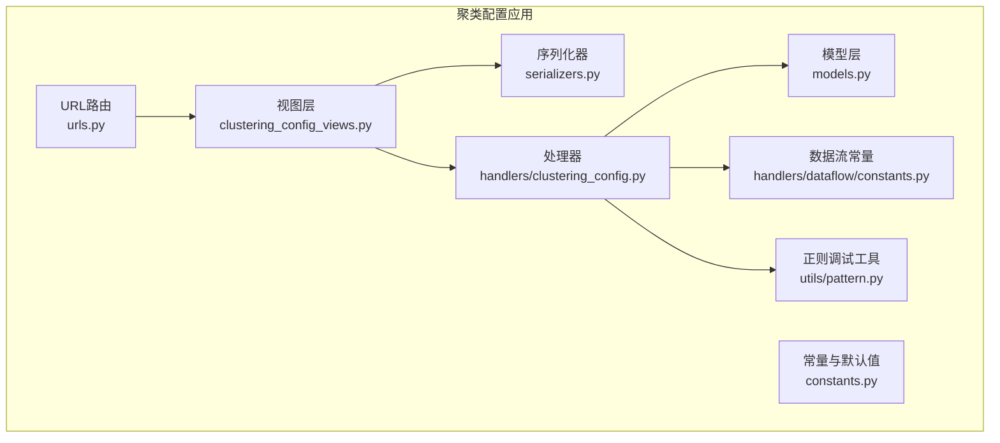
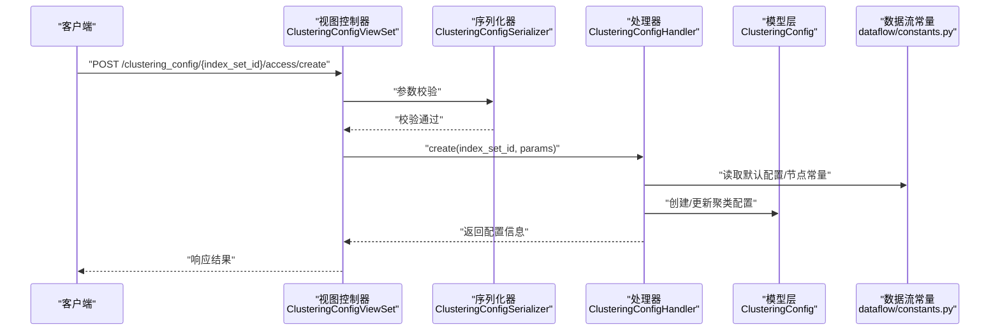
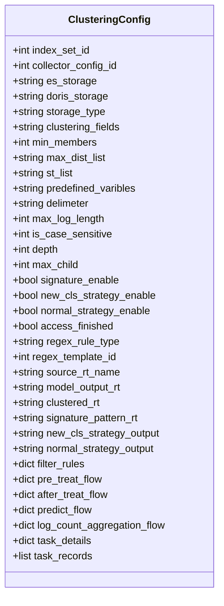
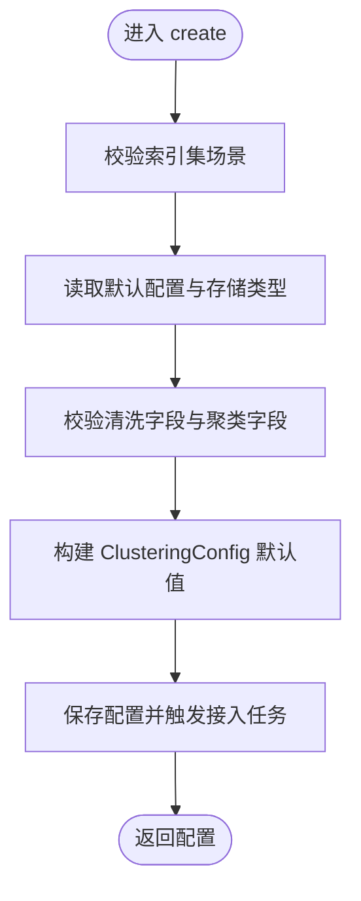
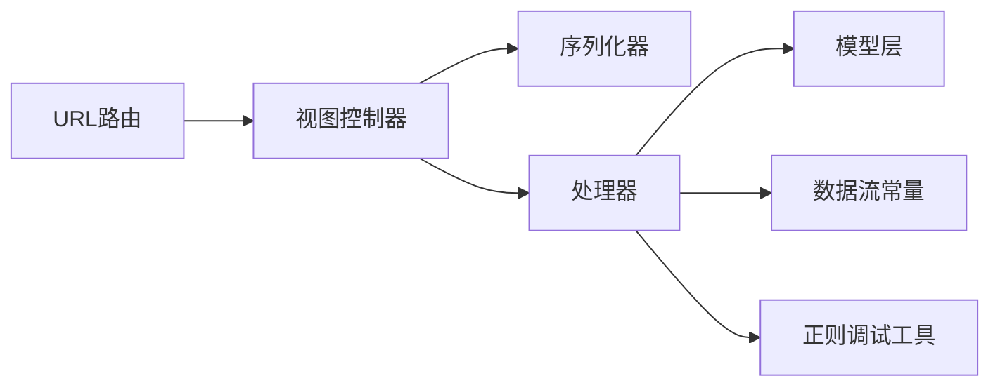

# 聚类配置管理

<cite>
**本文引用的文件**
- [apps/log_clustering/models.py](file://apps/log_clustering/models.py)
- [apps/log_clustering/views/clustering_config_views.py](file://apps/log_clustering/views/clustering_config_views.py)
- [apps/log_clustering/serializers.py](file://apps/log_clustering/serializers.py)
- [apps/log_clustering/constants.py](file://apps/log_clustering/constants.py)
- [apps/log_clustering/handlers/clustering_config.py](file://apps/log_clustering/handlers/clustering_config.py)
- [apps/log_clustering/urls.py](file://apps/log_clustering/urls.py)
- [apps/log_clustering/handlers/dataflow/constants.py](file://apps/log_clustering/handlers/dataflow/constants.py)
- [apps/log_clustering/utils/pattern.py](file://apps/log_clustering/utils/pattern.py)
- [apps/log_clustering/migrations/0030_auto_20240826_2156.py](file://apps/log_clustering/migrations/0030_auto_20240826_2156.py)
- [apps/log_clustering/migrations/0031_auto_20240826_2157.py](file://apps/log_clustering/migrations/0031_auto_20240826_2157.py)
</cite>

## 目录
1. [简介](#简介)
2. [项目结构](#项目结构)
3. [核心组件](#核心组件)
4. [架构总览](#架构总览)
5. [详细组件分析](#详细组件分析)
6. [依赖分析](#依赖分析)
7. [性能考虑](#性能考虑)
8. [故障排查指南](#故障排查指南)
9. [结论](#结论)
10. [附录](#附录)

## 简介
本技术文档面向“聚类配置管理系统”，围绕聚类算法参数、过滤规则配置、存储设置、配置创建与编辑流程、生命周期管理（启用/停用/修改/删除）、与数据流的集成方式（预处理/模型应用/结果输出）进行系统化说明，并提供最佳实践与常见配置案例及参数调优建议。读者可据此快速理解并正确配置聚类能力。

## 项目结构
聚类配置管理位于蓝鲸日志平台的 log_clustering 应用内，采用按功能域划分的模块化组织方式：
- 视图层：提供 REST API，负责对外暴露聚类配置的查询、接入、调试、状态查询等能力
- 序列化器：定义请求参数与响应结构，承担参数校验与转换
- 处理器：封装业务逻辑，协调数据流、存储、任务调度等
- 模型层：持久化聚类配置、订阅、正则模板等实体
- 常量与工具：定义枚举、默认值、数据流节点常量、正则调试工具等
- URL 路由：注册聚类相关视图集合

图表来源
- [apps/log_clustering/views/clustering_config_views.py:41-367](file://apps/log_clustering/views/clustering_config_views.py#L41-L367)
- [apps/log_clustering/serializers.py:98-120](file://apps/log_clustering/serializers.py#L98-L120)
- [apps/log_clustering/handlers/clustering_config.py:67-523](file://apps/log_clustering/handlers/clustering_config.py#L67-L523)
- [apps/log_clustering/models.py:107-191](file://apps/log_clustering/models.py#L107-L191)
- [apps/log_clustering/constants.py:48-50](file://apps/log_clustering/constants.py#L48-L50)
- [apps/log_clustering/urls.py:32-41](file://apps/log_clustering/urls.py#L32-L41)
- [apps/log_clustering/handlers/dataflow/constants.py:71-92](file://apps/log_clustering/handlers/dataflow/constants.py#L71-L92)
- [apps/log_clustering/utils/pattern.py:162-182](file://apps/log_clustering/utils/pattern.py#L162-L182)

章节来源
- [apps/log_clustering/urls.py:32-41](file://apps/log_clustering/urls.py#L32-L41)

## 核心组件
- 聚类配置模型（ClusteringConfig）
  - 关键字段涵盖：算法参数（最小日志数量、敏感度、相似度阈值、分词符、最大日志长度、大小写敏感、搜索树深度与子节点上限、聚合字段）、过滤规则、业务与索引集信息、数据源接入（ES/Doris）、数据流配置（预处理/模型应用/预测/日志计数聚合）、告警策略（新类/数量突增）、接入完成标记、正则规则类型与模板ID等
- 视图控制器（ClusteringConfigViewSet）
  - 提供配置列表、详情、接入、更新、接入状态、默认配置、调试、正则有效性校验等接口
- 序列化器（ClusteringConfigSerializer、ClusteringDebugSerializer）
  - 定义接入/更新参数与调试参数的字段、类型与校验规则
- 处理器（ClusteringConfigHandler）
  - 实现创建接入、同步更新、接入状态检查、数据流状态检查、调试、字段预检、业务ID校验等
- 常量与默认值（constants.py）
  - 定义默认聚类字段、默认过滤规则、默认告警策略、存储类型枚举、订阅类型等
- 数据流常量（handlers/dataflow/constants.py）
  - 定义数据流模板、节点类型、模型输入/输出字段、字段别名映射等
- 正则调试工具（utils/pattern.py）
  - 提供正则解析、分词与匹配、中文分词、调试输出格式化等

章节来源
- [apps/log_clustering/models.py:107-191](file://apps/log_clustering/models.py#L107-L191)
- [apps/log_clustering/views/clustering_config_views.py:41-367](file://apps/log_clustering/views/clustering_config_views.py#L41-L367)
- [apps/log_clustering/serializers.py:98-120](file://apps/log_clustering/serializers.py#L98-L120)
- [apps/log_clustering/handlers/clustering_config.py:67-523](file://apps/log_clustering/handlers/clustering_config.py#L67-L523)
- [apps/log_clustering/constants.py:48-50](file://apps/log_clustering/constants.py#L48-L50)
- [apps/log_clustering/handlers/dataflow/constants.py:71-92](file://apps/log_clustering/handlers/dataflow/constants.py#L71-L92)
- [apps/log_clustering/utils/pattern.py:162-182](file://apps/log_clustering/utils/pattern.py#L162-L182)

## 架构总览
聚类配置管理通过视图层接收请求，经序列化器校验后交由处理器处理；处理器根据配置与数据流常量构建或更新数据流任务，并将结果回写至模型层；同时通过统一查询接口进行接入状态校验，确保数据写入与任务运行正常。

图表来源
- [apps/log_clustering/views/clustering_config_views.py:127-178](file://apps/log_clustering/views/clustering_config_views.py#L127-L178)
- [apps/log_clustering/serializers.py:98-113](file://apps/log_clustering/serializers.py#L98-L113)
- [apps/log_clustering/handlers/clustering_config.py:100-214](file://apps/log_clustering/handlers/clustering_config.py#L100-L214)
- [apps/log_clustering/handlers/dataflow/constants.py:71-92](file://apps/log_clustering/handlers/dataflow/constants.py#L71-L92)

## 详细组件分析

### 聚类配置模型（ClusteringConfig）
- 字段类别
  - 算法参数：min_members、max_dist_list、st_list、predefined_varibles、delimeter、max_log_length、is_case_sensitive、depth、max_child、clustering_fields
  - 过滤规则：filter_rules（JSON数组，含字段名、操作符、值、逻辑运算符）
  - 业务与索引集：bk_biz_id、index_set_id、collector_config_id、collector_config_name_en
  - 数据源接入：es_storage、doris_storage、storage_type（Elasticsearch/Doris）
  - 数据流配置：pre_treat_flow、after_treat_flow、predict_flow、log_count_aggregation_flow、flow_id
  - 结果表：source_rt_name、model_output_rt、clustered_rt、signature_pattern_rt、new_cls_strategy_output、normal_strategy_output
  - 告警策略：new_cls_strategy_enable、normal_strategy_enable
  - 生命周期：access_finished、task_records、task_details
  - 正则规则：regex_rule_type（自定义/模板）、regex_template_id
- 关键方法
  - get_by_index_set_id：按索引集ID或新类索引集ID查询
  - get_by_flow_id：按流程ID查询
  - update_task_details：更新任务节点状态与详情
- 约束与索引
  - 多字段联合索引用于高效查询与去重（如签名+分组哈希）

图表来源
- [apps/log_clustering/models.py:107-191](file://apps/log_clustering/models.py#L107-L191)

章节来源
- [apps/log_clustering/models.py:107-191](file://apps/log_clustering/models.py#L107-L191)

### 视图控制器（ClusteringConfigViewSet）
- 主要接口
  - GET /clustering_config/{index_set_id}/config：获取聚类配置详情
  - GET /clustering_config/{index_set_id}/start：启动在线服务
  - POST /clustering_config/{index_set_id}/access/create：创建接入
  - POST /clustering_config/{index_set_id}/access/update：更新接入
  - GET /clustering_config/{index_set_id}/access/status：查询接入状态
  - GET /clustering_config/default_config：获取默认配置
  - POST /clustering_config/debug：正则调试
  - POST /clustering_config/check_regexp：正则有效性校验
- 参数与权限
  - 使用 DRF 的 params_valid 校验请求参数
  - 部分接口对超级用户开放

章节来源
- [apps/log_clustering/views/clustering_config_views.py:41-367](file://apps/log_clustering/views/clustering_config_views.py#L41-L367)

### 序列化器（ClusteringConfigSerializer、ClusteringDebugSerializer）
- ClusteringConfigSerializer
  - 必填：bk_biz_id、clustering_fields（可选）、filter_rules（可选）
  - 算法参数：min_members、predefined_varibles、delimeter、max_log_length、is_case_sensitive
  - 告警策略：new_cls_strategy_enable、normal_strategy_enable
  - 正则规则：regex_rule_type（自定义/模板）、regex_template_id
- ClusteringDebugSerializer
  - input_data、predefined_varibles、delimeter、max_log_length

章节来源
- [apps/log_clustering/serializers.py:98-120](file://apps/log_clustering/serializers.py#L98-L120)

### 处理器（ClusteringConfigHandler）
- 创建接入（create）
  - 校验索引集场景（计算平台或采集项）
  - 读取特性开关中的默认配置与存储类型
  - 校验清洗字段与聚类字段一致性
  - 写入 ClusteringConfig 并触发异步接入任务
- 同步更新（synchronous_update）
  - 根据正则规则类型（自定义/模板）决定是否从模板加载正则
  - 调用更新流程并重启相关数据流
- 接入状态检查（get_access_status）
  - 通过统一查询接口检查原始日志与聚类结果表是否写入
  - 检查数据流状态（创建/运行/部署）
- 调试（debug）
  - 基于 utils/pattern.py 执行正则调试与分词输出
- 字段预检（pre_check_fields）
  - 确保聚类字段存在于清洗字段中
- 业务ID校验（validate_bk_biz_id）
  - 支持空间关联真实业务ID的注入

图表来源
- [apps/log_clustering/handlers/clustering_config.py:100-214](file://apps/log_clustering/handlers/clustering_config.py#L100-L214)

章节来源
- [apps/log_clustering/handlers/clustering_config.py:67-523](file://apps/log_clustering/handlers/clustering_config.py#L67-L523)

### 常量与默认值（constants.py）
- 默认聚类字段、默认过滤规则、默认告警策略、存储类型枚举（Elasticsearch/Doris）、订阅类型等
- 默认配置键：CLUSTERING_CONFIG_DEFAULT

章节来源
- [apps/log_clustering/constants.py:48-50](file://apps/log_clustering/constants.py#L48-L50)

### 数据流常量（handlers/dataflow/constants.py）
- 流程模式：预处理、结果处理、修改、计算平台RT、预测、日志数量聚合
- 节点类型：实时、Redis KV、Elastic 存储、Doris、模型、流式源
- 模型输入/输出字段：系统索引、用户索引、分组索引、日志内容、时间戳、预测结果等
- 字段别名映射：dist_05 与 __dist_05

章节来源
- [apps/log_clustering/handlers/dataflow/constants.py:71-92](file://apps/log_clustering/handlers/dataflow/constants.py#L71-L92)
- [apps/log_clustering/handlers/dataflow/constants.py:116-131](file://apps/log_clustering/handlers/dataflow/constants.py#L116-L131)
- [apps/log_clustering/handlers/dataflow/constants.py:253-468](file://apps/log_clustering/handlers/dataflow/constants.py#L253-L468)

### 正则调试工具（utils/pattern.py）
- 解析预先定义的变量正则
- 文本分词与正则匹配，支持中文分词
- 输出格式化为 Pattern 字符串

章节来源
- [apps/log_clustering/utils/pattern.py:162-182](file://apps/log_clustering/utils/pattern.py#L162-L182)

## 依赖分析
- 视图层依赖序列化器与处理器
- 处理器依赖模型层、数据流常量、统一查询接口、特性开关、正则模板
- 模型层承载配置与任务状态
- URL 路由注册视图集合

图表来源
- [apps/log_clustering/views/clustering_config_views.py:41-367](file://apps/log_clustering/views/clustering_config_views.py#L41-L367)
- [apps/log_clustering/serializers.py:98-120](file://apps/log_clustering/serializers.py#L98-L120)
- [apps/log_clustering/handlers/clustering_config.py:67-523](file://apps/log_clustering/handlers/clustering_config.py#L67-L523)
- [apps/log_clustering/models.py:107-191](file://apps/log_clustering/models.py#L107-L191)
- [apps/log_clustering/handlers/dataflow/constants.py:71-92](file://apps/log_clustering/handlers/dataflow/constants.py#L71-L92)
- [apps/log_clustering/utils/pattern.py:162-182](file://apps/log_clustering/utils/pattern.py#L162-L182)
- [apps/log_clustering/urls.py:32-41](file://apps/log_clustering/urls.py#L32-L41)

章节来源
- [apps/log_clustering/urls.py:32-41](file://apps/log_clustering/urls.py#L32-L41)

## 性能考虑
- 字段预检与清洗配置一致性检查，避免无效字段导致的资源浪费
- 接入状态检查通过统一查询接口进行批量校验，减少重复扫描
- 数据流重启采用延迟任务，降低频繁重启带来的抖动
- 存储类型切换（ES/Doris）需确保目标集群可用性与容量

## 故障排查指南
- 接入状态异常
  - 检查原始日志与聚类结果表写入情况
  - 校验数据流状态（未创建/未启动/启动中/异常/停止中）
- 正则调试失败
  - 使用 /clustering_config/check_regexp 校验正则有效性
  - 使用 /clustering_config/debug 获取分词与Pattern输出
- 字段缺失
  - 确认清洗字段中包含聚类字段
- 存储配置错误
  - ES/Doris 集群名称与可用性检查
- 业务ID问题
  - 空间关联真实业务ID缺失时无法创建接入

章节来源
- [apps/log_clustering/handlers/clustering_config.py:307-394](file://apps/log_clustering/handlers/clustering_config.py#L307-L394)
- [apps/log_clustering/views/clustering_config_views.py:335-367](file://apps/log_clustering/views/clustering_config_views.py#L335-L367)

## 结论
聚类配置管理系统通过清晰的视图-序列化器-处理器-模型分层，结合数据流常量与统一查询接口，实现了从配置创建、接入、调试到状态监控的全链路闭环。合理配置算法参数、过滤规则与存储类型，配合接入状态检查与告警策略，可有效提升日志聚类的准确性与稳定性。

## 附录

### 聚类配置参数与含义
- 算法参数
  - min_members：最小日志数量
  - max_dist_list：敏感度（多值）
  - st_list：相似度阈值（默认来自在线训练参数）
  - predefined_varibles：预先定义的正则表达式（模板或自定义）
  - delimeter：分词符
  - max_log_length：最大日志长度
  - is_case_sensitive：是否区分大小写
  - depth：搜索树深度
  - max_child：搜索树最大子节点数
  - clustering_fields：聚合字段（默认 log）
- 过滤规则
  - filter_rules：JSON数组，包含字段名、操作符、值、逻辑运算符
- 存储设置
  - storage_type：存储类型（Elasticsearch/Doris）
  - es_storage：ES 集群名称
  - doris_storage：Doris 集群名称
- 数据流配置
  - pre_treat_flow、after_treat_flow、predict_flow、log_count_aggregation_flow
  - flow_id：各流程的ID
- 告警策略
  - new_cls_strategy_enable：是否开启新类告警
  - normal_strategy_enable：是否开启数量突增告警
  - new_cls_strategy_output、normal_strategy_output：告警输出结果表
- 正则规则
  - regex_rule_type：规则类型（自定义/模板）
  - regex_template_id：模板ID

章节来源
- [apps/log_clustering/models.py:107-191](file://apps/log_clustering/models.py#L107-L191)
- [apps/log_clustering/constants.py:252-259](file://apps/log_clustering/constants.py#L252-L259)
- [apps/log_clustering/handlers/dataflow/constants.py:71-92](file://apps/log_clustering/handlers/dataflow/constants.py#L71-L92)

### 配置创建与编辑流程
- 创建接入
  - 选择索引集，填写算法参数与过滤规则，提交接入
  - 系统读取默认配置与存储类型，校验字段后创建配置并触发接入任务
- 更新接入
  - 选择规则类型（自定义/模板），若模板则自动加载正则
  - 构建更新流程并重启相关数据流
- 接入状态检查
  - 通过统一查询接口检查原始日志与聚类结果表写入
  - 校验数据流状态与任务详情

章节来源
- [apps/log_clustering/views/clustering_config_views.py:127-265](file://apps/log_clustering/views/clustering_config_views.py#L127-L265)
- [apps/log_clustering/handlers/clustering_config.py:100-287](file://apps/log_clustering/handlers/clustering_config.py#L100-L287)

### 生命周期管理
- 启用/停用
  - 通过在线启动接口启用，数据流状态为 running 即为启用
- 修改
  - 更新算法参数、过滤规则、正则模板等，系统自动重启相关数据流
- 删除
  - 通过管理端或接口清理配置与数据流（具体接口以实际实现为准）

章节来源
- [apps/log_clustering/views/clustering_config_views.py:104-126](file://apps/log_clustering/views/clustering_config_views.py#L104-L126)
- [apps/log_clustering/handlers/clustering_config.py:215-287](file://apps/log_clustering/handlers/clustering_config.py#L215-L287)

### 与数据流的集成
- 预处理配置：pre_treat_flow（清洗、样本集、非聚类过滤）
- 模型应用配置：after_treat_flow（字段变更、结果处理）
- 预测配置：predict_flow（聚类预测、新类识别）
- 日志计数聚合：log_count_aggregation_flow（数量突增告警）
- 结果输出：clustered_rt、signature_pattern_rt、model_output_rt 等

章节来源
- [apps/log_clustering/handlers/dataflow/constants.py:71-92](file://apps/log_clustering/handlers/dataflow/constants.py#L71-L92)
- [apps/log_clustering/models.py:127-163](file://apps/log_clustering/models.py#L127-L163)

### 最佳实践与常见案例
- 最佳实践
  - 明确聚类字段，确保其存在于清洗字段中
  - 合理设置 min_members 与 max_dist_list，平衡召回与误报
  - 使用正则模板统一管理变量正则，减少维护成本
  - 开启告警策略并配置合适的输出结果表
  - 定期检查接入状态与数据流运行状态
- 常见案例
  - 场景一：采集项接入聚类（LOG 场景）
    - 选择采集项索引集，配置 delimeter、max_log_length、is_case_sensitive
    - 选择模板规则类型，自动加载正则
  - 场景二：计算平台接入聚类（BKDATA 场景）
    - 选择计算平台索引集，系统读取默认配置与存储类型
    - 配置过滤规则与告警策略

章节来源
- [apps/log_clustering/handlers/clustering_config.py:111-214](file://apps/log_clustering/handlers/clustering_config.py#L111-L214)
- [apps/log_clustering/constants.py:48-50](file://apps/log_clustering/constants.py#L48-L50)

### 参数调优指南
- min_members
  - 建议从 2~5 起步，结合业务日志分布逐步调整
- max_dist_list
  - 常用区间 [0.1, 0.5]，敏感度越高越易拆分，但可能产生噪声
- st_list
  - 默认来自在线训练参数，可根据聚类效果微调
- delimeter
  - 根据日志分词习惯设置，避免过度切分或切分不足
- max_log_length
  - 控制单条日志长度，防止超长文本影响性能
- is_case_sensitive
  - 中文场景通常关闭大小写敏感
- depth 与 max_child
  - 默认值适用于大多数场景，极端数据可适度增大

章节来源
- [apps/log_clustering/handlers/clustering_config.py:170-204](file://apps/log_clustering/handlers/clustering_config.py#L170-L204)
- [apps/log_clustering/handlers/dataflow/constants.py:28-38](file://apps/log_clustering/handlers/dataflow/constants.py#L28-L38)

### 历史迁移要点
- 新类告警输出字段重命名与新增
  - 0030：重命名 log_count_agg_rt 为 new_cls_strategy_output，并新增 new_cls_strategy_enable、normal_strategy_enable、normal_strategy_output
  - 0031：修正字段注释与默认值

章节来源
- [apps/log_clustering/migrations/0030_auto_20240826_2156.py:11-32](file://apps/log_clustering/migrations/0030_auto_20240826_2156.py#L11-L32)
- [apps/log_clustering/migrations/0031_auto_20240826_2157.py:11-22](file://apps/log_clustering/migrations/0031_auto_20240826_2157.py#L11-L22)