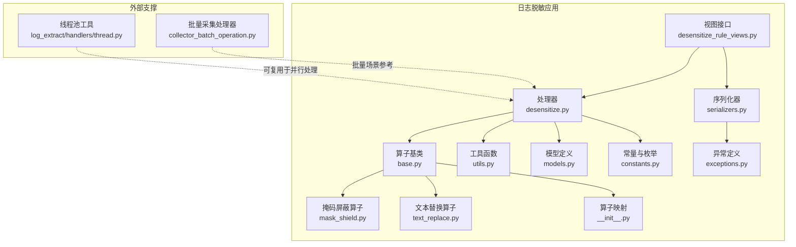
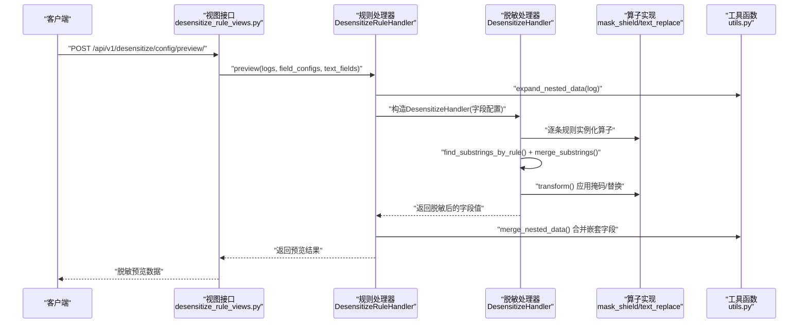
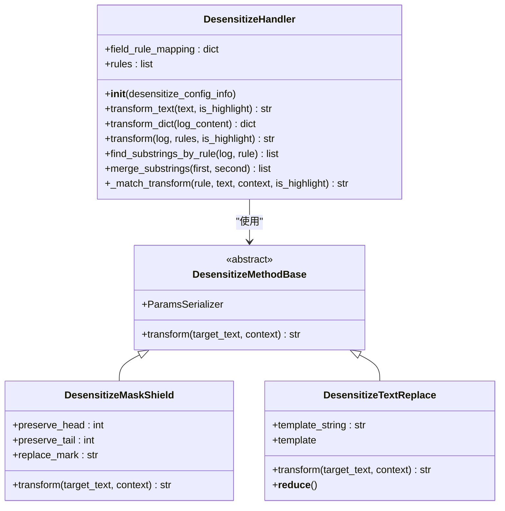
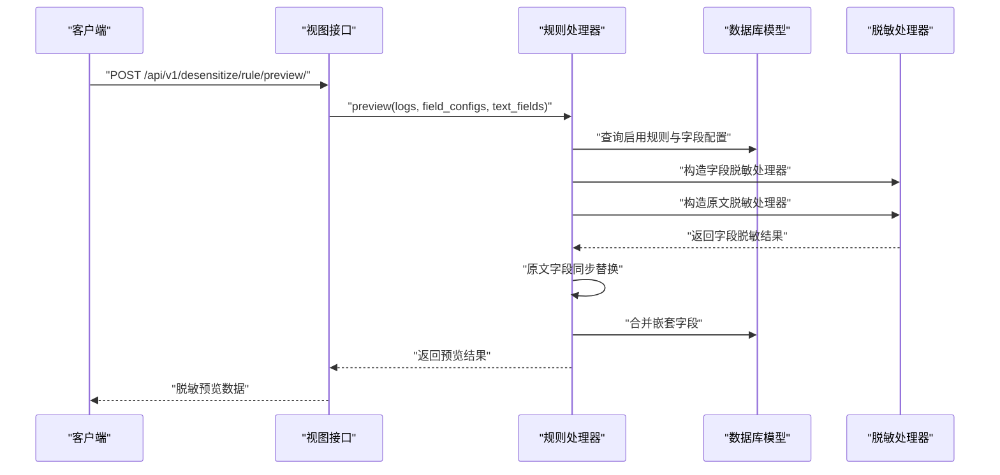
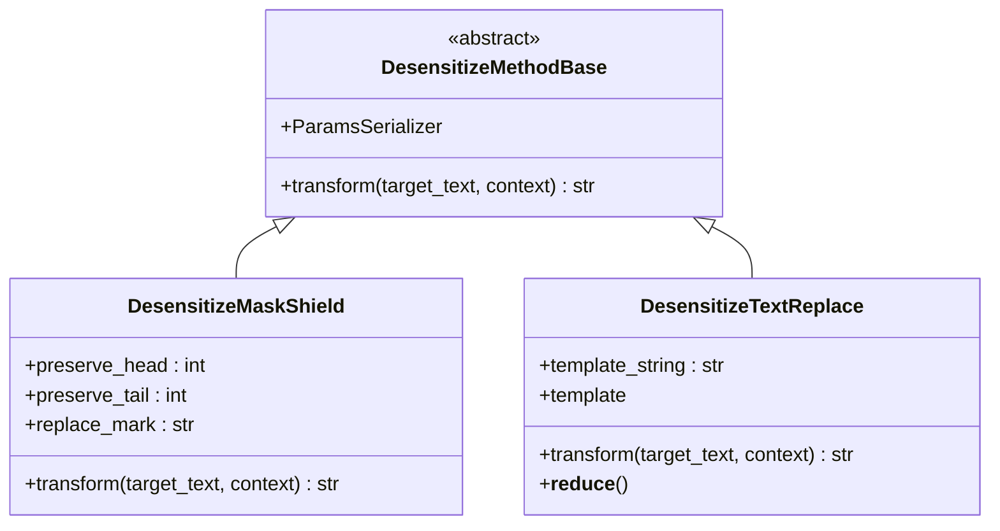
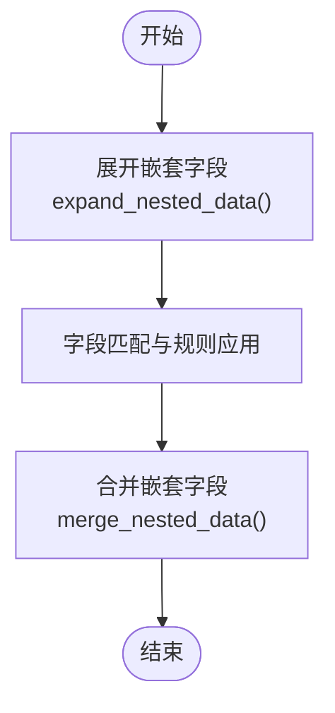
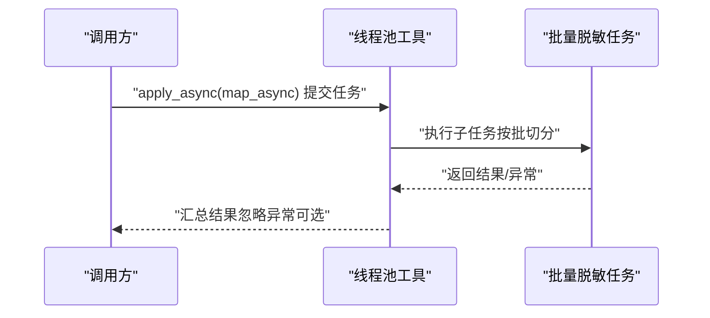
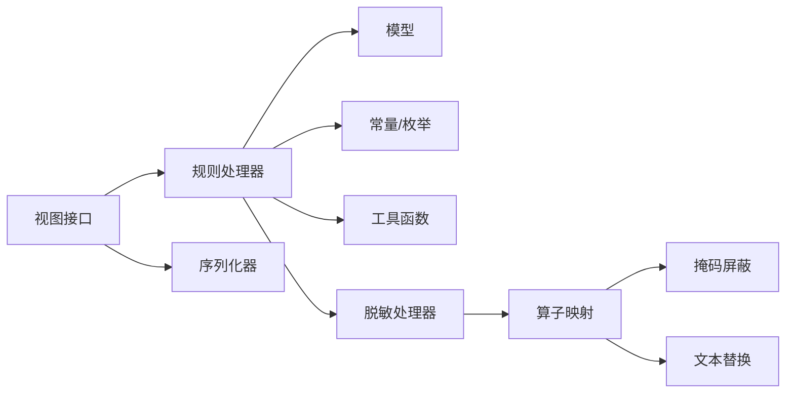

# 批量脱敏处理

<cite>
**本文引用的文件**
- [apps/log_desensitize/handlers/desensitize.py](file://apps/log_desensitize/handlers/desensitize.py)
- [apps/log_desensitize/handlers/desensitize_operator/base.py](file://apps/log_desensitize/handlers/desensitize_operator/base.py)
- [apps/log_desensitize/handlers/desensitize_operator/__init__.py](file://apps/log_desensitize/handlers/desensitize_operator/__init__.py)
- [apps/log_desensitize/handlers/desensitize_operator/mask_shield.py](file://apps/log_desensitize/handlers/desensitize_operator/mask_shield.py)
- [apps/log_desensitize/handlers/desensitize_operator/text_replace.py](file://apps/log_desensitize/handlers/desensitize_operator/text_replace.py)
- [apps/log_desensitize/models.py](file://apps/log_desensitize/models.py)
- [apps/log_desensitize/constants.py](file://apps/log_desensitize/constants.py)
- [apps/log_desensitize/utils.py](file://apps/log_desensitize/utils.py)
- [apps/log_desensitize/views/desensitize_rule_views.py](file://apps/log_desensitize/views/desensitize_rule_views.py)
- [apps/log_desensitize/serializers.py](file://apps/log_desensitize/serializers.py)
- [apps/log_desensitize/exceptions.py](file://apps/log_desensitize/exceptions.py)
- [apps/log_databus/handlers/collector_batch_operation.py](file://apps/log_databus/handlers/collector_batch_operation.py)
- [apps/log_extract/handlers/thread.py](file://apps/log_extract/handlers/thread.py)
</cite>

## 目录
1. [简介](#简介)
2. [项目结构](#项目结构)
3. [核心组件](#核心组件)
4. [架构总览](#架构总览)
5. [详细组件分析](#详细组件分析)
6. [依赖关系分析](#依赖关系分析)
7. [性能考量](#性能考量)
8. [故障排查指南](#故障排查指南)
9. [结论](#结论)
10. [附录](#附录)

## 简介
本技术文档围绕“批量脱敏处理”能力，系统阐述其架构设计、数据扫描与匹配、并行处理、内存管理、结果输出与任务调度机制，以及性能优化策略、配置参数与调优建议、监控指标与基准测试方法。文档面向不同层次读者，既提供高层概览，也给出代码级细节与可视化图示，帮助快速理解与落地实施。

## 项目结构
批量脱敏相关代码主要集中在日志脱敏应用内，涉及规则模型、处理器、算子实现、视图接口与序列化器等模块；同时在日志提取与采集侧提供了线程池工具与批量采集的参考实现，便于扩展到大规模日志处理场景。

**图表来源**
- [apps/log_desensitize/views/desensitize_rule_views.py:1-494](file://apps/log_desensitize/views/desensitize_rule_views.py#L1-L494)
- [apps/log_desensitize/handlers/desensitize.py:1-692](file://apps/log_desensitize/handlers/desensitize.py#L1-L692)
- [apps/log_desensitize/handlers/desensitize_operator/base.py:1-36](file://apps/log_desensitize/handlers/desensitize_operator/base.py#L1-L36)
- [apps/log_desensitize/handlers/desensitize_operator/mask_shield.py:1-78](file://apps/log_desensitize/handlers/desensitize_operator/mask_shield.py#L1-L78)
- [apps/log_desensitize/handlers/desensitize_operator/text_replace.py:1-71](file://apps/log_desensitize/handlers/desensitize_operator/text_replace.py#L1-L71)
- [apps/log_desensitize/handlers/desensitize_operator/__init__.py:1-29](file://apps/log_desensitize/handlers/desensitize_operator/__init__.py#L1-L29)
- [apps/log_desensitize/utils.py:1-64](file://apps/log_desensitize/utils.py#L1-L64)
- [apps/log_desensitize/models.py:1-80](file://apps/log_desensitize/models.py#L1-L80)
- [apps/log_desensitize/constants.py:1-84](file://apps/log_desensitize/constants.py#L1-L84)
- [apps/log_desensitize/exceptions.py:1-59](file://apps/log_desensitize/exceptions.py#L1-L59)
- [apps/log_extract/handlers/thread.py:1-128](file://apps/log_extract/handlers/thread.py#L1-L128)
- [apps/log_databus/handlers/collector_batch_operation.py:1-147](file://apps/log_databus/handlers/collector_batch_operation.py#L1-L147)

**章节来源**
- [apps/log_desensitize/handlers/desensitize.py:1-692](file://apps/log_desensitize/handlers/desensitize.py#L1-L692)
- [apps/log_desensitize/handlers/desensitize_operator/__init__.py:1-29](file://apps/log_desensitize/handlers/desensitize_operator/__init__.py#L1-L29)
- [apps/log_desensitize/utils.py:1-64](file://apps/log_desensitize/utils.py#L1-L64)
- [apps/log_desensitize/views/desensitize_rule_views.py:1-494](file://apps/log_desensitize/views/desensitize_rule_views.py#L1-L494)

## 核心组件
- 脱敏处理器（DesensitizeHandler）：负责构建字段规则映射、编译正则、按规则流水线处理文本与字典，支持高亮标记与子串合并去重。
- 规则处理器（DesensitizeRuleHandler）：提供规则的增删改查、启用/停用、正则/规则调试、字段匹配与脱敏预览。
- 算子体系：掩码屏蔽（mask_shield）、文本替换（text_replace），均继承统一基类，支持参数校验与惰性模板渲染。
- 数据工具：展开/合并嵌套字段，适配复杂结构日志。
- 视图与序列化：提供规则列表、创建、调试、预览等接口，参数校验与异常处理。
- 模型与常量：规则、字段配置、索引集关联、场景枚举、算子枚举等。

**章节来源**
- [apps/log_desensitize/handlers/desensitize.py:46-252](file://apps/log_desensitize/handlers/desensitize.py#L46-L252)
- [apps/log_desensitize/handlers/desensitize_operator/base.py:25-36](file://apps/log_desensitize/handlers/desensitize_operator/base.py#L25-L36)
- [apps/log_desensitize/handlers/desensitize_operator/mask_shield.py:30-78](file://apps/log_desensitize/handlers/desensitize_operator/mask_shield.py#L30-L78)
- [apps/log_desensitize/handlers/desensitize_operator/text_replace.py:29-71](file://apps/log_desensitize/handlers/desensitize_operator/text_replace.py#L29-L71)
- [apps/log_desensitize/utils.py:25-64](file://apps/log_desensitize/utils.py#L25-L64)
- [apps/log_desensitize/views/desensitize_rule_views.py:381-494](file://apps/log_desensitize/views/desensitize_rule_views.py#L381-L494)
- [apps/log_desensitize/models.py:29-80](file://apps/log_desensitize/models.py#L29-L80)
- [apps/log_desensitize/constants.py:27-84](file://apps/log_desensitize/constants.py#L27-L84)

## 架构总览
批量脱敏的整体流程可概括为：接收规则配置 → 构建算子实例与正则 → 扫描日志字段 → 规则匹配与流水线处理 → 结果合并与输出。该流程既可在线路由视图触发，也可作为后台任务或批量采集流程的一部分被调用。

**图表来源**
- [apps/log_desensitize/views/desensitize_rule_views.py:407-494](file://apps/log_desensitize/views/desensitize_rule_views.py#L407-L494)
- [apps/log_desensitize/handlers/desensitize.py:590-692](file://apps/log_desensitize/handlers/desensitize.py#L590-L692)
- [apps/log_desensitize/utils.py:25-64](file://apps/log_desensitize/utils.py#L25-L64)
- [apps/log_desensitize/handlers/desensitize_operator/__init__.py:26-29](file://apps/log_desensitize/handlers/desensitize_operator/__init__.py#L26-L29)

## 详细组件分析

### 组件A：脱敏处理器（DesensitizeHandler）
- 规则构建：从配置列表中筛选启用规则，编译正则表达式，按字段名建立映射并按优先级排序。
- 文本处理：对纯文本进行规则流水线处理，支持高亮标记。
- 字典处理：对单条日志字典进行字段遍历，支持嵌套字段（点号路径）匹配，逐字段应用规则。
- 子串匹配与合并：基于正则匹配结果，按起止位置排序并合并重叠片段，避免重复处理。
- 流水线执行：每个规则独立匹配并调用对应算子，最终拼接输出。

**图表来源**
- [apps/log_desensitize/handlers/desensitize.py:46-252](file://apps/log_desensitize/handlers/desensitize.py#L46-L252)
- [apps/log_desensitize/handlers/desensitize_operator/base.py:25-36](file://apps/log_desensitize/handlers/desensitize_operator/base.py#L25-L36)
- [apps/log_desensitize/handlers/desensitize_operator/mask_shield.py:30-78](file://apps/log_desensitize/handlers/desensitize_operator/mask_shield.py#L30-L78)
- [apps/log_desensitize/handlers/desensitize_operator/text_replace.py:29-71](file://apps/log_desensitize/handlers/desensitize_operator/text_replace.py#L29-L71)

**章节来源**
- [apps/log_desensitize/handlers/desensitize.py:46-252](file://apps/log_desensitize/handlers/desensitize.py#L46-L252)

### 组件B：规则处理器（DesensitizeRuleHandler）
- 规则生命周期：创建/更新/删除/启用/停用，支持重名校验与参数校验。
- 规则列表：按全局/业务空间聚合，统计接入场景与索引集数量。
- 调试能力：正则调试（高亮匹配片段）、规则调试（高亮脱敏结果）。
- 字段匹配：根据规则的字段名与正则表达式，对多条日志进行命中分析。
- 脱敏预览：对字段配置与原文字段分别构建处理器，先字段脱敏再应用到原文，最后合并嵌套字段。

**图表来源**
- [apps/log_desensitize/views/desensitize_rule_views.py:407-494](file://apps/log_desensitize/views/desensitize_rule_views.py#L407-L494)
- [apps/log_desensitize/handlers/desensitize.py:590-692](file://apps/log_desensitize/handlers/desensitize.py#L590-L692)

**章节来源**
- [apps/log_desensitize/handlers/desensitize.py:254-692](file://apps/log_desensitize/handlers/desensitize.py#L254-L692)
- [apps/log_desensitize/views/desensitize_rule_views.py:381-494](file://apps/log_desensitize/views/desensitize_rule_views.py#L381-L494)

### 组件C：算子体系
- 掩码屏蔽（mask_shield）：支持保留前缀与后缀，其余字符以指定符号替换；当保留位之和不小于长度时直接返回原文。
- 文本替换（text_replace）：基于Jinja2模板，延迟初始化模板，支持参数上下文渲染，具备参数校验与pickle序列化支持。

**图表来源**
- [apps/log_desensitize/handlers/desensitize_operator/base.py:25-36](file://apps/log_desensitize/handlers/desensitize_operator/base.py#L25-L36)
- [apps/log_desensitize/handlers/desensitize_operator/mask_shield.py:30-78](file://apps/log_desensitize/handlers/desensitize_operator/mask_shield.py#L30-L78)
- [apps/log_desensitize/handlers/desensitize_operator/text_replace.py:29-71](file://apps/log_desensitize/handlers/desensitize_operator/text_replace.py#L29-L71)

**章节来源**
- [apps/log_desensitize/handlers/desensitize_operator/mask_shield.py:30-78](file://apps/log_desensitize/handlers/desensitize_operator/mask_shield.py#L30-L78)
- [apps/log_desensitize/handlers/desensitize_operator/text_replace.py:29-71](file://apps/log_desensitize/handlers/desensitize_operator/text_replace.py#L29-L71)

### 组件D：数据处理流程（展开/合并嵌套字段）
- 展开：将嵌套对象扁平化为“点号路径”的键值对，便于字段规则匹配。
- 合并：将扁平化结果还原为嵌套结构，保证输出结构与输入一致。

**图表来源**
- [apps/log_desensitize/utils.py:25-64](file://apps/log_desensitize/utils.py#L25-L64)
- [apps/log_desensitize/handlers/desensitize.py:590-692](file://apps/log_desensitize/handlers/desensitize.py#L590-L692)

**章节来源**
- [apps/log_desensitize/utils.py:25-64](file://apps/log_desensitize/utils.py#L25-L64)

### 组件E：任务调度与并行处理（概念性说明）
- 线程池工具：提供带本地上下文传递的线程池封装，支持忽略异常的map、异步apply与惰性迭代器，适合在批量处理中拆分子任务并行执行。
- 批量采集处理器：展示了批量操作的通用模式（启动/停止/修改存储），可借鉴其错误收集与状态记录方式，用于批量脱敏任务的状态追踪。

**图表来源**
- [apps/log_extract/handlers/thread.py:47-128](file://apps/log_extract/handlers/thread.py#L47-L128)
- [apps/log_databus/handlers/collector_batch_operation.py:28-147](file://apps/log_databus/handlers/collector_batch_operation.py#L28-L147)

**章节来源**
- [apps/log_extract/handlers/thread.py:47-128](file://apps/log_extract/handlers/thread.py#L47-L128)
- [apps/log_databus/handlers/collector_batch_operation.py:28-147](file://apps/log_databus/handlers/collector_batch_operation.py#L28-L147)

## 依赖关系分析
- 视图层依赖规则处理器与序列化器，负责参数校验与接口响应。
- 规则处理器依赖模型层（规则、字段配置、索引集）与常量枚举，完成规则生命周期管理与接入场景统计。
- 脱敏处理器依赖算子映射与工具函数，完成规则匹配、子串合并与流水线处理。
- 算子实现依赖基类与参数序列化器，确保一致性与可扩展性。

**图表来源**
- [apps/log_desensitize/views/desensitize_rule_views.py:31-39](file://apps/log_desensitize/views/desensitize_rule_views.py#L31-L39)
- [apps/log_desensitize/handlers/desensitize.py:254-692](file://apps/log_desensitize/handlers/desensitize.py#L254-L692)
- [apps/log_desensitize/handlers/desensitize_operator/__init__.py:26-29](file://apps/log_desensitize/handlers/desensitize_operator/__init__.py#L26-L29)
- [apps/log_desensitize/models.py:29-80](file://apps/log_desensitize/models.py#L29-L80)
- [apps/log_desensitize/constants.py:27-84](file://apps/log_desensitize/constants.py#L27-L84)
- [apps/log_desensitize/utils.py:25-64](file://apps/log_desensitize/utils.py#L25-L64)

**章节来源**
- [apps/log_desensitize/handlers/desensitize.py:254-692](file://apps/log_desensitize/handlers/desensitize.py#L254-L692)
- [apps/log_desensitize/handlers/desensitize_operator/__init__.py:26-29](file://apps/log_desensitize/handlers/desensitize_operator/__init__.py#L26-L29)

## 性能考量
- 分批处理
  - 输入日志按批次切分，结合线程池异步提交，减少单次内存峰值。
  - 参考批量采集处理器的批量模式，可在任务调度层实现“分批-并行-汇总”的闭环。
- 并发控制
  - 使用线程池工具限制并发度，避免CPU/IO过载；对异常进行捕获与记录，保证整体稳定性。
- 缓存机制
  - 规则启用状态与算子实例可按规则ID缓存，减少重复编译与实例化成本。
  - 正则表达式编译结果可缓存于规则配置加载阶段，避免重复编译。
- 内存管理
  - 工具函数对嵌套字段进行扁平化/还原，避免深层递归导致栈溢出；注意大字段日志的临时拼接与中间结果清理。
- 规则匹配优化
  - 子串合并去重避免重复处理，优先级排序确保规则执行顺序可控。
- I/O与序列化
  - 文本替换算子采用惰性模板初始化，降低初始化开销；必要时考虑模板预热。

[本节为通用性能指导，无需特定文件引用]

## 故障排查指南
- 正则编译失败：检查规则匹配表达式语法，定位具体规则ID与表达式。
- 规则不存在/名称冲突：确认规则ID有效性与命名唯一性。
- 嵌套字段展开异常：检查日志结构与字段路径，确保非字典类型安全转换。
- 调试接口
  - 正则调试：高亮展示匹配片段，辅助验证规则表达式。
  - 规则调试：高亮展示脱敏结果，辅助验证算子与参数。

**章节来源**
- [apps/log_desensitize/exceptions.py:31-59](file://apps/log_desensitize/exceptions.py#L31-L59)
- [apps/log_desensitize/handlers/desensitize.py:438-508](file://apps/log_desensitize/handlers/desensitize.py#L438-L508)
- [apps/log_desensitize/views/desensitize_rule_views.py:297-347](file://apps/log_desensitize/views/desensitize_rule_views.py#L297-L347)

## 结论
批量脱敏通过“规则驱动 + 算子流水线 + 字段匹配 + 嵌套处理”的组合，实现了对大规模日志的高效、可控脱敏。配合线程池与批量采集的参考实现，可在保证稳定性的同时提升吞吐。建议在生产环境中结合分批、并发与缓存策略，并通过调试与预览接口持续优化规则与参数。

[本节为总结性内容，无需特定文件引用]

## 附录

### 配置参数与调优建议
- 规则参数
  - 掩码屏蔽：保留前缀位数、保留后缀位数、替换符号。
  - 文本替换：替换模板（Jinja2语法），模板变量来自正则分组上下文。
- 调优建议
  - 批大小：依据内存与CPU资源设定每批日志条数，避免单批过大。
  - 并发度：根据线程池最大工作线程数与任务耗时调整，避免过度竞争。
  - 缓存：规则启用状态、正则编译结果、模板对象可缓存复用。
  - 错误处理：开启异常忽略模式，记录失败原因，便于重试与审计。
- 监控指标
  - 处理吞吐（条/秒）、平均/95分位延迟、错误率、规则命中率、正则匹配耗时、线程池队列长度与等待时间。
- 基准测试方法
  - 固定批大小与并发度，对不同规模日志集进行压测，记录指标并绘制性能曲线，确定最优配置。

[本节为通用指导，无需特定文件引用]