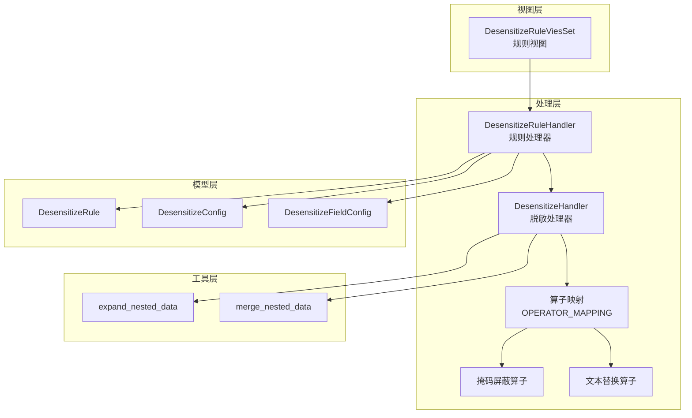
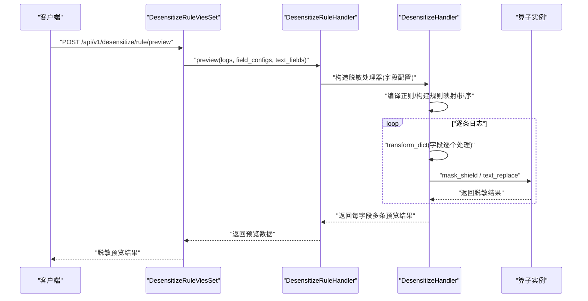
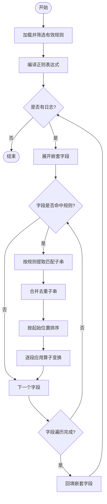
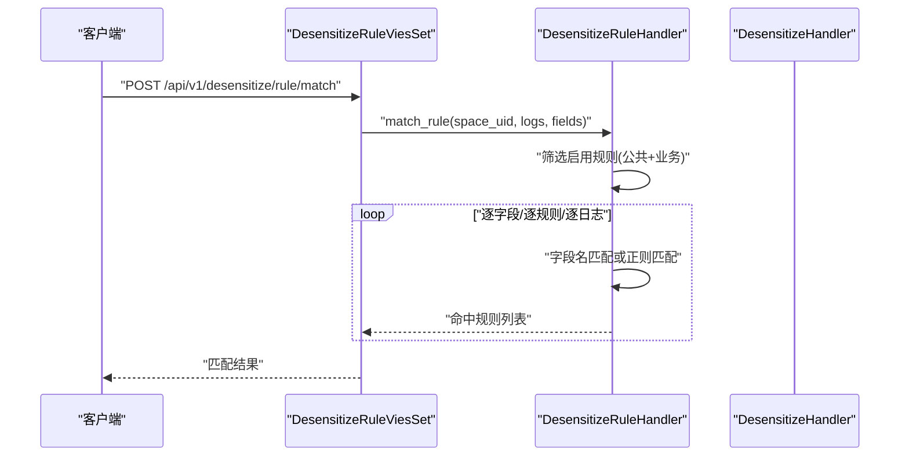
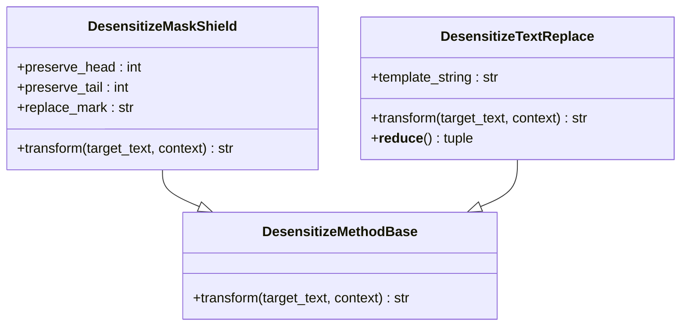
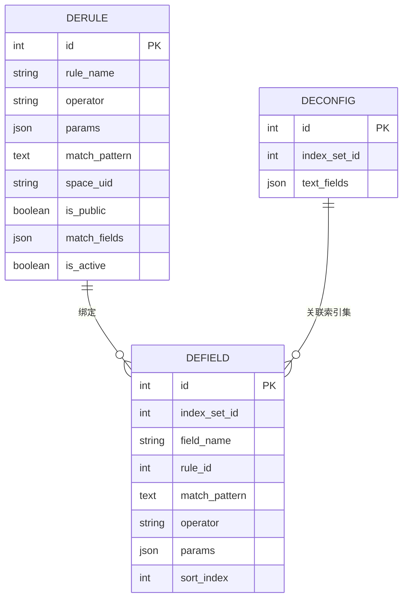
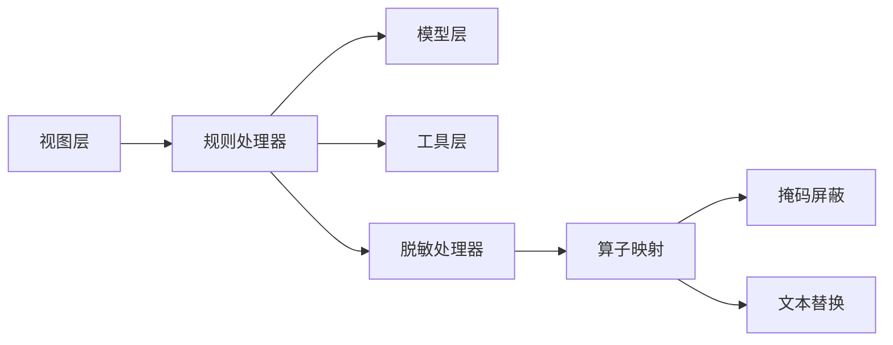

# 日志脱敏系统

<cite>
**本文引用的文件**
- [apps/log_desensitize/models.py](file://apps/log_desensitize/models.py)
- [apps/log_desensitize/constants.py](file://apps/log_desensitize/constants.py)
- [apps/log_desensitize/handlers/desensitize.py](file://apps/log_desensitize/handlers/desensitize.py)
- [apps/log_desensitize/handlers/desensitize_operator/base.py](file://apps/log_desensitize/handlers/desensitize_operator/base.py)
- [apps/log_desensitize/handlers/desensitize_operator/__init__.py](file://apps/log_desensitize/handlers/desensitize_operator/__init__.py)
- [apps/log_desensitize/handlers/desensitize_operator/mask_shield.py](file://apps/log_desensitize/handlers/desensitize_operator/mask_shield.py)
- [apps/log_desensitize/handlers/desensitize_operator/text_replace.py](file://apps/log_desensitize/handlers/desensitize_operator/text_replace.py)
- [apps/log_desensitize/views/desensitize_rule_views.py](file://apps/log_desensitize/views/desensitize_rule_views.py)
- [apps/log_desensitize/utils.py](file://apps/log_desensitize/utils.py)
- [apps/log_desensitize/urls.py](file://apps/log_desensitize/urls.py)
- [apps/log_desensitize/exceptions.py](file://apps/log_desensitize/exceptions.py)
- [apps/log_desensitize/migrations/0002_desensitizefieldconfig_match_pattern.py](file://apps/log_desensitize/migrations/0002_desensitizefieldconfig_match_pattern.py)
</cite>

## 目录
1. [简介](#简介)
2. [项目结构](#项目结构)
3. [核心组件](#核心组件)
4. [架构总览](#架构总览)
5. [详细组件分析](#详细组件分析)
6. [依赖关系分析](#依赖关系分析)
7. [性能考虑](#性能考虑)
8. [故障排查指南](#故障排查指南)
9. [结论](#结论)
10. [附录](#附录)

## 简介
本文件面向“日志脱敏系统”的技术文档，围绕脱敏算法实现、规则配置、效果验证、批量处理、性能优化等方面进行系统化说明。系统通过“规则 + 算子”的组合实现对日志字段的掩码屏蔽与文本替换，并支持正则表达式匹配与高亮调试，提供预览与匹配能力，满足生产环境下的安全与合规需求。

## 项目结构
日志脱敏相关代码主要位于 apps/log_desensitize 目录，采用按功能分层组织：
- 模型层：定义脱敏规则、脱敏配置、字段配置等模型
- 常量层：定义脱敏算子枚举、场景枚举、规则类型枚举等
- 处理层：脱敏处理器、规则处理器、算子基类与具体算子
- 视图层：规则管理接口（增删改查、启用/停用、正则/规则调试、匹配与预览）
- 工具层：嵌套字段展开/合并工具
- URL 层：路由注册
- 异常层：脱敏相关异常定义

图表来源
- [apps/log_desensitize/views/desensitize_rule_views.py:42-494](file://apps/log_desensitize/views/desensitize_rule_views.py#L42-L494)
- [apps/log_desensitize/handlers/desensitize.py:46-692](file://apps/log_desensitize/handlers/desensitize.py#L46-L692)
- [apps/log_desensitize/handlers/desensitize_operator/__init__.py:22-29](file://apps/log_desensitize/handlers/desensitize_operator/__init__.py#L22-L29)
- [apps/log_desensitize/models.py:29-80](file://apps/log_desensitize/models.py#L29-L80)
- [apps/log_desensitize/utils.py:25-64](file://apps/log_desensitize/utils.py#L25-L64)

章节来源
- [apps/log_desensitize/urls.py:22-36](file://apps/log_desensitize/urls.py#L22-L36)
- [apps/log_desensitize/views/desensitize_rule_views.py:42-494](file://apps/log_desensitize/views/desensitize_rule_views.py#L42-L494)

## 核心组件
- 脱敏规则模型：存储规则名称、算子、参数、匹配模式、匹配字段、是否启用、是否公共等
- 脱敏字段配置模型：记录字段名、规则ID、匹配模式、算子、参数、优先级等
- 脱敏配置模型：记录索引集ID与日志原文字段列表
- 脱敏处理器：负责规则编译、正则匹配、子串合并、流水线式处理
- 规则处理器：负责规则的创建/更新/删除/启用/停用、列表、匹配、预览、正则/规则调试
- 算子体系：掩码屏蔽、文本替换，均继承统一基类，支持参数校验与序列化
- 工具函数：嵌套字段展开/合并，便于处理扁平化字段

章节来源
- [apps/log_desensitize/models.py:29-80](file://apps/log_desensitize/models.py#L29-L80)
- [apps/log_desensitize/handlers/desensitize.py:46-252](file://apps/log_desensitize/handlers/desensitize.py#L46-L252)
- [apps/log_desensitize/handlers/desensitize_operator/base.py:25-37](file://apps/log_desensitize/handlers/desensitize_operator/base.py#L25-L37)
- [apps/log_desensitize/handlers/desensitize_operator/mask_shield.py:30-78](file://apps/log_desensitize/handlers/desensitize_operator/mask_shield.py#L30-L78)
- [apps/log_desensitize/handlers/desensitize_operator/text_replace.py:29-71](file://apps/log_desensitize/handlers/desensitize_operator/text_replace.py#L29-L71)
- [apps/log_desensitize/utils.py:25-64](file://apps/log_desensitize/utils.py#L25-L64)

## 架构总览
系统采用“视图 → 规则处理器 → 脱敏处理器 → 算子”的调用链路；规则与字段配置通过模型持久化，支持公共与业务空间两类规则，支持按字段或正则匹配，支持在日志原文字段与其他字段之间进行同步替换。

图表来源
- [apps/log_desensitize/views/desensitize_rule_views.py:407-494](file://apps/log_desensitize/views/desensitize_rule_views.py#L407-L494)
- [apps/log_desensitize/handlers/desensitize.py:591-692](file://apps/log_desensitize/handlers/desensitize.py#L591-L692)
- [apps/log_desensitize/handlers/desensitize_operator/__init__.py:22-29](file://apps/log_desensitize/handlers/desensitize_operator/__init__.py#L22-L29)

## 详细组件分析

### 脱敏处理器（DesensitizeHandler）
- 功能要点
  - 规则加载与筛选：根据传入配置列表过滤有效规则，支持字段精确匹配与顶层字段匹配
  - 正则编译：对每个规则的匹配模式进行编译，错误时抛出异常
  - 子串提取与合并：基于正则匹配结果，提取所有匹配子串并去重合并
  - 流水线处理：按优先级顺序对文本进行多次变换，支持高亮标记
  - 字典处理：对嵌套字段进行展开与回填，保证字段级脱敏

图表来源
- [apps/log_desensitize/handlers/desensitize.py:46-252](file://apps/log_desensitize/handlers/desensitize.py#L46-L252)
- [apps/log_desensitize/utils.py:25-64](file://apps/log_desensitize/utils.py#L25-L64)

章节来源
- [apps/log_desensitize/handlers/desensitize.py:46-252](file://apps/log_desensitize/handlers/desensitize.py#L46-L252)
- [apps/log_desensitize/utils.py:25-64](file://apps/log_desensitize/utils.py#L25-L64)

### 规则处理器（DesensitizeRuleHandler）
- 功能要点
  - 规则生命周期：创建/更新/删除/启用/停用
  - 规则列表：支持按公共/业务空间/全部过滤，统计接入场景与数量
  - 匹配能力：对样本日志按字段名或正则进行命中判断
  - 预览能力：对字段配置进行流水线脱敏，并将其他字段结果同步到日志原文字段
  - 调试能力：正则调试（高亮匹配）、规则调试（高亮脱敏结果）

图表来源
- [apps/log_desensitize/views/desensitize_rule_views.py:381-406](file://apps/log_desensitize/views/desensitize_rule_views.py#L381-L406)
- [apps/log_desensitize/handlers/desensitize.py:524-588](file://apps/log_desensitize/handlers/desensitize.py#L524-L588)

章节来源
- [apps/log_desensitize/handlers/desensitize.py:254-588](file://apps/log_desensitize/handlers/desensitize.py#L254-L588)
- [apps/log_desensitize/views/desensitize_rule_views.py:381-406](file://apps/log_desensitize/views/desensitize_rule_views.py#L381-L406)

### 算子体系
- 算子基类：统一 transform 接口，约束参数校验与序列化
- 掩码屏蔽（mask_shield）：支持保留前缀与后缀，其余以替换符号填充
- 文本替换（text_replace）：基于模板渲染，支持 Jinja2 变量语法，具备延迟模板初始化与可序列化特性

图表来源
- [apps/log_desensitize/handlers/desensitize_operator/base.py:25-37](file://apps/log_desensitize/handlers/desensitize_operator/base.py#L25-L37)
- [apps/log_desensitize/handlers/desensitize_operator/mask_shield.py:30-78](file://apps/log_desensitize/handlers/desensitize_operator/mask_shield.py#L30-L78)
- [apps/log_desensitize/handlers/desensitize_operator/text_replace.py:29-71](file://apps/log_desensitize/handlers/desensitize_operator/text_replace.py#L29-L71)

章节来源
- [apps/log_desensitize/handlers/desensitize_operator/base.py:25-37](file://apps/log_desensitize/handlers/desensitize_operator/base.py#L25-L37)
- [apps/log_desensitize/handlers/desensitize_operator/mask_shield.py:30-78](file://apps/log_desensitize/handlers/desensitize_operator/mask_shield.py#L30-L78)
- [apps/log_desensitize/handlers/desensitize_operator/text_replace.py:29-71](file://apps/log_desensitize/handlers/desensitize_operator/text_replace.py#L29-L71)

### 规则与字段配置模型
- 脱敏规则：规则名、算子、参数、匹配模式、匹配字段、是否启用、是否公共、空间标识
- 脱敏字段配置：字段名、规则ID、匹配模式、算子、参数、优先级
- 脱敏配置：索引集ID、日志原文字段列表

图表来源
- [apps/log_desensitize/models.py:29-80](file://apps/log_desensitize/models.py#L29-L80)

章节来源
- [apps/log_desensitize/models.py:29-80](file://apps/log_desensitize/models.py#L29-L80)

### 视图与接口
- 规则管理：列表、创建、更新、删除、启用、停用
- 调试与预览：正则调试、规则调试、匹配、预览
- 路由注册：DefaultRouter 注册规则视图集

章节来源
- [apps/log_desensitize/views/desensitize_rule_views.py:42-494](file://apps/log_desensitize/views/desensitize_rule_views.py#L42-L494)
- [apps/log_desensitize/urls.py:22-36](file://apps/log_desensitize/urls.py#L22-L36)

## 依赖关系分析
- 组件耦合
  - 视图层依赖规则处理器；规则处理器依赖模型与工具函数
  - 脱敏处理器依赖算子映射与正则库；对嵌套字段处理依赖工具函数
  - 算子依赖基类与参数序列化器
- 外部依赖
  - Django ORM 与序列化器
  - 正则表达式库
  - JSON 字段存储

图表来源
- [apps/log_desensitize/views/desensitize_rule_views.py:22-39](file://apps/log_desensitize/views/desensitize_rule_views.py#L22-L39)
- [apps/log_desensitize/handlers/desensitize.py:37-42](file://apps/log_desensitize/handlers/desensitize.py#L37-L42)
- [apps/log_desensitize/handlers/desensitize_operator/__init__.py:22-29](file://apps/log_desensitize/handlers/desensitize_operator/__init__.py#L22-L29)

章节来源
- [apps/log_desensitize/handlers/desensitize.py:37-42](file://apps/log_desensitize/handlers/desensitize.py#L37-L42)
- [apps/log_desensitize/handlers/desensitize_operator/__init__.py:22-29](file://apps/log_desensitize/handlers/desensitize_operator/__init__.py#L22-L29)

## 性能考虑
- 正则编译与缓存
  - 规则初始化阶段对匹配模式进行编译，建议在规则变更时复用编译结果，避免重复编译
- 子串合并与去重
  - 合并重叠匹配区间，减少多次变换带来的重复开销
- 流水线顺序
  - 通过 sort_index 控制优先级，确保规则按需执行，避免无效覆盖
- 嵌套字段处理
  - 展开/回填操作为 O(n) 遍历，建议在大批量日志场景中批量处理并复用中间结构
- 序列化与模板
  - 文本替换算子采用惰性模板初始化，减少不必要的对象创建

章节来源
- [apps/log_desensitize/handlers/desensitize.py:91-117](file://apps/log_desensitize/handlers/desensitize.py#L91-L117)
- [apps/log_desensitize/handlers/desensitize.py:204-227](file://apps/log_desensitize/handlers/desensitize.py#L204-L227)
- [apps/log_desensitize/handlers/desensitize_operator/text_replace.py:53-71](file://apps/log_desensitize/handlers/desensitize_operator/text_replace.py#L53-L71)

## 故障排查指南
- 常见异常
  - 规则不存在：当按 ID 查询规则失败时抛出
  - 规则名称冲突：创建/更新时若名称重复则报错
  - 正则编译失败：匹配模式非法导致编译异常
  - 数据处理异常：嵌套字段展开/合并过程中异常
  - 正则未匹配：调试时若无匹配结果则提示
- 定位建议
  - 使用“正则调试”接口确认匹配范围
  - 使用“规则调试”接口查看高亮后的脱敏结果
  - 使用“匹配”接口快速定位命中规则
  - 使用“预览”接口观察字段间同步替换效果

章节来源
- [apps/log_desensitize/exceptions.py:31-59](file://apps/log_desensitize/exceptions.py#L31-L59)
- [apps/log_desensitize/handlers/desensitize.py:461-508](file://apps/log_desensitize/handlers/desensitize.py#L461-L508)
- [apps/log_desensitize/views/desensitize_rule_views.py:297-379](file://apps/log_desensitize/views/desensitize_rule_views.py#L297-L379)

## 结论
该日志脱敏系统通过清晰的规则与算子分离、完善的调试与预览能力，实现了对日志字段的灵活、可控、可验证的脱敏处理。系统支持公共与业务空间规则、字段与正则双重匹配、流水线式规则叠加，并提供高亮调试与预览，满足生产环境的安全与合规要求。

## 附录

### 脱敏算法实现原理
- 掩码屏蔽
  - 保留前缀与后缀，中间以替换符号填充；当保留位数超过总长度时，不进行掩码
- 文本替换
  - 基于模板渲染，变量语法由 Jinja2 支持；模板在首次使用时惰性初始化
- 正则匹配
  - 对规则的匹配模式进行编译，使用迭代器提取所有匹配子串，支持命名组上下文传递

章节来源
- [apps/log_desensitize/handlers/desensitize_operator/mask_shield.py:54-78](file://apps/log_desensitize/handlers/desensitize_operator/mask_shield.py#L54-L78)
- [apps/log_desensitize/handlers/desensitize_operator/text_replace.py:63-66](file://apps/log_desensitize/handlers/desensitize_operator/text_replace.py#L63-L66)
- [apps/log_desensitize/handlers/desensitize.py:177-202](file://apps/log_desensitize/handlers/desensitize.py#L177-L202)

### 脱敏规则配置方法
- 规则模板
  - 规则名称、算子、参数、匹配模式、匹配字段、是否启用、是否公共、空间标识
- 匹配模式
  - 支持正则表达式；未配置时默认整段处理
- 脱敏策略设置
  - 掩码屏蔽：保留前缀/后缀位数、替换符号
  - 文本替换：模板字符串（Jinja2 语法），变量由正则命名组提供

章节来源
- [apps/log_desensitize/models.py:29-80](file://apps/log_desensitize/models.py#L29-L80)
- [apps/log_desensitize/constants.py:27-38](file://apps/log_desensitize/constants.py#L27-L38)
- [apps/log_desensitize/handlers/desensitize_operator/mask_shield.py:35-43](file://apps/log_desensitize/handlers/desensitize_operator/mask_shield.py#L35-L43)
- [apps/log_desensitize/handlers/desensitize_operator/text_replace.py:34-47](file://apps/log_desensitize/handlers/desensitize_operator/text_replace.py#L34-L47)

### 脱敏效果验证机制
- 脱敏前后对比
  - 预览接口返回每字段多条脱敏结果，便于对比
- 效果评估与质量检查
  - 正则调试：高亮展示匹配范围
  - 规则调试：高亮展示脱敏结果
  - 匹配接口：快速定位命中规则，评估覆盖度

章节来源
- [apps/log_desensitize/views/desensitize_rule_views.py:297-379](file://apps/log_desensitize/views/desensitize_rule_views.py#L297-L379)
- [apps/log_desensitize/handlers/desensitize.py:461-508](file://apps/log_desensitize/handlers/desensitize.py#L461-L508)
- [apps/log_desensitize/handlers/desensitize.py:591-692](file://apps/log_desensitize/handlers/desensitize.py#L591-L692)

### 批量脱敏处理实现
- 数据扫描
  - 对每条日志进行字段扫描，支持嵌套字段展开
- 规则应用
  - 依据字段规则映射与优先级，流水线式应用多个规则
- 结果输出
  - 支持字段级输出与日志原文字段同步替换，最终回填嵌套结构

章节来源
- [apps/log_desensitize/handlers/desensitize.py:131-157](file://apps/log_desensitize/handlers/desensitize.py#L131-L157)
- [apps/log_desensitize/handlers/desensitize.py:591-692](file://apps/log_desensitize/handlers/desensitize.py#L591-L692)
- [apps/log_desensitize/utils.py:25-64](file://apps/log_desensitize/utils.py#L25-L64)

### 性能优化策略
- 并行处理
  - 在外部框架层面可对不同日志批次进行并发处理，注意共享状态隔离
- 内存管理
  - 复用正则对象与模板对象，避免频繁创建销毁
- 缓存机制
  - 对常用规则的正则编译结果与模板进行缓存，减少重复计算

章节来源
- [apps/log_desensitize/handlers/desensitize.py:91-101](file://apps/log_desensitize/handlers/desensitize.py#L91-L101)
- [apps/log_desensitize/handlers/desensitize_operator/text_replace.py:53-61](file://apps/log_desensitize/handlers/desensitize_operator/text_replace.py#L53-L61)

### 实际配置示例与验证案例
- 掩码屏蔽示例
  - 场景：手机号中间段掩码，保留前3位与后2位，替换符号为星号
  - 配置：算子选择掩码屏蔽，参数设置保留前缀/后缀/替换符号
- 文本替换示例
  - 场景：将敏感字段替换为固定文案
  - 配置：算子选择文本替换，模板字符串中使用变量占位
- 验证步骤
  - 使用“正则调试”确认匹配范围
  - 使用“规则调试”确认脱敏结果高亮
  - 使用“预览”观察字段间同步替换

章节来源
- [apps/log_desensitize/handlers/desensitize_operator/mask_shield.py:44-78](file://apps/log_desensitize/handlers/desensitize_operator/mask_shield.py#L44-L78)
- [apps/log_desensitize/handlers/desensitize_operator/text_replace.py:49-66](file://apps/log_desensitize/handlers/desensitize_operator/text_replace.py#L49-L66)
- [apps/log_desensitize/views/desensitize_rule_views.py:297-379](file://apps/log_desensitize/views/desensitize_rule_views.py#L297-L379)
- [apps/log_desensitize/views/desensitize_rule_views.py:407-494](file://apps/log_desensitize/views/desensitize_rule_views.py#L407-L494)