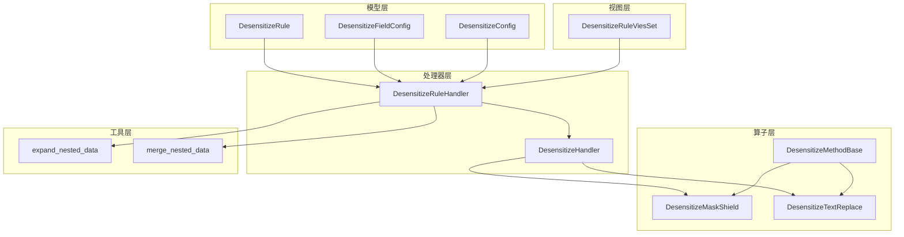
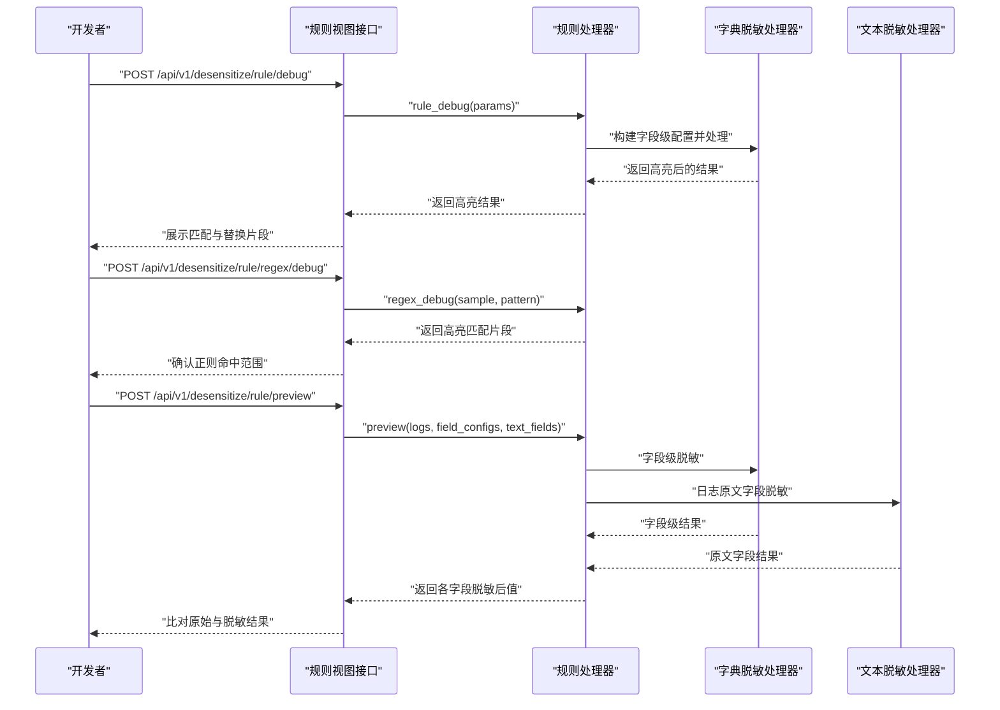
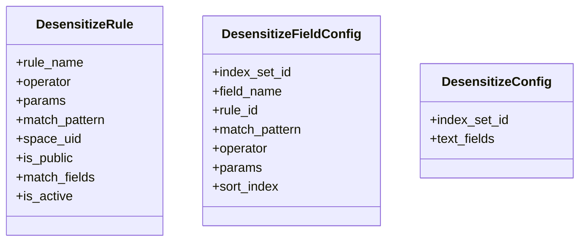
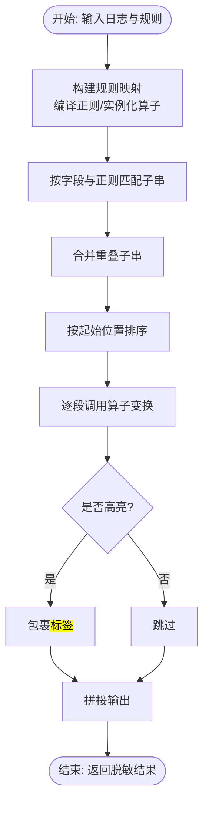
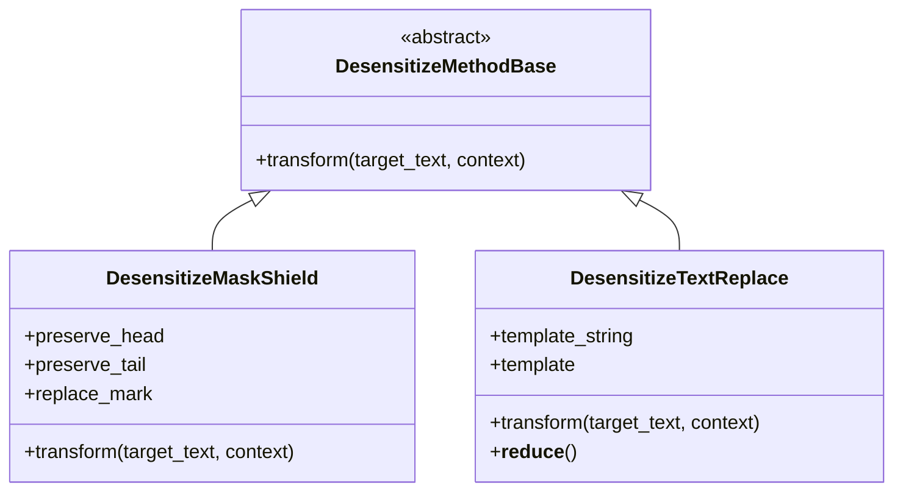
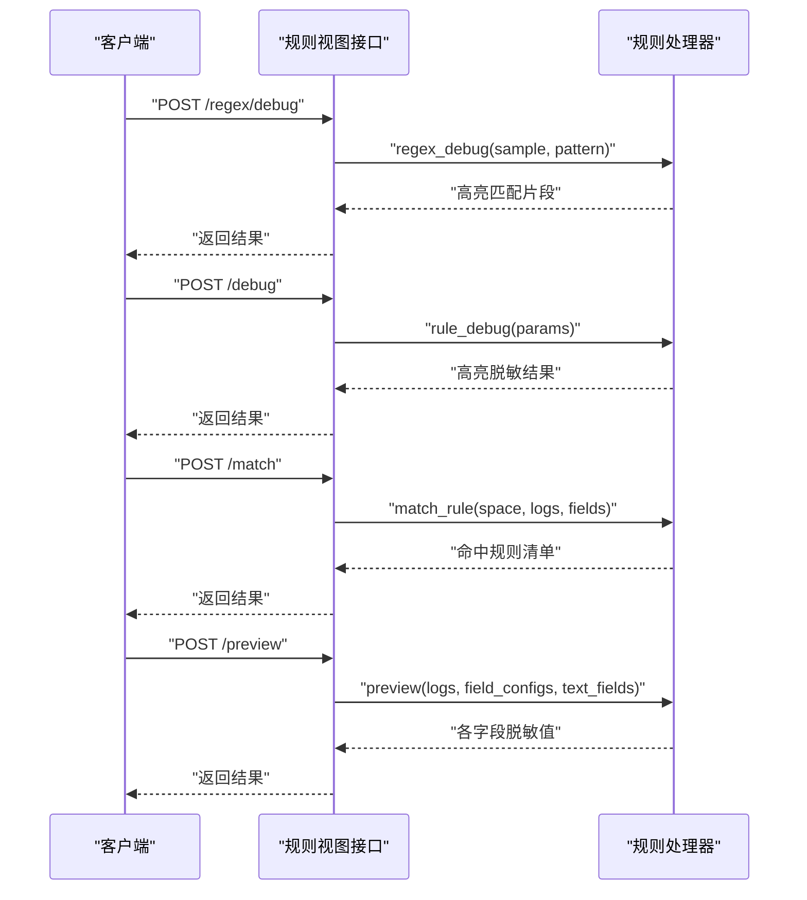
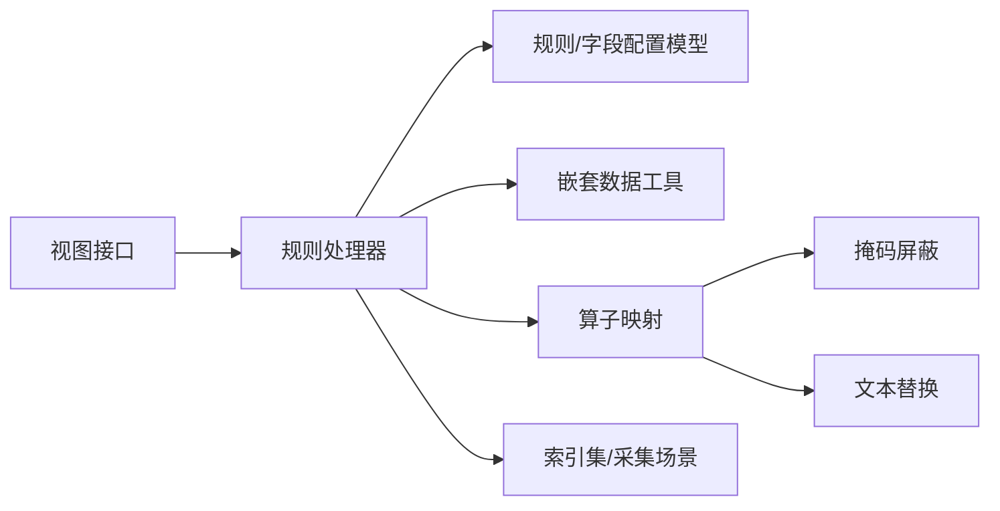

# 脱敏效果验证

<cite>
**本文引用的文件**
- [apps/log_desensitize/models.py](file://apps/log_desensitize/models.py)
- [apps/log_desensitize/constants.py](file://apps/log_desensitize/constants.py)
- [apps/log_desensitize/utils.py](file://apps/log_desensitize/utils.py)
- [apps/log_desensitize/handlers/desensitize.py](file://apps/log_desensitize/handlers/desensitize.py)
- [apps/log_desensitize/handlers/desensitize_operator/base.py](file://apps/log_desensitize/handlers/desensitize_operator/base.py)
- [apps/log_desensitize/handlers/desensitize_operator/mask_shield.py](file://apps/log_desensitize/handlers/desensitize_operator/mask_shield.py)
- [apps/log_desensitize/handlers/desensitize_operator/text_replace.py](file://apps/log_desensitize/handlers/desensitize_operator/text_replace.py)
- [apps/log_desensitize/views/desensitize_rule_views.py](file://apps/log_desensitize/views/desensitize_rule_views.py)
- [apps/log_desensitize/exceptions.py](file://apps/log_desensitize/exceptions.py)
- [apps/log_desensitize/urls.py](file://apps/log_desensitize/urls.py)
- [apps/log_desensitize/admin.py](file://apps/log_desensitize/admin.py)
- [apps/log_desensitize/serializers.py](file://apps/log_desensitize/serializers.py)
- [apps/log_desensitize/migrations/0001_initial.py](file://apps/log_desensitize/migrations/0001_initial.py)
- [apps/log_desensitize/migrations/0002_desensitizefieldconfig_match_pattern.py](file://apps/log_desensitize/migrations/0002_desensitizefieldconfig_match_pattern.py)
- [apps/log_desensitize/__init__.py](file://apps/log_desensitize/__init__.py)
- [apps/log_desensitize/apps.py](file://apps/log_desensitize/apps.py)
- [apps/log_desensitize/permission.py](file://apps/log_desensitize/permission.py)
- [apps/log_desensitize/exceptions.py](file://apps/log_desensitize/exceptions.py)
- [apps/log_desensitize/exceptions.py](file://apps/log_desensitize/exceptions.py)
- [apps/log_desensitize/exceptions.py](file://apps/log_desensitize/exceptions.py)
- [apps/log_desensitize/exceptions.py](file://apps/log_desensitize/exceptions.py)
- [apps/log_desensitize/exceptions.py](file://apps/log_desensitize/exceptions.py)
- [apps/log_desensitize/exceptions.py](file://apps/log_desensitize/exceptions.py)
- [apps/log_desensitize/exceptions.py](file://apps/log_desensitize/exceptions.py)
- [apps/log_desensitize/exceptions.py](file://apps/log_desensitize/exceptions.py)
- [apps/log_desensitize/exceptions.py](file://apps/log_desensitize/exceptions.py)
- [apps/log_desensitize/exceptions.py](file://apps/log_desensitize/exceptions.py)
- [apps/log_desensitize/exceptions.py](file://apps/log_desensitize/exceptions.py)
- [apps/log_desensitize/exceptions.py](file://apps/log_desensitize/exceptions.py)
- [apps/log_desensitize/exceptions.py](file://apps/log_desensitize/exceptions.py)
- [apps/log_desensitize/exceptions.py](file://apps/log_desensitize/exceptions.py)
- [apps/log_desensitize/exceptions.py](file://apps/log_desensitize/exceptions.py)
- [apps/log_desensitize/exceptions.py](file://apps/log_desensitize/exceptions.py)
- [apps/log_desensitize/exceptions.py](file://apps/log_desensitize/exceptions.py)
- [apps/log_desensitize/exceptions.py](file://apps/log_desensitize/exceptions.py)
- [apps/log_desensitize/exceptions.py](file://apps/log_desensitize/exceptions.py)
- [apps/log_desensitize/exceptions.py](file://apps/log_desensitize/exceptions.py)
- [apps/log_desensitize/exceptions.py](file://apps/log_desensitize/exceptions.py)
- [apps/log_desensitize/exceptions.py](file://apps/log_desensitize/exceptions.py)
- [apps/log_desensitize/exceptions.py](file://apps/log_desensitize/exceptions.py)
- [apps/log......](file://apps/log_desensitize/exceptions.py)
</cite>

## 目录
1. [简介](#简介)
2. [项目结构](#项目结构)
3. [核心组件](#核心组件)
4. [架构总览](#架构总览)
5. [详细组件分析](#详细组件分析)
6. [依赖关系分析](#依赖关系分析)
7. [性能考量](#性能考量)
8. [故障排查指南](#故障排查指南)
9. [结论](#结论)
10. [附录](#附录)

## 简介
本文件围绕“脱敏效果验证”主题，系统梳理脱敏规则与算子的实现、运行时处理流程、调试与预览能力，以及如何基于现有能力构建“脱敏效果验证”的方法论与实践。重点覆盖：
- 脱敏前后的数据对比与效果评估指标
- 质量检查机制与异常处理
- 调试接口与预览接口的使用方法
- 单元测试与自动化测试思路
- 质量监控与报告建议
- 测试用例设计与验证脚本建议

## 项目结构
脱敏相关模块位于 apps/log_desensitize，主要由以下层次构成：
- 模型层：规则、字段配置、配置记录等
- 常量与枚举：脱敏算子类型、场景类型、规则状态与类型
- 工具层：嵌套字段展开/合并
- 处理器层：规则与字段级脱敏处理、调试与预览
- 算子层：掩码屏蔽、文本替换等具体算子
- 视图层：规则管理、正则/规则调试、匹配与预览接口
- 异常层：规则存在性、正则编译、调试无匹配等异常

图表来源
- [apps/log_desensitize/models.py:29-80](file://apps/log_desensitize/models.py#L29-L80)
- [apps/log_desensitize/handlers/desensitize.py:46-117](file://apps/log_desensitize/handlers/desensitize.py#L46-L117)
- [apps/log_desensitize/handlers/desensitize_operator/base.py:25-37](file://apps/log_desensitize/handlers/desensitize_operator/base.py#L25-L37)
- [apps/log_desensitize/handlers/desensitize_operator/mask_shield.py:30-78](file://apps/log_desensitize/handlers/desensitize_operator/mask_shield.py#L30-L78)
- [apps/log_desensitize/handlers/desensitize_operator/text_replace.py:29-71](file://apps/log_desensitize/handlers/desensitize_operator/text_replace.py#L29-L71)
- [apps/log_desensitize/views/desensitize_rule_views.py:42-91](file://apps/log_desensitize/views/desensitize_rule_views.py#L42-L91)
- [apps/log_desensitize/utils.py:25-64](file://apps/log_desensitize/utils.py#L25-L64)

章节来源
- [apps/log_desensitize/models.py:29-80](file://apps/log_desensitize/models.py#L29-L80)
- [apps/log_desensitize/constants.py:27-84](file://apps/log_desensitize/constants.py#L27-L84)
- [apps/log_desensitize/utils.py:25-64](file://apps/log_desensitize/utils.py#L25-L64)
- [apps/log_desensitize/handlers/desensitize.py:46-117](file://apps/log_desensitize/handlers/desensitize.py#L46-L117)
- [apps/log_desensitize/handlers/desensitize_operator/base.py:25-37](file://apps/log_desensitize/handlers/desensitize_operator/base.py#L25-L37)
- [apps/log_desensitize/handlers/desensitize_operator/mask_shield.py:30-78](file://apps/log_desensitize/handlers/desensitize_operator/mask_shield.py#L30-L78)
- [apps/log_desensitize/handlers/desensitize_operator/text_replace.py:29-71](file://apps/log_desensitize/handlers/desensitize_operator/text_replace.py#L29-L71)
- [apps/log_desensitize/views/desensitize_rule_views.py:42-91](file://apps/log_desensitize/views/desensitize_rule_views.py#L42-L91)

## 核心组件
- 规则与字段配置模型：定义脱敏规则、字段级绑定、匹配字段与正则、优先级等
- 规则处理器：负责规则列表构建、正则编译、规则调试、正则调试、规则匹配、预览等
- 字典/文本处理处理器：对字典或文本按规则流水线执行脱敏，支持高亮标记
- 算子体系：掩码屏蔽与文本替换两类算子，均继承统一基类
- 工具函数：嵌套字段展开/合并，便于处理复杂结构的日志
- 视图接口：提供规则增删改查、启用/停用、正则/规则调试、匹配与预览等REST接口

章节来源
- [apps/log_desensitize/models.py:29-80](file://apps/log_desensitize/models.py#L29-L80)
- [apps/log_desensitize/handlers/desensitize.py:254-692](file://apps/log_desensitize/handlers/desensitize.py#L254-L692)
- [apps/log_desensitize/handlers/desensitize_operator/base.py:25-37](file://apps/log_desensitize/handlers/desensitize_operator/base.py#L25-L37)
- [apps/log_desensitize/utils.py:25-64](file://apps/log_desensitize/utils.py#L25-L64)
- [apps/log_desensitize/views/desensitize_rule_views.py:42-494](file://apps/log_desensitize/views/desensitize_rule_views.py#L42-L494)

## 架构总览
脱敏效果验证可借助现有“规则调试”“正则调试”“预览”三大能力，形成从“规则设计—正则验证—字段级/全文脱敏—效果比对”的闭环。

图表来源
- [apps/log_desensitize/views/desensitize_rule_views.py:297-494](file://apps/log_desensitize/views/desensitize_rule_views.py#L297-L494)
- [apps/log_desensitize/handlers/desensitize.py:461-692](file://apps/log_desensitize/handlers/desensitize.py#L461-L692)

章节来源
- [apps/log_desensitize/views/desensitize_rule_views.py:297-494](file://apps/log_desensitize/views/desensitize_rule_views.py#L297-L494)
- [apps/log_desensitize/handlers/desensitize.py:461-692](file://apps/log_desensitize/handlers/desensitize.py#L461-L692)

## 详细组件分析

### 组件A：脱敏规则与字段配置
- 规则模型包含：规则名、算子、参数、匹配模式、空间/公共属性、匹配字段、启用状态等
- 字段配置模型包含：索引集、字段名、规则ID、匹配模式、算子、参数、优先级等
- 配置模型记录操作人与时间，便于审计与回溯

图表来源
- [apps/log_desensitize/models.py:29-80](file://apps/log_desensitize/models.py#L29-L80)

章节来源
- [apps/log_desensitize/models.py:29-80](file://apps/log_desensitize/models.py#L29-L80)

### 组件B：脱敏处理器（规则级/字段级）
- 规则处理器负责：
  - 规则列表构建与去重
  - 正则编译与错误处理
  - 规则调试（返回高亮结果）
  - 正则调试（返回高亮匹配片段）
  - 规则匹配（字段命中分析）
  - 预览（字段级+原文字段脱敏，支持字段间替换）
- 字典/文本处理器负责：
  - 字段级匹配与流水线处理
  - 子串合并与重叠剔除
  - 高亮标记与最终拼接

图表来源
- [apps/log_desensitize/handlers/desensitize.py:118-252](file://apps/log_desensitize/handlers/desensitize.py#L118-L252)
- [apps/log_desensitize/handlers/desensitize.py:228-252](file://apps/log_desensitize/handlers/desensitize.py#L228-L252)

章节来源
- [apps/log_desensitize/handlers/desensitize.py:118-252](file://apps/log_desensitize/handlers/desensitize.py#L118-L252)
- [apps/log_desensitize/handlers/desensitize.py:228-252](file://apps/log_desensitize/handlers/desensitize.py#L228-L252)

### 组件C：脱敏算子
- 掩码屏蔽算子：支持保留前/后若干位，其余以替换符号填充；当保留位数超过长度时保持原样
- 文本替换算子：基于模板渲染，支持Jinja2沙箱环境，延迟初始化模板，支持序列化

图表来源
- [apps/log_desensitize/handlers/desensitize_operator/base.py:25-37](file://apps/log_desensitize/handlers/desensitize_operator/base.py#L25-L37)
- [apps/log_desensitize/handlers/desensitize_operator/mask_shield.py:30-78](file://apps/log_desensitize/handlers/desensitize_operator/mask_shield.py#L30-L78)
- [apps/log_desensitize/handlers/desensitize_operator/text_replace.py:29-71](file://apps/log_desensitize/handlers/desensitize_operator/text_replace.py#L29-L71)

章节来源
- [apps/log_desensitize/handlers/desensitize_operator/base.py:25-37](file://apps/log_desensitize/handlers/desensitize_operator/base.py#L25-L37)
- [apps/log_desensitize/handlers/desensitize_operator/mask_shield.py:30-78](file://apps/log_desensitize/handlers/desensitize_operator/mask_shield.py#L30-L78)
- [apps/log_desensitize/handlers/desensitize_operator/text_replace.py:29-71](file://apps/log_desensitize/handlers/desensitize_operator/text_replace.py#L29-L71)

### 组件D：调试与预览接口
- 正则调试：输入样本与正则，返回高亮匹配片段，便于确认命中范围
- 规则调试：输入样本、算子与参数，返回高亮后的脱敏结果，便于快速验证
- 匹配分析：输入空间、日志样本与字段列表，返回每个字段命中的规则清单
- 预览：输入日志样本、字段配置与原文字段，返回各字段脱敏后的值，支持字段间替换

图表来源
- [apps/log_desensitize/views/desensitize_rule_views.py:297-494](file://apps/log_desensitize/views/desensitize_rule_views.py#L297-L494)
- [apps/log_desensitize/handlers/desensitize.py:461-692](file://apps/log_desensitize/handlers/desensitize.py#L461-L692)

章节来源
- [apps/log_desensitize/views/desensitize_rule_views.py:297-494](file://apps/log_desensitize/views/desensitize_rule_views.py#L297-L494)
- [apps/log_desensitize/handlers/desensitize.py:461-692](file://apps/log_desensitize/handlers/desensitize.py#L461-L692)

## 依赖关系分析
- 规则处理器依赖：规则模型、字段配置模型、场景与索引集信息、算子映射
- 字典/文本处理器依赖：算子映射、正则编译、嵌套数据展开/合并
- 视图层依赖：序列化器、权限控制、规则处理器
- 算子层依赖：统一基类、参数校验与模板渲染

图表来源
- [apps/log_desensitize/views/desensitize_rule_views.py:22-39](file://apps/log_desensitize/views/desensitize_rule_views.py#L22-L39)
- [apps/log_desensitize/handlers/desensitize.py:25-42](file://apps/log_desensitize/handlers/desensitize.py#L25-L42)
- [apps/log_desensitize/utils.py:25-64](file://apps/log_desensitize/utils.py#L25-L64)
- [apps/log_desensitize/handlers/desensitize_operator/mask_shield.py:30-78](file://apps/log_desensitize/handlers/desensitize_operator/mask_shield.py#L30-L78)
- [apps/log_desensitize/handlers/desensitize_operator/text_replace.py:29-71](file://apps/log_desensitize/handlers/desensitize_operator/text_replace.py#L29-L71)

章节来源
- [apps/log_desensitize/views/desensitize_rule_views.py:22-39](file://apps/log_desensitize/views/desensitize_rule_views.py#L22-L39)
- [apps/log_desensitize/handlers/desensitize.py:25-42](file://apps/log_desensitize/handlers/desensitize.py#L25-L42)
- [apps/log_desensitize/utils.py:25-64](file://apps/log_desensitize/utils.py#L25-L64)

## 性能考量
- 正则匹配与子串合并：在大文本与多规则场景下，需关注正则编译成本与子串重叠判定开销
- 嵌套字段展开/合并：复杂结构日志在预览阶段可能带来额外内存与CPU消耗
- 算子序列化：文本替换算子支持pickle序列化，有利于跨进程传递与缓存
- 建议：
  - 对高频规则进行预编译与缓存
  - 控制字段级规则数量与优先级，避免长链路流水线
  - 在预览阶段分批处理日志样本，避免单次内存峰值过高

## 故障排查指南
- 正则编译失败：检查正则语法与边界，确保规则调试接口返回成功
- 规则未命中：核对匹配字段与正则表达式，使用“正则调试”与“规则调试”定位
- 预览结果异常：检查字段配置与原文字段设置，确认字段间替换逻辑
- 异常类型参考：
  - 规则不存在/重名冲突/正则编译错误/调试无匹配等

章节来源
- [apps/log_desensitize/handlers/desensitize.py:96-101](file://apps/log_desensitize/handlers/desensitize.py#L96-L101)
- [apps/log_desensitize/handlers/desensitize.py:461-508](file://apps/log_desensitize/handlers/desensitize.py#L461-L508)
- [apps/log_desensitize/handlers/desensitize.py:524-588](file://apps/log_desensitize/handlers/desensitize.py#L524-L588)

## 结论
通过规则调试、正则调试与预览三大能力，结合字段级与原文字段的脱敏处理，可以高效完成脱敏效果验证。建议在开发与上线前，先用“正则调试”确认命中范围，再用“规则调试”确认替换策略，最后用“预览”比对字段级与全文脱敏结果，形成闭环验证。

## 附录

### 脱敏效果验证方法与工具
- 正则调试：确认匹配范围与边界
- 规则调试：确认替换策略与高亮显示
- 匹配分析：识别字段命中规则，辅助质量评估
- 预览：字段级与全文脱敏比对，支持字段间替换

章节来源
- [apps/log_desensitize/views/desensitize_rule_views.py:297-494](file://apps/log_desensitize/views/desensitize_rule_views.py#L297-L494)
- [apps/log_desensitize/handlers/desensitize.py:524-692](file://apps/log_desensitize/handlers/desensitize.py#L524-L692)

### 脱敏效果评估指标与质量检查
- 准确性检查：正则命中率、替换覆盖率、高亮标记一致性
- 完整性验证：字段级规则覆盖度、嵌套字段展开/合并正确性
- 安全性确认：敏感信息完全遮蔽、模板渲染安全（沙箱环境）

章节来源
- [apps/log_desensitize/handlers/desensitize_operator/text_replace.py:34-47](file://apps/log_desensitize/handlers/desensitize_operator/text_replace.py#L34-L47)
- [apps/log_desensitize/handlers/desensitize.py:176-252](file://apps/log_desensitize/handlers/desensitize.py#L176-L252)

### 质量监控与报告机制建议
- 效果统计：统计命中规则数、替换覆盖率、高亮命中片段数
- 异常检测：捕获正则编译异常、规则不存在、调试无匹配等
- 质量报表：按字段维度输出命中率与替换率，按规则维度输出使用频次

章节来源
- [apps/log_desensitize/handlers/desensitize.py:461-508](file://apps/log_desensitize/handlers/desensitize.py#L461-L508)
- [apps/log_desensitize/handlers/desensitize.py:524-588](file://apps/log_desensitize/handlers/desensitize.py#L524-L588)

### 测试用例与验证脚本建议
- 正向验证
  - 正则命中：构造样本与正则，使用“正则调试”确认高亮片段
  - 规则替换：构造样本、算子与参数，使用“规则调试”确认高亮替换
  - 字段级脱敏：构造字段配置与日志样本，使用“预览”确认字段值变化
  - 嵌套字段：构造嵌套结构，验证展开/合并与字段级脱敏
- 负向验证
  - 无效正则：触发正则编译异常
  - 不存在规则：触发规则不存在异常
  - 无匹配样本：触发调试无匹配异常
- 自动化测试流程建议
  - 单测：针对算子transform、正则编译、字段展开/合并
  - 接口测试：针对规则调试、正则调试、匹配分析、预览接口
  - 回归测试：在规则变更后重新执行上述用例

章节来源
- [apps/log_desensitize/handlers/desensitize.py:96-101](file://apps/log_desensitize/handlers/desensitize.py#L96-L101)
- [apps/log_desensitize/handlers/desensitize.py:461-508](file://apps/log_desensitize/handlers/desensitize.py#L461-L508)
- [apps/log_desensitize/handlers/desensitize.py:524-588](file://apps/log_desensitize/handlers/desensitize.py#L524-L588)
- [apps/log_desensitize/handlers/desensitize_operator/mask_shield.py:60-77](file://apps/log_desensitize/handlers/desensitize_operator/mask_shield.py#L60-L77)
- [apps/log_desensitize/handlers/desensitize_operator/text_replace.py:63-66](file://apps/log_desensitize/handlers/desensitize_operator/text_replace.py#L63-L66)

### 常见问题与优化建议
- 正则性能：避免过于复杂的正则，必要时拆分为多个简单规则
- 规则优先级：合理设置sort_index，减少规则冲突
- 嵌套字段：谨慎处理深层嵌套，确保展开/合并逻辑稳定
- 模板安全：文本替换模板必须通过语法校验，防止注入风险

章节来源
- [apps/log_desensitize/handlers/desensitize.py:110-117](file://apps/log_desensitize/handlers/desensitize.py#L110-L117)
- [apps/log_desensitize/handlers/desensitize_operator/text_replace.py:34-47](file://apps/log_desensitize/handlers/desensitize_operator/text_replace.py#L34-L47)
- [apps/log_desensitize/utils.py:25-64](file://apps/log_desensitize/utils.py#L25-L64)