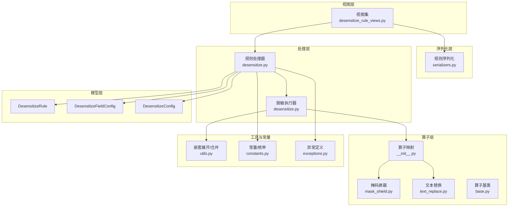
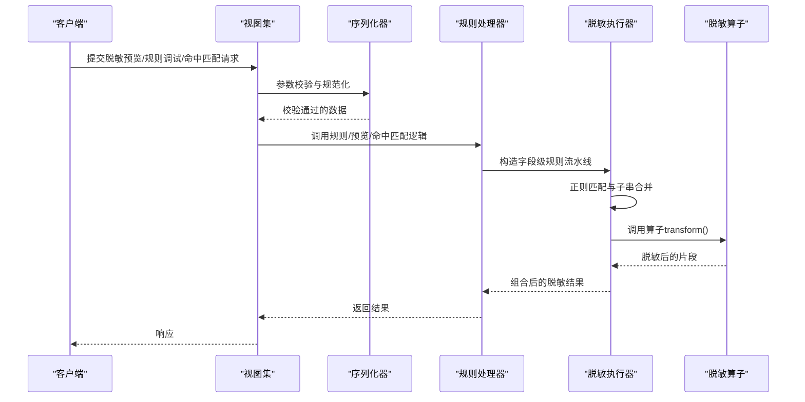
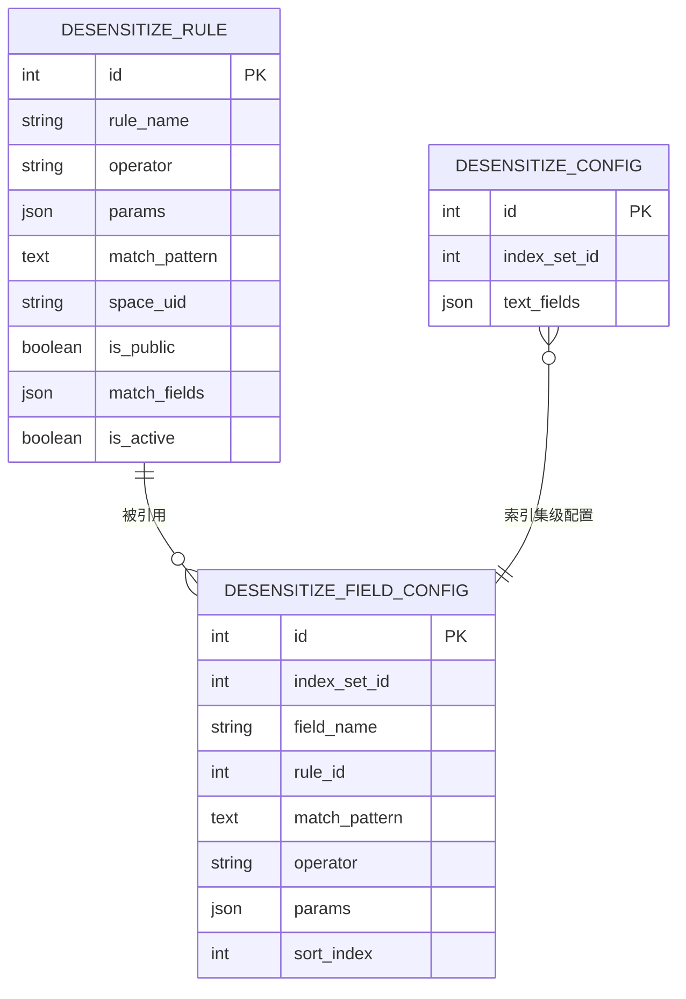
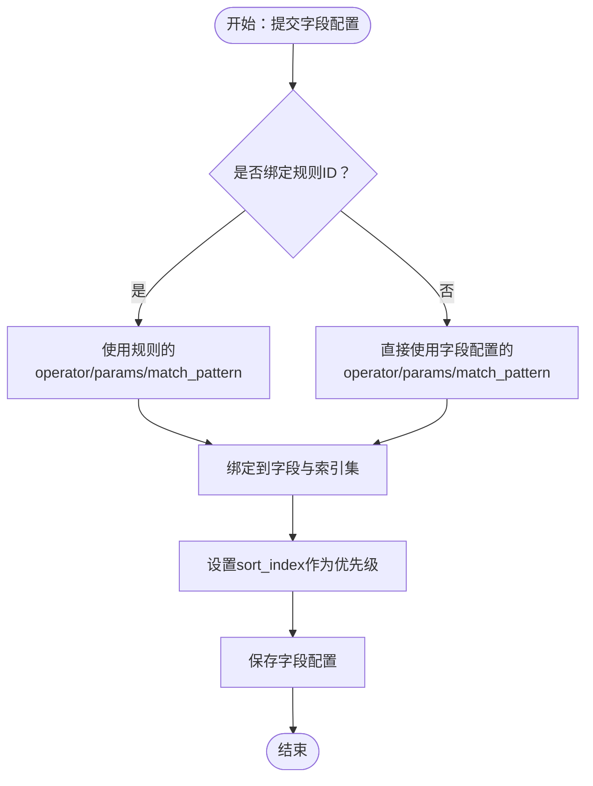
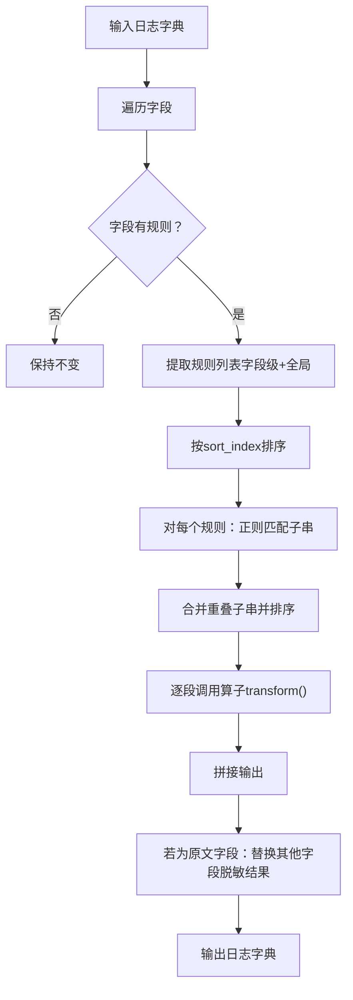
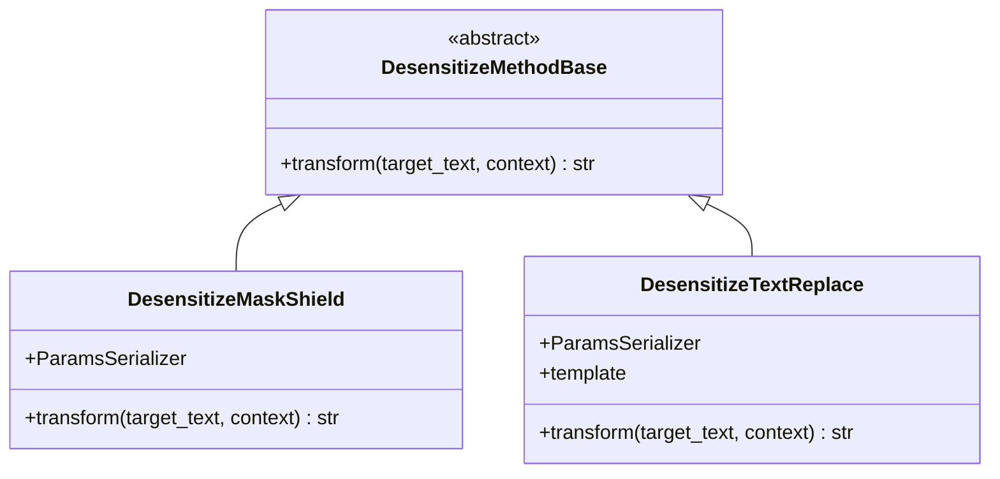
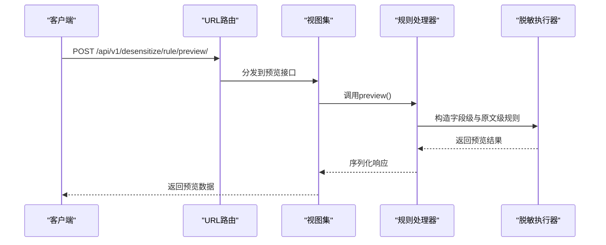
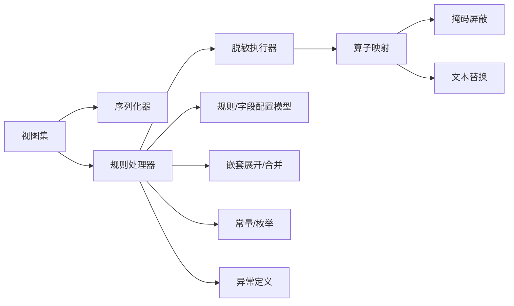

# 脱敏策略管理

<cite>
**本文引用的文件**
- [apps/log_desensitize/models.py](file://apps/log_desensitize/models.py)
- [apps/log_desensitize/handlers/desensitize.py](file://apps/log_desensitize/handlers/desensitize.py)
- [apps/log_desensitize/handlers/desensitize_operator/__init__.py](file://apps/log_desensitize/handlers/desensitize_operator/__init__.py)
- [apps/log_desensitize/handlers/desensitize_operator/base.py](file://apps/log_desensitize/handlers/desensitize_operator/base.py)
- [apps/log_desensitize/handlers/desensitize_operator/mask_shield.py](file://apps/log_desensitize/handlers/desensitize_operator/mask_shield.py)
- [apps/log_desensitize/handlers/desensitize_operator/text_replace.py](file://apps/log_desensitize/handlers/desensitize_operator/text_replace.py)
- [apps/log_desensitize/views/desensitize_rule_views.py](file://apps/log_desensitize/views/desensitize_rule_views.py)
- [apps/log_desensitize/serializers.py](file://apps/log_desensitize/serializers.py)
- [apps/log_desensitize/utils.py](file://apps/log_desensitize/utils.py)
- [apps/log_desensitize/constants.py](file://apps/log_desensitize/constants.py)
- [apps/log_desensitize/urls.py](file://apps/log_desensitize/urls.py)
- [apps/log_desensitize/exceptions.py](file://apps/log_desensitize/exceptions.py)
- [apps/log_desensitize/migrations/0001_initial.py](file://apps/log_desensitize/migrations/0001_initial.py)
- [apps/log_desensitize/migrations/0002_desensitizefieldconfig_match_pattern.py](file://apps/log_desensitize/migrations/0002_desensitizefieldconfig_match_pattern.py)
- [apps/log_search/serializers.py](file://apps/log_search/serializers.py)
</cite>

## 目录
1. [简介](#简介)
2. [项目结构](#项目结构)
3. [核心组件](#核心组件)
4. [架构总览](#架构总览)
5. [详细组件分析](#详细组件分析)
6. [依赖分析](#依赖分析)
7. [性能考虑](#性能考虑)
8. [故障排查指南](#故障排查指南)
9. [结论](#结论)
10. [附录](#附录)

## 简介
本技术文档围绕“脱敏策略管理”功能，系统阐述脱敏规则与字段配置的架构设计、策略创建与配置流程、执行机制（数据扫描、规则匹配、脱敏处理、结果输出）、优先级管理（多规则冲突与排序）、批量应用与更新机制（增量与全量），并提供最佳实践与性能优化建议。该功能通过规则与字段两级配置，结合可插拔的脱敏算子，实现对日志字段的灵活、可控、可审计的脱敏处理。

## 项目结构
脱敏策略管理位于 apps/log_desensitize 模块，主要由以下层次构成：
- 视图层：REST API 路由与视图，负责请求解析、权限控制与返回结果
- 序列化层：输入参数校验与参数规范化
- 处理层：脱敏规则与字段配置的业务逻辑、规则匹配与执行引擎
- 算子层：脱敏算子抽象与具体实现（掩码屏蔽、文本替换）
- 数据模型层：规则、字段配置、索引集关联等持久化模型
- 工具与常量：嵌套字段展开/合并、枚举与错误定义

图表来源
- [apps/log_desensitize/views/desensitize_rule_views.py:42-494](file://apps/log_desensitize/views/desensitize_rule_views.py#L42-L494)
- [apps/log_desensitize/serializers.py:34-167](file://apps/log_desensitize/serializers.py#L34-L167)
- [apps/log_desensitize/handlers/desensitize.py:46-692](file://apps/log_desensitize/handlers/desensitize.py#L46-L692)
- [apps/log_desensitize/handlers/desensitize_operator/__init__.py:22-30](file://apps/log_desensitize/handlers/desensitize_operator/__init__.py#L22-L30)
- [apps/log_desensitize/handlers/desensitize_operator/mask_shield.py:30-78](file://apps/log_desensitize/handlers/desensitize_operator/mask_shield.py#L30-L78)
- [apps/log_desensitize/handlers/desensitize_operator/text_replace.py:29-71](file://apps/log_desensitize/handlers/desensitize_operator/text_replace.py#L29-L71)
- [apps/log_desensitize/handlers/desensitize_operator/base.py:25-37](file://apps/log_desensitize/handlers/desensitize_operator/base.py#L25-L37)
- [apps/log_desensitize/models.py:29-80](file://apps/log_desensitize/models.py#L29-L80)
- [apps/log_desensitize/utils.py:25-64](file://apps/log_desensitize/utils.py#L25-L64)
- [apps/log_desensitize/constants.py:27-84](file://apps/log_desensitize/constants.py#L27-L84)
- [apps/log_desensitize/exceptions.py:31-59](file://apps/log_desensitize/exceptions.py#L31-L59)

章节来源
- [apps/log_desensitize/views/desensitize_rule_views.py:42-494](file://apps/log_desensitize/views/desensitize_rule_views.py#L42-L494)
- [apps/log_desensitize/serializers.py:34-167](file://apps/log_desensitize/serializers.py#L34-L167)
- [apps/log_desensitize/handlers/desensitize.py:46-692](file://apps/log_desensitize/handlers/desensitize.py#L46-L692)
- [apps/log_desensitize/models.py:29-80](file://apps/log_desensitize/models.py#L29-L80)

## 核心组件
- 规则模型（DesensitizeRule）：存储脱敏规则的名称、匹配字段、匹配正则、算子类型与参数、是否启用、是否全局等
- 字段配置模型（DesensitizeFieldConfig）：将规则或直接算子绑定到索引集下的具体字段，支持独立匹配模式与优先级
- 脱敏配置模型（DesensitizeConfig）：记录索引集的脱敏配置，包含日志原文字段列表
- 规则处理器（DesensitizeRuleHandler）：负责规则的增删改查、列表聚合（含接入场景统计）、正则/规则调试、命中规则匹配与预览
- 脱敏执行器（DesensitizeHandler）：根据字段级配置构建规则流水线，执行正则匹配与算子变换，支持原文字段联动替换
- 算子映射（OPERATOR_MAPPING）：将算子类型映射到具体实现（掩码屏蔽、文本替换）
- 序列化器：对规则创建/更新、列表查询、正则调试、规则调试、命中匹配、预览等接口进行参数校验
- 工具函数：expand_nested_data 与 merge_nested_data 支持嵌套字段的扁平化与还原

章节来源
- [apps/log_desensitize/models.py:29-80](file://apps/log_desensitize/models.py#L29-L80)
- [apps/log_desensitize/handlers/desensitize.py:254-692](file://apps/log_desensitize/handlers/desensitize.py#L254-L692)
- [apps/log_desensitize/handlers/desensitize_operator/__init__.py:22-30](file://apps/log_desensitize/handlers/desensitize_operator/__init__.py#L22-L30)
- [apps/log_desensitize/serializers.py:34-167](file://apps/log_desensitize/serializers.py#L34-L167)
- [apps/log_desensitize/utils.py:25-64](file://apps/log_desensitize/utils.py#L25-L64)

## 架构总览
脱敏策略管理采用“规则中心 + 字段绑定 + 执行引擎”的三层架构：
- 规则中心：统一维护脱敏规则，支持全局与业务空间两类规则，按启用状态生效
- 字段绑定：将规则或直接算子绑定到索引集的字段，支持字段级优先级与独立匹配模式
- 执行引擎：对日志内容进行扫描、规则匹配、算子处理与结果输出，支持原文字段联动替换

图表来源
- [apps/log_desensitize/views/desensitize_rule_views.py:165-493](file://apps/log_desensitize/views/desensitize_rule_views.py#L165-L493)
- [apps/log_desensitize/handlers/desensitize.py:523-691](file://apps/log_desensitize/handlers/desensitize.py#L523-L691)
- [apps/log_desensitize/handlers/desensitize_operator/__init__.py:26-29](file://apps/log_desensitize/handlers/desensitize_operator/__init__.py#L26-L29)

## 详细组件分析

### 数据模型与关系
- DesensitizeRule：规则实体，包含规则名、匹配字段列表、匹配正则、算子类型、参数、启用状态、是否全局、空间标识等
- DesensitizeFieldConfig：字段级配置，绑定索引集、字段名、规则ID、独立匹配模式、算子与参数、优先级
- DesensitizeConfig：索引集级配置，记录日志原文字段列表
- 关系：字段配置可引用规则；规则可被多个字段配置引用；字段配置与索引集关联

图表来源
- [apps/log_desensitize/models.py:29-80](file://apps/log_desensitize/models.py#L29-L80)
- [apps/log_desensitize/migrations/0001_initial.py:52-83](file://apps/log_desensitize/migrations/0001_initial.py#L52-L83)
- [apps/log_desensitize/migrations/0002_desensitizefieldconfig_match_pattern.py:12-18](file://apps/log_desensitize/migrations/0002_desensitizefieldconfig_match_pattern.py#L12-L18)

章节来源
- [apps/log_desensitize/models.py:29-80](file://apps/log_desensitize/models.py#L29-L80)
- [apps/log_desensitize/migrations/0001_initial.py:52-83](file://apps/log_desensitize/migrations/0001_initial.py#L52-L83)
- [apps/log_desensitize/migrations/0002_desensitizefieldconfig_match_pattern.py:12-18](file://apps/log_desensitize/migrations/0002_desensitizefieldconfig_match_pattern.py#L12-L18)

### 规则与字段配置的创建与绑定
- 规则创建/更新：通过视图集提交规则参数，序列化器进行参数校验（名称唯一性、算子类型、正则合法性、参数序列化器校验），处理器完成去重与持久化
- 字段绑定：字段配置支持两种绑定方式
  - 规则绑定：通过 rule_id 引用规则，自动继承规则的 operator、params、match_pattern
  - 直接算子绑定：在字段配置中直接指定 operator、params、match_pattern
- 索引集关联：字段配置与 index_set_id 关联，形成“索引集 → 字段 → 规则/算子”的链路

图表来源
- [apps/log_desensitize/handlers/desensitize.py:52-117](file://apps/log_desensitize/handlers/desensitize.py#L52-L117)
- [apps/log_desensitize/serializers.py:47-99](file://apps/log_desensitize/serializers.py#L47-L99)
- [apps/log_desensitize/models.py:63-80](file://apps/log_desensitize/models.py#L63-L80)

章节来源
- [apps/log_desensitize/handlers/desensitize.py:52-117](file://apps/log_desensitize/handlers/desensitize.py#L52-L117)
- [apps/log_desensitize/serializers.py:47-99](file://apps/log_desensitize/serializers.py#L47-L99)
- [apps/log_desensitize/models.py:63-80](file://apps/log_desensitize/models.py#L63-L80)

### 规则执行机制与优先级管理
- 规则流水线：根据字段配置构造两条流水线
  - 字段级规则：按字段名分组，组内按 sort_index 升序（数值越小优先级越高）
  - 全局规则：按 sort_index 升序
- 正则匹配与子串合并：对每条规则，使用正则提取匹配子串，合并重叠区间，按起始位置排序
- 算子处理：逐个子串调用算子 transform，支持高亮标记；最终拼接输出
- 原文字段联动：对 text_fields 的字段，先按字段级规则处理，再将其他字段的脱敏结果替换到原文字段中

图表来源
- [apps/log_desensitize/handlers/desensitize.py:118-251](file://apps/log_desensitize/handlers/desensitize.py#L118-L251)
- [apps/log_desensitize/handlers/desensitize.py:590-691](file://apps/log_desensitize/handlers/desensitize.py#L590-L691)

章节来源
- [apps/log_desensitize/handlers/desensitize.py:118-251](file://apps/log_desensitize/handlers/desensitize.py#L118-L251)
- [apps/log_desensitize/handlers/desensitize.py:590-691](file://apps/log_desensitize/handlers/desensitize.py#L590-L691)

### 脱敏算子与扩展
- 算子基类：定义 transform 抽象方法，约束参数序列化器
- 掩码屏蔽（mask_shield）：支持保留前缀与后缀，其余用替换符号遮盖
- 文本替换（text_replace）：基于模板渲染，支持 Jinja2 变量占位，延迟模板初始化，支持序列化
- 算子映射：通过 OPERATOR_MAPPING 将字符串类型映射到具体类

图表来源
- [apps/log_desensitize/handlers/desensitize_operator/base.py:25-37](file://apps/log_desensitize/handlers/desensitize_operator/base.py#L25-L37)
- [apps/log_desensitize/handlers/desensitize_operator/mask_shield.py:30-78](file://apps/log_desensitize/handlers/desensitize_operator/mask_shield.py#L30-L78)
- [apps/log_desensitize/handlers/desensitize_operator/text_replace.py:29-71](file://apps/log_desensitize/handlers/desensitize_operator/text_replace.py#L29-L71)
- [apps/log_desensitize/handlers/desensitize_operator/__init__.py:26-29](file://apps/log_desensitize/handlers/desensitize_operator/__init__.py#L26-L29)

章节来源
- [apps/log_desensitize/handlers/desensitize_operator/base.py:25-37](file://apps/log_desensitize/handlers/desensitize_operator/base.py#L25-L37)
- [apps/log_desensitize/handlers/desensitize_operator/mask_shield.py:30-78](file://apps/log_desensitize/handlers/desensitize_operator/mask_shield.py#L30-L78)
- [apps/log_desensitize/handlers/desensitize_operator/text_replace.py:29-71](file://apps/log_desensitize/handlers/desensitize_operator/text_replace.py#L29-L71)
- [apps/log_desensitize/handlers/desensitize_operator/__init__.py:26-29](file://apps/log_desensitize/handlers/desensitize_operator/__init__.py#L26-L29)

### API 与工作流
- 规则列表/创建/更新/删除/启停/详情：由视图集提供 REST 接口，序列化器进行参数校验
- 正则调试/规则调试：快速验证匹配与脱敏效果
- 命中规则匹配：在给定字段与日志样本上，返回命中的规则清单
- 预览：对字段配置进行脱敏预览，支持原文字段联动替换

图表来源
- [apps/log_desensitize/urls.py:28-35](file://apps/log_desensitize/urls.py#L28-L35)
- [apps/log_desensitize/views/desensitize_rule_views.py:407-493](file://apps/log_desensitize/views/desensitize_rule_views.py#L407-L493)
- [apps/log_desensitize/handlers/desensitize.py:590-691](file://apps/log_desensitize/handlers/desensitize.py#L590-L691)

章节来源
- [apps/log_desensitize/urls.py:28-35](file://apps/log_desensitize/urls.py#L28-L35)
- [apps/log_desensitize/views/desensitize_rule_views.py:165-493](file://apps/log_desensitize/views/desensitize_rule_views.py#L165-L493)
- [apps/log_desensitize/handlers/desensitize.py:590-691](file://apps/log_desensitize/handlers/desensitize.py#L590-L691)

### 嵌套字段处理
- 展开：expand_nested_data 将嵌套对象扁平化为 “a.b.c” 形式的键
- 合并：merge_nested_data 将扁平化键还原为嵌套对象
- 字段匹配：当字段名为 a.b 时，优先匹配 a.b；否则尝试匹配 a（顶层字段）

章节来源
- [apps/log_desensitize/utils.py:25-64](file://apps/log_desensitize/utils.py#L25-L64)
- [apps/log_desensitize/handlers/desensitize.py:140-157](file://apps/log_desensitize/handlers/desensitize.py#L140-L157)

### 规则与索引集关联及接入场景统计
- 规则列表接口会统计规则绑定的索引集数量与接入场景（采集接入、自定义上报、第三方ES、数据平台、索引集）
- 通过 DesensitizeFieldConfig 与 LogIndexSet、CollectorConfig 等模型关联，过滤掉已删除的索引集

章节来源
- [apps/log_desensitize/handlers/desensitize.py:317-428](file://apps/log_desensitize/handlers/desensitize.py#L317-L428)

## 依赖分析
- 视图层依赖序列化器与处理器；处理器依赖模型、工具函数与算子映射
- 字段配置依赖规则模型；规则模型与字段配置之间为一对多关系
- 算子映射集中管理算子类型到实现类的映射，便于扩展新算子
- 常量与枚举统一管理规则类型、场景类型、状态枚举等

图表来源
- [apps/log_desensitize/views/desensitize_rule_views.py:22-39](file://apps/log_desensitize/views/desensitize_rule_views.py#L22-L39)
- [apps/log_desensitize/handlers/desensitize.py:254-692](file://apps/log_desensitize/handlers/desensitize.py#L254-L692)
- [apps/log_desensitize/handlers/desensitize_operator/__init__.py:22-30](file://apps/log_desensitize/handlers/desensitize_operator/__init__.py#L22-L30)
- [apps/log_desensitize/serializers.py:22-31](file://apps/log_desensitize/serializers.py#L22-L31)
- [apps/log_desensitize/constants.py:27-84](file://apps/log_desensitize/constants.py#L27-L84)
- [apps/log_desensitize/exceptions.py:31-59](file://apps/log_desensitize/exceptions.py#L31-L59)

章节来源
- [apps/log_desensitize/handlers/desensitize.py:254-692](file://apps/log_desensitize/handlers/desensitize.py#L254-L692)
- [apps/log_desensitize/handlers/desensitize_operator/__init__.py:22-30](file://apps/log_desensitize/handlers/desensitize_operator/__init__.py#L22-L30)
- [apps/log_desensitize/serializers.py:22-31](file://apps/log_desensitize/serializers.py#L22-L31)
- [apps/log_desensitize/constants.py:27-84](file://apps/log_desensitize/constants.py#L27-L84)
- [apps/log_desensitize/exceptions.py:31-59](file://apps/log_desensitize/exceptions.py#L31-L59)

## 性能考虑
- 正则编译缓存：单条规则的正则在初始化时编译，避免重复编译开销
- 子串合并与排序：合并重叠区间与按起始位置排序，减少多次遍历
- 嵌套字段处理：扁平化与还原仅在必要时进行，避免对非嵌套字段产生额外开销
- 规则优先级：通过 sort_index 排序，确保最短路径优先，减少无效匹配
- 预览与调试：预览接口按字段配置构造两条流水线，注意字段数量与规则数量的乘积影响

[本节为通用性能建议，无需特定文件引用]

## 故障排查指南
- 正则编译失败：检查 match_pattern 合法性，异常消息包含规则ID与非法表达式
- 规则不存在：访问规则详情或启停操作时，若规则不存在抛出相应异常
- 正则未匹配：正则调试接口在未匹配时抛出异常，提示未匹配目标字符串
- 原始数据异常：嵌套展开/合并过程中异常，提示原始日志子对象处理异常
- 参数校验失败：序列化器对 operator、match_pattern、operator_params 等进行严格校验，不符合要求会抛出异常

章节来源
- [apps/log_desensitize/handlers/desensitize.py:96-101](file://apps/log_desensitize/handlers/desensitize.py#L96-L101)
- [apps/log_desensitize/handlers/desensitize.py:461-485](file://apps/log_desensitize/handlers/desensitize.py#L461-L485)
- [apps/log_desensitize/exceptions.py:46-59](file://apps/log_desensitize/exceptions.py#L46-L59)
- [apps/log_desensitize/serializers.py:74-99](file://apps/log_desensitize/serializers.py#L74-L99)

## 结论
脱敏策略管理通过“规则中心 + 字段绑定 + 执行引擎”的架构，实现了对日志字段的灵活、可审计、可扩展的脱敏处理。字段级优先级与规则流水线保证了复杂场景下的确定性行为；正则匹配与子串合并提升了精度；嵌套字段处理与原文联动增强了实用性。配合预览与调试能力，能够高效地完成策略设计与落地。

[本节为总结性内容，无需特定文件引用]

## 附录

### 最佳实践
- 规则命名：使用清晰、可识别的规则名称，避免同名冲突
- 匹配策略：优先使用 match_fields 限定字段范围，再配合 match_pattern 精确匹配
- 算子选择：掩码屏蔽适合固定长度字段，文本替换适合复杂模板场景
- 优先级设计：字段级优先级越小越靠前；同一字段内按风险等级或覆盖范围排序
- 预览验证：在生产应用前使用预览接口验证脱敏效果
- 全局与业务规则：合理划分全局规则与业务规则，避免相互干扰

[本节为通用建议，无需特定文件引用]