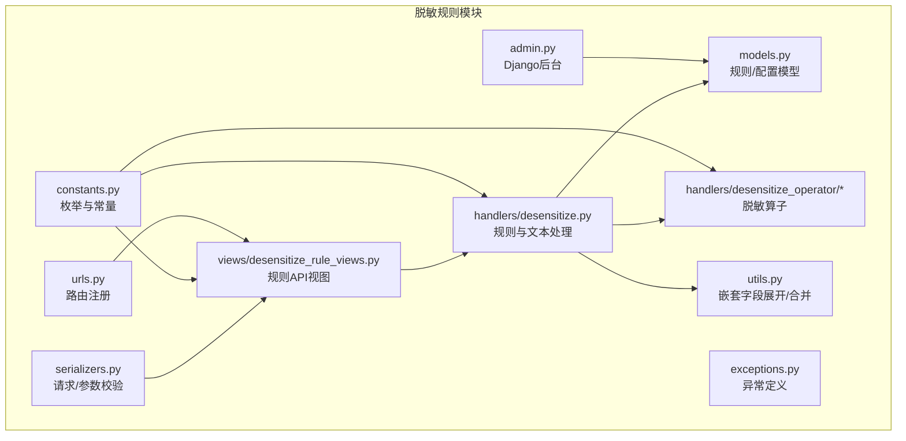
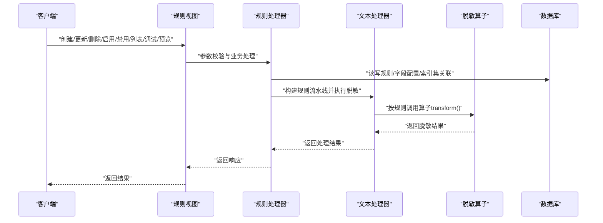
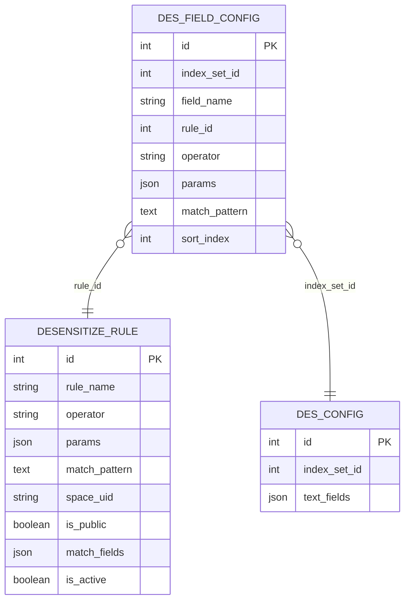
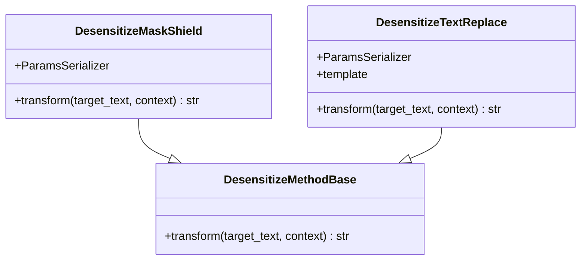
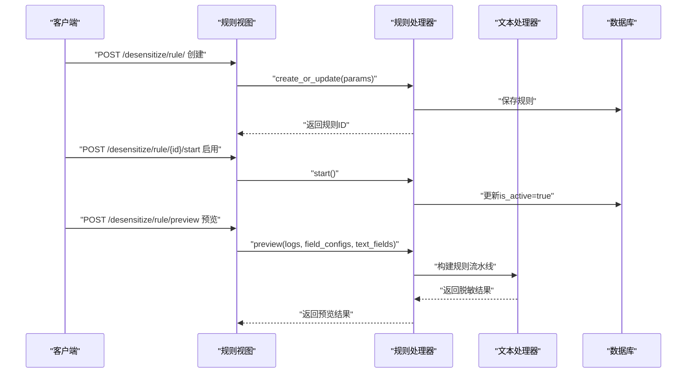
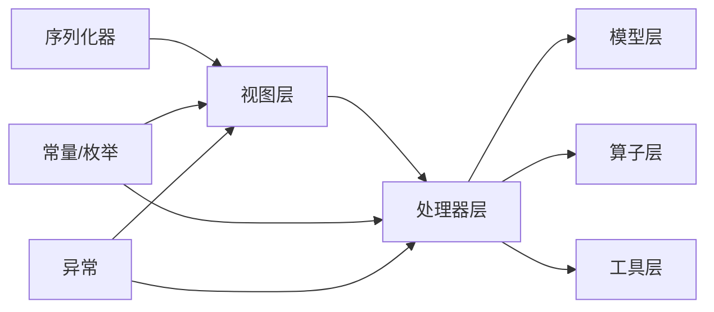

# 脱敏规则配置

<cite>
**本文引用的文件**
- [apps/log_desensitize/models.py](file://apps/log_desensitize/models.py)
- [apps/log_desensitize/views/desensitize_rule_views.py](file://apps/log_desensitize/views/desensitize_rule_views.py)
- [apps/log_desensitize/handlers/desensitize.py](file://apps/log_desensitize/handlers/desensitize.py)
- [apps/log_desensitize/constants.py](file://apps/log_desensitize/constants.py)
- [apps/log_desensitize/handlers/desensitize_operator/__init__.py](file://apps/log_desensitize/handlers/desensitize_operator/__init__.py)
- [apps/log_desensitize/handlers/desensitize_operator/base.py](file://apps/log_desensitize/handlers/desensitize_operator/base.py)
- [apps/log_desensitize/handlers/desensitize_operator/mask_shield.py](file://apps/log_desensitize/handlers/desensitize_operator/mask_shield.py)
- [apps/log_desensitize/handlers/desensitize_operator/text_replace.py](file://apps/log_desensitize/handlers/desensitize_operator/text_replace.py)
- [apps/log_desensitize/serializers.py](file://apps/log_desensitize/serializers.py)
- [apps/log_desensitize/utils.py](file://apps/log_desensitize/utils.py)
- [apps/log_desensitize/admin.py](file://apps/log_desensitize/admin.py)
- [apps/log_desensitize/urls.py](file://apps/log_desensitize/urls.py)
- [apps/log_desensitize/exceptions.py](file://apps/log_desensitize/exceptions.py)
</cite>

## 目录
1. [简介](#简介)
2. [项目结构](#项目结构)
3. [核心组件](#核心组件)
4. [架构总览](#架构总览)
5. [详细组件分析](#详细组件分析)
6. [依赖分析](#依赖分析)
7. [性能考虑](#性能考虑)
8. [故障排查指南](#故障排查指南)
9. [结论](#结论)
10. [附录](#附录)

## 简介
本技术文档围绕“脱敏规则配置”功能，系统阐述脱敏规则的定义与结构、脱敏算子类型与实现、规则参数配置方法、匹配模式的定义与使用，以及规则的创建、编辑、删除、启用/禁用与调试预览的完整操作流程。文档还提供规则配置示例与最佳实践建议，帮助开发者与运维人员快速理解并高效使用该功能。

## 项目结构
脱敏规则配置功能主要位于 apps/log_desensitize 子模块，包含模型、序列化器、视图、处理器、算子、工具与异常等模块，配合路由与后台管理界面共同构成完整的规则生命周期管理能力。

图表来源
- [apps/log_desensitize/models.py:1-80](file://apps/log_desensitize/models.py#L1-L80)
- [apps/log_desensitize/views/desensitize_rule_views.py:1-494](file://apps/log_desensitize/views/desensitize_rule_views.py#L1-L494)
- [apps/log_desensitize/handlers/desensitize.py:1-692](file://apps/log_desensitize/handlers/desensitize.py#L1-L692)
- [apps/log_desensitize/serializers.py:1-167](file://apps/log_desensitize/serializers.py#L1-L167)
- [apps/log_desensitize/utils.py:1-64](file://apps/log_desensitize/utils.py#L1-L64)
- [apps/log_desensitize/constants.py:1-84](file://apps/log_desensitize/constants.py#L1-L84)
- [apps/log_desensitize/handlers/desensitize_operator/__init__.py:1-30](file://apps/log_desensitize/handlers/desensitize_operator/__init__.py#L1-L30)
- [apps/log_desensitize/admin.py:1-77](file://apps/log_desensitize/admin.py#L1-L77)
- [apps/log_desensitize/urls.py:1-36](file://apps/log_desensitize/urls.py#L1-L36)

章节来源
- [apps/log_desensitize/models.py:1-80](file://apps/log_desensitize/models.py#L1-L80)
- [apps/log_desensitize/views/desensitize_rule_views.py:1-494](file://apps/log_desensitize/views/desensitize_rule_views.py#L1-L494)
- [apps/log_desensitize/urls.py:1-36](file://apps/log_desensitize/urls.py#L1-L36)

## 核心组件
- 模型层
  - 规则模型：存储规则名称、脱敏算子、参数、匹配模式、空间标识、是否公共、匹配字段、启用状态等。
  - 字段配置模型：记录索引集、字段名、规则绑定、匹配模式、算子与参数、优先级等。
  - 脱敏配置模型：记录索引集与日志原文字段列表。
- 处理器层
  - 规则处理器：负责规则的增删改查、列表聚合、启用/禁用、正则/规则调试、命中匹配、预览等。
  - 文本处理器：基于规则流水线对字典或文本进行逐条脱敏，支持高亮标记与嵌套字段处理。
  - 算子映射：将算子名称映射到具体算子类，支持参数校验与实例化。
- 序列化器层：对请求参数进行严格校验，包括正则合法性、算子类型、参数格式等。
- 工具层：提供嵌套字段展开/合并，便于处理复杂JSON结构的日志字段。
- 异常层：统一定义规则不存在、重名、正则编译失败、数据处理异常等错误。

章节来源
- [apps/log_desensitize/models.py:29-80](file://apps/log_desensitize/models.py#L29-L80)
- [apps/log_desensitize/handlers/desensitize.py:254-692](file://apps/log_desensitize/handlers/desensitize.py#L254-L692)
- [apps/log_desensitize/handlers/desensitize_operator/__init__.py:26-30](file://apps/log_desensitize/handlers/desensitize_operator/__init__.py#L26-L30)
- [apps/log_desensitize/serializers.py:47-167](file://apps/log_desensitize/serializers.py#L47-L167)
- [apps/log_desensitize/utils.py:25-64](file://apps/log_desensitize/utils.py#L25-L64)
- [apps/log_desensitize/exceptions.py:31-59](file://apps/log_desensitize/exceptions.py#L31-L59)

## 架构总览
脱敏规则配置采用“视图-处理器-模型-算子”的分层架构。视图负责权限控制与接口暴露；处理器负责业务逻辑与规则流水线；模型负责持久化；算子负责具体脱敏算法实现；序列化器负责输入校验；工具与常量提供通用能力与约定。

图表来源
- [apps/log_desensitize/views/desensitize_rule_views.py:93-494](file://apps/log_desensitize/views/desensitize_rule_views.py#L93-L494)
- [apps/log_desensitize/handlers/desensitize.py:254-692](file://apps/log_desensitize/handlers/desensitize.py#L254-L692)
- [apps/log_desensitize/handlers/desensitize_operator/__init__.py:26-30](file://apps/log_desensitize/handlers/desensitize_operator/__init__.py#L26-L30)

## 详细组件分析

### 数据模型与结构
- 规则模型
  - 关键字段：规则名称、算子、参数(JSON)、匹配模式、空间标识、是否公共、匹配字段列表、启用状态。
  - 用途：定义一条完整的脱敏规则，可全局或业务空间生效。
- 字段配置模型
  - 关键字段：索引集ID、字段名、规则ID、匹配模式、算子、参数、优先级。
  - 用途：将规则绑定到具体字段，支持字段级优先级与覆盖。
- 脱敏配置模型
  - 关键字段：索引集ID、日志原文字段列表。
  - 用途：记录哪些字段作为“日志原文”参与预览与二次替换。

图表来源
- [apps/log_desensitize/models.py:29-80](file://apps/log_desensitize/models.py#L29-L80)

章节来源
- [apps/log_desensitize/models.py:29-80](file://apps/log_desensitize/models.py#L29-L80)

### 脱敏算子类型与实现
- 算子映射
  - 算子名称到类的映射在算子入口中集中维护，便于扩展新算子。
- 掩码屏蔽算子
  - 参数：保留前N位、保留后N位、替换符号。
  - 行为：根据保留位数与长度判断是否进行掩码处理，否则原样返回。
- 文本替换算子
  - 参数：替换模板（Jinja2风格）。
  - 行为：通过模板渲染上下文变量，支持pickle序列化。
- 算子基类
  - 统一transform接口，要求子类实现具体逻辑。

图表来源
- [apps/log_desensitize/handlers/desensitize_operator/base.py:25-37](file://apps/log_desensitize/handlers/desensitize_operator/base.py#L25-L37)
- [apps/log_desensitize/handlers/desensitize_operator/mask_shield.py:30-78](file://apps/log_desensitize/handlers/desensitize_operator/mask_shield.py#L30-L78)
- [apps/log_desensitize/handlers/desensitize_operator/text_replace.py:29-71](file://apps/log_desensitize/handlers/desensitize_operator/text_replace.py#L29-L71)

章节来源
- [apps/log_desensitize/handlers/desensitize_operator/__init__.py:26-30](file://apps/log_desensitize/handlers/desensitize_operator/__init__.py#L26-L30)
- [apps/log_desensitize/handlers/desensitize_operator/mask_shield.py:30-78](file://apps/log_desensitize/handlers/desensitize_operator/mask_shield.py#L30-L78)
- [apps/log_desensitize/handlers/desensitize_operator/text_replace.py:29-71](file://apps/log_desensitize/handlers/desensitize_operator/text_replace.py#L29-L71)
- [apps/log_desensitize/handlers/desensitize_operator/base.py:25-37](file://apps/log_desensitize/handlers/desensitize_operator/base.py#L25-L37)

### 规则参数配置方法
- 规则创建/更新参数
  - 必填：规则名称、算子、匹配字段或匹配模式至少一项。
  - 可选：空间标识（非公共规则）、是否公共。
  - 算子参数：按算子类型进行参数校验（掩码屏蔽支持保留前后位数与替换符号；文本替换支持模板语法校验）。
- 字段级配置
  - 支持为特定字段绑定规则，设置匹配模式、算子与参数，并指定优先级。
- 预览与调试
  - 提供正则调试与规则调试接口，支持高亮展示匹配片段与最终脱敏结果。

章节来源
- [apps/log_desensitize/serializers.py:47-167](file://apps/log_desensitize/serializers.py#L47-L167)
- [apps/log_desensitize/handlers/desensitize.py:461-508](file://apps/log_desensitize/handlers/desensitize.py#L461-L508)

### 匹配模式定义与使用
- 字段匹配
  - 当规则指定了匹配字段列表时，仅对这些字段进行匹配。
- 内容匹配
  - 当规则指定了正则表达式时，对字段内容进行正则匹配。
- 复合匹配
  - 同时指定字段与正则时，需两者均满足才命中。
- 嵌套字段
  - 支持“顶层.子字段”形式的嵌套字段匹配，处理器在字典遍历时自动展开与回填。

```mermaid
flowchart TD
Start(["开始"]) --> CheckBoth["是否同时设置字段与正则?"]
CheckBoth --> |是| FieldCheck["字段名是否匹配?"]
FieldCheck --> |否| NextRule["跳过该规则"]
FieldCheck --> |是| RegexCheck["正则是否匹配?"]
RegexCheck --> |否| NextRule
RegexCheck --> |是| Hit["命中规则"]
CheckBoth --> |否| CheckOne["仅设置字段或正则"]
CheckOne --> FieldOnly{"仅字段?"}
FieldOnly --> |是| FieldOnlyCheck["字段名是否匹配?"]
FieldOnlyCheck --> |是| Hit
FieldOnlyCheck --> |否| NextRule
CheckOne --> RegexOnly{"仅正则?"}
RegexOnly --> |是| RegexOnlyCheck["正则是否匹配?"]
RegexOnlyCheck --> |是| Hit
RegexOnlyCheck --> |否| NextRule
NextRule --> End(["结束"])
Hit --> End
```

图表来源
- [apps/log_desensitize/handlers/desensitize.py:524-588](file://apps/log_desensitize/handlers/desensitize.py#L524-L588)

章节来源
- [apps/log_desensitize/handlers/desensitize.py:524-588](file://apps/log_desensitize/handlers/desensitize.py#L524-L588)
- [apps/log_desensitize/utils.py:25-64](file://apps/log_desensitize/utils.py#L25-L64)

### 规则生命周期与操作流程
- 创建规则
  - 校验规则名称唯一性（按空间或公共维度），校验正则与算子参数，保存规则并返回ID。
- 编辑规则
  - 更新规则字段与参数，保持名称唯一约束。
- 删除规则
  - 物理删除规则记录。
- 启用/禁用
  - 修改规则启用状态，影响规则是否参与匹配与脱敏。
- 列表与聚合
  - 支持按全局、业务空间或全部过滤；统计规则绑定的索引集数量与场景信息。
- 调试与预览
  - 正则调试：高亮展示匹配片段。
  - 规则调试：结合匹配模式与算子参数输出高亮脱敏结果。
  - 预览：对字段与日志原文进行批量脱敏，支持字段间替换与嵌套回填。

图表来源
- [apps/log_desensitize/views/desensitize_rule_views.py:165-494](file://apps/log_desensitize/views/desensitize_rule_views.py#L165-L494)
- [apps/log_desensitize/handlers/desensitize.py:268-522](file://apps/log_desensitize/handlers/desensitize.py#L268-L522)

章节来源
- [apps/log_desensitize/views/desensitize_rule_views.py:93-494](file://apps/log_desensitize/views/desensitize_rule_views.py#L93-L494)
- [apps/log_desensitize/handlers/desensitize.py:268-522](file://apps/log_desensitize/handlers/desensitize.py#L268-L522)

### API 定义与示例
- 列表与详情
  - GET /api/v1/desensitize/rule/?space_uid=&rule_type=...：返回规则列表及绑定索引集统计。
  - GET /api/v1/desensitize/rule/{id}/：返回规则详情。
- 创建/更新/删除
  - POST /api/v1/desensitize/rule/：创建规则。
  - PUT /api/v1/desensitize/rule/{id}/：更新规则。
  - DELETE /api/v1/desensitize/rule/{id}/：删除规则。
- 启用/禁用
  - POST /api/v1/desensitize/rule/{id}/start：启用。
  - POST /api/v1/desensitize/rule/{id}/stop：禁用。
- 调试与预览
  - POST /api/v1/desensitize/rule/regex/debug：正则调试。
  - POST /api/v1/desensitize/rule/debug：规则调试。
  - POST /api/v1/desensitize/rule/match：匹配规则。
  - POST /api/v1/desensitize/rule/preview：脱敏预览。

章节来源
- [apps/log_desensitize/views/desensitize_rule_views.py:93-494](file://apps/log_desensitize/views/desensitize_rule_views.py#L93-L494)

## 依赖分析
- 模块内聚与耦合
  - 视图与处理器解耦，视图仅负责鉴权与参数传递，处理器承担核心业务逻辑。
  - 算子通过映射集中管理，便于扩展与替换。
  - 序列化器统一校验输入，降低处理器侧重复校验成本。
- 外部依赖
  - Django ORM 用于模型持久化。
  - 正则表达式库用于匹配与高亮。
  - Jinja2 用于模板渲染（文本替换算子）。
- 循环依赖
  - 未发现循环导入；算子映射在入口处集中定义，避免相互引用。

图表来源
- [apps/log_desensitize/views/desensitize_rule_views.py:22-40](file://apps/log_desensitize/views/desensitize_rule_views.py#L22-L40)
- [apps/log_desensitize/handlers/desensitize.py:254-692](file://apps/log_desensitize/handlers/desensitize.py#L254-L692)
- [apps/log_desensitize/handlers/desensitize_operator/__init__.py:26-30](file://apps/log_desensitize/handlers/desensitize_operator/__init__.py#L26-L30)

章节来源
- [apps/log_desensitize/views/desensitize_rule_views.py:22-40](file://apps/log_desensitize/views/desensitize_rule_views.py#L22-L40)
- [apps/log_desensitize/handlers/desensitize.py:254-692](file://apps/log_desensitize/handlers/desensitize.py#L254-L692)

## 性能考虑
- 正则编译与缓存
  - 规则加载时编译正则，建议避免过于复杂的正则导致匹配耗时增加。
- 流水线处理
  - 字段级规则按优先级排序，减少重复匹配与覆盖成本。
- 嵌套字段处理
  - 展开与合并操作为O(n)遍历，建议控制日志字段层级与数量。
- 高亮与替换
  - 高亮仅用于调试与预览，生产环境建议关闭高亮以降低字符串拼接开销。

## 故障排查指南
- 常见异常
  - 规则不存在：检查规则ID与权限。
  - 规则重名：确保同一空间或公共维度下的规则名称唯一。
  - 正则编译失败：检查正则语法与转义。
  - 正则未匹配：确认匹配模式与字段内容。
  - 数据处理异常：检查嵌套字段结构与字段类型。
- 排查步骤
  - 使用正则调试接口验证匹配范围。
  - 使用规则调试接口验证算子与参数组合效果。
  - 使用预览接口对比字段间替换与日志原文脱敏结果。
  - 检查规则启用状态与字段绑定优先级。

章节来源
- [apps/log_desensitize/exceptions.py:31-59](file://apps/log_desensitize/exceptions.py#L31-L59)
- [apps/log_desensitize/handlers/desensitize.py:461-508](file://apps/log_desensitize/handlers/desensitize.py#L461-L508)

## 结论
脱敏规则配置功能通过清晰的模型设计、严格的参数校验、灵活的匹配策略与可扩展的算子体系，实现了从规则定义到文本处理的全链路能力。配合调试与预览接口，能够有效提升规则开发与上线效率，保障日志数据安全与合规。

## 附录

### 规则配置示例与最佳实践
- 示例一：手机号掩码屏蔽
  - 规则名称：手机号脱敏
  - 匹配字段：["phone", "mobile"]
  - 算子：掩码屏蔽
  - 参数：保留前N位、保留后M位、替换符号
  - 适用场景：电话号码、账号等需要部分可见的敏感字段
- 示例二：路径文本替换
  - 规则名称：路径脱敏
  - 匹配模式：路径正则
  - 算子：文本替换
  - 参数：模板字符串（如“敏感信息”）
  - 适用场景：日志原文中路径、文件名等敏感信息
- 最佳实践
  - 优先使用字段匹配缩小范围，再用正则精确定位。
  - 公共规则与业务规则分离，避免冲突。
  - 为关键字段设置优先级，确保覆盖顺序合理。
  - 在预览阶段验证字段间替换与日志原文一致性。
  - 定期清理不再使用的规则，保持规则集简洁。

章节来源
- [apps/log_desensitize/serializers.py:47-167](file://apps/log_desensitize/serializers.py#L47-L167)
- [apps/log_desensitize/handlers/desensitize.py:590-692](file://apps/log_desensitize/handlers/desensitize.py#L590-L692)