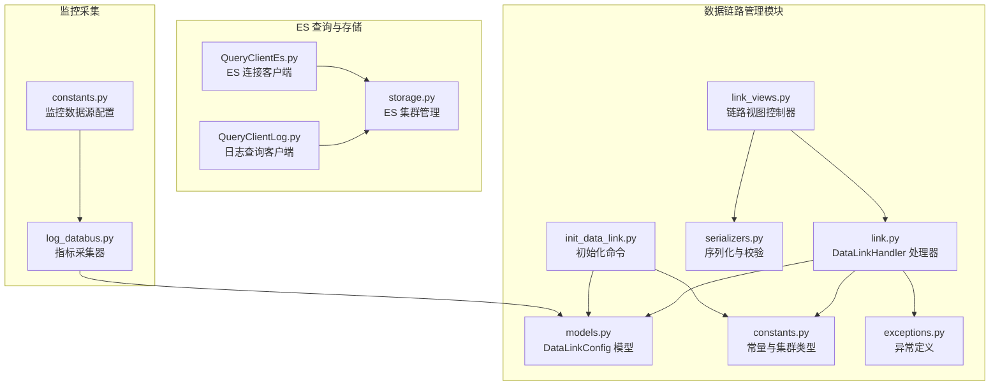
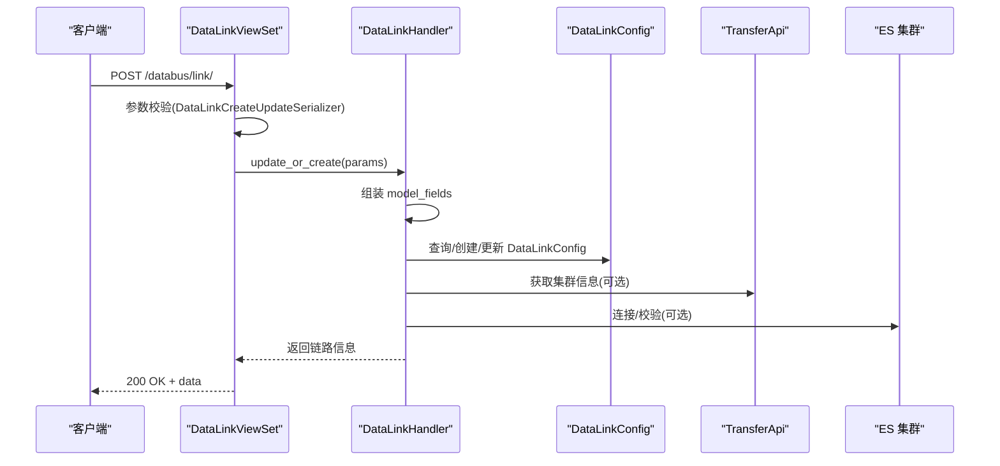
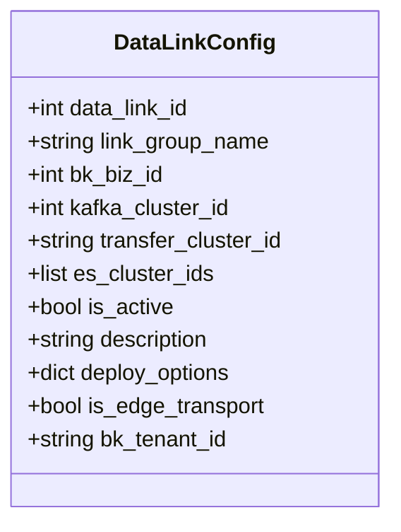
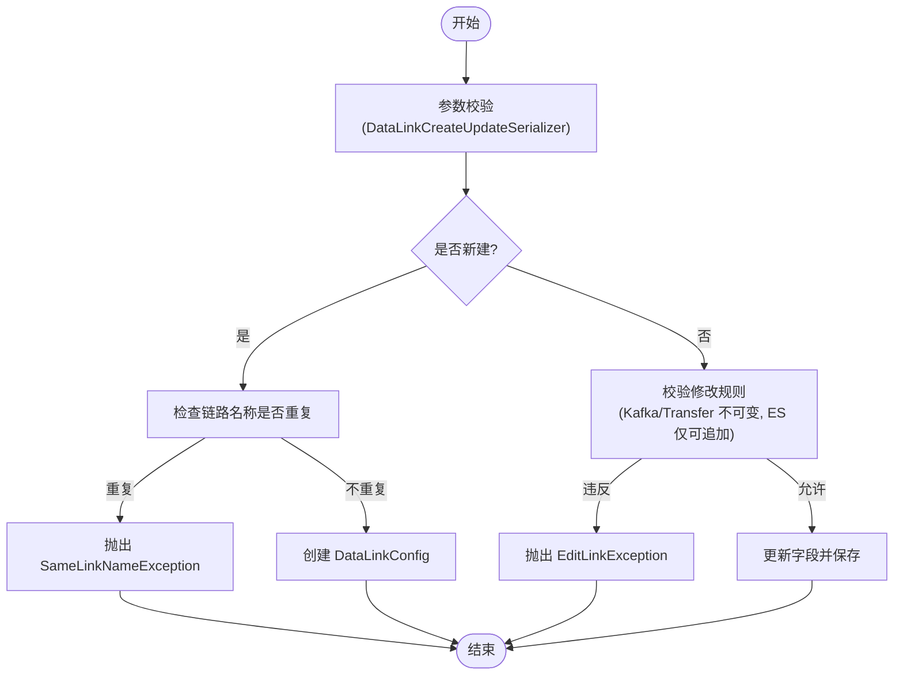
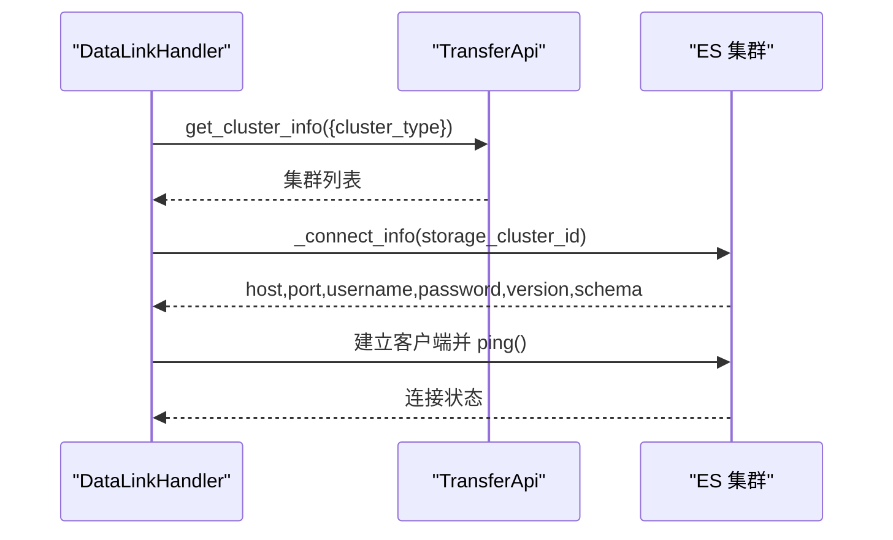
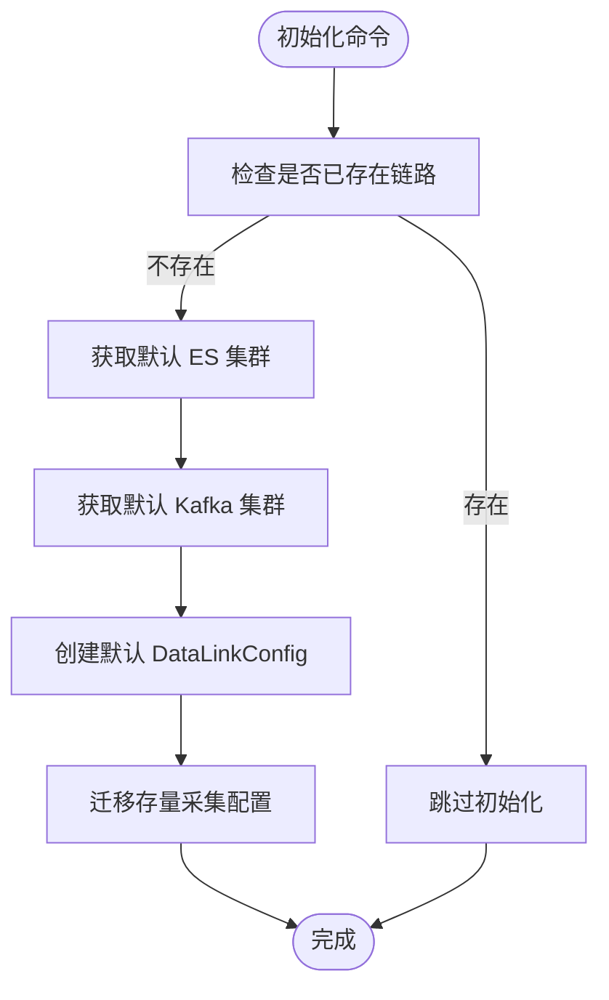
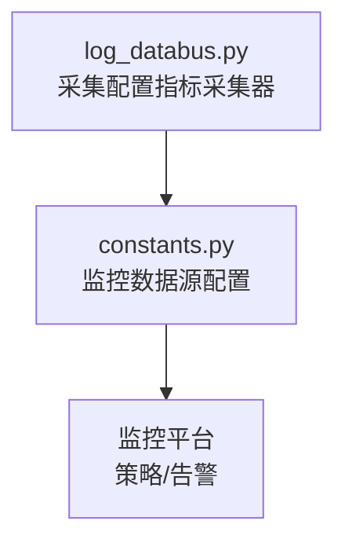
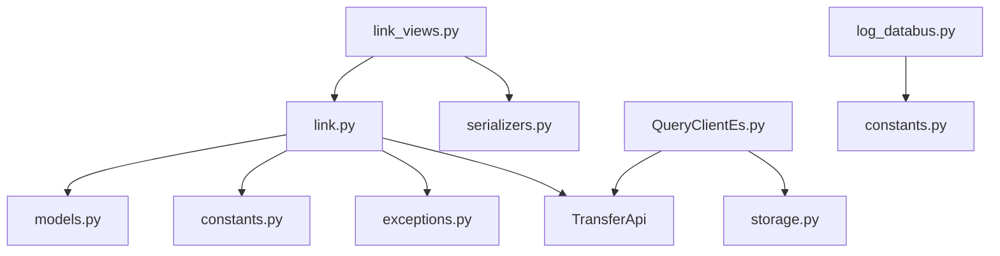

# 数据链路管理

<cite>
**本文引用的文件**
- [models.py](file://apps/log_databus/models.py)
- [link.py](file://apps/log_databus/handlers/link.py)
- [link_views.py](file://apps/log_databus/views/link_views.py)
- [serializers.py](file://apps/log_databus/serializers.py)
- [constants.py](file://apps/log_databus/constants.py)
- [exceptions.py](file://apps/log_databus/exceptions.py)
- [init_data_link.py](file://apps/log_databus/management/commands/init_data_link.py)
- [QueryClientEs.py](file://apps/log_esquery/esquery/client/QueryClientEs.py)
- [QueryClientLog.py](file://apps/log_esquery/esquery/client/QueryClientLog.py)
- [storage.py](file://apps/log_databus/handlers/storage.py)
- [log_databus.py](file://apps/log_measure/handlers/metric_collectors/log_databus.py)
- [constants.py](file://apps/log_measure/constants.py)
</cite>

## 目录
1. [简介](#简介)
2. [项目结构](#项目结构)
3. [核心组件](#核心组件)
4. [架构概览](#架构概览)
5. [详细组件分析](#详细组件分析)
6. [依赖分析](#依赖分析)
7. [性能考虑](#性能考虑)
8. [故障排查指南](#故障排查指南)
9. [结论](#结论)
10. [附录](#附录)

## 简介
本技术文档面向数据链路管理系统，系统性阐述数据链路的概念、架构设计与实现细节，重点围绕 DataLinkConfig 模型的配置参数与业务逻辑，详细说明 Kafka 集群、Transfer 集群、ES 集群的配置与管理流程，涵盖链路的创建、激活、停用、迁移等生命周期操作，以及监控与告警机制、优化策略与最佳实践，并提供配置示例与常见问题解决方案。

## 项目结构
数据链路管理位于日志平台的 databus 模块中，核心文件包括：
- 模型层：定义数据链路实体与相关配置
- 视图层：提供 REST API 接口
- 处理层：封装链路的增删改查与集群信息获取逻辑
- 序列化层：负责请求参数校验与响应格式
- 常量与异常：统一集群类型、默认值与错误码
- 管理命令：初始化默认数据链路
- ES 查询客户端：用于连接与校验 ES 集群
- 存储管理：ES 集群的创建与可见性控制
- 监控采集：链路相关指标采集

图表来源
- [models.py:455-482](file://apps/log_databus/models.py#L455-L482)
- [link_views.py:36-258](file://apps/log_databus/views/link_views.py#L36-L258)
- [link.py:38-209](file://apps/log_databus/handlers/link.py#L38-L209)
- [serializers.py:291-304](file://apps/log_databus/serializers.py#L291-L304)
- [constants.py:204-207](file://apps/log_databus/constants.py#L204-L207)
- [exceptions.py:263-271](file://apps/log_databus/exceptions.py#L263-L271)
- [init_data_link.py:33-98](file://apps/log_databus/management/commands/init_data_link.py#L33-L98)
- [QueryClientEs.py:133-168](file://apps/log_esquery/esquery/client/QueryClientEs.py#L133-L168)
- [QueryClientLog.py:216-245](file://apps/log_esquery/esquery/client/QueryClientLog.py#L216-L245)
- [storage.py:480-492](file://apps/log_databus/handlers/storage.py#L480-L492)
- [log_databus.py:55-83](file://apps/log_measure/handlers/metric_collectors/log_databus.py#L55-L83)
- [constants.py:51-80](file://apps/log_measure/constants.py#L51-L80)

章节来源
- [models.py:455-482](file://apps/log_databus/models.py#L455-L482)
- [link_views.py:36-258](file://apps/log_databus/views/link_views.py#L36-L258)
- [link.py:38-209](file://apps/log_databus/handlers/link.py#L38-L209)
- [serializers.py:291-304](file://apps/log_databus/serializers.py#L291-L304)
- [constants.py:204-207](file://apps/log_databus/constants.py#L204-L207)
- [exceptions.py:263-271](file://apps/log_databus/exceptions.py#L263-L271)
- [init_data_link.py:33-98](file://apps/log_databus/management/commands/init_data_link.py#L33-L98)
- [QueryClientEs.py:133-168](file://apps/log_esquery/esquery/client/QueryClientEs.py#L133-L168)
- [QueryClientLog.py:216-245](file://apps/log_esquery/esquery/client/QueryClientLog.py#L216-L245)
- [storage.py:480-492](file://apps/log_databus/handlers/storage.py#L480-L492)
- [log_databus.py:55-83](file://apps/log_measure/handlers/metric_collectors/log_databus.py#L55-L83)
- [constants.py:51-80](file://apps/log_measure/constants.py#L51-L80)

## 核心组件
- DataLinkConfig 模型：承载数据链路配置，包含 Kafka 集群 ID、Transfer 集群 ID、ES 集群 ID 列表、是否启用、备注、采集下发选项、是否边缘存查链路、租户 ID 等字段。
- DataLinkHandler：封装链路的查询、创建/更新、删除、集群列表获取等业务逻辑。
- DataLinkViewSet：提供 REST API，包括链路列表、详情、创建、更新、删除、集群列表查询等接口。
- 序列化器：对链路创建/更新请求参数进行校验，确保字段完整性与合法性。
- 常量与异常：定义集群类型常量、默认值、错误码，保证跨模块一致性。
- 管理命令：初始化默认数据链路，自动发现默认 Kafka、ES 集群并创建默认链路。
- ES 查询客户端：通过 Transfer API 获取集群信息并建立 ES 连接，支持 Ping 校验与缓存。
- 存储管理：ES 集群的创建、可见性与容量评估配置。
- 监控采集：对采集配置等指标进行周期性采集，便于链路健康度监控。

章节来源
- [models.py:455-482](file://apps/log_databus/models.py#L455-L482)
- [link.py:38-209](file://apps/log_databus/handlers/link.py#L38-L209)
- [link_views.py:36-258](file://apps/log_databus/views/link_views.py#L36-L258)
- [serializers.py:291-304](file://apps/log_databus/serializers.py#L291-L304)
- [constants.py:204-207](file://apps/log_databus/constants.py#L204-L207)
- [exceptions.py:263-271](file://apps/log_databus/exceptions.py#L263-L271)
- [init_data_link.py:33-98](file://apps/log_databus/management/commands/init_data_link.py#L33-L98)
- [QueryClientEs.py:133-168](file://apps/log_esquery/esquery/client/QueryClientEs.py#L133-L168)
- [QueryClientLog.py:216-245](file://apps/log_esquery/esquery/client/QueryClientLog.py#L216-L245)
- [storage.py:480-492](file://apps/log_databus/handlers/storage.py#L480-L492)
- [log_databus.py:55-83](file://apps/log_measure/handlers/metric_collectors/log_databus.py#L55-L83)

## 架构概览
数据链路管理采用“视图-处理器-模型”三层架构：
- 视图层负责 HTTP 请求与响应，调用序列化器进行参数校验，再委派给处理器。
- 处理器封装业务逻辑，与 Transfer API 交互获取/更新集群信息，持久化到 DataLinkConfig。
- 模型层定义数据结构与约束，配合迁移文件演进字段。
- ES 查询客户端与存储管理分别负责 ES 集群连接与创建。
- 监控采集器定期上报链路相关指标，支撑监控与告警。

图表来源
- [link_views.py:114-163](file://apps/log_databus/views/link_views.py#L114-L163)
- [link.py:109-157](file://apps/log_databus/handlers/link.py#L109-L157)
- [models.py:455-482](file://apps/log_databus/models.py#L455-L482)
- [QueryClientEs.py:133-168](file://apps/log_esquery/esquery/client/QueryClientEs.py#L133-L168)

## 详细组件分析

### DataLinkConfig 模型与配置参数
DataLinkConfig 是数据链路的核心实体，关键字段与含义如下：
- data_link_id：链路主键
- link_group_name：链路名称
- bk_biz_id：允许使用的业务 ID，0 表示全业务
- kafka_cluster_id：Kafka 集群 ID（唯一）
- transfer_cluster_id：Transfer 集群 ID（唯一）
- es_cluster_ids：ES 集群 ID 列表（可多选）
- is_active：是否启用
- description：备注
- deploy_options：采集下发选项（JSON）
- is_edge_transport：是否为边缘存查链路
- bk_tenant_id：租户 ID，默认来自配置

图表来源
- [models.py:455-482](file://apps/log_databus/models.py#L455-L482)

章节来源
- [models.py:455-482](file://apps/log_databus/models.py#L455-L482)

### 链路创建与更新流程
- 创建：若链路名称重复则抛出“相同链路名”异常；否则创建 DataLinkConfig 记录。
- 更新：禁止修改 Kafka/Transfer 集群；ES 集群仅允许追加，不允许删除；链路名称在同一租户下唯一。
- 删除：直接删除记录。

图表来源
- [link.py:109-157](file://apps/log_databus/handlers/link.py#L109-L157)
- [exceptions.py:263-271](file://apps/log_databus/exceptions.py#L263-L271)
- [serializers.py:291-304](file://apps/log_databus/serializers.py#L291-L304)

章节来源
- [link.py:109-157](file://apps/log_databus/handlers/link.py#L109-L157)
- [exceptions.py:263-271](file://apps/log_databus/exceptions.py#L263-L271)
- [serializers.py:291-304](file://apps/log_databus/serializers.py#L291-L304)

### 集群配置与管理
- 集群类型常量：KAFKA、STORAGE（ES）、TRANSFER。
- 获取集群列表：根据 cluster_type 返回 transfer/kafka/es 集群信息，其中 ES 仅返回注册系统为默认的公共集群。
- ES 连接：通过 Transfer API 获取集群配置与认证信息，建立 ES 客户端并进行 Ping 校验，支持缓存与版本探测。

图表来源
- [link.py:166-209](file://apps/log_databus/handlers/link.py#L166-L209)
- [QueryClientEs.py:133-168](file://apps/log_esquery/esquery/client/QueryClientEs.py#L133-L168)
- [QueryClientLog.py:216-245](file://apps/log_esquery/esquery/client/QueryClientLog.py#L216-L245)

章节来源
- [constants.py:204-207](file://apps/log_databus/constants.py#L204-L207)
- [link.py:166-209](file://apps/log_databus/handlers/link.py#L166-L209)
- [QueryClientEs.py:133-168](file://apps/log_esquery/esquery/client/QueryClientEs.py#L133-L168)
- [QueryClientLog.py:216-245](file://apps/log_esquery/esquery/client/QueryClientLog.py#L216-L245)

### 初始化默认数据链路
管理命令会在首次运行时自动发现默认 Kafka 与 ES 集群，创建默认链路，并将存量采集配置迁移到默认链路。

图表来源
- [init_data_link.py:40-98](file://apps/log_databus/management/commands/init_data_link.py#L40-L98)

章节来源
- [init_data_link.py:40-98](file://apps/log_databus/management/commands/init_data_link.py#L40-L98)

### 监控与告警机制
- 指标采集：对采集配置等维度进行周期性采集，形成指标数据。
- 监控数据源：统一配置监控数据源列表，包含 log_databus 指标采集器。
- 告警策略：可结合智能检测算法与通知策略，实现链路异常告警。

图表来源
- [log_databus.py:55-83](file://apps/log_measure/handlers/metric_collectors/log_databus.py#L55-L83)
- [constants.py:51-80](file://apps/log_measure/constants.py#L51-L80)

章节来源
- [log_databus.py:55-83](file://apps/log_measure/handlers/metric_collectors/log_databus.py#L55-L83)
- [constants.py:51-80](file://apps/log_measure/constants.py#L51-L80)

## 依赖分析
- 模块耦合：视图层依赖处理器与序列化器；处理器依赖模型与 Transfer API；模型依赖常量与异常；ES 客户端依赖存储管理。
- 外部依赖：Transfer API 提供集群信息与创建/查询能力；ES 集群提供数据存储与查询能力；监控平台提供指标采集与告警能力。
- 潜在风险：链路更新规则严格（Kafka/Transfer 不可变、ES 仅可追加），避免误操作导致数据不一致；初始化命令需确保默认集群存在。

图表来源
- [link_views.py:36-258](file://apps/log_databus/views/link_views.py#L36-L258)
- [link.py:38-209](file://apps/log_databus/handlers/link.py#L38-L209)
- [models.py:455-482](file://apps/log_databus/models.py#L455-L482)
- [constants.py:204-207](file://apps/log_databus/constants.py#L204-L207)
- [exceptions.py:263-271](file://apps/log_databus/exceptions.py#L263-L271)
- [serializers.py:291-304](file://apps/log_databus/serializers.py#L291-L304)
- [QueryClientEs.py:133-168](file://apps/log_esquery/esquery/client/QueryClientEs.py#L133-L168)
- [storage.py:480-492](file://apps/log_databus/handlers/storage.py#L480-L492)
- [log_databus.py:55-83](file://apps/log_measure/handlers/metric_collectors/log_databus.py#L55-L83)
- [constants.py:51-80](file://apps/log_measure/constants.py#L51-L80)

章节来源
- [link_views.py:36-258](file://apps/log_databus/views/link_views.py#L36-L258)
- [link.py:38-209](file://apps/log_databus/handlers/link.py#L38-L209)
- [models.py:455-482](file://apps/log_databus/models.py#L455-L482)
- [constants.py:204-207](file://apps/log_databus/constants.py#L204-L207)
- [exceptions.py:263-271](file://apps/log_databus/exceptions.py#L263-L271)
- [serializers.py:291-304](file://apps/log_databus/serializers.py#L291-L304)
- [QueryClientEs.py:133-168](file://apps/log_esquery/esquery/client/QueryClientEs.py#L133-L168)
- [storage.py:480-492](file://apps/log_databus/handlers/storage.py#L480-L492)
- [log_databus.py:55-83](file://apps/log_measure/handlers/metric_collectors/log_databus.py#L55-L83)
- [constants.py:51-80](file://apps/log_measure/constants.py#L51-L80)

## 性能考虑
- 集群连接缓存：ES 客户端连接信息采用缓存策略，减少频繁查询与连接开销。
- 批量操作：ES 集群用量同步支持批量处理，提升大集群场景下的处理效率。
- 指标采集频率：监控采集器按分钟级频率上报，兼顾实时性与资源消耗。
- 链路优先级：业务独立链路优先于公共链路，降低跨业务干扰。

章节来源
- [QueryClientEs.py:161-168](file://apps/log_esquery/esquery/client/QueryClientEs.py#L161-L168)
- [constants.py:752-755](file://apps/log_databus/constants.py#L752-L755)
- [log_databus.py:57-58](file://apps/log_measure/handlers/metric_collectors/log_databus.py#L57-L58)

## 故障排查指南
- 链路名称冲突：创建/更新时若名称重复，抛出“相同链路名”异常。解决方法：更换链路名称或删除同名链路。
- 修改规则违规：更新时若尝试修改 Kafka/Transfer 集群或删除 ES 集群，抛出“修改规则违规”异常。解决方法：保持 Kafka/Transfer 不变，仅追加 ES 集群。
- 集群不存在：获取集群列表或连接 ES 时若集群不存在，抛出“集群不存在”异常。解决方法：确认集群已在 Transfer 中注册并处于可用状态。
- 初始化失败：初始化命令执行失败时，检查默认集群是否可用与参数是否正确。解决方法：手动指定集群 ID 或修复默认集群状态。

章节来源
- [exceptions.py:263-271](file://apps/log_databus/exceptions.py#L263-L271)
- [exceptions.py:163-166](file://apps/log_databus/exceptions.py#L163-L166)
- [init_data_link.py:96-98](file://apps/log_databus/management/commands/init_data_link.py#L96-L98)

## 结论
数据链路管理系统通过清晰的模型定义、严格的更新规则、完善的集群管理与监控采集机制，实现了对 Kafka、Transfer、ES 三类集群的统一编排与治理。建议在生产环境中遵循“只增不减”的 ES 集群策略，合理规划链路优先级与租户隔离，持续完善监控与告警体系，确保链路稳定与可运维性。

## 附录

### 配置流程与示例
- 创建链路
  - 请求参数：链路名称、业务 ID、Kafka 集群 ID、Transfer 集群 ID、ES 集群 ID 列表、是否启用、备注
  - 示例请求体：见链路创建接口文档注释
- 更新链路
  - 仅允许追加 ES 集群，Kafka/Transfer 不可修改
  - 示例请求体：见链路更新接口文档注释
- 删除链路
  - 直接删除，注意影响范围

章节来源
- [link_views.py:114-163](file://apps/log_databus/views/link_views.py#L114-L163)
- [link_views.py:165-215](file://apps/log_databus/views/link_views.py#L165-L215)
- [link_views.py:217-232](file://apps/log_databus/views/link_views.py#L217-L232)

### 常见问题与解决方案
- 无法创建链路：检查链路名称是否重复，或确认租户 ID 与业务 ID 设置是否正确
- 更新失败：确认 Kafka/Transfer 集群未变更，ES 集群仅追加
- 初始化失败：确认默认 Kafka/ES 集群存在且可用，必要时手动指定集群 ID

章节来源
- [exceptions.py:263-271](file://apps/log_databus/exceptions.py#L263-L271)
- [init_data_link.py:96-98](file://apps/log_databus/management/commands/init_data_link.py#L96-L98)