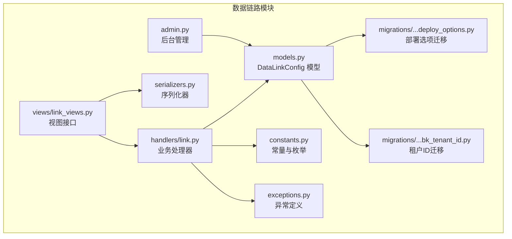
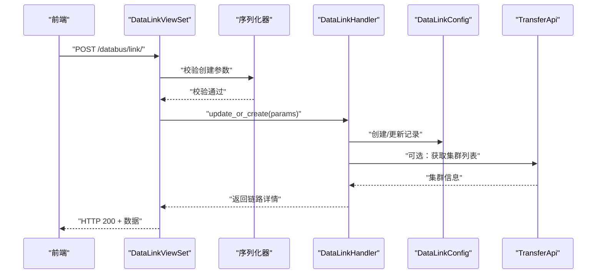
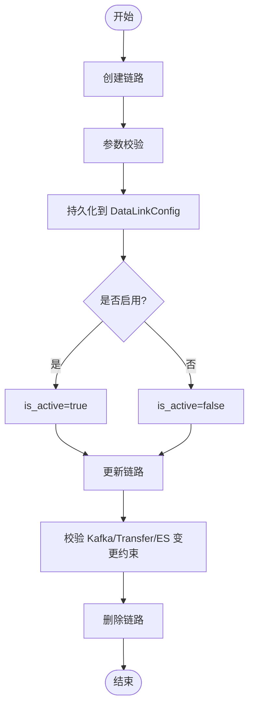
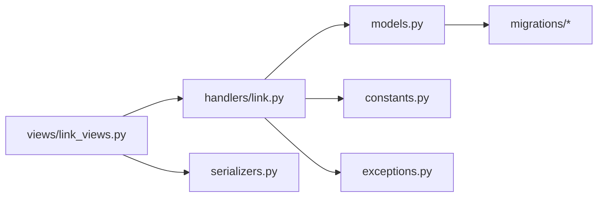

# 数据链路配置

<cite>
**本文引用的文件**
- [models.py](file://apps/log_databus/models.py)
- [handlers/link.py](file://apps/log_databus/handlers/link.py)
- [views/link_views.py](file://apps/log_databus/views/link_views.py)
- [serializers.py](file://apps/log_databus/serializers.py)
- [constants.py](file://apps/log_databus/constants.py)
- [exceptions.py](file://apps/log_databus/exceptions.py)
- [admin.py](file://apps/log_databus/admin.py)
- [migrations/0035_datalinkconfig_deploy_options.py](file://apps/log_databus/migrations/0035_datalinkconfig_deploy_options.py)
- [migrations/0044_datalinkconfig_bk_tenant_id.py](file://apps/log_databus/migrations/0044_datalinkconfig_bk_tenant_id.py)
</cite>

## 目录
1. [简介](#简介)
2. [项目结构](#项目结构)
3. [核心组件](#核心组件)
4. [架构概览](#架构概览)
5. [详细组件分析](#详细组件分析)
6. [依赖分析](#依赖分析)
7. [性能考虑](#性能考虑)
8. [故障排查指南](#故障排查指南)
9. [结论](#结论)
10. [附录](#附录)

## 简介
本技术文档围绕“数据链路配置”模块展开，系统性阐述 DataLinkConfig 模型的结构与配置参数、数据链路的创建与生命周期管理、链路与采集项的关系及分配策略，并提供最佳实践与常见配置场景。数据链路用于统一管理采集数据的传输通道，包含 Kafka 集群、Transfer 集群与 ES 集群三部分，支持按业务隔离与公共共享两种模式。

## 项目结构
数据链路配置相关代码主要位于 databus 应用中，涉及模型、序列化器、视图与处理器、常量与异常定义、后台管理以及迁移脚本等。

图表来源
- [models.py:455-482](file://apps/log_databus/models.py#L455-L482)
- [handlers/link.py:38-209](file://apps/log_databus/handlers/link.py#L38-L209)
- [views/link_views.py:36-258](file://apps/log_databus/views/link_views.py#L36-L258)
- [serializers.py:283-309](file://apps/log_databus/serializers.py#L283-L309)
- [constants.py:1-200](file://apps/log_databus/constants.py#L1-L200)
- [exceptions.py:292-300](file://apps/log_databus/exceptions.py#L292-L300)
- [admin.py:73-80](file://apps/log_databus/admin.py#L73-L80)
- [migrations/0035_datalinkconfig_deploy_options.py](file://apps/log_databus/migrations/0035_datalinkconfig_deploy_options.py)
- [migrations/0044_datalinkconfig_bk_tenant_id.py](file://apps/log_databus/migrations/0044_datalinkconfig_bk_tenant_id.py)

章节来源
- [models.py:455-482](file://apps/log_databus/models.py#L455-L482)
- [handlers/link.py:38-209](file://apps/log_databus/handlers/link.py#L38-L209)
- [views/link_views.py:36-258](file://apps/log_databus/views/link_views.py#L36-L258)
- [serializers.py:283-309](file://apps/log_databus/serializers.py#L283-L309)
- [constants.py:1-200](file://apps/log_databus/constants.py#L1-L200)
- [exceptions.py:292-300](file://apps/log_databus/exceptions.py#L292-L300)
- [admin.py:73-80](file://apps/log_databus/admin.py#L73-L80)
- [migrations/0035_datalinkconfig_deploy_options.py](file://apps/log_databus/migrations/0035_datalinkconfig_deploy_options.py)
- [migrations/0044_datalinkconfig_bk_tenant_id.py](file://apps/log_databus/migrations/0044_datalinkconfig_bk_tenant_id.py)

## 核心组件
- DataLinkConfig 模型：定义数据链路的核心字段与约束，包括链路ID、集群名称、业务ID、Kafka/Transfer/ES 集群ID、启用状态、描述、部署选项、边缘链路标记、租户ID等。
- DataLinkHandler：封装链路的增删改查、列表排序与优先级合并、集群列表查询等业务逻辑。
- DataLinkViewSet：提供 REST 接口，负责链路的列表、详情、创建、更新、删除与集群列表查询。
- 序列化器：对链路列表、链路创建/更新、集群类型查询等输入参数进行校验。
- 常量与异常：提供集群类型常量、错误码与异常类型，保障链路配置过程的健壮性。
- 后台管理：在 Django Admin 中展示与维护链路配置。
- 迁移脚本：记录部署选项与租户ID字段的引入，确保数据库结构演进。

章节来源
- [models.py:455-482](file://apps/log_databus/models.py#L455-L482)
- [handlers/link.py:38-209](file://apps/log_databus/handlers/link.py#L38-L209)
- [views/link_views.py:36-258](file://apps/log_databus/views/link_views.py#L36-L258)
- [serializers.py:283-309](file://apps/log_databus/serializers.py#L283-L309)
- [constants.py:1-200](file://apps/log_databus/constants.py#L1-L200)
- [exceptions.py:292-300](file://apps/log_databus/exceptions.py#L292-L300)
- [admin.py:73-80](file://apps/log_databus/admin.py#L73-L80)
- [migrations/0035_datalinkconfig_deploy_options.py](file://apps/log_databus/migrations/0035_datalinkconfig_deploy_options.py)
- [migrations/0044_datalinkconfig_bk_tenant_id.py](file://apps/log_databus/migrations/0044_datalinkconfig_bk_tenant_id.py)

## 架构概览
数据链路配置采用典型的 MVC 分层：
- 视图层：接收前端请求，调用序列化器进行参数校验，再委派给处理器。
- 处理器层：封装业务规则，访问模型持久化数据，必要时调用外部 API 获取集群信息。
- 模型层：定义数据结构与约束，提供 ORM 查询与更新能力。
- 常量/异常/后台：提供支撑能力与治理手段。

图表来源
- [views/link_views.py:114-163](file://apps/log_databus/views/link_views.py#L114-L163)
- [handlers/link.py:109-157](file://apps/log_databus/handlers/link.py#L109-L157)
- [serializers.py:291-304](file://apps/log_databus/serializers.py#L291-L304)
- [models.py:455-482](file://apps/log_databus/models.py#L455-L482)

## 详细组件分析

### DataLinkConfig 模型
- 字段说明
  - data_link_id：链路主键
  - link_group_name：集群名称
  - bk_biz_id：业务ID，0 表示公共链路
  - kafka_cluster_id：Kafka 集群ID
  - transfer_cluster_id：Transfer 集群ID
  - es_cluster_ids：ES 集群ID列表
  - is_active：是否启用
  - description：描述
  - deploy_options：采集下发选项（JSON）
  - is_edge_transport：是否为边缘存查链路
  - bk_tenant_id：租户ID，默认取自全局配置
- 关键约束
  - 公共链路（bk_biz_id=0）可被任意业务使用
  - 业务独立链路优先于公共链路
  - 更新时对 Kafka/Transfer/ES 的变更有限制，防止破坏已有链路关系

章节来源
- [models.py:455-482](file://apps/log_databus/models.py#L455-L482)
- [migrations/0035_datalinkconfig_deploy_options.py](file://apps/log_databus/migrations/0035_datalinkconfig_deploy_options.py)
- [migrations/0044_datalinkconfig_bk_tenant_id.py](file://apps/log_databus/migrations/0044_datalinkconfig_bk_tenant_id.py)

### DataLinkHandler 业务处理器
- 列表与优先级
  - 支持按业务过滤，优先返回业务独立链路，再返回公共链路
  - 按 is_edge_transport 升序、更新时间降序排序
- 创建/更新
  - 创建时校验同名链路冲突
  - 更新时严格校验 Kafka/Transfer 不可回退，ES 集群集合必须为超集
  - 更新时校验链路名称唯一性（排除自身）
- 删除
  - 直接软删除链路配置
- 集群列表
  - Transfer 集群去重返回
  - Kafka/ES 集群仅返回公共注册系统下的集群

章节来源
- [handlers/link.py:38-209](file://apps/log_databus/handlers/link.py#L38-L209)
- [constants.py:1-200](file://apps/log_databus/constants.py#L1-L200)
- [exceptions.py:292-300](file://apps/log_databus/exceptions.py#L292-L300)

### DataLinkViewSet 视图接口
- 列表：GET /databus/link/
- 详情：GET /databus/link/{data_link_id}/
- 创建：POST /databus/link/
- 更新：PUT /databus/link/{data_link_id}/
- 删除：DELETE /databus/link/{data_link_id}/
- 集群列表：GET /databus/link/get_cluster_list/?cluster_type={type}

章节来源
- [views/link_views.py:36-258](file://apps/log_databus/views/link_views.py#L36-L258)
- [serializers.py:283-309](file://apps/log_databus/serializers.py#L283-L309)

### 序列化器
- DataLinkListSerializer：支持可选的业务ID过滤
- DataLinkCreateUpdateSerializer：链路创建/更新的完整字段校验
- ClusterListSerializer：集群类型查询参数校验

章节来源
- [serializers.py:283-309](file://apps/log_databus/serializers.py#L283-L309)

### 异常与常量
- 异常：链路不存在、编辑限制、同名冲突、集群不存在等
- 常量：集群类型、默认注册系统标识等

章节来源
- [exceptions.py:292-300](file://apps/log_databus/exceptions.py#L292-L300)
- [constants.py:1-200](file://apps/log_databus/constants.py#L1-L200)

### 后台管理
- 在 Django Admin 中以 DataLinkConfigAdmin 展示链路配置，便于运维侧快速查看与调整

章节来源
- [admin.py:73-80](file://apps/log_databus/admin.py#L73-L80)

### 生命周期管理
- 创建：通过视图接口提交创建参数，经序列化器校验后由处理器写入模型
- 启用/停用：通过更新接口修改 is_active 字段
- 删除：调用删除接口软删除链路配置
- 变更：更新时对 Kafka/Transfer/ES 的变更施加约束，避免破坏现有链路关系

图表来源
- [handlers/link.py:109-157](file://apps/log_databus/handlers/link.py#L109-L157)
- [models.py:455-482](file://apps/log_databus/models.py#L455-L482)

## 依赖分析
- 视图依赖处理器与序列化器
- 处理器依赖模型、常量与异常、外部 Transfer API
- 模型依赖 Django ORM 与全局配置
- 迁移脚本依赖模型字段演进

图表来源
- [views/link_views.py:36-258](file://apps/log_databus/views/link_views.py#L36-L258)
- [handlers/link.py:38-209](file://apps/log_databus/handlers/link.py#L38-L209)
- [serializers.py:283-309](file://apps/log_databus/serializers.py#L283-L309)
- [models.py:455-482](file://apps/log_databus/models.py#L455-L482)
- [constants.py:1-200](file://apps/log_databus/constants.py#L1-L200)
- [exceptions.py:292-300](file://apps/log_databus/exceptions.py#L292-L300)

章节来源
- [views/link_views.py:36-258](file://apps/log_databus/views/link_views.py#L36-L258)
- [handlers/link.py:38-209](file://apps/log_databus/handlers/link.py#L38-L209)
- [serializers.py:283-309](file://apps/log_databus/serializers.py#L283-L309)
- [models.py:455-482](file://apps/log_databus/models.py#L455-L482)
- [constants.py:1-200](file://apps/log_databus/constants.py#L1-L200)
- [exceptions.py:292-300](file://apps/log_databus/exceptions.py#L292-L300)

## 性能考虑
- 列表查询按 is_edge_transport 与更新时间排序，减少无效筛选
- 集群列表对 Transfer 集群去重，降低重复渲染成本
- 外部 API 调用采用批量与缓存策略（如 Transfer API 的 no_request 参数），减少网络开销
- 建议在大规模业务场景下，合理划分公共链路与业务独立链路，避免过多公共链路导致的过滤与合并成本

## 故障排查指南
- 链路不存在：检查 data_link_id 是否正确，确认链路是否被软删除
- 编辑受限：若 Kafka 或 Transfer 发生回退或 ES 集群集合收缩，将触发编辑限制异常
- 同名冲突：同一租户下链路名称不可重复
- 集群类型错误：cluster_type 必须为 transfer/kafka/es 之一
- 权限不足：仅具备超级管理员写权限的用户可进行链路创建/更新/删除

章节来源
- [exceptions.py:292-300](file://apps/log_databus/exceptions.py#L292-L300)
- [handlers/link.py:138-149](file://apps/log_databus/handlers/link.py#L138-L149)
- [views/link_views.py:234-257](file://apps/log_databus/views/link_views.py#L234-L257)

## 结论
数据链路配置模块通过清晰的模型设计与严格的业务约束，实现了对 Kafka、Transfer、ES 三类集群的统一管理。其优先级合并策略与租户维度的链路隔离，满足了多业务场景下的灵活配置需求。配合完善的序列化器、异常与后台管理，保证了配置过程的可控与可观测。

## 附录

### 字段与配置说明
- 链路ID：data_link_id
- 集群名称：link_group_name
- 业务ID：bk_biz_id（0 表示公共链路）
- Kafka 集群ID：kafka_cluster_id
- Transfer 集群ID：transfer_cluster_id
- ES 集群ID：es_cluster_ids（数组）
- 启用状态：is_active
- 描述：description
- 部署选项：deploy_options（JSON）
- 边缘链路：is_edge_transport
- 租户ID：bk_tenant_id

章节来源
- [models.py:455-482](file://apps/log_databus/models.py#L455-L482)

### 链路与采集项的关系
- 采集项与链路通过 data_link_id 关联
- 采集项创建时可指定链路ID；若未指定，通常由系统根据业务与链路优先级策略自动选择
- 链路优先级：业务独立链路优先于公共链路；启用状态优先于停用状态

章节来源
- [serializers.py:396-421](file://apps/log_databus/serializers.py#L396-L421)
- [handlers/link.py:74-90](file://apps/log_databus/handlers/link.py#L74-L90)

### 最佳实践与常见场景
- 公共链路与业务独立链路并存：建议将通用能力沉淀为公共链路，业务特殊需求使用独立链路
- 启用状态管理：变更生产链路前先停用，验证后再启用
- 集群变更策略：Kafka/Transfer 不建议回退；ES 集群变更应保持为超集
- 租户隔离：不同租户使用不同的 bk_tenant_id，避免跨租户配置干扰
- 边缘链路：针对边缘存查场景启用 is_edge_transport，便于差异化治理

章节来源
- [handlers/link.py:138-152](file://apps/log_databus/handlers/link.py#L138-L152)
- [models.py:475-476](file://apps/log_databus/models.py#L475-L476)