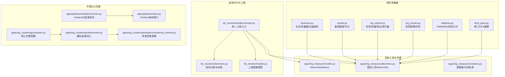
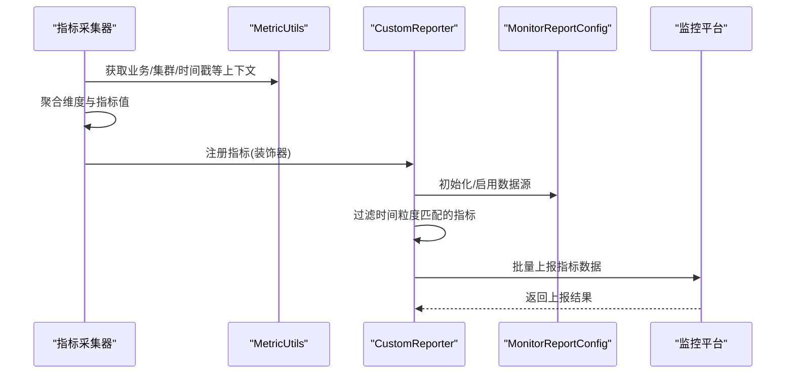
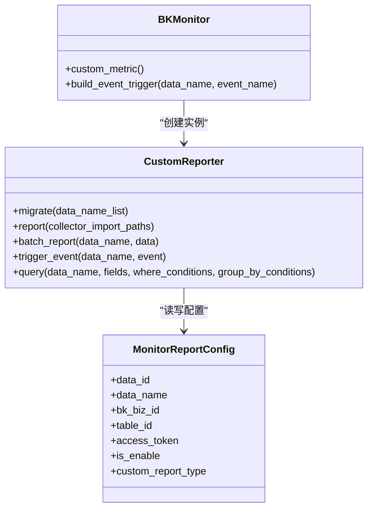
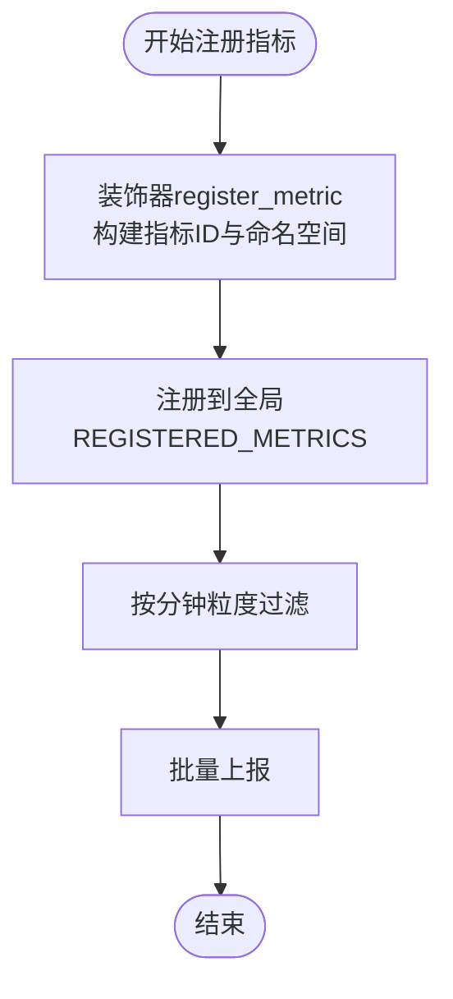
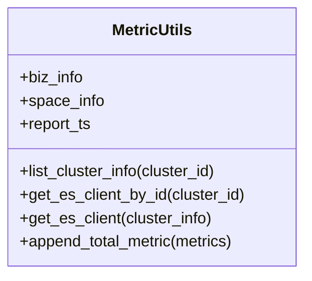
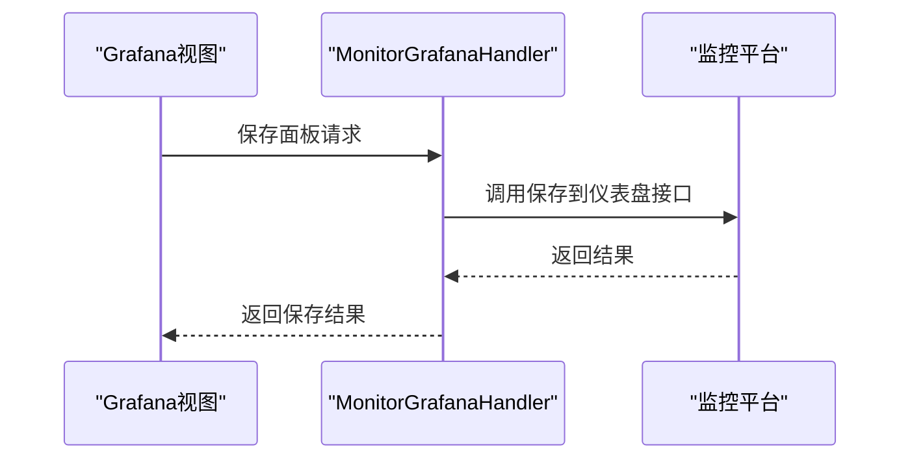
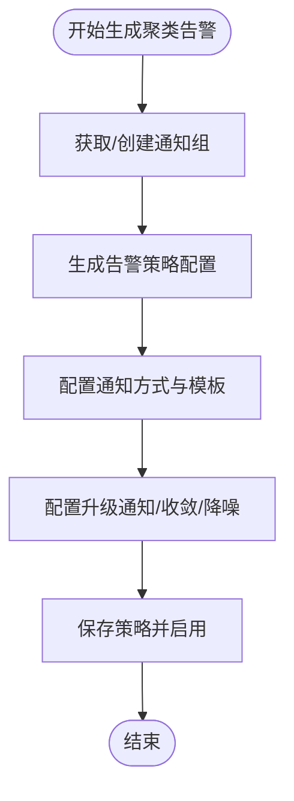
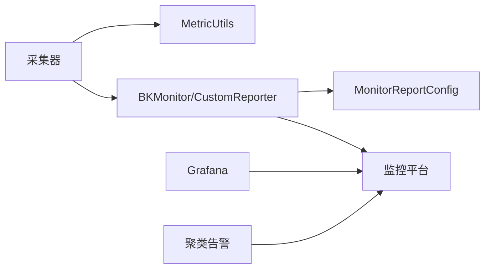

# 链路监控

<cite>
**本文引用的文件**
- [bk_monitor/handler/monitor.py](file://bk_monitor/handler/monitor.py)
- [bk_monitor/utils/metric.py](file://bk_monitor/utils/metric.py)
- [bk_monitor/models.py](file://bk_monitor/models.py)
- [apps/log_measure/constants.py](file://apps/log_measure/constants.py)
- [apps/log_measure/utils/metric.py](file://apps/log_measure/utils/metric.py)
- [apps/log_measure/models.py](file://apps/log_measure/models.py)
- [apps/log_measure/handlers/metric_collectors/business.py](file://apps/log_measure/handlers/metric_collectors/business.py)
- [apps/log_measure/handlers/metric_collectors/cluster.py](file://apps/log_measure/handlers/metric_collectors/cluster.py)
- [apps/log_measure/handlers/metric_collectors/log_search.py](file://apps/log_measure/handlers/metric_collectors/log_search.py)
- [apps/log_measure/handlers/metric_collectors/log_extract.py](file://apps/log_measure/handlers/metric_collectors/log_extract.py)
- [apps/log_measure/handlers/metric_collectors/rabbitmq.py](file://apps/log_measure/handlers/metric_collectors/rabbitmq.py)
- [apps/log_measure/handlers/metric_collectors/third_party.py](file://apps/log_measure/handlers/metric_collectors/third_party.py)
- [apps/grafana/handlers/monitor.py](file://apps/grafana/handlers/monitor.py)
- [apps/grafana/views.py](file://apps/grafana/views.py)
- [apps/log_clustering/constants.py](file://apps/log_clustering/constants.py)
- [apps/log_clustering/utils/monitor.py](file://apps/log_clustering/utils/monitor.py)
- [apps/log_clustering/handlers/clustering_monitor.py](file://apps/log_clustering/handlers/clustering_monitor.py)
</cite>

## 目录
1. [简介](#简介)
2. [项目结构](#项目结构)
3. [核心组件](#核心组件)
4. [架构总览](#架构总览)
5. [详细组件分析](#详细组件分析)
6. [依赖分析](#依赖分析)
7. [性能考量](#性能考量)
8. [故障排查指南](#故障排查指南)
9. [结论](#结论)
10. [附录](#附录)

## 简介
本技术文档围绕“数据链路监控模块”展开，系统性阐述蓝鲸日志平台中的链路监控体系与监控指标，覆盖链路状态监控、性能指标监控、告警监控等主题；并详细说明监控数据的采集、聚合、存储与展示流程，解释告警规则配置、触发条件、通知方式与处理流程，最后给出配置指南与故障排查方法。

## 项目结构
数据链路监控主要由以下几部分构成：
- 监控SDK与上报：封装统一的监控上报能力，负责数据源初始化、指标批量上报、事件触发与查询。
- 指标采集器：按模块维度（业务、集群、检索、提取、队列、第三方ES等）采集指标，统一注册与命名。
- 指标工具与存储：提供指标工具类、指标历史存储模型，支撑采集与上报。
- 可视化集成：对接Grafana，支持仪表盘与查询能力。
- 告警集成：与监控平台联动，生成告警策略、通知组与消息模板。

**图表来源**
- [bk_monitor/handler/monitor.py:1-358](file://bk_monitor/handler/monitor.py#L1-L358)
- [bk_monitor/utils/metric.py:1-86](file://bk_monitor/utils/metric.py#L1-L86)
- [bk_monitor/models.py:1-26](file://bk_monitor/models.py#L1-L26)
- [apps/log_measure/utils/metric.py:1-151](file://apps/log_measure/utils/metric.py#L1-L151)
- [apps/log_measure/models.py:1-44](file://apps/log_measure/models.py#L1-L44)
- [apps/log_measure/constants.py:18-76](file://apps/log_measure/constants.py#L18-L76)
- [apps/log_measure/handlers/metric_collectors/business.py:1-285](file://apps/log_measure/handlers/metric_collectors/business.py#L1-L285)
- [apps/log_measure/handlers/metric_collectors/cluster.py:1-195](file://apps/log_measure/handlers/metric_collectors/cluster.py#L1-L195)
- [apps/log_measure/handlers/metric_collectors/log_search.py:1-293](file://apps/log_measure/handlers/metric_collectors/log_search.py#L1-L293)
- [apps/log_measure/handlers/metric_collectors/log_extract.py:1-124](file://apps/log_measure/handlers/metric_collectors/log_extract.py#L1-L124)
- [apps/log_measure/handlers/metric_collectors/rabbitmq.py:1-41](file://apps/log_measure/handlers/metric_collectors/rabbitmq.py#L1-L41)
- [apps/log_measure/handlers/metric_collectors/third_party.py:1-61](file://apps/log_measure/handlers/metric_collectors/third_party.py#L1-L61)
- [apps/grafana/handlers/monitor.py:1-38](file://apps/grafana/handlers/monitor.py#L1-L38)
- [apps/grafana/views.py:230-492](file://apps/grafana/views.py#L230-L492)
- [apps/log_clustering/constants.py:95-175](file://apps/log_clustering/constants.py#L95-L175)
- [apps/log_clustering/utils/monitor.py:18-79](file://apps/log_clustering/utils/monitor.py#L18-L79)
- [apps/log_clustering/handlers/clustering_monitor.py:524-585](file://apps/log_clustering/handlers/clustering_monitor.py#L524-L585)

**章节来源**
- [bk_monitor/handler/monitor.py:1-358](file://bk_monitor/handler/monitor.py#L1-L358)
- [apps/log_measure/constants.py:18-76](file://apps/log_measure/constants.py#L18-L76)

## 核心组件
- 监控SDK（BKMonitor）
  - 提供自定义指标上报、事件触发、查询与数据源初始化能力。
  - 负责将采集器注册的指标按时间粒度过滤后批量上报至监控平台。
- 指标注册与封装（register_metric、Metric）
  - 通过装饰器注册指标，统一构建指标ID与命名空间，便于跨模块复用。
- 指标工具（MetricUtils）
  - 提供业务/空间/集群信息缓存、ES客户端获取、时间对齐与聚合辅助方法。
- 指标历史存储（MetricDataHistory）
  - 缓存采集器生成的指标JSON，供SDK批量上报使用。
- 可视化与告警
  - Grafana集成：保存仪表盘、查询日志数据。
  - 聚类告警：默认告警配置、通知组与消息模板，支持策略生成与升级通知。

**章节来源**
- [bk_monitor/handler/monitor.py:39-329](file://bk_monitor/handler/monitor.py#L39-L329)
- [bk_monitor/utils/metric.py:22-86](file://bk_monitor/utils/metric.py#L22-L86)
- [apps/log_measure/utils/metric.py:33-151](file://apps/log_measure/utils/metric.py#L33-L151)
- [apps/log_measure/models.py:40-44](file://apps/log_measure/models.py#L40-L44)
- [apps/grafana/handlers/monitor.py:1-38](file://apps/grafana/handlers/monitor.py#L1-L38)
- [apps/log_clustering/constants.py:95-175](file://apps/log_clustering/constants.py#L95-L175)

## 架构总览
下图展示了从指标采集到监控平台上报、再到可视化与告警的整体流程。

**图表来源**
- [bk_monitor/handler/monitor.py:93-243](file://bk_monitor/handler/monitor.py#L93-L243)
- [bk_monitor/utils/metric.py:22-46](file://bk_monitor/utils/metric.py#L22-L46)
- [apps/log_measure/utils/metric.py:33-61](file://apps/log_measure/utils/metric.py#L33-L61)

## 详细组件分析

### 监控SDK与上报（BKMonitor）
- 数据源初始化
  - 根据数据源名称与类型创建或获取data_id、table_id与access_token，并维护启用状态。
- 指标上报
  - 读取指标历史缓存，按批次向监控平台上报；支持失败重试与错误日志记录。
- 事件触发
  - 将事件数据封装后上报，用于非时序场景的告警或运营事件。
- 查询
  - 基于SQL拼接与监控平台查询接口，支持where与group by条件。

**图表来源**
- [bk_monitor/handler/monitor.py:39-329](file://bk_monitor/handler/monitor.py#L39-L329)
- [bk_monitor/models.py:8-25](file://bk_monitor/models.py#L8-L25)

**章节来源**
- [bk_monitor/handler/monitor.py:93-285](file://bk_monitor/handler/monitor.py#L93-L285)
- [bk_monitor/models.py:8-25](file://bk_monitor/models.py#L8-L25)

### 指标注册与封装（register_metric、Metric）
- 指标注册
  - 通过装饰器将采集函数注册为指标，自动构建指标ID与命名空间，支持时间粒度过滤。
- 指标封装
  - 将指标名、值、维度与时间戳封装为上报格式，支持前缀与命名空间拼接。

**图表来源**
- [bk_monitor/utils/metric.py:22-46](file://bk_monitor/utils/metric.py#L22-L46)
- [bk_monitor/utils/metric.py:49-86](file://bk_monitor/utils/metric.py#L49-L86)

**章节来源**
- [bk_monitor/utils/metric.py:22-86](file://bk_monitor/utils/metric.py#L22-L86)

### 指标工具（MetricUtils）
- 业务/空间/集群信息缓存
  - 缓存业务ID与名称映射、空间UID与业务信息，提供ES客户端获取与ping校验。
- 时间对齐
  - 将上报时间对齐到采集间隔的整数倍，确保时序一致性。
- ES客户端管理
  - 按集群ID缓存ES客户端，避免重复连接与认证开销。

**图表来源**
- [apps/log_measure/utils/metric.py:33-151](file://apps/log_measure/utils/metric.py#L33-L151)

**章节来源**
- [apps/log_measure/utils/metric.py:33-151](file://apps/log_measure/utils/metric.py#L33-L151)

### 指标历史存储（MetricDataHistory）
- 作用
  - 缓存采集器生成的指标JSON，供SDK批量上报使用。
- 字段
  - 指标ID、指标数据、更新时间戳。

**章节来源**
- [apps/log_measure/models.py:40-44](file://apps/log_measure/models.py#L40-L44)

### 业务与功能使用指标（business）
- 活跃业务/业务总数
  - 基于检索历史与空间UID统计活跃业务与总数。
- 采集器配置/归档/提取/聚类等使用情况
  - 按业务维度统计各功能使用数量，支持总量与明细。

**章节来源**
- [apps/log_measure/handlers/metric_collectors/business.py:53-134](file://apps/log_measure/handlers/metric_collectors/business.py#L53-L134)
- [apps/log_measure/handlers/metric_collectors/business.py:136-285](file://apps/log_measure/handlers/metric_collectors/business.py#L136-L285)

### 集群健康与节点指标（cluster）
- 集群健康度
  - 采集active_shards、unassigned_shards与status（green/yellow/red映射为数值）。
- 集群节点
  - 采集磁盘使用、CPU/负载、堆内存/物理内存等指标，计算磁盘使用率。
- 集群数量统计
  - 统计各业务集群数与总数。

**章节来源**
- [apps/log_measure/handlers/metric_collectors/cluster.py:33-195](file://apps/log_measure/handlers/metric_collectors/cluster.py#L33-L195)

### 检索与导出/索引集指标（log_search）
- 检索
  - 按时间窗口统计用户在各业务下的检索次数与总量。
- 收藏
  - 统计索引集收藏数与总量。
- 导出
  - 统计过去1小时导出任务数与明细。
- 索引集
  - 统计索引集总数、有效数与按激活状态/是否有数据的多维聚合。

**章节来源**
- [apps/log_measure/handlers/metric_collectors/log_search.py:46-117](file://apps/log_measure/handlers/metric_collectors/log_search.py#L46-L117)
- [apps/log_measure/handlers/metric_collectors/log_search.py:169-218](file://apps/log_measure/handlers/metric_collectors/log_search.py#L169-L218)
- [apps/log_measure/handlers/metric_collectors/log_search.py:221-293](file://apps/log_measure/handlers/metric_collectors/log_search.py#L221-L293)

### 日志提取指标（log_extract）
- 提取策略
  - 按业务统计策略数量。
- 提取任务
  - 按时间窗口统计任务数与业务汇总。

**章节来源**
- [apps/log_measure/handlers/metric_collectors/log_extract.py:37-124](file://apps/log_measure/handlers/metric_collectors/log_extract.py#L37-L124)

### RabbitMQ指标（rabbitmq）
- 连通性
  - 通过ping判断RabbitMQ可用性。
- 队列指标
  - 遍历预设队列，采集队列关键指标并标注队列名。

**章节来源**
- [apps/log_measure/handlers/metric_collectors/rabbitmq.py:9-41](file://apps/log_measure/handlers/metric_collectors/rabbitmq.py#L9-L41)

### 第三方ES指标（third_party）
- 统计第三方注册的ES集群数量，按业务维度聚合。

**章节来源**
- [apps/log_measure/handlers/metric_collectors/third_party.py:33-61](file://apps/log_measure/handlers/metric_collectors/third_party.py#L33-L61)

### 可视化集成（Grafana）
- 仪表盘保存
  - 将查询面板保存到监控平台的仪表盘中，关联索引集与数据源。
- 查询接口
  - 提供统一的日志查询接口，支持变量与过滤条件。

**图表来源**
- [apps/grafana/handlers/monitor.py:7-38](file://apps/grafana/handlers/monitor.py#L7-L38)
- [apps/grafana/views.py:230-266](file://apps/grafana/views.py#L230-L266)

**章节来源**
- [apps/grafana/handlers/monitor.py:1-38](file://apps/grafana/handlers/monitor.py#L1-L38)
- [apps/grafana/views.py:230-492](file://apps/grafana/views.py#L230-L492)

### 告警机制（聚类告警）
- 默认配置
  - 触发条件、恢复条件、通知方式与消息模板等默认值集中定义。
- 通知组
  - 自动生成或获取通知组，支持新旧监控API网关兼容。
- 策略生成
  - 生成聚类告警策略，包含升级通知、收敛与降噪配置等。

**图表来源**
- [apps/log_clustering/constants.py:95-175](file://apps/log_clustering/constants.py#L95-L175)
- [apps/log_clustering/utils/monitor.py:38-79](file://apps/log_clustering/utils/monitor.py#L38-L79)
- [apps/log_clustering/handlers/clustering_monitor.py:524-585](file://apps/log_clustering/handlers/clustering_monitor.py#L524-L585)

**章节来源**
- [apps/log_clustering/constants.py:95-175](file://apps/log_clustering/constants.py#L95-L175)
- [apps/log_clustering/utils/monitor.py:38-79](file://apps/log_clustering/utils/monitor.py#L38-L79)
- [apps/log_clustering/handlers/clustering_monitor.py:524-585](file://apps/log_clustering/handlers/clustering_monitor.py#L524-L585)

## 依赖分析
- 模块耦合
  - 指标采集器依赖MetricUtils获取业务/集群/时间戳等上下文。
  - SDK依赖MonitorReportConfig维护数据源配置，按分钟粒度过滤指标。
  - Grafana与聚类告警依赖监控平台API网关进行仪表盘与策略管理。
- 外部依赖
  - 监控平台API网关、Grafana、ES集群、RabbitMQ、Transfer接口等。

**图表来源**
- [apps/log_measure/utils/metric.py:33-151](file://apps/log_measure/utils/metric.py#L33-L151)
- [bk_monitor/handler/monitor.py:93-243](file://bk_monitor/handler/monitor.py#L93-L243)
- [apps/grafana/handlers/monitor.py:1-38](file://apps/grafana/handlers/monitor.py#L1-L38)
- [apps/log_clustering/utils/monitor.py:38-79](file://apps/log_clustering/utils/monitor.py#L38-L79)

**章节来源**
- [apps/log_measure/utils/metric.py:33-151](file://apps/log_measure/utils/metric.py#L33-L151)
- [bk_monitor/handler/monitor.py:93-243](file://bk_monitor/handler/monitor.py#L93-L243)

## 性能考量
- 指标时间粒度控制
  - 通过分钟级过滤减少上报频率，降低监控平台压力。
- 指标批量上报
  - 使用批量上报接口，减少网络往返与序列化开销。
- ES客户端缓存
  - 按集群ID缓存ES客户端，避免重复连接与认证。
- 指标历史缓存
  - 使用MetricDataHistory缓存采集结果，避免重复计算。

[本节为通用指导，无需具体文件分析]

## 故障排查指南
- 指标未上报
  - 检查数据源初始化是否成功，确认MonitorReportConfig中data_id/table_id/access_token完整。
  - 核对时间粒度过滤逻辑，确认当前分钟满足指标注册的时间粒度。
- 集群不可达
  - 检查MetricUtils中ES客户端ping与连接参数，确认域名、端口与认证信息正确。
- RabbitMQ不可用
  - 检查RabbitMQ连通性与队列配置，确认队列名与指标键一致。
- Grafana面板保存失败
  - 检查监控平台API网关权限与参数，确认索引集与数据源标签正确。
- 告警未触发
  - 检查聚类告警策略配置、通知组与消息模板，确认触发条件与通知方式设置合理。

**章节来源**
- [bk_monitor/handler/monitor.py:177-243](file://bk_monitor/handler/monitor.py#L177-L243)
- [apps/log_measure/utils/metric.py:90-123](file://apps/log_measure/utils/metric.py#L90-L123)
- [apps/log_measure/handlers/metric_collectors/rabbitmq.py:11-41](file://apps/log_measure/handlers/metric_collectors/rabbitmq.py#L11-L41)
- [apps/grafana/handlers/monitor.py:7-38](file://apps/grafana/handlers/monitor.py#L7-L38)
- [apps/log_clustering/handlers/clustering_monitor.py:524-585](file://apps/log_clustering/handlers/clustering_monitor.py#L524-L585)

## 结论
本模块通过统一的监控SDK与指标采集器，实现了对业务、集群、检索、提取、队列与第三方ES等多维度的链路监控；结合Grafana与监控平台的告警能力，形成了完整的监控数据采集、聚合、存储、展示与告警处理闭环。建议在生产环境中关注时间粒度与批量上报策略，确保监控系统的稳定性与性能。

[本节为总结，无需具体文件分析]

## 附录
- 监控指标清单（示例）
  - 业务：活跃业务数、业务总数、有配置采集器的业务数、功能使用业务数。
  - 集群：集群健康度（状态/分片）、节点资源（磁盘/CPU/负载/内存）、集群数量。
  - 检索：检索次数、收藏数、导出任务数、索引集总数/有效数。
  - 提取：提取策略数、提取任务数。
  - 队列：RabbitMQ连通性与队列指标。
  - 第三方ES：第三方ES集群数量。
- 配置要点
  - 数据源初始化：确保数据源名称、类型与权限正确。
  - 时间粒度：根据需求调整分钟粒度，平衡精度与性能。
  - 告警策略：结合业务SLA设置触发条件与通知方式。

[本节为概览，无需具体文件分析]