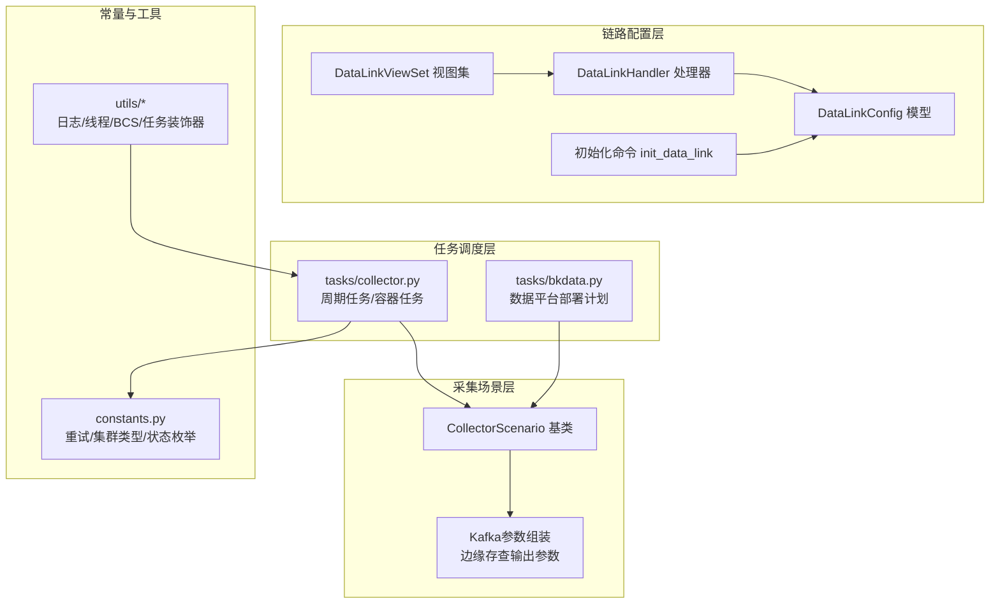
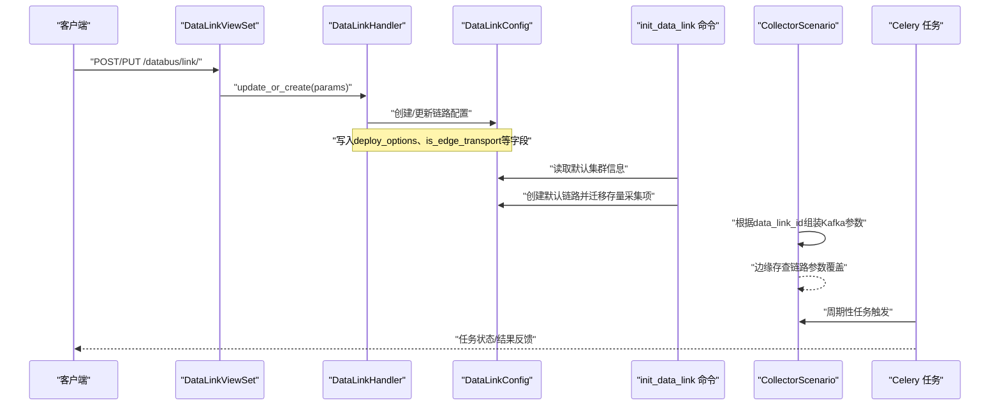
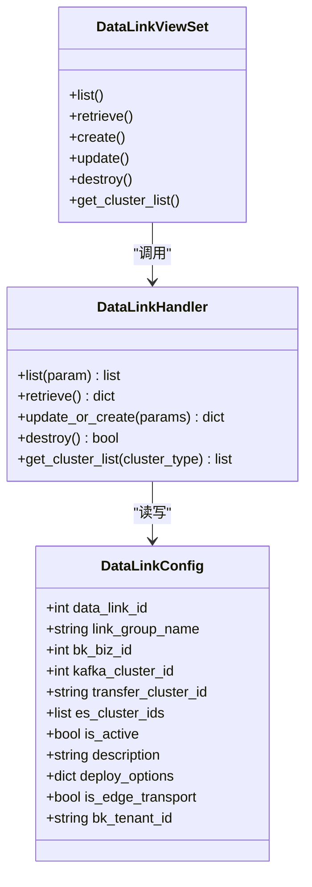
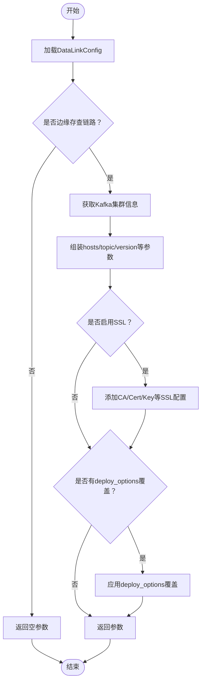
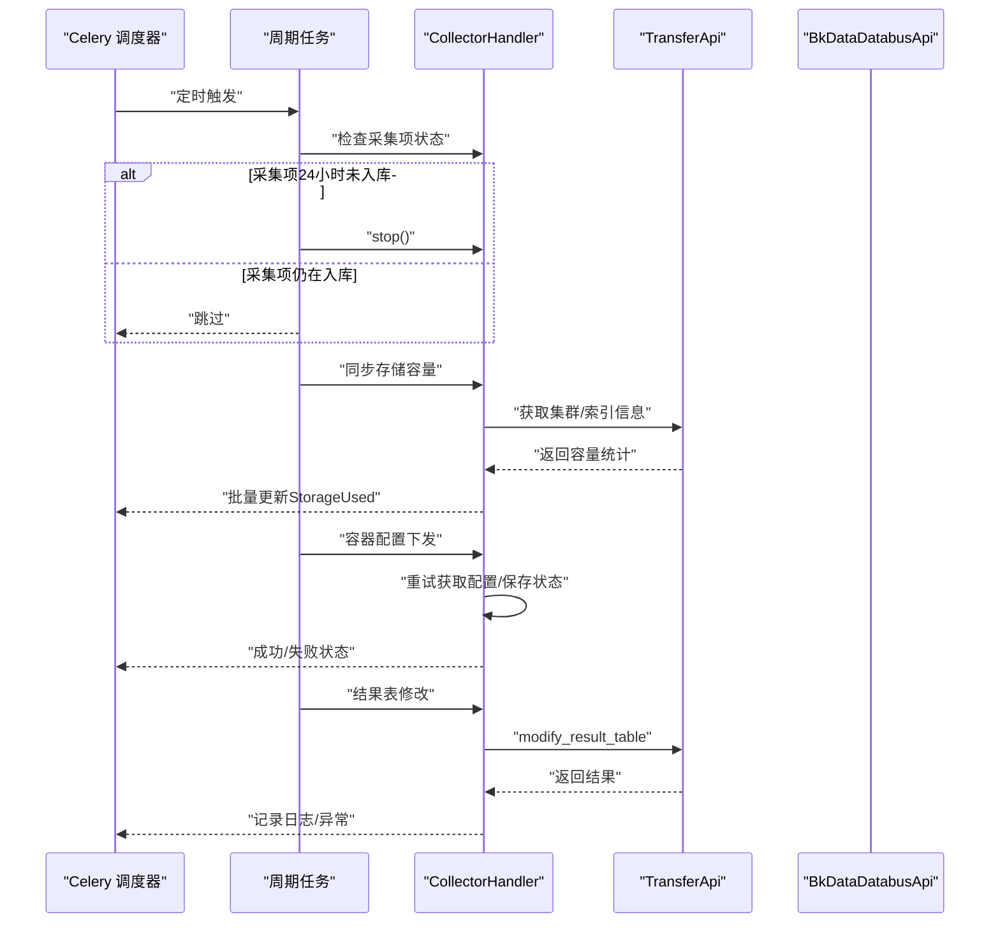
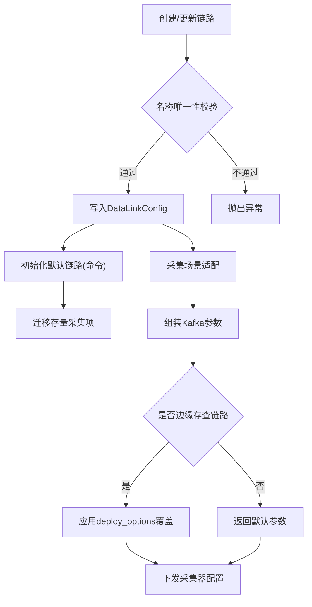
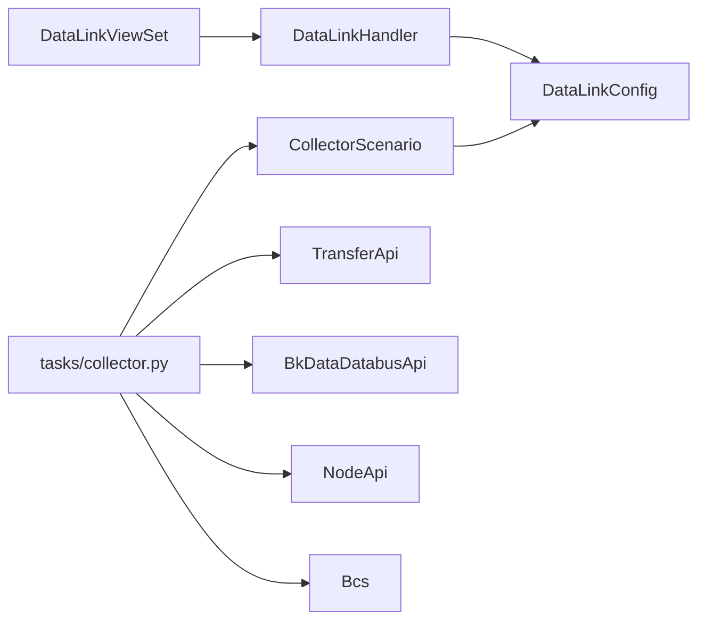

# 链路部署

<cite>
**本文引用的文件**   
- [apps/log_databus/handlers/link.py](file://apps/log_databus/handlers/link.py)
- [apps/log_databus/models.py](file://apps/log_databus/models.py)
- [apps/log_databus/views/link_views.py](file://apps/log_databus/views/link_views.py)
- [apps/log_databus/management/commands/init_data_link.py](file://apps/log_databus/management/commands/init_data_link.py)
- [apps/log_databus/handlers/collector_scenario/base.py](file://apps/log_databus/handlers/collector_scenario/base.py)
- [apps/log_databus/tasks/collector.py](file://apps/log_databus/tasks/collector.py)
- [apps/log_databus/constants.py](file://apps/log_databus/constants.py)
- [apps/log_databus/tasks/bkdata.py](file://apps/log_databus/tasks/bkdata.py)
- [apps/log_databus/handlers/collector/host.py](file://apps/log_databus/handlers/collector/host.py)
- [apps/log_databus/migrations/0035_datalinkconfig_deploy_options.py](file://apps/log_databus/migrations/0035_datalinkconfig_deploy_options.py)
- [apps/log_databus/migrations/0044_datalinkconfig_bk_tenant_id.py](file://apps/log_databus/migrations/0044_datalinkconfig_bk_tenant_id.py)
- [apps/log_databus/migrations/0036_auto_20230719_2120.py](file://apps/log_databus/migrations/0036_auto_20230719_2120.py)
- [apps/log_databus/handlers/collector/base.py](file://apps/log_databus/handlers/collector/base.py)
- [apps/log_databus/handlers/storage.py](file://apps/log_databus/handlers/storage.py)
- [apps/log_databus/exceptions.py](file://apps/log_databus/exceptions.py)
- [apps/log_databus/serializers.py](file://apps/log_databus/serializers.py)
- [apps/log_databus/permission.py](file://apps/log_databus/permission.py)
- [apps/log_databus/urls.py](file://apps/log_databus/urls.py)
- [apps/log_databus/base.py](file://apps/log_databus/base.py)
- [apps/log_databus/exception.py](file://apps/log_databus/exception.py)
- [apps/log_databus/constants.py](file://apps/log_databus/constants.py)
- [apps/log_databus/utils/cache.py](file://apps/log_databus/utils/cache.py)
- [apps/log_databus/utils/function.py](file://apps/log_databus/utils/function.py)
- [apps/log_databus/utils/local.py](file://apps/log_databus/utils/local.py)
- [apps/log_databus/utils/log.py](file://apps/log_databus/utils/log.py)
- [apps/log_databus/utils/thread.py](file://apps/log_databus/utils/thread.py)
- [apps/log_databus/utils/bcs.py](file://apps/log_databus/utils/bcs.py)
- [apps/log_databus/utils/task.py](file://apps/log_databus/utils/task.py)
- [apps/log_databus/utils/elastic.py](file://apps/log_databus/utils/elastic.py)
- [apps/log_databus/utils/es_config.py](file://apps/log_databus/utils/es_config.py)
- [apps/log_databus/utils/pipeline.py](file://apps/log_databus/utils/pipeline.py)
- [apps/log_databus/utils/consul.py](file://apps/log_databus/utils/consul.py)
- [apps/log_databus/utils/sentinel.py](file://apps/log_databus/utils/sentinel.py)
- [apps/log_databus/utils/notify.py](file://apps/log_databus/utils/notify.py)
- [apps/log_databus/utils/parser.py](file://apps/log_databus/utils/parser.py)
- [apps/log_databus/utils/remote_storage.py](file://apps/log_databus/utils/remote_storage.py)
- [apps/log_databus/utils/search_module.py](file://apps/log_databus/utils/search_module.py)
- [apps/log_databus/utils/template.py](file://apps/log_databus/utils/template.py)
- [apps/log_databus/utils/time_handler.py](file://apps/log_databus/utils/time_handler.py)
- [apps/log_databus/utils/custom_report.py](file://apps/log_databus/utils/custom_report.py)
- [apps/log_databus/utils/prometheus.py](file://apps/log_databus/utils/prometheus.py)
- [apps/log_databus/utils/db.py](file://apps/log_databus/utils/db.py)
- [apps/log_databus/utils/admin.py](file://apps/log_databus/utils/admin.py)
- [apps/log_databus/utils/codecs.py](file://apps/log_databus/utils/codecs.py)
- [apps/log_databus/utils/lock.py](file://apps/log_databus/utils/lock.py)
- [apps/log_databus/utils/string_util.py](file://apps/log_databus/utils/string_util.py)
- [apps/log_databus/utils/aes.py](file://apps/log_databus/utils/aes.py)
- [apps/log_databus/utils/base_crypt.py](file://apps/log_databus/utils/base_crypt.py)
- [apps/log_databus/utils/bk_data_auth.py](file://apps/log_databus/utils/bk_data_auth.py)
- [apps/log_databus/utils/bkdata.py](file://apps/log_databus/utils/bkdata.py)
- [apps/log_databus/utils/context_processors.py](file://apps/log_databus/utils/context_processors.py)
- [apps/log_databus/utils/cos.py](file://apps/log_databus/utils/cos.py)
- [apps/log_databus/utils/drf.py](file://apps/log_databus/utils/drf.py)
- [apps/log_databus/utils/function.py](file://apps/log_databus/utils/function.py)
- [apps/log_databus/utils/grep_syntax_parse.py](file://apps/log_databus/utils/grep_syntax_parse.py)
- [apps/log_databus/utils/image.py](file://apps/log_databus/utils/image.py)
- [apps/log_databus/utils/ipchooser.py](file://apps/log_databus/utils/ipchooser.py)
- [apps/log_databus/utils/local.py](file://apps/log_databus/utils/local.py)
- [apps/log_databus/utils/pipe_line.py](file://apps/log_databus/utils/pipe_line.py)
- [apps/log_databus/utils/pipeline.py](file://apps/log_databus/utils/pipeline.py)
- [apps/log_databus/utils/pipline.py](file://apps/log_databus/utils/pipline.py)
- [apps/log_databus/utils/sentinel.py](file://apps/log_databus/utils/sentinel.py)
- [apps/log_databus/utils/sync_pattern.py](file://apps/log_databus/utils/sync_pattern.py)
- [apps/log_databus/utils/task.py](file://apps/log_databus/utils/task.py)
- [apps/log_databus/utils/thread.py](file://apps/log_databus/utils/thread.py)
- [apps/log_databus/utils/time_handler.py](file://apps/log_databus/utils/time_handler.py)
- [apps/log_databus/utils/timer.py](file://apps/log_databus/utils/timer.py)
- [apps/log_databus/utils/notify.py](file://apps/log_databus/utils/notify.py)
- [apps/log_databus/utils/remote_storage.py](file://apps/log_databus/utils/remote_storage.py)
- [apps/log_databus/utils/search_module.py](file://apps/log_databus/utils/search_module.py)
- [apps/log_databus/utils/template.py](file://apps/log_databus/utils/template.py)
- [apps/log_databus/utils/version_log.py](file://apps/log_databus/utils/version_log.py)
- [apps/log_databus/utils/zip.py](file://apps/log_databus/utils/zip.py)
- [apps/log_databus/utils/zipper.py](file://apps/log_databus/utils/zipper.py)
- [apps/log_databus/utils/zipper.py](file://apps/log_databus/utils/zipper.py)
- [apps/log_databus/utils/zipper.py](file://apps/log_databus/utils/zipper.py)
- [apps/log_databus/utils/zipper.py](file://apps/log_databus/utils/zipper.py)
- [apps/log_databus/utils/zipper.py](file://apps/log_databus/utils/zipper.py)
- [apps/log_databus/utils/zipper.py](file://apps/log_databus/utils/zipper.py)
- [apps/log_databus/utils/zipper.py](file://apps/log_databus/utils/zipper.py)
- [apps/log_databus/utils/zipper.py](file://apps/log_databus/utils/zipper.py)
- [apps/log_databus/utils/zipper.py](file://apps/log_databus/utils/zipper.py)
- [apps/log_databus/utils/zipper.py](file://apps/log_databus/utils/zipper.py)
- [apps/log_databus/utils/zipper.py](file://apps/log_databus/utils/zipper.py)
- [apps/log_databus/utils/zipper.py](file://apps/log_databus/utils/zipper.py)
- [apps/log_databus/utils/zipper.py](file://apps/log_databus/utils/zipper.py)
- [apps/log_databus/utils/zipper.py](file://apps/log_databus/utils/zipper.py)
- [apps/log_databus/utils/zipper.py](file://apps/log_databus/utils/zipper.py)
- [apps/log_databus/utils/zipper.py](file://apps/log_databus/utils/zipper.py)
- [apps/log_databus/utils/zipper.py](file://apps/log_databus/utils/zipper.py)
- [apps/log_databus/utils/zipper.py](file://apps/log_databus/utils/zipper.py)
- [apps/log_databus/utils/zipper.py](file://apps/log_databus/utils/zipper.py)
- [apps/log_databus/utils/zipper.py](file://apps/log_databus/utils/zipper.py)
- [apps/log_databus/utils......](file://apps/log_databus/utils/zipper.py)
</cite>

## 目录
1. [简介](#简介)
2. [项目结构](#项目结构)
3. [核心组件](#核心组件)
4. [架构总览](#架构总览)
5. [详细组件分析](#详细组件分析)
6. [依赖分析](#依赖分析)
7. [性能考虑](#性能考虑)
8. [故障排查指南](#故障排查指南)
9. [结论](#结论)
10. [附录](#附录)

## 简介
本技术文档围绕“数据链路部署”主题，系统梳理蓝鲸日志平台中数据链路的初始化、配置下发、服务启动、任务调度与监控反馈机制。重点覆盖以下方面：
- 链路初始化与默认链路创建
- 链路配置的创建、更新与校验
- 采集场景下的配置下发与Kafka参数定制
- Celery任务的执行流程、状态跟踪与重试策略
- 自动化部署流程（配置验证、资源分配、服务注册、健康检查）
- 监控与反馈（进度监控、错误收集、结果通知）
- 故障排查与性能优化建议

## 项目结构
数据链路部署相关的核心模块集中在 databus 应用中，主要涉及：
- 链路模型与视图：DataLinkConfig、DataLinkViewSet、DataLinkHandler
- 初始化命令：默认链路初始化
- 采集场景适配：Kafka参数组装、边缘存查链路输出参数
- 任务调度：周期性任务、容器配置下发任务、结果表修改任务
- 常量与工具：重试次数、等待间隔、集群类型、任务装饰器等

**图表来源**
- [apps/log_databus/views/link_views.py:36-258](file://apps/log_databus/views/link_views.py#L36-L258)
- [apps/log_databus/handlers/link.py:38-209](file://apps/log_databus/handlers/link.py#L38-L209)
- [apps/log_databus/models.py:455-482](file://apps/log_databus/models.py#L455-L482)
- [apps/log_databus/management/commands/init_data_link.py:33-98](file://apps/log_databus/management/commands/init_data_link.py#L33-L98)
- [apps/log_databus/handlers/collector_scenario/base.py:350-420](file://apps/log_databus/handlers/collector_scenario/base.py#L350-L420)
- [apps/log_databus/tasks/collector.py:64-576](file://apps/log_databus/tasks/collector.py#L64-L576)
- [apps/log_databus/tasks/bkdata.py:104-132](file://apps/log_databus/tasks/bkdata.py#L104-L132)
- [apps/log_databus/constants.py:554-582](file://apps/log_databus/constants.py#L554-L582)

**章节来源**
- [apps/log_databus/views/link_views.py:36-258](file://apps/log_databus/views/link_views.py#L36-L258)
- [apps/log_databus/handlers/link.py:38-209](file://apps/log_databus/handlers/link.py#L38-L209)
- [apps/log_databus/models.py:455-482](file://apps/log_databus/models.py#L455-L482)
- [apps/log_databus/management/commands/init_data_link.py:33-98](file://apps/log_databus/management/commands/init_data_link.py#L33-L98)
- [apps/log_databus/handlers/collector_scenario/base.py:350-420](file://apps/log_databus/handlers/collector_scenario/base.py#L350-L420)
- [apps/log_databus/tasks/collector.py:64-576](file://apps/log_databus/tasks/collector.py#L64-L576)
- [apps/log_databus/tasks/bkdata.py:104-132](file://apps/log_databus/tasks/bkdata.py#L104-L132)
- [apps/log_databus/constants.py:554-582](file://apps/log_databus/constants.py#L554-L582)

## 核心组件
- DataLinkConfig 模型：定义数据链路配置，包含 Kafka 集群、Transfer 集群、ES 集群集合、激活状态、备注、部署选项、边缘存查标记、租户 ID 等。
- DataLinkHandler：封装链路的增删改查、集群列表获取、链路创建/更新逻辑。
- DataLinkViewSet：提供 REST API，支持链路列表、详情、创建、更新、删除、集群列表查询。
- 初始化命令 init_data_link：根据默认集群信息创建默认链路，并将存量采集项迁移至默认链路。
- 采集场景适配：在不同采集场景下，组装 Kafka 输出参数，支持边缘存查链路的特殊参数覆盖。
- 任务调度：周期性任务（如采集项状态检查、存储容量同步）、容器配置下发任务、结果表修改任务；支持高优先级任务与重试策略。

**章节来源**
- [apps/log_databus/models.py:455-482](file://apps/log_databus/models.py#L455-L482)
- [apps/log_databus/handlers/link.py:38-209](file://apps/log_databus/handlers/link.py#L38-L209)
- [apps/log_databus/views/link_views.py:36-258](file://apps/log_databus/views/link_views.py#L36-L258)
- [apps/log_databus/management/commands/init_data_link.py:33-98](file://apps/log_databus/management/commands/init_data_link.py#L33-L98)
- [apps/log_databus/handlers/collector_scenario/base.py:350-420](file://apps/log_databus/handlers/collector_scenario/base.py#L350-L420)
- [apps/log_databus/tasks/collector.py:64-576](file://apps/log_databus/tasks/collector.py#L64-L576)

## 架构总览
数据链路部署的总体流程如下：
- 配置阶段：通过视图集创建/更新链路配置，写入 DataLinkConfig；初始化命令根据默认集群创建默认链路。
- 下发阶段：采集场景适配根据链路配置组装 Kafka 参数，支持边缘存查链路的参数覆盖。
- 执行阶段：Celery 任务执行周期性检查、存储容量同步、容器配置下发、结果表修改等。
- 监控阶段：通过任务状态、错误日志、通知机制反馈部署结果。

**图表来源**
- [apps/log_databus/views/link_views.py:114-215](file://apps/log_databus/views/link_views.py#L114-L215)
- [apps/log_databus/handlers/link.py:109-157](file://apps/log_databus/handlers/link.py#L109-L157)
- [apps/log_databus/management/commands/init_data_link.py:40-97](file://apps/log_databus/management/commands/init_data_link.py#L40-L97)
- [apps/log_databus/handlers/collector_scenario/base.py:350-420](file://apps/log_databus/handlers/collector_scenario/base.py#L350-L420)
- [apps/log_databus/tasks/collector.py:99-122](file://apps/log_databus/tasks/collector.py#L99-L122)

## 详细组件分析

### 链路配置与初始化
- DataLinkConfig 模型字段：链路ID、名称、业务ID、Kafka集群ID、Transfer集群ID、ES集群ID列表、激活状态、备注、部署选项、边缘存查标记、租户ID。
- DataLinkHandler.update_or_create：校验链路名称唯一性、编辑时的集群变更约束、写入租户ID；返回链路配置。
- DataLinkViewSet：提供 list/retrieve/create/update/destroy/get_cluster_list 等接口。
- 初始化命令 init_data_link：根据默认集群创建默认链路，并将存量采集项迁移到默认链路。

**图表来源**
- [apps/log_databus/models.py:455-482](file://apps/log_databus/models.py#L455-L482)
- [apps/log_databus/handlers/link.py:38-209](file://apps/log_databus/handlers/link.py#L38-L209)
- [apps/log_databus/views/link_views.py:36-258](file://apps/log_databus/views/link_views.py#L36-L258)

**章节来源**
- [apps/log_databus/models.py:455-482](file://apps/log_databus/models.py#L455-L482)
- [apps/log_databus/handlers/link.py:109-157](file://apps/log_databus/handlers/link.py#L109-L157)
- [apps/log_databus/views/link_views.py:48-215](file://apps/log_databus/views/link_views.py#L48-L215)
- [apps/log_databus/management/commands/init_data_link.py:40-97](file://apps/log_databus/management/commands/init_data_link.py#L40-L97)

### 采集场景与Kafka参数组装
- CollectorScenario.get_edge_transport_output_params：根据链路ID获取 Kafka 输出参数，支持边缘存查链路的外网域名/端口、SSL配置、认证信息、自定义覆盖。
- CollectorScenario._deal_edge_transport_params：将组装好的 Kafka 参数注入采集器模板的 output 字段。
- deploy_options 字段：链路级别的部署选项，可在 DB 中覆盖默认 Kafka 参数。

**图表来源**
- [apps/log_databus/handlers/collector_scenario/base.py:350-420](file://apps/log_databus/handlers/collector_scenario/base.py#L350-L420)
- [apps/log_databus/models.py:474](file://apps/log_databus/models.py#L474)

**章节来源**
- [apps/log_databus/handlers/collector_scenario/base.py:350-420](file://apps/log_databus/handlers/collector_scenario/base.py#L350-L420)
- [apps/log_databus/models.py:474](file://apps/log_databus/models.py#L474)

### Celery任务与任务调度机制
- 任务装饰器与周期任务：periodic_task、high_priority_task 等装饰器用于声明周期任务与高优先级任务。
- 重试与等待：RETRY_TIMES、WAIT_FOR_RETRY 常量用于容器配置下发任务的重试与等待。
- 任务类型与职责：
  - 采集项状态检查：24小时未入库自动停止
  - 存储容量同步：每小时同步业务各集群已用容量
  - 容器配置下发：创建/删除容器配置，带状态与错误处理
  - 结果表修改：批量修改结果表存储配置
  - 数据平台部署：向数据平台提交部署计划

**图表来源**
- [apps/log_databus/tasks/collector.py:99-122](file://apps/log_databus/tasks/collector.py#L99-L122)
- [apps/log_databus/tasks/collector.py:124-192](file://apps/log_databus/tasks/collector.py#L124-L192)
- [apps/log_databus/tasks/collector.py:335-366](file://apps/log_databus/tasks/collector.py#L335-L366)
- [apps/log_databus/tasks/collector.py:508-525](file://apps/log_databus/tasks/collector.py#L508-L525)
- [apps/log_databus/tasks/bkdata.py:104-132](file://apps/log_databus/tasks/bkdata.py#L104-L132)
- [apps/log_databus/constants.py:554-556](file://apps/log_databus/constants.py#L554-L556)

**章节来源**
- [apps/log_databus/tasks/collector.py:99-122](file://apps/log_databus/tasks/collector.py#L99-L122)
- [apps/log_databus/tasks/collector.py:124-192](file://apps/log_databus/tasks/collector.py#L124-L192)
- [apps/log_databus/tasks/collector.py:335-366](file://apps/log_databus/tasks/collector.py#L335-L366)
- [apps/log_databus/tasks/collector.py:508-525](file://apps/log_databus/tasks/collector.py#L508-L525)
- [apps/log_databus/tasks/bkdata.py:104-132](file://apps/log_databus/tasks/bkdata.py#L104-L132)
- [apps/log_databus/constants.py:554-556](file://apps/log_databus/constants.py#L554-L556)

### 自动化部署流程
- 配置验证：链路创建/更新时校验名称唯一性、编辑时集群变更约束。
- 资源分配：初始化命令根据默认集群创建默认链路，迁移存量采集项。
- 服务注册：采集场景适配根据链路配置组装 Kafka 参数，支持边缘存查链路覆盖。
- 健康检查：容器配置下发任务包含状态更新与错误记录，便于后续健康检查。

**图表来源**
- [apps/log_databus/handlers/link.py:132-157](file://apps/log_databus/handlers/link.py#L132-L157)
- [apps/log_databus/management/commands/init_data_link.py:40-97](file://apps/log_databus/management/commands/init_data_link.py#L40-L97)
- [apps/log_databus/handlers/collector_scenario/base.py:350-420](file://apps/log_databus/handlers/collector_scenario/base.py#L350-L420)

**章节来源**
- [apps/log_databus/handlers/link.py:132-157](file://apps/log_databus/handlers/link.py#L132-L157)
- [apps/log_databus/management/commands/init_data_link.py:40-97](file://apps/log_databus/management/commands/init_data_link.py#L40-L97)
- [apps/log_databus/handlers/collector_scenario/base.py:350-420](file://apps/log_databus/handlers/collector_scenario/base.py#L350-L420)

### 监控与反馈机制
- 任务状态跟踪：容器配置下发任务在数据库中维护状态与详情，失败时记录错误信息。
- 错误信息收集：任务执行过程中捕获异常并记录日志，便于问题定位。
- 部署结果通知：数据平台部署任务在异常时记录错误信息，供后续处理。

**章节来源**
- [apps/log_databus/tasks/collector.py:335-366](file://apps/log_databus/tasks/collector.py#L335-L366)
- [apps/log_databus/tasks/bkdata.py:104-132](file://apps/log_databus/tasks/bkdata.py#L104-L132)

## 依赖分析
- 模块耦合：
  - DataLinkViewSet 依赖 DataLinkHandler；DataLinkHandler 依赖 DataLinkConfig。
  - 采集场景适配依赖 DataLinkConfig 的 deploy_options 与 is_edge_transport 字段。
  - 任务调度依赖采集场景适配与 Transfer/BkData 等外部接口。
- 外部依赖：
  - TransferApi：集群信息、数据源、结果表等接口。
  - BkDataDatabusApi：数据平台部署计划接口。
  - NodeApi：节点管理订阅与重试接口。
  - Bcs：容器配置下发接口。

**图表来源**
- [apps/log_databus/views/link_views.py:36-258](file://apps/log_databus/views/link_views.py#L36-L258)
- [apps/log_databus/handlers/link.py:38-209](file://apps/log_databus/handlers/link.py#L38-L209)
- [apps/log_databus/models.py:455-482](file://apps/log_databus/models.py#L455-L482)
- [apps/log_databus/handlers/collector_scenario/base.py:350-420](file://apps/log_databus/handlers/collector_scenario/base.py#L350-L420)
- [apps/log_databus/tasks/collector.py:64-576](file://apps/log_databus/tasks/collector.py#L64-L576)

**章节来源**
- [apps/log_databus/views/link_views.py:36-258](file://apps/log_databus/views/link_views.py#L36-L258)
- [apps/log_databus/handlers/link.py:38-209](file://apps/log_databus/handlers/link.py#L38-L209)
- [apps/log_databus/models.py:455-482](file://apps/log_databus/models.py#L455-L482)
- [apps/log_databus/handlers/collector_scenario/base.py:350-420](file://apps/log_databus/handlers/collector_scenario/base.py#L350-L420)
- [apps/log_databus/tasks/collector.py:64-576](file://apps/log_databus/tasks/collector.py#L64-L576)

## 性能考虑
- 批量处理：存储容量同步任务采用批量 upsert，减少数据库往返。
- 重试与退避：容器配置下发任务具备固定重试次数与等待间隔，避免频繁重试造成压力。
- 索引解析优化：索引名称解析采用正则匹配，注意在大规模索引场景下的性能影响。
- 集群信息缓存：模型层使用缓存装饰器，降低重复查询开销。

**章节来源**
- [apps/log_databus/tasks/collector.py:527-576](file://apps/log_databus/tasks/collector.py#L527-L576)
- [apps/log_databus/constants.py:554-556](file://apps/log_databus/constants.py#L554-L556)
- [apps/log_databus/utils/cache.py](file://apps/log_databus/utils/cache.py)

## 故障排查指南
- 链路创建/更新失败
  - 名称重复：检查链路名称唯一性，避免同租户下重名。
  - 编辑约束：编辑时若 Kafka/Transfer/ES 集群发生变更，会触发编辑异常。
  - 租户ID：确保请求携带正确的租户ID。
- 初始化默认链路失败
  - 默认集群缺失：确认默认 Kafka/ES 集群是否存在。
  - 迁移失败：检查存量采集项迁移逻辑与异常日志。
- Kafka参数覆盖无效
  - deploy_options 字段为空或格式不正确。
  - 边缘存查链路未启用或参数未生效。
- Celery任务失败
  - 容器配置下发：检查重试次数与等待间隔，查看状态与错误详情。
  - 采集项状态检查：确认采集项是否仍在入库，避免误停。
  - 存储容量同步：检查 Transfer 接口可用性与权限。
  - 结果表修改：确认 table_id 与参数正确性。
- 数据平台部署异常
  - 权限不足或关联 channel_id 失败，需联系数据平台同步。

**章节来源**
- [apps/log_databus/handlers/link.py:132-157](file://apps/log_databus/handlers/link.py#L132-L157)
- [apps/log_databus/management/commands/init_data_link.py:40-97](file://apps/log_databus/management/commands/init_data_link.py#L40-L97)
- [apps/log_databus/handlers/collector_scenario/base.py:350-420](file://apps/log_databus/handlers/collector_scenario/base.py#L350-L420)
- [apps/log_databus/tasks/collector.py:335-366](file://apps/log_databus/tasks/collector.py#L335-L366)
- [apps/log_databus/tasks/bkdata.py:104-132](file://apps/log_databus/tasks/bkdata.py#L104-L132)

## 结论
数据链路部署模块通过链路配置、采集场景适配、Celery任务调度与监控反馈，实现了从初始化到自动化部署的闭环。关键在于：
- 明确的链路配置与校验机制
- 可覆盖的 Kafka 参数与边缘存查支持
- 周期性任务与高优先级任务的协同
- 任务状态跟踪与错误收集
- 初始化命令保障存量数据的平滑迁移

## 附录
- 相关迁移文件
  - [apps/log_databus/migrations/0035_datalinkconfig_deploy_options.py:1-18](file://apps/log_databus/migrations/0035_datalinkconfig_deploy_options.py#L1-L18)
  - [apps/log_databus/migrations/0044_datalinkconfig_bk_tenant_id.py](file://apps/log_databus/migrations/0044_datalinkconfig_bk_tenant_id.py)
  - [apps/log_databus/migrations/0036_auto_20230719_2120.py:1-23](file://apps/log_databus/migrations/0036_auto_20230719_2120.py#L1-L23)
- 相关常量与工具
  - [apps/log_databus/constants.py:554-582](file://apps/log_databus/constants.py#L554-L582)
  - [apps/log_databus/utils/task.py](file://apps/log_databus/utils/task.py)
  - [apps/log_databus/utils/log.py](file://apps/log_databus/utils/log.py)
  - [apps/log_databus/utils/bcs.py](file://apps/log_databus/utils/bcs.py)
  - [apps/log_databus/utils/elastic.py](file://apps/log_databus/utils/elastic.py)
  - [apps/log_databus/utils/es_config.py](file://apps/log_databus/utils/es_config.py)
  - [apps/log_databus/utils/pipeline.py](file://apps/log_databus/utils/pipeline.py)
  - [apps/log_databus/utils/consul.py](file://apps/log_databus/utils/consul.py)
  - [apps/log_databus/utils/sentinel.py](file://apps/log_databus/utils/sentinel.py)
  - [apps/log_databus/utils/notify.py](file://apps/log_databus/utils/notify.py)
  - [apps/log_databus/utils/parser.py](file://apps/log_databus/utils/parser.py)
  - [apps/log_databus/utils/remote_storage.py](file://apps/log_databus/utils/remote_storage.py)
  - [apps/log_databus/utils/search_module.py](file://apps/log_databus/utils/search_module.py)
  - [apps/log_databus/utils/template.py](file://apps/log_databus/utils/template.py)
  - [apps/log_databus/utils/version_log.py](file://apps/log_databus/utils/version_log.py)
  - [apps/log_databus/utils/zip.py](file://apps/log_databus/utils/zip.py)
  - [apps/log_databus/utils/zipper.py](file://apps/log_databus/utils/zipper.py)
- 相关处理器与序列化
  - [apps/log_databus/handlers/collector/base.py:1580-1586](file://apps/log_databus/handlers/collector/base.py#L1580-L1586)
  - [apps/log_databus/handlers/storage.py](file://apps/log_databus/handlers/storage.py)
  - [apps/log_databus/exceptions.py](file://apps/log_databus/exceptions.py)
  - [apps/log_databus/serializers.py](file://apps/log_databus/serializers.py)
  - [apps/log_databus/permission.py](file://apps/log_databus/permission.py)
  - [apps/log_databus/urls.py](file://apps/log_databus/urls.py)
  - [apps/log_databus/base.py](file://apps/log_databus/base.py)
  - [apps/log_databus/exception.py](file://apps/log_databus/exception.py)
  - [apps/log_databus/constants.py](file://apps/log_databus/constants.py)
  - [apps/log_databus/utils/cache.py](file://apps/log_databus/utils/cache.py)
  - [apps/log_databus/utils/function.py](file://apps/log_databus/utils/function.py)
  - [apps/log_databus/utils/local.py](file://apps/log_databus/utils/local.py)
  - [apps/log_databus/utils/log.py](file://apps/log_databus/utils/log.py)
  - [apps/log_databus/utils/thread.py](file://apps/log_databus/utils/thread.py)
  - [apps/log_databus/utils/bcs.py](file://apps/log_databus/utils/bcs.py)
  - [apps/log_databus/utils/task.py](file://apps/log_databus/utils/task.py)
  - [apps/log_databus/utils/elastic.py](file://apps/log_databus/utils/elastic.py)
  - [apps/log_databus/utils/es_config.py](file://apps/log_databus/utils/es_config.py)
  - [apps/log_databus/utils/pipeline.py](file://apps/log_databus/utils/pipeline.py)
  - [apps/log_databus/utils/consul.py](file://apps/log_databus/utils/consul.py)
  - [apps/log_databus/utils/sentinel.py](file://apps/log_databus/utils/sentinel.py)
  - [apps/log_databus/utils/notify.py](file://apps/log_databus/utils/notify.py)
  - [apps/log_databus/utils/parser.py](file://apps/log_databus/utils/parser.py)
  - [apps/log_databus/utils/remote_storage.py](file://apps/log_databus/utils/remote_storage.py)
  - [apps/log_databus/utils/search_module.py](file://apps/log_databus/utils/search_module.py)
  - [apps/log_databus/utils/template.py](file://apps/log_databus/utils/template.py)
  - [apps/log_databus/utils/version_log.py](file://apps/log_databus/utils/version_log.py)
  - [apps/log_databus/utils/zip.py](file://apps/log_databus/utils/zip.py)
  - [apps/log_databus/utils/zipper.py](file://apps/log_databus/utils/zipper.py)