# 集群管理

<cite>
**本文引用的文件**
- [apps/log_databus/handlers/storage.py](file://apps/log_databus/handlers/storage.py)
- [apps/log_databus/handlers/kafka.py](file://apps/log_databus/handlers/kafka.py)
- [apps/log_databus/handlers/meta.py](file://apps/log_databus/handlers/meta.py)
- [apps/log_databus/handlers/check_collector/checker/es_checker.py](file://apps/log_databus/handlers/check_collector/checker/es_checker.py)
- [apps/log_databus/handlers/check_collector/checker/kafka_checker.py](file://apps/log_databus/handlers/check_collector/checker/kafka_checker.py)
- [apps/log_databus/handlers/check_collector/checker/metadata_checker.py](file://apps/log_databus/handlers/check_collector/checker/metadata_checker.py)
- [apps/log_databus/handlers/check_collector/checker/agent_checker.py](file://apps/log_databus/handlers/check_collector/checker/agent_checker.py)
- [apps/log_databus/handlers/check_collector/checker/route_checker.py](file://apps/log_databus/handlers/check_collector/checker/route_checker.py)
- [apps/log_databus/handlers/check_collector/checker/transfer_checker.py](file://apps/log_databus/handlers/check_collector/checker/transfer_checker.py)
- [apps/log_databus/handlers/check_collector/handler.py](file://apps/log_databus/handlers/check_collector/handler.py)
- [apps/log_databus/handlers/check_collector/checker/base_checker.py](file://apps/log_databus/handlers/check_collector/checker/base_checker.py)
- [apps/log_databus/handlers/check_collector/checker/bkunifylogbeat_checker.py](file://apps/log_databus/handlers/check_collector/checker/bkunifylogbeat_checker.py)
- [apps/log_measure/handlers/metric_collectors/cluster.py](file://apps/log_measure/handlers/metric_collectors/cluster.py)
- [apps/log_esquery/esquery/client/QueryClientEs.py](file://apps/log_esquery/esquery/client/QueryClientEs.py)
- [apps/log_databus/handlers/storage.py](file://apps/log_databus/handlers/storage.py)
- [apps/log_databus/handlers/storage.py](file://apps/log_databus/handlers/storage.py)
- [apps/log_databus/handlers/storage.py](file://apps/log_databus/handlers/storage.py)
- [apps/api/modules/transfer.py](file://apps/api/modules/transfer.py)
- [apps/log_clustering/handlers/clustering_monitor.py](file://apps/log_clustering/handlers/clustering_monitor.py)
- [apps/log_clustering/constants.py](file://apps/log_clustering/constants.py)
</cite>

## 目录
1. [简介](#简介)
2. [项目结构](#项目结构)
3. [核心组件](#核心组件)
4. [架构总览](#架构总览)
5. [组件详解](#组件详解)
6. [依赖关系分析](#依赖关系分析)
7. [性能考量](#性能考量)
8. [故障排查指南](#故障排查指南)
9. [结论](#结论)
10. [附录](#附录)

## 简介
本技术文档聚焦于集群管理系统，围绕三类核心集群展开：Kafka 集群、Transfer 集群、ES（Elasticsearch）集群。文档从配置与管理机制入手，深入解析健康检查流程（Agent 检查器、ES 检查器、Kafka 检查器、Metadata 检查器等），并阐述部署与维护策略（初始化、配置更新、故障转移、负载均衡）、监控与告警机制（状态监控、性能指标、异常检测与通知），最后提供配置优化建议与常见问题排查路径。

## 项目结构
本项目采用多应用分层组织，集群管理相关能力主要分布在以下模块：
- 数据总线（log_databus）：负责集群接入、路由、健康检查、采集链路对接
- ES 查询（log_esquery）：提供 ES 客户端封装与连接管理
- 指标采集（log_measure）：面向 ES 的集群健康与节点指标采集
- 聚类与告警（log_clustering）：基于智能检测的异常告警策略
- API 封装（apps/api/modules/transfer.py）：统一调用 Transfer 能力

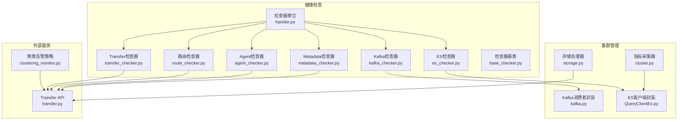

**图表来源**
- [apps/log_databus/handlers/storage.py](file://apps/log_databus/handlers/storage.py)
- [apps/log_databus/handlers/kafka.py](file://apps/log_databus/handlers/kafka.py)
- [apps/log_measure/handlers/metric_collectors/cluster.py](file://apps/log_measure/handlers/metric_collectors/cluster.py)
- [apps/log_esquery/esquery/client/QueryClientEs.py](file://apps/log_esquery/esquery/client/QueryClientEs.py)
- [apps/log_databus/handlers/check_collector/checker/es_checker.py](file://apps/log_databus/handlers/check_collector/checker/es_checker.py)
- [apps/log_databus/handlers/check_collector/checker/kafka_checker.py](file://apps/log_databus/handlers/check_collector/checker/kafka_checker.py)
- [apps/log_databus/handlers/check_collector/checker/metadata_checker.py](file://apps/log_databus/handlers/check_collector/checker/metadata_checker.py)
- [apps/log_databus/handlers/check_collector/checker/agent_checker.py](file://apps/log_databus/handlers/check_collector/checker/agent_checker.py)
- [apps/log_databus/handlers/check_collector/checker/route_checker.py](file://apps/log_databus/handlers/check_collector/checker/route_checker.py)
- [apps/log_databus/handlers/check_collector/checker/transfer_checker.py](file://apps/log_databus/handlers/check_collector/checker/transfer_checker.py)
- [apps/log_databus/handlers/check_collector/handler.py](file://apps/log_databus/handlers/check_collector/handler.py)
- [apps/api/modules/transfer.py](file://apps/api/modules/transfer.py)
- [apps/log_clustering/handlers/clustering_monitor.py](file://apps/log_clustering/handlers/clustering_monitor.py)

**章节来源**
- [apps/log_databus/handlers/storage.py](file://apps/log_databus/handlers/storage.py)
- [apps/log_databus/handlers/kafka.py](file://apps/log_databus/handlers/kafka.py)
- [apps/log_measure/handlers/metric_collectors/cluster.py](file://apps/log_measure/handlers/metric_collectors/cluster.py)
- [apps/log_esquery/esquery/client/QueryClientEs.py](file://apps/log_esquery/esquery/client/QueryClientEs.py)
- [apps/log_databus/handlers/check_collector/handler.py](file://apps/log_databus/handlers/check_collector/handler.py)
- [apps/api/modules/transfer.py](file://apps/api/modules/transfer.py)
- [apps/log_clustering/handlers/clustering_monitor.py](file://apps/log_clustering/handlers/clustering_monitor.py)

## 核心组件
- 存储处理器（StorageHandler）
  - 负责集群列表获取、可见性过滤、节点与统计信息拉取、热/温节点识别、与资源中心同步、创建/更新/销毁集群等
- Kafka 消费者封装（KafkaConsumerHandle）
  - 提供连接 Kafka、读取主题最新日志、分区偏移处理等能力
- ES 客户端封装（QueryClientEs）
  - 通过 Transfer 获取集群连接信息，建立 ES 客户端并执行健康探测
- 指标采集器（ClusterMetricCollector）
  - 采集 ES 集群健康度、节点分配与资源使用、CPU/内存/负载等指标
- 健康检查器集合
  - ES 检查器、Kafka 检查器、Metadata 检查器、Agent 检查器、路由检查器、Transfer 检查器，统一由检查器聚合器调度
- 聚类告警策略（ClusteringMonitor）
  - 基于智能检测算法生成日志聚类告警，支持通知组与升级策略

**章节来源**
- [apps/log_databus/handlers/storage.py](file://apps/log_databus/handlers/storage.py)
- [apps/log_databus/handlers/kafka.py](file://apps/log_databus/handlers/kafka.py)
- [apps/log_esquery/esquery/client/QueryClientEs.py](file://apps/log_esquery/esquery/client/QueryClientEs.py)
- [apps/log_measure/handlers/metric_collectors/cluster.py](file://apps/log_measure/handlers/metric_collectors/cluster.py)
- [apps/log_databus/handlers/check_collector/checker/es_checker.py](file://apps/log_databus/handlers/check_collector/checker/es_checker.py)
- [apps/log_databus/handlers/check_collector/checker/kafka_checker.py](file://apps/log_databus/handlers/check_collector/checker/kafka_checker.py)
- [apps/log_databus/handlers/check_collector/checker/metadata_checker.py](file://apps/log_databus/handlers/check_collector/checker/metadata_checker.py)
- [apps/log_databus/handlers/check_collector/checker/agent_checker.py](file://apps/log_databus/handlers/check_collector/checker/agent_checker.py)
- [apps/log_databus/handlers/check_collector/checker/route_checker.py](file://apps/log_databus/handlers/check_collector/checker/route_checker.py)
- [apps/log_databus/handlers/check_collector/checker/transfer_checker.py](file://apps/log_databus/handlers/check_collector/checker/transfer_checker.py)
- [apps/log_databus/handlers/check_collector/handler.py](file://apps/log_databus/handlers/check_collector/handler.py)
- [apps/log_clustering/handlers/clustering_monitor.py](file://apps/log_clustering/handlers/clustering_monitor.py)

## 架构总览
下图展示集群管理的关键交互：存储处理器与 Transfer 对接以获取/更新集群信息；ES 客户端封装用于健康探测；Kafka 消费者封装用于链路验证；指标采集器定期上报 ES 集群健康与节点指标；健康检查器对 Agent、ES、Kafka、Metadata、路由、Transfer 进行统一检查；聚类告警策略结合智能检测生成告警并通知。

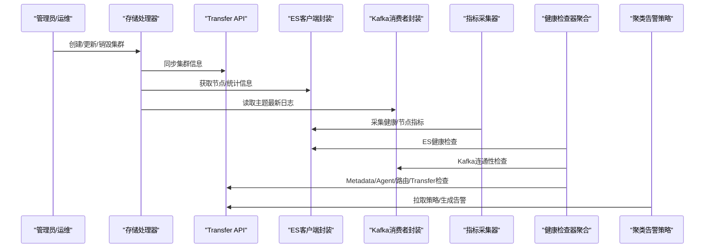

**图表来源**
- [apps/log_databus/handlers/storage.py](file://apps/log_databus/handlers/storage.py)
- [apps/log_esquery/esquery/client/QueryClientEs.py](file://apps/log_esquery/esquery/client/QueryClientEs.py)
- [apps/log_databus/handlers/kafka.py](file://apps/log_databus/handlers/kafka.py)
- [apps/log_measure/handlers/metric_collectors/cluster.py](file://apps/log_measure/handlers/metric_collectors/cluster.py)
- [apps/log_databus/handlers/check_collector/handler.py](file://apps/log_databus/handlers/check_collector/handler.py)
- [apps/log_clustering/handlers/clustering_monitor.py](file://apps/log_clustering/handlers/clustering_monitor.py)
- [apps/api/modules/transfer.py](file://apps/api/modules/transfer.py)

## 组件详解

### ES 集群配置与管理
- 集群列表与可见性
  - 通过 Transfer 获取集群信息，按业务可见性规则过滤，支持默认集群与第三方集群优先级排序
- 节点与统计信息
  - 使用路由工具批量拉取节点统计与集群统计，用于容量与使用情况评估
- 热/温节点识别
  - 通过节点属性或角色识别热/温节点数量，支撑冷热分层存储配置
- 与资源中心同步
  - 在创建/更新时同步到资源中心，确保外部资源视图一致
- 可见性与权限
  - 支持全业务可见、当前租户可见、多业务可见、业务属性可见等策略

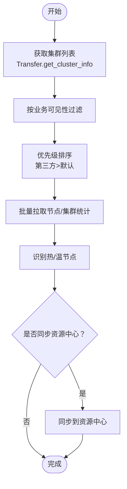

**图表来源**
- [apps/log_databus/handlers/storage.py](file://apps/log_databus/handlers/storage.py)

**章节来源**
- [apps/log_databus/handlers/storage.py](file://apps/log_databus/handlers/storage.py)

### Kafka 集群配置与管理
- 连接与认证
  - 支持 PLAINTEXT、SASL_PLAINTEXT、SSL、SASL_SSL 四种安全协议组合，自动根据用户名与证书参数选择
- 主题读取
  - 通过消费者读取主题分区，定位最近若干条日志，用于链路连通性验证
- 异常处理
  - 连接失败抛出特定异常，分区不存在时提示分区异常

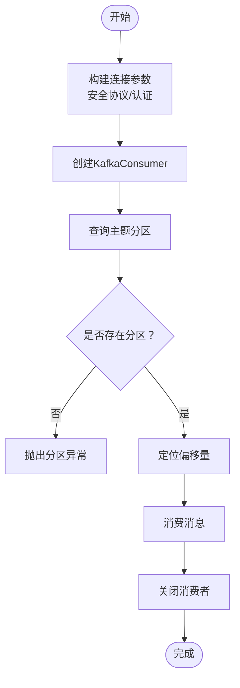

**图表来源**
- [apps/log_databus/handlers/kafka.py](file://apps/log_databus/handlers/kafka.py)

**章节来源**
- [apps/log_databus/handlers/kafka.py](file://apps/log_databus/handlers/kafka.py)

### Transfer 集群配置与管理
- 集群信息获取
  - 通过 Transfer API 获取集群详情，用于后续健康检查与路由决策
- 结果表 MQ 最新数据
  - 提供查询结果表 MQ 最新数据的接口封装，便于链路验证

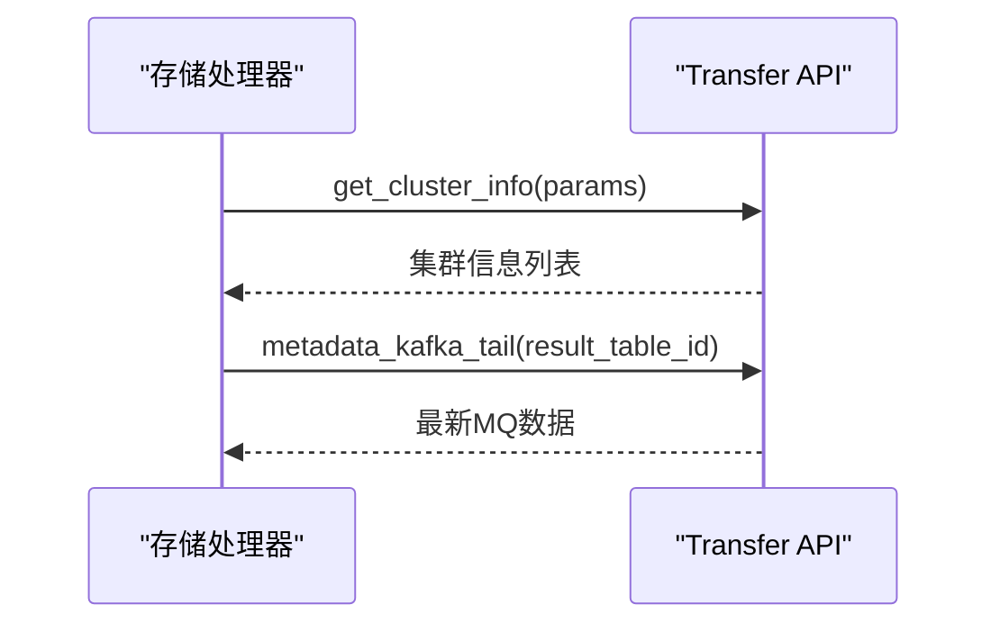

**图表来源**
- [apps/api/modules/transfer.py](file://apps/api/modules/transfer.py)
- [apps/log_databus/handlers/storage.py](file://apps/log_databus/handlers/storage.py)

**章节来源**
- [apps/api/modules/transfer.py](file://apps/api/modules/transfer.py)
- [apps/log_databus/handlers/storage.py](file://apps/log_databus/handlers/storage.py)

### ES 集群健康检查流程
- 连接建立
  - 通过 ES 客户端封装，基于 Transfer 返回的集群信息建立连接并执行健康探测
- 健康度采集
  - 采集集群健康状态、活动分片、未分配分片等关键指标
- 节点维度指标
  - 采集节点磁盘使用率、堆内存/物理内存使用率、CPU 负载、节点数量等

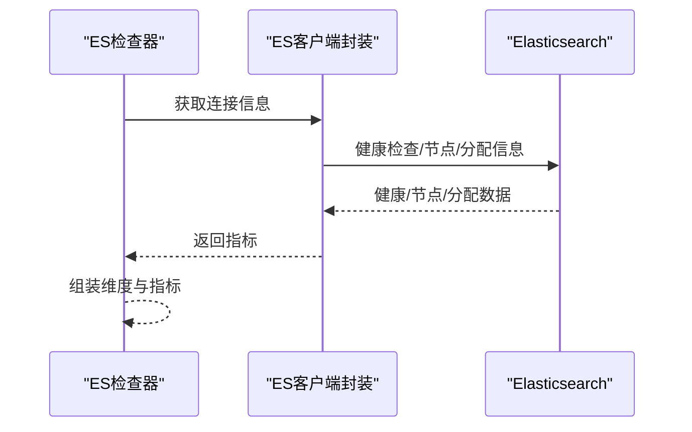

**图表来源**
- [apps/log_databus/handlers/check_collector/checker/es_checker.py](file://apps/log_databus/handlers/check_collector/checker/es_checker.py)
- [apps/log_measure/handlers/metric_collectors/cluster.py](file://apps/log_measure/handlers/metric_collectors/cluster.py)
- [apps/log_esquery/esquery/client/QueryClientEs.py](file://apps/log_esquery/esquery/client/QueryClientEs.py)

**章节来源**
- [apps/log_databus/handlers/check_collector/checker/es_checker.py](file://apps/log_databus/handlers/check_collector/checker/es_checker.py)
- [apps/log_measure/handlers/metric_collectors/cluster.py](file://apps/log_measure/handlers/metric_collectors/cluster.py)
- [apps/log_esquery/esquery/client/QueryClientEs.py](file://apps/log_esquery/esquery/client/QueryClientEs.py)

### Kafka 集群健康检查流程
- 连接与认证
  - 使用 Kafka 消费者封装进行连接与认证
- 主题读取
  - 读取主题最新若干条日志，验证链路可用性
- 异常处理
  - 分区不存在、连接失败等异常进行捕获与反馈

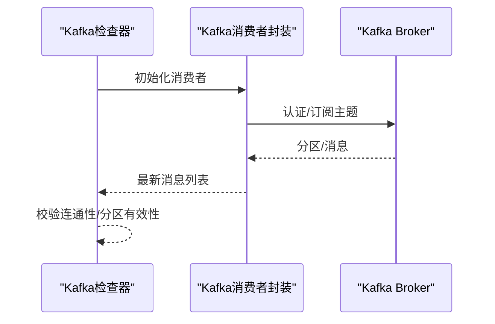

**图表来源**
- [apps/log_databus/handlers/check_collector/checker/kafka_checker.py](file://apps/log_databus/handlers/check_collector/checker/kafka_checker.py)
- [apps/log_databus/handlers/kafka.py](file://apps/log_databus/handlers/kafka.py)

**章节来源**
- [apps/log_databus/handlers/check_collector/checker/kafka_checker.py](file://apps/log_databus/handlers/check_collector/checker/kafka_checker.py)
- [apps/log_databus/handlers/kafka.py](file://apps/log_databus/handlers/kafka.py)

### Metadata 检查器与 Agent 检查器
- Metadata 检查器
  - 基于 Transfer API 的 Metadata 能力进行连通性与可用性检查
- Agent 检查器
  - 通过 Transfer API 检查 Agent 侧连通性与状态

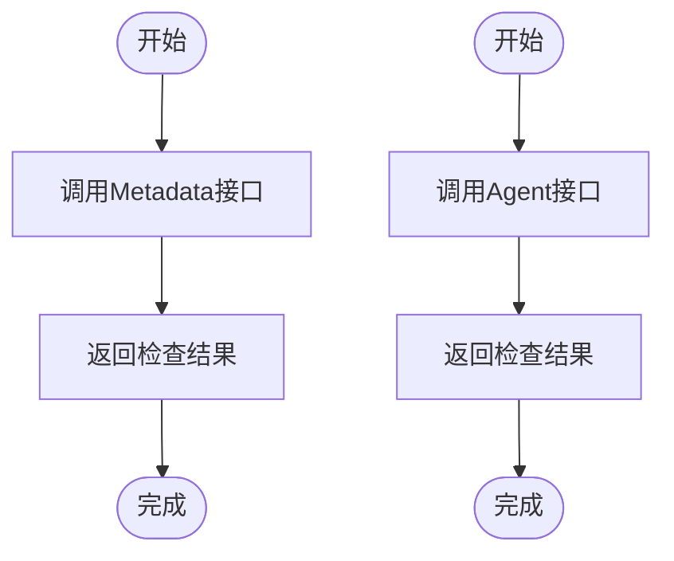

**图表来源**
- [apps/log_databus/handlers/check_collector/checker/metadata_checker.py](file://apps/log_databus/handlers/check_collector/checker/metadata_checker.py)
- [apps/log_databus/handlers/check_collector/checker/agent_checker.py](file://apps/log_databus/handlers/check_collector/checker/agent_checker.py)
- [apps/api/modules/transfer.py](file://apps/api/modules/transfer.py)

**章节来源**
- [apps/log_databus/handlers/check_collector/checker/metadata_checker.py](file://apps/log_databus/handlers/check_collector/checker/metadata_checker.py)
- [apps/log_databus/handlers/check_collector/checker/agent_checker.py](file://apps/log_databus/handlers/check_collector/checker/agent_checker.py)
- [apps/api/modules/transfer.py](file://apps/api/modules/transfer.py)

### 路由检查器与 Transfer 检查器
- 路由检查器
  - 通过 Transfer API 检查路由连通性与可用性
- Transfer 检查器
  - 对 Transfer 服务本身进行连通性与可用性检查

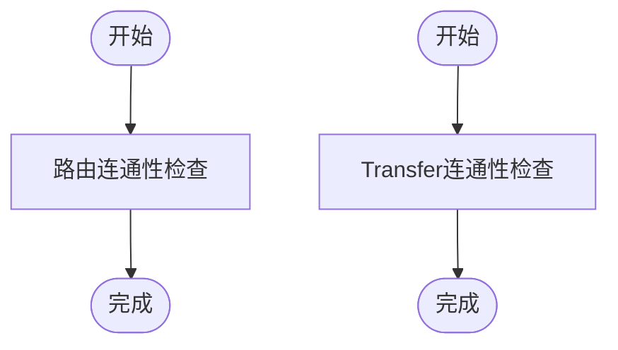

**图表来源**
- [apps/log_databus/handlers/check_collector/checker/route_checker.py](file://apps/log_databus/handlers/check_collector/checker/route_checker.py)
- [apps/log_databus/handlers/check_collector/checker/transfer_checker.py](file://apps/log_databus/handlers/check_collector/checker/transfer_checker.py)
- [apps/api/modules/transfer.py](file://apps/api/modules/transfer.py)

**章节来源**
- [apps/log_databus/handlers/check_collector/checker/route_checker.py](file://apps/log_databus/handlers/check_collector/checker/route_checker.py)
- [apps/log_databus/handlers/check_collector/checker/transfer_checker.py](file://apps/log_databus/handlers/check_collector/checker/transfer_checker.py)
- [apps/api/modules/transfer.py](file://apps/api/modules/transfer.py)

### 健康检查器聚合与基类
- 基类（BaseChecker）
  - 定义统一的检查器接口与通用能力
- 聚合器（Handler）
  - 统一调度各检查器，汇总检查结果并输出

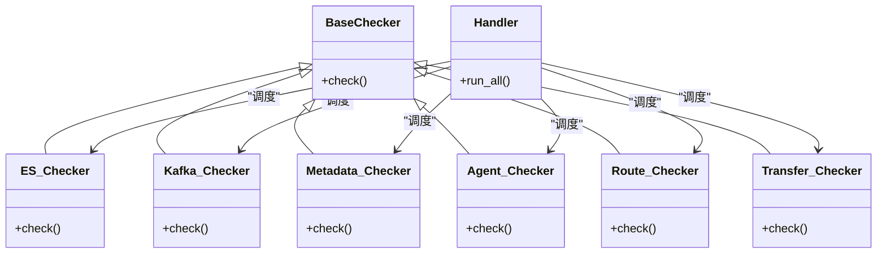

**图表来源**
- [apps/log_databus/handlers/check_collector/checker/base_checker.py](file://apps/log_databus/handlers/check_collector/checker/base_checker.py)
- [apps/log_databus/handlers/check_collector/checker/es_checker.py](file://apps/log_databus/handlers/check_collector/checker/es_checker.py)
- [apps/log_databus/handlers/check_collector/checker/kafka_checker.py](file://apps/log_databus/handlers/check_collector/checker/kafka_checker.py)
- [apps/log_databus/handlers/check_collector/checker/metadata_checker.py](file://apps/log_databus/handlers/check_collector/checker/metadata_checker.py)
- [apps/log_databus/handlers/check_collector/checker/agent_checker.py](file://apps/log_databus/handlers/check_collector/checker/agent_checker.py)
- [apps/log_databus/handlers/check_collector/checker/route_checker.py](file://apps/log_databus/handlers/check_collector/checker/route_checker.py)
- [apps/log_databus/handlers/check_collector/checker/transfer_checker.py](file://apps/log_databus/handlers/check_collector/checker/transfer_checker.py)
- [apps/log_databus/handlers/check_collector/handler.py](file://apps/log_databus/handlers/check_collector/handler.py)

**章节来源**
- [apps/log_databus/handlers/check_collector/checker/base_checker.py](file://apps/log_databus/handlers/check_collector/checker/base_checker.py)
- [apps/log_databus/handlers/check_collector/handler.py](file://apps/log_databus/handlers/check_collector/handler.py)

### 指标采集与监控
- 指标采集器
  - 采集 ES 集群健康度、节点分配与资源使用、CPU/内存/负载等指标，统一维度化上报
- 指标维度
  - 包含业务 ID/名称、集群 ID/名称、原始集群名、节点 IP/名称等

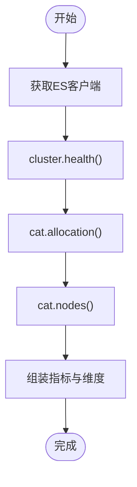

**图表来源**
- [apps/log_measure/handlers/metric_collectors/cluster.py](file://apps/log_measure/handlers/metric_collectors/cluster.py)

**章节来源**
- [apps/log_measure/handlers/metric_collectors/cluster.py](file://apps/log_measure/handlers/metric_collectors/cluster.py)

### 聚类告警与通知
- 告警策略
  - 基于智能检测算法生成日志聚类异常告警，支持触发窗口、恢复窗口、通知方式与升级策略
- 通知组
  - 自动创建或复用通知组，支持 RTX 等通知渠道

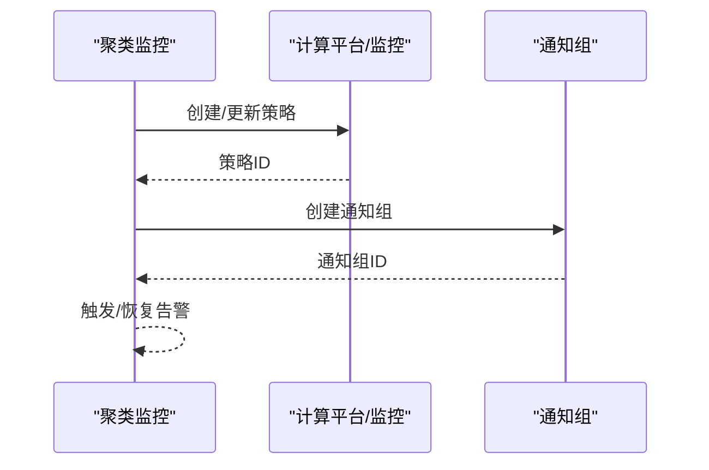

**图表来源**
- [apps/log_clustering/handlers/clustering_monitor.py](file://apps/log_clustering/handlers/clustering_monitor.py)
- [apps/log_clustering/constants.py](file://apps/log_clustering/constants.py)

**章节来源**
- [apps/log_clustering/handlers/clustering_monitor.py](file://apps/log_clustering/handlers/clustering_monitor.py)
- [apps/log_clustering/constants.py](file://apps/log_clustering/constants.py)

## 依赖关系分析
- 存储处理器依赖 Transfer API 获取/更新集群信息，并通过 ES 客户端封装与 Kafka 消费者封装进行健康检查与链路验证
- 指标采集器依赖 ES 客户端封装进行健康与节点指标采集
- 健康检查器聚合器统一调度各类检查器，检查结果用于运维决策
- 聚类告警策略依赖 Transfer API 拉取策略并生成告警通知

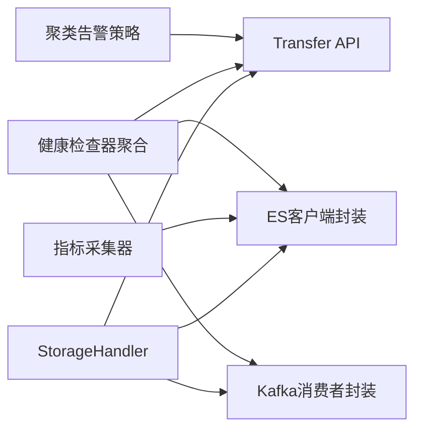

**图表来源**
- [apps/log_databus/handlers/storage.py](file://apps/log_databus/handlers/storage.py)
- [apps/log_esquery/esquery/client/QueryClientEs.py](file://apps/log_esquery/esquery/client/QueryClientEs.py)
- [apps/log_databus/handlers/kafka.py](file://apps/log_databus/handlers/kafka.py)
- [apps/log_measure/handlers/metric_collectors/cluster.py](file://apps/log_measure/handlers/metric_collectors/cluster.py)
- [apps/log_databus/handlers/check_collector/handler.py](file://apps/log_databus/handlers/check_collector/handler.py)
- [apps/log_clustering/handlers/clustering_monitor.py](file://apps/log_clustering/handlers/clustering_monitor.py)
- [apps/api/modules/transfer.py](file://apps/api/modules/transfer.py)

**章节来源**
- [apps/log_databus/handlers/storage.py](file://apps/log_databus/handlers/storage.py)
- [apps/log_measure/handlers/metric_collectors/cluster.py](file://apps/log_measure/handlers/metric_collectors/cluster.py)
- [apps/log_databus/handlers/check_collector/handler.py](file://apps/log_databus/handlers/check_collector/handler.py)
- [apps/log_clustering/handlers/clustering_monitor.py](file://apps/log_clustering/handlers/clustering_monitor.py)
- [apps/api/modules/transfer.py](file://apps/api/modules/transfer.py)

## 性能考量
- 并发与批处理
  - 批量拉取节点统计与集群统计，减少多次往返开销
- 缓存与超时
  - ES 客户端连接信息缓存与合理超时设置，避免频繁重建连接
- 指标采集频率
  - 不同指标设定不同采集周期，降低对 ES 的压力
- Kafka 消费
  - 控制拉取消息数量与超时时间，避免阻塞

[本节为通用指导，无需列出具体文件来源]

## 故障排查指南
- ES 集群健康检查失败
  - 检查 ES 客户端连接参数（主机、端口、用户名、密码、版本、协议），确认网络可达与证书配置
  - 查看健康指标采集日志，定位具体错误
- Kafka 链路异常
  - 检查安全协议与认证参数，确认主题存在且有分区
  - 查看消费者初始化与分区偏移设置
- Transfer 接口异常
  - 检查接口可用性与鉴权配置，确认结果表与 MQ 最新数据接口返回正常
- Agent/Metadata/路由/Transfer 检查失败
  - 逐项核对各检查器的连接参数与权限，结合日志定位失败原因
- 聚类告警未触发或误报
  - 检查策略配置（触发窗口、恢复窗口、通知方式），确认通知组配置正确

**章节来源**
- [apps/log_databus/handlers/check_collector/checker/es_checker.py](file://apps/log_databus/handlers/check_collector/checker/es_checker.py)
- [apps/log_databus/handlers/check_collector/checker/kafka_checker.py](file://apps/log_databus/handlers/check_collector/checker/kafka_checker.py)
- [apps/log_databus/handlers/check_collector/checker/metadata_checker.py](file://apps/log_databus/handlers/check_collector/checker/metadata_checker.py)
- [apps/log_databus/handlers/check_collector/checker/agent_checker.py](file://apps/log_databus/handlers/check_collector/checker/agent_checker.py)
- [apps/log_databus/handlers/check_collector/checker/route_checker.py](file://apps/log_databus/handlers/check_collector/checker/route_checker.py)
- [apps/log_databus/handlers/check_collector/checker/transfer_checker.py](file://apps/log_databus/handlers/check_collector/checker/transfer_checker.py)
- [apps/log_databus/handlers/check_collector/handler.py](file://apps/log_databus/handlers/check_collector/handler.py)
- [apps/log_clustering/handlers/clustering_monitor.py](file://apps/log_clustering/handlers/clustering_monitor.py)

## 结论
本系统通过存储处理器、ES/Kafka 客户端封装、健康检查器聚合与指标采集器，实现了对 Kafka、Transfer、ES 三大集群的全生命周期管理与可观测性保障。配合聚类告警策略，形成从“健康检查—指标采集—异常检测—告警通知”的闭环，满足生产环境的稳定性与可维护性需求。

[本节为总结性内容，无需列出具体文件来源]

## 附录
- 配置优化建议
  - ES：合理设置副本数与分片大小，启用热/温节点分层；定期清理索引与归档策略
  - Kafka：根据吞吐量调整分区数与副本，开启压缩与清理策略；确保消费者组与位点管理
  - Transfer：保持接口可用性与鉴权配置稳定，定期校验路由连通性
- 维护策略
  - 初始化：先创建集群并完成连通性测试，再启用采集与告警
  - 配置更新：变更前备份配置，灰度验证后滚动生效
  - 故障转移：在多副本/多分区前提下，优先隔离故障节点/分区，快速恢复
  - 负载均衡：通过路由与消费者组实现流量分摊，避免热点

[本节为通用指导，无需列出具体文件来源]