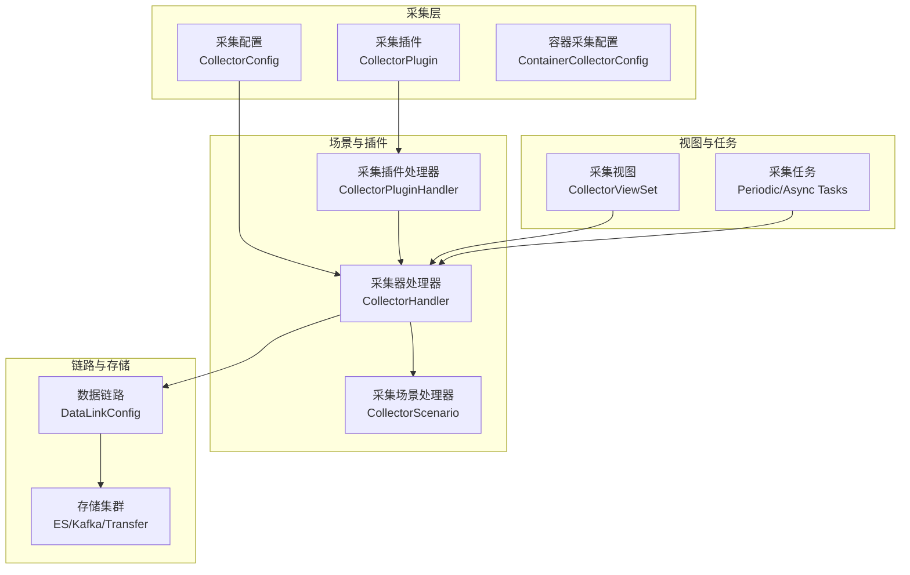
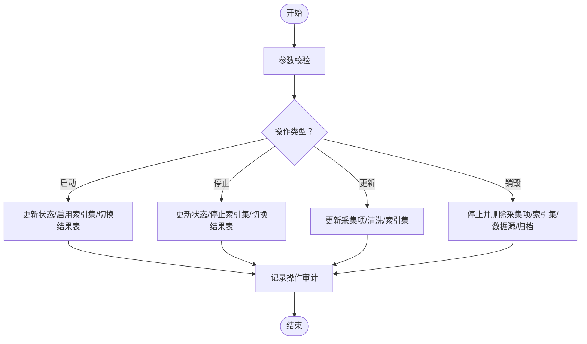
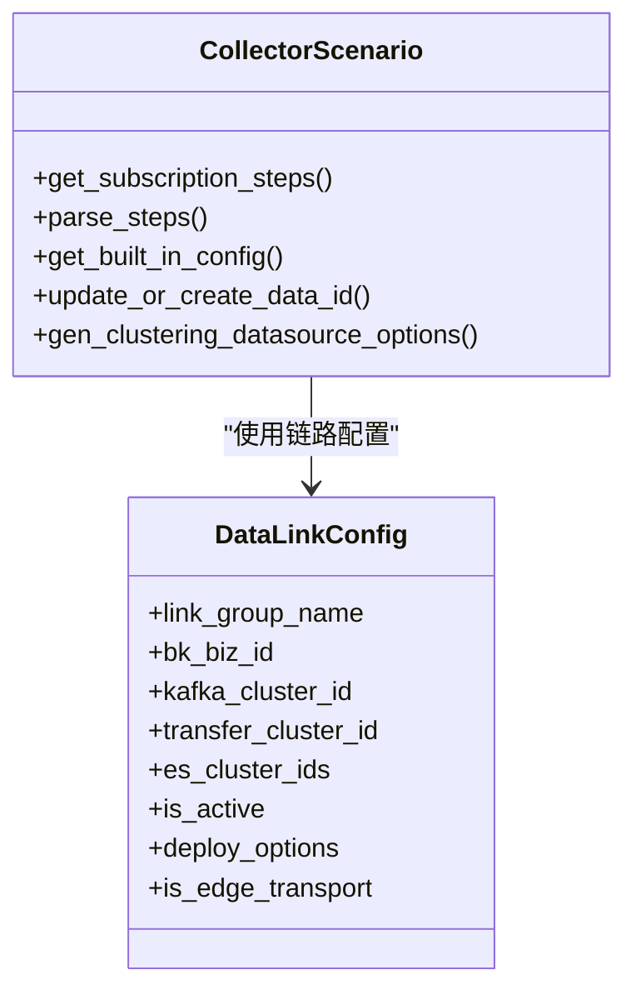
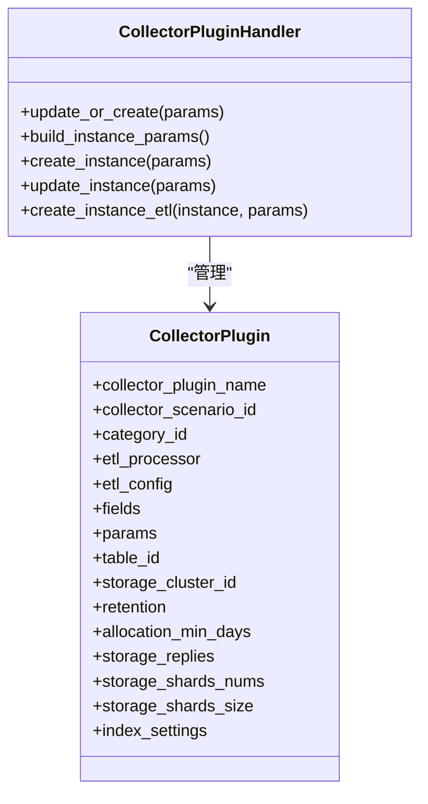
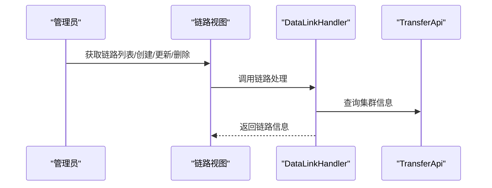
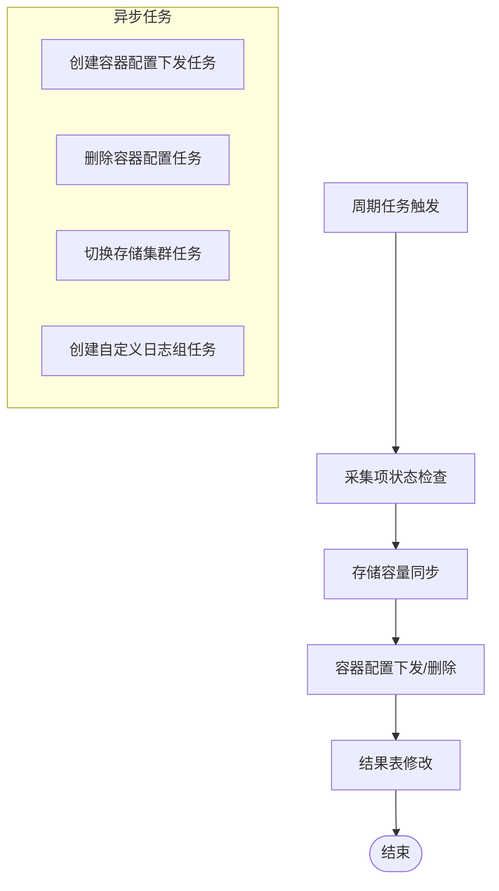
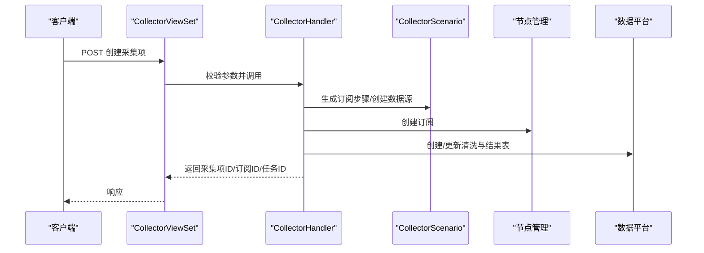
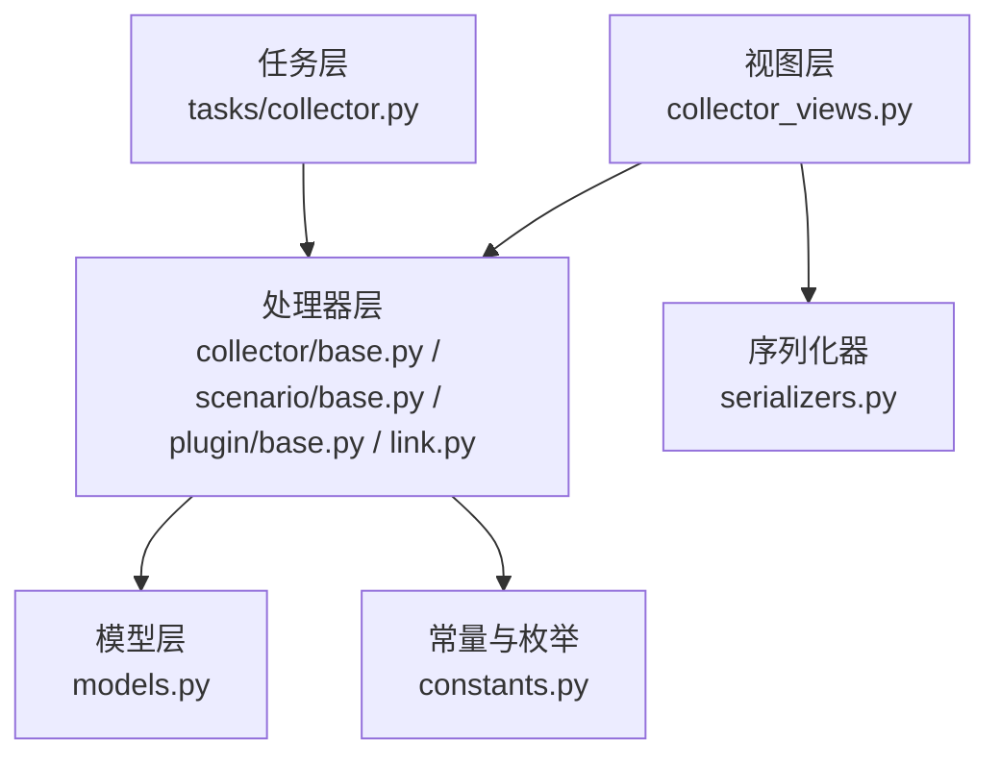

# 日志采集系统

<cite>
**本文引用的文件**
- [apps/log_databus/models.py](file://apps/log_databus/models.py)
- [apps/log_databus/constants.py](file://apps/log_databus/constants.py)
- [apps/log_databus/handlers/collector/base.py](file://apps/log_databus/handlers/collector/base.py)
- [apps/log_databus/handlers/collector_scenario/base.py](file://apps/log_databus/handlers/collector_scenario/base.py)
- [apps/log_databus/handlers/collector_plugin/base.py](file://apps/log_databus/handlers/collector_plugin/base.py)
- [apps/log_databus/views/collector_views.py](file://apps/log_databus/views/collector_views.py)
- [apps/log_databus/handlers/link.py](file://apps/log_databus/handlers/link.py)
- [apps/log_databus/tasks/collector.py](file://apps/log_databus/tasks/collector.py)
- [apps/log_databus/serializers.py](file://apps/log_databus/serializers.py)
</cite>

## 目录
1. [简介](#简介)
2. [项目结构](#项目结构)
3. [核心组件](#核心组件)
4. [架构总览](#架构总览)
5. [详细组件分析](#详细组件分析)
6. [依赖关系分析](#依赖关系分析)
7. [性能考虑](#性能考虑)
8. [故障排查指南](#故障排查指南)
9. [结论](#结论)
10. [附录](#附录)

## 简介
本技术文档面向日志采集系统，围绕采集器部署、数据链路管理、采集场景支持、采集配置创建与管理、采集插件体系、采集链路配置与监控、任务调度与异步处理、性能优化策略等方面进行全面阐述。文档旨在帮助开发者与运维工程师快速理解系统设计、掌握配置方法与排障流程，并提供最佳实践建议。

## 项目结构
日志采集系统主要位于 apps/log_databus 模块，围绕“采集配置”“采集插件”“采集场景”“数据链路”“ETL清洗”“容器采集”“任务调度”等维度组织代码。关键目录与文件如下：
- models.py：采集配置、插件、链路、清洗模板、归档与恢复等模型定义
- constants.py：采集相关枚举、常量与默认配置
- handlers/collector/base.py：采集器处理器基类与通用启停、检索、更新、销毁流程
- handlers/collector_scenario/base.py：采集场景抽象与订阅步骤生成、数据源创建/更新
- handlers/collector_plugin/base.py：采集插件处理器，负责插件与实例化
- handlers/link.py：数据链路配置的增删改查与集群列表获取
- views/collector_views.py：采集项的视图集合，提供创建、更新、启停、检索、任务状态等接口
- tasks/collector.py：周期性任务与异步任务，如采集项状态检查、存储容量同步、容器配置下发等
- serializers.py：采集项、链路、容器采集、ETL等序列化器



**图表来源**
- [apps/log_databus/models.py](file://apps/log_databus/models.py)
- [apps/log_databus/handlers/collector/base.py](file://apps/log_databus/handlers/collector/base.py)
- [apps/log_databus/handlers/collector_scenario/base.py](file://apps/log_databus/handlers/collector_scenario/base.py)
- [apps/log_databus/handlers/collector_plugin/base.py](file://apps/log_databus/handlers/collector_plugin/base.py)
- [apps/log_databus/handlers/link.py](file://apps/log_databus/handlers/link.py)
- [apps/log_databus/views/collector_views.py](file://apps/log_databus/views/collector_views.py)
- [apps/log_databus/tasks/collector.py](file://apps/log_databus/tasks/collector.py)

**章节来源**
- [apps/log_databus/models.py](file://apps/log_databus/models.py)
- [apps/log_databus/constants.py](file://apps/log_databus/constants.py)
- [apps/log_databus/handlers/collector/base.py](file://apps/log_databus/handlers/collector/base.py)
- [apps/log_databus/handlers/collector_scenario/base.py](file://apps/log_databus/handlers/collector_scenario/base.py)
- [apps/log_databus/handlers/collector_plugin/base.py](file://apps/log_databus/handlers/collector_plugin/base.py)
- [apps/log_databus/handlers/link.py](file://apps/log_databus/handlers/link.py)
- [apps/log_databus/views/collector_views.py](file://apps/log_databus/views/collector_views.py)
- [apps/log_databus/tasks/collector.py](file://apps/log_databus/tasks/collector.py)
- [apps/log_databus/serializers.py](file://apps/log_databus/serializers.py)

## 核心组件
- 采集配置（CollectorConfig）：承载采集项的元数据、目标节点、清洗配置、结果表、链路信息、容器配置等
- 采集插件（CollectorPlugin）：定义插件行为、清洗规则、存储策略、可见性等，支持实例化为采集项
- 采集场景（CollectorScenario）：封装不同采集场景的订阅步骤、数据源创建/更新、边缘传输参数等
- 数据链路（DataLinkConfig）：定义Kafka、Transfer、ES集群组合，支持业务隔离与公共链路
- 采集器处理器（CollectorHandler）：统一的采集项启停、检索、更新、销毁流程
- 采集插件处理器（CollectorPluginHandler）：插件创建/更新、实例化、独立清洗/存储配置
- 视图（CollectorViewSet）：提供采集项的CRUD、任务状态、订阅状态、链路列表等接口
- 任务（tasks/collector.py）：周期性检查采集项状态、同步存储容量、容器配置下发/删除、结果表修改等

**章节来源**
- [apps/log_databus/models.py](file://apps/log_databus/models.py)
- [apps/log_databus/handlers/collector/base.py](file://apps/log_databus/handlers/collector/base.py)
- [apps/log_databus/handlers/collector_scenario/base.py](file://apps/log_databus/handlers/collector_scenario/base.py)
- [apps/log_databus/handlers/collector_plugin/base.py](file://apps/log_databus/handlers/collector_plugin/base.py)
- [apps/log_databus/handlers/link.py](file://apps/log_databus/handlers/link.py)
- [apps/log_databus/views/collector_views.py](file://apps/log_databus/views/collector_views.py)
- [apps/log_databus/tasks/collector.py](file://apps/log_databus/tasks/collector.py)

## 架构总览
系统采用“视图-处理器-模型”的分层架构，采集配置与插件通过处理器抽象统一行为；采集场景通过订阅步骤与数据源对接节点管理与数据平台；数据链路统一管理Kafka/Transfer/ES集群组合；任务层负责周期性维护与异步下发。

```mermaid
sequenceDiagram
participant Client as "客户端"
participant View as "采集视图<br/>CollectorViewSet"
participant Handler as "采集处理器<br/>CollectorHandler"
participant Scenario as "采集场景<br/>CollectorScenario"
participant Link as "数据链路<br/>DataLinkConfig"
participant Node as "节点管理"
participant Transfer as "数据平台"
Client->>View : 创建/更新/启停/检索 采集项
View->>Handler : 参数校验与调用
Handler->>Scenario : 生成订阅步骤/更新数据源
Scenario->>Link : 读取链路配置
Handler->>Node : 创建/更新订阅
Handler->>Transfer : 创建/更新数据源/结果表
Handler-->>View : 返回处理结果
View-->>Client : 响应
```

**图表来源**
- [apps/log_databus/views/collector_views.py](file://apps/log_databus/views/collector_views.py)
- [apps/log_databus/handlers/collector/base.py](file://apps/log_databus/handlers/collector/base.py)
- [apps/log_databus/handlers/collector_scenario/base.py](file://apps/log_databus/handlers/collector_scenario/base.py)
- [apps/log_databus/handlers/link.py](file://apps/log_databus/handlers/link.py)

## 详细组件分析

### 采集配置与采集器处理器
- 采集配置（CollectorConfig）：包含采集场景、目标节点、清洗配置、结果表、链路信息、容器配置、环境标识等字段
- 采集器处理器（CollectorHandler）：提供启动/停止/检索/更新/销毁等统一流程；支持并发获取数据源、结果表、订阅信息；支持容器配置编码与字段字典构建
- 关键流程
  - 启动：更新采集项状态、启用索引集、切换结果表、记录操作审计
  - 停止：更新采集项状态、停止索引集、切换结果表、记录操作审计
  - 检索：按顺序执行补全链路（ITSM、默认字段、切分规则、目标、分类、ETL、节点管理订阅、字段为空处理、时间时区转换、容器配置、YAML编码）
  - 更新：支持名称、描述、清洗参数、字段、存储集群等更新，必要时创建/更新清洗与索引集



**图表来源**
- [apps/log_databus/handlers/collector/base.py](file://apps/log_databus/handlers/collector/base.py)

**章节来源**
- [apps/log_databus/models.py](file://apps/log_databus/models.py)
- [apps/log_databus/handlers/collector/base.py](file://apps/log_databus/handlers/collector/base.py)

### 采集场景与数据链路
- 采集场景（CollectorScenario）：抽象不同采集场景（行日志、段日志、Windows事件、Syslog、Kafka、自定义等），提供订阅步骤生成、数据源创建/更新、边缘传输参数注入、标签与扩展元数据注入等
- 数据链路（DataLinkConfig）：定义Kafka集群、Transfer集群、ES集群集合，支持业务隔离与公共链路优先级展示；提供链路创建/更新/删除与集群列表查询



**图表来源**
- [apps/log_databus/handlers/collector_scenario/base.py](file://apps/log_databus/handlers/collector_scenario/base.py)
- [apps/log_databus/handlers/link.py](file://apps/log_databus/handlers/link.py)

**章节来源**
- [apps/log_databus/handlers/collector_scenario/base.py](file://apps/log_databus/handlers/collector_scenario/base.py)
- [apps/log_databus/handlers/link.py](file://apps/log_databus/handlers/link.py)

### 采集插件系统
- 采集插件（CollectorPlugin）：定义插件的清洗规则、存储策略、可见性、是否允许独立DATAID/ETL/存储等
- 采集插件处理器（CollectorPluginHandler）：负责插件创建/更新、实例化为采集项、独立清洗/存储配置、参数补全与构建



**图表来源**
- [apps/log_databus/models.py](file://apps/log_databus/models.py)
- [apps/log_databus/handlers/collector_plugin/base.py](file://apps/log_databus/handlers/collector_plugin/base.py)

**章节来源**
- [apps/log_databus/models.py](file://apps/log_databus/models.py)
- [apps/log_databus/handlers/collector_plugin/base.py](file://apps/log_databus/handlers/collector_plugin/base.py)

### 采集链路配置与管理
- 链路列表：支持业务独立链路优先于公共链路展示
- 链路创建/更新：校验名称唯一性、编辑限制（Kafka/Transfer/ES变更限制）、租户隔离
- 集群列表：支持获取Transfer/Kafka/ES集群列表，过滤公共集群



**图表来源**
- [apps/log_databus/handlers/link.py](file://apps/log_databus/handlers/link.py)

**章节来源**
- [apps/log_databus/handlers/link.py](file://apps/log_databus/handlers/link.py)

### 采集任务调度与异步处理
- 周期性任务
  - 采集项状态检查：24小时未入库自动停止
  - 存储容量同步：每小时批量同步各集群已用容量与索引数量
  - 容器配置下发/删除：异步任务，支持重试与状态更新
  - 结果表修改：异步任务，批量更新结果表配置
- 异步任务
  - 容器采集配置下发：创建CR/BKLogConfig，更新状态
  - 存储集群切换：批量更新采集项存储配置
  - 自定义日志组创建：为OTLP日志创建Log Group



**图表来源**
- [apps/log_databus/tasks/collector.py](file://apps/log_databus/tasks/collector.py)

**章节来源**
- [apps/log_databus/tasks/collector.py](file://apps/log_databus/tasks/collector.py)

### 采集配置创建与管理流程
- 创建采集项：校验场景参数、目标节点、字符集、链路ID等；生成订阅步骤、创建数据源、创建/更新清洗、创建索引集
- 更新采集项：支持名称、描述、目标节点、字符集、清洗参数、字段、存储集群等更新
- 启停采集项：更新采集项状态、启用/停止索引集、切换结果表
- 销毁采集项：重命名采集项、停止、删除容器配置、删除索引集、删除数据源、删除归档



**图表来源**
- [apps/log_databus/views/collector_views.py](file://apps/log_databus/views/collector_views.py)
- [apps/log_databus/handlers/collector/base.py](file://apps/log_databus/handlers/collector/base.py)
- [apps/log_databus/handlers/collector_scenario/base.py](file://apps/log_databus/handlers/collector_scenario/base.py)

**章节来源**
- [apps/log_databus/views/collector_views.py](file://apps/log_databus/views/collector_views.py)
- [apps/log_databus/handlers/collector/base.py](file://apps/log_databus/handlers/collector/base.py)
- [apps/log_databus/serializers.py](file://apps/log_databus/serializers.py)

## 依赖关系分析
- 模型层（models.py）：定义采集配置、插件、链路、清洗模板、归档与恢复等核心实体
- 处理器层：采集器处理器依赖采集场景与链路配置；采集场景依赖TransferApi与节点管理；插件处理器依赖采集器处理器与链路配置
- 视图层：CollectorViewSet依赖序列化器与处理器，提供REST接口
- 任务层：tasks/collector.py依赖采集器处理器、TransferApi、节点管理与ES路由



**图表来源**
- [apps/log_databus/models.py](file://apps/log_databus/models.py)
- [apps/log_databus/constants.py](file://apps/log_databus/constants.py)
- [apps/log_databus/views/collector_views.py](file://apps/log_databus/views/collector_views.py)
- [apps/log_databus/handlers/collector/base.py](file://apps/log_databus/handlers/collector/base.py)
- [apps/log_databus/handlers/collector_scenario/base.py](file://apps/log_databus/handlers/collector_scenario/base.py)
- [apps/log_databus/handlers/collector_plugin/base.py](file://apps/log_databus/handlers/collector_plugin/base.py)
- [apps/log_databus/handlers/link.py](file://apps/log_databus/handlers/link.py)
- [apps/log_databus/tasks/collector.py](file://apps/log_databus/tasks/collector.py)
- [apps/log_databus/serializers.py](file://apps/log_databus/serializers.py)

**章节来源**
- [apps/log_databus/models.py](file://apps/log_databus/models.py)
- [apps/log_databus/constants.py](file://apps/log_databus/constants.py)
- [apps/log_databus/views/collector_views.py](file://apps/log_databus/views/collector_views.py)
- [apps/log_databus/handlers/collector/base.py](file://apps/log_databus/handlers/collector/base.py)
- [apps/log_databus/handlers/collector_scenario/base.py](file://apps/log_databus/handlers/collector_scenario/base.py)
- [apps/log_databus/handlers/collector_plugin/base.py](file://apps/log_databus/handlers/collector_plugin/base.py)
- [apps/log_databus/handlers/link.py](file://apps/log_databus/handlers/link.py)
- [apps/log_databus/tasks/collector.py](file://apps/log_databus/tasks/collector.py)
- [apps/log_databus/serializers.py](file://apps/log_databus/serializers.py)

## 性能考虑
- 批量查询与缓存
  - 并发获取数据源、结果表、订阅信息，减少多次远程调用
  - 批量获取集群信息，按分片拆分请求，失败重试
- 存储容量同步
  - 每小时批量同步，避免频繁查询ES集群
  - 批量创建/更新StorageUsed，降低数据库压力
- 采集项状态检查
  - 24小时未入库自动停止，避免无效资源占用
- 容器配置下发
  - 异步任务+重试机制，确保配置下发可靠性

**章节来源**
- [apps/log_databus/handlers/collector/base.py](file://apps/log_databus/handlers/collector/base.py)
- [apps/log_databus/tasks/collector.py](file://apps/log_databus/tasks/collector.py)

## 故障排查指南
- 采集项状态异常
  - 检查采集项是否24小时未入库导致自动停止
  - 核对订阅ID与节点管理状态，确认采集器进程与配置
- 数据链路问题
  - 校验链路是否激活、Kafka/Transfer/ES集群是否可用
  - 边缘存查链路需检查Kafka输出参数与SSL配置
- 清洗与结果表
  - 确认清洗配置与字段是否正确，结果表是否启用
  - 如需修改存储配置，使用异步任务批量更新
- 容器采集
  - 校验容器配置下发任务状态，确认CR/BKLogConfig创建与删除流程
  - 检查Pod标签/注解选择器与命名空间配置

**章节来源**
- [apps/log_databus/tasks/collector.py](file://apps/log_databus/tasks/collector.py)
- [apps/log_databus/handlers/collector_scenario/base.py](file://apps/log_databus/handlers/collector_scenario/base.py)

## 结论
日志采集系统通过清晰的分层架构与统一的处理器抽象，实现了采集配置、插件、场景、链路与任务的协同工作。系统提供了完善的采集项生命周期管理、灵活的数据链路配置、可靠的容器采集能力与高效的异步任务调度。遵循本文的最佳实践与排障流程，可显著提升系统的稳定性与可维护性。

## 附录
- 实际配置示例与最佳实践
  - 采集场景参数：行日志、段日志、Windows事件、Syslog、Kafka、自定义等
  - 数据链路配置：Kafka集群、Transfer集群、ES集群组合，支持业务隔离
  - 清洗配置：直接入库、JSON、分隔符、正则、自定义等
  - 容器采集：命名空间、标签/注解选择器、容器名称、日志路径、字符集等
  - 序列化器校验：路径排除、分隔符过滤、容器配置互斥、YAML编码校验等

**章节来源**
- [apps/log_databus/serializers.py](file://apps/log_databus/serializers.py)
- [apps/log_databus/handlers/collector_scenario/base.py](file://apps/log_databus/handlers/collector_scenario/base.py)
- [apps/log_databus/handlers/link.py](file://apps/log_databus/handlers/link.py)