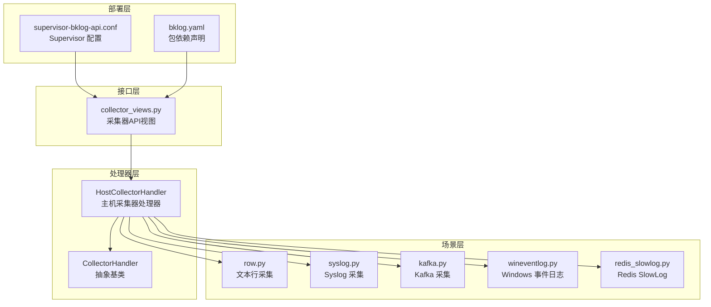
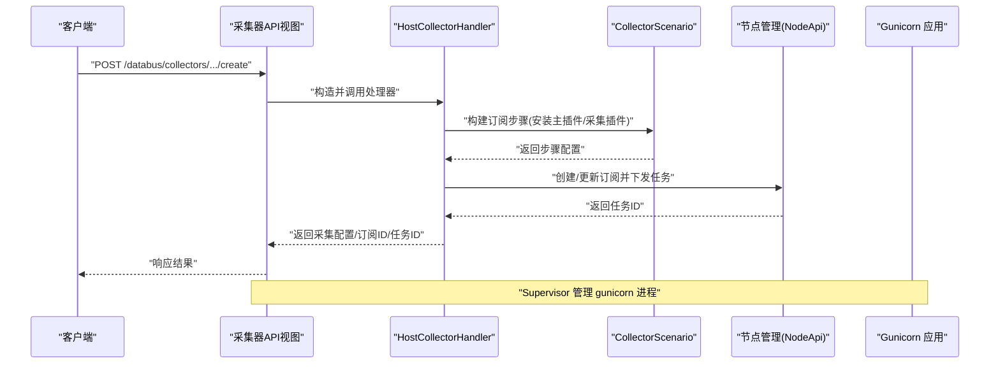
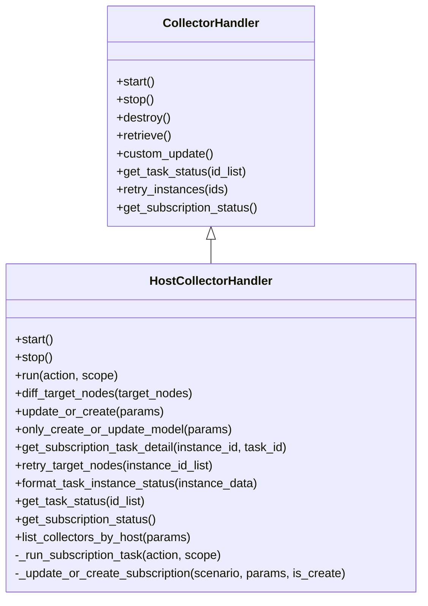
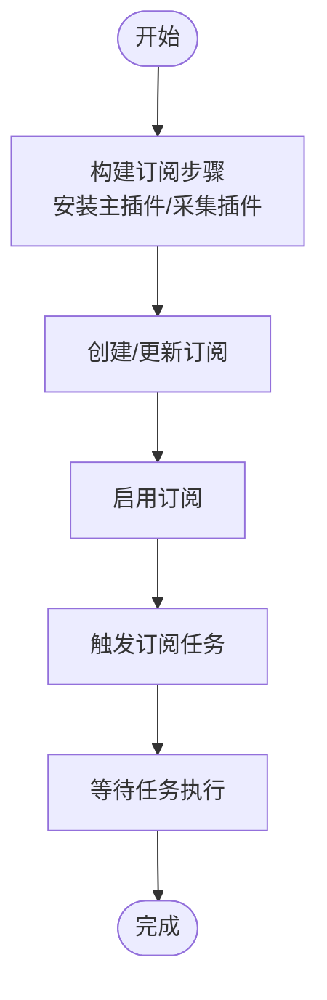
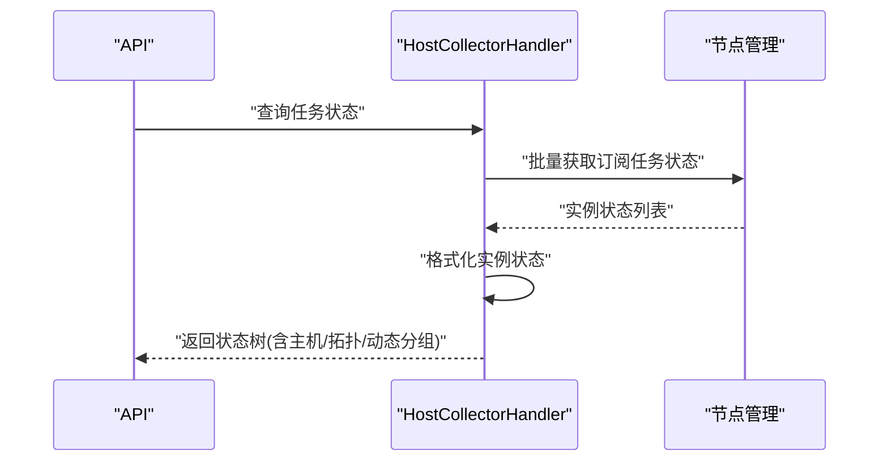
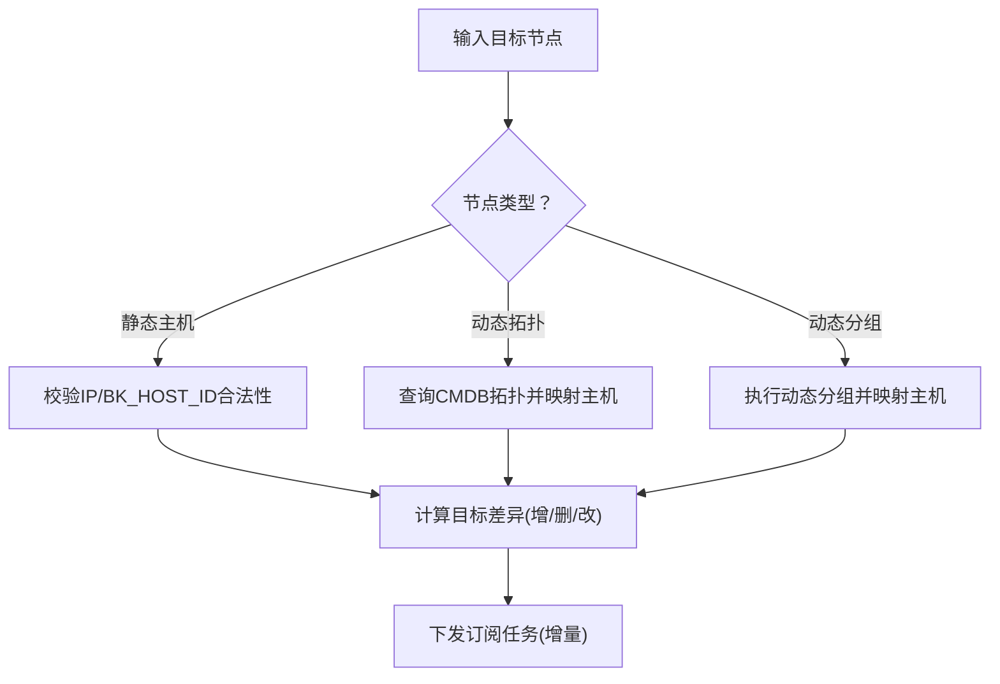
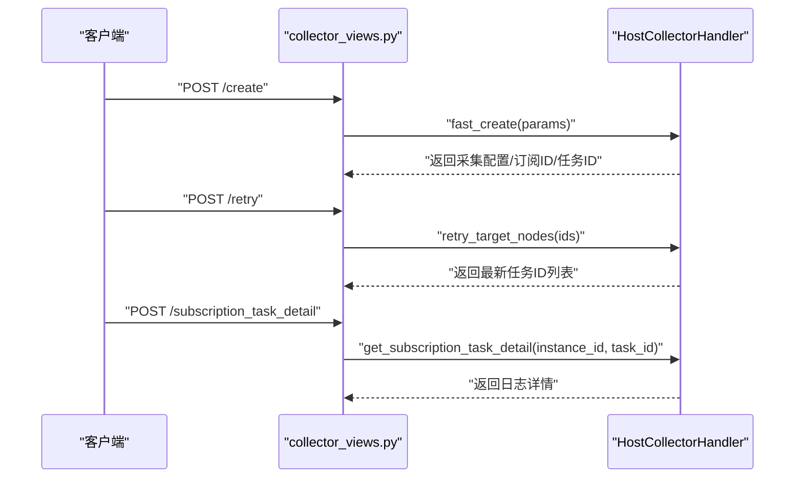
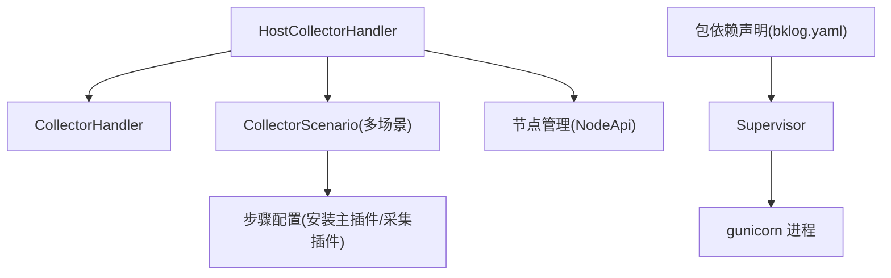

# 主机采集器部署

<cite>
**本文引用的文件**
- [apps/log_databus/handlers/collector/host.py](file://apps/log_databus/handlers/collector/host.py)
- [apps/log_databus/handlers/collector/base.py](file://apps/log_databus/handlers/collector/base.py)
- [apps/log_databus/handlers/collector/__init__.py](file://apps/log_databus/handlers/collector/__init__.py)
- [apps/log_databus/views/collector_views.py](file://apps/log_databus/views/collector_views.py)
- [apps/log_databus/handlers/collector_scenario/base.py](file://apps/log_databus/handlers/collector_scenario/base.py)
- [apps/log_databus/handlers/collector_scenario/row.py](file://apps/log_databus/handlers/collector_scenario/row.py)
- [apps/log_databus/handlers/collector_scenario/syslog.py](file://apps/log_databus/handlers/collector_scenario/syslog.py)
- [apps/log_databus/handlers/collector_scenario/kafka.py](file://apps/log_databus/handlers/collector_scenario/kafka.py)
- [apps/log_databus/handlers/collector_scenario/wineventlog.py](file://apps/log_databus/handlers/collector_scenario/wineventlog.py)
- [apps/log_databus/handlers/collector_scenario/redis_slowlog.py](file://apps/log_databus/handlers/collector_scenario/redis_slowlog.py)
- [apps/log_databus/handlers/collector_handler/log.py](file://apps/log_databus/handlers/collector_handler/log.py)
- [support-files/templates/#etc#supervisor-bklog-api.conf](file://support-files/templates/#etc#supervisor-bklog-api.conf)
- [support-files/bkpkgs/bklog.yaml](file://support-files/bkpkgs/bklog.yaml)
- [home_application/management/commands/migrate_tool.py](file://home_application/management/commands/migrate_tool.py)
</cite>

## 目录
1. [简介](#简介)
2. [项目结构](#项目结构)
3. [核心组件](#核心组件)
4. [架构总览](#架构总览)
5. [详细组件分析](#详细组件分析)
6. [依赖分析](#依赖分析)
7. [性能考虑](#性能考虑)
8. [故障排查指南](#故障排查指南)
9. [结论](#结论)
10. [附录](#附录)

## 简介
本文面向“主机采集器”的部署与运维，围绕 HostCollectorHandler 的核心机制、安装流程、状态管理、目标节点管理、最佳实践与排障方法展开，帮助读者快速理解并稳定部署主机采集器。

## 项目结构
主机采集器能力由“采集器处理器 + 场景化采集方案 + 节点管理订阅 + API 接口”协同实现，关键文件分布如下：
- 处理器层：HostCollectorHandler、CollectorHandler 抽象基类
- 场景层：多种采集场景（如 row、syslog、kafka、wineventlog、redis_slowlog）的订阅步骤构建
- 接口层：采集器相关 API，负责接收请求并调用处理器
- 部署层：Supervisor 配置、包依赖声明

图表来源
- [apps/log_databus/handlers/collector/base.py](file://apps/log_databus/handlers/collector/base.py)
- [apps/log_databus/handlers/collector/host.py](file://apps/log_databus/handlers/collector/host.py)
- [apps/log_databus/handlers/collector_scenario/row.py](file://apps/log_databus/handlers/collector_scenario/row.py)
- [apps/log_databus/handlers/collector_scenario/syslog.py](file://apps/log_databus/handlers/collector_scenario/syslog.py)
- [apps/log_databus/handlers/collector_scenario/kafka.py](file://apps/log_databus/handlers/collector_scenario/kafka.py)
- [apps/log_databus/handlers/collector_scenario/wineventlog.py](file://apps/log_databus/handlers/collector_scenario/wineventlog.py)
- [apps/log_databus/handlers/collector_scenario/redis_slowlog.py](file://apps/log_databus/handlers/collector_scenario/redis_slowlog.py)
- [apps/log_databus/views/collector_views.py](file://apps/log_databus/views/collector_views.py)
- [support-files/templates/#etc#supervisor-bklog-api.conf](file://support-files/templates/#etc#supervisor-bklog-api.conf)
- [support-files/bkpkgs/bklog.yaml](file://support-files/bkpkgs/bklog.yaml)

章节来源
- [apps/log_databus/handlers/collector/__init__.py](file://apps/log_databus/handlers/collector/__init__.py)
- [apps/log_databus/handlers/collector/base.py](file://apps/log_databus/handlers/collector/base.py)
- [apps/log_databus/handlers/collector/host.py](file://apps/log_databus/handlers/collector/host.py)

## 核心组件
- HostCollectorHandler：主机采集器处理器，负责创建/更新采集配置、触发节点管理订阅、查询任务与订阅状态、重试实例、校验非法 IP、生成订阅差异等。
- CollectorHandler：采集器处理器抽象基类，统一生命周期（start/stop/destroy）、元数据补全、并发查询、数据链路与结果表切换等。
- 采集场景：通过 CollectorScenario 构建订阅步骤（如安装主插件、安装采集插件、配置模板），不同场景覆盖文本行、Syslog、Kafka、Windows 事件日志、Redis SlowLog 等。
- API 层：提供创建、更新、只更新、重试、任务详情等接口，内部委派 HostCollectorHandler 完成具体逻辑。

章节来源
- [apps/log_databus/handlers/collector/base.py](file://apps/log_databus/handlers/collector/base.py)
- [apps/log_databus/handlers/collector/host.py](file://apps/log_databus/handlers/collector/host.py)
- [apps/log_databus/handlers/collector_scenario/base.py](file://apps/log_databus/handlers/collector_scenario/base.py)
- [apps/log_databus/views/collector_views.py](file://apps/log_databus/views/collector_views.py)

## 架构总览
主机采集器部署架构围绕“采集器处理器 + 节点管理订阅 + 场景化步骤 + API 调度 + Supervisor 运行时”构成闭环。

图表来源
- [apps/log_databus/views/collector_views.py](file://apps/log_databus/views/collector_views.py)
- [apps/log_databus/handlers/collector/host.py](file://apps/log_databus/handlers/collector/host.py)
- [apps/log_databus/handlers/collector_scenario/base.py](file://apps/log_databus/handlers/collector_scenario/base.py)

## 详细组件分析

### HostCollectorHandler 核心机制
- 生命周期管理：start/stop/destroy，分别启用/停用采集项、索引集、结果表；销毁时重命名并清理订阅与索引集。
- 订阅控制：通过节点管理开关订阅（启用/禁用），触发订阅任务（START/STOP/INSTALL/UNINSTALL），支持按 scope 限定节点范围。
- 任务与订阅状态：查询订阅任务状态、聚合实例状态、格式化输出；支持按主机实例过滤、按拓扑/动态分组映射主机集合。
- 目标节点管理：支持静态主机节点（IP/BK_HOST_ID）与动态拓扑/动态分组；计算目标节点差异（增删改），用于订阅增量下发。
- 非法 IP 校验：针对静态主机节点，校验越权 IP，防止跨业务访问。
- 快速创建/更新：自动补齐存储集群、数据链路 ID，创建或更新索引集与清洗配置，异步创建数据平台 data_id。

图表来源
- [apps/log_databus/handlers/collector/base.py](file://apps/log_databus/handlers/collector/base.py)
- [apps/log_databus/handlers/collector/host.py](file://apps/log_databus/handlers/collector/host.py)

章节来源
- [apps/log_databus/handlers/collector/host.py](file://apps/log_databus/handlers/collector/host.py)
- [apps/log_databus/handlers/collector/base.py](file://apps/log_databus/handlers/collector/base.py)

### 安装流程（Agent 安装、配置生成、服务启动）
- Agent 安装与插件下发：通过节点管理订阅步骤，先安装主插件，再安装采集插件并下发配置模板，最终触发采集任务。
- 配置生成：场景化采集方案根据采集参数生成步骤与上下文参数，写入订阅配置。
- 服务启动：Supervisor 管理 gunicorn 进程，应用通过 WSGI 启动，API 接收请求并调用处理器完成订阅下发。

图表来源
- [apps/log_databus/handlers/collector/host.py](file://apps/log_databus/handlers/collector/host.py)
- [apps/log_databus/handlers/collector_scenario/base.py](file://apps/log_databus/handlers/collector_scenario/base.py)
- [support-files/templates/#etc#supervisor-bklog-api.conf](file://support-files/templates/#etc#supervisor-bklog-api.conf)

章节来源
- [apps/log_databus/handlers/collector/host.py](file://apps/log_databus/handlers/collector/host.py)
- [apps/log_databus/handlers/collector_scenario/row.py](file://apps/log_databus/handlers/collector_scenario/row.py)
- [apps/log_databus/handlers/collector_scenario/syslog.py](file://apps/log_databus/handlers/collector_scenario/syslog.py)
- [apps/log_databus/handlers/collector_scenario/kafka.py](file://apps/log_databus/handlers/collector_scenario/kafka.py)
- [apps/log_databus/handlers/collector_scenario/wineventlog.py](file://apps/log_databus/handlers/collector_scenario/wineventlog.py)
- [apps/log_databus/handlers/collector_scenario/redis_slowlog.py](file://apps/log_databus/handlers/collector_scenario/redis_slowlog.py)
- [support-files/templates/#etc#supervisor-bklog-api.conf](file://support-files/templates/#etc#supervisor-bklog-api.conf)

### 状态管理（部署状态检查、心跳监测、故障检测）
- 任务状态：通过节点管理批量查询订阅任务状态，格式化为实例状态列表，按主机维度输出。
- 订阅状态：查询插件运行状态，汇总各主机插件版本、状态、时间等信息。
- 故障检测：日志详情中若某步骤非成功状态，即视为失败，便于前端展示与定位。
- 心跳监测：通过订阅任务状态聚合与插件状态查询实现，结合任务 ID 列表跟踪执行进度。

图表来源
- [apps/log_databus/handlers/collector/host.py](file://apps/log_databus/handlers/collector/host.py)

章节来源
- [apps/log_databus/handlers/collector/host.py](file://apps/log_databus/handlers/collector/host.py)

### 目标节点管理（静态主机节点、动态拓扑节点）
- 静态主机节点：支持 IP 与 BK_HOST_ID，校验非法越权 IP；支持按主机过滤任务状态。
- 动态拓扑节点：基于 CMDB 拓扑查询主机集合，支持模板映射（服务模板/集群模板）。
- 动态分组节点：通过执行动态分组获取主机集合，支持动态分组名称映射。
- 目标差异：计算新增/删除/修改节点，用于增量下发订阅任务。

图表来源
- [apps/log_databus/handlers/collector/host.py](file://apps/log_databus/handlers/collector/host.py)

章节来源
- [apps/log_databus/handlers/collector/host.py](file://apps/log_databus/handlers/collector/host.py)

### API 工作流（创建/更新/重试/任务详情）
- 创建：FastCollectorCreateSerializer 校验参数，HostCollectorHandler.fast_create 完成模型创建、订阅创建与下发、索引集与清洗配置创建。
- 更新：FastCollectorUpdateSerializer 校验参数，HostCollectorHandler.fast_update 完成模型更新、订阅更新与下发。
- 重试：HostCollectorHandler.retry_target_nodes 调用节点管理重试任务，并记录任务 ID。
- 任务详情：HostCollectorHandler.get_subscription_task_detail 拉取节点管理任务详情并格式化日志。

图表来源
- [apps/log_databus/views/collector_views.py](file://apps/log_databus/views/collector_views.py)
- [apps/log_databus/handlers/collector/host.py](file://apps/log_databus/handlers/collector/host.py)

章节来源
- [apps/log_databus/views/collector_views.py](file://apps/log_databus/views/collector_views.py)
- [apps/log_databus/handlers/collector/host.py](file://apps/log_databus/handlers/collector/host.py)

## 依赖分析
- 处理器依赖：HostCollectorHandler 继承 CollectorHandler，复用生命周期与元数据补全；依赖节点管理 API 进行订阅创建/更新/任务下发；依赖采集场景方案生成步骤。
- 场景依赖：各场景模块（row/syslog/kafka/wineventlog/redis_slowlog）提供步骤构建与参数解析。
- 运行时依赖：Supervisor 管理 gunicorn，WSGI 启动应用；包依赖声明确保权限与平台组件可用。

图表来源
- [apps/log_databus/handlers/collector/host.py](file://apps/log_databus/handlers/collector/host.py)
- [apps/log_databus/handlers/collector_scenario/base.py](file://apps/log_databus/handlers/collector_scenario/base.py)
- [support-files/templates/#etc#supervisor-bklog-api.conf](file://support-files/templates/#etc#supervisor-bklog-api.conf)
- [support-files/bkpkgs/bklog.yaml](file://support-files/bkpkgs/bklog.yaml)

章节来源
- [apps/log_databus/handlers/collector/host.py](file://apps/log_databus/handlers/collector/host.py)
- [apps/log_databus/handlers/collector_scenario/base.py](file://apps/log_databus/handlers/collector_scenario/base.py)
- [support-files/bkpkgs/bklog.yaml](file://support-files/bkpkgs/bklog.yaml)

## 性能考虑
- 并发查询：通过 MultiExecuteFunc 并发获取数据源、结果表、存储集群等信息，降低延迟。
- 批量请求：节点管理批量查询任务状态、插件状态，减少接口往返。
- 缓存与重试：批量集群信息接口具备分片与重试策略，提升稳定性。
- 清洗与索引：合理设置 ES 分片大小与保留策略，避免索引膨胀。

章节来源
- [apps/log_databus/handlers/collector/base.py](file://apps/log_databus/handlers/collector/base.py)

## 故障排查指南
- 任务失败定位：通过任务详情接口获取步骤日志，定位失败节点与错误信息。
- 非法 IP 校验：若静态主机节点包含非法 IP 或越权主机 ID，将抛出异常，需修正目标节点。
- 订阅状态异常：若订阅信息缺失或不可用，将抛出订阅信息未找到异常，需检查订阅创建与节点管理状态。
- 重试机制：使用重试接口对失败实例进行重试，并记录最新任务 ID 列表。
- 迁移与兼容：通过迁移工具将旧采集项迁移到新处理器，确保场景参数正确解析。

章节来源
- [apps/log_databus/handlers/collector/host.py](file://apps/log_databus/handlers/collector/host.py)
- [apps/log_databus/handlers/collector_handler/log.py](file://apps/log_databus/handlers/collector_handler/log.py)
- [home_application/management/commands/migrate_tool.py](file://home_application/management/commands/migrate_tool.py)

## 结论
主机采集器通过 HostCollectorHandler 统一编排采集生命周期，依托节点管理订阅实现插件安装与配置下发，配合多种采集场景满足多样化采集需求。结合 Supervisor 运行时与完善的 API 接口，可实现稳定、可观测、可扩展的主机日志采集部署。

## 附录
- 部署脚本示例（路径参考）
  - Supervisor 配置：[support-files/templates/#etc#supervisor-bklog-api.conf](file://support-files/templates/#etc#supervisor-bklog-api.conf)
  - 包依赖声明：[support-files/bkpkgs/bklog.yaml](file://support-files/bkpkgs/bklog.yaml)
- API 示例（路径参考）
  - 创建/更新/只更新/重试/任务详情：[apps/log_databus/views/collector_views.py](file://apps/log_databus/views/collector_views.py)
- 场景化采集（路径参考）
  - 文本行采集：[apps/log_databus/handlers/collector_scenario/row.py](file://apps/log_databus/handlers/collector_scenario/row.py)
  - Syslog 采集：[apps/log_databus/handlers/collector_scenario/syslog.py](file://apps/log_databus/handlers/collector_scenario/syslog.py)
  - Kafka 采集：[apps/log_databus/handlers/collector_scenario/kafka.py](file://apps/log_databus/handlers/collector_scenario/kafka.py)
  - Windows 事件日志：[apps/log_databus/handlers/collector_scenario/wineventlog.py](file://apps/log_databus/handlers/collector_scenario/wineventlog.py)
  - Redis SlowLog：[apps/log_databus/handlers/collector_scenario/redis_slowlog.py](file://apps/log_databus/handlers/collector_scenario/redis_slowlog.py)