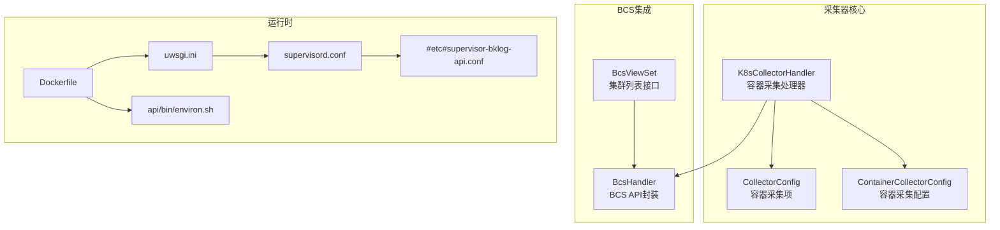
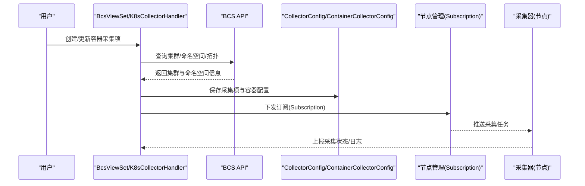
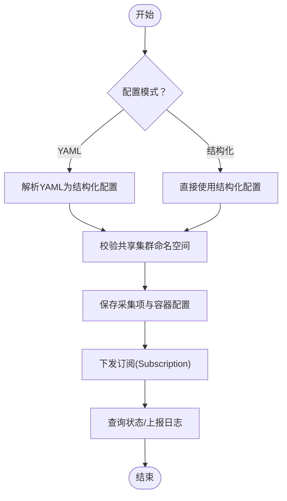
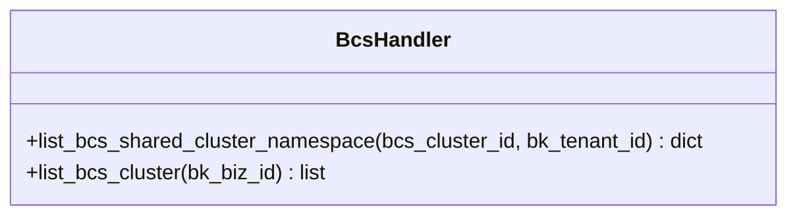
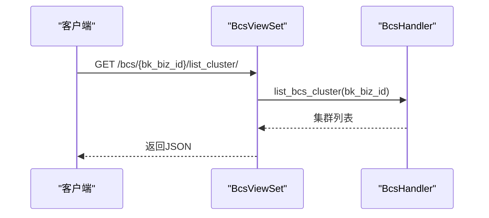
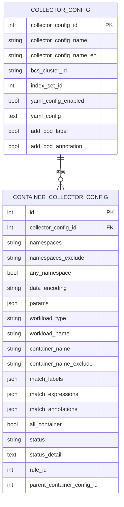
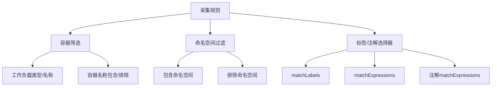
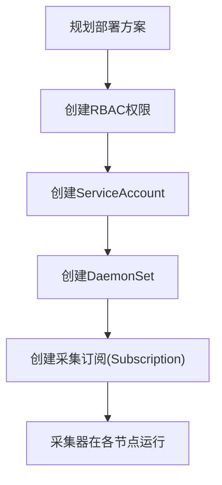
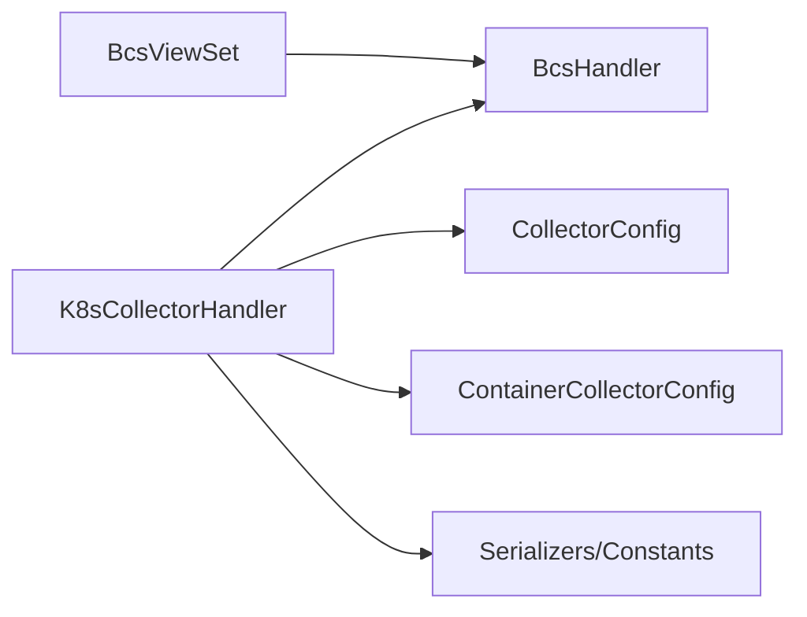

# 容器采集器部署

<cite>
**本文引用的文件**
- [apps/log_databus/handlers/collector/k8s.py](file://apps/log_databus/handlers/collector/k8s.py)
- [apps/log_bcs/handlers/bcs_handler.py](file://apps/log_bcs/handlers/bcs_handler.py)
- [apps/log_bcs/views/bcs_views.py](file://apps/log_bcs/views/bcs_views.py)
- [apps/log_databus/models.py](file://apps/log_databus/models.py)
- [apps/log_databus/constants.py](file://apps/log_databus/constants.py)
- [apps/log_databus/serializers.py](file://apps/log_databus/serializers.py)
- [apps/log_databus/views/collector_views.py](file://apps/log_databus/views/collector_views.py)
- [support-files/templates/#etc#supervisor-bklog-api.conf](file://support-files/templates/#etc#supervisor-bklog-api.conf)
- [support-files/templates/api#bin#environ.sh](file://support-files/templates/api#bin#environ.sh)
- [support-files/supervisord.conf](file://support-files/supervisord.conf)
- [support-files/uwsgi.ini](file://support-files/uwsgi.ini)
- [Dockerfile](file://Dockerfile)
- [README.md](file://README.md)
</cite>

## 目录
1. [简介](#简介)
2. [项目结构](#项目结构)
3. [核心组件](#核心组件)
4. [架构总览](#架构总览)
5. [详细组件分析](#详细组件分析)
6. [依赖分析](#依赖分析)
7. [性能考虑](#性能考虑)
8. [故障排查指南](#故障排查指南)
9. [结论](#结论)
10. [附录](#附录)

## 简介
本技术文档面向容器采集器在Kubernetes环境中的部署与运维，聚焦于以下目标：
- 解释容器采集器在Kubernetes下的部署架构与实现原理
- 说明与BCS（蓝鲸容器服务）的集成机制（集群信息获取、命名空间管理、Pod监控等）
- 详述配置管理（采集规则、标签选择器、命名空间过滤等）
- 给出部署流程（DaemonSet部署、RBAC权限配置、ServiceAccount创建等）
- 提供监控与维护指南（日志收集、健康检查、故障恢复）
- 总结最佳实践与安全配置建议

## 项目结构
围绕容器采集器的关键模块与文件如下：
- 采集器核心处理器：K8sCollectorHandler（负责容器采集配置的创建、更新、下发与状态查询）
- BCS集成层：BcsHandler（封装BCS API，提供集群与命名空间查询）
- 视图接口：BcsViewSet、collector_views（提供集群列表、命名空间、拓扑、采集器启停等接口）
- 数据模型：CollectorConfig、ContainerCollectorConfig（采集项与容器采集配置持久化）
- 序列化器与常量：serializers、constants（采集规则、标签选择器、容器采集类型等）
- 部署与运行时模板：Dockerfile、uwsgi.ini、supervisord.conf、supervisor配置模板

**图表来源**
- [apps/log_databus/handlers/collector/k8s.py:112-227](file://apps/log_databus/handlers/collector/k8s.py#L112-L227)
- [apps/log_bcs/handlers/bcs_handler.py:26-72](file://apps/log_bcs/handlers/bcs_handler.py#L26-L72)
- [apps/log_bcs/views/bcs_views.py:27-63](file://apps/log_bcs/views/bcs_views.py#L27-L63)
- [apps/log_databus/models.py:102-200](file://apps/log_databus/models.py#L102-L200)
- [support-files/supervisord.conf](file://support-files/supervisord.conf)
- [support-files/templates/#etc#supervisor-bklog-api.conf](file://support-files/templates/#etc#supervisor-bklog-api.conf)
- [support-files/templates/api#bin#environ.sh](file://support-files/templates/api#bin#environ.sh)
- [support-files/uwsgi.ini](file://support-files/uwsgi.ini)
- [Dockerfile](file://Dockerfile)

**章节来源**
- [apps/log_databus/handlers/collector/k8s.py:112-227](file://apps/log_databus/handlers/collector/k8s.py#L112-L227)
- [apps/log_bcs/handlers/bcs_handler.py:26-72](file://apps/log_bcs/handlers/bcs_handler.py#L26-L72)
- [apps/log_bcs/views/bcs_views.py:27-63](file://apps/log_bcs/views/bcs_views.py#L27-L63)
- [apps/log_databus/models.py:102-200](file://apps/log_databus/models.py#L102-L200)
- [support-files/supervisord.conf](file://support-files/supervisord.conf)
- [support-files/templates/#etc#supervisor-bklog-api.conf](file://support-files/templates/#etc#supervisor-bklog-api.conf)
- [support-files/templates/api#bin#environ.sh](file://support-files/templates/api#bin#environ.sh)
- [support-files/uwsgi.ini](file://support-files/uwsgi.ini)
- [Dockerfile](file://Dockerfile)

## 核心组件
- K8sCollectorHandler：容器采集器的核心处理器，负责容器采集项的创建、更新、下发、状态查询、重试、启停等；支持YAML配置模式与结构化配置模式；提供集群与命名空间校验、拓扑查询、标签提取等能力。
- BcsHandler：封装BCS API，提供业务维度的集群列表查询、共享集群命名空间映射等能力。
- BcsViewSet：提供前端调用的集群列表接口。
- CollectorConfig/ContainerCollectorConfig：采集项与容器采集配置的数据库模型，承载采集规则、命名空间过滤、标签选择器、容器筛选等配置。
- serializers/constants：定义容器采集类型、标签选择器运算符、容器采集配置序列化与校验规则。

**章节来源**
- [apps/log_databus/handlers/collector/k8s.py:112-227](file://apps/log_databus/handlers/collector/k8s.py#L112-L227)
- [apps/log_bcs/handlers/bcs_handler.py:26-72](file://apps/log_bcs/handlers/bcs_handler.py#L26-L72)
- [apps/log_bcs/views/bcs_views.py:27-63](file://apps/log_bcs/views/bcs_views.py#L27-L63)
- [apps/log_databus/models.py:102-200](file://apps/log_databus/models.py#L102-L200)
- [apps/log_databus/serializers.py:34-66](file://apps/log_databus/serializers.py#L34-L66)
- [apps/log_databus/constants.py:24-50](file://apps/log_databus/constants.py#L24-L50)

## 架构总览
容器采集器在Kubernetes环境中的工作流：
- 通过BCS API获取集群与命名空间信息
- 用户在前端创建容器采集项，选择集群、命名空间、标签/注解选择器、容器筛选等
- 后端将采集规则转换为容器采集配置，支持YAML或结构化两种模式
- 将配置下发至节点管理（Subscription），由采集器在各节点拉起容器采集任务
- 采集器上报日志至数据平台，经清洗与入库

**图表来源**
- [apps/log_bcs/views/bcs_views.py:31-62](file://apps/log_bcs/views/bcs_views.py#L31-L62)
- [apps/log_databus/handlers/collector/k8s.py:220-290](file://apps/log_databus/handlers/collector/k8s.py#L220-L290)
- [apps/log_databus/models.py:102-200](file://apps/log_databus/models.py#L102-L200)

**章节来源**
- [apps/log_bcs/views/bcs_views.py:31-62](file://apps/log_bcs/views/bcs_views.py#L31-L62)
- [apps/log_databus/handlers/collector/k8s.py:220-290](file://apps/log_databus/handlers/collector/k8s.py#L220-L290)
- [apps/log_databus/models.py:102-200](file://apps/log_databus/models.py#L102-L200)

## 详细组件分析

### K8sCollectorHandler 组件分析
职责与能力：
- 容器采集项生命周期管理：创建、更新、删除、重试、启停
- 配置模式支持：YAML模式与结构化模式互转
- 集群与命名空间校验：共享集群命名空间白名单校验
- 拓扑与标签：节点/Pod标签提取、拓扑树构建
- 状态查询：采集任务状态、订阅状态

关键流程示意：

**图表来源**
- [apps/log_databus/handlers/collector/k8s.py:257-336](file://apps/log_databus/handlers/collector/k8s.py#L257-L336)
- [apps/log_databus/handlers/collector/k8s.py:461-471](file://apps/log_databus/handlers/collector/k8s.py#L461-L471)
- [apps/log_databus/handlers/collector/k8s.py:1545-1608](file://apps/log_databus/handlers/collector/k8s.py#L1545-L1608)

**章节来源**
- [apps/log_databus/handlers/collector/k8s.py:257-336](file://apps/log_databus/handlers/collector/k8s.py#L257-L336)
- [apps/log_databus/handlers/collector/k8s.py:461-471](file://apps/log_databus/handlers/collector/k8s.py#L461-L471)
- [apps/log_databus/handlers/collector/k8s.py:1545-1608](file://apps/log_databus/handlers/collector/k8s.py#L1545-L1608)

### BcsHandler 组件分析
职责与能力：
- 根据业务空间类型（BKCC/BCS/BKCI）调用BCS API获取集群列表
- 共享集群命名空间映射（项目ID到命名空间列表）

**图表来源**
- [apps/log_bcs/handlers/bcs_handler.py:26-72](file://apps/log_bcs/handlers/bcs_handler.py#L26-L72)

**章节来源**
- [apps/log_bcs/handlers/bcs_handler.py:26-72](file://apps/log_bcs/handlers/bcs_handler.py#L26-L72)

### BcsViewSet 组件分析
职责与能力：
- 对外提供业务维度的BCS集群列表查询接口

**图表来源**
- [apps/log_bcs/views/bcs_views.py:31-62](file://apps/log_bcs/views/bcs_views.py#L31-L62)
- [apps/log_bcs/handlers/bcs_handler.py:37-71](file://apps/log_bcs/handlers/bcs_handler.py#L37-L71)

**章节来源**
- [apps/log_bcs/views/bcs_views.py:31-62](file://apps/log_bcs/views/bcs_views.py#L31-L62)
- [apps/log_bcs/handlers/bcs_handler.py:37-71](file://apps/log_bcs/handlers/bcs_handler.py#L37-L71)

### 数据模型与序列化
- CollectorConfig：容器采集项元数据（集群ID、索引集、YAML配置开关等）
- ContainerCollectorConfig：容器采集配置（命名空间、容器筛选、标签/注解选择器、编码等）
- 序列化器与常量：定义容器采集类型、标签选择器运算符、容器采集配置校验规则

**图表来源**
- [apps/log_databus/models.py:102-200](file://apps/log_databus/models.py#L102-L200)
- [apps/log_databus/models.py:413-470](file://apps/log_databus/models.py#L413-L470)

**章节来源**
- [apps/log_databus/models.py:102-200](file://apps/log_databus/models.py#L102-L200)
- [apps/log_databus/models.py:413-470](file://apps/log_databus/models.py#L413-L470)
- [apps/log_databus/serializers.py:34-66](file://apps/log_databus/serializers.py#L34-L66)
- [apps/log_databus/constants.py:24-50](file://apps/log_databus/constants.py#L24-L50)

### 配置管理详解
- 采集规则配置：支持路径采集与标准采集（STDOUT）两类
- 标签选择器：支持matchLabels与matchExpressions
- 注解选择器：支持matchExpressions
- 命名空间过滤：支持包含与排除
- 容器筛选：工作负载类型/名称、容器名称包含/排除
- YAML配置模式：启用后以YAML形式下发原始配置

**图表来源**
- [apps/log_databus/handlers/collector/k8s.py:338-408](file://apps/log_databus/handlers/collector/k8s.py#L338-L408)
- [apps/log_databus/handlers/collector/k8s.py:409-459](file://apps/log_databus/handlers/collector/k8s.py#L409-L459)

**章节来源**
- [apps/log_databus/handlers/collector/k8s.py:338-408](file://apps/log_databus/handlers/collector/k8s.py#L338-L408)
- [apps/log_databus/handlers/collector/k8s.py:409-459](file://apps/log_databus/handlers/collector/k8s.py#L409-L459)

### 部署流程（DaemonSet/RBAC/ServiceAccount）
- DaemonSet部署：在Kubernetes集群中以DaemonSet方式部署采集器，确保每个节点运行一个采集器实例
- RBAC权限：授予采集器访问核心资源（Node、Pod、Namespace）的只读权限
- ServiceAccount：为采集器绑定ServiceAccount，便于在受限环境中运行
- 订阅下发：通过节点管理（Subscription）将采集任务推送到各节点

[本图为概念性流程，不直接映射具体源码文件]

## 依赖分析
- K8sCollectorHandler 依赖 BcsHandler 进行集群与命名空间查询
- BcsViewSet 依赖 BcsHandler 提供集群列表
- 采集项与容器配置模型之间存在一对多关系
- 序列化器与常量为采集配置提供校验与规范

**图表来源**
- [apps/log_databus/handlers/collector/k8s.py:112-227](file://apps/log_databus/handlers/collector/k8s.py#L112-L227)
- [apps/log_bcs/handlers/bcs_handler.py:26-72](file://apps/log_bcs/handlers/bcs_handler.py#L26-L72)
- [apps/log_bcs/views/bcs_views.py:27-63](file://apps/log_bcs/views/bcs_views.py#L27-L63)
- [apps/log_databus/models.py:102-200](file://apps/log_databus/models.py#L102-L200)

**章节来源**
- [apps/log_databus/handlers/collector/k8s.py:112-227](file://apps/log_databus/handlers/collector/k8s.py#L112-L227)
- [apps/log_bcs/handlers/bcs_handler.py:26-72](file://apps/log_bcs/handlers/bcs_handler.py#L26-L72)
- [apps/log_bcs/views/bcs_views.py:27-63](file://apps/log_bcs/views/bcs_views.py#L27-L63)
- [apps/log_databus/models.py:102-200](file://apps/log_databus/models.py#L102-L200)

## 性能考虑
- 采集粒度控制：通过命名空间与容器筛选降低采集范围，避免全集群扫描
- 标签/注解选择器：合理使用matchExpressions，避免过于宽泛的匹配导致过多Pod被纳入
- YAML模式：在大规模场景下，建议使用YAML模式以减少后端序列化与下发开销
- 订阅并发：根据节点数量与采集压力调整订阅并发度，避免节点过载

[本节为通用指导，不直接分析具体文件]

## 故障排查指南
常见问题与定位思路：
- 集群/命名空间不可见：确认业务空间类型与BCS集群映射是否正确
- 共享集群命名空间校验失败：检查命名空间白名单与实际命名空间一致性
- 采集任务状态异常：通过采集项状态接口查询子任务状态详情
- 缺少命名空间：在Pod级别采集时必须提供命名空间
- YAML解析错误：检查YAML格式与结构化字段映射

**章节来源**
- [apps/log_databus/handlers/collector/k8s.py:693-704](file://apps/log_databus/handlers/collector/k8s.py#L693-L704)
- [apps/log_databus/handlers/collector/k8s.py:1952-1970](file://apps/log_databus/handlers/collector/k8s.py#L1952-L1970)
- [apps/log_databus/handlers/collector/k8s.py:2160-2196](file://apps/log_databus/handlers/collector/k8s.py#L2160-L2196)

## 结论
容器采集器通过K8sCollectorHandler与BCS集成，实现了在Kubernetes环境中的灵活、可控的日志采集。依托命名空间与标签/注解选择器，可在共享集群与独享集群中精确限定采集范围；通过YAML与结构化配置模式，满足不同场景的配置需求。配合完善的接口与状态查询能力，可实现高效的部署、监控与维护。

## 附录

### API定义（采集器相关）
- 获取BCS集群列表
  - 方法：GET
  - 路径：/bcs/{bk_biz_id}/list_cluster/
  - 请求参数：bk_biz_id（业务ID）
  - 返回：集群列表（包含项目ID、集群ID、环境、状态等）
- 获取命名空间列表
  - 方法：GET
  - 路径：/log_databus/collector/list_namespace/
  - 请求参数：bcs_cluster_id、bk_biz_id
  - 返回：命名空间列表
- 获取拓扑树
  - 方法：GET
  - 路径：/log_databus/collector/list_topo/
  - 请求参数：type（节点/容器）、bk_biz_id、bcs_cluster_id、namespace
  - 返回：拓扑树结构
- 重启/删除/启动/停止容器采集器
  - 方法：POST/DELETE
  - 路径：/log_databus/collector/{collector_config_id}/retry_bcs_collector
  - 路径：/log_databus/collector/{collector_config_id}/delete_bcs_collector
  - 路径：/log_databus/collector/{collector_config_id}/start_bcs_collector
  - 路径：/log_databus/collector/{collector_config_id}/stop_bcs_collector

**章节来源**
- [apps/log_bcs/views/bcs_views.py:31-62](file://apps/log_bcs/views/bcs_views.py#L31-L62)
- [apps/log_databus/views/collector_views.py:2160-2212](file://apps/log_databus/views/collector_views.py#L2160-L2212)

### 部署与运行时参考
- Docker镜像构建：Dockerfile
- Web服务器：uwsgi.ini
- 进程管理：supervisord.conf、#etc#supervisor-bklog-api.conf
- 环境变量脚本：api/bin/environ.sh
- 项目说明：README.md

**章节来源**
- [Dockerfile](file://Dockerfile)
- [support-files/uwsgi.ini](file://support-files/uwsgi.ini)
- [support-files/supervisord.conf](file://support-files/supervisord.conf)
- [support-files/templates/#etc#supervisor-bklog-api.conf](file://support-files/templates/#etc#supervisor-bklog-api.conf)
- [support-files/templates/api#bin#environ.sh](file://support-files/templates/api#bin#environ.sh)
- [README.md](file://README.md)