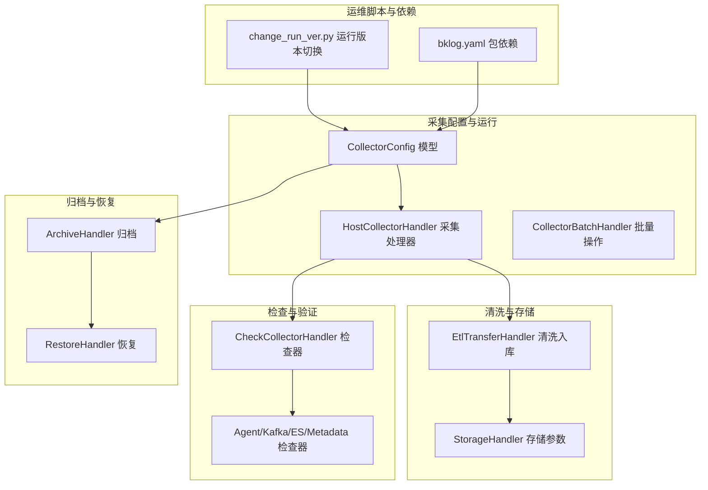
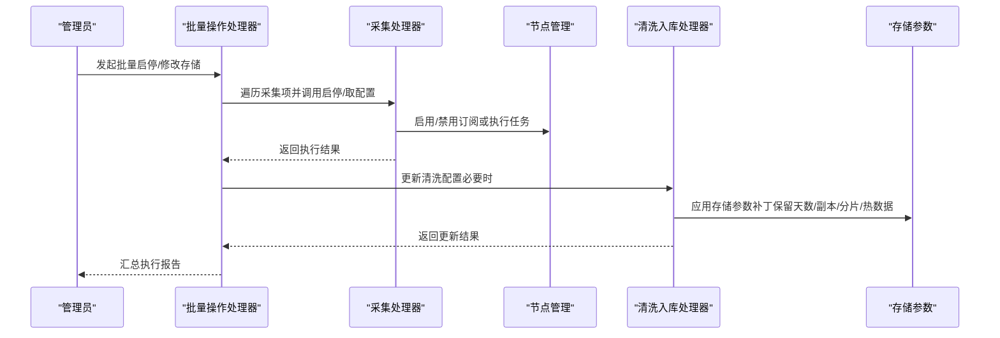
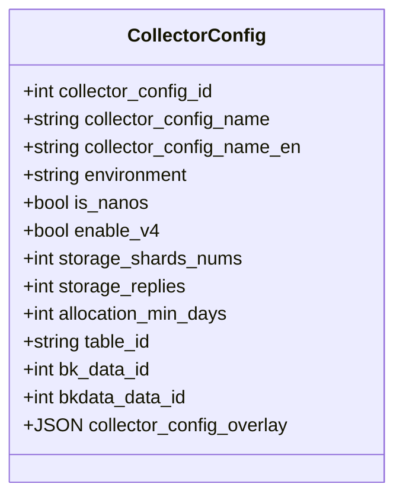
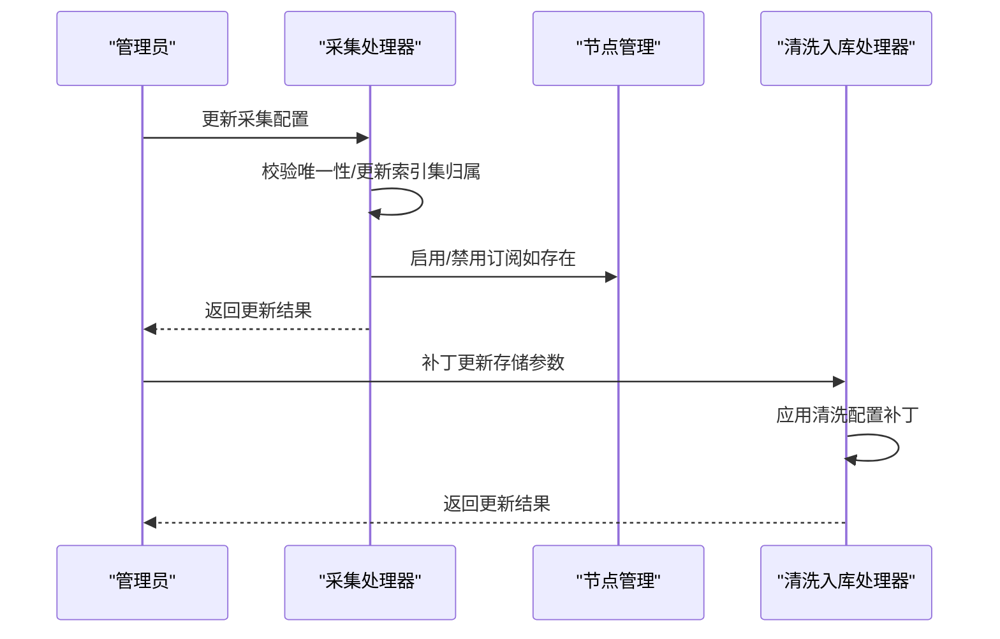
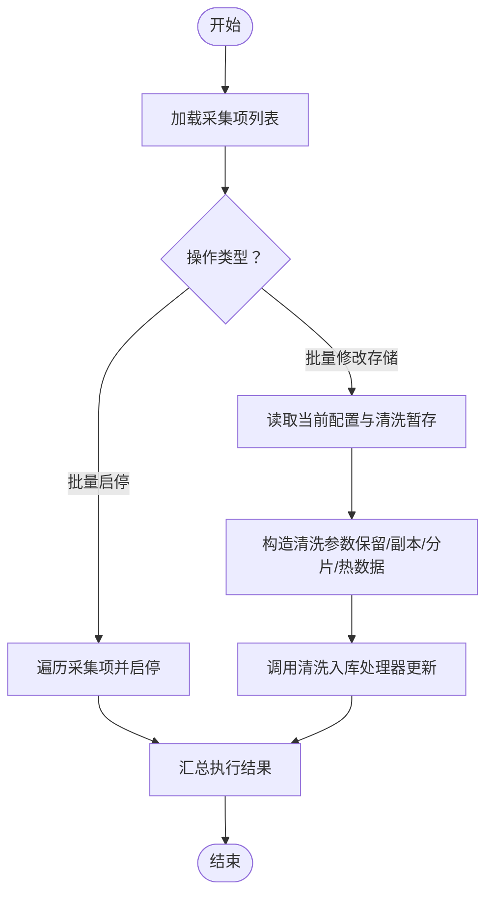
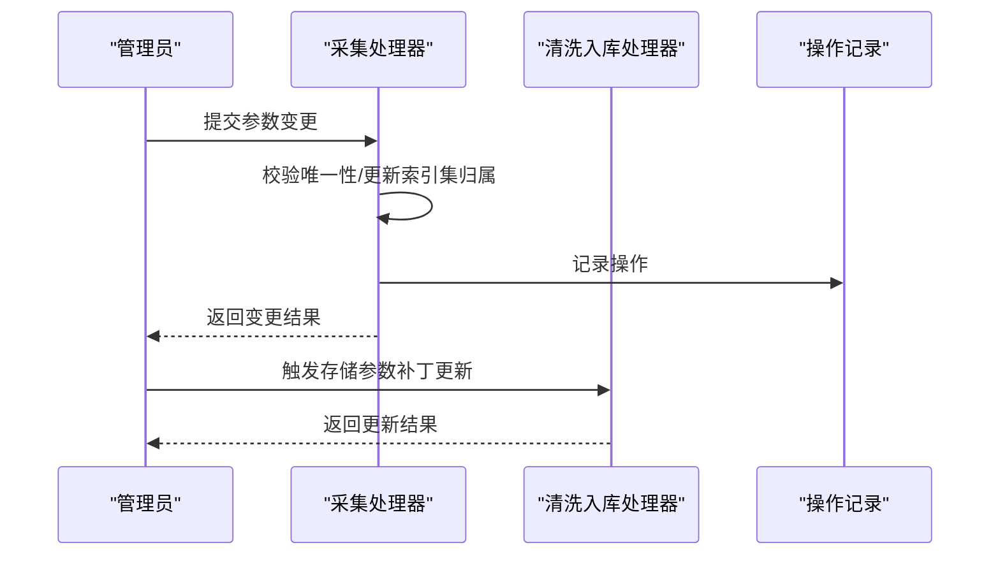
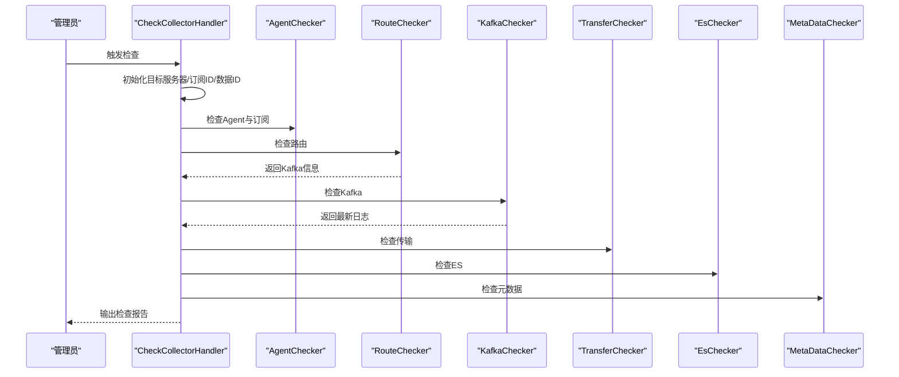
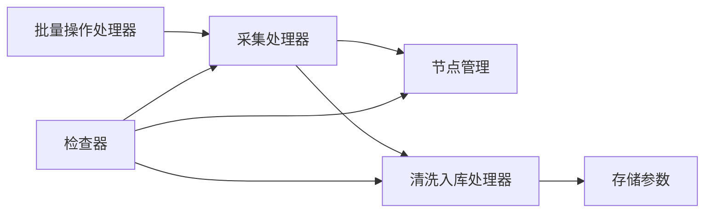

# 采集器升级维护

<cite>
**本文引用的文件**
- [apps/log_databus/handlers/collector_batch_operation.py](file://apps/log_databus/handlers/collector_batch_operation.py)
- [apps/log_databus/handlers/collector/host.py](file://apps/log_databus/handlers/collector/host.py)
- [apps/log_databus/handlers/check_collector/handler.py](file://apps/log_databus/handlers/check_collector/handler.py)
- [apps/log_databus/models.py](file://apps/log_databus/models.py)
- [apps/log_databus/constants.py](file://apps/log_databus/constants.py)
- [apps/log_databus/handlers/etl/transfer.py](file://apps/log_databus/handlers/etl/transfer.py)
- [apps/log_databus/handlers/archive.py](file://apps/log_databus/handlers/archive.py)
- [scripts/change_run_ver.py](file://scripts/change_run_ver.py)
- [support-files/bkpkgs/bklog.yaml](file://support-files/bkpkgs/bklog.yaml)
</cite>

## 目录
1. [简介](#简介)
2. [项目结构](#项目结构)
3. [核心组件](#核心组件)
4. [架构总览](#架构总览)
5. [详细组件分析](#详细组件分析)
6. [依赖分析](#依赖分析)
7. [性能考虑](#性能考虑)
8. [故障排查指南](#故障排查指南)
9. [结论](#结论)
10. [附录](#附录)

## 简介
本技术文档围绕采集器升级维护系统，系统性阐述版本管理机制、在线升级流程、离线维护操作、配置更新流程、最佳实践与自动化脚本示例。重点覆盖以下方面：
- 版本检测与兼容性检查：通过采集项模型字段与常量定义识别版本相关配置，结合检查器链路验证运行状态。
- 在线升级流程：配置更新、订阅启停、清洗入库更新、存储参数变更等关键步骤。
- 离线维护：批量启停、存储参数批量修改、归档恢复、回滚策略与注意事项。
- 配置更新：参数变更、规则调整、权限更新的实现路径与约束。
- 最佳实践：维护窗口、风险评估、备份策略、自动化脚本与常见问题。

## 项目结构
采集器升级维护相关能力主要集中在 databus 子系统，涉及采集配置、清洗入库、存储参数、检查器、归档恢复与批量操作等模块；同时提供运行版本切换脚本与包依赖声明文件。

**图表来源**
- [apps/log_databus/models.py:102-200](file://apps/log_databus/models.py#L102-L200)
- [apps/log_databus/handlers/collector/host.py:82-136](file://apps/log_databus/handlers/collector/host.py#L82-L136)
- [apps/log_databus/handlers/collector_batch_operation.py:28-147](file://apps/log_databus/handlers/collector_batch_operation.py#L28-L147)
- [apps/log_databus/handlers/etl/transfer.py:216-255](file://apps/log_databus/handlers/etl/transfer.py#L216-L255)
- [apps/log_databus/handlers/check_collector/handler.py:52-191](file://apps/log_databus/handlers/check_collector/handler.py#L52-L191)
- [apps/log_databus/handlers/archive.py:470-499](file://apps/log_databus/handlers/archive.py#L470-L499)
- [scripts/change_run_ver.py:16-77](file://scripts/change_run_ver.py#L16-L77)
- [support-files/bkpkgs/bklog.yaml:1-19](file://support-files/bkpkgs/bklog.yaml#L1-L19)

**章节来源**
- [apps/log_databus/models.py:102-200](file://apps/log_databus/models.py#L102-L200)
- [apps/log_databus/handlers/collector/host.py:82-136](file://apps/log_databus/handlers/collector/host.py#L82-L136)
- [apps/log_databus/handlers/collector_batch_operation.py:28-147](file://apps/log_databus/handlers/collector_batch_operation.py#L28-L147)
- [apps/log_databus/handlers/etl/transfer.py:216-255](file://apps/log_databus/handlers/etl/transfer.py#L216-L255)
- [apps/log_databus/handlers/check_collector/handler.py:52-191](file://apps/log_databus/handlers/check_collector/handler.py#L52-L191)
- [apps/log_databus/handlers/archive.py:470-499](file://apps/log_databus/handlers/archive.py#L470-L499)
- [scripts/change_run_ver.py:16-77](file://scripts/change_run_ver.py#L16-L77)
- [support-files/bkpkgs/bklog.yaml:1-19](file://support-files/bkpkgs/bklog.yaml#L1-L19)

## 核心组件
- 采集配置模型（CollectorConfig）：承载采集项元数据、清洗配置、订阅ID、存储参数、环境标识、纳秒/链路开关等关键字段。
- 采集处理器（HostCollectorHandler）：负责采集项的创建/更新、启停、订阅任务、重试、节点差异比较等。
- 批量操作处理器（CollectorBatchHandler）：支持批量启停、批量修改存储参数（保留天数、副本数、分片数、热数据天数）。
- 清洗入库处理器（EtlTransferHandler）：负责清洗配置更新与补丁更新，支持存储参数补丁。
- 检查器（CheckCollectorHandler）：串联 Agent、路由、Kafka、传输、ES、元数据检查，形成端到端验证链路。
- 归档与恢复（Archive/Restore）：支持索引集级归档回溯与恢复过期时间更新。
- 运行版本切换脚本（change_run_ver.py）：根据运行版本复制部署配置。
- 包依赖（bklog.yaml）：声明平台依赖与版本要求。

**章节来源**
- [apps/log_databus/models.py:102-200](file://apps/log_databus/models.py#L102-L200)
- [apps/log_databus/handlers/collector/host.py:82-136](file://apps/log_databus/handlers/collector/host.py#L82-L136)
- [apps/log_databus/handlers/collector_batch_operation.py:28-147](file://apps/log_databus/handlers/collector_batch_operation.py#L28-L147)
- [apps/log_databus/handlers/etl/transfer.py:216-255](file://apps/log_databus/handlers/etl/transfer.py#L216-L255)
- [apps/log_databus/handlers/check_collector/handler.py:52-191](file://apps/log_databus/handlers/check_collector/handler.py#L52-L191)
- [apps/log_databus/handlers/archive.py:470-499](file://apps/log_databus/handlers/archive.py#L470-L499)
- [scripts/change_run_ver.py:16-77](file://scripts/change_run_ver.py#L16-L77)
- [support-files/bkpkgs/bklog.yaml:1-19](file://support-files/bkpkgs/bklog.yaml#L1-L19)

## 架构总览
采集器升级维护涉及“配置—订阅—清洗—存储—检查—归档”的闭环，关键流程如下：
- 在线升级：通过采集处理器启停订阅，触发节点管理任务；清洗入库处理器更新清洗配置；存储参数通过补丁更新生效。
- 离线维护：批量启停与批量修改存储参数；归档恢复支持过期时间调整；回滚通过恢复配置与订阅启停实现。
- 配置更新：参数变更、规则调整、权限更新通过采集处理器与存储处理器协同完成。

**图表来源**
- [apps/log_databus/handlers/collector_batch_operation.py:36-147](file://apps/log_databus/handlers/collector_batch_operation.py#L36-L147)
- [apps/log_databus/handlers/collector/host.py:96-114](file://apps/log_databus/handlers/collector/host.py#L96-L114)
- [apps/log_databus/handlers/etl/transfer.py:216-255](file://apps/log_databus/handlers/etl/transfer.py#L216-L255)

## 详细组件分析

### 组件一：采集配置模型（版本与兼容性）
- 关键字段
  - 环境标识：environment
  - 纳秒采集开关：is_nanos
  - v4链路开关：enable_v4
  - 采集器配置覆盖：collector_config_overlay
  - 存储参数：storage_shards_nums、storage_shards_size、storage_replies、allocation_min_days
  - 结果表与数据平台ID：table_id、bk_data_id、bkdata_data_id
- 版本与兼容性要点
  - 通过环境与链路开关控制不同版本行为；存储参数与热数据天数联动集群热温配置。
  - 英文名与命名规范由常量约束，避免重复与非法命名。

**图表来源**
- [apps/log_databus/models.py:102-200](file://apps/log_databus/models.py#L102-L200)
- [apps/log_databus/constants.py:39-42](file://apps/log_databus/constants.py#L39-L42)

**章节来源**
- [apps/log_databus/models.py:102-200](file://apps/log_databus/models.py#L102-L200)
- [apps/log_databus/constants.py:39-42](file://apps/log_databus/constants.py#L39-L42)

### 组件二：在线升级流程（配置更新、服务重启、数据迁移）
- 配置更新
  - 采集处理器在创建/更新时校验英文名、数据平台名称与结果表ID唯一性，必要时更新数据平台名称。
  - 支持索引集归属关系更新与名称同步。
- 服务重启
  - 采集处理器封装启停流程，若存在订阅则通过节点管理启停订阅任务。
- 数据迁移与清洗
  - 清洗入库处理器提供补丁更新接口，按需应用存储参数补丁，确保清洗配置与存储参数一致。

**图表来源**
- [apps/log_databus/handlers/collector/host.py:183-383](file://apps/log_databus/handlers/collector/host.py#L183-L383)
- [apps/log_databus/handlers/collector/host.py:96-114](file://apps/log_databus/handlers/collector/host.py#L96-L114)
- [apps/log_databus/handlers/etl/transfer.py:216-255](file://apps/log_databus/handlers/etl/transfer.py#L216-L255)

**章节来源**
- [apps/log_databus/handlers/collector/host.py:183-383](file://apps/log_databus/handlers/collector/host.py#L183-L383)
- [apps/log_databus/handlers/collector/host.py:96-114](file://apps/log_databus/handlers/collector/host.py#L96-L114)
- [apps/log_databus/handlers/etl/transfer.py:216-255](file://apps/log_databus/handlers/etl/transfer.py#L216-L255)

### 组件三：离线维护（批量启停、批量修改存储、回滚）
- 批量启停
  - 遍历采集项，分别调用采集处理器启停，记录每个采集项的执行状态与原因。
- 批量修改存储
  - 读取采集项当前配置与清洗暂存，构造清洗参数，按集群热温配置决定热数据天数是否生效，最终调用清洗入库处理器更新。
- 回滚机制
  - 通过归档恢复配置与订阅启停实现回滚；恢复过期时间可统一调整，支持索引集级批量更新。

**图表来源**
- [apps/log_databus/handlers/collector_batch_operation.py:36-147](file://apps/log_databus/handlers/collector_batch_operation.py#L36-L147)
- [apps/log_databus/handlers/etl/transfer.py:216-255](file://apps/log_databus/handlers/etl/transfer.py#L216-L255)
- [apps/log_databus/handlers/archive.py:470-499](file://apps/log_databus/handlers/archive.py#L470-L499)

**章节来源**
- [apps/log_databus/handlers/collector_batch_operation.py:28-147](file://apps/log_databus/handlers/collector_batch_operation.py#L28-L147)
- [apps/log_databus/handlers/etl/transfer.py:216-255](file://apps/log_databus/handlers/etl/transfer.py#L216-L255)
- [apps/log_databus/handlers/archive.py:470-499](file://apps/log_databus/handlers/archive.py#L470-L499)

### 组件四：配置更新流程（参数变更、规则调整、权限更新）
- 参数变更
  - 采集处理器在创建/更新时对关键字段进行校验与更新，必要时同步到数据平台与索引集。
- 规则调整
  - 存储参数变更通过清洗入库补丁更新，确保与集群热温配置一致。
- 权限更新
  - 采集项创建后进行授权与通知，更新操作记录用于审计。

**图表来源**
- [apps/log_databus/handlers/collector/host.py:183-383](file://apps/log_databus/handlers/collector/host.py#L183-L383)
- [apps/log_databus/handlers/etl/transfer.py:216-255](file://apps/log_databus/handlers/etl/transfer.py#L216-L255)

**章节来源**
- [apps/log_databus/handlers/collector/host.py:183-383](file://apps/log_databus/handlers/collector/host.py#L183-L383)
- [apps/log_databus/handlers/etl/transfer.py:216-255](file://apps/log_databus/handlers/etl/transfer.py#L216-L255)

### 组件五：版本检测与兼容性检查
- 版本检测
  - 通过 CollectorConfig 的 environment、is_nanos、enable_v4 字段识别版本与链路特征。
- 兼容性检查
  - CheckCollectorHandler 串联 Agent、路由、Kafka、传输、ES、元数据检查，形成端到端验证链路，确保升级后各环节正常。

**图表来源**
- [apps/log_databus/handlers/check_collector/handler.py:131-180](file://apps/log_databus/handlers/check_collector/handler.py#L131-L180)

**章节来源**
- [apps/log_databus/handlers/check_collector/handler.py:52-191](file://apps/log_databus/handlers/check_collector/handler.py#L52-L191)

### 组件六：运行版本切换与依赖声明
- 运行版本切换
  - change_run_ver.py 根据运行版本复制部署配置，支持忽略目录与交互参数。
- 依赖声明
  - bklog.yaml 声明平台依赖与版本要求，确保运行环境满足。

**章节来源**
- [scripts/change_run_ver.py:16-77](file://scripts/change_run_ver.py#L16-L77)
- [support-files/bkpkgs/bklog.yaml:1-19](file://support-files/bkpkgs/bklog.yaml#L1-L19)

## 依赖分析
- 组件耦合
  - 采集处理器与节点管理强耦合，启停与任务执行依赖订阅ID。
  - 清洗入库处理器与存储处理器协作，存储参数变更通过补丁更新。
  - 批量操作处理器对采集处理器与存储处理器形成上层编排。
- 外部依赖
  - 平台依赖由包依赖文件声明，确保运行环境一致性。
- 循环依赖
  - 代码结构清晰，未发现循环导入。

**图表来源**
- [apps/log_databus/handlers/collector_batch_operation.py:28-147](file://apps/log_databus/handlers/collector_batch_operation.py#L28-L147)
- [apps/log_databus/handlers/collector/host.py:82-136](file://apps/log_databus/handlers/collector/host.py#L82-L136)
- [apps/log_databus/handlers/etl/transfer.py:216-255](file://apps/log_databus/handlers/etl/transfer.py#L216-L255)
- [apps/log_databus/handlers/check_collector/handler.py:52-191](file://apps/log_databus/handlers/check_collector/handler.py#L52-L191)

**章节来源**
- [apps/log_databus/handlers/collector_batch_operation.py:28-147](file://apps/log_databus/handlers/collector_batch_operation.py#L28-L147)
- [apps/log_databus/handlers/collector/host.py:82-136](file://apps/log_databus/handlers/collector/host.py#L82-L136)
- [apps/log_databus/handlers/etl/transfer.py:216-255](file://apps/log_databus/handlers/etl/transfer.py#L216-L255)
- [apps/log_databus/handlers/check_collector/handler.py:52-191](file://apps/log_databus/handlers/check_collector/handler.py#L52-L191)

## 性能考虑
- 批量操作
  - 批量启停与批量修改存储采用遍历与异步任务组合，注意异常隔离与结果汇总。
- 清洗参数补丁
  - 补丁更新仅在必要时触发，减少不必要的传输与ES写入压力。
- 检查器链路
  - 检查器按模块串行执行，建议在维护窗口执行，避免对生产流量造成影响。

## 故障排查指南
- 常见问题
  - 采集项英文名重复：采集处理器在创建/更新时进行唯一性校验，需修正名称。
  - 非法IP越权：当目标节点为静态主机时，会过滤非法IP并抛出异常。
  - 订阅启停失败：检查节点管理订阅状态与任务ID列表，必要时重试。
  - 存储参数未生效：确认集群热温配置与补丁参数是否匹配。
- 排查步骤
  - 使用检查器链路逐项验证 Agent、路由、Kafka、传输、ES、元数据。
  - 查看采集处理器与清洗入库处理器的日志与返回状态。
  - 对索引集级恢复配置批量更新过期时间，确保回溯窗口正确。

**章节来源**
- [apps/log_databus/handlers/collector/host.py:415-436](file://apps/log_databus/handlers/collector/host.py#L415-L436)
- [apps/log_databus/handlers/check_collector/handler.py:131-180](file://apps/log_databus/handlers/check_collector/handler.py#L131-L180)
- [apps/log_databus/handlers/archive.py:470-499](file://apps/log_databus/handlers/archive.py#L470-L499)

## 结论
本系统通过采集配置模型、采集处理器、清洗入库处理器、检查器与批量操作处理器形成完整的升级维护闭环。在线升级强调配置与订阅的协同更新，离线维护强调批量与回滚能力，版本检测与兼容性检查贯穿始终。配合运行版本切换脚本与依赖声明，可确保升级过程可控、可追溯、可回滚。

## 附录
- 自动化脚本示例
  - 运行版本切换：通过命令行参数指定运行版本与忽略目录，自动复制部署配置。
  - 批量启停/修改存储：通过批量操作处理器对采集项列表执行统一操作，汇总结果。
- 最佳实践
  - 维护窗口：选择低峰时段执行检查器与批量操作。
  - 风险评估：先在小范围采集项验证检查器链路，再推广到全量。
  - 备份策略：在升级前导出采集配置与清洗规则，必要时回滚。
  - 权限更新：确保采集项创建后的授权与通知流程完整执行。

**章节来源**
- [scripts/change_run_ver.py:63-77](file://scripts/change_run_ver.py#L63-L77)
- [apps/log_databus/handlers/collector_batch_operation.py:36-147](file://apps/log_databus/handlers/collector_batch_operation.py#L36-L147)
- [apps/log_databus/handlers/check_collector/handler.py:131-180](file://apps/log_databus/handlers/check_collector/handler.py#L131-L180)