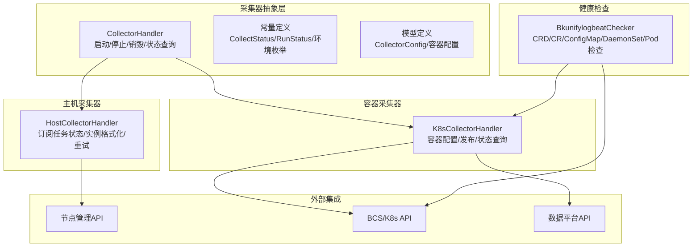
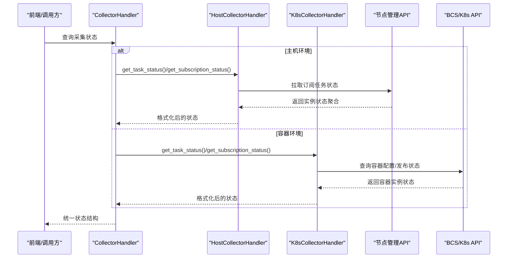
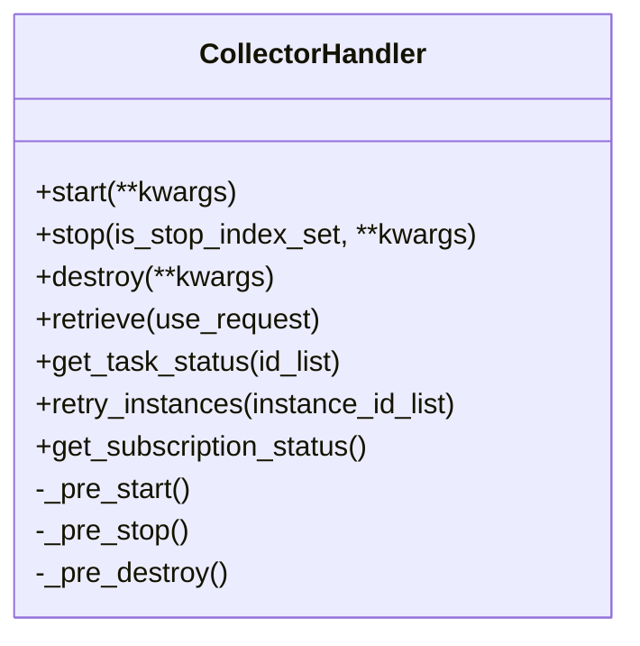
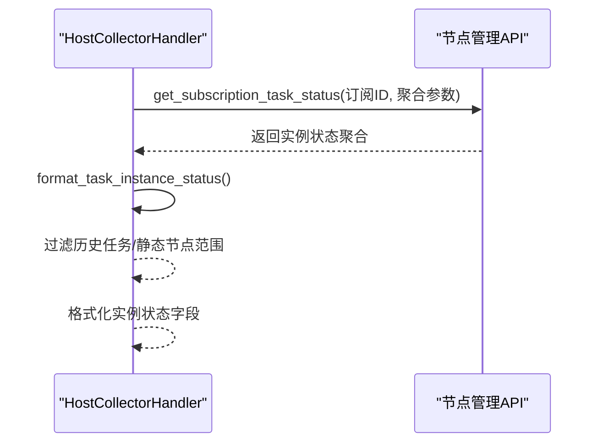
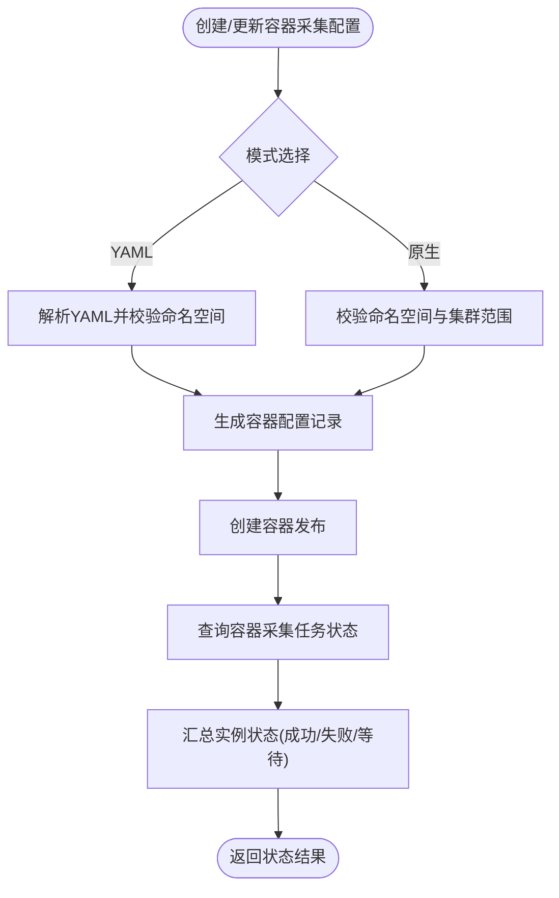
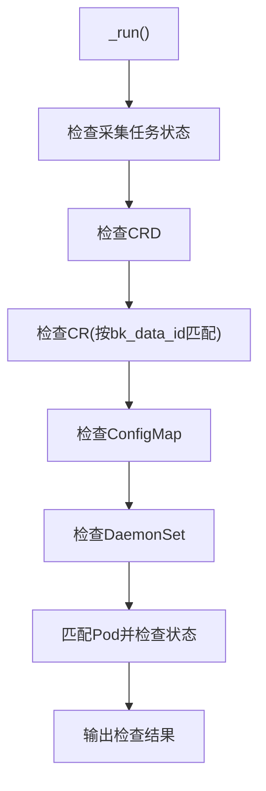
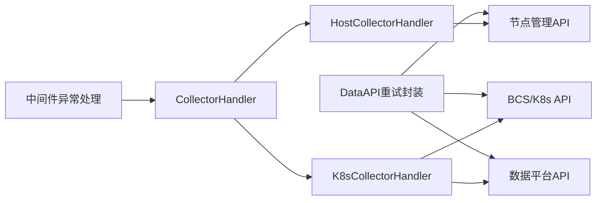

# 采集器状态管理

<cite>
**本文引用的文件**
- [apps/log_databus/handlers/collector/base.py](file://apps/log_databus/handlers/collector/base.py)
- [apps/log_databus/handlers/collector/host.py](file://apps/log_databus/handlers/collector/host.py)
- [apps/log_databus/handlers/collector/k8s.py](file://apps/log_databus/handlers/collector/k8s.py)
- [apps/log_databus/constants.py](file://apps/log_databus/constants.py)
- [apps/log_databus/models.py](file://apps/log_databus/models.py)
- [apps/log_databus/handlers/check_collector/checker/bkunifylogbeat_checker.py](file://apps/log_databus/handlers/check_collector/checker/bkunifylogbeat_checker.py)
- [apps/api/base.py](file://apps/api/base.py)
- [apps/exceptions.py](file://apps/exceptions.py)
- [apps/middlewares.py](file://apps/middlewares.py)
</cite>

## 目录
1. [简介](#简介)
2. [项目结构](#项目结构)
3. [核心组件](#核心组件)
4. [架构总览](#架构总览)
5. [详细组件分析](#详细组件分析)
6. [依赖关系分析](#依赖关系分析)
7. [性能考量](#性能考量)
8. [故障排查指南](#故障排查指南)
9. [结论](#结论)
10. [附录](#附录)

## 简介
本技术文档围绕采集器状态管理系统展开，系统性阐述采集器状态监控、状态同步、状态恢复等核心能力；详解采集器的任务状态管理（创建、执行监控、状态更新、异常处理）；解释主机实例与容器实例的状态跟踪机制；并给出健康检查（心跳、超时、故障转移）与配置项（检查间隔、重试策略、告警阈值）说明。文档同时提供最佳实践与故障排查建议，帮助读者快速理解并解决状态相关问题。

## 项目结构
采集器状态管理主要由三部分构成：
- 采集器抽象与通用逻辑：位于采集器基类与常量定义中，统一状态枚举、运行控制与通用流程。
- 主机采集器实现：面向物理机/虚拟机的订阅与任务状态拉取、实例状态格式化、重试与停用清理。
- 容器采集器实现：面向 Kubernetes 的容器采集配置、发布与状态查询、容器实例状态跟踪。
- 健康检查器：针对容器采集器的 CRD、CR、ConfigMap、DaemonSet、Pod 等资源进行一致性与健康度检查。
- API 重试与异常处理：封装对外部组件的调用重试策略与异常传播，保障状态查询的稳定性。

图表来源
- [apps/log_databus/handlers/collector/base.py:124-161](file://apps/log_databus/handlers/collector/base.py#L124-L161)
- [apps/log_databus/handlers/collector/host.py:82-136](file://apps/log_databus/handlers/collector/host.py#L82-L136)
- [apps/log_databus/handlers/collector/k8s.py:112-158](file://apps/log_databus/handlers/collector/k8s.py#L112-L158)
- [apps/log_databus/handlers/check_collector/checker/bkunifylogbeat_checker.py:61-107](file://apps/log_databus/handlers/check_collector/checker/bkunifylogbeat_checker.py#L61-L107)

章节来源
- [apps/log_databus/handlers/collector/base.py:124-161](file://apps/log_databus/handlers/collector/base.py#L124-L161)
- [apps/log_databus/handlers/collector/host.py:82-136](file://apps/log_databus/handlers/collector/host.py#L82-L136)
- [apps/log_databus/handlers/collector/k8s.py:112-158](file://apps/log_databus/handlers/collector/k8s.py#L112-L158)
- [apps/log_databus/handlers/check_collector/checker/bkunifylogbeat_checker.py:61-107](file://apps/log_databus/handlers/check_collector/checker/bkunifylogbeat_checker.py#L61-L107)

## 核心组件
- 采集器基类（CollectorHandler）
  - 统一生命周期控制：启动、停止、销毁；与索引集、结果表联动开关。
  - 通用状态查询链路：多API并发拉取、上下文组装、字段补全。
  - 抽象方法：不同环境（主机/容器）的具体实现由子类提供。
- 主机采集器（HostCollectorHandler）
  - 通过节点管理订阅执行采集任务，支持任务状态聚合与实例明细格式化。
  - 支持重试指定实例或节点，记录用户操作审计。
  - 停用/终止状态清理：当采集项停用时，将订阅状态修正为“已停用”。
- 容器采集器（K8sCollectorHandler）
  - 面向 Kubernetes 的容器采集配置创建/更新/发布，支持 YAML 模式与原生模式。
  - 提供容器采集任务状态查询与实例状态汇总。
  - 容器实例状态跟踪：基于容器配置状态与消息详情。
- 健康检查器（BkunifylogbeatChecker）
  - 对 CRD、CR、ConfigMap、DaemonSet、Pod 等进行一致性与健康度检查。
  - 输出检查结果，辅助定位容器采集异常。
- 常量与模型
  - 状态枚举（CollectStatus、RunStatus）、环境枚举（Environment）、容器状态（ContainerCollectStatus）。
  - 采集配置模型（CollectorConfig）承载采集项元数据、订阅ID、任务ID列表等。

章节来源
- [apps/log_databus/handlers/collector/base.py:408-481](file://apps/log_databus/handlers/collector/base.py#L408-L481)
- [apps/log_databus/handlers/collector/host.py:589-641](file://apps/log_databus/handlers/collector/host.py#L589-L641)
- [apps/log_databus/handlers/collector/k8s.py:257-337](file://apps/log_databus/handlers/collector/k8s.py#L257-L337)
- [apps/log_databus/handlers/check_collector/checker/bkunifylogbeat_checker.py:61-158](file://apps/log_databus/handlers/check_collector/checker/bkunifylogbeat_checker.py#L61-L158)
- [apps/log_databus/constants.py:341-386](file://apps/log_databus/constants.py#L341-L386)
- [apps/log_databus/models.py:102-200](file://apps/log_databus/models.py#L102-L200)

## 架构总览
采集器状态管理采用“抽象基类 + 环境适配器 + 外部系统集成”的分层架构：
- 抽象层：定义采集器生命周期与通用状态查询流程。
- 适配层：主机/容器两类采集器分别对接节点管理与 Kubernetes 生态。
- 集成层：通过统一的 API 封装与异常处理，确保状态查询与控制的稳定性。

图表来源
- [apps/log_databus/handlers/collector/base.py:674-683](file://apps/log_databus/handlers/collector/base.py#L674-L683)
- [apps/log_databus/handlers/collector/host.py:1002-1037](file://apps/log_databus/handlers/collector/host.py#L1002-L1037)
- [apps/log_databus/handlers/collector/k8s.py:159-185](file://apps/log_databus/handlers/collector/k8s.py#L159-L185)

## 详细组件分析

### 采集器基类（生命周期与通用状态查询）
- 生命周期控制
  - start/stop：切换采集项激活状态、索引集与结果表开关、触发环境特定的预处理动作。
  - destroy：停止并清理采集项，删除索引集与META采集项。
- 通用状态查询
  - 并发拉取数据平台、节点管理订阅配置与结果表存储信息，组装上下文。
  - 通过可插拔的处理链（retrieve chain）补全字段与显示信息。
- 抽象方法
  - get_task_status/retry_instances/get_subscription_status：由子类实现。

图表来源
- [apps/log_databus/handlers/collector/base.py:408-481](file://apps/log_databus/handlers/collector/base.py#L408-L481)
- [apps/log_databus/handlers/collector/base.py:674-683](file://apps/log_databus/handlers/collector/base.py#L674-L683)

章节来源
- [apps/log_databus/handlers/collector/base.py:408-481](file://apps/log_databus/handlers/collector/base.py#L408-L481)
- [apps/log_databus/handlers/collector/base.py:482-502](file://apps/log_databus/handlers/collector/base.py#L482-L502)

### 主机采集器（订阅任务状态与实例格式化）
- 任务状态获取
  - 通过节点管理API批量查询订阅任务状态，聚合实例状态并格式化。
  - 对静态主机节点，过滤历史任务与不在当前目标范围内的IP，避免误判。
- 实例状态格式化
  - 提取主机信息、云区域、IP、实例ID、步骤日志等，便于前端展示。
- 重试与停用清理
  - 支持按实例ID列表重试；当采集项停用时，将订阅状态修正为“已停用”。

图表来源
- [apps/log_databus/handlers/collector/host.py:1002-1037](file://apps/log_databus/handlers/collector/host.py#L1002-L1037)
- [apps/log_databus/handlers/collector/host.py:658-705](file://apps/log_databus/handlers/collector/host.py#L658-L705)
- [apps/log_databus/handlers/collector/base.py:1174-1184](file://apps/log_databus/handlers/collector/base.py#L1174-L1184)

章节来源
- [apps/log_databus/handlers/collector/host.py:1002-1037](file://apps/log_databus/handlers/collector/host.py#L1002-L1037)
- [apps/log_databus/handlers/collector/host.py:658-705](file://apps/log_databus/handlers/collector/host.py#L658-L705)
- [apps/log_databus/handlers/collector/base.py:1174-1184](file://apps/log_databus/handlers/collector/base.py#L1174-L1184)

### 容器采集器（配置创建/发布与状态查询）
- 配置创建与更新
  - 支持 YAML 模式与原生模式；校验命名空间与集群范围；生成容器采集配置并创建/更新容器配置记录。
  - 与数据平台META联动，创建/更新 data_id。
- 发布与状态查询
  - 面向容器环境的预处理：启动/停止/销毁时创建/删除容器发布；提供容器采集任务状态查询与实例状态汇总。
- 容器实例状态跟踪
  - 基于容器配置状态与状态详情，输出容器采集任务的总/成功/失败/等待数量。

图表来源
- [apps/log_databus/handlers/collector/k8s.py:257-337](file://apps/log_databus/handlers/collector/k8s.py#L257-L337)
- [apps/log_databus/handlers/collector/k8s.py:128-158](file://apps/log_databus/handlers/collector/k8s.py#L128-L158)
- [apps/log_databus/handlers/collector/k8s.py:159-185](file://apps/log_databus/handlers/collector/k8s.py#L159-L185)

章节来源
- [apps/log_databus/handlers/collector/k8s.py:257-337](file://apps/log_databus/handlers/collector/k8s.py#L257-L337)
- [apps/log_databus/handlers/collector/k8s.py:128-158](file://apps/log_databus/handlers/collector/k8s.py#L128-L158)
- [apps/log_databus/handlers/collector/k8s.py:159-185](file://apps/log_databus/handlers/collector/k8s.py#L159-L185)

### 健康检查器（容器采集器资源一致性检查）
- 检查流程
  - 采集任务状态检查：若为空或存在非成功状态，输出异常信息。
  - CRD/CR/ConfigMap/DaemonSet/Pod 检查：匹配 bk_data_id，输出资源状态与详情。
- 输出与定位
  - 正常/告警/错误分级输出，辅助定位容器采集异常。

图表来源
- [apps/log_databus/handlers/check_collector/checker/bkunifylogbeat_checker.py:98-158](file://apps/log_databus/handlers/check_collector/checker/bkunifylogbeat_checker.py#L98-L158)
- [apps/log_databus/handlers/check_collector/checker/bkunifylogbeat_checker.py:159-200](file://apps/log_databus/handlers/check_collector/checker/bkunifylogbeat_checker.py#L159-L200)

章节来源
- [apps/log_databus/handlers/check_collector/checker/bkunifylogbeat_checker.py:98-158](file://apps/log_databus/handlers/check_collector/checker/bkunifylogbeat_checker.py#L98-L158)
- [apps/log_databus/handlers/check_collector/checker/bkunifylogbeat_checker.py:159-200](file://apps/log_databus/handlers/check_collector/checker/bkunifylogbeat_checker.py#L159-L200)

### 状态枚举与模型支撑
- 状态枚举
  - 采集任务状态（CollectStatus）：准备、运行中、成功、失败、等待、已停用、未知。
  - 运行状态（RunStatus）：部署中、正常、失败、部分失败、已停用、未知、准备中。
  - 容器采集状态（ContainerCollectStatus）：等待中、部署中、成功、失败、已停用。
- 模型支撑
  - 采集配置模型（CollectorConfig）：承载采集项元数据、订阅ID、任务ID列表、索引集ID、环境标识等。

章节来源
- [apps/log_databus/constants.py:341-386](file://apps/log_databus/constants.py#L341-L386)
- [apps/log_databus/models.py:102-200](file://apps/log_databus/models.py#L102-L200)

## 依赖关系分析
- 组件耦合
  - CollectorHandler 作为抽象基类，被 HostCollectorHandler 与 K8sCollectorHandler 继承，形成清晰的环境适配。
  - 主机/容器实现依赖节点管理与 Kubernetes/BK 数据平台 API。
- 外部依赖
  - 节点管理API：订阅任务状态查询与重试。
  - BCS/K8s API：容器采集配置与资源检查。
  - 数据平台API：data_id 与结果表存储信息。
- 异常与重试
  - API 调用通过统一的 DataAPI 与重试类封装，支持异常与结果级重试策略。
  - 中间件捕获异常并统一返回。

图表来源
- [apps/log_databus/handlers/collector/host.py:1002-1037](file://apps/log_databus/handlers/collector/host.py#L1002-L1037)
- [apps/log_databus/handlers/collector/k8s.py:159-185](file://apps/log_databus/handlers/collector/k8s.py#L159-L185)
- [apps/api/base.py:108-174](file://apps/api/base.py#L108-L174)
- [apps/middlewares.py:159-193](file://apps/middlewares.py#L159-L193)

章节来源
- [apps/log_databus/handlers/collector/host.py:1002-1037](file://apps/log_databus/handlers/collector/host.py#L1002-L1037)
- [apps/log_databus/handlers/collector/k8s.py:159-185](file://apps/log_databus/handlers/collector/k8s.py#L159-L185)
- [apps/api/base.py:108-174](file://apps/api/base.py#L108-L174)
- [apps/middlewares.py:159-193](file://apps/middlewares.py#L159-L193)

## 性能考量
- 并发拉取与分片
  - 通过并发执行与分片批量查询（如批量获取集群信息），降低单次请求压力，提升状态查询吞吐。
- 缓存与限流
  - 集群信息缓存与批量分片重试策略，减少重复请求与失败重试开销。
- 状态聚合与过滤
  - 对静态主机节点进行历史任务与目标范围过滤，避免无效状态参与聚合，降低前端渲染与对比成本。

章节来源
- [apps/log_databus/handlers/collector/base.py:740-800](file://apps/log_databus/handlers/collector/base.py#L740-L800)
- [apps/log_databus/handlers/collector/host.py:681-705](file://apps/log_databus/handlers/collector/host.py#L681-L705)

## 故障排查指南
- 常见问题定位
  - 采集任务状态为空：检查节点管理订阅是否存在、任务是否已创建。
  - 部分实例失败：查看实例日志详情与步骤状态，定位失败节点。
  - 容器采集异常：使用健康检查器输出的 CRD/CR/ConfigMap/DaemonSet/Pod 详情进行逐项核对。
- 重试与恢复
  - 主机：按实例ID列表重试订阅任务，记录用户操作审计。
  - 容器：重建容器发布，确认配置与资源状态一致。
- 异常处理
  - 中间件捕获未处理异常并统一返回；API 层异常封装便于定位第三方系统错误。

章节来源
- [apps/log_databus/handlers/collector/host.py:589-641](file://apps/log_databus/handlers/collector/host.py#L589-L641)
- [apps/log_databus/handlers/collector/k8s.py:145-158](file://apps/log_databus/handlers/collector/k8s.py#L145-L158)
- [apps/middlewares.py:159-193](file://apps/middlewares.py#L159-L193)
- [apps/exceptions.py:63-116](file://apps/exceptions.py#L63-L116)

## 结论
采集器状态管理系统通过抽象基类与环境适配器实现了统一的生命周期与状态查询能力，结合节点管理与 Kubernetes 生态，提供了主机与容器双场景下的状态监控、同步与恢复机制。配合健康检查器与完善的异常处理，系统在复杂环境下仍能保持稳定与可观测性。建议在生产环境中合理配置重试策略与告警阈值，并遵循最佳实践进行状态巡检与异常处置。

## 附录
- 配置项建议（示例）
  - 状态检查间隔：建议根据业务规模与节点数量设置轮询周期，避免过于频繁导致压力。
  - 重试策略：对网络抖动与第三方系统瞬时异常，采用指数退避与最大重试次数控制。
  - 告警阈值：对失败率、等待队列长度、超时比例设定阈值，触发告警与自动恢复流程。
- 最佳实践
  - 采集项停用时及时清理订阅与发布，避免悬挂状态干扰。
  - 定期使用健康检查器核对容器资源配置一致性，提前发现潜在问题。
  - 对关键采集项开启审计与日志追踪，便于回溯与排障。