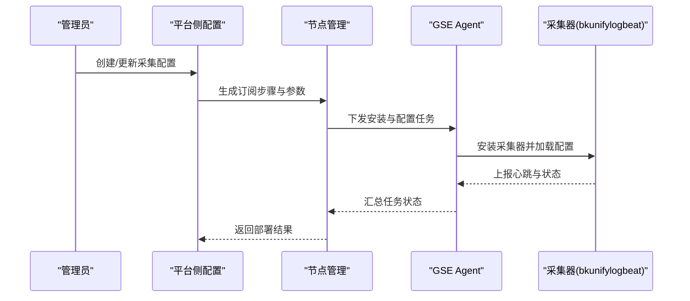
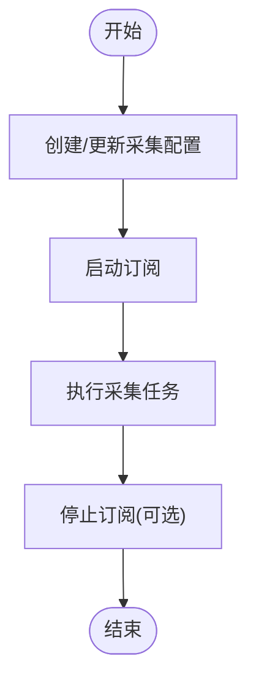
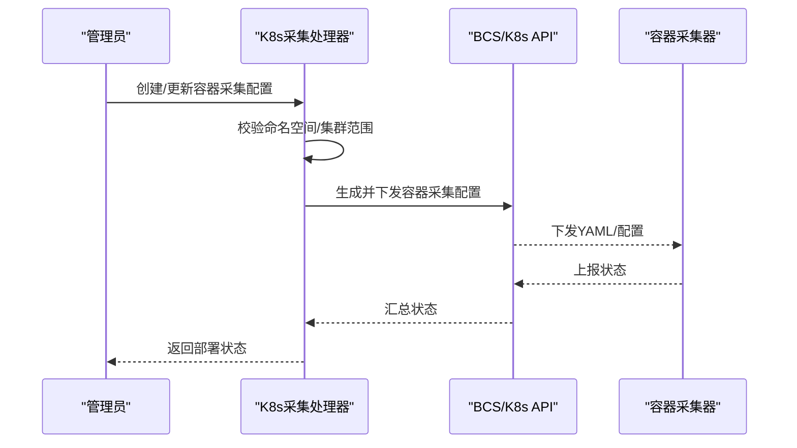
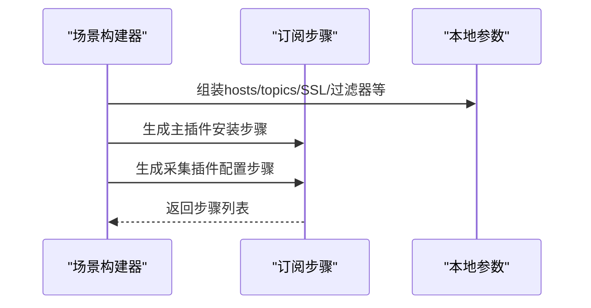
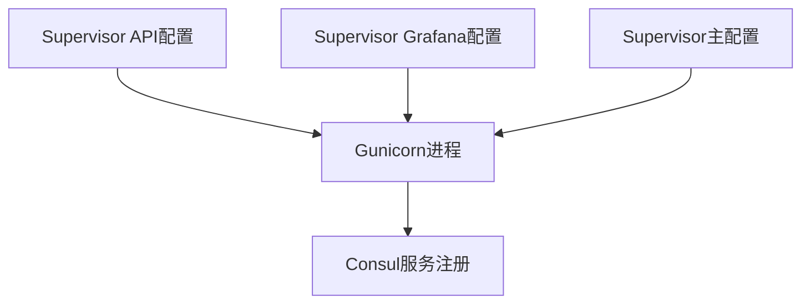
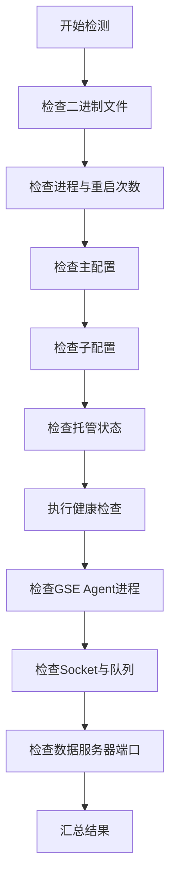
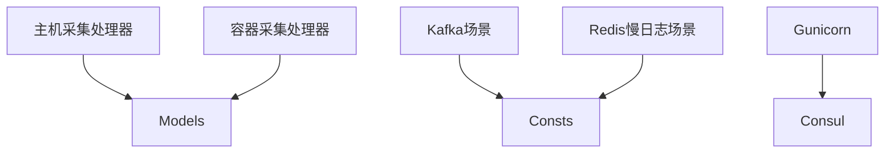

# 采集器部署

<cite>
**本文引用的文件**
- [apps/log_databus/handlers/collector/k8s.py](file://apps/log_databus/handlers/collector/k8s.py)
- [apps/log_databus/handlers/collector/host.py](file://apps/log_databus/handlers/collector/host.py)
- [apps/log_databus/models.py](file://apps/log_databus/models.py)
- [apps/log_databus/constants.py](file://apps/log_databus/constants.py)
- [apps/log_databus/scripts/check_bkunifylogbeat/check.py](file://apps/log_databus/scripts/check_bkunifylogbeat/check.py)
- [apps/log_databus/handlers/collector_scenario/kafka.py](file://apps/log_databus/handlers/collector_scenario/kafka.py)
- [apps/log_databus/handlers/collector_scenario/redis_slowlog.py](file://apps/log_databus/handlers/collector_scenario/redis_slowlog.py)
- [support-files/templates/#etc#supervisor-bklog-api.conf](file://support-files/templates/#etc#supervisor-bklog-api.conf)
- [support-files/templates/#etc#supervisor-bklog-grafana.conf](file://support-files/templates/#etc#supervisor-bklog-grafana.conf)
- [support-files/supervisord.conf](file://support-files/supervisord.conf)
- [gunicorn_config.py](file://gunicorn_config.py)
- [home_application/management/commands/healthz.py](file://home_application/management/commands/healthz.py)
- [support-files/bkpkgs/bklog.yaml](file://support-files/bkpkgs/bklog.yaml)
</cite>

## 目录
1. [简介](#简介)
2. [项目结构](#项目结构)
3. [核心组件](#核心组件)
4. [架构总览](#架构总览)
5. [详细组件分析](#详细组件分析)
6. [依赖分析](#依赖分析)
7. [性能考虑](#性能考虑)
8. [故障排查指南](#故障排查指南)
9. [结论](#结论)
10. [附录](#附录)

## 简介
本技术文档面向采集器部署系统，聚焦于主机采集器与容器采集器两类部署形态，系统性阐述采集器的部署架构、安装与配置流程、状态管理与监控机制、升级与维护流程，并提供最佳实践与安全配置建议。读者无需深入编程背景即可理解采集器的安装、配置、运维与排障要点。

## 项目结构
采集器部署相关的关键模块分布如下：
- 采集器核心逻辑与状态管理：主机采集器与容器采集器的处理器与模型
- 采集场景与插件：不同采集场景（如Kafka、Redis慢日志）的订阅步骤与参数构建
- 部署与服务编排：Supervisor/Gunicorn服务配置与注册
- 一键检测工具：采集器健康检查脚本
- 命令行健康检查：平台侧健康检查命令

```mermaid
graph TB
subgraph "采集器核心"
K8s["K8s采集处理器<br/>apps/log_databus/handlers/collector/k8s.py"]
Host["主机采集处理器<br/>apps/log_databus/handlers/collector/host.py"]
Models["采集模型<br/>apps/log_databus/models.py"]
Consts["采集常量<br/>apps/log_databus/constants.py"]
end
subgraph "采集场景"
Kafka["Kafka场景步骤<br/>apps/log_databus/handlers/collector_scenario/kafka.py"]
Redis["Redis慢日志场景步骤<br/>apps/log_databus/handlers/collector_scenario/redis_slowlog.py"]
end
subgraph "部署与监控"
SupvAPI["Supervisor API配置<br/>support-files/templates/#etc#supervisor-bklog-api.conf"]
SupvGraf["Supervisor Grafana配置<br/>support-files/templates/#etc#supervisor-bklog-grafana.conf"]
SupvMain["Supervisor主配置<br/>support-files/supervisord.conf"]
Gunicorn["Gunicorn注册Consul<br/>gunicorn_config.py"]
HealthzCmd["健康检查命令<br/>home_application/management/commands/healthz.py"]
CheckTool["采集器一键检测脚本<br/>apps/log_databus/scripts/check_bkunifylogbeat/check.py"]
end
K8s --> Models
Host --> Models
K8s --> Consts
Host --> Consts
Kafka --> Consts
Redis --> Consts
SupvAPI --> Gunicorn
SupvGraf --> Gunicorn
SupvMain --> Gunicorn
HealthzCmd --> Models
CheckTool --> Consts
```

**图表来源**
- [apps/log_databus/handlers/collector/k8s.py](file://apps/log_databus/handlers/collector/k8s.py)
- [apps/log_databus/handlers/collector/host.py](file://apps/log_databus/handlers/collector/host.py)
- [apps/log_databus/models.py](file://apps/log_databus/models.py)
- [apps/log_databus/constants.py](file://apps/log_databus/constants.py)
- [apps/log_databus/handlers/collector_scenario/kafka.py](file://apps/log_databus/handlers/collector_scenario/kafka.py)
- [apps/log_databus/handlers/collector_scenario/redis_slowlog.py](file://apps/log_databus/handlers/collector_scenario/redis_slowlog.py)
- [support-files/templates/#etc#supervisor-bklog-api.conf](file://support-files/templates/#etc#supervisor-bklog-api.conf)
- [support-files/templates/#etc#supervisor-bklog-grafana.conf](file://support-files/templates/#etc#supervisor-bklog-grafana.conf)
- [support-files/supervisord.conf](file://support-files/supervisord.conf)
- [gunicorn_config.py](file://gunicorn_config.py)
- [home_application/management/commands/healthz.py](file://home_application/management/commands/healthz.py)
- [apps/log_databus/scripts/check_bkunifylogbeat/check.py](file://apps/log_databus/scripts/check_bkunifylogbeat/check.py)

**章节来源**
- [apps/log_databus/handlers/collector/k8s.py](file://apps/log_databus/handlers/collector/k8s.py)
- [apps/log_databus/handlers/collector/host.py](file://apps/log_databus/handlers/collector/host.py)
- [apps/log_databus/models.py](file://apps/log_databus/models.py)
- [apps/log_databus/constants.py](file://apps/log_databus/constants.py)
- [apps/log_databus/scripts/check_bkunifylogbeat/check.py](file://apps/log_databus/scripts/check_bkunifylogbeat/check.py)
- [support-files/templates/#etc#supervisor-bklog-api.conf](file://support-files/templates/#etc#supervisor-bklog-api.conf)
- [support-files/templates/#etc#supervisor-bklog-grafana.conf](file://support-files/templates/#etc#supervisor-bklog-grafana.conf)
- [support-files/supervisord.conf](file://support-files/supervisord.conf)
- [gunicorn_config.py](file://gunicorn_config.py)
- [home_application/management/commands/healthz.py](file://home_application/management/commands/healthz.py)

## 核心组件
- 采集器处理器
  - 主机采集器处理器：负责主机场景的采集订阅启停、节点差异比较与任务执行
  - 容器采集器处理器：负责容器场景的采集配置创建、下发、重试与状态汇总
- 采集模型
  - 采集配置模型：承载采集项元数据、订阅ID、清洗配置、索引集等
  - 容器采集配置模型：承载容器采集的命名空间、工作负载、标签选择器、采集类型等
- 采集常量
  - 环境类型、容器采集类型、状态枚举、采集场景等统一定义
- 采集场景与插件
  - Kafka/Redis慢日志等场景的订阅步骤与参数构建
- 部署与监控
  - Supervisor/Gunicorn服务编排与Consul服务注册
  - 一键检测脚本与健康检查命令

**章节来源**
- [apps/log_databus/handlers/collector/host.py](file://apps/log_databus/handlers/collector/host.py)
- [apps/log_databus/handlers/collector/k8s.py](file://apps/log_databus/handlers/collector/k8s.py)
- [apps/log_databus/models.py](file://apps/log_databus/models.py)
- [apps/log_databus/constants.py](file://apps/log_databus/constants.py)
- [apps/log_databus/handlers/collector_scenario/kafka.py](file://apps/log_databus/handlers/collector_scenario/kafka.py)
- [apps/log_databus/handlers/collector_scenario/redis_slowlog.py](file://apps/log_databus/handlers/collector_scenario/redis_slowlog.py)

## 架构总览
采集器部署系统采用“平台侧配置—节点管理订阅—采集器执行”的三层架构：
- 平台侧：采集配置与场景参数构建，生成订阅步骤与参数
- 节点管理：根据订阅ID启停采集任务，执行采集器安装与配置下发
- 采集器：在目标主机/容器中运行，读取配置并上报日志数据

**图表来源**
- [apps/log_databus/handlers/collector/host.py](file://apps/log_databus/handlers/collector/host.py)
- [apps/log_databus/handlers/collector_scenario/kafka.py](file://apps/log_databus/handlers/collector_scenario/kafka.py)
- [apps/log_databus/handlers/collector_scenario/redis_slowlog.py](file://apps/log_databus/handlers/collector_scenario/redis_slowlog.py)

## 详细组件分析

### 主机采集器部署流程
- 关键步骤
  - 创建/更新采集配置：校验名称、清洗配置、索引集归属
  - 启动/停止订阅：通过节点管理启停订阅任务
  - 任务执行：根据订阅ID触发采集器执行
- 状态管理
  - 采集任务状态与主机状态组合，形成最终运行状态
  - 支持批量启停与目标节点差异比较

**图表来源**
- [apps/log_databus/handlers/collector/host.py](file://apps/log_databus/handlers/collector/host.py)

**章节来源**
- [apps/log_databus/handlers/collector/host.py](file://apps/log_databus/handlers/collector/host.py)

### 容器采集器部署流程
- 关键步骤
  - 容器配置创建/更新：支持YAML模式与原生模式，校验命名空间与集群范围
  - 容器采集配置生成：将容器配置转为原始配置并生成YAML
  - 下发与重试：根据容器配置创建发布，支持按配置ID重试
  - 状态汇总：聚合容器采集任务状态，返回部署状态
- 状态管理
  - 容器采集状态枚举：等待中、部署中、成功、失败、已停用
  - 子任务状态汇总：部分失败、全部成功、混合状态

**图表来源**
- [apps/log_databus/handlers/collector/k8s.py](file://apps/log_databus/handlers/collector/k8s.py)
- [apps/log_databus/models.py](file://apps/log_databus/models.py)
- [apps/log_databus/constants.py](file://apps/log_databus/constants.py)

**章节来源**
- [apps/log_databus/handlers/collector/k8s.py](file://apps/log_databus/handlers/collector/k8s.py)
- [apps/log_databus/models.py](file://apps/log_databus/models.py)
- [apps/log_databus/constants.py](file://apps/log_databus/constants.py)

### 采集场景与插件
- Kafka场景
  - 构建订阅步骤：主插件安装、采集插件配置模板、本地参数
  - 参数处理：SSL、初始偏移、过滤器、分隔符等
- Redis慢日志场景
  - 步骤与参数构建：与Kafka类似，注入标签与扩展元数据

**图表来源**
- [apps/log_databus/handlers/collector_scenario/kafka.py](file://apps/log_databus/handlers/collector_scenario/kafka.py)
- [apps/log_databus/handlers/collector_scenario/redis_slowlog.py](file://apps/log_databus/handlers/collector_scenario/redis_slowlog.py)

**章节来源**
- [apps/log_databus/handlers/collector_scenario/kafka.py](file://apps/log_databus/handlers/collector_scenario/kafka.py)
- [apps/log_databus/handlers/collector_scenario/redis_slowlog.py](file://apps/log_databus/handlers/collector_scenario/redis_slowlog.py)

### 部署与服务编排
- Supervisor配置
  - API与Grafana服务分别通过独立配置文件管理
  - 主Supervisor配置统一管理uwsgi、celery等进程
- Gunicorn注册Consul
  - 应用启动时向Consul注册服务，退出时注销

**图表来源**
- [support-files/templates/#etc#supervisor-bklog-api.conf](file://support-files/templates/#etc#supervisor-bklog-api.conf)
- [support-files/templates/#etc#supervisor-bklog-grafana.conf](file://support-files/templates/#etc#supervisor-bklog-grafana.conf)
- [support-files/supervisord.conf](file://support-files/supervisord.conf)
- [gunicorn_config.py](file://gunicorn_config.py)

**章节来源**
- [support-files/templates/#etc#supervisor-bklog-api.conf](file://support-files/templates/#etc#supervisor-bklog-api.conf)
- [support-files/templates/#etc#supervisor-bklog-grafana.conf](file://support-files/templates/#etc#supervisor-bklog-grafana.conf)
- [support-files/supervisord.conf](file://support-files/supervisord.conf)
- [gunicorn_config.py](file://gunicorn_config.py)

### 采集器状态管理与监控
- 一键检测脚本
  - 检查采集器二进制、进程、主配置、子配置、托管状态、健康检查
  - 检查GSE Agent进程、Socket、队列状态、数据服务器端口
- 健康检查命令
  - 支持按命名空间包含/排除过滤，输出健康检查结果

**图表来源**
- [apps/log_databus/scripts/check_bkunifylogbeat/check.py](file://apps/log_databus/scripts/check_bkunifylogbeat/check.py)
- [home_application/management/commands/healthz.py](file://home_application/management/commands/healthz.py)

**章节来源**
- [apps/log_databus/scripts/check_bkunifylogbeat/check.py](file://apps/log_databus/scripts/check_bkunifylogbeat/check.py)
- [home_application/management/commands/healthz.py](file://home_application/management/commands/healthz.py)

## 依赖分析
- 组件耦合
  - 处理器依赖模型与常量，确保状态、环境、采集类型的一致性
  - 场景构建器依赖常量与参数工具，保证订阅步骤与参数标准化
- 外部依赖
  - 节点管理API：订阅启停、任务执行
  - BCS/K8s API：容器采集配置下发
  - Consul：服务注册与发现

**图表来源**
- [apps/log_databus/handlers/collector/host.py](file://apps/log_databus/handlers/collector/host.py)
- [apps/log_databus/handlers/collector/k8s.py](file://apps/log_databus/handlers/collector/k8s.py)
- [apps/log_databus/handlers/collector_scenario/kafka.py](file://apps/log_databus/handlers/collector_scenario/kafka.py)
- [apps/log_databus/handlers/collector_scenario/redis_slowlog.py](file://apps/log_databus/handlers/collector_scenario/redis_slowlog.py)
- [gunicorn_config.py](file://gunicorn_config.py)

**章节来源**
- [apps/log_databus/handlers/collector/host.py](file://apps/log_databus/handlers/collector/host.py)
- [apps/log_databus/handlers/collector/k8s.py](file://apps/log_databus/handlers/collector/k8s.py)
- [apps/log_databus/handlers/collector_scenario/kafka.py](file://apps/log_databus/handlers/collector_scenario/kafka.py)
- [apps/log_databus/handlers/collector_scenario/redis_slowlog.py](file://apps/log_databus/handlers/collector_scenario/redis_slowlog.py)
- [gunicorn_config.py](file://gunicorn_config.py)

## 性能考虑
- 采集链路与存储
  - 采集链路配置支持Kafka、Transfer、ES集群组合，合理规划集群容量与副本数
  - 容器采集支持多命名空间与工作负载选择，避免过度筛选导致性能下降
- 进程与服务
  - Supervisor/Gunicorn配置应结合硬件资源调整进程数与并发，避免CPU/内存瓶颈
  - Consul注册周期与健康检查间隔需平衡探测频率与系统开销
- 清洗与入库
  - 清洗配置复杂度直接影响入库性能，建议在满足需求前提下简化字段映射

[本节为通用指导，无需特定文件引用]

## 故障排查指南
- 采集器状态检查
  - 使用一键检测脚本检查采集器二进制、进程、配置、托管与健康状态
  - 使用健康检查命令输出平台侧健康检查结果
- GSE Agent与Socket
  - 检查GSE Agent进程监听、Socket文件存在性与队列阻塞情况
  - 核对数据服务器端口监听状态
- 订阅与任务
  - 核对订阅ID与任务ID列表，确认节点管理任务状态
  - 对容器采集，核对命名空间与标签选择器配置

**章节来源**
- [apps/log_databus/scripts/check_bkunifylogbeat/check.py](file://apps/log_databus/scripts/check_bkunifylogbeat/check.py)
- [home_application/management/commands/healthz.py](file://home_application/management/commands/healthz.py)

## 结论
本技术文档系统梳理了采集器部署架构与实现原理，覆盖主机与容器两类采集器的部署流程、状态管理与监控机制，并提供了部署与维护的实操建议。通过统一的处理器、模型与常量，结合节点管理与BCS/K8s API，采集器能够稳定、高效地完成日志采集与上报。

[本节为总结性内容，无需特定文件引用]

## 附录

### 安装与配置流程（主机采集器）
- 创建采集配置：填写采集项名称、英文名、采集场景、目标节点类型与节点列表
- 生成清洗与索引集：根据采集场景生成清洗配置并绑定索引集
- 启动订阅：通过节点管理启用订阅，触发采集器安装与配置下发
- 观察状态：通过平台侧状态与一键检测脚本确认部署结果

**章节来源**
- [apps/log_databus/handlers/collector/host.py](file://apps/log_databus/handlers/collector/host.py)

### 安装与配置流程（容器采集器）
- 创建容器采集配置：支持YAML模式与原生模式，配置命名空间、工作负载、标签选择器与采集类型
- 生成并下发：将容器配置转为原始配置并生成YAML，下发至BCS/K8s
- 重试与状态：按配置ID重试，聚合子任务状态返回部署结果

**章节来源**
- [apps/log_databus/handlers/collector/k8s.py](file://apps/log_databus/handlers/collector/k8s.py)
- [apps/log_databus/models.py](file://apps/log_databus/models.py)

### 升级与维护流程
- 版本管理：通过节点管理执行插件版本更新，确保兼容性
- 配置更新：更新采集配置后重新生成订阅步骤并下发
- 服务重启：通过Supervisor/Gunicorn配置调整服务重启策略，确保平滑过渡

**章节来源**
- [support-files/templates/#etc#supervisor-bklog-api.conf](file://support-files/templates/#etc#supervisor-bklog-api.conf)
- [support-files/supervisord.conf](file://support-files/supervisord.conf)
- [gunicorn_config.py](file://gunicorn_config.py)

### 最佳实践与安全配置
- 权限设置：采集器运行账户具备读取日志路径与写入临时目录的最小权限
- 网络配置：确保GSE Agent与采集器之间的Socket通信畅通，开放所需端口
- 性能优化：合理设置采集器并发与缓冲区大小，避免磁盘与网络成为瓶颈
- 安全加固：启用采集链路加密（如Kafka SSL），限制命名空间与标签选择范围

**章节来源**
- [apps/log_databus/constants.py](file://apps/log_databus/constants.py)
- [apps/log_databus/handlers/collector_scenario/kafka.py](file://apps/log_databus/handlers/collector_scenario/kafka.py)

### 部署脚本示例与参考
- Supervisor API配置示例：[support-files/templates/#etc#supervisor-bklog-api.conf](file://support-files/templates/#etc#supervisor-bklog-api.conf)
- Supervisor Grafana配置示例：[support-files/templates/#etc#supervisor-bklog-grafana.conf](file://support-files/templates/#etc#supervisor-bklog-grafana.conf)
- Supervisor主配置示例：[support-files/supervisord.conf](file://support-files/supervisord.conf)
- Gunicorn注册Consul示例：[gunicorn_config.py](file://gunicorn_config.py)
- 采集器一键检测脚本：[apps/log_databus/scripts/check_bkunifylogbeat/check.py](file://apps/log_databus/scripts/check_bkunifylogbeat/check.py)
- 健康检查命令：[home_application/management/commands/healthz.py](file://home_application/management/commands/healthz.py)
- 包依赖声明：[support-files/bkpkgs/bklog.yaml](file://support-files/bkpkgs/bklog.yaml)

**章节来源**
- [support-files/templates/#etc#supervisor-bklog-api.conf](file://support-files/templates/#etc#supervisor-bklog-api.conf)
- [support-files/templates/#etc#supervisor-bklog-grafana.conf](file://support-files/templates/#etc#supervisor-bklog-grafana.conf)
- [support-files/supervisord.conf](file://support-files/supervisord.conf)
- [gunicorn_config.py](file://gunicorn_config.py)
- [apps/log_databus/scripts/check_bkunifylogbeat/check.py](file://apps/log_databus/scripts/check_bkunifylogbeat/check.py)
- [home_application/management/commands/healthz.py](file://home_application/management/commands/healthz.py)
- [support-files/bkpkgs/bklog.yaml](file://support-files/bkpkgs/bklog.yaml)