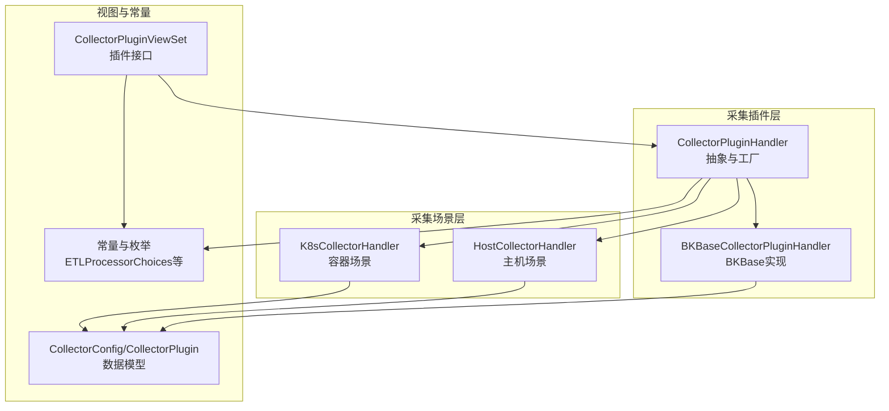
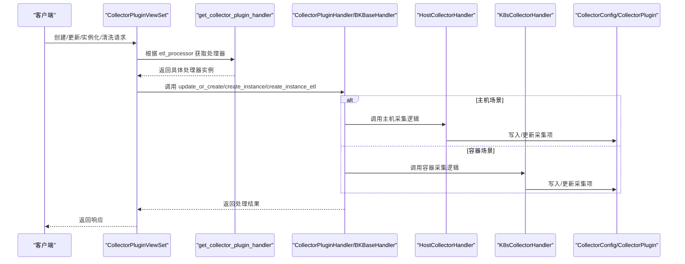
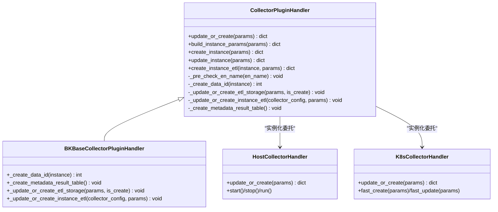
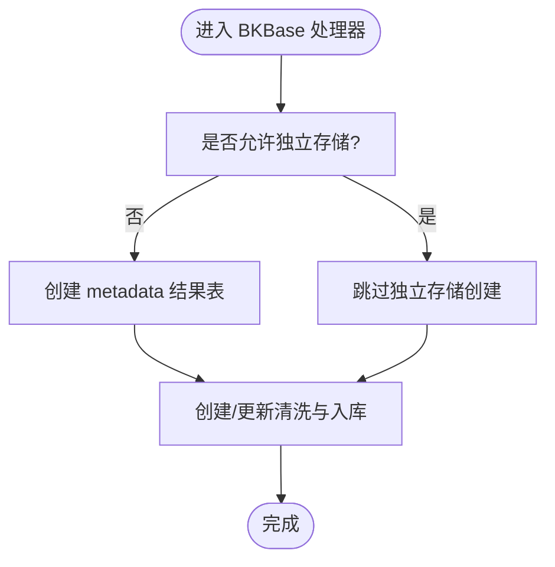
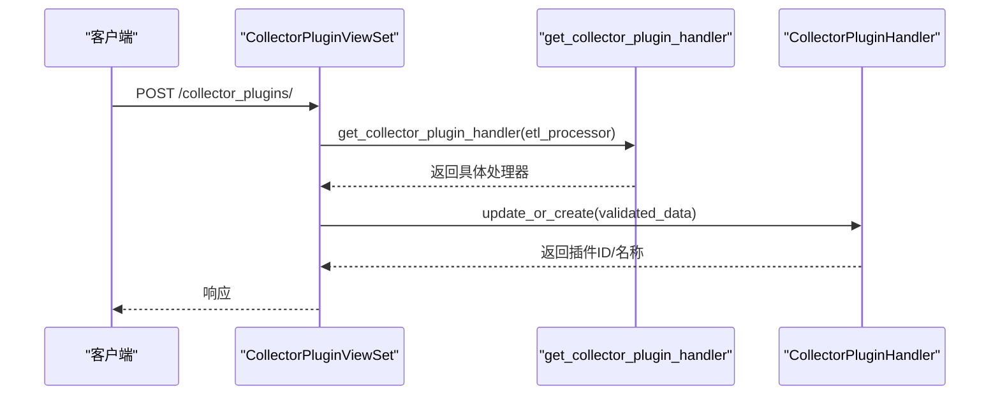
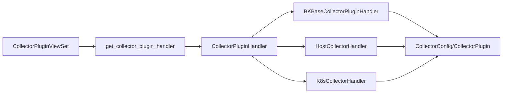

# 内置采集插件

<cite>
**本文引用的文件**
- [apps/log_databus/handlers/collector_plugin/base.py](file://apps/log_databus/handlers/collector_plugin/base.py)
- [apps/log_databus/handlers/collector_plugin/bkbase.py](file://apps/log_databus/handlers/collector_plugin/bkbase.py)
- [apps/log_databus/views/collector_plugin_views.py](file://apps/log_databus/views/collector_plugin_views.py)
- [apps/log_databus/constants.py](file://apps/log_databus/constants.py)
- [apps/log_databus/models.py](file://apps/log_databus/models.py)
- [apps/log_databus/handlers/collector/host.py](file://apps/log_databus/handlers/collector/host.py)
- [apps/log_databus/handlers/collector/k8s.py](file://apps/log_databus/handlers/collector/k8s.py)
</cite>

## 目录
1. [简介](#简介)
2. [项目结构](#项目结构)
3. [核心组件](#核心组件)
4. [架构总览](#架构总览)
5. [详细组件分析](#详细组件分析)
6. [依赖分析](#依赖分析)
7. [性能考虑](#性能考虑)
8. [故障排查指南](#故障排查指南)
9. [结论](#结论)
10. [附录](#附录)

## 简介
本文件面向“内置采集插件”的技术文档，聚焦于 BKBase 采集插件的实现原理、接口定义、参数配置、数据处理流程与错误处理机制。文档同时给出不同采集场景（主机日志、容器日志、自定义采集）下的插件选择策略与最佳实践，并提供配置示例与性能对比分析思路，帮助读者在实际生产环境中高效、稳定地使用内置采集插件。

## 项目结构
围绕采集插件的关键模块分布如下：
- 插件抽象与工厂：collector_plugin/base.py
- BKBase 插件实现：collector_plugin/bkbase.py
- 插件视图与接口：collector_plugin_views.py
- 常量与枚举：constants.py
- 数据模型：models.py
- 采集场景实现：collector/host.py（主机）、collector/k8s.py（容器）

图表来源
- [apps/log_databus/handlers/collector_plugin/base.py:41-52](file://apps/log_databus/handlers/collector_plugin/base.py#L41-L52)
- [apps/log_databus/handlers/collector_plugin/bkbase.py:29-88](file://apps/log_databus/handlers/collector_plugin/bkbase.py#L29-L88)
- [apps/log_databus/views/collector_plugin_views.py:28-56](file://apps/log_databus/views/collector_plugin_views.py#L28-L56)
- [apps/log_databus/constants.py:431-443](file://apps/log_databus/constants.py#L431-L443)
- [apps/log_databus/models.py:102-200](file://apps/log_databus/models.py#L102-L200)

章节来源
- [apps/log_databus/handlers/collector_plugin/base.py:41-52](file://apps/log_databus/handlers/collector_plugin/base.py#L41-L52)
- [apps/log_databus/handlers/collector_plugin/bkbase.py:29-88](file://apps/log_databus/handlers/collector_plugin/bkbase.py#L29-L88)
- [apps/log_databus/views/collector_plugin_views.py:28-56](file://apps/log_databus/views/collector_plugin_views.py#L28-L56)
- [apps/log_databus/constants.py:431-443](file://apps/log_databus/constants.py#L431-L443)
- [apps/log_databus/models.py:102-200](file://apps/log_databus/models.py#L102-L200)

## 核心组件
- 抽象插件处理器（CollectorPluginHandler）
  - 负责插件的创建/更新、参数补全、DATA ID 绑定、清洗与入库、独立存储创建等。
  - 支持根据 etl_processor 选择具体实现（例如 BKBase）。
- BKBase 插件处理器（BKBaseCollectorPluginHandler）
  - 在 BKBase 场景下，负责创建/更新 DATA ID、清洗规则与入库、独立存储结果表创建。
- 插件视图（CollectorPluginViewSet）
  - 提供创建、更新、实例化、实例清洗等接口，统一入口管理。
- 常量与枚举（ETLProcessorChoices、环境、容器采集类型等）
  - 定义数据处理器选择、采集场景、容器采集类型等。
- 数据模型（CollectorConfig、CollectorPlugin）
  - 描述采集项与采集插件的元数据、清洗配置、存储配置、DATA ID 等。

章节来源
- [apps/log_databus/handlers/collector_plugin/base.py:54-396](file://apps/log_databus/handlers/collector_plugin/base.py#L54-L396)
- [apps/log_databus/handlers/collector_plugin/bkbase.py:29-88](file://apps/log_databus/handlers/collector_plugin/bkbase.py#L29-L88)
- [apps/log_databus/views/collector_plugin_views.py:28-535](file://apps/log_databus/views/collector_plugin_views.py#L28-L535)
- [apps/log_databus/constants.py:431-443](file://apps/log_databus/constants.py#L431-L443)
- [apps/log_databus/models.py:102-200](file://apps/log_databus/models.py#L102-L200)

## 架构总览
内置采集插件以“插件抽象 + 具体实现 + 视图接口 + 场景适配”为核心架构，形成清晰的职责边界与扩展点。

图表来源
- [apps/log_databus/views/collector_plugin_views.py:162-164](file://apps/log_databus/views/collector_plugin_views.py#L162-L164)
- [apps/log_databus/handlers/collector_plugin/base.py:41-52](file://apps/log_databus/handlers/collector_plugin/base.py#L41-L52)
- [apps/log_databus/handlers/collector/host.py:183-384](file://apps/log_databus/handlers/collector/host.py#L183-L384)
- [apps/log_databus/handlers/collector/k8s.py:257-648](file://apps/log_databus/handlers/collector/k8s.py#L257-L648)

## 详细组件分析

### 组件A：插件抽象与工厂（CollectorPluginHandler + 工厂方法）
- 职责
  - 插件创建/更新：校验英文名、DATA ID 绑定、清洗规则、独立存储创建。
  - 参数补全：根据插件配置补全实例参数，支持独立/非独立 DATA ID、清洗、存储。
  - 实例化：将插件参数应用到采集项（主机/容器），创建 CollectorConfig。
- 关键流程
  - 工厂方法根据 etl_processor 返回具体处理器（如 BKBase）。
  - update_or_create 内部事务控制，确保一致性。
  - create_instance/update_instance 委托 HostCollectorHandler 完成采集项落地。
- 错误处理
  - 重名冲突、参数缺失、权限与可见性控制等均在抽象层统一处理。

图表来源
- [apps/log_databus/handlers/collector_plugin/base.py:54-396](file://apps/log_databus/handlers/collector_plugin/base.py#L54-L396)
- [apps/log_databus/handlers/collector_plugin/bkbase.py:29-88](file://apps/log_databus/handlers/collector_plugin/bkbase.py#L29-L88)
- [apps/log_databus/handlers/collector/host.py:183-384](file://apps/log_databus/handlers/collector/host.py#L183-L384)
- [apps/log_databus/handlers/collector/k8s.py:257-648](file://apps/log_databus/handlers/collector/k8s.py#L257-L648)

章节来源
- [apps/log_databus/handlers/collector_plugin/base.py:54-396](file://apps/log_databus/handlers/collector_plugin/base.py#L54-L396)
- [apps/log_databus/handlers/collector_plugin/bkbase.py:29-88](file://apps/log_databus/handlers/collector_plugin/bkbase.py#L29-L88)

### 组件B：BKBase 插件处理器（BKBaseCollectorPluginHandler）
- 职责
  - 在 BKBase 场景下创建/更新 DATA ID（含 Transfer 与 BKBASE 两段绑定）。
  - 根据插件配置创建清洗规则与入库（ETL）。
  - 若不允许独立存储，则创建 metadata 结果表。
- 关键点
  - etl_processor 为 BKBASE 时，清洗与入库由 EtlHandler 委派处理。
  - 存储集群信息通过 StorageHandler 获取，用于创建结果表。

图表来源
- [apps/log_databus/handlers/collector_plugin/bkbase.py:34-88](file://apps/log_databus/handlers/collector_plugin/bkbase.py#L34-L88)

章节来源
- [apps/log_databus/handlers/collector_plugin/bkbase.py:29-88](file://apps/log_databus/handlers/collector_plugin/bkbase.py#L29-L88)

### 组件C：插件视图（CollectorPluginViewSet）
- 职责
  - 提供创建、更新、实例化、实例清洗等接口。
  - 根据 etl_processor 选择对应处理器。
- 关键接口
  - 创建/更新插件：统一走 CollectorPluginHandler.update_or_create。
  - 实例化：将插件参数注入采集项（主机/容器）。
  - 实例清洗：为采集项单独创建清洗规则与入库。

图表来源
- [apps/log_databus/views/collector_plugin_views.py:72-164](file://apps/log_databus/views/collector_plugin_views.py#L72-L164)

章节来源
- [apps/log_databus/views/collector_plugin_views.py:28-535](file://apps/log_databus/views/collector_plugin_views.py#L28-L535)

### 组件D：采集场景适配（主机/容器）
- 主机场景（HostCollectorHandler）
  - 校验目标节点合法性、创建/更新采集项、DATA ID 绑定、订阅节点管理任务。
  - 支持启动/停止/销毁、重试实例、任务状态查询。
- 容器场景（K8sCollectorHandler）
  - 支持 YAML 模式与原生模式配置容器采集规则。
  - 支持命名空间、工作负载、标签/注解选择器、多行合并等。
  - 支持容器采集配置的创建、更新、重试与状态查询。

章节来源
- [apps/log_databus/handlers/collector/host.py:183-384](file://apps/log_databus/handlers/collector/host.py#L183-L384)
- [apps/log_databus/handlers/collector/k8s.py:257-648](file://apps/log_databus/handlers/collector/k8s.py#L257-L648)

## 依赖分析
- 处理器选择
  - 工厂方法通过 etl_processor 映射到具体处理器类（如 BKBase）。
- 数据流
  - 视图层 -> 工厂 -> 抽象处理器 -> 具体处理器 -> 场景处理器 -> 模型层。
- 外部依赖
  - 节点管理（订阅/任务）、TransferApi（DATA ID）、Kubernetes API（容器场景）。

图表来源
- [apps/log_databus/handlers/collector_plugin/base.py:41-52](file://apps/log_databus/handlers/collector_plugin/base.py#L41-L52)
- [apps/log_databus/views/collector_plugin_views.py:162-164](file://apps/log_databus/views/collector_plugin_views.py#L162-L164)
- [apps/log_databus/models.py:102-200](file://apps/log_databus/models.py#L102-L200)

章节来源
- [apps/log_databus/handlers/collector_plugin/base.py:41-52](file://apps/log_databus/handlers/collector_plugin/base.py#L41-L52)
- [apps/log_databus/views/collector_plugin_views.py:162-164](file://apps/log_databus/views/collector_plugin_views.py#L162-L164)
- [apps/log_databus/models.py:102-200](file://apps/log_databus/models.py#L102-L200)

## 性能考虑
- 并发与事务
  - 插件创建/更新采用数据库事务，保证一致性；建议在批量操作时合并请求，减少事务开销。
- 清洗与入库
  - ETL 处理器按配置执行，建议在插件层面预设合理的清洗参数，避免运行期频繁变更。
- 容器场景
  - YAML 模式可减少参数序列化/反序列化成本；合理设置命名空间与选择器，降低无效扫描。
- 订阅与任务
  - 主机场景通过节点管理订阅执行，建议控制目标节点规模与重试频率，避免任务风暴。

## 故障排查指南
- 常见异常与定位
  - 插件/采集项重名：检查英文名唯一性校验。
  - DATA ID 绑定失败：确认 etl_processor 与数据链路配置。
  - 容器配置校验失败：检查 YAML 解析与命名空间/选择器合法性。
  - 非法 IP/主机越权：主机场景会校验目标节点合法性。
- 日志与状态
  - 主机场景支持任务实例日志与状态格式化输出，便于前端展示与排障。
  - 容器场景支持任务状态查询与重试。

章节来源
- [apps/log_databus/handlers/collector_plugin/base.py:75-84](file://apps/log_databus/handlers/collector_plugin/base.py#L75-L84)
- [apps/log_databus/handlers/collector/host.py:415-436](file://apps/log_databus/handlers/collector/host.py#L415-L436)
- [apps/log_databus/handlers/collector/k8s.py:276-280](file://apps/log_databus/handlers/collector/k8s.py#L276-L280)

## 结论
内置采集插件通过“抽象处理器 + 具体实现 + 视图接口 + 场景适配”的架构，实现了对多种采集场景的统一管理与扩展。BKBase 插件处理器在数据处理引擎选择、DATA ID 绑定、清洗与入库、独立存储等方面提供了完备的能力。结合主机与容器场景的具体实现，用户可在不同环境下灵活选择与配置采集插件，满足多样化的日志采集需求。

## 附录

### 插件参数与配置要点
- 必填参数
  - etl_processor：选择数据处理引擎（如 BKBASE）。
  - collector_plugin_name/collector_plugin_name_en：插件名称与英文名。
  - collector_scenario_id：采集场景（如 custom）。
  - category_id：数据分类。
  - data_encoding：日志字符集。
- 可选参数
  - is_allow_alone_data_id/is_allow_alone_etl_config/is_allow_alone_storage：是否允许独立 DATA ID/清洗/存储。
  - etl_config/etl_params/fields：清洗配置与字段定义。
  - storage_cluster_id/retention/storage_replies 等：存储配置。
- 实例化参数
  - 主机：target_nodes/target_node_type 等。
  - 容器：configs/yaml_config/yaml_config_enabled 等。

章节来源
- [apps/log_databus/views/collector_plugin_views.py:78-149](file://apps/log_databus/views/collector_plugin_views.py#L78-L149)
- [apps/log_databus/constants.py:431-443](file://apps/log_databus/constants.py#L431-L443)

### 不同采集场景的选择策略
- 主机日志采集
  - 适用于传统虚拟机/物理机日志采集，支持目标节点动态/静态、字符集、过滤条件等。
- 容器日志采集
  - 适用于 Kubernetes 环境，支持命名空间、工作负载、标签/注解选择器、多行合并等。
- 自定义采集
  - 通过插件参数与 YAML 模式灵活配置采集规则，适合复杂场景。

章节来源
- [apps/log_databus/handlers/collector/host.py:183-384](file://apps/log_databus/handlers/collector/host.py#L183-L384)
- [apps/log_databus/handlers/collector/k8s.py:257-648](file://apps/log_databus/handlers/collector/k8s.py#L257-L648)

### 最佳实践
- 预设清洗参数：在插件层面定义合理的 etl_params/fields，减少运行期变更。
- 合理选择独立能力：仅在确有需要时开启独立 DATA ID/清洗/存储，避免资源浪费。
- 容器场景优化：使用 YAML 模式与精确的选择器，减少无效扫描。
- 监控与重试：关注任务状态与日志，必要时进行重试与实例修复。

### 性能对比分析思路
- 采集吞吐
  - 对比不同 etl_processor（如 BKBASE 与 Transfer）在相同硬件与数据量下的处理延迟与资源占用。
- 清洗复杂度
  - 对比正则/分隔符/JSON 等不同清洗方式的 CPU 与内存消耗。
- 存储写入
  - 对比独立存储与共享存储在写入延迟与查询性能上的差异。
- 容器场景
  - 对比 YAML 模式与原生模式在配置解析与下发效率上的差异。