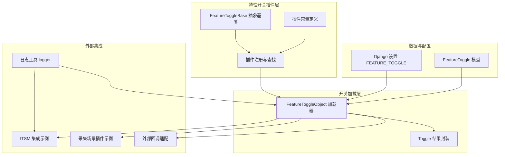
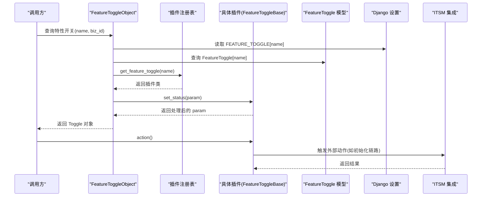
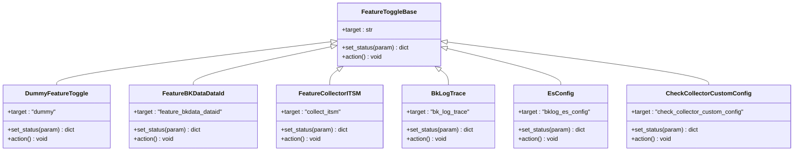
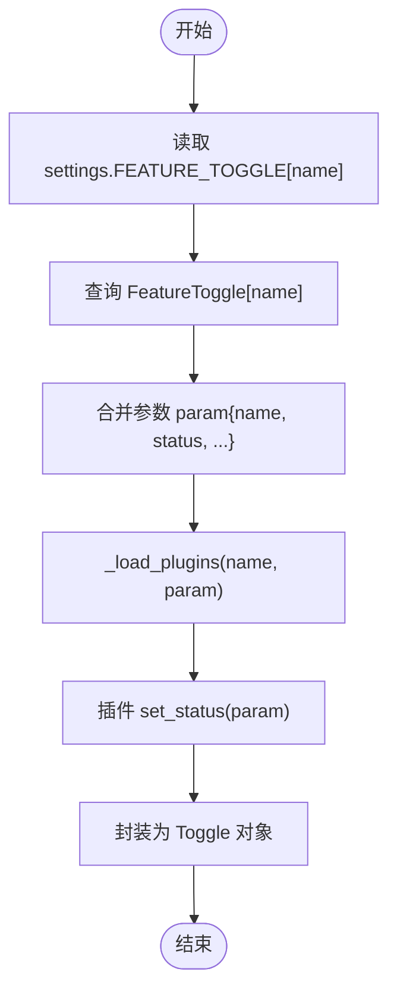
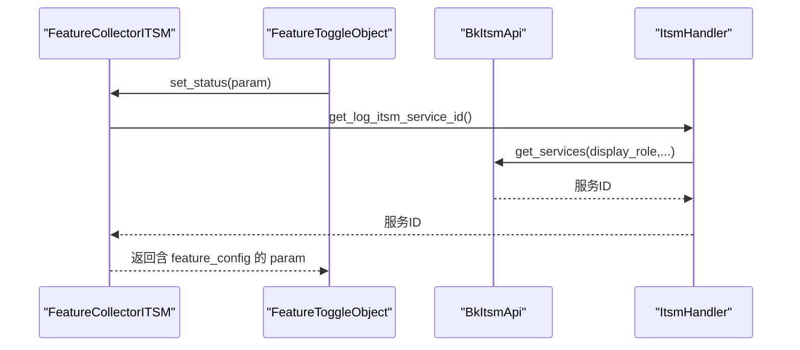
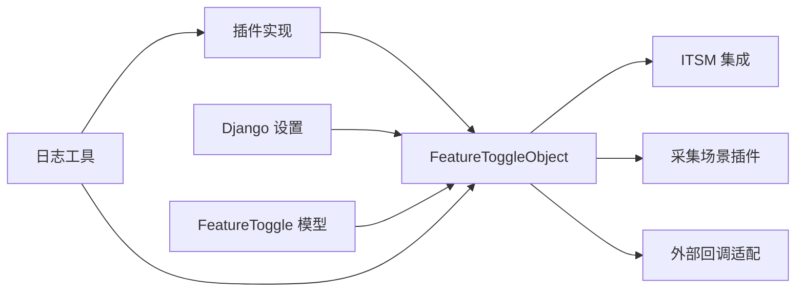

# 插件开发指南

<cite>
**本文档引用的文件**
- [apps/feature_toggle/plugins/base.py](file://apps/feature_toggle/plugins/base.py)
- [apps/feature_toggle/plugins/constants.py](file://apps/feature_toggle/plugins/constants.py)
- [apps/feature_toggle/handlers/toggle.py](file://apps/feature_toggle/handlers/toggle.py)
- [apps/feature_toggle/models.py](file://apps/feature_toggle/models.py)
- [apps/log_databus/handlers/itsm.py](file://apps/log_databus/handlers/itsm.py)
- [apps/utils/log.py](file://apps/utils/log.py)
- [apps/log_databus/handlers/collector_plugin/__init__.py](file://apps/log_databus/handlers/collector_plugin/__init__.py)
- [apps/log_databus/handlers/collector_scenario/kafka.py](file://apps/log_databus/handlers/collector_scenario/kafka.py)
- [log_adapter/home/views.py](file://log_adapter/home/views.py)
</cite>

## 目录
1. [简介](#简介)
2. [项目结构](#项目结构)
3. [核心组件](#核心组件)
4. [架构总览](#架构总览)
5. [详细组件分析](#详细组件分析)
6. [依赖分析](#依赖分析)
7. [性能考虑](#性能考虑)
8. [故障排查指南](#故障排查指南)
9. [结论](#结论)
10. [附录](#附录)

## 简介
本指南面向蓝鲸日志平台（BK-LOG）的插件开发者，系统讲解如何基于现有框架开发“特性开关插件”。插件通过统一的抽象基类扩展特性开关的行为，支持动态加载、参数注入、动作触发与灰度控制。文档涵盖开发环境搭建、项目结构设计、接口规范、生命周期管理、异常处理与日志记录、测试与调试方法，以及可复用的代码模板与最佳实践。

## 项目结构
围绕“特性开关插件”的开发，主要涉及以下模块：
- 插件注册与基类：apps/feature_toggle/plugins
- 开关对象与加载器：apps/feature_toggle/handlers
- 数据模型：apps/feature_toggle/models
- 常量定义：apps/feature_toggle/plugins/constants.py
- 日志工具：apps/utils/log.py
- 采集器插件适配：apps/log_databus/handlers/collector_plugin
- 采集场景插件（示例）：apps/log_databus/handlers/collector_scenario/kafka.py
- 外部回调适配：log_adapter/home/views.py

图表来源
- [apps/feature_toggle/plugins/base.py:40-72](file://apps/feature_toggle/plugins/base.py#L40-L72)
- [apps/feature_toggle/plugins/constants.py:22-74](file://apps/feature_toggle/plugins/constants.py#L22-L74)
- [apps/feature_toggle/handlers/toggle.py:62-146](file://apps/feature_toggle/handlers/toggle.py#L62-L146)
- [apps/feature_toggle/models.py:29-46](file://apps/feature_toggle/models.py#L29-L46)
- [apps/log_databus/handlers/itsm.py:47-120](file://apps/log_databus/handlers/itsm.py#L47-L120)
- [apps/utils/log.py:176-178](file://apps/utils/log.py#L176-L178)
- [apps/log_databus/handlers/collector_scenario/kafka.py:81-108](file://apps/log_databus/handlers/collector_scenario/kafka.py#L81-L108)
- [log_adapter/home/views.py:424-432](file://log_adapter/home/views.py#L424-L432)

章节来源
- [apps/feature_toggle/plugins/base.py:1-189](file://apps/feature_toggle/plugins/base.py#L1-L189)
- [apps/feature_toggle/plugins/constants.py:1-74](file://apps/feature_toggle/plugins/constants.py#L1-L74)
- [apps/feature_toggle/handlers/toggle.py:1-259](file://apps/feature_toggle/handlers/toggle.py#L1-L259)
- [apps/feature_toggle/models.py:1-46](file://apps/feature_toggle/models.py#L1-L46)
- [apps/log_databus/handlers/itsm.py:1-214](file://apps/log_databus/handlers/itsm.py#L1-L214)
- [apps/utils/log.py:1-206](file://apps/utils/log.py#L1-L206)
- [apps/log_databus/handlers/collector_plugin/__init__.py:1-24](file://apps/log_databus/handlers/collector_plugin/__init__.py#L1-L24)
- [apps/log_databus/handlers/collector_scenario/kafka.py:81-117](file://apps/log_databus/handlers/collector_scenario/kafka.py#L81-L117)
- [log_adapter/home/views.py:411-447](file://log_adapter/home/views.py#L411-L447)

## 核心组件
- 抽象基类 FeatureToggleBase：定义插件必须实现的两个接口，用于“参数处理”和“动作触发”。
- 插件注册机制：通过装饰器注册插件类到全局字典，按 target 名称分发。
- 加载器 FeatureToggleObject：从设置、数据库与插件三处合并配置，执行插件 set_status 并封装为 Toggle 对象。
- 数据模型 FeatureToggle：持久化特性开关配置、白/黑名单与业务配置。
- 常量定义：集中管理特性开关键名与默认值，便于跨模块引用。
- 日志工具 logger：统一记录插件执行过程中的信息与异常。

章节来源
- [apps/feature_toggle/plugins/base.py:40-72](file://apps/feature_toggle/plugins/base.py#L40-L72)
- [apps/feature_toggle/handlers/toggle.py:62-146](file://apps/feature_toggle/handlers/toggle.py#L62-L146)
- [apps/feature_toggle/models.py:29-46](file://apps/feature_toggle/models.py#L29-L46)
- [apps/feature_toggle/plugins/constants.py:22-74](file://apps/feature_toggle/plugins/constants.py#L22-L74)
- [apps/utils/log.py:176-178](file://apps/utils/log.py#L176-L178)

## 架构总览
下图展示了从配置到插件执行再到动作触发的整体流程，以及与外部系统的交互点。

图表来源
- [apps/feature_toggle/handlers/toggle.py:62-146](file://apps/feature_toggle/handlers/toggle.py#L62-L146)
- [apps/feature_toggle/plugins/base.py:32-72](file://apps/feature_toggle/plugins/base.py#L32-L72)
- [apps/feature_toggle/models.py:29-46](file://apps/feature_toggle/models.py#L29-L46)

## 详细组件分析

### 抽象基类与插件注册
- 必须实现的方法
  - set_status(param: dict) -> dict：接收包含 name、status、feature_config、biz_id_white_list、biz_id_black_list 等字段的参数，返回处理后的参数字典。
  - action()：在配置更新时触发的动作，需自行捕获异常以避免影响主流程。
- 注册机制
  - 使用 register 装饰器将插件类注册到全局字典，键为目标 target 名称。
  - 提供 get_feature_toggle(name) 用于按名称获取插件类，默认回退到 DummyFeatureToggle。

图表来源
- [apps/feature_toggle/plugins/base.py:40-189](file://apps/feature_toggle/plugins/base.py#L40-L189)

章节来源
- [apps/feature_toggle/plugins/base.py:40-72](file://apps/feature_toggle/plugins/base.py#L40-L72)
- [apps/feature_toggle/plugins/base.py:63-189](file://apps/feature_toggle/plugins/base.py#L63-L189)

### 加载器与结果封装
- FeatureToggleObject
  - switch(name, biz_id)：根据环境、白/黑名单与状态判断最终开关结果。
  - toggle(name)：合并 settings、数据库与插件三处配置，执行插件 set_status 并封装为 Toggle。
  - toggle_list(**filters)：获取过滤后的开关列表。
  - _load_plugins(name, param)：按名称获取插件类并执行 set_status。
- Toggle：对返回的字典进行封装，便于前端与调用方使用。

图表来源
- [apps/feature_toggle/handlers/toggle.py:62-146](file://apps/feature_toggle/handlers/toggle.py#L62-L146)
- [apps/feature_toggle/handlers/toggle.py:160-178](file://apps/feature_toggle/handlers/toggle.py#L160-L178)

章节来源
- [apps/feature_toggle/handlers/toggle.py:62-146](file://apps/feature_toggle/handlers/toggle.py#L62-L146)
- [apps/feature_toggle/handlers/toggle.py:160-178](file://apps/feature_toggle/handlers/toggle.py#L160-L178)

### 数据模型与配置
- FeatureToggle 模型包含 name、alias、status、description、is_viewed、feature_config、biz_id_white_list、biz_id_black_list 等字段，支持 JSON 存储复杂配置与黑白名单。
- 业务白/黑名单可用于灰度策略，结合开关状态与环境进行精细化控制。

章节来源
- [apps/feature_toggle/models.py:29-46](file://apps/feature_toggle/models.py#L29-L46)

### 常量定义
- 统一管理特性开关键名，如 FEATURE_BKDATA_DATAID、FEATURE_COLLECTOR_ITSM、BKLOG_ES_CONFIG 等，便于跨模块引用与维护。

章节来源
- [apps/feature_toggle/plugins/constants.py:22-74](file://apps/feature_toggle/plugins/constants.py#L22-L74)

### 日志记录与异常处理
- logger 提供统一的日志入口，支持带 trace_id 的详细追踪；插件内部建议使用 logger.info/exception 记录关键流程与异常。
- 插件 action 方法需自行 try/except，确保异常不影响主流程。

章节来源
- [apps/utils/log.py:176-178](file://apps/utils/log.py#L176-L178)
- [apps/feature_toggle/plugins/base.py:54-60](file://apps/feature_toggle/plugins/base.py#L54-L60)

### 外部集成示例（ITSM）
- FeatureCollectorITSM 插件在 set_status 中从 ITSM 获取服务 ID 并写入 feature_config，若失败则回退关闭状态。
- ITSM 集成通过 ItsmHandler 完成单据申请、状态查询与回调处理。

图表来源
- [apps/feature_toggle/plugins/base.py:90-110](file://apps/feature_toggle/plugins/base.py#L90-L110)
- [apps/log_databus/handlers/itsm.py:81-103](file://apps/log_databus/handlers/itsm.py#L81-L103)

章节来源
- [apps/feature_toggle/plugins/base.py:90-110](file://apps/feature_toggle/plugins/base.py#L90-L110)
- [apps/log_databus/handlers/itsm.py:47-120](file://apps/log_databus/handlers/itsm.py#L47-L120)

### 采集器插件适配（示例）
- 采集场景插件通过步骤配置声明安装与运行插件，体现“插件化”在采集链路中的应用。
- 步骤中包含 MAIN_INSTALL_PLUGIN 与目标插件配置，以及上下文参数传递。

章节来源
- [apps/log_databus/handlers/collector_scenario/kafka.py:81-108](file://apps/log_databus/handlers/collector_scenario/kafka.py#L81-L108)

### 外部回调适配
- log_adapter/home/views 提供外部回调入口，负责解析请求、记录日志并调用相应处理逻辑，异常时统一记录并返回错误响应。

章节来源
- [log_adapter/home/views.py:424-447](file://log_adapter/home/views.py#L424-L447)

## 依赖分析
- 插件层依赖加载器与注册表，通过 target 名称解耦具体实现。
- 加载器依赖 Django 设置、数据库模型与日志工具。
- 外部系统（如 ITSM）通过插件注入配置或触发动作。
- 采集器场景插件与外部适配器共同构成“插件化采集”能力。

图表来源
- [apps/feature_toggle/handlers/toggle.py:62-146](file://apps/feature_toggle/handlers/toggle.py#L62-L146)
- [apps/feature_toggle/plugins/base.py:32-72](file://apps/feature_toggle/plugins/base.py#L32-L72)
- [apps/log_databus/handlers/itsm.py:47-120](file://apps/log_databus/handlers/itsm.py#L47-L120)
- [apps/log_databus/handlers/collector_scenario/kafka.py:81-108](file://apps/log_databus/handlers/collector_scenario/kafka.py#L81-L108)
- [log_adapter/home/views.py:424-447](file://log_adapter/home/views.py#L424-L447)

## 性能考虑
- 插件 set_status 应尽量避免重 IO 与长耗时操作，必要时异步化或缓存结果。
- 加载器在合并配置时应减少数据库查询次数，优先利用 settings 与内存缓存。
- 日志输出建议按级别区分，避免在高频路径中产生过多日志。
- 外部系统调用（如 ITSM）应设置超时与重试策略，防止阻塞主流程。

## 故障排查指南
- 插件未生效
  - 检查插件是否正确注册到 FEATURE_TOGGLE 字典，target 名称是否与开关名称一致。
  - 确认 FeatureToggleObject.toggle(name) 返回的 status 与 feature_config 是否符合预期。
- 灰度策略不生效
  - 核对 settings.FEATURE_TOGGLE 与数据库 FeatureToggle 的状态、白/黑名单配置。
  - 检查环境变量 ENVIRONMENT 是否满足 debug 条件。
- 外部系统异常
  - 查看 ITSM 接口调用日志，确认服务 ID 获取与回调处理是否成功。
  - 在插件 action 中增加异常捕获与降级逻辑。
- 日志定位
  - 使用 logger.exception 记录堆栈信息，结合 trace_id 追踪请求链路。

章节来源
- [apps/feature_toggle/handlers/toggle.py:31-44](file://apps/feature_toggle/handlers/toggle.py#L31-L44)
- [apps/feature_toggle/handlers/toggle.py:160-178](file://apps/feature_toggle/handlers/toggle.py#L160-L178)
- [apps/log_databus/handlers/itsm.py:81-120](file://apps/log_databus/handlers/itsm.py#L81-L120)
- [apps/utils/log.py:176-178](file://apps/utils/log.py#L176-L178)

## 结论
通过统一的抽象基类与加载器，BK-LOG 的特性开关插件体系实现了“可插拔、可配置、可灰度”的能力。开发者只需遵循接口规范、合理组织参数与动作、完善日志与异常处理，即可快速构建稳定可靠的插件。建议在开发过程中充分利用常量定义、模型配置与日志工具，配合完善的测试与灰度策略，确保插件在生产环境中的可靠性与可观测性。

## 附录

### 开发流程清单
- 环境准备
  - 确保 Django 环境与依赖已就绪，理解 FEATURE_TOGGLE 配置方式。
- 项目结构
  - 在 apps/feature_toggle/plugins 下新增插件文件，定义插件类并继承 FeatureToggleBase。
- 接口实现
  - 实现 set_status 与 action，前者处理参数注入，后者处理动作触发。
  - 使用 register 装饰器注册插件，确保 target 唯一。
- 生命周期管理
  - 在插件中处理开关状态变化带来的副作用，必要时调用外部系统。
- 异常处理与日志
  - 在插件内使用 logger 记录关键信息与异常，action 内捕获异常避免影响主流程。
- 测试与调试
  - 编写单元测试覆盖 set_status 与 action 的关键分支。
  - 利用 Django Admin 或接口验证 FeatureToggleObject.toggle(name) 的行为。
  - 在不同环境与白/黑名单组合下进行灰度验证。

### 接口规范与实现要求
- 必须实现的方法
  - set_status(param: dict) -> dict：接收包含 name、status、feature_config、biz_id_white_list、biz_id_black_list 等字段，返回处理后的参数字典。
  - action()：在配置更新时触发的动作，需自行捕获异常。
- 参数定义
  - name：特性开关名称，与插件 target 一致。
  - status：开关状态（如 off/debug/on）。
  - feature_config：JSON 配置对象，用于向下游传递参数。
  - biz_id_white_list/biz_id_black_list：业务白/黑名单，用于灰度控制。
- 返回值格式
  - set_status 返回处理后的 param 字典。
  - action 无返回值，但可能抛出异常（需在调用侧捕获）。

章节来源
- [apps/feature_toggle/plugins/base.py:43-60](file://apps/feature_toggle/plugins/base.py#L43-L60)
- [apps/feature_toggle/handlers/toggle.py:68-105](file://apps/feature_toggle/handlers/toggle.py#L68-L105)

### 示例与代码模板
- 插件模板（参考现有实现）
  - 参考路径：[apps/feature_toggle/plugins/base.py:63-189](file://apps/feature_toggle/plugins/base.py#L63-L189)
- ITSM 集成示例
  - 参考路径：[apps/feature_toggle/plugins/base.py:90-110](file://apps/feature_toggle/plugins/base.py#L90-L110)，[apps/log_databus/handlers/itsm.py:81-120](file://apps/log_databus/handlers/itsm.py#L81-L120)
- 采集场景插件示例
  - 参考路径：[apps/log_databus/handlers/collector_scenario/kafka.py:81-108](file://apps/log_databus/handlers/collector_scenario/kafka.py#L81-L108)
- 外部回调适配
  - 参考路径：[log_adapter/home/views.py:424-447](file://log_adapter/home/views.py#L424-L447)

### 测试与调试建议
- 单元测试
  - 验证 set_status 在不同输入下的输出一致性。
  - 验证 action 在正常与异常场景下的行为。
- 集成测试
  - 通过 FeatureToggleObject.toggle(name) 验证合并逻辑与灰度策略。
  - 在不同环境与白/黑名单组合下验证开关状态。
- 调试技巧
  - 使用 logger.exception 输出异常堆栈。
  - 在插件 action 中增加降级逻辑，避免影响整体流程。

章节来源
- [apps/feature_toggle/handlers/toggle.py:62-146](file://apps/feature_toggle/handlers/toggle.py#L62-L146)
- [apps/utils/log.py:176-178](file://apps/utils/log.py#L176-L178)