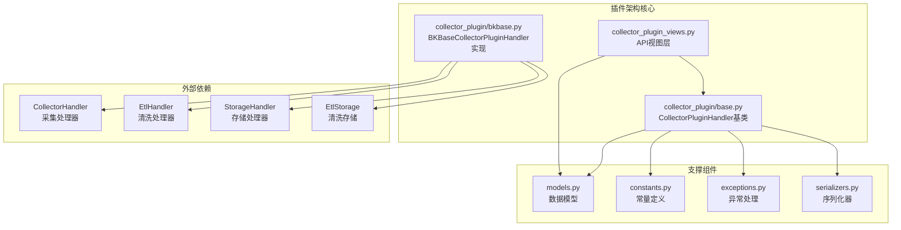
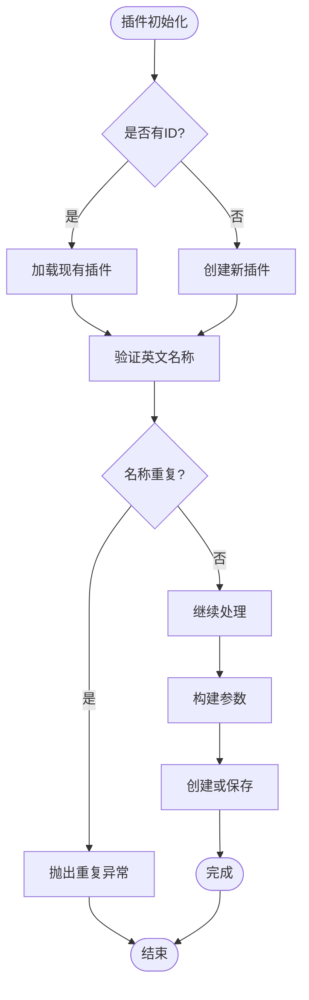
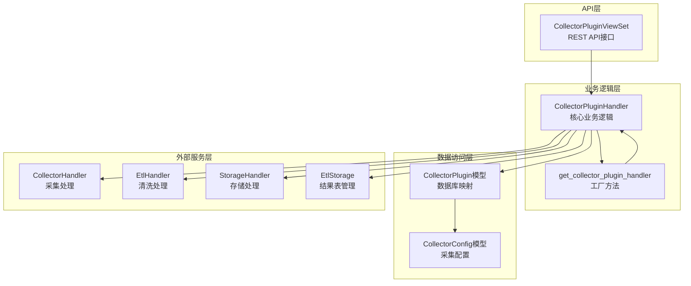
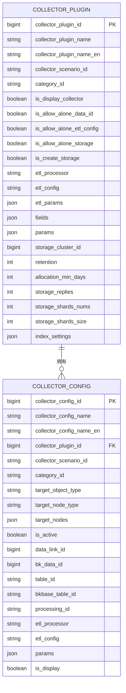
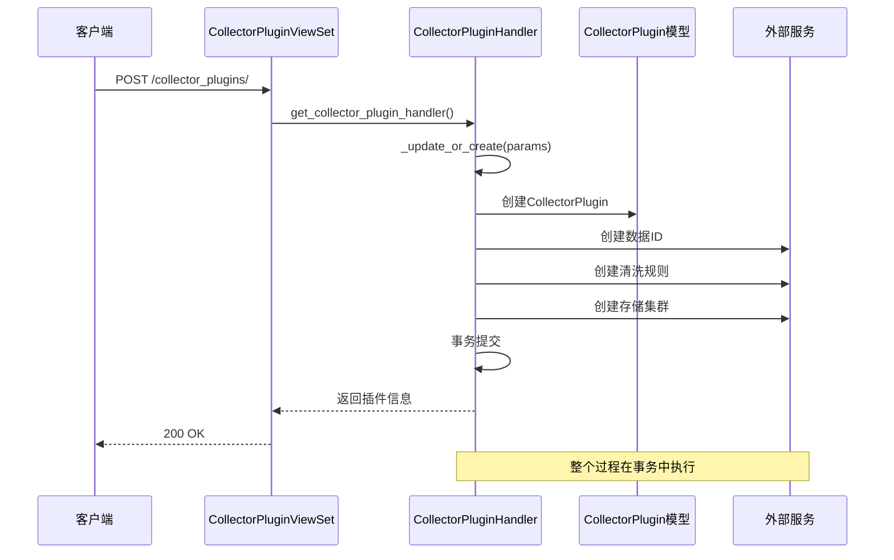
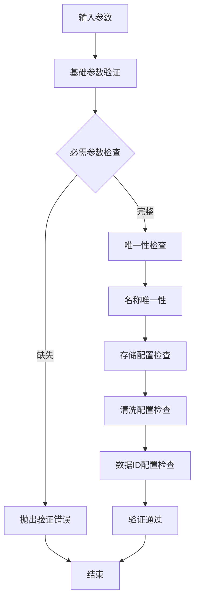
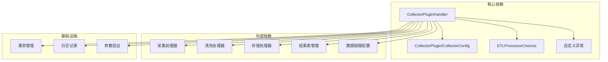
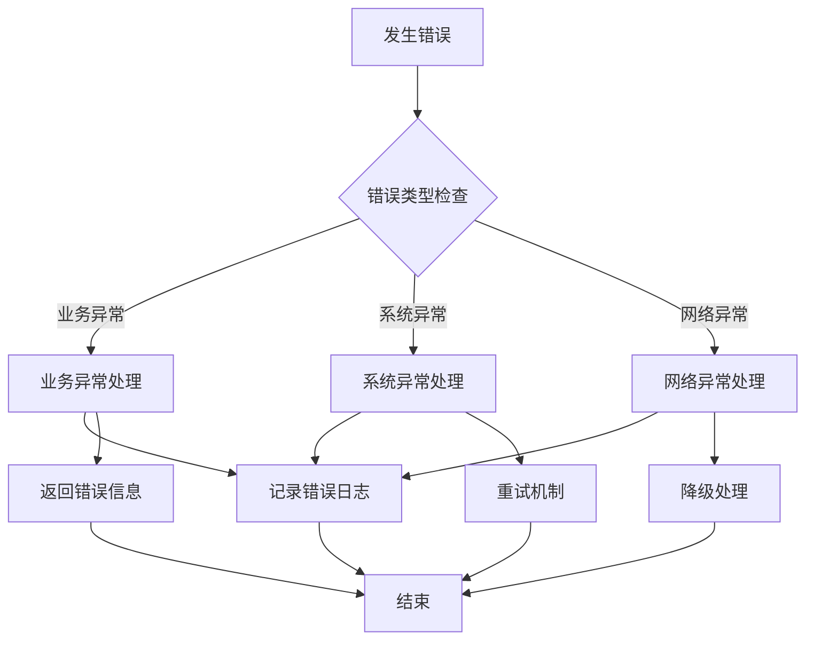

# 插件架构设计

<cite>
**本文档引用的文件**
- [apps/log_databus/handlers/collector_plugin/base.py](file://apps/log_databus/handlers/collector_plugin/base.py)
- [apps/log_databus/handlers/collector_plugin/bkbase.py](file://apps/log_databus/handlers/collector_plugin/bkbase.py)
- [apps/log_databus/views/collector_plugin_views.py](file://apps/log_databus/views/collector_plugin_views.py)
- [apps/log_databus/models.py](file://apps/log_databus/models.py)
- [apps/log_databus/constants.py](file://apps/log_databus/constants.py)
- [apps/log_databus/exceptions.py](file://apps/log_databus/exceptions.py)
- [apps/log_databus/serializers.py](file://apps/log_databus/serializers.py)
</cite>

## 目录
1. [简介](#简介)
2. [项目结构](#项目结构)
3. [核心组件](#核心组件)
4. [架构概览](#架构概览)
5. [详细组件分析](#详细组件分析)
6. [依赖分析](#依赖分析)
7. [性能考虑](#性能考虑)
8. [故障排查指南](#故障排查指南)
9. [结论](#结论)

## 简介

蓝鲸日志平台的插件架构设计围绕CollectorPluginHandler基类展开，实现了采集插件的统一管理、动态扩展和生命周期管理。该架构支持多种数据处理器（ETL Processor），通过工厂模式实现插件的动态加载和实例化。

插件架构的核心设计理念包括：
- **统一抽象层**：CollectorPluginHandler基类提供标准化的插件接口
- **动态扩展**：支持通过ETL处理器选择不同的插件实现
- **生命周期管理**：完整的插件创建、更新、实例化和清理流程
- **参数验证**：严格的参数校验和约束检查
- **事务管理**：确保数据一致性的原子操作

## 项目结构

插件架构主要分布在以下目录和文件中：



**图表来源**
- [apps/log_databus/handlers/collector_plugin/base.py:1-396](file://apps/log_databus/handlers/collector_plugin/base.py#L1-L396)
- [apps/log_databus/handlers/collector_plugin/bkbase.py:1-88](file://apps/log_databus/handlers/collector_plugin/bkbase.py#L1-L88)

**章节来源**
- [apps/log_databus/handlers/collector_plugin/base.py:1-396](file://apps/log_databus/handlers/collector_plugin/base.py#L1-L396)
- [apps/log_databus/handlers/collector_plugin/bkbase.py:1-88](file://apps/log_databus/handlers/collector_plugin/bkbase.py#L1-L88)

## 核心组件

### CollectorPluginHandler基类

CollectorPluginHandler是整个插件架构的核心基类，提供了统一的插件管理和生命周期管理接口。

#### 核心功能特性

1. **插件初始化机制**
   - 支持通过collector_plugin_id参数初始化现有插件
   - 自动加载对应的CollectorPlugin模型实例
   - 异常处理：插件不存在时抛出CollectorPluginNotExistException

2. **参数验证系统**
   - 英文名称唯一性检查
   - 重复名称冲突检测
   - 参数完整性验证

3. **生命周期管理**
   - 插件创建和更新的原子性操作
   - 数据一致性保证（事务管理）
   - 用户操作记录追踪

#### 关键方法分析



**图表来源**
- [apps/log_databus/handlers/collector_plugin/base.py:59-240](file://apps/log_databus/handlers/collector_plugin/base.py#L59-L240)

**章节来源**
- [apps/log_databus/handlers/collector_plugin/base.py:54-396](file://apps/log_databus/handlers/collector_plugin/base.py#L54-L396)

### BKBaseCollectorPluginHandler实现

BKBaseCollectorPluginHandler是针对数据平台（BKBASE）的插件实现，继承了CollectorPluginHandler的所有功能并添加了特定的数据平台处理逻辑。

#### 特殊处理机制

1. **数据ID创建流程**
   - 先创建metadata数据ID
   - 再创建实际的数据平台数据ID
   - 支持转移处理器（TRANSFER）作为中间层

2. **存储结果表管理**
   - 自动创建结果表（当不允许独立存储时）
   - 支持集群信息获取和配置
   - 索引设置和分片配置管理

3. **清洗规则集成**
   - 与EtlHandler的无缝集成
   - 支持实例级清洗规则创建
   - 清洗参数和字段的动态配置

**章节来源**
- [apps/log_databus/handlers/collector_plugin/bkbase.py:29-88](file://apps/log_databus/handlers/collector_plugin/bkbase.py#L29-L88)

## 架构概览

插件架构采用分层设计，实现了清晰的关注点分离：



**图表来源**
- [apps/log_databus/views/collector_plugin_views.py:28-535](file://apps/log_databus/views/collector_plugin_views.py#L28-L535)
- [apps/log_databus/handlers/collector_plugin/base.py:41-52](file://apps/log_databus/handlers/collector_plugin/base.py#L41-L52)

### 扩展性设计

插件架构通过以下机制实现良好的扩展性：

1. **工厂模式实现**
   ```python
   def get_collector_plugin_handler(etl_processor, collector_plugin_id=None):
       mapping = {
           ETLProcessorChoices.BKBASE.value: "BKBaseCollectorPluginHandler",
       }
       # 动态导入和实例化
   ```

2. **插件注册机制**
   - 通过ETL处理器类型自动注册
   - 支持新的处理器类型扩展
   - 动态模块加载机制

3. **插件工厂模式**
   - 统一的插件创建接口
   - 参数驱动的插件实例化
   - 生命周期管理的标准化

**章节来源**
- [apps/log_databus/handlers/collector_plugin/base.py:41-52](file://apps/log_databus/handlers/collector_plugin/base.py#L41-L52)
- [apps/log_databus/constants.py:430-442](file://apps/log_databus/constants.py#L430-L442)

## 详细组件分析

### 数据模型设计

插件架构的核心数据模型包括CollectorPlugin和CollectorConfig两个主要实体：



**图表来源**
- [apps/log_databus/models.py:682-750](file://apps/log_databus/models.py#L682-L750)
- [apps/log_databus/models.py:102-200](file://apps/log_databus/models.py#L102-L200)

#### 关键字段说明

1. **插件标识字段**
   - `collector_plugin_name_en`: 英文名称，用于URL和API标识
   - `collector_scenario_id`: 采集场景标识
   - `category_id`: 数据分类标识

2. **可见性控制**
   - `is_display_collector`: 控制插件在UI中的可见性
   - `is_allow_alone_*`: 各种资源的独立性控制开关

3. **存储配置**
   - `storage_cluster_id`: 存储集群引用
   - `retention`: 数据保留天数
   - `index_settings`: ES索引配置

**章节来源**
- [apps/log_databus/models.py:682-822](file://apps/log_databus/models.py#L682-L822)

### API接口设计

插件架构提供了完整的REST API接口，支持插件的全生命周期管理：



**图表来源**
- [apps/log_databus/views/collector_plugin_views.py:72-164](file://apps/log_databus/views/collector_plugin_views.py#L72-L164)
- [apps/log_databus/handlers/collector_plugin/base.py:120-240](file://apps/log_databus/handlers/collector_plugin/base.py#L120-L240)

#### 核心API端点

1. **插件创建**
   - 方法：POST `/databus/collector_plugins/`
   - 功能：创建新的采集插件
   - 参数：插件基本信息、清洗配置、存储设置

2. **插件更新**
   - 方法：POST `/databus/collector_plugins/{id}/`
   - 功能：更新现有插件配置
   - 参数：部分或全部插件字段

3. **插件实例化**
   - 方法：POST `/databus/collector_plugins/{id}/instances/`
   - 功能：基于插件创建具体的采集项
   - 参数：采集目标、参数配置

4. **实例更新**
   - 方法：PUT `/databus/collector_plugins/update_instance/`
   - 功能：更新已存在的采集项
   - 参数：采集项ID和更新参数

5. **实例清洗**
   - 方法：POST `/databus/collector_plugins/{id}/instance_etl/`
   - 功能：为特定采集项创建清洗规则
   - 参数：清洗配置和字段定义

**章节来源**
- [apps/log_databus/views/collector_plugin_views.py:28-535](file://apps/log_databus/views/collector_plugin_views.py#L28-L535)

### 参数验证机制

插件架构实现了多层次的参数验证机制，确保数据的完整性和一致性：



**图表来源**
- [apps/log_databus/serializers.py:1195-1248](file://apps/log_databus/serializers.py#L1195-L1248)
- [apps/log_databus/handlers/collector_plugin/base.py:75-84](file://apps/log_databus/handlers/collector_plugin/base.py#L75-L84)

#### 验证规则

1. **基础验证**
   - 必需字段检查
   - 数据类型验证
   - 格式规范检查

2. **业务验证**
   - 英文名称唯一性
   - 业务ID有效性
   - 权限检查

3. **配置验证**
   - 存储配置完整性
   - 清洗规则合法性
   - 数据链路有效性

**章节来源**
- [apps/log_databus/serializers.py:1195-1345](file://apps/log_databus/serializers.py#L1195-L1345)

## 依赖分析

插件架构的依赖关系体现了清晰的分层设计：



**图表来源**
- [apps/log_databus/handlers/collector_plugin/base.py:22-36](file://apps/log_databus/handlers/collector_plugin/base.py#L22-L36)
- [apps/log_databus/handlers/collector_plugin/bkbase.py:20-26](file://apps/log_databus/handlers/collector_plugin/bkbase.py#L20-L26)

### 外部服务集成

插件架构与多个外部服务进行深度集成：

1. **数据平台集成**
   - 数据ID创建和管理
   - 结果表同步和配置
   - 清洗规则应用

2. **存储系统集成**
   - ES集群配置和管理
   - 分片和副本策略
   - 索引设置优化

3. **数据链路集成**
   - 采集链路绑定
   - 数据传输配置
   - 路由策略管理

**章节来源**
- [apps/log_databus/handlers/collector_plugin/bkbase.py:34-87](file://apps/log_databus/handlers/collector_plugin/bkbase.py#L34-L87)

## 性能考虑

插件架构在设计时充分考虑了性能优化：

### 事务管理
- 所有插件操作都在事务中执行，确保数据一致性
- 原子性操作避免部分更新导致的数据不一致

### 缓存策略
- 集成缓存机制减少重复查询
- 配置信息的本地缓存优化

### 异步处理
- 用户操作记录异步处理
- 大数据量操作的批处理

## 故障排查指南

### 常见问题诊断

1. **插件创建失败**
   - 检查英文名称唯一性
   - 验证必需参数完整性
   - 确认权限和业务ID有效性

2. **存储配置错误**
   - 验证存储集群连通性
   - 检查索引设置合法性
   - 确认分片和副本配置

3. **清洗规则异常**
   - 验证字段定义完整性
   - 检查ETL参数格式
   - 确认数据类型匹配

### 错误处理机制



**图表来源**
- [apps/log_databus/exceptions.py:58-160](file://apps/log_databus/exceptions.py#L58-L160)

**章节来源**
- [apps/log_databus/exceptions.py:50-249](file://apps/log_databus/exceptions.py#L50-L249)

## 结论

蓝鲸日志平台的插件架构设计体现了现代软件架构的最佳实践：

### 设计优势

1. **高度模块化**：通过CollectorPluginHandler基类实现统一抽象
2. **良好扩展性**：支持动态插件加载和工厂模式扩展
3. **强健的验证机制**：多层次参数验证确保数据质量
4. **完善的生命周期管理**：从创建到销毁的完整流程控制
5. **清晰的分层设计**：API层、业务层、数据层职责明确

### 技术亮点

- **事务一致性**：所有操作都在事务中执行，确保数据完整性
- **灵活的配置管理**：支持多种存储和清洗配置组合
- **强大的错误处理**：完善的异常处理和恢复机制
- **可观测性设计**：完整的用户操作记录和审计跟踪

### 发展建议

1. **插件生态扩展**：支持更多ETL处理器类型的集成
2. **性能优化**：进一步优化大体量数据处理性能
3. **监控增强**：增加更详细的运行时监控指标
4. **自动化运维**：提升插件的自动化部署和管理能力

该插件架构为蓝鲸日志平台提供了稳定、可扩展的采集插件管理能力，为后续的功能扩展和技术演进奠定了坚实的基础。