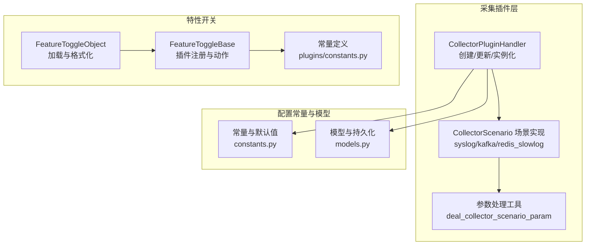
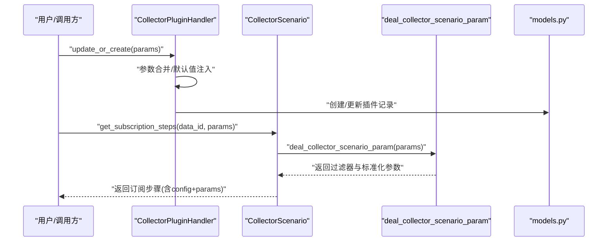
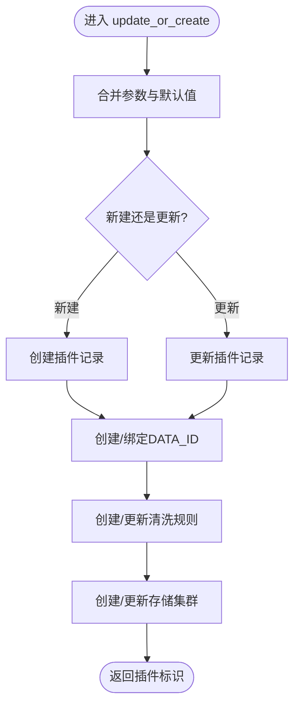
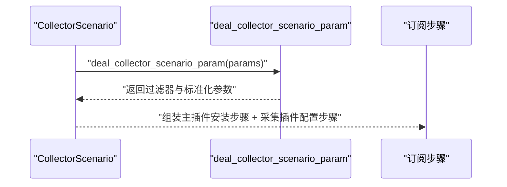
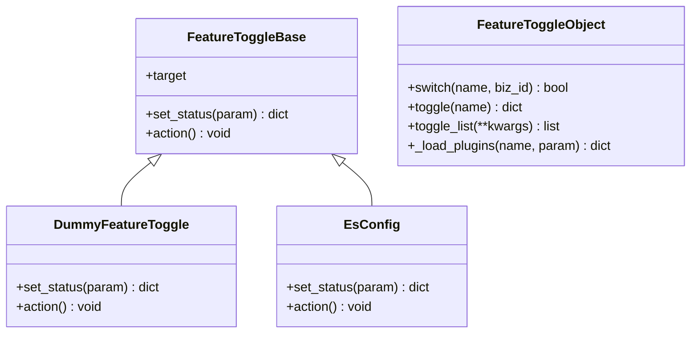
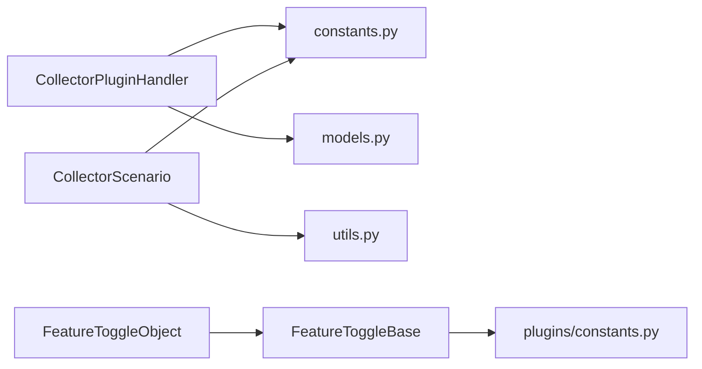

# 插件配置管理

<cite>
**本文引用的文件**
- [apps/log_databus/handlers/collector_plugin/base.py](file://apps/log_databus/handlers/collector_plugin/base.py)
- [apps/log_databus/handlers/collector_scenario/syslog.py](file://apps/log_databus/handlers/collector_scenario/syslog.py)
- [apps/log_databus/handlers/collector_scenario/kafka.py](file://apps/log_databus/handlers/collector_scenario/kafka.py)
- [apps/log_databus/handlers/collector_scenario/redis_slowlog.py](file://apps/log_databus/handlers/collector_scenario/redis_slowlog.py)
- [apps/log_databus/handlers/collector_scenario/utils.py](file://apps/log_databus/handlers/collector_scenario/utils.py)
- [apps/log_databus/constants.py](file://apps/log_databus/constants.py)
- [apps/log_databus/models.py](file://apps/log_databus/models.py)
- [apps/feature_toggle/plugins/base.py](file://apps/feature_toggle/plugins/base.py)
- [apps/feature_toggle/plugins/constants.py](file://apps/feature_toggle/plugins/constants.py)
- [apps/feature_toggle/handlers/toggle.py](file://apps/feature_toggle/handlers/toggle.py)
</cite>

## 目录
1. [简介](#简介)
2. [项目结构](#项目结构)
3. [核心组件](#核心组件)
4. [架构总览](#架构总览)
5. [详细组件分析](#详细组件分析)
6. [依赖分析](#依赖分析)
7. [性能考虑](#性能考虑)
8. [故障排查指南](#故障排查指南)
9. [结论](#结论)
10. [附录](#附录)

## 简介
本文件面向“插件配置管理”的技术文档，聚焦于采集插件及其运行时配置的参数体系、验证规则、默认值、继承与覆盖机制，以及持久化存储、变更管理与运维回滚能力。通过对采集插件的创建、实例化、参数构建与下发流程进行深入剖析，帮助用户正确配置与使用插件，提升稳定性与性能。

## 项目结构
围绕插件配置管理的关键模块主要分布在以下路径：
- 采集插件与实例化：apps/log_databus/handlers/collector_plugin/base.py
- 采集场景与参数下发：apps/log_databus/handlers/collector_scenario/*
- 参数校验与转换：apps/log_databus/handlers/collector_scenario/utils.py
- 常量与默认值：apps/log_databus/constants.py
- 模型与持久化：apps/log_databus/models.py
- 特性开关与插件化配置：apps/feature_toggle/*

图表来源
- [apps/log_databus/handlers/collector_plugin/base.py:120-240](file://apps/log_databus/handlers/collector_plugin/base.py#L120-L240)
- [apps/log_databus/handlers/collector_scenario/syslog.py:34-87](file://apps/log_databus/handlers/collector_scenario/syslog.py#L34-L87)
- [apps/log_databus/handlers/collector_scenario/kafka.py:54-108](file://apps/log_databus/handlers/collector_scenario/kafka.py#L54-L108)
- [apps/log_databus/handlers/collector_scenario/redis_slowlog.py:52-80](file://apps/log_databus/handlers/collector_scenario/redis_slowlog.py#L52-L80)
- [apps/log_databus/handlers/collector_scenario/utils.py:25-56](file://apps/log_databus/handlers/collector_scenario/utils.py#L25-L56)
- [apps/log_databus/constants.py:364-443](file://apps/log_databus/constants.py#L364-L443)
- [apps/log_databus/models.py:102-200](file://apps/log_databus/models.py#L102-L200)
- [apps/feature_toggle/plugins/base.py:40-189](file://apps/feature_toggle/plugins/base.py#L40-L189)
- [apps/feature_toggle/plugins/constants.py:22-74](file://apps/feature_toggle/plugins/constants.py#L22-L74)
- [apps/feature_toggle/handlers/toggle.py:62-167](file://apps/feature_toggle/handlers/toggle.py#L62-L167)

章节来源
- [apps/log_databus/handlers/collector_plugin/base.py:120-240](file://apps/log_databus/handlers/collector_plugin/base.py#L120-L240)
- [apps/log_databus/handlers/collector_scenario/syslog.py:34-87](file://apps/log_databus/handlers/collector_scenario/syslog.py#L34-L87)
- [apps/log_databus/handlers/collector_scenario/kafka.py:54-108](file://apps/log_databus/handlers/collector_scenario/kafka.py#L54-L108)
- [apps/log_databus/handlers/collector_scenario/redis_slowlog.py:52-80](file://apps/log_databus/handlers/collector_scenario/redis_slowlog.py#L52-L80)
- [apps/log_databus/handlers/collector_scenario/utils.py:25-56](file://apps/log_databus/handlers/collector_scenario/utils.py#L25-L56)
- [apps/log_databus/constants.py:364-443](file://apps/log_databus/constants.py#L364-L443)
- [apps/log_databus/models.py:102-200](file://apps/log_databus/models.py#L102-L200)
- [apps/feature_toggle/plugins/base.py:40-189](file://apps/feature_toggle/plugins/base.py#L40-L189)
- [apps/feature_toggle/plugins/constants.py:22-74](file://apps/feature_toggle/plugins/constants.py#L22-L74)
- [apps/feature_toggle/handlers/toggle.py:62-167](file://apps/feature_toggle/handlers/toggle.py#L62-L167)

## 核心组件
- 采集插件处理器（CollectorPluginHandler）
  - 负责插件的创建/更新、参数补全、实例化、清洗与存储联动。
  - 关键职责：参数合并与默认值注入、独立/非独立DATA_ID与存储的联动、清洗规则与存储集群的创建。
- 采集场景（CollectorScenario）
  - 针对不同采集场景（syslog、kafka、redis_slowlog）构造下发步骤与本地参数。
  - 关键职责：参数标准化、过滤规则转换、标签与元数据注入、配置覆盖处理。
- 参数工具（deal_collector_scenario_param）
  - 将前端条件转换为插件可识别的过滤器结构，兼容新旧操作符与逻辑运算。
- 常量与默认值（constants.py）
  - 定义插件名称、版本、默认清洗配置、默认ES分片/副本、环境枚举、Kafka/SSL默认值等。
- 模型与持久化（models.py）
  - 定义采集配置、插件、清洗、存储等模型字段，承载配置持久化与查询。
- 特性开关与插件化配置（feature_toggle）
  - 通过插件注册机制动态调整配置状态与行为，支持全局/业务维度的ES配置注入。

章节来源
- [apps/log_databus/handlers/collector_plugin/base.py:120-240](file://apps/log_databus/handlers/collector_plugin/base.py#L120-L240)
- [apps/log_databus/handlers/collector_scenario/syslog.py:34-87](file://apps/log_databus/handlers/collector_scenario/syslog.py#L34-L87)
- [apps/log_databus/handlers/collector_scenario/kafka.py:54-108](file://apps/log_databus/handlers/collector_scenario/kafka.py#L54-L108)
- [apps/log_databus/handlers/collector_scenario/redis_slowlog.py:52-80](file://apps/log_databus/handlers/collector_scenario/redis_slowlog.py#L52-L80)
- [apps/log_databus/handlers/collector_scenario/utils.py:25-56](file://apps/log_databus/handlers/collector_scenario/utils.py#L25-L56)
- [apps/log_databus/constants.py:364-443](file://apps/log_databus/constants.py#L364-L443)
- [apps/log_databus/models.py:102-200](file://apps/log_databus/models.py#L102-L200)
- [apps/feature_toggle/plugins/base.py:40-189](file://apps/feature_toggle/plugins/base.py#L40-L189)
- [apps/feature_toggle/plugins/constants.py:22-74](file://apps/feature_toggle/plugins/constants.py#L22-L74)
- [apps/feature_toggle/handlers/toggle.py:62-167](file://apps/feature_toggle/handlers/toggle.py#L62-L167)

## 架构总览
下图展示从“插件创建/更新”到“场景参数下发”的关键交互：

图表来源
- [apps/log_databus/handlers/collector_plugin/base.py:120-240](file://apps/log_databus/handlers/collector_plugin/base.py#L120-L240)
- [apps/log_databus/handlers/collector_scenario/syslog.py:34-87](file://apps/log_databus/handlers/collector_scenario/syslog.py#L34-L87)
- [apps/log_databus/handlers/collector_scenario/kafka.py:54-108](file://apps/log_databus/handlers/collector_scenario/kafka.py#L54-L108)
- [apps/log_databus/handlers/collector_scenario/redis_slowlog.py:52-80](file://apps/log_databus/handlers/collector_scenario/redis_slowlog.py#L52-L80)
- [apps/log_databus/handlers/collector_scenario/utils.py:25-56](file://apps/log_databus/handlers/collector_scenario/utils.py#L25-L56)
- [apps/log_databus/models.py:102-200](file://apps/log_databus/models.py#L102-L200)

## 详细组件分析

### 采集插件处理器（CollectorPluginHandler）
- 参数体系与默认值
  - 支持的参数键包括：存储集群ID、保留天数、最小分配天数、副本数、分片数量、分片大小、清洗参数、字段、编码、索引设置等。
  - 默认值来源于常量与参数字典的合并，确保未显式传入时具备合理缺省。
- 参数继承与覆盖
  - 插件实例化时，会从插件模型中补齐缺失参数；同时支持“采集器配置覆盖”（collector_config_overlay），用于在运行时对下发参数进行局部覆盖。
- 持久化与联动
  - 插件创建/更新后，根据策略创建DATA_ID、绑定数据链路、创建清洗规则与存储集群。
  - 实例化时，将插件的清洗配置、存储配置与可见性等信息注入到采集项参数中。

图表来源
- [apps/log_databus/handlers/collector_plugin/base.py:120-240](file://apps/log_databus/handlers/collector_plugin/base.py#L120-L240)
- [apps/log_databus/handlers/collector_plugin/base.py:242-396](file://apps/log_databus/handlers/collector_plugin/base.py#L242-L396)

章节来源
- [apps/log_databus/handlers/collector_plugin/base.py:120-240](file://apps/log_databus/handlers/collector_plugin/base.py#L120-L240)
- [apps/log_databus/handlers/collector_plugin/base.py:242-396](file://apps/log_databus/handlers/collector_plugin/base.py#L242-L396)

### 采集场景与参数下发（SysLog/Kafka/RedisSlowLog）
- 参数标准化
  - 将前端输入转换为插件可识别的本地参数（如host:port、协议、过滤器、SSL等），并注入标签与元数据。
- 过滤规则转换
  - 使用工具函数将“分隔符/匹配”两类条件转换为插件过滤器数组，并兼容新旧操作符与逻辑运算符。
- 下发步骤
  - 每个场景返回包含“主插件安装步骤 + 采集插件配置步骤”的订阅步骤，其中包含config（插件名/版本/模板）与params（上下文dataid与local参数）。

图表来源
- [apps/log_databus/handlers/collector_scenario/syslog.py:34-87](file://apps/log_databus/handlers/collector_scenario/syslog.py#L34-L87)
- [apps/log_databus/handlers/collector_scenario/kafka.py:54-108](file://apps/log_databus/handlers/collector_scenario/kafka.py#L54-L108)
- [apps/log_databus/handlers/collector_scenario/redis_slowlog.py:52-80](file://apps/log_databus/handlers/collector_scenario/redis_slowlog.py#L52-L80)
- [apps/log_databus/handlers/collector_scenario/utils.py:25-56](file://apps/log_databus/handlers/collector_scenario/utils.py#L25-L56)

章节来源
- [apps/log_databus/handlers/collector_scenario/syslog.py:34-87](file://apps/log_databus/handlers/collector_scenario/syslog.py#L34-L87)
- [apps/log_databus/handlers/collector_scenario/kafka.py:54-108](file://apps/log_databus/handlers/collector_scenario/kafka.py#L54-L108)
- [apps/log_databus/handlers/collector_scenario/redis_slowlog.py:52-80](file://apps/log_databus/handlers/collector_scenario/redis_slowlog.py#L52-L80)
- [apps/log_databus/handlers/collector_scenario/utils.py:25-56](file://apps/log_databus/handlers/collector_scenario/utils.py#L25-L56)

### 参数验证与转换（deal_collector_scenario_param）
- 输入类型
  - 支持“分隔符”和“匹配”两种条件类型；当为“分隔符”且存在分隔符列表时，按AND/OR逻辑分桶。
- 操作符兼容
  - 对旧版操作符进行映射，保证向后兼容。
- 输出结构
  - 返回过滤器数组与标准化后的params，供场景实现进一步组装。

章节来源
- [apps/log_databus/handlers/collector_scenario/utils.py:25-56](file://apps/log_databus/handlers/collector_scenario/utils.py#L25-L56)

### 常量与默认值（constants.py）
- 插件信息
  - 插件名称与版本常量，用于统一插件标识与版本选择。
- 清洗与存储默认值
  - 默认保留天数、分片数量、分片大小、副本数等，保障未显式配置时的可用性。
- 环境与场景枚举
  - 环境类型、容器采集类型、Kafka初始偏移、Syslog协议等枚举，规范参数取值范围。
- Kafka/SSL默认值
  - 提供默认安全协议与SASL机制，避免遗漏导致的连接失败。

章节来源
- [apps/log_databus/constants.py:364-443](file://apps/log_databus/constants.py#L364-L443)
- [apps/log_databus/constants.py:697-710](file://apps/log_databus/constants.py#L697-L710)
- [apps/log_databus/constants.py:663-694](file://apps/log_databus/constants.py#L663-L694)

### 模型与持久化（models.py）
- 采集配置模型
  - 包含采集场景、类别、目标节点、清洗配置、DATA_ID、订阅ID、存储分片/副本、采集器覆盖配置等字段，支撑配置持久化与查询。
- 归档与回溯
  - 提供归档与回溯相关模型字段，便于配置变更后的回溯与审计。

章节来源
- [apps/log_databus/models.py:102-200](file://apps/log_databus/models.py#L102-L200)

### 特性开关与插件化配置（feature_toggle）
- 插件注册与状态控制
  - 通过装饰器注册特性开关插件，每个插件负责在特定条件下修改或注入配置。
- ES配置注入
  - 支持全局与业务维度的ES配置注入，默认值来自settings，确保未配置时仍可用。
- 切换与加载
  - 通过FeatureToggleObject统一加载、过滤与格式化特性开关参数，支持插件化扩展。

图表来源
- [apps/feature_toggle/plugins/base.py:40-189](file://apps/feature_toggle/plugins/base.py#L40-L189)
- [apps/feature_toggle/handlers/toggle.py:62-167](file://apps/feature_toggle/handlers/toggle.py#L62-L167)

章节来源
- [apps/feature_toggle/plugins/base.py:40-189](file://apps/feature_toggle/plugins/base.py#L40-L189)
- [apps/feature_toggle/plugins/constants.py:22-74](file://apps/feature_toggle/plugins/constants.py#L22-L74)
- [apps/feature_toggle/handlers/toggle.py:62-167](file://apps/feature_toggle/handlers/toggle.py#L62-L167)

## 依赖分析
- 组件耦合
  - CollectorPluginHandler依赖常量与模型，负责参数合并与持久化；采集场景实现依赖参数工具与常量；特性开关插件通过注册机制与FeatureToggleObject解耦。
- 外部依赖
  - 与节点管理、Transfer、ES等外部系统通过API交互，配置下发与状态查询依赖这些系统。
- 潜在循环依赖
  - 当前模块间通过导入字符串与延迟导入避免直接循环依赖。

图表来源
- [apps/log_databus/handlers/collector_plugin/base.py:120-240](file://apps/log_databus/handlers/collector_plugin/base.py#L120-L240)
- [apps/log_databus/handlers/collector_scenario/utils.py:25-56](file://apps/log_databus/handlers/collector_scenario/utils.py#L25-L56)
- [apps/log_databus/constants.py:364-443](file://apps/log_databus/constants.py#L364-L443)
- [apps/log_databus/models.py:102-200](file://apps/log_databus/models.py#L102-L200)
- [apps/feature_toggle/plugins/base.py:40-189](file://apps/feature_toggle/plugins/base.py#L40-L189)
- [apps/feature_toggle/plugins/constants.py:22-74](file://apps/feature_toggle/plugins/constants.py#L22-L74)
- [apps/feature_toggle/handlers/toggle.py:62-167](file://apps/feature_toggle/handlers/toggle.py#L62-L167)

章节来源
- [apps/log_databus/handlers/collector_plugin/base.py:120-240](file://apps/log_databus/handlers/collector_plugin/base.py#L120-L240)
- [apps/log_databus/handlers/collector_scenario/utils.py:25-56](file://apps/log_databus/handlers/collector_scenario/utils.py#L25-L56)
- [apps/log_databus/constants.py:364-443](file://apps/log_databus/constants.py#L364-L443)
- [apps/log_databus/models.py:102-200](file://apps/log_databus/models.py#L102-L200)
- [apps/feature_toggle/plugins/base.py:40-189](file://apps/feature_toggle/plugins/base.py#L40-L189)
- [apps/feature_toggle/plugins/constants.py:22-74](file://apps/feature_toggle/plugins/constants.py#L22-L74)
- [apps/feature_toggle/handlers/toggle.py:62-167](file://apps/feature_toggle/handlers/toggle.py#L62-L167)

## 性能考虑
- 参数构建与序列化
  - 在场景实现中对参数进行JSON序列化与标签/元数据注入，建议避免在高频路径重复构造大对象。
- 过滤规则转换
  - 过滤器转换涉及嵌套循环与列表拼接，建议在前端侧尽量减少条件数量，或在后端缓存常见规则。
- 存储与清洗
  - 分片/副本与保留天数直接影响写入与查询性能，应结合业务量与硬件资源合理设置。
- 特性开关
  - 插件化配置可能引入额外的IO与序列化开销，建议仅在必要时启用，并对配置进行缓存。

## 故障排查指南
- 插件创建失败（重复名称）
  - 现象：创建插件时报重复名称异常。
  - 排查：检查英文名是否与现有插件或采集配置冲突；确认命名规范。
  - 参考
    - [apps/log_databus/handlers/collector_plugin/base.py:75-84](file://apps/log_databus/handlers/collector_plugin/base.py#L75-L84)
- 参数缺失或类型错误
  - 现象：订阅步骤下发失败或插件无法启动。
  - 排查：核对过滤器操作符与逻辑运算符是否符合枚举；确认必填字段（如hosts/topics）是否正确传入。
  - 参考
    - [apps/log_databus/handlers/collector_scenario/utils.py:33-36](file://apps/log_databus/handlers/collector_scenario/utils.py#L33-L36)
    - [apps/log_databus/handlers/collector_scenario/kafka.py:63-73](file://apps/log_databus/handlers/collector_scenario/kafka.py#L63-L73)
- SSL与Kafka连接问题
  - 现象：Kafka连接失败或认证异常。
  - 排查：确认SSL参数是否启用、安全协议与SASL机制是否正确；检查用户名/密码与主题列表。
  - 参考
    - [apps/log_databus/handlers/collector_scenario/kafka.py:56-61](file://apps/log_databus/handlers/collector_scenario/kafka.py#L56-L61)
    - [apps/log_databus/constants.py:571-582](file://apps/log_databus/constants.py#L571-L582)
- 存储配置异常
  - 现象：写入性能差或空间不足。
  - 排查：检查分片数量、副本数与保留天数；核对ES集群状态与磁盘配额。
  - 参考
    - [apps/log_databus/handlers/collector_plugin/base.py:151-160](file://apps/log_databus/handlers/collector_plugin/base.py#L151-L160)
- 特性开关导致的配置异常
  - 现象：ES配置未生效或被覆盖。
  - 排查：确认特性开关状态与业务白名单；检查EsConfig插件是否正确注入默认值。
  - 参考
    - [apps/feature_toggle/plugins/base.py:126-177](file://apps/feature_toggle/plugins/base.py#L126-L177)
    - [apps/feature_toggle/handlers/toggle.py:131-145](file://apps/feature_toggle/handlers/toggle.py#L131-L145)

章节来源
- [apps/log_databus/handlers/collector_plugin/base.py:75-84](file://apps/log_databus/handlers/collector_plugin/base.py#L75-L84)
- [apps/log_databus/handlers/collector_scenario/utils.py:33-36](file://apps/log_databus/handlers/collector_scenario/utils.py#L33-L36)
- [apps/log_databus/handlers/collector_scenario/kafka.py:56-73](file://apps/log_databus/handlers/collector_scenario/kafka.py#L56-L73)
- [apps/log_databus/constants.py:571-582](file://apps/log_databus/constants.py#L571-L582)
- [apps/log_databus/handlers/collector_plugin/base.py:151-160](file://apps/log_databus/handlers/collector_plugin/base.py#L151-L160)
- [apps/feature_toggle/plugins/base.py:126-177](file://apps/feature_toggle/plugins/base.py#L126-L177)
- [apps/feature_toggle/handlers/toggle.py:131-145](file://apps/feature_toggle/handlers/toggle.py#L131-L145)

## 结论
本方案通过“插件处理器 + 场景实现 + 参数工具 + 常量默认值 + 模型持久化 + 特性开关插件”的组合，实现了插件配置的完整生命周期管理。其参数体系清晰、默认值完备、覆盖机制灵活，并提供了与外部系统的稳定对接。建议在生产环境中遵循参数校验与默认值策略，合理设置存储与清洗参数，并通过特性开关实现灰度与快速回滚。

## 附录
- 配置示例（路径参考）
  - 插件创建/更新参数示例：[apps/log_databus/handlers/collector_plugin/base.py:120-240](file://apps/log_databus/handlers/collector_plugin/base.py#L120-L240)
  - SysLog场景参数下发示例：[apps/log_databus/handlers/collector_scenario/syslog.py:34-87](file://apps/log_databus/handlers/collector_scenario/syslog.py#L34-L87)
  - Kafka场景参数下发示例：[apps/log_databus/handlers/collector_scenario/kafka.py:54-108](file://apps/log_databus/handlers/collector_scenario/kafka.py#L54-L108)
  - Redis SlowLog场景参数下发示例：[apps/log_databus/handlers/collector_scenario/redis_slowlog.py:52-80](file://apps/log_databus/handlers/collector_scenario/redis_slowlog.py#L52-L80)
  - 参数过滤器转换示例：[apps/log_databus/handlers/collector_scenario/utils.py:25-56](file://apps/log_databus/handlers/collector_scenario/utils.py#L25-L56)
  - 常量与默认值参考：[apps/log_databus/constants.py:364-443](file://apps/log_databus/constants.py#L364-L443)
  - 模型字段参考：[apps/log_databus/models.py:102-200](file://apps/log_databus/models.py#L102-L200)
  - 特性开关插件参考：[apps/feature_toggle/plugins/base.py:40-189](file://apps/feature_toggle/plugins/base.py#L40-L189)
  - 特性开关常量参考：[apps/feature_toggle/plugins/constants.py:22-74](file://apps/feature_toggle/plugins/constants.py#L22-L74)
  - 特性开关加载参考：[apps/feature_toggle/handlers/toggle.py:62-167](file://apps/feature_toggle/handlers/toggle.py#L62-L167)