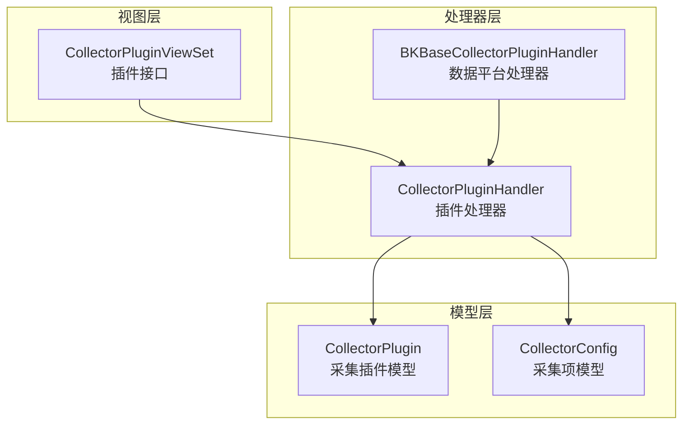
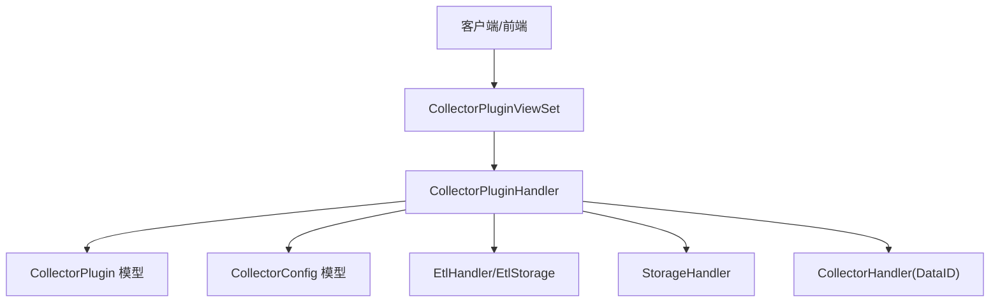
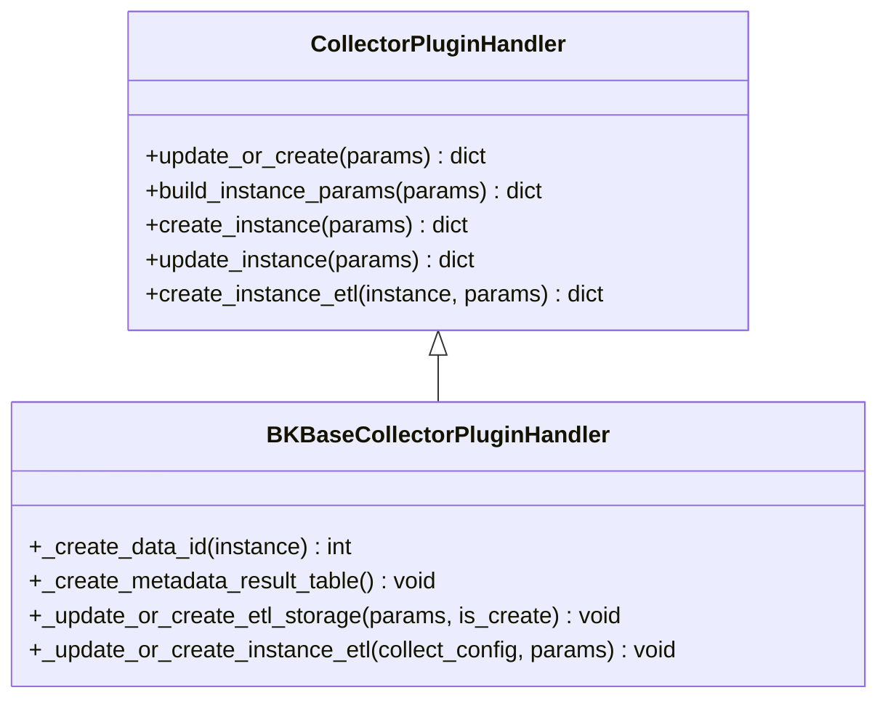
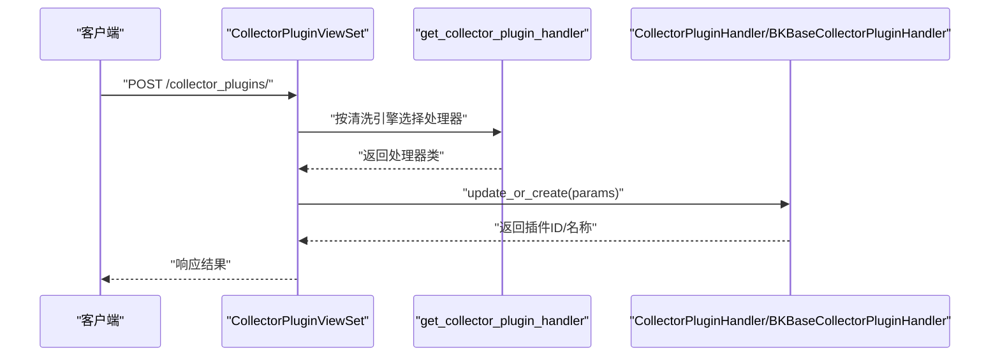
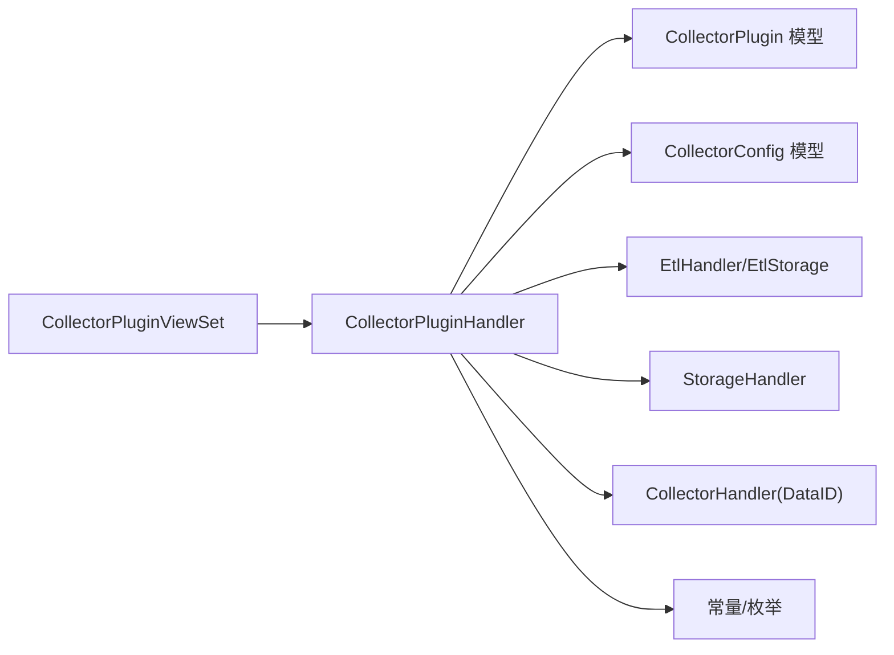
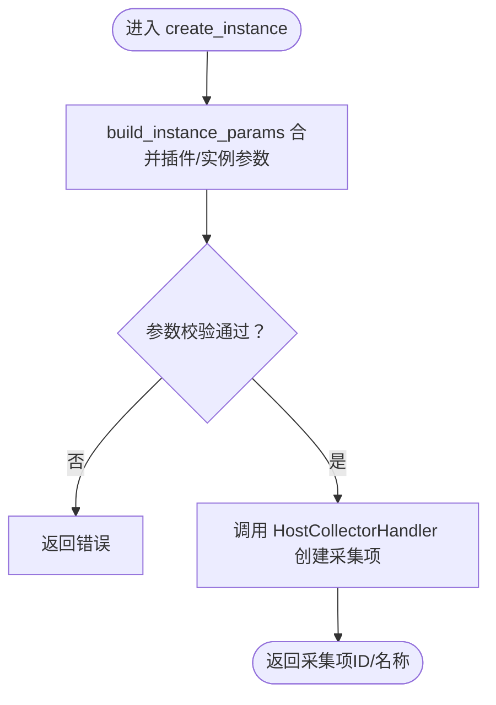

# 采集插件系统

<cite>
**本文引用的文件**
- [apps/log_databus/models.py](file://apps/log_databus/models.py)
- [apps/log_databus/constants.py](file://apps/log_databus/constants.py)
- [apps/log_databus/handlers/collector_plugin/base.py](file://apps/log_databus/handlers/collector_plugin/base.py)
- [apps/log_databus/handlers/collector_plugin/bkbase.py](file://apps/log_databus/handlers/collector_plugin/bkbase.py)
- [apps/log_databus/views/collector_plugin_views.py](file://apps/log_databus/views/collector_plugin_views.py)
</cite>

## 目录
1. [简介](#简介)
2. [项目结构](#项目结构)
3. [核心组件](#核心组件)
4. [架构总览](#架构总览)
5. [组件详解](#组件详解)
6. [依赖关系分析](#依赖关系分析)
7. [性能考量](#性能考量)
8. [故障排查指南](#故障排查指南)
9. [结论](#结论)
10. [附录](#附录)

## 简介
本文件面向采集插件系统，系统性阐述插件架构设计理念与实现原理，重点解析 CollectorPlugin 模型的结构与职责；说明插件注册、发现与加载的扩展机制；梳理内置采集插件类型与场景差异；给出插件开发规范与接口标准；并提供开发、测试与配置示例、故障排查方法，帮助开发者快速上手并稳定交付。

## 项目结构
采集插件系统位于 databus 子系统中，围绕“插件模型-处理器-视图”三层组织代码：
- 模型层：定义采集插件与采集项的数据结构与行为约束
- 处理器层：封装插件生命周期（创建/更新）、实例化、清洗与入库、存储等逻辑
- 视图层：对外暴露 REST 接口，支撑前端与外部系统调用

图表来源
- [apps/log_databus/models.py:683-780](file://apps/log_databus/models.py#L683-L780)
- [apps/log_databus/handlers/collector_plugin/base.py:54-396](file://apps/log_databus/handlers/collector_plugin/base.py#L54-L396)
- [apps/log_databus/handlers/collector_plugin/bkbase.py:29-88](file://apps/log_databus/handlers/collector_plugin/bkbase.py#L29-L88)
- [apps/log_databus/views/collector_plugin_views.py:28-535](file://apps/log_databus/views/collector_plugin_views.py#L28-L535)

章节来源
- [apps/log_databus/models.py:683-780](file://apps/log_databus/models.py#L683-L780)
- [apps/log_databus/handlers/collector_plugin/base.py:54-396](file://apps/log_databus/handlers/collector_plugin/base.py#L54-L396)
- [apps/log_databus/handlers/collector_plugin/bkbase.py:29-88](file://apps/log_databus/handlers/collector_plugin/bkbase.py#L29-L88)
- [apps/log_databus/views/collector_plugin_views.py:28-535](file://apps/log_databus/views/collector_plugin_views.py#L28-L535)

## 核心组件
- CollectorPlugin（采集插件模型）
  - 描述插件维度的元数据、清洗与存储策略、可见性与权限等
  - 关键字段：插件名/英文名、采集场景、分类、字符集、清洗配置、存储集群、索引 Settings 等
- CollectorConfig（采集项模型）
  - 描述具体采集任务的目标、参数、清洗与入库策略、订阅与任务状态等
- CollectorPluginHandler（插件处理器）
  - 封装插件创建/更新、实例化、清洗与入库、存储等流程
- BKBaseCollectorPluginHandler（数据平台处理器）
  - 基于数据平台的清洗与入库实现
- CollectorPluginViewSet（插件视图）
  - 对外提供创建/更新插件、实例化、更新实例、实例清洗等接口

章节来源
- [apps/log_databus/models.py:683-780](file://apps/log_databus/models.py#L683-L780)
- [apps/log_databus/handlers/collector_plugin/base.py:54-396](file://apps/log_databus/handlers/collector_plugin/base.py#L54-L396)
- [apps/log_databus/handlers/collector_plugin/bkbase.py:29-88](file://apps/log_databus/handlers/collector_plugin/bkbase.py#L29-L88)
- [apps/log_databus/views/collector_plugin_views.py:28-535](file://apps/log_databus/views/collector_plugin_views.py#L28-L535)

## 架构总览
采集插件系统采用“视图-处理器-模型”的分层架构，配合常量与枚举统一规范场景、清洗与存储策略，确保扩展性与一致性。

图表来源
- [apps/log_databus/views/collector_plugin_views.py:28-535](file://apps/log_databus/views/collector_plugin_views.py#L28-L535)
- [apps/log_databus/handlers/collector_plugin/base.py:54-396](file://apps/log_databus/handlers/collector_plugin/base.py#L54-L396)
- [apps/log_databus/handlers/collector_plugin/bkbase.py:29-88](file://apps/log_databus/handlers/collector_plugin/bkbase.py#L29-L88)
- [apps/log_databus/models.py:683-780](file://apps/log_databus/models.py#L683-L780)

## 组件详解

### CollectorPlugin 模型
- 角色定位：承载插件级元数据与策略，决定采集项的默认行为与能力边界
- 关键职责
  - 插件维度的清洗与存储策略（清洗引擎、清洗配置、字段、存储集群、索引 Settings）
  - 可见性与权限控制（是否允许独立 DATAID/ETL/存储）
  - 与采集项的绑定关系（通过插件 ID 关联多个采集项）
- 设计要点
  - 英文名唯一性校验，避免命名冲突
  - 支持独立/共享存储与清洗策略的灵活组合
  - 与数据链路、DATAID、清洗与存储模块解耦

章节来源
- [apps/log_databus/models.py:683-780](file://apps/log_databus/models.py#L683-L780)

### CollectorPluginHandler 与派生处理器
- CollectorPluginHandler
  - 插件生命周期管理：创建/更新、实例化、实例清洗
  - 参数补全与合并：将插件级默认参数与实例参数融合
  - 权限与审计：记录用户操作
- BKBaseCollectorPluginHandler
  - 基于数据平台的清洗与入库实现
  - 在不允许独立存储时，自动创建元数据结果表
  - 支持按集群版本与自定义选项生成索引 Settings

图表来源
- [apps/log_databus/handlers/collector_plugin/base.py:54-396](file://apps/log_databus/handlers/collector_plugin/base.py#L54-L396)
- [apps/log_databus/handlers/collector_plugin/bkbase.py:29-88](file://apps/log_databus/handlers/collector_plugin/bkbase.py#L29-L88)

章节来源
- [apps/log_databus/handlers/collector_plugin/base.py:54-396](file://apps/log_databus/handlers/collector_plugin/base.py#L54-L396)
- [apps/log_databus/handlers/collector_plugin/bkbase.py:29-88](file://apps/log_databus/handlers/collector_plugin/bkbase.py#L29-L88)

### 插件注册、发现与加载
- 注册与发现
  - 插件通过视图层接口创建，处理器根据清洗引擎选择对应处理器实现
  - 处理器工厂函数依据清洗引擎映射到具体处理器类
- 加载与调用
  - 视图层接收请求参数，构造处理器实例，委托执行创建/更新/实例化等流程
  - 处理器内部协调清洗、存储、DATAID 等模块，保证一致性

图表来源
- [apps/log_databus/views/collector_plugin_views.py:162-164](file://apps/log_databus/views/collector_plugin_views.py#L162-L164)
- [apps/log_databus/handlers/collector_plugin/base.py:41-52](file://apps/log_databus/handlers/collector_plugin/base.py#L41-L52)

章节来源
- [apps/log_databus/views/collector_plugin_views.py:162-164](file://apps/log_databus/views/collector_plugin_views.py#L162-L164)
- [apps/log_databus/handlers/collector_plugin/base.py:41-52](file://apps/log_databus/handlers/collector_plugin/base.py#L41-L52)

### 内置采集插件类型与场景
- 采集场景与清洗引擎
  - 采集场景由插件模型维护，视图层在创建/更新时传入
  - 清洗引擎通过 etl_processor 字段区分（如数据平台）
- 常量与枚举
  - 场景、清洗配置、存储策略、容器采集类型等均以常量/枚举形式集中管理，便于扩展与复用
- 场景差异
  - 主机日志采集：面向主机实例，支持路径与过滤条件等参数
  - 容器日志采集：面向 Kubernetes Pod/Node，支持命名空间、标签选择器等
  - 自定义采集：面向上报场景，参数更灵活

章节来源
- [apps/log_databus/constants.py:431-443](file://apps/log_databus/constants.py#L431-L443)
- [apps/log_databus/constants.py:450-476](file://apps/log_databus/constants.py#L450-L476)
- [apps/log_databus/views/collector_plugin_views.py:28-535](file://apps/log_databus/views/collector_plugin_views.py#L28-L535)

### 插件开发规范与接口标准
- 接口定义
  - 视图层提供创建、更新、实例化、更新实例、实例清洗等接口
  - 参数结构遵循序列化器约束，字段含义与取值范围由常量/枚举统一
- 参数配置
  - 插件级：清洗配置、字段、存储集群、索引 Settings、可见性等
  - 实例级：采集目标、路径、过滤条件、字符集等
- 错误处理
  - 名称重复、插件不存在、采集项不存在等异常均有明确抛出与处理
- 开发建议
  - 严格遵守字段命名与取值范围
  - 明确独立/共享策略，避免跨域耦合
  - 保持清洗与存储策略的一致性与可追溯性

章节来源
- [apps/log_databus/views/collector_plugin_views.py:28-535](file://apps/log_databus/views/collector_plugin_views.py#L28-L535)
- [apps/log_databus/handlers/collector_plugin/base.py:75-84](file://apps/log_databus/handlers/collector_plugin/base.py#L75-L84)
- [apps/log_databus/handlers/collector_plugin/base.py:113-118](file://apps/log_databus/handlers/collector_plugin/base.py#L113-L118)
- [apps/log_databus/handlers/collector_plugin/base.py:106-111](file://apps/log_databus/handlers/collector_plugin/base.py#L106-L111)

### 插件开发完整指南
- 开发环境
  - 基于 Django/DRF 环境，遵循项目已有常量/枚举与序列化器约定
- 插件编写
  - 定义插件模型字段与默认策略
  - 实现处理器（继承基础处理器），覆盖清洗/存储/数据链路等逻辑
  - 在视图层注册接口，完善序列化器与权限控制
- 测试验证
  - 单元测试：覆盖创建/更新/实例化/清洗等关键流程
  - 集成测试：对接清洗与存储模块，验证一致性
- 配置示例
  - 参考视图层接口文档注释中的请求样例，按需调整字段
- 故障排查
  - 查看异常抛出与日志输出，核对参数合法性与依赖模块状态

章节来源
- [apps/log_databus/views/collector_plugin_views.py:72-164](file://apps/log_databus/views/collector_plugin_views.py#L72-L164)
- [apps/log_databus/handlers/collector_plugin/base.py:120-240](file://apps/log_databus/handlers/collector_plugin/base.py#L120-L240)

## 依赖关系分析
- 模块耦合
  - 视图层仅依赖处理器接口，降低对具体实现的耦合
  - 处理器层通过常量/枚举与清洗、存储、DATAID 模块协作
- 外部依赖
  - 清洗与存储：通过 EtlHandler/EtlStorage/StorageHandler 协调
  - 认证与权限：视图层集成 IAM 权限控制
- 循环依赖
  - 未发现循环依赖，分层清晰

图表来源
- [apps/log_databus/views/collector_plugin_views.py:28-535](file://apps/log_databus/views/collector_plugin_views.py#L28-L535)
- [apps/log_databus/handlers/collector_plugin/base.py:54-396](file://apps/log_databus/handlers/collector_plugin/base.py#L54-L396)
- [apps/log_databus/constants.py:1-755](file://apps/log_databus/constants.py#L1-L755)

章节来源
- [apps/log_databus/views/collector_plugin_views.py:28-535](file://apps/log_databus/views/collector_plugin_views.py#L28-L535)
- [apps/log_databus/handlers/collector_plugin/base.py:54-396](file://apps/log_databus/handlers/collector_plugin/base.py#L54-L396)
- [apps/log_databus/constants.py:1-755](file://apps/log_databus/constants.py#L1-L755)

## 性能考量
- 批量与缓存
  - 模型层提供缓存装饰器，减少重复查询开销
- 并行与异步
  - 处理器层使用并发执行器，提升批量任务效率
- 存储与清洗
  - 通过统一的清洗与存储模块，避免重复计算与冗余写入
- 建议
  - 在大规模实例化场景下，合理拆分批次与并发度
  - 关注清洗与存储模块的资源占用，避免热点

章节来源
- [apps/log_databus/models.py:29](file://apps/log_databus/models.py#L29)
- [apps/log_databus/handlers/collector_plugin/base.py:210-240](file://apps/log_databus/handlers/collector_plugin/base.py#L210-L240)

## 故障排查指南
- 常见问题
  - 插件名称重复：触发名称重复异常，需更换英文名
  - 插件不存在：视图层根据 ID 查询失败，确认插件 ID 正确性
  - 采集项不存在：实例清洗接口报错，确认采集项 ID 存在
- 排查步骤
  - 核对请求参数与序列化器约束
  - 检查清洗与存储模块状态
  - 查看处理器日志与异常栈
- 建议
  - 在创建/更新流程中增加参数校验与预检
  - 对关键流程增加重试与降级策略

章节来源
- [apps/log_databus/handlers/collector_plugin/base.py:75-84](file://apps/log_databus/handlers/collector_plugin/base.py#L75-L84)
- [apps/log_databus/views/collector_plugin_views.py:8-11](file://apps/log_databus/views/collector_plugin_views.py#L8-L11)
- [apps/log_databus/views/collector_plugin_views.py:525-531](file://apps/log_databus/views/collector_plugin_views.py#L525-L531)

## 结论
采集插件系统以清晰的分层设计与统一的常量/枚举体系，实现了插件注册、发现与加载的标准化流程；通过插件与采集项的策略分离，满足了主机日志、容器日志与自定义采集等多样化场景需求。遵循本文的开发规范与接口标准，可高效扩展新插件并保障稳定性与可维护性。

## 附录
- 关键流程图（参数补全与实例化）

图表来源
- [apps/log_databus/handlers/collector_plugin/base.py:348-378](file://apps/log_databus/handlers/collector_plugin/base.py#L348-L378)