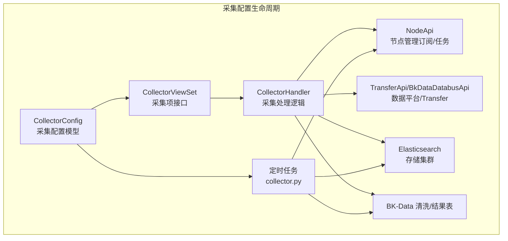
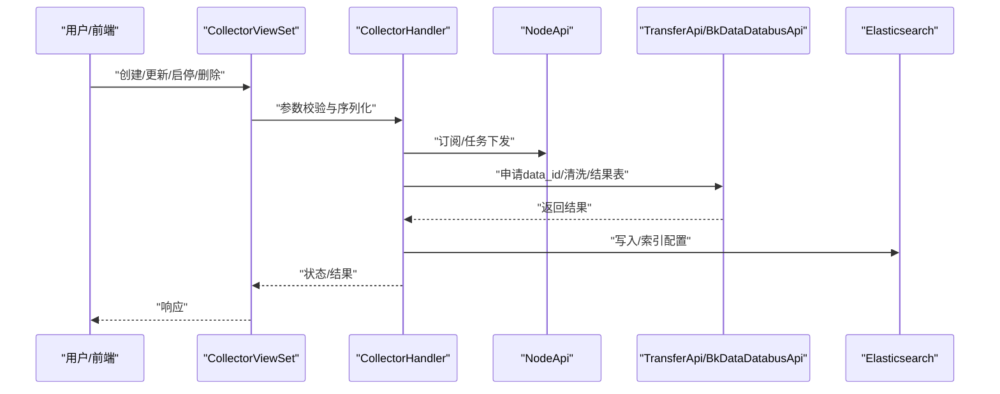
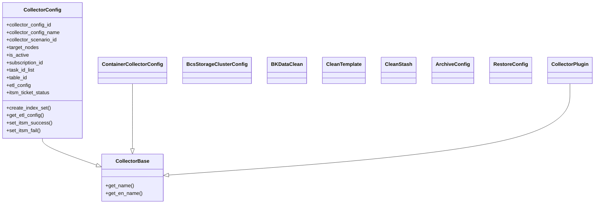
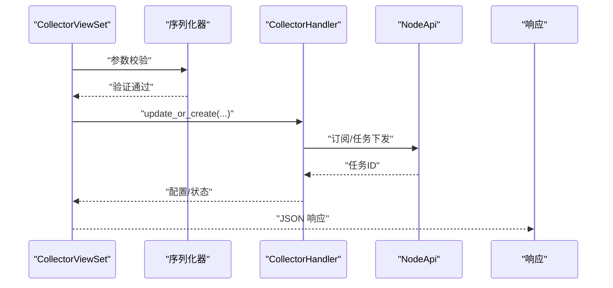
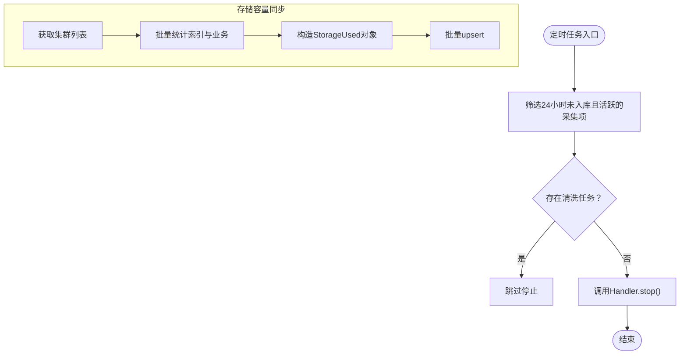
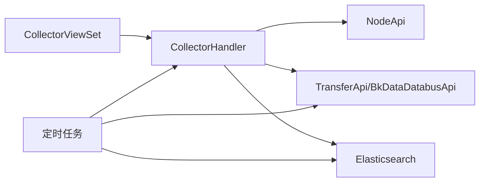

# 采集配置生命周期

<cite>
**本文引用的文件**
- [apps/log_databus/models.py](file://apps/log_databus/models.py)
- [apps/log_databus/views/collector_views.py](file://apps/log_databus/views/collector_views.py)
- [apps/log_databus/tasks/collector.py](file://apps/log_databus/tasks/collector.py)
- [apps/log_databus/constants.py](file://apps/log_databus/constants.py)
- [apps/log_databus/exceptions.py](file://apps/log_databus/exceptions.py)
</cite>

## 目录
1. [简介](#简介)
2. [项目结构](#项目结构)
3. [核心组件](#核心组件)
4. [架构总览](#架构总览)
5. [详细组件分析](#详细组件分析)
6. [依赖分析](#依赖分析)
7. [性能考量](#性能考量)
8. [故障排查指南](#故障排查指南)
9. [结论](#结论)
10. [附录](#附录)

## 简介
本文件围绕“采集配置生命周期”展开，系统化梳理从采集配置创建、启用/禁用、任务调度、状态同步、异常处理到软删除、恢复与迁移的完整流程。重点解释采集配置与节点管理、数据平台、存储系统的协同机制，给出最佳实践与排障建议。

## 项目结构
采集配置生命周期相关的核心代码集中在 databus 模块，涉及模型定义、视图控制器、定时任务与常量/异常定义：
- 模型层：采集配置、插件、清洗、归档与回溯等模型
- 视图层：采集项的增删改查、启停、任务状态查询等接口
- 任务层：周期性状态检查、存储容量同步、容器配置下发/回收等定时任务
- 常量与异常：统一的状态枚举、错误码与异常类型

图表来源
- [apps/log_databus/models.py:102-300](file://apps/log_databus/models.py#L102-L300)
- [apps/log_databus/views/collector_views.py:100-200](file://apps/log_databus/views/collector_views.py#L100-L200)
- [apps/log_databus/tasks/collector.py:99-192](file://apps/log_databus/tasks/collector.py#L99-L192)

章节来源
- [apps/log_databus/models.py:102-300](file://apps/log_databus/models.py#L102-L300)
- [apps/log_databus/views/collector_views.py:100-200](file://apps/log_databus/views/collector_views.py#L100-L200)
- [apps/log_databus/tasks/collector.py:99-192](file://apps/log_databus/tasks/collector.py#L99-L192)

## 核心组件
- 采集配置模型（CollectorConfig）
  - 关键字段：名称、场景、目标节点、清洗配置、结果表ID、订阅ID、任务ID列表、是否可用、ITSM 状态等
  - 行为方法：获取清洗配置、创建索引集、ITSM 状态管理、容量统计等
- 视图控制器（CollectorViewSet）
  - 提供采集项的创建、更新、删除、启停、任务状态查询、场景列举等接口
  - 权限控制与序列化器绑定
- 定时任务（collector.py）
  - 采集项状态检查（如长时间未入库自动停止）、存储容量同步、容器配置下发/回收、存储集群切换等
- 常量与异常（constants.py、exceptions.py）
  - 统一状态枚举（如 ITSM 状态、容器采集状态、采集状态等）
  - 错误码与异常类型定义，保障流程健壮性

章节来源
- [apps/log_databus/models.py:102-300](file://apps/log_databus/models.py#L102-L300)
- [apps/log_databus/views/collector_views.py:100-200](file://apps/log_databus/views/collector_views.py#L100-L200)
- [apps/log_databus/tasks/collector.py:99-192](file://apps/log_databus/tasks/collector.py#L99-L192)
- [apps/log_databus/constants.py:190-202](file://apps/log_databus/constants.py#L190-L202)
- [apps/log_databus/exceptions.py:48-120](file://apps/log_databus/exceptions.py#L48-L120)

## 架构总览
采集配置生命周期贯穿“接口—处理—外部系统”的闭环：
- 接口层：CollectorViewSet 提供 REST API
- 处理层：CollectorHandler 负责编排节点管理、数据平台、清洗与存储
- 外部系统：节点管理（订阅/任务）、Transfer/BK-Data（结果表/清洗）、ES（存储）

图表来源
- [apps/log_databus/views/collector_views.py:538-660](file://apps/log_databus/views/collector_views.py#L538-L660)
- [apps/log_databus/tasks/collector.py:99-192](file://apps/log_databus/tasks/collector.py#L99-L192)

## 详细组件分析

### 采集配置模型（CollectorConfig）
- 关键职责
  - 记录采集配置元数据与状态
  - 提供清洗配置解析、索引集创建、ITSM 状态管理等辅助方法
- 生命周期要点
  - 创建：写入配置、申请 data_id、节点管理订阅、立即执行任务、默认清洗策略、结果表配置
  - 启用/禁用：通过 is_active 控制；与 ITSM 流程联动
  - 软删除：继承 SoftDeleteModel，支持逻辑删除与恢复
  - 清理：与存储、清洗、索引集解耦，避免残留

图表来源
- [apps/log_databus/models.py:80-300](file://apps/log_databus/models.py#L80-L300)
- [apps/log_databus/models.py:683-780](file://apps/log_databus/models.py#L683-L780)

章节来源
- [apps/log_databus/models.py:102-300](file://apps/log_databus/models.py#L102-L300)
- [apps/log_databus/models.py:683-780](file://apps/log_databus/models.py#L683-L780)

### 视图控制器（CollectorViewSet）
- 能力边界
  - 场景列举、采集项列表、详情、创建、更新、删除、启停、重试、任务状态查询等
  - 权限控制：业务/实例级权限与 IAM 集成
- 关键流程
  - 创建：参数校验 → Handler 编排 → 返回订阅ID/任务ID/结果表ID
  - 启停：触发 Handler 停止/启动逻辑
  - 任务状态：查询节点管理任务状态并聚合

图表来源
- [apps/log_databus/views/collector_views.py:538-660](file://apps/log_databus/views/collector_views.py#L538-L660)
- [apps/log_databus/views/collector_views.py:662-800](file://apps/log_databus/views/collector_views.py#L662-L800)

章节来源
- [apps/log_databus/views/collector_views.py:100-200](file://apps/log_databus/views/collector_views.py#L100-L200)
- [apps/log_databus/views/collector_views.py:538-660](file://apps/log_databus/views/collector_views.py#L538-L660)
- [apps/log_databus/views/collector_views.py:662-800](file://apps/log_databus/views/collector_views.py#L662-L800)

### 定时任务（collector.py）
- 周期性检查与维护
  - 采集项状态检查：24 小时未入库自动停止
  - 存储容量同步：每小时批量同步集群容量、索引数量、业务计数
  - 容器配置：下发/删除 CR/ConfigMap，更新容器采集状态
  - 存储集群切换：批量更新采集项存储配置
- 关键点
  - 批量 upsert 存储使用记录，减少数据库压力
  - 重试与等待策略，保证 DB 事务一致性

图表来源
- [apps/log_databus/tasks/collector.py:99-192](file://apps/log_databus/tasks/collector.py#L99-L192)
- [apps/log_databus/tasks/collector.py:527-576](file://apps/log_databus/tasks/collector.py#L527-L576)

章节来源
- [apps/log_databus/tasks/collector.py:99-192](file://apps/log_databus/tasks/collector.py#L99-L192)
- [apps/log_databus/tasks/collector.py:527-576](file://apps/log_databus/tasks/collector.py#L527-L576)

### 状态枚举与异常（constants.py、exceptions.py）
- 状态枚举
  - ITSM 状态：未申请、申请中、失败、成功
  - 容器采集状态：等待中、部署中、成功、失败、已停用
  - 采集状态：准备、运行、成功、失败、终止、未知
- 异常体系
  - 采集配置/插件/存储/清洗/归档/回溯等模块化异常
  - 统一错误码与消息，便于前端与审计

章节来源
- [apps/log_databus/constants.py:190-202](file://apps/log_databus/constants.py#L190-L202)
- [apps/log_databus/constants.py:462-476](file://apps/log_databus/constants.py#L462-L476)
- [apps/log_databus/exceptions.py:48-120](file://apps/log_databus/exceptions.py#L48-L120)

## 依赖分析
- 组件耦合
  - CollectorViewSet 依赖 CollectorHandler 与序列化器
  - CollectorHandler 依赖 NodeApi、TransferApi/BkDataDatabusApi、Elasticsearch
  - 定时任务依赖 Handler 与外部系统 API
- 外部依赖
  - 节点管理：订阅、任务下发与状态查询
  - 数据平台：data_id 申请、清洗、结果表
  - 存储：ES 集群容量统计与索引管理

图表来源
- [apps/log_databus/views/collector_views.py:538-660](file://apps/log_databus/views/collector_views.py#L538-L660)
- [apps/log_databus/tasks/collector.py:99-192](file://apps/log_databus/tasks/collector.py#L99-L192)

章节来源
- [apps/log_databus/views/collector_views.py:538-660](file://apps/log_databus/views/collector_views.py#L538-L660)
- [apps/log_databus/tasks/collector.py:99-192](file://apps/log_databus/tasks/collector.py#L99-L192)

## 性能考量
- 批量操作
  - 存储容量同步采用批量 upsert，降低数据库往返次数
- 重试与退避
  - 容器配置下发/删除具备重试与等待策略，提升稳定性
- 状态检查
  - 周期性检查避免长期无效任务占用资源

章节来源
- [apps/log_databus/tasks/collector.py:527-576](file://apps/log_databus/tasks/collector.py#L527-L576)
- [apps/log_databus/tasks/collector.py:335-391](file://apps/log_databus/tasks/collector.py#L335-L391)

## 故障排查指南
- 常见问题定位
  - 采集项创建失败：检查节点管理订阅/任务下发、数据平台 data_id 申请、清洗与结果表配置
  - 启动后无数据：核查任务状态、节点 Agent 状态、采集路径与过滤条件
  - 自动停止：检查 24 小时未入库策略与 ITSM 状态
  - 存储容量异常：核对集群容量同步任务与索引统计
- 异常类型参考
  - 采集配置/插件/存储/清洗/归档/回溯等模块化异常，统一错误码便于定位
- 建议流程
  - 查看接口响应与 Handler 日志
  - 核对节点管理任务状态
  - 检查数据平台清洗与结果表
  - 校验 ES 集群容量与索引状态

章节来源
- [apps/log_databus/exceptions.py:48-120](file://apps/log_databus/exceptions.py#L48-L120)
- [apps/log_databus/tasks/collector.py:99-192](file://apps/log_databus/tasks/collector.py#L99-L192)

## 结论
采集配置生命周期以 CollectorConfig 为核心，通过 CollectorViewSet 与 CollectorHandler 实现“接口—处理—外部系统”的闭环。定时任务保障状态与容量的持续治理，常量与异常体系提供一致性的状态与错误语义。遵循本文最佳实践与排障建议，可稳定支撑大规模采集配置的创建、启停、清理与迁移。

## 附录
- 最佳实践
  - 创建前：明确场景、目标节点、清洗配置与存储策略
  - 启停：结合 ITSM 状态与任务状态，避免重复部署
  - 清理：定期执行自动停止与容量同步，及时回收无效资源
  - 迁移：使用存储集群切换与批量更新，确保平滑过渡
- 软删除与恢复
  - 采集配置支持软删除，可通过管理接口恢复或彻底清理
- 归档与回溯
  - 归档配置与回溯配置提供离线数据保留与恢复能力，注意过期与通知机制

章节来源
- [apps/log_databus/models.py:567-681](file://apps/log_databus/models.py#L567-L681)
- [apps/log_databus/tasks/collector.py:393-417](file://apps/log_databus/tasks/collector.py#L393-L417)