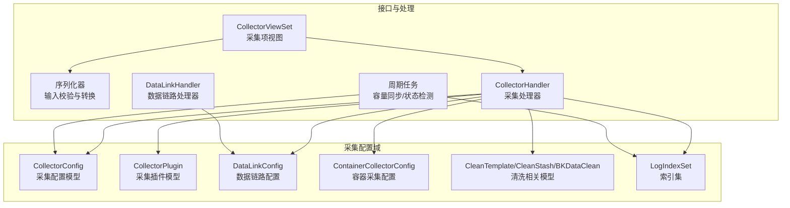
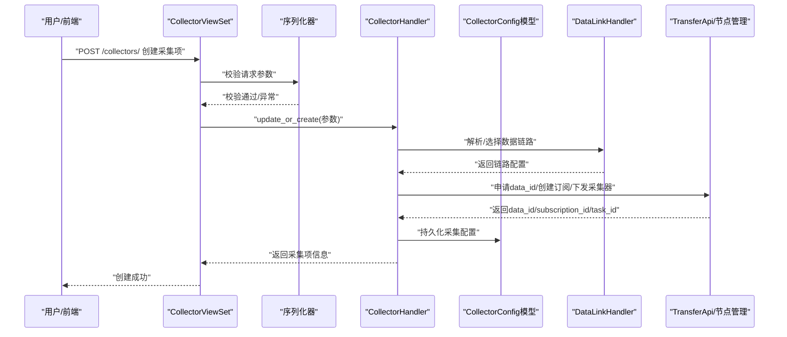
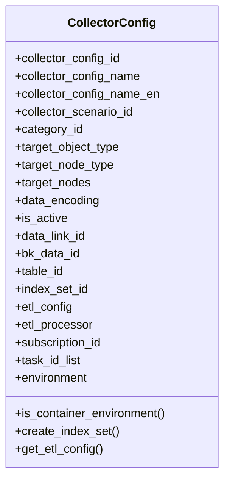
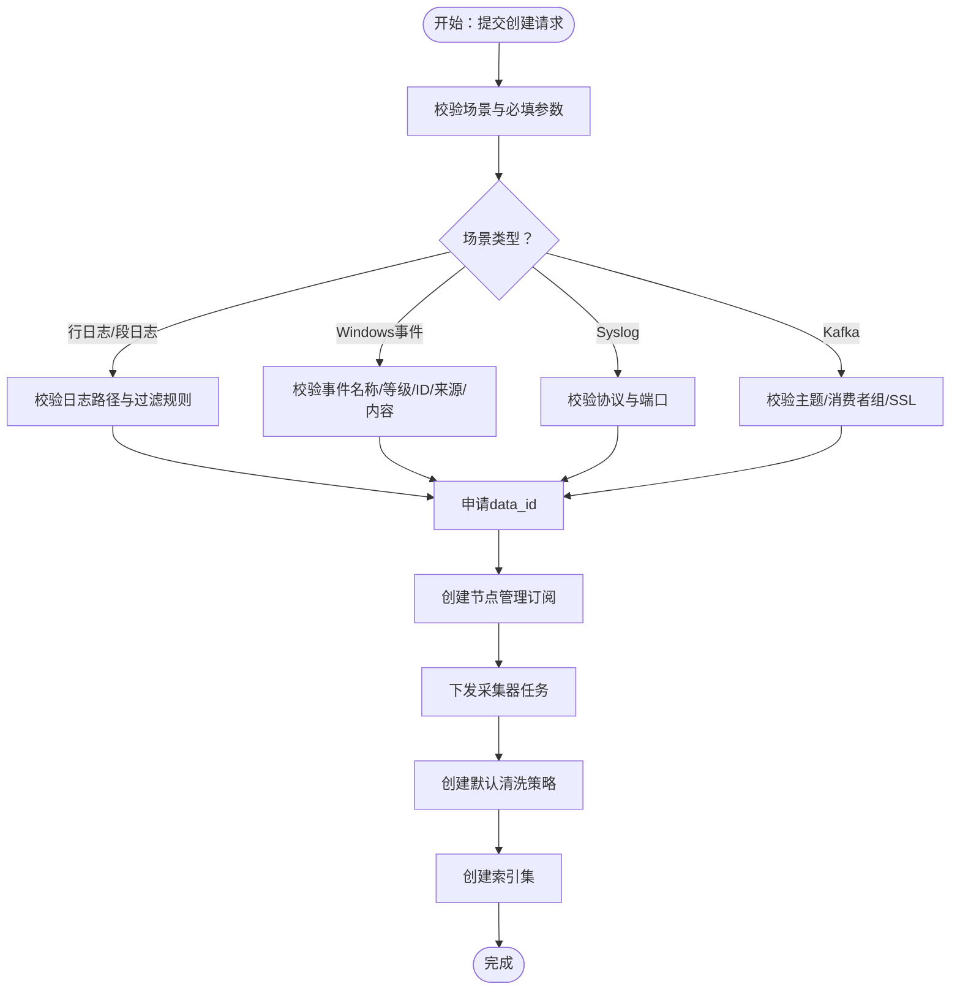
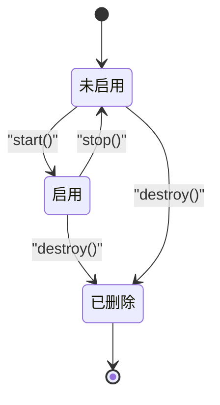
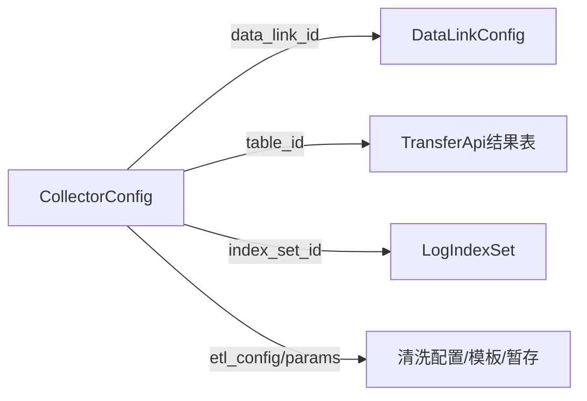
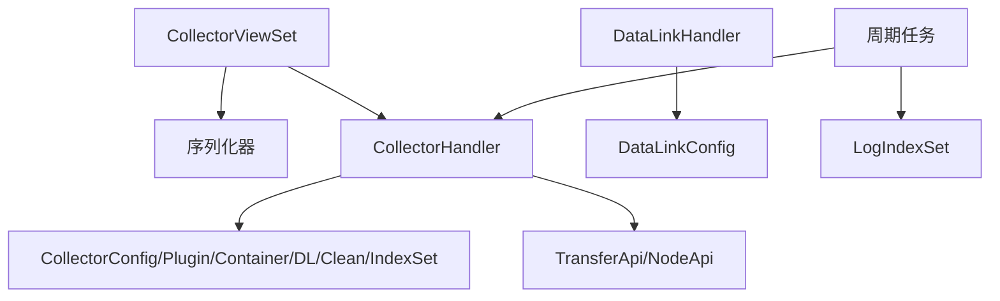

# 采集配置管理

<cite>
**本文引用的文件**   
- [apps/log_databus/models.py](file://apps/log_databus/models.py)
- [apps/log_databus/serializers.py](file://apps/log_databus/serializers.py)
- [apps/log_databus/views/collector_views.py](file://apps/log_databus/views/collector_views.py)
- [apps/log_databus/constants.py](file://apps/log_databus/constants.py)
- [apps/log_databus/tasks/collector.py](file://apps/log_databus/tasks/collector.py)
- [apps/log_databus/handlers/collector/base.py](file://apps/log_databus/handlers/collector/base.py)
- [apps/log_databus/handlers/link.py](file://apps/log_databus/handlers/link.py)
</cite>

## 目录
1. [简介](#简介)
2. [项目结构](#项目结构)
3. [核心组件](#核心组件)
4. [架构总览](#架构总览)
5. [详细组件分析](#详细组件分析)
6. [依赖关系分析](#依赖关系分析)
7. [性能考量](#性能考量)
8. [故障排查指南](#故障排查指南)
9. [结论](#结论)
10. [附录](#附录)

## 简介
本技术文档围绕采集配置管理系统，系统性阐述采集配置的核心概念、数据模型与业务逻辑，详解采集项的创建流程、生命周期管理（创建、修改、启用/禁用、删除）、与数据链路、清洗规则、索引集的关联关系，并提供最佳实践与常见问题解决方案。读者无需深入代码即可理解采集配置的全貌与关键实现。

## 项目结构
采集配置管理主要分布在以下模块：
- 数据模型与领域实体：apps/log_databus/models.py
- 序列化与输入校验：apps/log_databus/serializers.py
- 视图与对外接口：apps/log_databus/views/collector_views.py
- 常量与枚举：apps/log_databus/constants.py
- 采集生命周期与后台任务：apps/log_databus/tasks/collector.py
- 采集处理器与业务编排：apps/log_databus/handlers/collector/base.py
- 数据链路管理：apps/log_databus/handlers/link.py

图表来源
- [apps/log_databus/models.py:102-411](file://apps/log_databus/models.py#L102-L411)
- [apps/log_databus/serializers.py:396-521](file://apps/log_databus/serializers.py#L396-L521)
- [apps/log_databus/views/collector_views.py:100-800](file://apps/log_databus/views/collector_views.py#L100-L800)
- [apps/log_databus/handlers/collector/base.py:124-800](file://apps/log_databus/handlers/collector/base.py#L124-L800)
- [apps/log_databus/handlers/link.py:38-209](file://apps/log_databus/handlers/link.py#L38-L209)
- [apps/log_databus/tasks/collector.py:99-576](file://apps/log_databus/tasks/collector.py#L99-L576)

章节来源
- [apps/log_databus/models.py:102-411](file://apps/log_databus/models.py#L102-L411)
- [apps/log_databus/serializers.py:396-521](file://apps/log_databus/serializers.py#L396-L521)
- [apps/log_databus/views/collector_views.py:100-800](file://apps/log_databus/views/collector_views.py#L100-L800)
- [apps/log_databus/constants.py:388-476](file://apps/log_databus/constants.py#L388-L476)
- [apps/log_databus/tasks/collector.py:99-576](file://apps/log_databus/tasks/collector.py#L99-L576)
- [apps/log_databus/handlers/collector/base.py:124-800](file://apps/log_databus/handlers/collector/base.py#L124-L800)
- [apps/log_databus/handlers/link.py:38-209](file://apps/log_databus/handlers/link.py#L38-L209)

## 核心组件
- CollectorConfig（采集配置）
  - 关键字段：采集项名称、英文名、采集场景、数据分类、目标节点类型/节点、目标节点集合、字符集、清洗配置、结果表ID、索引集ID、数据链路ID、订阅ID、任务ID列表、是否启用、容器相关标志与配置等。
  - 生命周期方法：启动/停止/销毁；与索引集、清洗、结果表联动。
- CollectorPlugin（采集插件）
  - 控制采集项行为，包含清洗与存储能力配置。
- DataLinkConfig（数据链路）
  - 统一管理kafka、transfer、ES集群组合，支持业务独立链路与公共链路优先级。
- 清洗与索引集
  - CleanTemplate/CleanStash/BKDataClean：模板、暂存与数据平台清洗关联。
  - LogIndexSet：索引集，承载检索权限与字段排序等。
- 容器采集
  - ContainerCollectorConfig：容器日志采集的子配置集合，支持命名空间、标签、注解、路径等。

章节来源
- [apps/log_databus/models.py:102-411](file://apps/log_databus/models.py#L102-L411)
- [apps/log_databus/models.py:683-780](file://apps/log_databus/models.py#L683-L780)
- [apps/log_databus/models.py:455-482](file://apps/log_databus/models.py#L455-L482)
- [apps/log_databus/models.py:512-565](file://apps/log_databus/models.py#L512-L565)
- [apps/log_databus/models.py:414-437](file://apps/log_databus/models.py#L414-L437)

## 架构总览
采集配置管理采用“视图-序列化-处理器-模型”的分层架构：
- 视图层负责鉴权、参数校验与路由；
- 序列化器负责输入参数的合法性与必要字段校验；
- 处理器封装采集项的创建、更新、启动、停止、销毁等业务编排；
- 模型层承载采集配置、插件、链路、清洗、索引集等实体；
- 后台任务负责周期性状态检测、容量同步、容器配置下发等。

图表来源
- [apps/log_databus/views/collector_views.py:538-661](file://apps/log_databus/views/collector_views.py#L538-L661)
- [apps/log_databus/handlers/collector/base.py:124-800](file://apps/log_databus/handlers/collector/base.py#L124-L800)
- [apps/log_databus/handlers/link.py:38-209](file://apps/log_databus/handlers/link.py#L38-L209)

## 详细组件分析

### CollectorConfig 模型与字段定义
- 字段概览与含义
  - 基本信息：名称、英文名、采集场景、数据分类、目标对象/节点类型、目标节点集合、描述、字符集、环境、是否启用。
  - 链路与结果：数据链路ID、data_id、结果表ID、索引集ID、清洗配置与处理器。
  - 订阅与任务：订阅ID、任务ID列表。
  - 容器与纳秒：容器环境标志、bcs集群ID、yaml配置、规则集ID、纳秒采集标志、v4链路标志等。
  - 存储参数：分片数量/大小、副本数、独立ES集群可用性等。
  - ITSM：itsm单据号与状态。
- 关键属性与方法
  - etl_config/get_etl_config：获取清洗配置与字段。
  - create_index_set：创建索引集并绑定。
  - is_container_environment/is_custom_container/is_container_collector/is_custom_scenario：容器/自定义场景判断。
  - ITSMSupport：itsm状态管理与标题生成。
- 约束与索引
  - 名称+业务唯一约束。
  - custom_type与log_group_id联合索引。

图表来源
- [apps/log_databus/models.py:102-411](file://apps/log_databus/models.py#L102-L411)

章节来源
- [apps/log_databus/models.py:102-411](file://apps/log_databus/models.py#L102-L411)

### 采集项创建流程（含场景选择、目标节点、规则设置）
- 场景选择
  - 支持行日志、段日志、Windows事件、Syslog、Kafka等多种采集场景，不同场景对应不同的params参数要求。
- 目标节点配置
  - 支持主机实例、拓扑节点、服务模板、集群模板、动态分组等节点类型。
  - 目标节点集合包含主机IP、云区域、供应商、主机ID等。
- 规则设置
  - 日志路径paths、过滤方式conditions（匹配/分隔符）、多行正则multiline、Windows事件过滤、Syslog协议与端口、Kafka主题/消费者组/SSL等。
- 输入校验
  - 不同场景对必填字段进行强制校验，例如段日志需提供多行配置，Syslog需提供协议与端口等。

图表来源
- [apps/log_databus/serializers.py:396-441](file://apps/log_databus/serializers.py#L396-L441)
- [apps/log_databus/serializers.py:443-472](file://apps/log_databus/serializers.py#L443-L472)
- [apps/log_databus/views/collector_views.py:538-661](file://apps/log_databus/views/collector_views.py#L538-L661)

章节来源
- [apps/log_databus/serializers.py:396-441](file://apps/log_databus/serializers.py#L396-L441)
- [apps/log_databus/serializers.py:443-472](file://apps/log_databus/serializers.py#L443-L472)
- [apps/log_databus/views/collector_views.py:538-661](file://apps/log_databus/views/collector_views.py#L538-L661)

### 采集配置生命周期管理
- 启用/停止
  - 启动：更新状态为启用，启用索引集，启用结果表，记录操作日志。
  - 停止：更新状态为禁用，停止索引集，停用结果表，记录操作日志。
- 销毁
  - 停止采集、删除容器配置、删除索引集、重命名采集项、删除META采集项、清理归档关联，记录销毁操作。
- 周期任务
  - 采集项状态检测（如24小时未入库自动停止）、存储容量同步（批量统计业务/集群容量）、容器配置下发与删除、存储集群切换等。

图表来源
- [apps/log_databus/handlers/collector/base.py:408-481](file://apps/log_databus/handlers/collector/base.py#L408-L481)
- [apps/log_databus/handlers/collector/base.py:622-671](file://apps/log_databus/handlers/collector/base.py#L622-L671)
- [apps/log_databus/tasks/collector.py:99-122](file://apps/log_databus/tasks/collector.py#L99-L122)
- [apps/log_databus/tasks/collector.py:124-192](file://apps/log_databus/tasks/collector.py#L124-L192)

章节来源
- [apps/log_databus/handlers/collector/base.py:408-481](file://apps/log_databus/handlers/collector/base.py#L408-L481)
- [apps/log_databus/handlers/collector/base.py:622-671](file://apps/log_databus/handlers/collector/base.py#L622-L671)
- [apps/log_databus/tasks/collector.py:99-122](file://apps/log_databus/tasks/collector.py#L99-L122)
- [apps/log_databus/tasks/collector.py:124-192](file://apps/log_databus/tasks/collector.py#L124-L192)

### 采集配置与数据链路、清洗规则、索引集的关联
- 数据链路
  - DataLinkConfig统一管理kafka、transfer、ES集群组合，支持业务独立链路优先于公共链路。
- 清洗规则
  - 采集配置可直接使用清洗配置（etl_config/etl_params），也可通过默认规则生成；清洗模板与暂存用于高级清洗。
- 索引集
  - 采集配置创建时可创建索引集并绑定，更新名称时同步索引集名称；支持设置排序字段与目标字段。

图表来源
- [apps/log_databus/models.py:102-411](file://apps/log_databus/models.py#L102-L411)
- [apps/log_databus/models.py:455-482](file://apps/log_databus/models.py#L455-L482)
- [apps/log_databus/models.py:512-565](file://apps/log_databus/models.py#L512-L565)
- [apps/log_databus/handlers/link.py:38-209](file://apps/log_databus/handlers/link.py#L38-L209)

章节来源
- [apps/log_databus/models.py:102-411](file://apps/log_databus/models.py#L102-L411)
- [apps/log_databus/models.py:455-482](file://apps/log_databus/models.py#L455-L482)
- [apps/log_databus/models.py:512-565](file://apps/log_databus/models.py#L512-L565)
- [apps/log_databus/handlers/link.py:38-209](file://apps/log_databus/handlers/link.py#L38-L209)

### 采集处理器 CollectorHandler 的关键流程
- retrieve：组装采集项详情，按顺序执行若干处理步骤（ITSMSupport、默认字段、目标补全、分类名称、结果表与存储补全、节点管理参数补全、字段为空处理、时区转换、容器配置注入、yaml编码）。
- start/stop/destroy：封装生命周期操作，联动索引集、结果表与节点管理。
- custom_update：支持自定义清洗参数、字段与存储集群更新，同时维护索引集归属关系。

章节来源
- [apps/log_databus/handlers/collector/base.py:482-502](file://apps/log_databus/handlers/collector/base.py#L482-L502)
- [apps/log_databus/handlers/collector/base.py:408-481](file://apps/log_databus/handlers/collector/base.py#L408-L481)
- [apps/log_databus/handlers/collector/base.py:622-671](file://apps/log_databus/handlers/collector/base.py#L622-L671)
- [apps/log_databus/handlers/collector/base.py:504-616](file://apps/log_databus/handlers/collector/base.py#L504-L616)

## 依赖关系分析
- 视图层依赖序列化器进行参数校验，再委派给采集处理器。
- 采集处理器依赖模型层（采集配置、插件、链路、容器配置、清洗、索引集）与外部API（TransferApi、节点管理）。
- 数据链路处理器独立管理链路配置与集群列表。
- 周期任务依赖采集处理器与索引集处理器，执行容量统计、状态检测与容器配置下发。

图表来源
- [apps/log_databus/views/collector_views.py:100-800](file://apps/log_databus/views/collector_views.py#L100-L800)
- [apps/log_databus/handlers/collector/base.py:124-800](file://apps/log_databus/handlers/collector/base.py#L124-L800)
- [apps/log_databus/handlers/link.py:38-209](file://apps/log_databus/handlers/link.py#L38-L209)
- [apps/log_databus/tasks/collector.py:99-576](file://apps/log_databus/tasks/collector.py#L99-L576)

章节来源
- [apps/log_databus/views/collector_views.py:100-800](file://apps/log_databus/views/collector_views.py#L100-L800)
- [apps/log_databus/handlers/collector/base.py:124-800](file://apps/log_databus/handlers/collector/base.py#L124-L800)
- [apps/log_databus/handlers/link.py:38-209](file://apps/log_databus/handlers/link.py#L38-L209)
- [apps/log_databus/tasks/collector.py:99-576](file://apps/log_databus/tasks/collector.py#L99-L576)

## 性能考量
- 批量并发查询：retrieve过程中通过并发API调用减少等待时间。
- 批量容量同步：周期任务按批处理StorageUsed，避免频繁数据库写入。
- 结果表集群信息批量获取：按分片批量查询，失败重试，提升稳定性。
- 容器配置下发：采用重试机制与状态标记，确保配置一致性。

章节来源
- [apps/log_databus/handlers/collector/base.py:162-196](file://apps/log_databus/handlers/collector/base.py#L162-L196)
- [apps/log_databus/tasks/collector.py:124-192](file://apps/log_databus/tasks/collector.py#L124-L192)
- [apps/log_databus/handlers/collector/base.py:740-800](file://apps/log_databus/handlers/collector/base.py#L740-L800)

## 故障排查指南
- 常见异常与定位
  - 采集项不存在：检查collector_config_id与数据一致性。
  - 订阅信息缺失：确认节点管理订阅ID与步骤解析。
  - data_id/结果表不存在：核对META与Transfer返回。
  - 链路配置冲突：编辑链路时禁止降低ES集群范围。
- 周期任务问题
  - 采集项长时间未入库：检查定时任务是否触发与采集状态。
  - 容量同步失败：查看批量处理异常日志与集群连通性。
- 容器配置下发失败
  - 检查Bcs集群、CRD与配置保存状态，关注状态与错误详情。

章节来源
- [apps/log_databus/handlers/collector/base.py:65-80](file://apps/log_databus/handlers/collector/base.py#L65-L80)
- [apps/log_databus/handlers/link.py:139-150](file://apps/log_databus/handlers/link.py#L139-L150)
- [apps/log_databus/tasks/collector.py:99-122](file://apps/log_databus/tasks/collector.py#L99-L122)
- [apps/log_databus/tasks/collector.py:335-391](file://apps/log_databus/tasks/collector.py#L335-L391)

## 结论
采集配置管理系统通过清晰的模型定义、严格的输入校验、完善的生命周期编排与稳定的后台任务，实现了从采集场景选择、目标节点配置到清洗与索引集的全链路闭环。遵循命名规范、合理设置字符集与清洗规则、及时启用/停止与定期清理，可显著提升系统的稳定性与性能。

## 附录

### 采集场景与参数要点
- 行日志/段日志：需提供日志路径与过滤规则；段日志需提供多行正则与超时。
- Windows事件：需提供事件名称/等级/ID/来源/内容与匹配操作符。
- Syslog：需提供协议（TCP/UDP）与监听端口。
- Kafka：需提供主题、消费者组、SSL配置与初始偏移量。

章节来源
- [apps/log_databus/serializers.py:422-441](file://apps/log_databus/serializers.py#L422-L441)
- [apps/log_databus/serializers.py:435-439](file://apps/log_databus/serializers.py#L435-L439)

### 最佳实践
- 命名规范
  - 采集项名称与英文名需符合正则；建议英文名使用下划线/字母组合，便于自动化与跨系统识别。
- 字段配置
  - 合理设置字符集，避免乱码；清洗规则尽量复用模板，减少自定义成本。
- 性能优化
  - 合理设置分片数量与副本数；避免过大单行日志；使用增量采集与文件扫描频率控制。
- 安全与合规
  - ITSMSupport流程确保采集接入审批；独立ES集群开关按需启用。

章节来源
- [apps/log_databus/constants.py:39-41](file://apps/log_databus/constants.py#L39-L41)
- [apps/log_databus/models.py:173-179](file://apps/log_databus/models.py#L173-L179)