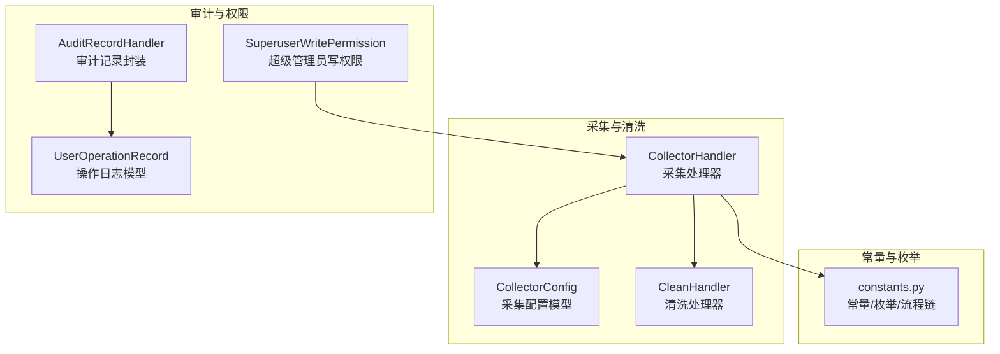
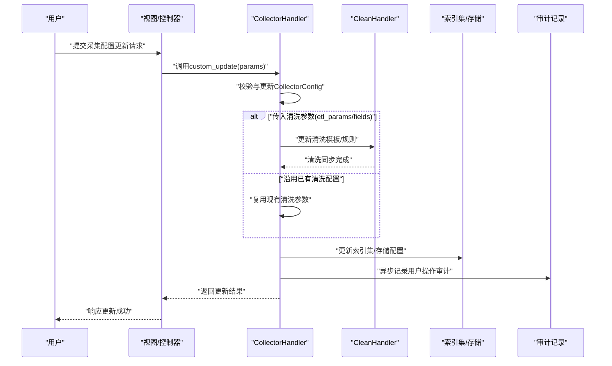
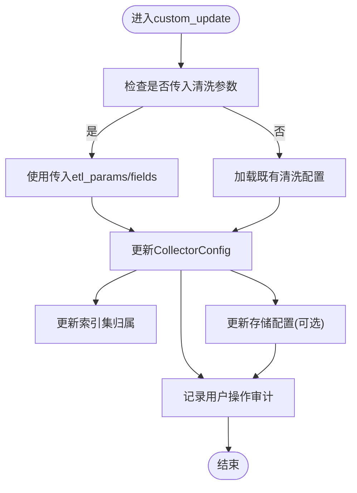
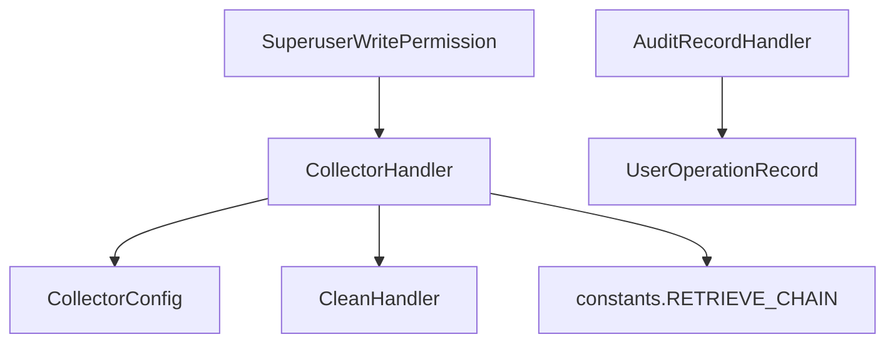

# 采集配置编辑管理

<cite>
**本文引用的文件**
- [apps/log_databus/handlers/collector/base.py](file://apps/log_databus/handlers/collector/base.py)
- [apps/log_databus/handlers/collector/__init__.py](file://apps/log_databus/handlers/collector/__init__.py)
- [apps/log_databus/models.py](file://apps/log_databus/models.py)
- [apps/log_databus/constants.py](file://apps/log_databus/constants.py)
- [apps/log_databus/handlers/clean.py](file://apps/log_databus/handlers/clean.py)
- [apps/bk_log_admin/handlers/audit_record.py](file://apps/bk_log_admin/handlers/audit_record.py)
- [apps/log_audit/models.py](file://apps/log_audit/models.py)
- [apps/log_databus/permission.py](file://apps/log_databus/permission.py)
</cite>

## 目录
1. [简介](#简介)
2. [项目结构](#项目结构)
3. [核心组件](#核心组件)
4. [架构总览](#架构总览)
5. [详细组件分析](#详细组件分析)
6. [依赖分析](#依赖分析)
7. [性能考虑](#性能考虑)
8. [故障排查指南](#故障排查指南)
9. [结论](#结论)
10. [附录](#附录)

## 简介
本技术文档围绕“采集配置编辑管理”展开，系统性阐述采集配置的修改机制、可/不可修改字段边界、变更触发条件、数据验证规则、版本控制与审计追踪、状态管理与权限控制，以及配置变更对下游组件（清洗规则、索引集、存储配置）的影响与联动更新机制。同时提供安全最佳实践与常见问题处理方案，帮助开发者与运维人员高效、安全地维护采集配置。

## 项目结构
采集配置编辑管理主要分布在日志采集与数据处理相关模块中，核心涉及采集处理器、模型定义、常量与枚举、清洗处理器、审计与权限控制等。下图展示与采集配置编辑管理相关的关键文件与职责映射：

图表来源
- [apps/log_databus/handlers/collector/base.py:124-671](file://apps/log_databus/handlers/collector/base.py#L124-L671)
- [apps/log_databus/models.py:102-200](file://apps/log_databus/models.py#L102-L200)
- [apps/log_databus/constants.py:736-748](file://apps/log_databus/constants.py#L736-L748)
- [apps/log_databus/handlers/clean.py:37-156](file://apps/log_databus/handlers/clean.py#L37-L156)
- [apps/bk_log_admin/handlers/audit_record.py:31-49](file://apps/bk_log_admin/handlers/audit_record.py#L31-L49)
- [apps/log_audit/models.py:29-42](file://apps/log_audit/models.py#L29-L42)
- [apps/log_databus/permission.py:25-42](file://apps/log_databus/permission.py#L25-L42)

章节来源
- [apps/log_databus/handlers/collector/base.py:124-671](file://apps/log_databus/handlers/collector/base.py#L124-L671)
- [apps/log_databus/models.py:102-200](file://apps/log_databus/models.py#L102-L200)
- [apps/log_databus/constants.py:736-748](file://apps/log_databus/constants.py#L736-L748)
- [apps/log_databus/handlers/clean.py:37-156](file://apps/log_databus/handlers/clean.py#L37-L156)
- [apps/bk_log_admin/handlers/audit_record.py:31-49](file://apps/bk_log_admin/handlers/audit_record.py#L31-L49)
- [apps/log_audit/models.py:29-42](file://apps/log_audit/models.py#L29-L42)
- [apps/log_databus/permission.py:25-42](file://apps/log_databus/permission.py#L25-L42)

## 核心组件
- 采集处理器（CollectorHandler）
  - 负责采集配置的启动/停止/删除/查询、清洗联动更新、索引集联动更新、存储切换、用户操作审计等。
  - 关键方法：start、stop、destroy、retrieve、custom_update、switch_result_table等。
- 采集配置模型（CollectorConfig）
  - 定义采集配置的字段与约束，明确哪些字段不可修改、哪些可修改，以及与清洗、索引集、存储的关系。
- 常量与流程链（constants.py）
  - 定义采集配置检索流程链（RETRIEVE_CHAIN）、ETL配置类型、目标节点类型、运行状态等。
- 清洗处理器（CleanHandler）
  - 负责从数据平台同步清洗规则、创建/更新清洗模板、与采集配置联动。
- 审计与权限
  - 审计记录封装（AuditRecordHandler）与操作日志模型（UserOperationRecord），用于记录用户操作。
  - 权限控制（SuperuserWritePermission）限制特定写操作仅超级管理员可执行。

章节来源
- [apps/log_databus/handlers/collector/base.py:124-671](file://apps/log_databus/handlers/collector/base.py#L124-L671)
- [apps/log_databus/models.py:102-200](file://apps/log_databus/models.py#L102-L200)
- [apps/log_databus/constants.py:736-748](file://apps/log_databus/constants.py#L736-L748)
- [apps/log_databus/handlers/clean.py:37-156](file://apps/log_databus/handlers/clean.py#L37-L156)
- [apps/bk_log_admin/handlers/audit_record.py:31-49](file://apps/bk_log_admin/handlers/audit_record.py#L31-L49)
- [apps/log_audit/models.py:29-42](file://apps/log_audit/models.py#L29-L42)
- [apps/log_databus/permission.py:25-42](file://apps/log_databus/permission.py#L25-L42)

## 架构总览
采集配置编辑管理的总体流程如下：用户发起编辑请求 → 权限校验 → 采集处理器执行变更 → 联动清洗/索引集/存储 → 记录审计日志。下图以序列图形式展示“配置更新”的关键交互：

图表来源
- [apps/log_databus/handlers/collector/base.py:504-616](file://apps/log_databus/handlers/collector/base.py#L504-L616)
- [apps/log_databus/handlers/clean.py:37-156](file://apps/log_databus/handlers/clean.py#L37-L156)
- [apps/bk_log_admin/handlers/audit_record.py:31-49](file://apps/bk_log_admin/handlers/audit_record.py#L31-L49)

## 详细组件分析

### 采集配置可修改与不可修改字段
- 不可修改字段（配置后禁止修改）
  - 采集场景、数据分类、采集插件ID、业务ID、目标对象类型等。这些字段一旦确定，后续不允许直接修改，若需变更需重建采集配置。
- 可修改字段（支持在线编辑）
  - 名称、描述、显示状态、清洗配置（etl_config/etl_params）、字段列表、存储集群ID、保留天数、分片/副本配置、索引集归属等。
- 字段约束与校验
  - 英文名、集群名等具备正则校验；名称重复会触发唯一性异常；存储配置变更需满足下游存储可用性。

章节来源
- [apps/log_databus/models.py:102-200](file://apps/log_databus/models.py#L102-L200)
- [apps/log_databus/constants.py:39-42](file://apps/log_databus/constants.py#L39-L42)
- [apps/log_databus/handlers/collector/base.py:522-547](file://apps/log_databus/handlers/collector/base.py#L522-L547)

### 配置变更触发条件与处理流程
- 触发条件
  - 用户提交更新请求；当传入清洗参数时优先使用；否则复用既有清洗配置；若未配置清洗则按自定义类型生成默认清洗。
- 处理流程
  - 更新采集配置模型；必要时同步清洗模板；更新索引集归属；更新存储配置（切换结果表/集群）；记录审计日志。

图表来源
- [apps/log_databus/handlers/collector/base.py:504-616](file://apps/log_databus/handlers/collector/base.py#L504-L616)

章节来源
- [apps/log_databus/handlers/collector/base.py:504-616](file://apps/log_databus/handlers/collector/base.py#L504-L616)

### 数据验证规则
- 正则校验
  - 采集项英文名、集群名等字段采用正则表达式校验，确保命名规范。
- 唯一性校验
  - 采集配置名称在业务维度唯一；清洗模板名称在同一业务下唯一。
- 下游一致性
  - 存储集群ID变更需与结果表/索引集配置一致；清洗参数变更需与字段列表匹配。

章节来源
- [apps/log_databus/constants.py:39-42](file://apps/log_databus/constants.py#L39-L42)
- [apps/log_databus/handlers/clean.py:105-112](file://apps/log_databus/handlers/clean.py#L105-L112)
- [apps/log_databus/handlers/collector/base.py:522-547](file://apps/log_databus/handlers/collector/base.py#L522-L547)

### 版本控制机制
- 版本化建议
  - 采集配置与清洗模板均支持版本化管理（模板可见性、业务隔离、冲突检测），通过“可见范围”与“业务ID”实现版本隔离与回溯。
- 实践要点
  - 修改前先创建新版本模板；对关键业务采用“只允许创建者修改/删除”的策略；避免跨业务误改。

章节来源
- [apps/log_databus/handlers/clean.py:85-146](file://apps/log_databus/handlers/clean.py#L85-L146)

### 状态管理
- 采集状态
  - 支持启动/停止/删除等动作；启动/停止会联动索引集与结果表的启停。
- 运行状态
  - 采集任务状态（部署中/正常/失败/部分失败/已停用/未知/准备中）用于前端展示与运维判断。

章节来源
- [apps/log_databus/handlers/collector/base.py:407-480](file://apps/log_databus/handlers/collector/base.py#L407-L480)
- [apps/log_databus/constants.py:378-386](file://apps/log_databus/constants.py#L378-L386)

### 权限控制
- 超级管理员写权限
  - 仅超级管理员可执行特定写操作；普通用户仅能按业务范围进行常规编辑。
- 清洗模板权限
  - 仅模板创建业务可修改/删除模板，防止越权操作。

章节来源
- [apps/log_databus/permission.py:25-42](file://apps/log_databus/permission.py#L25-L42)
- [apps/log_databus/handlers/clean.py:85-87](file://apps/log_databus/handlers/clean.py#L85-L87)

### 审计日志
- 记录内容
  - 操作人、业务ID、对象类型与ID、操作动作、请求参数等。
- 存储与格式化
  - 操作日志模型统一存储；审计记录处理器负责格式化输出。

章节来源
- [apps/log_audit/models.py:29-42](file://apps/log_audit/models.py#L29-L42)
- [apps/bk_log_admin/handlers/audit_record.py:31-49](file://apps/bk_log_admin/handlers/audit_record.py#L31-L49)
- [apps/log_databus/handlers/collector/base.py:432-441](file://apps/log_databus/handlers/collector/base.py#L432-L441)
- [apps/log_databus/handlers/collector/base.py:470-480](file://apps/log_databus/handlers/collector/base.py#L470-L480)
- [apps/log_databus/handlers/collector/base.py:660-669](file://apps/log_databus/handlers/collector/base.py#L660-L669)

### 对下游组件的影响与联动更新
- 清洗规则
  - 当传入清洗参数时，优先使用；否则复用既有清洗配置；清洗模板变更需同步到数据平台。
- 索引集
  - 采集配置名称变更会联动更新索引集名称；可更新索引集归属关系。
- 存储配置
  - 存储集群ID、保留天数、分片/副本等变更会触发结果表切换与存储配置更新。

章节来源
- [apps/log_databus/handlers/collector/base.py:558-604](file://apps/log_databus/handlers/collector/base.py#L558-L604)
- [apps/log_databus/handlers/clean.py:45-55](file://apps/log_databus/handlers/clean.py#L45-L55)

## 依赖分析
采集配置编辑管理的组件间依赖关系如下：

图表来源
- [apps/log_databus/handlers/collector/base.py:124-671](file://apps/log_databus/handlers/collector/base.py#L124-L671)
- [apps/log_databus/models.py:102-200](file://apps/log_databus/models.py#L102-L200)
- [apps/log_databus/constants.py:736-748](file://apps/log_databus/constants.py#L736-L748)
- [apps/log_databus/handlers/clean.py:37-156](file://apps/log_databus/handlers/clean.py#L37-L156)
- [apps/bk_log_admin/handlers/audit_record.py:31-49](file://apps/bk_log_admin/handlers/audit_record.py#L31-L49)
- [apps/log_audit/models.py:29-42](file://apps/log_audit/models.py#L29-L42)
- [apps/log_databus/permission.py:25-42](file://apps/log_databus/permission.py#L25-L42)

章节来源
- [apps/log_databus/handlers/collector/base.py:124-671](file://apps/log_databus/handlers/collector/base.py#L124-L671)
- [apps/log_databus/models.py:102-200](file://apps/log_databus/models.py#L102-L200)
- [apps/log_databus/constants.py:736-748](file://apps/log_databus/constants.py#L736-L748)
- [apps/log_databus/handlers/clean.py:37-156](file://apps/log_databus/handlers/clean.py#L37-L156)
- [apps/bk_log_admin/handlers/audit_record.py:31-49](file://apps/bk_log_admin/handlers/audit_record.py#L31-L49)
- [apps/log_audit/models.py:29-42](file://apps/log_audit/models.py#L29-L42)
- [apps/log_databus/permission.py:25-42](file://apps/log_databus/permission.py#L25-L42)

## 性能考虑
- 批量查询与缓存
  - 采集处理器在检索时采用并发查询与缓存机制，减少外部接口调用次数与延迟。
- 异步审计
  - 审计记录通过消息队列异步写入，避免阻塞主流程。
- 存储切换优化
  - 结果表启停与存储配置更新采用最小化变更策略，降低对在线业务的影响。

## 故障排查指南
- 常见问题
  - 名称重复：采集配置名称唯一性冲突，需修改名称后重试。
  - 清洗模板可见性：非创建业务尝试修改/删除模板，需调整可见范围或授权。
  - 存储配置无效：存储集群ID或保留天数不合法，需核对下游存储可用性。
- 排查步骤
  - 查看操作日志定位操作人与时间；核对采集配置状态与清洗模板版本；确认索引集与存储配置一致性。
- 相关异常
  - 采集配置不存在、清洗模板不存在、订阅信息缺失等异常均有明确的异常类型与提示信息。

章节来源
- [apps/log_databus/handlers/collector/base.py:134-136](file://apps/log_databus/handlers/collector/base.py#L134-L136)
- [apps/log_databus/handlers/clean.py:23-28](file://apps/log_databus/handlers/clean.py#L23-L28)
- [apps/log_databus/handlers/clean.py:85-87](file://apps/log_databus/handlers/clean.py#L85-L87)

## 结论
采集配置编辑管理通过严格的字段边界、完善的验证规则、清晰的状态流转与权限控制，实现了对采集配置的全生命周期管理。配合清洗、索引集与存储的联动更新机制，以及审计与异步处理，保障了变更的可控性与可追溯性。建议在生产环境中遵循版本化管理与最小权限原则，持续完善自动化校验与回滚策略。

## 附录
- 关键流程链（RETRIEVE_CHAIN）
  - 采集配置检索阶段依次执行：ITSM信息补全、分片规则设置、目标节点解析、默认字段填充、分类名称补全、元数据信息补全、节点管理信息补全、字段为空处理、时区转换、容器配置注入、YAML编码等。

章节来源
- [apps/log_databus/constants.py:736-748](file://apps/log_databus/constants.py#L736-L748)