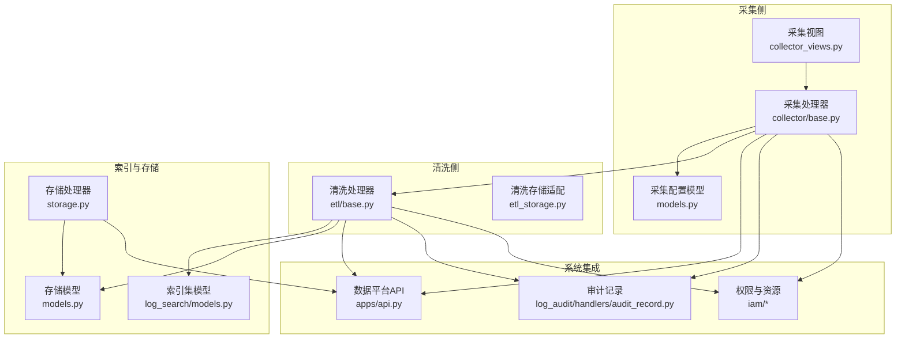
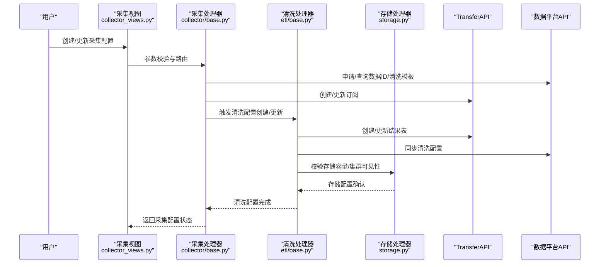
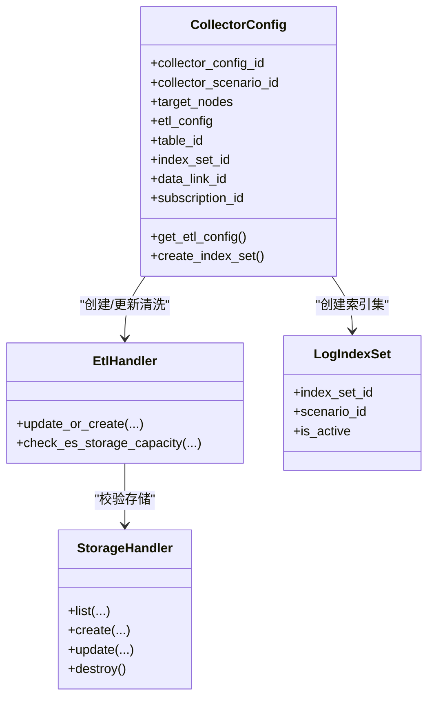
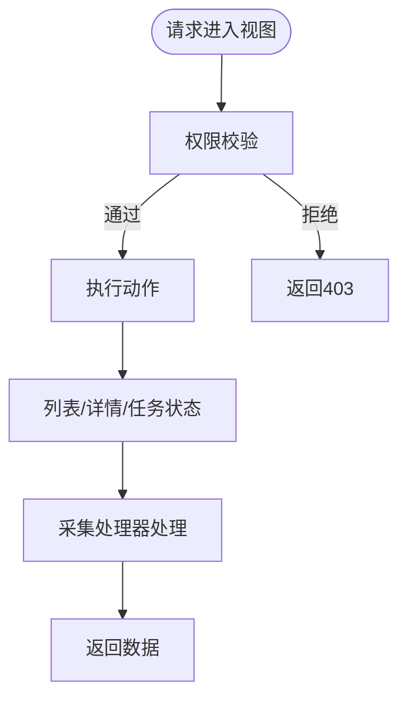
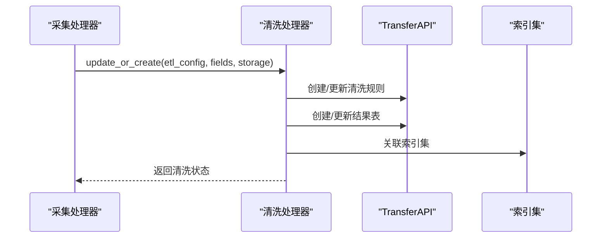
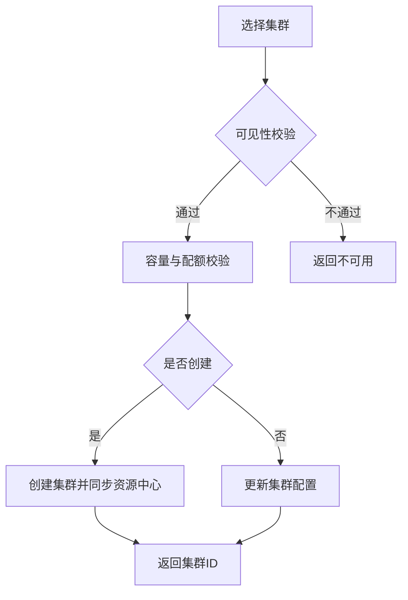
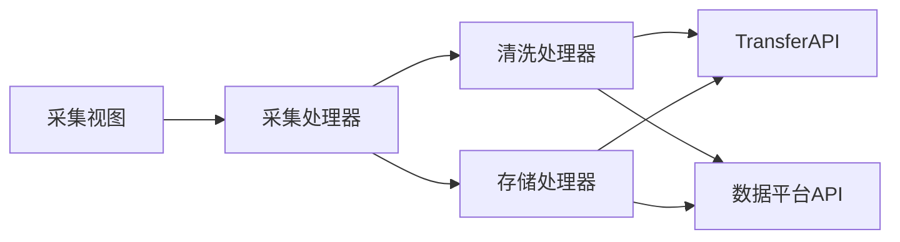

# 采集配置集成关系

<cite>
**本文引用的文件**
- [apps/log_databus/models.py](file://apps/log_databus/models.py)
- [apps/log_databus/views/collector_views.py](file://apps/log_databus/views/collector_views.py)
- [apps/log_databus/handlers/collector/base.py](file://apps/log_databus/handlers/collector/base.py)
- [apps/log_databus/handlers/etl/base.py](file://apps/log_databus/handlers/etl/base.py)
- [apps/log_databus/handlers/storage.py](file://apps/log_databus/handlers/storage.py)
- [apps/log_databus/constants.py](file://apps/log_databus/constants.py)
- [apps/log_databus/serializers.py](file://apps/log_databus/serializers.py)
- [apps/log_search/models.py](file://apps/log_search/models.py)
- [apps/log_clustering/models.py](file://apps/log_clustering/models.py)
- [apps/log_audit/handlers/audit_record.py](file://apps/log_audit/handlers/audit_record.py)
- [apps/bk_log_admin/handlers/index_set.py](file://apps/bk_log_admin/handlers/index_set.py)
- [apps/api.py](file://apps/api.py)
</cite>

## 目录
1. [简介](#简介)
2. [项目结构](#项目结构)
3. [核心组件](#核心组件)
4. [架构总览](#架构总览)
5. [详细组件分析](#详细组件分析)
6. [依赖关系分析](#依赖关系分析)
7. [性能考量](#性能考量)
8. [故障排查指南](#故障排查指南)
9. [结论](#结论)
10. [附录](#附录)

## 简介
本文件面向采集配置（CollectorConfig）与其他系统（数据链路、清洗规则、索引集、存储系统、权限与审计、监控告警）的集成关系，系统性梳理采集配置在创建、更新、运行过程中的数据流与控制流，阐明采集配置如何驱动下游组件（结果表、索引集、清洗模板、存储集群）的创建与配置，以及变更传播机制与集成约束。

## 项目结构
围绕采集配置的关键模块与文件如下：
- 数据模型与视图：采集配置、插件、清洗、归档、存储容量与使用等模型；采集项视图负责权限与查询。
- 处理器：采集处理器（CollectorHandler）、清洗处理器（EtlHandler）、存储处理器（StorageHandler）。
- 常量与序列化：采集场景、清洗配置、存储类型、序列化器等。
- 下游集成：索引集、聚类、审计、权限、API对接等。

图表来源
- [apps/log_databus/views/collector_views.py:100-800](file://apps/log_databus/views/collector_views.py#L100-L800)
- [apps/log_databus/handlers/collector/base.py:124-200](file://apps/log_databus/handlers/collector/base.py#L124-L200)
- [apps/log_databus/handlers/etl/base.py:72-200](file://apps/log_databus/handlers/etl/base.py#L72-L200)
- [apps/log_databus/handlers/storage.py:83-800](file://apps/log_databus/handlers/storage.py#L83-L800)
- [apps/log_databus/models.py:102-822](file://apps/log_databus/models.py#L102-L822)
- [apps/log_search/models.py](file://apps/log_search/models.py)
- [apps/log_audit/handlers/audit_record.py](file://apps/log_audit/handlers/audit_record.py)
- [apps/api.py](file://apps/api.py)

章节来源
- [apps/log_databus/views/collector_views.py:100-800](file://apps/log_databus/views/collector_views.py#L100-L800)
- [apps/log_databus/handlers/collector/base.py:124-200](file://apps/log_databus/handlers/collector/base.py#L124-L200)
- [apps/log_databus/handlers/etl/base.py:72-200](file://apps/log_databus/handlers/etl/base.py#L72-L200)
- [apps/log_databus/handlers/storage.py:83-800](file://apps/log_databus/handlers/storage.py#L83-L800)
- [apps/log_databus/models.py:102-822](file://apps/log_databus/models.py#L102-L822)

## 核心组件
- 采集配置（CollectorConfig）
  - 关键字段：采集场景、目标节点、清洗配置、结果表ID、存储集群、索引集ID、数据链路ID、ITSM接入状态等。
  - 行为：创建/更新采集项、获取清洗配置、创建索引集、与清洗模板联动。
- 采集处理器（CollectorHandler）
  - 统一入口，根据环境选择主机或容器采集处理器；并发获取数据ID、结果表、存储、订阅等信息。
- 清洗处理器（EtlHandler）
  - 根据处理器类型（Transfer/BKBASE）创建/更新清洗规则，校验存储容量，触发聚类清洗更新。
- 存储处理器（StorageHandler）
  - 集群可见性过滤、容量与配额校验、集群创建/更新/删除、热温节点配置同步。
- 常量与枚举（constants）
  - 清洗配置类型、存储类型、采集状态、环境类型、可见性策略等。
- 序列化器（serializers）
  - 输入校验、参数转换、采集场景参数结构化。

章节来源
- [apps/log_databus/models.py:102-411](file://apps/log_databus/models.py#L102-L411)
- [apps/log_databus/handlers/collector/base.py:124-200](file://apps/log_databus/handlers/collector/base.py#L124-L200)
- [apps/log_databus/handlers/etl/base.py:72-200](file://apps/log_databus/handlers/etl/base.py#L72-L200)
- [apps/log_databus/handlers/storage.py:83-800](file://apps/log_databus/handlers/storage.py#L83-L800)
- [apps/log_databus/constants.py:388-755](file://apps/log_databus/constants.py#L388-L755)
- [apps/log_databus/serializers.py:1-200](file://apps/log_databus/serializers.py#L1-L200)

## 架构总览
采集配置贯穿“采集—清洗—入库—索引—检索”的完整链路，主要集成点如下：
- 数据链路（DataLinkConfig）：决定Kafka、Transfer、ES集群组合。
- 清洗规则（CleanTemplate/CleanStash）：定义字段提取与存储策略，与采集配置绑定。
- 结果表（TransferApi）：清洗后写入的结果表，用于检索与索引集关联。
- 索引集（LogIndexSet）：检索入口，与采集配置强关联。
- 存储系统（ES集群）：容量、副本、分片、热温节点配置，受存储处理器统一管理。
- 权限与审计：IAM鉴权、用户操作记录、审计日志。
- 监控告警：采集任务状态、节点管理订阅状态、清洗与存储健康度。

图表来源
- [apps/log_databus/views/collector_views.py:538-800](file://apps/log_databus/views/collector_views.py#L538-L800)
- [apps/log_databus/handlers/collector/base.py:124-200](file://apps/log_databus/handlers/collector/base.py#L124-L200)
- [apps/log_databus/handlers/etl/base.py:150-200](file://apps/log_databus/handlers/etl/base.py#L150-L200)
- [apps/log_databus/handlers/storage.py:626-768](file://apps/log_databus/handlers/storage.py#L626-L768)
- [apps/api.py](file://apps/api.py)

## 详细组件分析

### 采集配置模型与生命周期
- 关键职责
  - 记录采集场景、目标节点、清洗配置、结果表ID、索引集ID、数据链路ID、ITSM接入状态。
  - 提供清洗配置解析、结果表查询、索引集创建、容器环境识别等能力。
- 与下游的耦合点
  - 通过TransferAPI获取/校验结果表与存储配置。
  - 通过IndexSetHandler创建/关联索引集。
  - 通过NodeApi/TransferApi与节点管理、数据平台交互。
- 变更传播
  - 清洗配置变更可能触发聚类清洗更新与结果表字段调整。
  - 存储集群变更可能触发热温节点配置同步。

图表来源
- [apps/log_databus/models.py:102-411](file://apps/log_databus/models.py#L102-L411)
- [apps/log_databus/handlers/etl/base.py:150-200](file://apps/log_databus/handlers/etl/base.py#L150-L200)
- [apps/log_databus/handlers/storage.py:475-768](file://apps/log_databus/handlers/storage.py#L475-L768)
- [apps/log_search/models.py](file://apps/log_search/models.py)

章节来源
- [apps/log_databus/models.py:102-411](file://apps/log_databus/models.py#L102-L411)
- [apps/log_databus/handlers/collector/base.py:162-196](file://apps/log_databus/handlers/collector/base.py#L162-L196)

### 采集视图与权限控制
- 权限控制
  - 不同动作（创建、查看、管理、销毁）绑定不同权限与资源。
  - 白名单应用可绕过鉴权。
- 查询与展示
  - 列表、详情、任务状态、订阅状态等接口统一由视图层提供。
  - 视图层调用采集处理器补充集群与标签信息。

图表来源
- [apps/log_databus/views/collector_views.py:111-145](file://apps/log_databus/views/collector_views.py#L111-L145)
- [apps/log_databus/views/collector_views.py:286-343](file://apps/log_databus/views/collector_views.py#L286-L343)

章节来源
- [apps/log_databus/views/collector_views.py:111-145](file://apps/log_databus/views/collector_views.py#L111-L145)
- [apps/log_databus/views/collector_views.py:286-343](file://apps/log_databus/views/collector_views.py#L286-L343)

### 清洗规则与结果表
- 清洗处理器
  - 根据采集配置选择清洗处理器（Transfer/BKBASE），创建/更新清洗规则。
  - 校验存储容量与可见性，必要时触发聚类清洗更新。
- 结果表与索引集
  - 通过TransferAPI创建/更新结果表；采集配置创建索引集并与之关联。
  - 清洗模板与清洗暂存用于未入库清洗的缓存与回退。

图表来源
- [apps/log_databus/handlers/etl/base.py:150-200](file://apps/log_databus/handlers/etl/base.py#L150-L200)
- [apps/log_databus/models.py:394-411](file://apps/log_databus/models.py#L394-L411)

章节来源
- [apps/log_databus/handlers/etl/base.py:150-200](file://apps/log_databus/handlers/etl/base.py#L150-L200)
- [apps/log_databus/models.py:394-411](file://apps/log_databus/models.py#L394-L411)

### 存储系统集成
- 集群可见性与容量
  - 根据业务与可见性策略筛选可用集群；校验公共/私有集群容量与配额。
- 集群创建/更新/删除
  - 支持同步至数据平台资源中心；热温节点配置变更触发采集器配置更新。
- 节点与统计
  - 获取节点信息、集群统计，支持IPv6域名格式化与连通性检测。

图表来源
- [apps/log_databus/handlers/storage.py:151-241](file://apps/log_databus/handlers/storage.py#L151-L241)
- [apps/log_databus/handlers/storage.py:626-768](file://apps/log_databus/handlers/storage.py#L626-L768)

章节来源
- [apps/log_databus/handlers/storage.py:151-241](file://apps/log_databus/handlers/storage.py#L151-L241)
- [apps/log_databus/handlers/storage.py:626-768](file://apps/log_databus/handlers/storage.py#L626-L768)

### 权限控制、审计与监控告警
- 权限控制
  - 采集项、索引集、存储集群等资源均绑定权限与资源实例，支持业务/实例/视图权限。
- 审计日志
  - 用户操作记录（创建、更新、删除）通过消息异步落库，支持审计回溯。
- 监控告警
  - 采集任务状态、节点管理订阅状态、清洗与存储健康度纳入监控指标。

章节来源
- [apps/log_databus/views/collector_views.py:111-145](file://apps/log_databus/views/collector_views.py#L111-L145)
- [apps/log_audit/handlers/audit_record.py](file://apps/log_audit/handlers/audit_record.py)
- [apps/log_databus/handlers/storage.py:650-666](file://apps/log_databus/handlers/storage.py#L650-L666)

## 依赖关系分析
- 组件耦合
  - 采集处理器依赖清洗处理器与存储处理器；清洗处理器依赖TransferAPI与数据平台API；存储处理器依赖TransferAPI与数据平台资源中心。
- 外部依赖
  - 节点管理（订阅/任务）、数据平台（清洗/结果表/资源中心）、ES集群（连通性/统计）。
- 循环依赖
  - 未发现直接循环依赖；各处理器通过API与模型解耦。

图表来源
- [apps/log_databus/views/collector_views.py:100-800](file://apps/log_databus/views/collector_views.py#L100-L800)
- [apps/log_databus/handlers/collector/base.py:124-200](file://apps/log_databus/handlers/collector/base.py#L124-L200)
- [apps/log_databus/handlers/etl/base.py:72-200](file://apps/log_databus/handlers/etl/base.py#L72-L200)
- [apps/log_databus/handlers/storage.py:83-800](file://apps/log_databus/handlers/storage.py#L83-L800)
- [apps/api.py](file://apps/api.py)

章节来源
- [apps/log_databus/views/collector_views.py:100-800](file://apps/log_databus/views/collector_views.py#L100-L800)
- [apps/log_databus/handlers/collector/base.py:124-200](file://apps/log_databus/handlers/collector/base.py#L124-L200)
- [apps/log_databus/handlers/etl/base.py:72-200](file://apps/log_databus/handlers/etl/base.py#L72-L200)
- [apps/log_databus/handlers/storage.py:83-800](file://apps/log_databus/handlers/storage.py#L83-L800)

## 性能考量
- 并发查询
  - 采集处理器使用并发执行器批量获取数据ID、结果表、存储与订阅信息，降低延迟。
- 缓存与配额
  - 存储容量与使用情况缓存，避免频繁查询；公共集群容量阈值控制。
- 大数据量处理
  - 存储处理器支持批量同步集群用量，减少数据库压力。

章节来源
- [apps/log_databus/handlers/collector/base.py:162-196](file://apps/log_databus/handlers/collector/base.py#L162-L196)
- [apps/log_databus/handlers/storage.py:254-270](file://apps/log_databus/handlers/storage.py#L254-L270)
- [apps/log_databus/handlers/storage.py:750-756](file://apps/log_databus/handlers/storage.py#L750-L756)

## 故障排查指南
- 采集任务失败
  - 检查节点管理订阅状态与任务详情；核对采集目标节点与权限。
- 清洗配置异常
  - 校验清洗配置类型与参数；确认结果表是否存在；检查聚类链路字段映射。
- 存储容量不足
  - 查看业务存储配额与已用容量；评估公共/私有集群使用比例。
- ITSM接入阻塞
  - 检查ITSM单据状态与审批流程；确认评估配置与审批开关。
- 审计与权限
  - 核查用户操作记录与资源权限；确认白名单与业务权限。

章节来源
- [apps/log_databus/handlers/collector/base.py:198-200](file://apps/log_databus/handlers/collector/base.py#L198-L200)
- [apps/log_databus/handlers/etl/base.py:125-148](file://apps/log_databus/handlers/etl/base.py#L125-L148)
- [apps/log_databus/handlers/storage.py:626-768](file://apps/log_databus/handlers/storage.py#L626-L768)
- [apps/log_audit/handlers/audit_record.py](file://apps/log_audit/handlers/audit_record.py)

## 结论
采集配置作为数据采集链路的中枢，通过采集处理器、清洗处理器与存储处理器与数据链路、清洗规则、索引集、存储系统形成闭环。其变更会触发结果表、索引集、清洗模板与存储配置的联动更新，同时受权限、审计与监控体系保障。建议在变更采集配置时，关注清洗与存储容量、ITSM审批与权限策略，确保链路稳定与合规。

## 附录
- 关键常量与枚举
  - 清洗配置类型、存储类型、采集状态、环境类型、可见性策略等。
- 序列化器
  - 采集场景参数、过滤条件、Syslog/Kafka参数等结构化输入校验。

章节来源
- [apps/log_databus/constants.py:388-755](file://apps/log_databus/constants.py#L388-L755)
- [apps/log_databus/serializers.py:1-200](file://apps/log_databus/serializers.py#L1-L200)