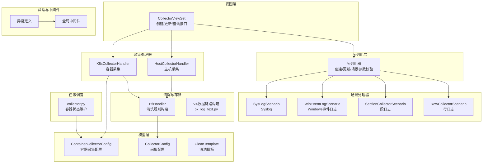
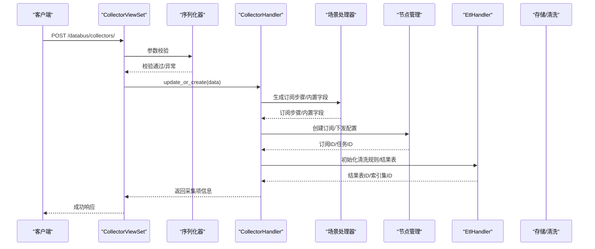
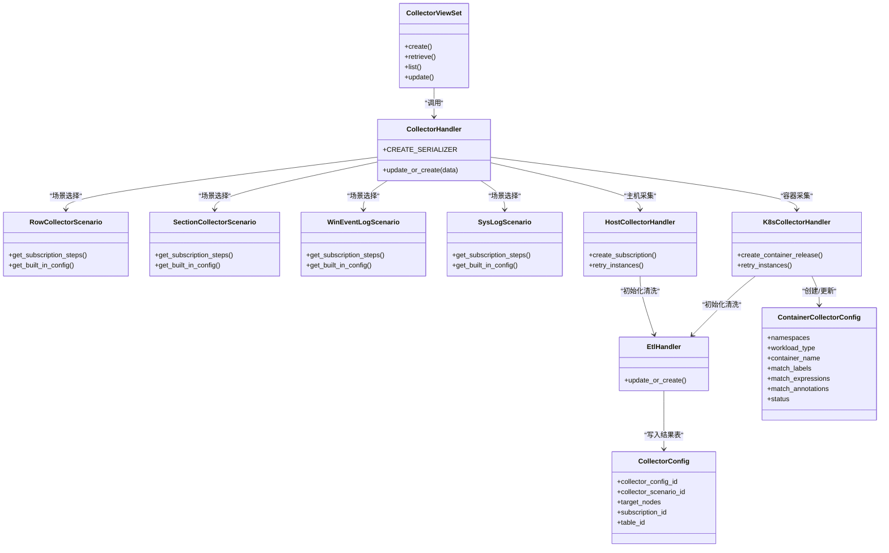

# 采集项创建流程

<cite>
**本文档引用的文件**
- [collector_views.py](file://apps/log_databus/views/collector_views.py)
- [models.py](file://apps/log_databus/models.py)
- [serializers.py](file://apps/log_databus/serializers.py)
- [row.py](file://apps/log_databus/handlers/collector_scenario/row.py)
- [section.py](file://apps/log_databus/handlers/collector_scenario/section.py)
- [wineventlog.py](file://apps/log_databus/handlers/collector_scenario/wineventlog.py)
- [syslog.py](file://apps/log_databus/handlers/collector_scenario/syslog.py)
- [host.py](file://apps/log_databus/handlers/collector/host.py)
- [k8s.py](file://apps/log_databus/handlers/collector/k8s.py)
- [bk_log_text.py](file://apps/log_databus/handlers/etl_storage/bk_log_text.py)
- [bk_log_delimiter.py](file://apps/log_databus/handlers/etl_storage/bk_log_delimiter.py)
- [bk_log_regexp.py](file://apps/log_databus/handlers/etl_storage/bk_log_regexp.py)
- [collector.py](file://apps/log_databus/tasks/collector.py)
- [exceptions.py](file://apps/exceptions.py)
- [middlewares.py](file://apps/middlewares.py)
</cite>

## 目录
1. [简介](#简介)
2. [项目结构](#项目结构)
3. [核心组件](#核心组件)
4. [架构总览](#架构总览)
5. [详细组件分析](#详细组件分析)
6. [依赖分析](#依赖分析)
7. [性能考虑](#性能考虑)
8. [故障排查指南](#故障排查指南)
9. [结论](#结论)
10. [附录](#附录)

## 简介
本技术文档围绕“采集项创建流程”展开，系统性阐述从采集场景选择、目标节点配置、采集规则设置到数据链路选择与清洗规则初始化的完整生命周期。文档同时对比主机采集、容器采集、自定义采集等不同场景的实现差异，并提供参数验证、命名规范、字段配置、性能优化等最佳实践与常见问题解决方案。

## 项目结构
采集项创建相关能力主要分布在以下模块：
- 视图层：负责接收请求、参数校验与调用处理器
- 模型层：定义采集配置、清洗模板、容器采集配置等数据模型
- 序列化层：定义创建/更新请求参数的结构与校验规则
- 场景处理器：针对不同采集场景（行日志、段日志、Windows事件日志、Syslog）生成订阅步骤与内置字段
- 采集处理器：主机与容器采集的生命周期管理
- 清洗与存储：构建清洗规则与结果表配置
- 任务调度：周期性任务与容器采集状态维护
- 异常与中间件：统一异常处理与响应格式

图表来源
- [collector_views.py](file://apps/log_databus/views/collector_views.py)
- [serializers.py](file://apps/log_databus/serializers.py)
- [models.py](file://apps/log_databus/models.py)
- [row.py](file://apps/log_databus/handlers/collector_scenario/row.py)
- [section.py](file://apps/log_databus/handlers/collector_scenario/section.py)
- [wineventlog.py](file://apps/log_databus/handlers/collector_scenario/wineventlog.py)
- [syslog.py](file://apps/log_databus/handlers/collector_scenario/syslog.py)
- [host.py](file://apps/log_databus/handlers/collector/host.py)
- [k8s.py](file://apps/log_databus/handlers/collector/k8s.py)
- [bk_log_text.py](file://apps/log_databus/handlers/etl_storage/bk_log_text.py)
- [collector.py](file://apps/log_databus/tasks/collector.py)
- [exceptions.py](file://apps/exceptions.py)
- [middlewares.py](file://apps/middlewares.py)

章节来源
- [collector_views.py](file://apps/log_databus/views/collector_views.py)
- [models.py](file://apps/log_databus/models.py)

## 核心组件
- 视图控制器：提供采集项的创建、更新、查询、任务状态等接口，负责权限控制与参数校验
- 序列化器：定义创建/更新请求参数结构，执行场景特定的必填字段校验
- 场景处理器：根据不同采集场景生成订阅步骤与内置字段配置
- 采集处理器：主机与容器采集的生命周期管理（创建、启动、停止、重试、销毁）
- 清洗与存储：构建清洗规则、结果表配置，支持V4数据链路
- 任务调度：维护容器采集配置状态，支持周期性任务

章节来源
- [collector_views.py](file://apps/log_databus/views/collector_views.py)
- [serializers.py](file://apps/log_databus/serializers.py)
- [models.py](file://apps/log_databus/models.py)

## 架构总览
采集项创建的总体流程如下：

图表来源
- [collector_views.py](file://apps/log_databus/views/collector_views.py)
- [serializers.py](file://apps/log_databus/serializers.py)
- [row.py](file://apps/log_databus/handlers/collector_scenario/row.py)
- [section.py](file://apps/log_databus/handlers/collector_scenario/section.py)
- [wineventlog.py](file://apps/log_databus/handlers/collector_scenario/wineventlog.py)
- [syslog.py](file://apps/log_databus/handlers/collector_scenario/syslog.py)
- [host.py](file://apps/log_databus/handlers/collector/host.py)
- [k8s.py](file://apps/log_databus/handlers/collector/k8s.py)
- [bk_log_text.py](file://apps/log_databus/handlers/etl_storage/bk_log_text.py)

## 详细组件分析

### 1. 采集场景选择与参数校验
- 场景枚举与参数校验：序列化器对不同场景的必填参数进行校验，如段日志的多行正则、最大行数、超时；Windows事件日志的事件名称；Syslog的协议与端口等
- 场景处理器：每种场景生成订阅步骤与内置字段，确保采集器配置正确下发

章节来源
- [serializers.py](file://apps/log_databus/serializers.py)
- [row.py](file://apps/log_databus/handlers/collector_scenario/row.py)
- [section.py](file://apps/log_databus/handlers/collector_scenario/section.py)
- [wineventlog.py](file://apps/log_databus/handlers/collector_scenario/wineventlog.py)
- [syslog.py](file://apps/log_databus/handlers/collector_scenario/syslog.py)

### 2. 目标节点配置
- 主机采集：通过节点管理订阅采集器，支持动态拓扑与静态主机实例
- 容器采集：基于BCS规则集与命名空间选择，支持工作负载类型/名称、容器名称、标签选择器与注解选择器

章节来源
- [host.py](file://apps/log_databus/handlers/collector/host.py)
- [k8s.py](file://apps/log_databus/handlers/collector/k8s.py)

### 3. 采集规则设置
- 行日志/段日志：支持路径、过滤方式（匹配/分隔符）、分隔符过滤条件、多行正则与超时
- Windows事件日志：支持事件名称、级别、事件ID、来源、内容过滤
- Syslog：支持协议、端口、字段级过滤规则

章节来源
- [row.py](file://apps/log_databus/handlers/collector_scenario/row.py)
- [section.py](file://apps/log_databus/handlers/collector_scenario/section.py)
- [wineventlog.py](file://apps/log_databus/handlers/collector_scenario/wineventlog.py)
- [syslog.py](file://apps/log_databus/handlers/collector_scenario/syslog.py)

### 4. 数据链路选择与清洗规则初始化
- 数据链路：采集项创建时可指定数据链路ID，场景处理器将链路参数注入采集器配置
- 清洗规则：EtlHandler根据场景与参数生成清洗规则，支持文本/分隔符/正则等模式
- V4数据链路：支持启用V4数据链路，构建完整的JSON解析、内置字段提取与原文提取规则

章节来源
- [bk_log_text.py](file://apps/log_databus/handlers/etl_storage/bk_log_text.py)
- [bk_log_delimiter.py](file://apps/log_databus/handlers/etl_storage/bk_log_delimiter.py)
- [bk_log_regexp.py](file://apps/log_databus/handlers/etl_storage/bk_log_regexp.py)

### 5. 生命周期管理（主机/容器）
- 主机采集：创建订阅、下发任务、查询任务状态、重试、停止
- 容器采集：基于规则集创建/更新容器采集配置，支持批量重试与状态维护

章节来源
- [host.py](file://apps/log_databus/handlers/collector/host.py)
- [k8s.py](file://apps/log_databus/handlers/collector/k8s.py)
- [collector.py](file://apps/log_databus/tasks/collector.py)

### 6. 参数验证与错误处理
- 参数校验：序列化器对必填字段与格式进行严格校验
- 异常处理：统一异常定义与中间件响应格式，保证错误信息标准化

章节来源
- [serializers.py](file://apps/log_databus/serializers.py)
- [exceptions.py](file://apps/exceptions.py)
- [middlewares.py](file://apps/middlewares.py)

## 依赖分析

图表来源
- [collector_views.py](file://apps/log_databus/views/collector_views.py)
- [row.py](file://apps/log_databus/handlers/collector_scenario/row.py)
- [section.py](file://apps/log_databus/handlers/collector_scenario/section.py)
- [wineventlog.py](file://apps/log_databus/handlers/collector_scenario/wineventlog.py)
- [syslog.py](file://apps/log_databus/handlers/collector_scenario/syslog.py)
- [host.py](file://apps/log_databus/handlers/collector/host.py)
- [k8s.py](file://apps/log_databus/handlers/collector/k8s.py)
- [bk_log_text.py](file://apps/log_databus/handlers/etl_storage/bk_log_text.py)
- [models.py](file://apps/log_databus/models.py)

## 性能考虑
- 采集器配置覆盖与边缘传输参数：场景处理器在生成订阅步骤时会注入边缘传输参数与采集器配置覆盖，减少重复下发与提升传输效率
- V4数据链路：启用V4数据链路可减少中间环节，提高清洗与入库效率
- 容器采集批处理：容器采集支持批量重试与状态维护，降低频繁操作带来的开销

章节来源
- [row.py](file://apps/log_databus/handlers/collector_scenario/row.py)
- [section.py](file://apps/log_databus/handlers/collector_scenario/section.py)
- [bk_log_text.py](file://apps/log_databus/handlers/etl_storage/bk_log_text.py)
- [collector.py](file://apps/log_databus/tasks/collector.py)

## 故障排查指南
- 参数校验失败：检查序列化器对场景特定字段的校验，确保必填字段完整
- 订阅任务状态异常：通过节点管理接口查询订阅任务状态，确认采集器部署情况
- 容器采集状态异常：检查容器采集配置状态与周期性任务执行情况
- 异常响应格式：统一由中间件处理异常，确保错误码与消息标准化

章节来源
- [serializers.py](file://apps/log_databus/serializers.py)
- [host.py](file://apps/log_databus/handlers/collector/host.py)
- [k8s.py](file://apps/log_databus/handlers/collector/k8s.py)
- [collector.py](file://apps/log_databus/tasks/collector.py)
- [middlewares.py](file://apps/middlewares.py)

## 结论
采集项创建流程通过“场景选择—目标配置—规则设置—数据链路—清洗初始化—生命周期管理”的闭环设计，实现了主机、容器与多种采集场景的统一接入。配合严格的参数校验、标准化的异常处理与性能优化策略，能够满足大规模日志采集的稳定性与可运维性要求。

## 附录

### A. 采集场景差异对比
- 行日志：适用于逐行解析的日志，支持路径与过滤规则
- 段日志：适用于多行聚合日志，需配置多行正则、最大行数与超时
- Windows事件日志：支持事件名称、级别、ID、来源与内容过滤
- Syslog：支持协议、端口与字段级过滤规则

章节来源
- [row.py](file://apps/log_databus/handlers/collector_scenario/row.py)
- [section.py](file://apps/log_databus/handlers/collector_scenario/section.py)
- [wineventlog.py](file://apps/log_databus/handlers/collector_scenario/wineventlog.py)
- [syslog.py](file://apps/log_databus/handlers/collector_scenario/syslog.py)

### B. 参数验证与命名规范
- 必填字段：不同场景的必填参数需在序列化器中明确校验
- 英文名规范：采集项英文名需避免以6-8位数字结尾
- 字段配置：内置字段与时间字段需按场景正确配置

章节来源
- [serializers.py](file://apps/log_databus/serializers.py)
- [models.py](file://apps/log_databus/models.py)

### C. 创建示例与最佳实践
- 创建示例：参考视图接口文档中的请求样例，确保场景、目标节点、参数与数据链路配置完整
- 最佳实践：合理设置过滤规则与分隔符，启用V4数据链路以提升性能，定期检查订阅任务与容器采集状态

章节来源
- [collector_views.py](file://apps/log_databus/views/collector_views.py)