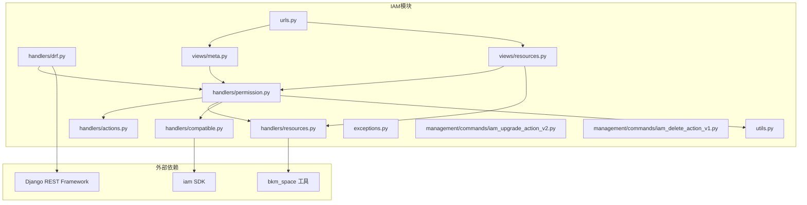
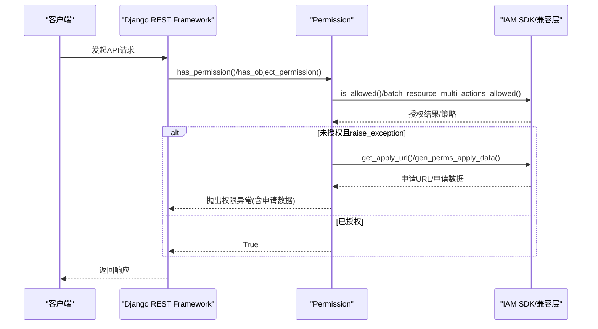
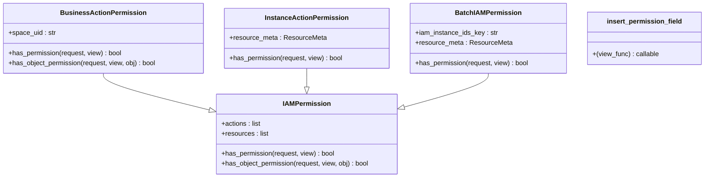
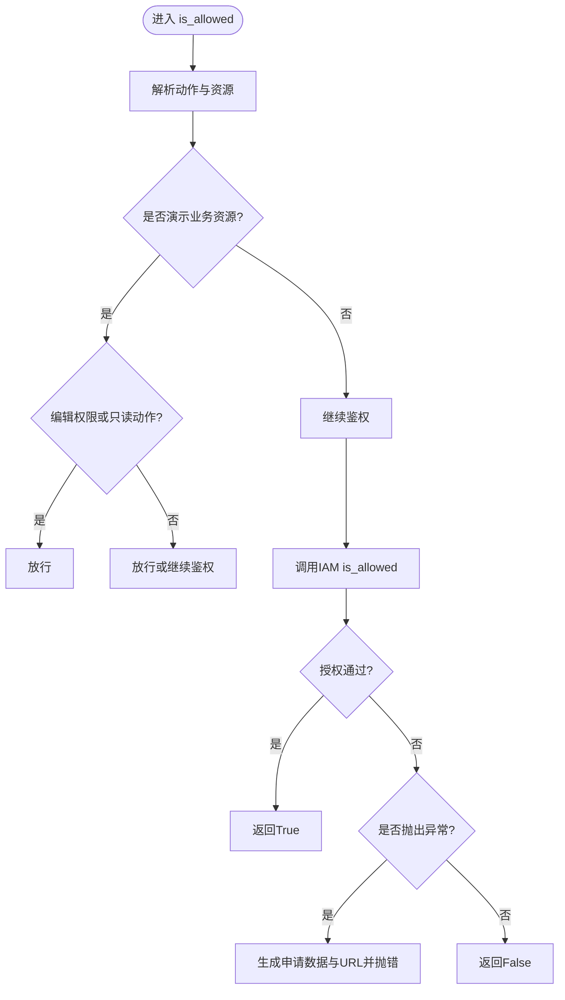
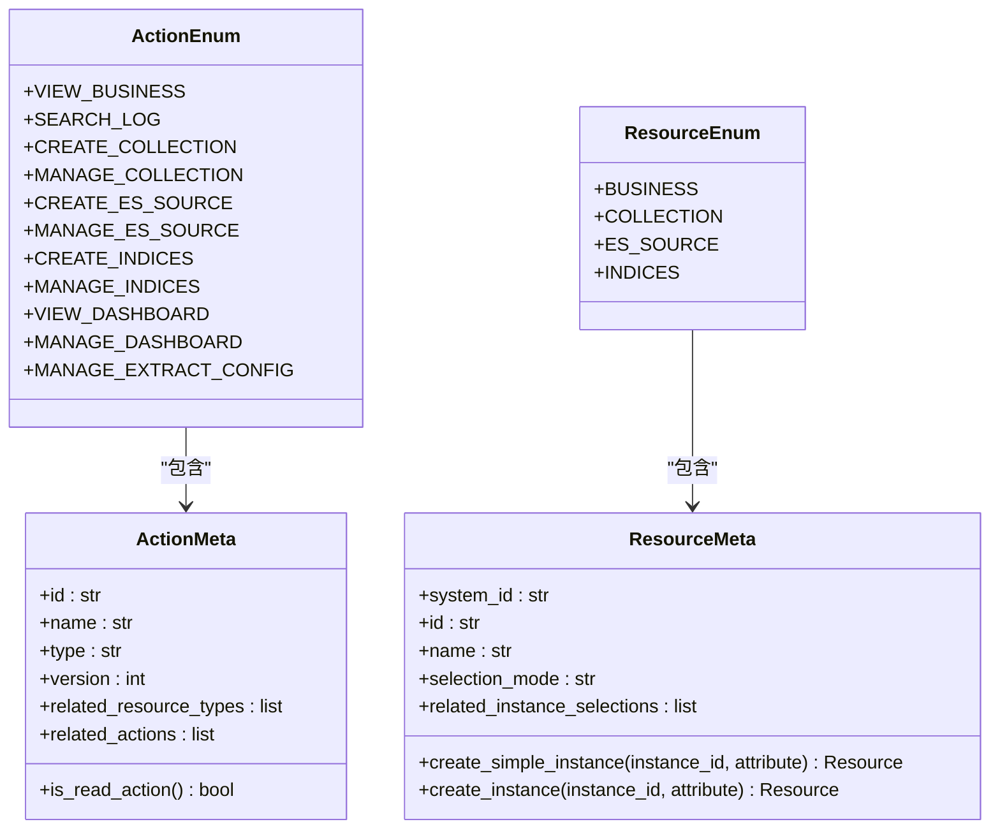
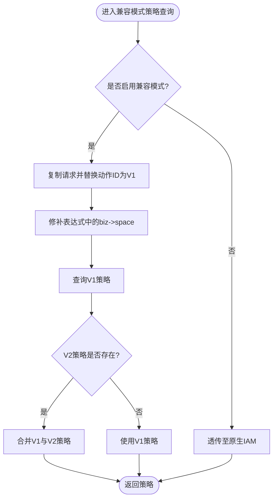
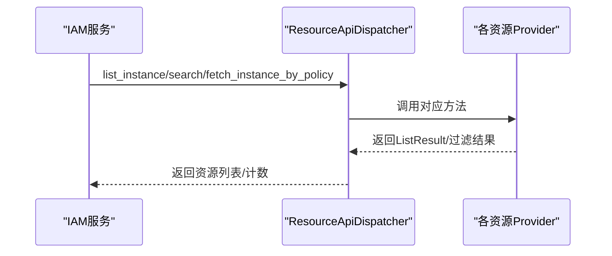
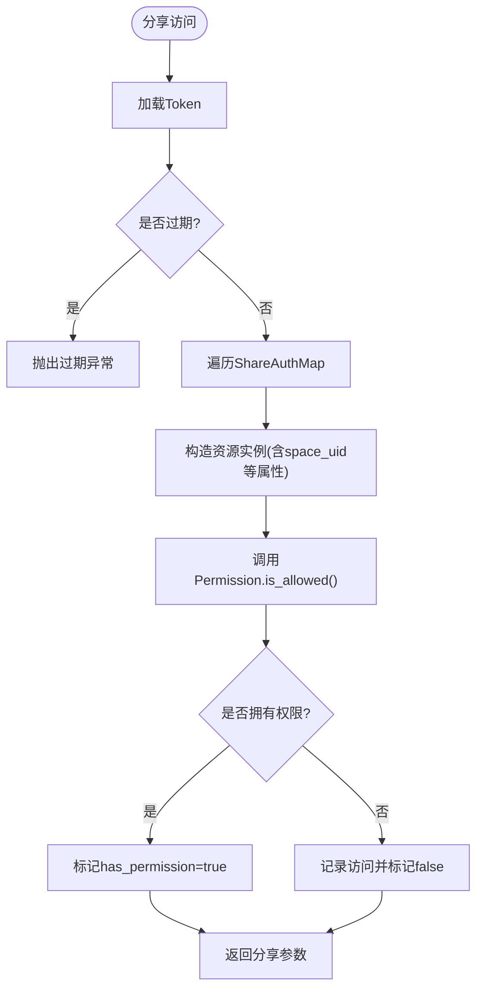
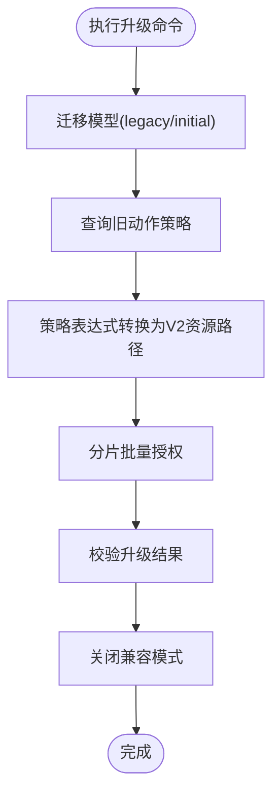
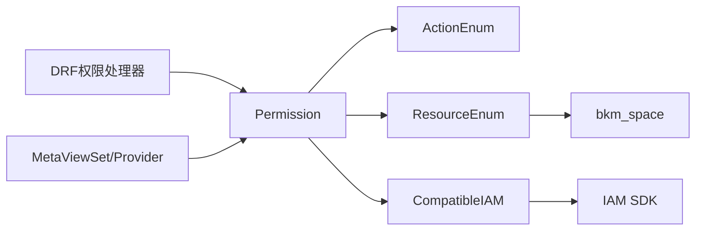

# IAM集成

<cite>
**本文引用的文件**
- [apps/iam/handlers/drf.py](file://apps/iam/handlers/drf.py)
- [apps/iam/handlers/permission.py](file://apps/iam/handlers/permission.py)
- [apps/iam/handlers/actions.py](file://apps/iam/handlers/actions.py)
- [apps/iam/handlers/resources.py](file://apps/iam/handlers/resources.py)
- [apps/iam/handlers/compatible.py](file://apps/iam/handlers/compatible.py)
- [apps/iam/views/meta.py](file://apps/iam/views/meta.py)
- [apps/iam/views/resources.py](file://apps/iam/views/resources.py)
- [apps/iam/utils.py](file://apps/iam/utils.py)
- [apps/iam/urls.py](file://apps/iam/urls.py)
- [apps/iam/exceptions.py](file://apps/iam/exceptions.py)
- [apps/iam/management/commands/iam_upgrade_action_v2.py](file://apps/iam/management/commands/iam_upgrade_action_v2.py)
- [apps/iam/management/commands/iam_delete_action_v1.py](file://apps/iam/management/commands/iam_delete_action_v1.py)
- [apps/log_commons/share.py](file://apps/log_commons/share.py)
</cite>

## 目录
1. [简介](#简介)
2. [项目结构](#项目结构)
3. [核心组件](#核心组件)
4. [架构总览](#架构总览)
5. [详细组件分析](#详细组件分析)
6. [依赖关系分析](#依赖关系分析)
7. [性能考量](#性能考量)
8. [故障排查指南](#故障排查指南)
9. [结论](#结论)
10. [附录](#附录)

## 简介
本文件面向蓝鲸权限中心（IAM）在本项目的集成实现，围绕以下目标展开：
- 权限申请与审批流程：如何基于IAM生成申请数据与跳转链接，以及在鉴权失败时的引导。
- DRF权限处理器：如何在Django REST Framework中集成IAM权限校验与批量权限注入。
- IAM兼容性处理：版本升级、兼容模式、策略迁移与降级处理。
- 权限删除与升级命令：如何安全地执行旧版动作清理与新版策略迁移。
- 权限分享：如何基于Token与权限映射实现受控分享。
- 配置方法、同步策略与问题诊断。

## 项目结构
IAM相关代码主要集中在 apps/iam 目录，包含：
- handlers：权限封装、动作与资源元数据、DRF权限处理器、兼容模式客户端、工具函数。
- views：IAM元信息接口、资源Provider与Dispatcher。
- management/commands：权限升级、删除旧动作等运维命令。
- urls：路由注册与资源API分发器。

图表来源
- [apps/iam/handlers/drf.py:41-269](file://apps/iam/handlers/drf.py#L41-L269)
- [apps/iam/handlers/permission.py:57-444](file://apps/iam/handlers/permission.py#L57-L444)
- [apps/iam/handlers/actions.py:29-291](file://apps/iam/handlers/actions.py#L29-L291)
- [apps/iam/handlers/resources.py:34-240](file://apps/iam/handlers/resources.py#L34-L240)
- [apps/iam/handlers/compatible.py:9-140](file://apps/iam/handlers/compatible.py#L9-L140)
- [apps/iam/views/meta.py:30-200](file://apps/iam/views/meta.py#L30-L200)
- [apps/iam/views/resources.py:40-480](file://apps/iam/views/resources.py#L40-L480)
- [apps/iam/utils.py:6-79](file://apps/iam/utils.py#L6-L79)
- [apps/iam/urls.py:38-52](file://apps/iam/urls.py#L38-L52)

章节来源
- [apps/iam/urls.py:38-52](file://apps/iam/urls.py#L38-L52)

## 核心组件
- 权限封装与鉴权入口：Permission 类负责构建Request、批量鉴权、生成申请数据、过滤空间列表、创建资源实例等。
- DRF权限处理器：IAMPermission、BusinessActionPermission、InstanceActionPermission、BatchIAMPermission等，覆盖视图级与对象级权限校验；insert_permission_field装饰器用于在序列化结果中注入权限字段。
- 动作与资源元数据：ActionEnum定义动作，ResourceEnum定义资源类型，支持版本化动作ID（如 _v2）。
- 兼容模式客户端：CompatibleIAM在兼容模式下将V1策略转换为V2策略，或合并两者策略。
- 视图与资源Provider：MetaViewSet提供系统信息、权限检查、申请数据生成；资源Provider负责资源实例查询、路径匹配与策略评估。
- 管理命令：iam_upgrade_action_v2执行模型与策略升级；iam_delete_action_v1清理旧动作定义与策略。

章节来源
- [apps/iam/handlers/permission.py:57-444](file://apps/iam/handlers/permission.py#L57-L444)
- [apps/iam/handlers/drf.py:41-269](file://apps/iam/handlers/drf.py#L41-L269)
- [apps/iam/handlers/actions.py:76-291](file://apps/iam/handlers/actions.py#L76-L291)
- [apps/iam/handlers/resources.py:218-240](file://apps/iam/handlers/resources.py#L218-L240)
- [apps/iam/handlers/compatible.py:9-140](file://apps/iam/handlers/compatible.py#L9-L140)
- [apps/iam/views/meta.py:30-200](file://apps/iam/views/meta.py#L30-L200)
- [apps/iam/views/resources.py:40-480](file://apps/iam/views/resources.py#L40-L480)
- [apps/iam/management/commands/iam_upgrade_action_v2.py:70-417](file://apps/iam/management/commands/iam_upgrade_action_v2.py#L70-L417)
- [apps/iam/management/commands/iam_delete_action_v1.py:44-79](file://apps/iam/management/commands/iam_delete_action_v1.py#L44-L79)

## 架构总览
IAM集成采用“封装+适配+视图+命令”的分层设计：
- 封装层：Permission统一调用IAM SDK，处理异常、生成申请数据、批量鉴权。
- 适配层：CompatibleIAM在兼容模式下桥接V1/V2策略。
- 视图层：MetaViewSet提供元能力接口；资源Provider对接IAM资源API。
- DRF层：自定义权限类与装饰器，无缝接入REST框架。
- 命令层：运维命令完成模型与策略升级、清理。

图表来源
- [apps/iam/handlers/drf.py:46-73](file://apps/iam/handlers/drf.py#L46-L73)
- [apps/iam/handlers/permission.py:249-283](file://apps/iam/handlers/permission.py#L249-L283)
- [apps/iam/handlers/permission.py:174-222](file://apps/iam/handlers/permission.py#L174-L222)

## 详细组件分析

### DRF权限处理器
- IAMPermission：基础权限类，支持多动作与多资源的校验，支持忽略IAM开关。
- BusinessActionPermission：自动从请求或对象中解析业务ID，构造业务资源实例。
- InstanceActionPermission：根据URL参数或查询参数解析实例ID，构造资源实例。
- BatchIAMPermission：批量鉴权，从请求体或查询参数中解析实例ID列表。
- insert_permission_field：在视图响应中批量注入权限字段，支持豁免逻辑。

图表来源
- [apps/iam/handlers/drf.py:41-196](file://apps/iam/handlers/drf.py#L41-L196)
- [apps/iam/handlers/drf.py:198-269](file://apps/iam/handlers/drf.py#L198-L269)

章节来源
- [apps/iam/handlers/drf.py:41-196](file://apps/iam/handlers/drf.py#L41-L196)
- [apps/iam/handlers/drf.py:198-269](file://apps/iam/handlers/drf.py#L198-L269)

### 权限封装与鉴权入口（Permission）
- 构建Request/MultiActionRequest，支持多动作批量鉴权。
- 生成申请数据与申请URL，支持多资源类型聚合。
- 过滤空间列表：基于策略表达式与演示业务豁免。
- 批量资源多动作鉴权：支持演示业务豁免策略。
- 资源构造：按资源类型创建实例，自动补全路径与属性。

图表来源
- [apps/iam/handlers/permission.py:249-283](file://apps/iam/handlers/permission.py#L249-L283)
- [apps/iam/handlers/permission.py:295-313](file://apps/iam/handlers/permission.py#L295-L313)

章节来源
- [apps/iam/handlers/permission.py:57-444](file://apps/iam/handlers/permission.py#L57-L444)

### 动作与资源元数据
- ActionEnum：定义所有动作，支持版本化ID与依赖动作。
- ResourceEnum：定义资源类型，支持创建实例并自动补全路径。
- 工具函数：获取动作/资源元数据、生成动作JSON、递归获取依赖动作。

图表来源
- [apps/iam/handlers/actions.py:29-291](file://apps/iam/handlers/actions.py#L29-L291)
- [apps/iam/handlers/resources.py:34-240](file://apps/iam/handlers/resources.py#L34-L240)

章节来源
- [apps/iam/handlers/actions.py:76-291](file://apps/iam/handlers/actions.py#L76-L291)
- [apps/iam/handlers/resources.py:218-240](file://apps/iam/handlers/resources.py#L218-L240)

### 兼容性处理机制（CompatibleIAM）
- 兼容模式开关：通过全局配置控制是否启用兼容模式。
- 策略查询适配：当启用兼容模式时，将V2动作ID替换为V1动作ID查询策略，并将表达式中的“biz”字段替换为“space”，最终合并策略。
- 批量动作策略查询：对V2动作逐个查询V1策略并合并。

图表来源
- [apps/iam/handlers/compatible.py:47-91](file://apps/iam/handlers/compatible.py#L47-L91)
- [apps/iam/handlers/compatible.py:92-140](file://apps/iam/handlers/compatible.py#L92-L140)

章节来源
- [apps/iam/handlers/compatible.py:9-140](file://apps/iam/handlers/compatible.py#L9-L140)

### 视图与资源Provider
- MetaViewSet：提供系统信息查询、权限检查、申请数据生成接口。
- 资源Provider：
  - CollectionResourceProvider：采集项资源实例查询、路径匹配、策略评估。
  - EsSourceResourceProvider：ES源资源实例查询、路径匹配、策略评估。
  - IndicesResourceProvider：索引集资源实例查询、路径匹配、策略评估。
- 资源API分发器：将资源Provider注册到IAM Dispatcher，供IAM调用。

图表来源
- [apps/iam/views/resources.py:40-480](file://apps/iam/views/resources.py#L40-L480)
- [apps/iam/urls.py:38-52](file://apps/iam/urls.py#L38-L52)

章节来源
- [apps/iam/views/meta.py:30-200](file://apps/iam/views/meta.py#L30-L200)
- [apps/iam/views/resources.py:40-480](file://apps/iam/views/resources.py#L40-L480)
- [apps/iam/urls.py:38-52](file://apps/iam/urls.py#L38-L52)

### 权限分享功能
- ShareAuthMap：定义不同分享类型的权限映射（如日志检索）。
- ShareHandler：创建分享Token、校验过期、校验用户对资源实例的权限，记录访问记录。

图表来源
- [apps/log_commons/share.py:20-104](file://apps/log_commons/share.py#L20-L104)

章节来源
- [apps/log_commons/share.py:20-104](file://apps/log_commons/share.py#L20-L104)

### 权限删除与升级命令
- iam_upgrade_action_v2：执行模型迁移、查询旧策略、转换为新策略并批量授权、校验升级结果、关闭兼容模式。
- iam_delete_action_v1：删除旧动作定义及其策略（高危操作）。

图表来源
- [apps/iam/management/commands/iam_upgrade_action_v2.py:149-241](file://apps/iam/management/commands/iam_upgrade_action_v2.py#L149-L241)
- [apps/iam/management/commands/iam_delete_action_v1.py:63-78](file://apps/iam/management/commands/iam_delete_action_v1.py#L63-L78)

章节来源
- [apps/iam/management/commands/iam_upgrade_action_v2.py:70-417](file://apps/iam/management/commands/iam_upgrade_action_v2.py#L70-L417)
- [apps/iam/management/commands/iam_delete_action_v1.py:44-79](file://apps/iam/management/commands/iam_delete_action_v1.py#L44-L79)

## 依赖关系分析
- 组件耦合：
  - Permission高度依赖ActionEnum/ResourceEnum与CompatibleIAM。
  - DRF权限处理器依赖Permission与ResourceMeta。
  - 视图层依赖Permission与ResourceProvider。
  - 管理命令依赖Permission与IAM迁移工具。
- 外部依赖：
  - iam SDK：IAM鉴权、策略查询、申请数据生成。
  - bkm_space：空间UID与业务ID互转。
  - DRF：权限类与序列化装饰器。

图表来源
- [apps/iam/handlers/drf.py:35-40](file://apps/iam/handlers/drf.py#L35-L40)
- [apps/iam/handlers/permission.py:48-54](file://apps/iam/handlers/permission.py#L48-L54)
- [apps/iam/handlers/resources.py:31-32](file://apps/iam/handlers/resources.py#L31-L32)

章节来源
- [apps/iam/handlers/drf.py:35-40](file://apps/iam/handlers/drf.py#L35-L40)
- [apps/iam/handlers/permission.py:48-54](file://apps/iam/handlers/permission.py#L48-L54)
- [apps/iam/handlers/resources.py:31-32](file://apps/iam/handlers/resources.py#L31-L32)

## 性能考量
- 批量鉴权：Permission.batch_is_allowed与DRF的BatchIAMPermission可显著降低多次IAM调用开销。
- 分片授权：升级命令对策略分片授权，避免单次请求过大。
- 兼容模式策略合并：在兼容模式下先查询V1再合并策略，避免重复调用。
- 路径查询优化：资源Provider使用查询转换器与切片查询，减少数据库与IAM压力。

## 故障排查指南
- 鉴权失败：
  - 检查IGNORE_IAM_PERMISSION与SKIP_IAM_PERMISSION_CHECK开关。
  - 使用MetaViewSet的check_allowed与get_apply_data接口定位问题。
- 申请流程异常：
  - 确认get_apply_data返回的apply_url与apply_data是否正确生成。
- 兼容模式问题：
  - 检查GlobalConfig中的IAM_V1_COMPATIBLE配置，确认策略表达式是否被正确修补。
- 分享权限异常：
  - 核对ShareAuthMap映射与资源实例属性（如space_uid），确保路径补全正确。
- 升级命令失败：
  - 查看升级日志与校验结果，确认策略数量变化与兼容模式关闭状态。

章节来源
- [apps/iam/exceptions.py:29-65](file://apps/iam/exceptions.py#L29-L65)
- [apps/iam/views/meta.py:52-104](file://apps/iam/views/meta.py#L52-L104)
- [apps/iam/handlers/compatible.py:14-30](file://apps/iam/handlers/compatible.py#L14-L30)
- [apps/log_commons/share.py:68-94](file://apps/log_commons/share.py#L68-L94)
- [apps/iam/management/commands/iam_upgrade_action_v2.py:210-241](file://apps/iam/management/commands/iam_upgrade_action_v2.py#L210-L241)

## 结论
本IAM集成以Permission为核心，结合DRF权限处理器、资源Provider与兼容模式客户端，实现了从动作与资源元数据、鉴权与申请、到分享与运维命令的完整闭环。通过批量鉴权、策略分片与路径优化，兼顾了可用性与性能；通过兼容模式与升级命令，保障了版本演进的平滑过渡。

## 附录
- 配置要点
  - 设置APP_CODE、SECRET_KEY、BK_IAM_APIGATEWAY_URL、BK_IAM_SYSTEM_ID、BK_IAM_SYSTEM_NAME、BK_IAM_SAAS_HOST等。
  - 可选开关：IGNORE_IAM_PERMISSION、SKIP_IAM_PERMISSION_CHECK。
- 权限同步策略
  - 使用MetaViewSet的check_allowed定期校验关键动作。
  - 在资源Provider中利用策略表达式与路径匹配，减少不必要的IAM调用。
- 诊断建议
  - 使用MetaViewSet的get_system_info与get_apply_data辅助定位。
  - 升级前后对比策略数量与兼容模式状态。