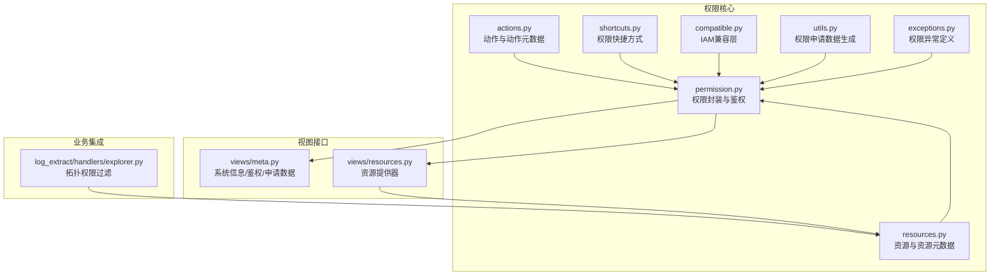
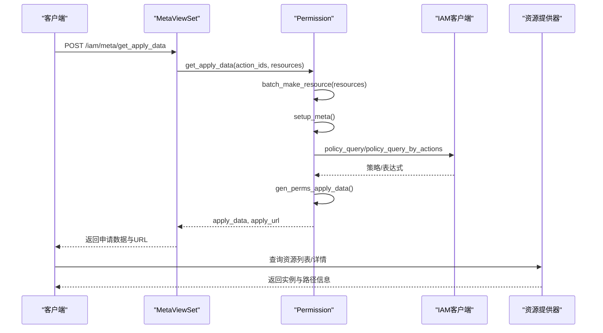
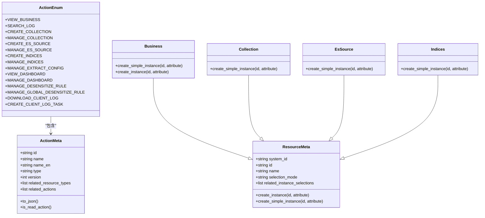
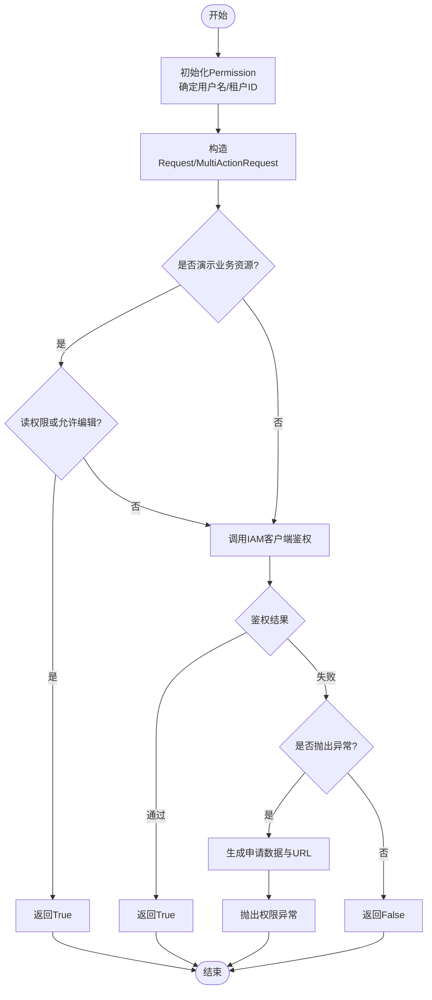
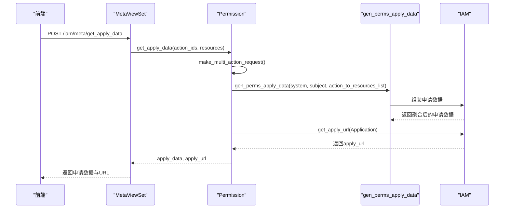
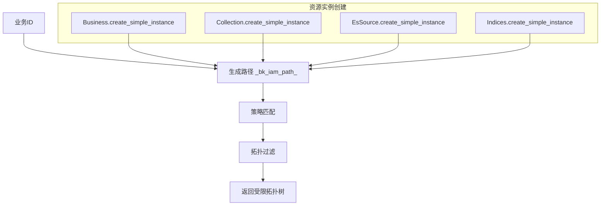
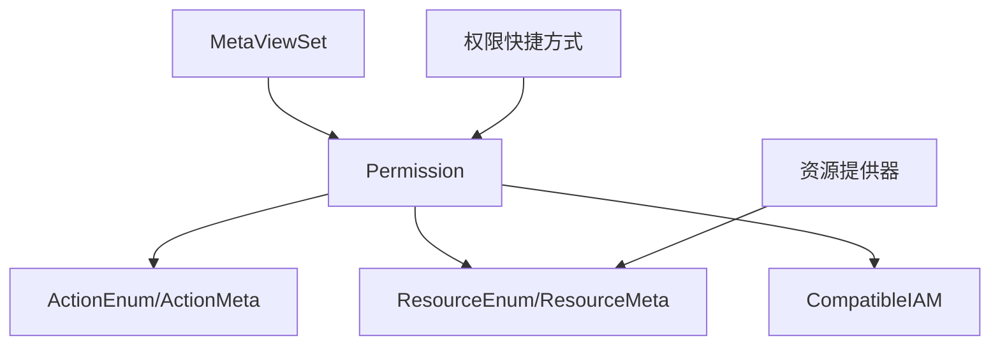

# RBAC权限模型

<cite>
**本文档引用的文件**
- [apps/iam/handlers/actions.py](file://apps/iam/handlers/actions.py)
- [apps/iam/handlers/resources.py](file://apps/iam/handlers/resources.py)
- [apps/iam/handlers/permission.py](file://apps/iam/handlers/permission.py)
- [apps/iam/handlers/shortcuts.py](file://apps/iam/handlers/shortcuts.py)
- [apps/iam/views/meta.py](file://apps/iam/views/meta.py)
- [apps/iam/views/resources.py](file://apps/iam/views/resources.py)
- [apps/iam/utils.py](file://apps/iam/utils.py)
- [apps/iam/exceptions.py](file://apps/iam/exceptions.py)
- [apps/iam/handlers/compatible.py](file://apps/iam/handlers/compatible.py)
- [apps/log_extract/handlers/explorer.py](file://apps/log_extract/handlers/explorer.py)
</cite>

## 目录
1. [简介](#简介)
2. [项目结构](#项目结构)
3. [核心组件](#核心组件)
4. [架构总览](#架构总览)
5. [详细组件分析](#详细组件分析)
6. [依赖关系分析](#依赖关系分析)
7. [性能考虑](#性能考虑)
8. [故障排除指南](#故障排除指南)
9. [结论](#结论)
10. [附录](#附录)

## 简介
本文件系统性梳理蓝鲸日志平台的RBAC权限模型实现，覆盖权限定义、角色管理、资源授权机制、权限申请与审批流程、权限快捷方式设计与使用、CMDB业务拓扑集成等。重点解析ActionEnum与ResourceEnum的权限枚举定义、Permission类的核心能力（权限验证、权限继承、权限组合）、权限豁免策略（如演示业务场景），以及与IAM系统的兼容适配与资源提供器。

## 项目结构
IAM相关代码主要集中在apps/iam目录，包含权限定义、资源定义、权限封装、视图接口、工具函数与兼容层；同时在各业务模块中通过装饰器或快捷方式调用权限校验。

**图表来源**
- [apps/iam/handlers/actions.py:29-291](file://apps/iam/handlers/actions.py#L29-L291)
- [apps/iam/handlers/resources.py:34-240](file://apps/iam/handlers/resources.py#L34-L240)
- [apps/iam/handlers/permission.py:57-444](file://apps/iam/handlers/permission.py#L57-L444)
- [apps/iam/handlers/shortcuts.py:29-34](file://apps/iam/handlers/shortcuts.py#L29-L34)
- [apps/iam/handlers/compatible.py:9-140](file://apps/iam/handlers/compatible.py#L9-L140)
- [apps/iam/utils.py:6-78](file://apps/iam/utils.py#L6-L78)
- [apps/iam/views/meta.py:30-200](file://apps/iam/views/meta.py#L30-L200)
- [apps/iam/views/resources.py:40-480](file://apps/iam/views/resources.py#L40-L480)
- [apps/log_extract/handlers/explorer.py:293-315](file://apps/log_extract/handlers/explorer.py#L293-L315)

**章节来源**
- [apps/iam/handlers/__init__.py:23-31](file://apps/iam/handlers/__init__.py#L23-L31)

## 核心组件
- ActionEnum与ActionMeta：定义平台内所有动作（权限点），含动作ID、名称、类型（view/create/manage）、版本、关联资源类型与相关动作（继承关系）。
- ResourceEnum与ResourceMeta：定义资源类型（业务空间、采集项、ES源、索引集），提供实例创建与路径补全逻辑。
- Permission：封装IAM客户端调用，提供单/多动作权限校验、批量校验、权限申请数据生成、系统信息获取、资源创建者授权等。
- 视图接口：提供系统信息查询、权限校验、权限申请数据获取等REST接口。
- 资源提供器：对接IAM资源目录，提供实例列表、详情、按策略筛选、搜索等能力。
- 兼容层：支持IAM V1/V2策略合并与字段映射，保证历史策略可用。
- 快捷方式：简化权限校验调用，便于在业务代码中快速使用。

**章节来源**
- [apps/iam/handlers/actions.py:76-291](file://apps/iam/handlers/actions.py#L76-L291)
- [apps/iam/handlers/resources.py:218-240](file://apps/iam/handlers/resources.py#L218-L240)
- [apps/iam/handlers/permission.py:57-444](file://apps/iam/handlers/permission.py#L57-L444)
- [apps/iam/views/meta.py:30-200](file://apps/iam/views/meta.py#L30-L200)
- [apps/iam/views/resources.py:47-480](file://apps/iam/views/resources.py#L47-L480)
- [apps/iam/handlers/compatible.py:9-140](file://apps/iam/handlers/compatible.py#L9-L140)
- [apps/iam/handlers/shortcuts.py:29-34](file://apps/iam/handlers/shortcuts.py#L29-L34)

## 架构总览
蓝鲸日志平台的RBAC围绕“动作-资源”模型构建，Permission作为统一入口，结合ResourceMeta完成资源实例化与路径补全，并通过IAM客户端进行鉴权与策略查询。视图层提供系统信息与权限申请数据，资源提供器支撑资源目录与策略匹配。

**图表来源**
- [apps/iam/views/meta.py:106-194](file://apps/iam/views/meta.py#L106-L194)
- [apps/iam/handlers/permission.py:131-222](file://apps/iam/handlers/permission.py#L131-L222)
- [apps/iam/utils.py:6-78](file://apps/iam/utils.py#L6-L78)
- [apps/iam/views/resources.py:131-152](file://apps/iam/views/resources.py#L131-L152)

## 详细组件分析

### 动作与资源枚举（ActionEnum/ResourceEnum）
- 动作定义：ActionMeta承载动作元数据，ActionEnum集中声明所有动作，明确动作类型（view/create/manage）与版本，以及关联资源类型与相关动作（用于权限继承）。
- 资源定义：ResourceMeta抽象资源元数据，各具体资源（Business/Collection/EsSource/Indices）负责实例创建与属性补全，自动注入业务路径（_bk_iam_path_），确保策略匹配一致性。

**图表来源**
- [apps/iam/handlers/actions.py:29-291](file://apps/iam/handlers/actions.py#L29-L291)
- [apps/iam/handlers/resources.py:34-240](file://apps/iam/handlers/resources.py#L34-L240)

**章节来源**
- [apps/iam/handlers/actions.py:76-291](file://apps/iam/handlers/actions.py#L76-L291)
- [apps/iam/handlers/resources.py:218-240](file://apps/iam/handlers/resources.py#L218-L240)

### 权限封装（Permission类）
- 初始化与客户端：根据请求或本地环境确定用户名与租户ID，构造CompatibleIAM客户端，支持跳过鉴权配置与兼容模式。
- 权限校验：支持单动作与多动作校验，自动处理无关联资源的动作（置空资源），并支持批量校验。
- 权限申请：生成申请数据与申请URL，聚合跨系统/跨资源类型的申请信息。
- 系统信息：初始化权限中心系统、资源与动作元信息，供前端展示与交互。
- 资源创建者授权：为新创建的资源授予创建者相关权限。
- 演示业务豁免：针对演示业务资源与动作类型，按配置进行读写豁免。

**图表来源**
- [apps/iam/handlers/permission.py:57-313](file://apps/iam/handlers/permission.py#L57-L313)

**章节来源**
- [apps/iam/handlers/permission.py:57-444](file://apps/iam/handlers/permission.py#L57-L444)

### 权限申请与审批流程
- 申请数据生成：将动作与资源列表转换为IAM申请协议数据，按系统与资源类型聚合实例列表。
- 申请URL生成：根据应用信息生成跳转URL，支持无权限场景引导用户前往权限中心申请。
- 视图接口：提供获取系统信息、检查权限、生成申请数据的REST接口，便于前端集成。

**图表来源**
- [apps/iam/views/meta.py:106-194](file://apps/iam/views/meta.py#L106-L194)
- [apps/iam/handlers/permission.py:131-222](file://apps/iam/handlers/permission.py#L131-L222)
- [apps/iam/utils.py:6-78](file://apps/iam/utils.py#L6-L78)

**章节来源**
- [apps/iam/views/meta.py:106-194](file://apps/iam/views/meta.py#L106-L194)
- [apps/iam/utils.py:6-78](file://apps/iam/utils.py#L6-L78)

### 权限快捷方式（shortcuts）
- 设计理念：提供简洁的断言式权限校验入口，避免重复构造Permission实例与资源对象。
- 使用方法：在业务代码中直接调用断言函数，未通过时自动抛出权限异常，便于统一处理。

**章节来源**
- [apps/iam/handlers/shortcuts.py:29-34](file://apps/iam/handlers/shortcuts.py#L29-L34)

### CMDB业务拓扑集成
- 业务权限：通过业务空间（Business）资源类型与路径（_bk_iam_path_）实现业务级权限控制。
- 项目/空间权限：资源实例创建时自动补全业务ID与名称，确保策略匹配。
- 拓扑过滤：在日志提取等模块中，结合用户授权拓扑（biz/set/module）对IP选择器树进行过滤，仅展示用户有权限的节点。

**图表来源**
- [apps/iam/handlers/resources.py:98-125](file://apps/iam/handlers/resources.py#L98-L125)
- [apps/log_extract/handlers/explorer.py:293-315](file://apps/log_extract/handlers/explorer.py#L293-L315)

**章节来源**
- [apps/iam/handlers/resources.py:98-125](file://apps/iam/handlers/resources.py#L98-L125)
- [apps/log_extract/handlers/explorer.py:293-315](file://apps/log_extract/handlers/explorer.py#L293-L315)

### 资源提供器（Resource Provider）
- 支持实例列表、详情、按策略筛选、搜索等能力，内部通过Django QuerySet与IAM表达式转换器进行策略匹配。
- 多租户模式：在启用多租户时，按租户空间UID过滤资源集合。
- 路径信息：在需要返回路径时，为实例附加业务路径，确保策略评估一致。

**章节来源**
- [apps/iam/views/resources.py:47-480](file://apps/iam/views/resources.py#L47-L480)

### 兼容层（CompatibleIAM）
- 兼容模式：根据配置决定是否启用兼容模式，统一处理V1/V2动作与资源字段差异。
- 策略合并：当V2动作无策略时，回退到V1策略；若两者均有，进行OR合并，保证权限判定正确。
- 字段映射：将业务资源表达式中的biz字段替换为space字段，确保策略与资源类型一致。

**章节来源**
- [apps/iam/handlers/compatible.py:9-140](file://apps/iam/handlers/compatible.py#L9-L140)

## 依赖关系分析
- 松耦合：Permission依赖ActionEnum/ResourceEnum进行动作与资源解析，但不直接依赖具体业务模型，降低耦合度。
- 可扩展：新增动作/资源只需在对应枚举中添加条目，即可被Permission与视图接口识别。
- 依赖链：视图接口依赖Permission，Permission依赖IAM客户端与兼容层，资源提供器依赖资源元数据与模型查询。

**图表来源**
- [apps/iam/views/meta.py:26-27](file://apps/iam/views/meta.py#L26-L27)
- [apps/iam/handlers/permission.py:48-52](file://apps/iam/handlers/permission.py#L48-L52)
- [apps/iam/handlers/compatible.py:9-30](file://apps/iam/handlers/compatible.py#L9-L30)
- [apps/iam/handlers/shortcuts.py:24-26](file://apps/iam/handlers/shortcuts.py#L24-L26)

**章节来源**
- [apps/iam/views/meta.py:26-27](file://apps/iam/views/meta.py#L26-L27)
- [apps/iam/handlers/permission.py:48-52](file://apps/iam/handlers/permission.py#L48-L52)
- [apps/iam/handlers/shortcuts.py:24-26](file://apps/iam/handlers/shortcuts.py#L24-L26)

## 性能考虑
- 批量鉴权：优先使用批量接口减少IAM调用次数，提高整体性能。
- 策略缓存：在兼容模式下，策略查询可能较频繁，建议在业务层缓存常用策略结果。
- 路径构建：资源实例创建时自动补全路径，避免重复计算，提升策略匹配效率。
- 多租户过滤：在资源提供器中尽早过滤租户范围内的资源，减少后续处理开销。

## 故障排除指南
- 权限异常：当鉴权失败且配置要求抛出异常时，会返回包含申请数据与URL的异常，前端可据此引导用户申请权限。
- 系统信息获取失败：系统信息查询失败会抛出相应异常，需检查IAM网关配置与系统注册状态。
- 动作/资源不存在：当动作ID或资源ID不在枚举中，会抛出相应异常，需确认枚举定义与版本。
- 兼容模式问题：若出现V1/V2策略不一致，检查兼容模式配置与策略字段映射。

**章节来源**
- [apps/iam/exceptions.py:29-65](file://apps/iam/exceptions.py#L29-L65)
- [apps/iam/handlers/permission.py:332-339](file://apps/iam/handlers/permission.py#L332-L339)
- [apps/iam/handlers/compatible.py:14-30](file://apps/iam/handlers/compatible.py#L14-L30)

## 结论
蓝鲸日志平台的RBAC权限模型以清晰的动作与资源枚举为基础，通过Permission类统一封装鉴权逻辑，并结合视图接口与资源提供器实现完整的权限申请与审批闭环。通过兼容层保障历史策略可用，通过快捷方式简化业务接入，通过CMDB业务拓扑实现细粒度权限控制。该模型具备良好的扩展性与可维护性，适合在复杂业务场景中持续演进。

## 附录
- 实际使用示例（路径指引）
  - 权限校验：[apps/iam/views/meta.py:52-104](file://apps/iam/views/meta.py#L52-L104)
  - 生成申请数据：[apps/iam/views/meta.py:106-194](file://apps/iam/views/meta.py#L106-L194)
  - 断言式校验：[apps/iam/handlers/shortcuts.py:29-34](file://apps/iam/handlers/shortcuts.py#L29-L34)
  - 资源实例创建：[apps/iam/handlers/resources.py:98-125](file://apps/iam/handlers/resources.py#L98-L125)
  - 拓扑权限过滤：[apps/log_extract/handlers/explorer.py:293-315](file://apps/log_extract/handlers/explorer.py#L293-L315)
- 最佳实践
  - 在新增动作/资源时同步更新枚举与相关视图接口。
  - 优先使用批量鉴权与快捷方式，减少重复代码。
  - 在多租户环境下，确保资源提供器正确过滤租户范围内的资源。
  - 遇到策略不一致问题，检查兼容模式配置与字段映射。