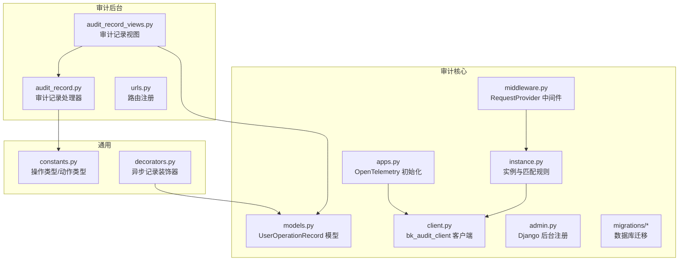
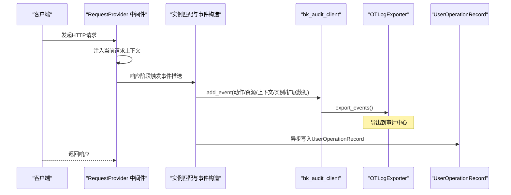
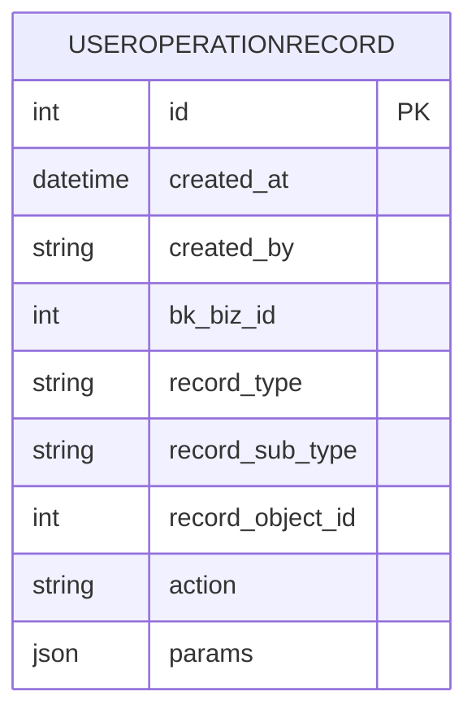
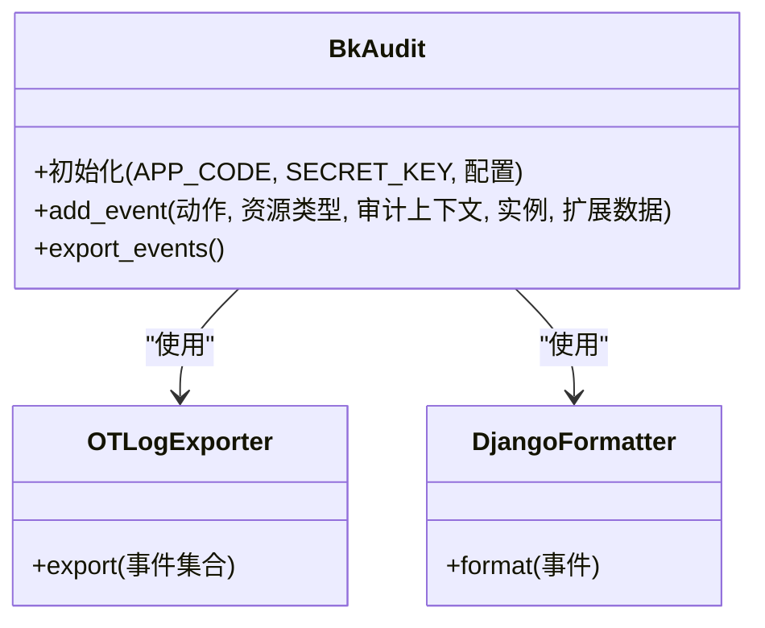
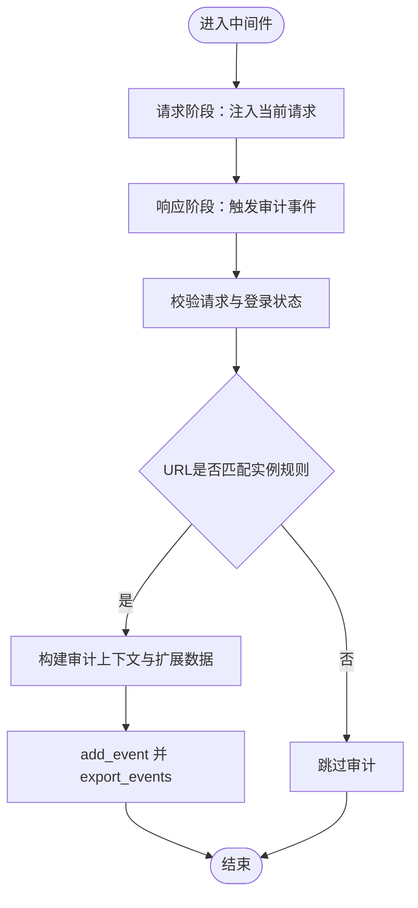
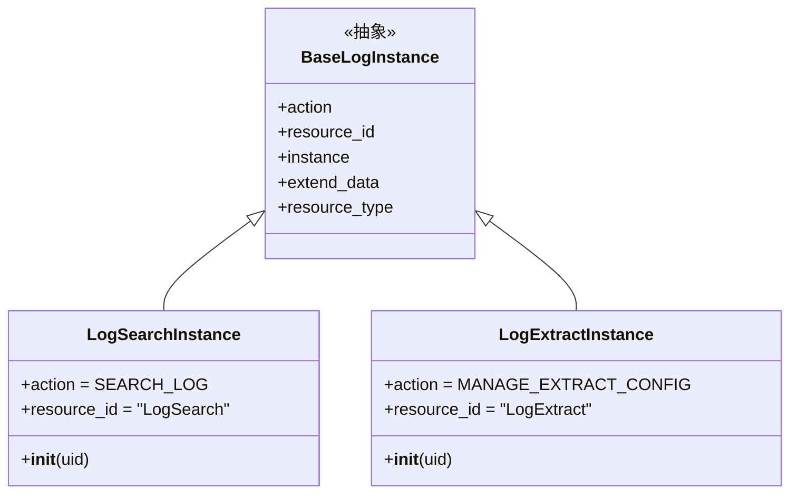
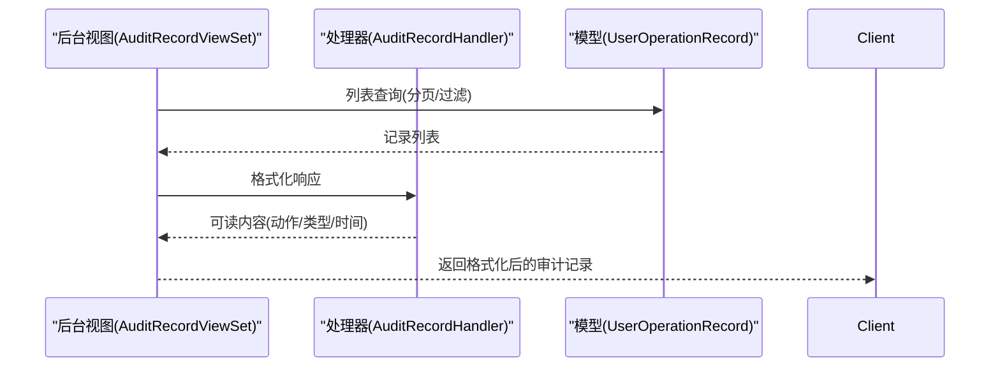
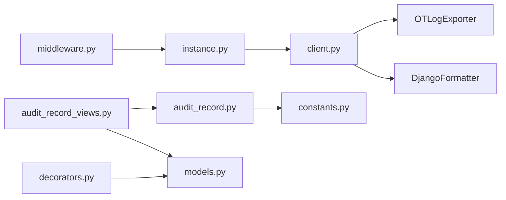

# 审计日志系统

<cite>
**本文引用的文件**
- [apps/log_audit/models.py](file://apps/log_audit/models.py)
- [apps/log_audit/client.py](file://apps/log_audit/client.py)
- [apps/log_audit/middleware.py](file://apps/log_audit/middleware.py)
- [apps/log_audit/instance.py](file://apps/log_audit/instance.py)
- [apps/log_audit/apps.py](file://apps/log_audit/apps.py)
- [apps/log_audit/admin.py](file://apps/log_audit/admin.py)
- [apps/log_audit/migrations/0001_initial.py](file://apps/log_audit/migrations/0001_initial.py)
- [apps/log_audit/migrations/0002_auto_20210713_1956.py](file://apps/log_audit/migrations/0002_auto_20210713_1956.py)
- [apps/bk_log_admin/views/audit_record_views.py](file://apps/bk_log_admin/views/audit_record_views.py)
- [apps/bk_log_admin/handlers/audit_record.py](file://apps/bk_log_admin/handlers/audit_record.py)
- [apps/bk_log_admin/urls.py](file://apps/bk_log_admin/urls.py)
- [apps/constants.py](file://apps/constants.py)
- [apps/decorators.py](file://apps/decorators.py)
</cite>

## 目录
1. [简介](#简介)
2. [项目结构](#项目结构)
3. [核心组件](#核心组件)
4. [架构总览](#架构总览)
5. [详细组件分析](#详细组件分析)
6. [依赖关系分析](#依赖关系分析)
7. [性能考虑](#性能考虑)
8. [故障排查指南](#故障排查指南)
9. [结论](#结论)
10. [附录](#附录)

## 简介
本技术文档面向审计日志系统，围绕审计日志的采集、存储与查询机制进行深入解析，覆盖操作审计、系统审计与安全审计的实现方式；详细说明审计记录模型的数据结构与字段定义，审计事件的分类与标记机制；阐述审计中间件的工作原理（请求拦截、审计信息提取与日志记录流程）；解释审计实例（instance）的管理机制（资源实例识别与关联）；提供审计客户端的实现细节（审计数据的发送、存储与查询接口）；并给出审计策略配置、审计报表生成与审计数据分析的使用示例。

## 项目结构
审计相关能力主要分布在以下模块：
- 审计核心模块：apps/log_audit（模型、客户端、中间件、实例、应用配置）
- 审计后台管理：apps/bk_log_admin（审计记录视图与处理器）
- 常量与装饰器：apps/constants.py、apps/decorators.py（操作类型、动作类型、异步记录装饰器）

图表来源
- [apps/log_audit/models.py:29-42](file://apps/log_audit/models.py#L29-L42)
- [apps/log_audit/client.py:30-34](file://apps/log_audit/client.py#L30-L34)
- [apps/log_audit/middleware.py:12-25](file://apps/log_audit/middleware.py#L12-L25)
- [apps/log_audit/instance.py:88-128](file://apps/log_audit/instance.py#L88-L128)
- [apps/log_audit/apps.py:30-38](file://apps/log_audit/apps.py#L30-L38)
- [apps/bk_log_admin/views/audit_record_views.py:32-86](file://apps/bk_log_admin/views/audit_record_views.py#L32-L86)
- [apps/bk_log_admin/handlers/audit_record.py:31-49](file://apps/bk_log_admin/handlers/audit_record.py#L31-L49)
- [apps/bk_log_admin/urls.py:26-39](file://apps/bk_log_admin/urls.py#L26-L39)
- [apps/constants.py:65-113](file://apps/constants.py#L65-L113)
- [apps/decorators.py:31-47](file://apps/decorators.py#L31-L47)

章节来源
- [apps/log_audit/models.py:29-42](file://apps/log_audit/models.py#L29-L42)
- [apps/log_audit/client.py:30-34](file://apps/log_audit/client.py#L30-L34)
- [apps/log_audit/middleware.py:12-25](file://apps/log_audit/middleware.py#L12-L25)
- [apps/log_audit/instance.py:88-128](file://apps/log_audit/instance.py#L88-L128)
- [apps/log_audit/apps.py:30-38](file://apps/log_audit/apps.py#L30-L38)
- [apps/bk_log_admin/views/audit_record_views.py:32-86](file://apps/bk_log_admin/views/audit_record_views.py#L32-L86)
- [apps/bk_log_admin/handlers/audit_record.py:31-49](file://apps/bk_log_admin/handlers/audit_record.py#L31-L49)
- [apps/bk_log_admin/urls.py:26-39](file://apps/bk_log_admin/urls.py#L26-L39)
- [apps/constants.py:65-113](file://apps/constants.py#L65-L113)
- [apps/decorators.py:31-47](file://apps/decorators.py#L31-L47)

## 核心组件
- 审计模型：UserOperationRecord，用于持久化操作审计记录，包含操作时间、操作者、业务ID、记录类型、记录子类型、记录对象ID、操作方法、请求参数等字段，并在数据库层面建立索引以优化查询。
- 审计客户端：基于 bk_audit 的 BkAudit 客户端，采用 DjangoFormatter 与 OTLogExporter，通过 OpenTelemetry 将审计事件导出到审计中心。
- 审计中间件：RequestProvider 在请求处理阶段注入当前请求上下文，并在响应阶段触发审计事件推送。
- 审计实例：通过正则匹配 URL，识别资源实例（如日志检索、日志提取），并为不同实例设置不同的动作与资源类型。
- 审计后台：提供审计记录的查询接口与格式化展示，支持按业务ID、记录类型、对象ID等维度筛选。
- 常量与装饰器：UserOperationTypeEnum 与 UserOperationActionEnum 定义了操作类型与动作类型，user_operation_record 装饰器负责异步写入数据库。

章节来源
- [apps/log_audit/models.py:29-42](file://apps/log_audit/models.py#L29-L42)
- [apps/log_audit/client.py:30-34](file://apps/log_audit/client.py#L30-L34)
- [apps/log_audit/middleware.py:12-25](file://apps/log_audit/middleware.py#L12-L25)
- [apps/log_audit/instance.py:88-128](file://apps/log_audit/instance.py#L88-L128)
- [apps/bk_log_admin/views/audit_record_views.py:32-86](file://apps/bk_log_admin/views/audit_record_views.py#L32-L86)
- [apps/constants.py:65-113](file://apps/constants.py#L65-L113)
- [apps/decorators.py:31-47](file://apps/decorators.py#L31-L47)

## 架构总览
审计系统由“采集-存储-查询-展示”四层构成：
- 采集层：中间件在请求生命周期中提取上下文与请求参数，匹配实例并构造审计事件。
- 存储层：通过 OpenTelemetry 导出器将事件发送至审计中心；同时提供本地数据库存储（UserOperationRecord）以支持后台查询与报表生成。
- 查询层：后台视图与处理器对审计记录进行格式化与分页展示。
- 展示层：Django 后台管理界面与前端交互。

图表来源
- [apps/log_audit/middleware.py:12-25](file://apps/log_audit/middleware.py#L12-L25)
- [apps/log_audit/instance.py:88-128](file://apps/log_audit/instance.py#L88-L128)
- [apps/log_audit/client.py:30-34](file://apps/log_audit/client.py#L30-L34)
- [apps/decorators.py:31-47](file://apps/decorators.py#L31-L47)

## 详细组件分析

### 审计模型：UserOperationRecord
- 字段定义与用途
  - created_at：操作时间，自动记录
  - created_by：操作者用户名
  - bk_biz_id：业务ID，用于多租户隔离与权限控制
  - record_type：记录类型（如采集项、索引集、检索配置等）
  - record_sub_type：记录子类型（可选）
  - record_object_id：记录对象ID（具体资源主键）
  - action：操作方法（如创建、更新、删除、任务重试等）
  - params：请求参数（JSON序列化）
- 索引设计：对 bk_biz_id、record_type、record_object_id 建立索引，提升后台查询效率
- 数据库迁移：初始迁移创建模型表结构，后续迁移保持兼容

图表来源
- [apps/log_audit/migrations/0001_initial.py:34-51](file://apps/log_audit/migrations/0001_initial.py#L34-L51)
- [apps/log_audit/models.py:29-42](file://apps/log_audit/models.py#L29-L42)

章节来源
- [apps/log_audit/models.py:29-42](file://apps/log_audit/models.py#L29-L42)
- [apps/log_audit/migrations/0001_initial.py:34-51](file://apps/log_audit/migrations/0001_initial.py#L34-L51)

### 审计客户端：bk_audit_client
- 组件职责
  - 初始化：基于 Django 设置中的 APP_CODE 与 SECRET_KEY
  - 格式化：使用 DjangoFormatter 将审计事件转换为标准格式
  - 导出：通过 OTLogExporter 将事件发送至审计中心
  - 服务名：通过 ServiceNameHandler 自动识别服务名称
- 集成方式：在应用 ready 阶段调用 setup，启用 OpenTelemetry 上报

图表来源
- [apps/log_audit/client.py:30-34](file://apps/log_audit/client.py#L30-L34)
- [apps/log_audit/apps.py:30-38](file://apps/log_audit/apps.py#L30-L38)

章节来源
- [apps/log_audit/client.py:30-34](file://apps/log_audit/client.py#L30-L34)
- [apps/log_audit/apps.py:30-38](file://apps/log_audit/apps.py#L30-L38)

### 审计中间件：RequestProvider
- 工作原理
  - 请求阶段：将当前请求注入到线程局部存储，供后续组件使用
  - 响应阶段：调用 push_event，基于 URL 正则匹配实例，构造审计事件并导出
- 关键点
  - 仅当请求具备 user 属性且已登录时才上报
  - 通过 get_request_parameters 提取表单与 JSON 参数
  - 使用 bk_audit_client.export_events() 主动导出

图表来源
- [apps/log_audit/middleware.py:12-25](file://apps/log_audit/middleware.py#L12-L25)
- [apps/log_audit/instance.py:88-128](file://apps/log_audit/instance.py#L88-L128)

章节来源
- [apps/log_audit/middleware.py:12-25](file://apps/log_audit/middleware.py#L12-L25)
- [apps/log_audit/instance.py:88-128](file://apps/log_audit/instance.py#L88-L128)

### 审计实例与URL匹配：InstanceFilter
- 实例类型
  - LogSearchInstance：针对日志检索相关接口（搜索、字段、上下文、导出、收藏、聚合、IP选择器等）
  - LogExtractInstance：针对日志提取相关接口（文件列表、拓扑、任务等）
- 匹配机制
  - 通过正则表达式匹配 URL 路径，命中后构造对应实例（含实例ID与名称）
  - 为实例设置 action 与 resource_id，作为审计事件的分类与标记
- 扩展方式
  - 可根据新接口路径扩展 InstanceFilter，确保新增接口自动纳入审计

图表来源
- [apps/log_audit/instance.py:48-86](file://apps/log_audit/instance.py#L48-L86)

章节来源
- [apps/log_audit/instance.py:48-86](file://apps/log_audit/instance.py#L48-L86)
- [apps/log_audit/instance.py:131-221](file://apps/log_audit/instance.py#L131-L221)

### 审计事件的分类与标记
- 分类依据
  - 动作类型：来源于 ActionEnum（如 SEARCH_LOG、MANAGE_EXTRACT_CONFIG）
  - 资源类型：来源于 resource_id（如 LogSearch、LogExtract）
- 标记机制
  - extend_data 中包含 action_name，便于审计中心识别操作语义
  - resource_type.id 作为资源标识，配合审计中心的资源模型

章节来源
- [apps/log_audit/instance.py:56-67](file://apps/log_audit/instance.py#L56-L67)
- [apps/log_audit/instance.py:114-127](file://apps/log_audit/instance.py#L114-L127)

### 审计客户端的发送、存储与查询接口
- 发送接口
  - add_event：构造审计事件并加入待导出队列
  - export_events：主动触发导出至审计中心
- 存储接口
  - 异步写入：通过 user_operation_record 装饰器将操作记录持久化到 UserOperationRecord
- 查询接口
  - 后台视图：AuditRecordViewSet 提供分页查询与格式化输出
  - 处理器：AuditRecordHandler 将记录类型与动作类型映射为可读文本，并格式化时间与时区

图表来源
- [apps/bk_log_admin/views/audit_record_views.py:32-86](file://apps/bk_log_admin/views/audit_record_views.py#L32-L86)
- [apps/bk_log_admin/handlers/audit_record.py:31-49](file://apps/bk_log_admin/handlers/audit_record.py#L31-L49)
- [apps/log_audit/models.py:29-42](file://apps/log_audit/models.py#L29-L42)

章节来源
- [apps/bk_log_admin/views/audit_record_views.py:32-86](file://apps/bk_log_admin/views/audit_record_views.py#L32-L86)
- [apps/bk_log_admin/handlers/audit_record.py:31-49](file://apps/bk_log_admin/handlers/audit_record.py#L31-L49)
- [apps/log_audit/models.py:29-42](file://apps/log_audit/models.py#L29-L42)

### 审计策略配置、报表生成与数据分析
- 策略配置
  - 通过环境变量启用 OpenTelemetry 上报：BKAPP_OTEL_LOG_ENDPOINT、BKAPP_OTEL_LOG_BK_DATA_TOKEN
  - 在应用 ready 阶段调用 setup，完成审计客户端初始化
- 报表生成
  - 后台提供分页查询接口，结合 record_type、record_object_id、bk_biz_id 进行筛选
  - 处理器将枚举值映射为中文标签，便于生成可读报表
- 数据分析
  - 可基于 UserOperationRecord 的字段进行统计分析（按时间、业务、操作类型、动作类型等维度）
  - 结合前端或第三方 BI 工具进行可视化展示

章节来源
- [apps/log_audit/apps.py:30-38](file://apps/log_audit/apps.py#L30-L38)
- [apps/bk_log_admin/views/audit_record_views.py:41-85](file://apps/bk_log_admin/views/audit_record_views.py#L41-L85)
- [apps/bk_log_admin/handlers/audit_record.py:31-49](file://apps/bk_log_admin/handlers/audit_record.py#L31-L49)
- [apps/constants.py:65-113](file://apps/constants.py#L65-L113)

## 依赖关系分析
- 组件耦合
  - 中间件依赖实例模块进行 URL 匹配与事件构造
  - 实例模块依赖审计客户端进行事件上报
  - 审计客户端依赖 OpenTelemetry 导出器与 Django 格式化器
  - 后台视图依赖处理器与模型进行数据展示与持久化
- 外部依赖
  - OpenTelemetry：用于审计事件导出
  - Django：提供请求上下文、ORM、后台管理等基础设施

图表来源
- [apps/log_audit/middleware.py:12-25](file://apps/log_audit/middleware.py#L12-L25)
- [apps/log_audit/instance.py:88-128](file://apps/log_audit/instance.py#L88-L128)
- [apps/log_audit/client.py:30-34](file://apps/log_audit/client.py#L30-L34)
- [apps/bk_log_admin/views/audit_record_views.py:32-86](file://apps/bk_log_admin/views/audit_record_views.py#L32-L86)
- [apps/bk_log_admin/handlers/audit_record.py:31-49](file://apps/bk_log_admin/handlers/audit_record.py#L31-L49)
- [apps/constants.py:65-113](file://apps/constants.py#L65-L113)
- [apps/decorators.py:31-47](file://apps/decorators.py#L31-L47)

章节来源
- [apps/log_audit/middleware.py:12-25](file://apps/log_audit/middleware.py#L12-L25)
- [apps/log_audit/instance.py:88-128](file://apps/log_audit/instance.py#L88-L128)
- [apps/log_audit/client.py:30-34](file://apps/log_audit/client.py#L30-L34)
- [apps/bk_log_admin/views/audit_record_views.py:32-86](file://apps/bk_log_admin/views/audit_record_views.py#L32-L86)
- [apps/bk_log_admin/handlers/audit_record.py:31-49](file://apps/bk_log_admin/handlers/audit_record.py#L31-L49)
- [apps/constants.py:65-113](file://apps/constants.py#L65-L113)
- [apps/decorators.py:31-47](file://apps/decorators.py#L31-L47)

## 性能考虑
- 导出策略
  - 使用 export_events 主动导出，避免阻塞请求响应；可在批量场景下合并事件
- 数据库写入
  - 异步写入 UserOperationRecord，降低对主请求路径的影响
- 查询优化
  - 为关键字段建立数据库索引，减少后台查询耗时
- 中间件开销
  - 仅在响应阶段触发审计事件，尽量减少请求阶段的计算与IO

## 故障排查指南
- 审计事件未上报
  - 检查环境变量 BKAPP_OTEL_LOG_ENDPOINT 是否配置
  - 确认应用 ready 阶段已调用 setup
  - 查看 OTLogExporter 的网络连通性与目标地址
- 未生成操作记录
  - 确认 user_operation_record 装饰器是否被正确调用
  - 检查 UserOperationRecord 表是否存在索引与权限
- 后台无法查询
  - 检查分页参数 page、pagesize 是否传入
  - 确认 record_type、record_object_id、bk_biz_id 等过滤条件是否有效

章节来源
- [apps/log_audit/apps.py:30-38](file://apps/log_audit/apps.py#L30-L38)
- [apps/decorators.py:31-47](file://apps/decorators.py#L31-L47)
- [apps/bk_log_admin/views/audit_record_views.py:81-85](file://apps/bk_log_admin/views/audit_record_views.py#L81-L85)

## 结论
本审计日志系统通过中间件自动采集、客户端统一导出与模型持久化相结合的方式，实现了对操作审计、系统审计与安全审计的全面覆盖。借助清晰的实例分类与标记机制、完善的后台查询与报表能力，系统能够满足日常审计需求，并为后续扩展与分析提供良好基础。

## 附录
- URL匹配规则扩展：在 InstanceFilter 中添加新的正则与实例类，即可自动纳入审计范围
- 常量映射：通过 UserOperationTypeEnum 与 UserOperationActionEnum 统一管理操作类型与动作类型，便于前后端一致性

章节来源
- [apps/log_audit/instance.py:131-221](file://apps/log_audit/instance.py#L131-L221)
- [apps/constants.py:65-113](file://apps/constants.py#L65-L113)