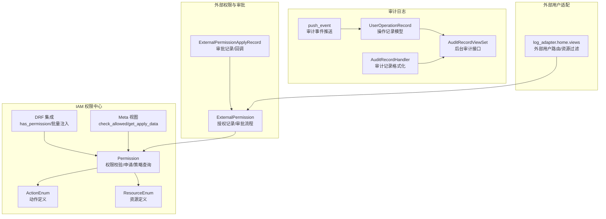
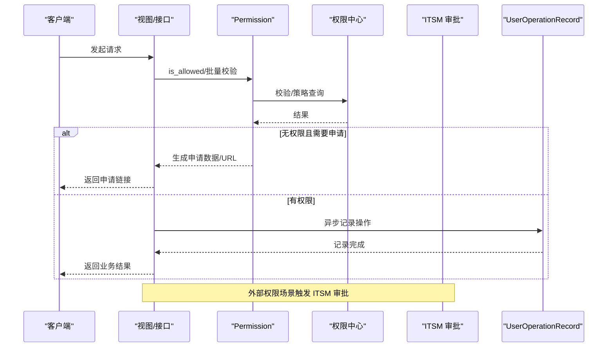
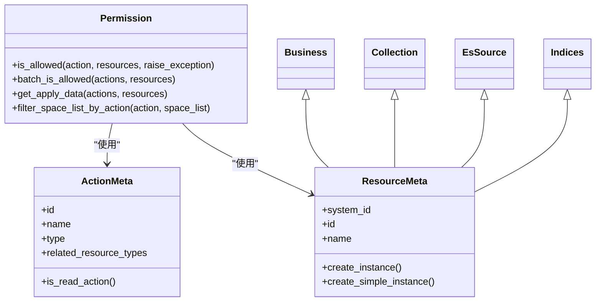
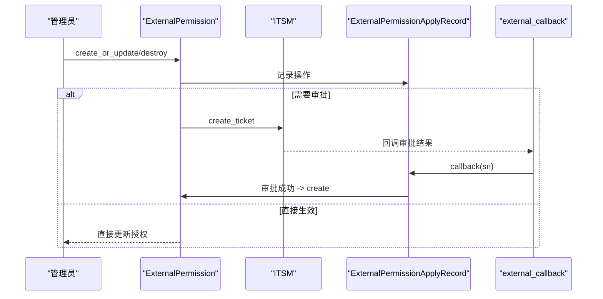
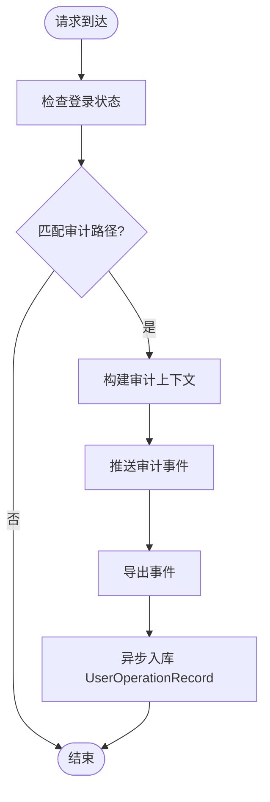
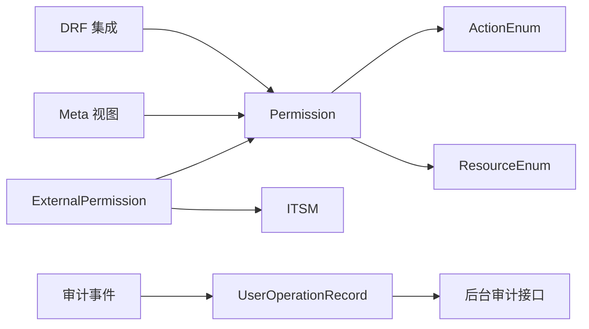

# 权限审计系统

<cite>
**本文档引用的文件**
- [apps/iam/handlers/permission.py](file://apps/iam/handlers/permission.py)
- [apps/iam/handlers/resources.py](file://apps/iam/handlers/resources.py)
- [apps/iam/handlers/actions.py](file://apps/iam/handlers/actions.py)
- [apps/iam/handlers/drf.py](file://apps/iam/handlers/drf.py)
- [apps/iam/views/meta.py](file://apps/iam/views/meta.py)
- [apps/log_commons/models.py](file://apps/log_commons/models.py)
- [apps/log_commons/handlers/external_permission.py](file://apps/log_commons/handlers/external_permission.py)
- [apps/log_audit/models.py](file://apps/log_audit/models.py)
- [apps/log_audit/admin.py](file://apps/log_audit/admin.py)
- [apps/log_audit/instance.py](file://apps/log_audit/instance.py)
- [apps/bk_log_admin/views/audit_record_views.py](file://apps/bk_log_admin/views/audit_record_views.py)
- [apps/bk_log_admin/handlers/audit_record.py](file://apps/bk_log_admin/handlers/audit_record.py)
- [apps/decorators.py](file://apps/decorators.py)
- [apps/log_search/handlers/index_set.py](file://apps/log_search/handlers/index_set.py)
- [log_adapter/home/views.py](file://log_adapter/home/views.py)
- [apps/iam/management/commands/iam_upgrade_action_v2.py](file://apps/iam/management/commands/iam_upgrade_action_v2.py)
</cite>

## 目录
1. [简介](#简介)
2. [项目结构](#项目结构)
3. [核心组件](#核心组件)
4. [架构总览](#架构总览)
5. [详细组件分析](#详细组件分析)
6. [依赖分析](#依赖分析)
7. [性能考虑](#性能考虑)
8. [故障排查指南](#故障排查指南)
9. [结论](#结论)
10. [附录](#附录)

## 简介
本技术文档面向权限审计系统，围绕基于 RBAC 的权限模型、IAM 集成（权限申请、审批流程、权限同步）、审计日志体系、API/数据/操作权限控制、安全最佳实践与排障指南进行全面阐述。文档以代码为依据，结合架构图与流程图，帮助开发者与运维人员快速理解与落地权限与审计能力。

## 项目结构
权限与审计相关能力主要分布在以下模块：
- IAM 权限中心适配层：动作、资源、DRF 集成、元接口与兼容模式
- 外部权限与审批：ITSM 审批、授权记录、回调处理
- 审计日志：操作记录模型、后台审计界面、审计事件推送
- 外部用户适配：插件化路由与资源过滤
- 权限升级与迁移：动作版本升级与策略迁移

图表来源
- [apps/iam/handlers/permission.py:57-444](file://apps/iam/handlers/permission.py#L57-L444)
- [apps/iam/handlers/actions.py:76-291](file://apps/iam/handlers/actions.py#L76-L291)
- [apps/iam/handlers/resources.py:218-240](file://apps/iam/handlers/resources.py#L218-L240)
- [apps/iam/handlers/drf.py:191-268](file://apps/iam/handlers/drf.py#L191-L268)
- [apps/iam/views/meta.py:56-199](file://apps/iam/views/meta.py#L56-L199)
- [apps/log_commons/models.py:142-678](file://apps/log_commons/models.py#L142-L678)
- [apps/log_audit/models.py:29-42](file://apps/log_audit/models.py#L29-L42)
- [apps/bk_log_admin/views/audit_record_views.py:32-85](file://apps/bk_log_admin/views/audit_record_views.py#L32-L85)
- [apps/bk_log_admin/handlers/audit_record.py:31-49](file://apps/bk_log_admin/handlers/audit_record.py#L31-L49)
- [apps/log_audit/instance.py:88-138](file://apps/log_audit/instance.py#L88-L138)
- [log_adapter/home/views.py:338-447](file://log_adapter/home/views.py#L338-L447)

章节来源
- [apps/iam/handlers/permission.py:57-444](file://apps/iam/handlers/permission.py#L57-L444)
- [apps/iam/handlers/actions.py:76-291](file://apps/iam/handlers/actions.py#L76-L291)
- [apps/iam/handlers/resources.py:218-240](file://apps/iam/handlers/resources.py#L218-L240)
- [apps/iam/handlers/drf.py:191-268](file://apps/iam/handlers/drf.py#L191-L268)
- [apps/iam/views/meta.py:56-199](file://apps/iam/views/meta.py#L56-L199)
- [apps/log_commons/models.py:142-678](file://apps/log_commons/models.py#L142-L678)
- [apps/log_audit/models.py:29-42](file://apps/log_audit/models.py#L29-L42)
- [apps/bk_log_admin/views/audit_record_views.py:32-85](file://apps/bk_log_admin/views/audit_record_views.py#L32-L85)
- [apps/bk_log_admin/handlers/audit_record.py:31-49](file://apps/bk_log_admin/handlers/audit_record.py#L31-L49)
- [apps/log_audit/instance.py:88-138](file://apps/log_audit/instance.py#L88-L138)
- [log_adapter/home/views.py:338-447](file://log_adapter/home/views.py#L338-L447)

## 核心组件
- 权限中心封装（Permission）
  - 动作/资源构造、批量校验、策略查询、申请数据生成、演示业务豁免、租户客户端切换
- 动作与资源定义（ActionEnum/ResourceEnum）
  - 统一的动作与资源元数据，支持读/写/管理类型与资源路径补充
- DRF 集成（has_permission/批量注入）
  - 视图权限拦截与批量权限字段注入，支持忽略权限与权限豁免
- IAM 元接口（Meta 视图）
  - 支持批量校验与申请数据生成
- 外部权限与审批（ExternalPermission/ExternalPermissionApplyRecord）
  - ITSM 审批流程、授权记录、回调同步
- 审计日志（UserOperationRecord/AuditRecordViewSet）
  - 操作记录落库、后台审计接口与格式化
- 外部用户适配（log_adapter.home.views）
  - 插件路由、外部用户权限替换、资源范围过滤与回调

章节来源
- [apps/iam/handlers/permission.py:57-444](file://apps/iam/handlers/permission.py#L57-L444)
- [apps/iam/handlers/actions.py:76-291](file://apps/iam/handlers/actions.py#L76-L291)
- [apps/iam/handlers/resources.py:218-240](file://apps/iam/handlers/resources.py#L218-L240)
- [apps/iam/handlers/drf.py:191-268](file://apps/iam/handlers/drf.py#L191-L268)
- [apps/iam/views/meta.py:56-199](file://apps/iam/views/meta.py#L56-L199)
- [apps/log_commons/models.py:142-678](file://apps/log_commons/models.py#L142-L678)
- [apps/log_audit/models.py:29-42](file://apps/log_audit/models.py#L29-L42)
- [apps/bk_log_admin/views/audit_record_views.py:32-85](file://apps/bk_log_admin/views/audit_record_views.py#L32-L85)
- [apps/bk_log_admin/handlers/audit_record.py:31-49](file://apps/bk_log_admin/handlers/audit_record.py#L31-L49)
- [log_adapter/home/views.py:338-447](file://log_adapter/home/views.py#L338-L447)

## 架构总览
整体权限与审计架构由“权限中心校验 + 外部权限审批 + 审计日志”三层组成，并通过 DRF 集成与元接口贯穿前后端。

图表来源
- [apps/iam/handlers/permission.py:249-283](file://apps/iam/handlers/permission.py#L249-L283)
- [apps/iam/views/meta.py:56-104](file://apps/iam/views/meta.py#L56-L104)
- [apps/log_commons/models.py:278-329](file://apps/log_commons/models.py#L278-L329)
- [apps/decorators.py:31-47](file://apps/decorators.py#L31-L47)

## 详细组件分析

### RBAC 权限模型与 IAM 集成
- 动作定义（ActionEnum）
  - 包含读/写/管理三类动作，部分动作具备资源依赖与关联动作
- 资源定义（ResourceEnum）
  - 业务空间、采集项、ES 源、索引集等资源，支持路径补全与属性注入
- 权限封装（Permission）
  - 构造 Request/MultiActionRequest，调用权限中心进行校验、批量校验、策略查询
  - 支持演示业务权限豁免、租户客户端切换、申请数据生成与异常处理
- DRF 集成
  - 视图权限拦截与批量权限字段注入，支持忽略权限与权限豁免
- IAM 元接口
  - 提供批量校验与申请数据生成，便于前端侧预检与引导申请

图表来源
- [apps/iam/handlers/permission.py:57-444](file://apps/iam/handlers/permission.py#L57-L444)
- [apps/iam/handlers/actions.py:29-74](file://apps/iam/handlers/actions.py#L29-L74)
- [apps/iam/handlers/resources.py:34-78](file://apps/iam/handlers/resources.py#L34-L78)

章节来源
- [apps/iam/handlers/actions.py:76-291](file://apps/iam/handlers/actions.py#L76-L291)
- [apps/iam/handlers/resources.py:80-240](file://apps/iam/handlers/resources.py#L80-L240)
- [apps/iam/handlers/permission.py:99-129](file://apps/iam/handlers/permission.py#L99-L129)
- [apps/iam/handlers/drf.py:191-268](file://apps/iam/handlers/drf.py#L191-L268)
- [apps/iam/views/meta.py:56-199](file://apps/iam/views/meta.py#L56-L199)

### 外部权限与审批流程
- 外部权限模型
  - 授权记录、授权人设置、授权人权限校验、资源列表构建与展示
- ITSM 审批
  - 创建审批单据、记录审批状态、回调同步授权
- 回调处理
  - 校验 token、解析审批结果、创建授权记录、更新审批状态

图表来源
- [apps/log_commons/models.py:218-451](file://apps/log_commons/models.py#L218-L451)
- [apps/log_commons/handlers/external_permission.py:62-87](file://apps/log_commons/handlers/external_permission.py#L62-L87)
- [log_adapter/home/views.py:338-447](file://log_adapter/home/views.py#L338-L447)

章节来源
- [apps/log_commons/models.py:142-678](file://apps/log_commons/models.py#L142-L678)
- [apps/log_commons/handlers/external_permission.py:62-87](file://apps/log_commons/handlers/external_permission.py#L62-L87)
- [log_adapter/home/views.py:338-447](file://log_adapter/home/views.py#L338-L447)

### 审计日志系统
- 操作记录模型
  - 记录操作者、业务/空间、对象类型与ID、动作、请求参数等
- 后台审计接口
  - 分页查询、格式化展示
- 审计事件推送
  - 基于请求路径匹配，自动上报审计事件并导出

图表来源
- [apps/log_audit/instance.py:88-138](file://apps/log_audit/instance.py#L88-L138)
- [apps/decorators.py:31-47](file://apps/decorators.py#L31-L47)
- [apps/log_audit/admin.py:29-47](file://apps/log_audit/admin.py#L29-L47)
- [apps/bk_log_admin/views/audit_record_views.py:32-85](file://apps/bk_log_admin/views/audit_record_views.py#L32-L85)
- [apps/bk_log_admin/handlers/audit_record.py:31-49](file://apps/bk_log_admin/handlers/audit_record.py#L31-L49)

章节来源
- [apps/log_audit/models.py:29-42](file://apps/log_audit/models.py#L29-L42)
- [apps/log_audit/instance.py:88-138](file://apps/log_audit/instance.py#L88-L138)
- [apps/decorators.py:31-47](file://apps/decorators.py#L31-L47)
- [apps/bk_log_admin/views/audit_record_views.py:32-85](file://apps/bk_log_admin/views/audit_record_views.py#L32-L85)
- [apps/bk_log_admin/handlers/audit_record.py:31-49](file://apps/bk_log_admin/handlers/audit_record.py#L31-L49)

### 权限控制实现细节
- API 权限验证
  - 视图层通过 has_permission 拦截，或使用批量注入装饰器为列表数据补充 permission 字段
- 数据访问控制
  - 通过资源路径与属性注入，确保权限校验粒度覆盖业务空间与具体实例
- 操作权限管理
  - 读/写/管理动作区分，动作依赖链路用于联动校验

章节来源
- [apps/iam/handlers/drf.py:191-268](file://apps/iam/handlers/drf.py#L191-L268)
- [apps/iam/handlers/resources.py:55-77](file://apps/iam/handlers/resources.py#L55-L77)
- [apps/iam/handlers/actions.py:69-74](file://apps/iam/handlers/actions.py#L69-L74)

### 权限升级与策略迁移
- 动作版本升级
  - 从旧版本动作迁移到新版本，重建策略表达式与路径
- 策略迁移
  - 分批迁移策略，支持并发与分片处理

章节来源
- [apps/iam/management/commands/iam_upgrade_action_v2.py:152-191](file://apps/iam/management/commands/iam_upgrade_action_v2.py#L152-L191)
- [apps/iam/management/commands/iam_upgrade_action_v2.py:320-396](file://apps/iam/management/commands/iam_upgrade_action_v2.py#L320-L396)

## 依赖分析
- 组件耦合
  - Permission 依赖 ActionEnum/ResourceEnum 与 IAM 客户端；DRF 集成依赖 Permission；外部权限依赖 Permission 与 ITSM；审计日志依赖装饰器与后台视图
- 外部依赖
  - 权限中心 API、ITSM、空间服务、审计客户端
- 循环依赖
  - 未发现循环导入；各模块职责清晰

图表来源
- [apps/iam/handlers/drf.py:191-268](file://apps/iam/handlers/drf.py#L191-L268)
- [apps/iam/views/meta.py:56-199](file://apps/iam/views/meta.py#L56-L199)
- [apps/iam/handlers/permission.py:57-444](file://apps/iam/handlers/permission.py#L57-L444)
- [apps/log_commons/models.py:142-678](file://apps/log_commons/models.py#L142-L678)
- [apps/log_audit/instance.py:88-138](file://apps/log_audit/instance.py#L88-L138)
- [apps/log_audit/models.py:29-42](file://apps/log_audit/models.py#L29-L42)
- [apps/bk_log_admin/views/audit_record_views.py:32-85](file://apps/bk_log_admin/views/audit_record_views.py#L32-L85)

## 性能考虑
- 批量权限校验
  - 使用批量接口减少权限中心调用次数，降低延迟
- 策略查询与表达式计算
  - 合理利用路径与属性，避免冗余资源实例构造
- 异步记录
  - 操作记录通过高优先级任务异步入库，避免阻塞主流程

## 故障排查指南
- 权限中心异常
  - 检查 AuthAPIError 处理与降级策略，确认 IGNORE_IAM_PERMISSION 与 DEMO_BIZ_* 配置
- 申请链接无法生成
  - 核对动作与资源是否正确注册，确认应用网关与系统信息查询
- ITSM 审批回调失败
  - 校验 token 校验、审批单据状态、回调参数与记录状态一致性
- 审计事件未入库
  - 检查审计事件推送路径匹配、异步入库任务执行情况与后台接口权限

章节来源
- [apps/iam/handlers/permission.py:271-283](file://apps/iam/handlers/permission.py#L271-L283)
- [apps/log_commons/models.py:616-641](file://apps/log_commons/models.py#L616-L641)
- [apps/log_audit/instance.py:121-128](file://apps/log_audit/instance.py#L121-L128)
- [apps/decorators.py:31-47](file://apps/decorators.py#L31-L47)

## 结论
本系统以 RBAC 为核心，结合 IAM 元接口与 DRF 集成实现细粒度权限控制；通过外部权限与 ITSM 流程满足灵活授权需求；借助审计日志实现完整操作追踪。建议在生产环境启用严格权限校验、定期审计与策略优化，确保最小权限与权限分离原则落地。

## 附录

### 权限配置示例（步骤说明）
- 定义动作与资源
  - 在 ActionEnum/ResourceEnum 中新增动作与资源元数据
- 视图集成
  - 在视图中调用 Permission.is_allowed 或使用 DRF 集成装饰器
- 批量注入
  - 使用 insert_permission_field 为列表数据补充 permission 字段
- 外部权限
  - 通过 ExternalPermission.create_or_update 触发 ITSM 审批与回调同步

章节来源
- [apps/iam/handlers/actions.py:76-291](file://apps/iam/handlers/actions.py#L76-L291)
- [apps/iam/handlers/resources.py:218-240](file://apps/iam/handlers/resources.py#L218-L240)
- [apps/iam/handlers/drf.py:191-268](file://apps/iam/handlers/drf.py#L191-L268)
- [apps/log_commons/models.py:331-416](file://apps/log_commons/models.py#L331-L416)

### 安全最佳实践
- 最小权限原则
  - 仅授予完成任务所需的最小动作与资源范围
- 权限分离
  - 将读/写/管理动作拆分，避免单一动作拥有过多权限
- 定期审计
  - 审计操作记录与权限策略，清理长期有效与冗余授权
- 外部用户隔离
  - 通过外部用户适配与资源过滤，限制外部用户可访问范围