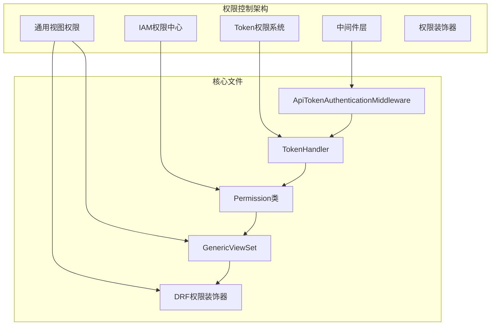
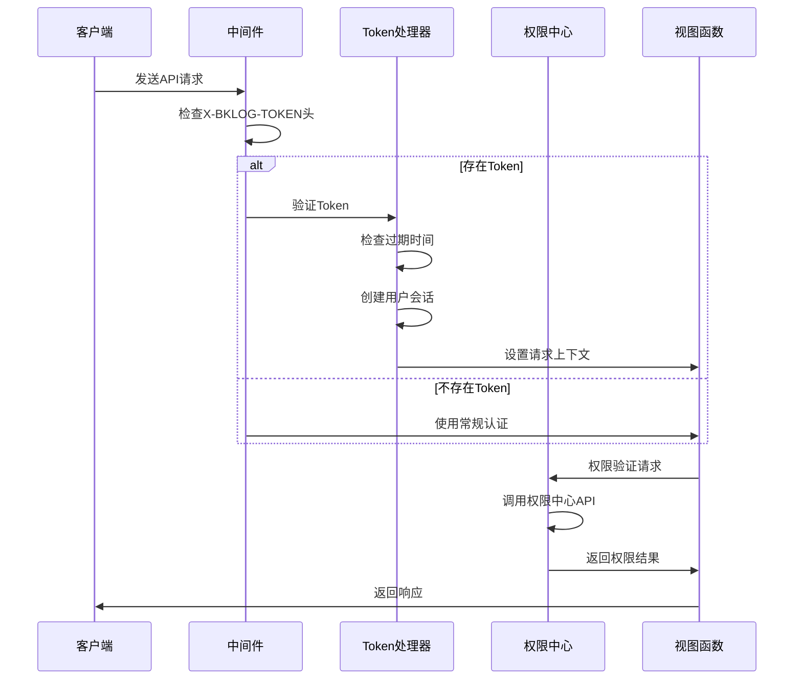
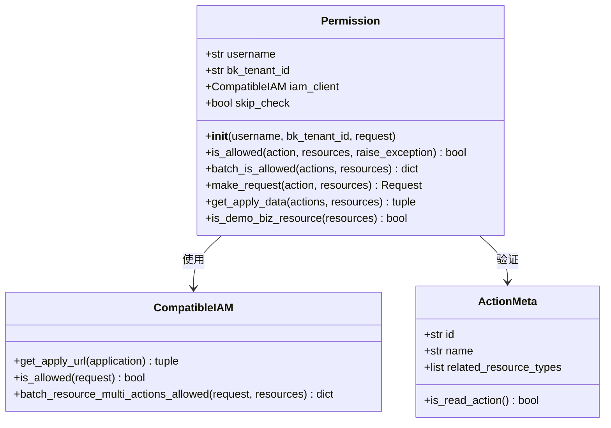
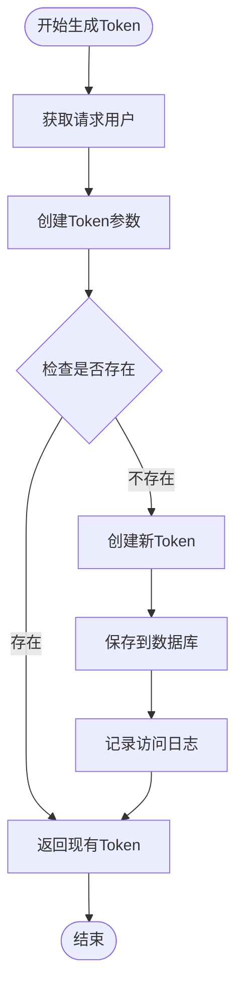
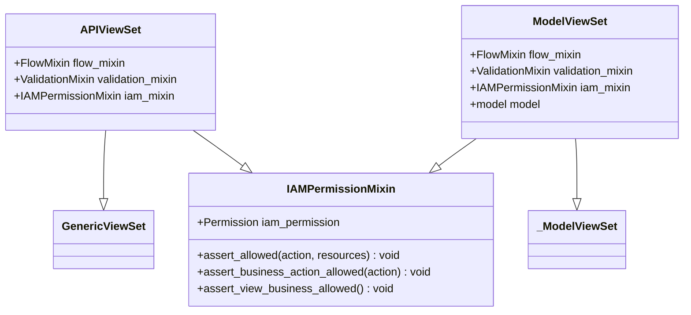
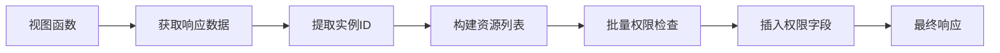
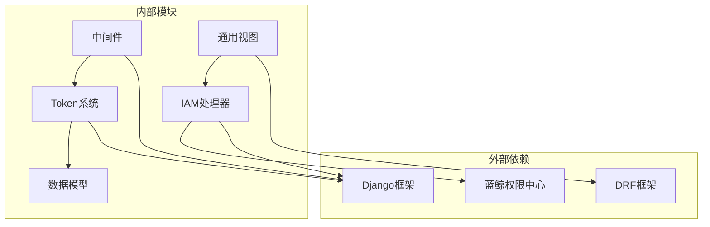

# 权限控制实现

<cite>
**本文档引用的文件**
- [api_token_middleware.py](file://apps/middleware/api_token_middleware.py)
- [token.py](file://apps/log_commons/token.py)
- [models.py](file://apps/log_commons/models.py)
- [permission.py](file://apps/iam/handlers/permission.py)
- [generic.py](file://apps/generic.py)
- [drf.py](file://apps/iam/handlers/drf.py)
- [permission.py](file://apps/bk_log_admin/permission.py)
- [permission.py](file://apps/log_databus/permission.py)
- [permission.py](file://apps/log_extract/permission.py)
- [permission.py](file://apps/log_esquery/permission.py)
- [permission.py](file://apps/log_search/permission.py)
- [permission.py](file://apps/log_clustering/permission.py)
</cite>

## 目录
1. [简介](#简介)
2. [项目结构](#项目结构)
3. [核心组件](#核心组件)
4. [架构概览](#架构概览)
5. [详细组件分析](#详细组件分析)
6. [依赖关系分析](#依赖关系分析)
7. [性能考虑](#性能考虑)
8. [故障排除指南](#故障排除指南)
9. [结论](#结论)

## 简介

本项目实现了完整的权限控制体系，涵盖API层面的权限验证、数据访问控制和操作权限管理。权限控制体系采用多层架构设计，包括中间件层、Token权限系统、IAM权限中心集成和通用视图权限控制。

权限控制的核心目标是确保：
- API调用的安全性验证
- 用户对资源的操作权限控制
- 外部系统的API Token管理
- 与蓝鲸权限中心的深度集成
- 性能友好的权限检查机制

## 项目结构

权限控制相关的代码主要分布在以下几个模块：

**图表来源**
- [api_token_middleware.py:22-76](file://apps/middleware/api_token_middleware.py#L22-L76)
- [token.py:11-90](file://apps/log_commons/token.py#L11-L90)
- [permission.py:57-444](file://apps/iam/handlers/permission.py#L57-L444)
- [generic.py:155-181](file://apps/generic.py#L155-L181)

**章节来源**
- [api_token_middleware.py:1-76](file://apps/middleware/api_token_middleware.py#L1-L76)
- [token.py:1-90](file://apps/log_commons/token.py#L1-L90)
- [permission.py:1-444](file://apps/iam/handlers/permission.py#L1-L444)

## 核心组件

### 1. API Token认证中间件

ApiTokenAuthenticationMiddleware实现了基于Token的API认证机制，支持多种认证类型和空间隔离。

### 2. Token处理器系统

BaseTokenHandler提供了统一的Token管理接口，支持不同类型的Token处理器和工厂模式。

### 3. IAM权限中心集成

Permission类封装了蓝鲸权限中心的完整API，提供动作权限验证、批量权限检查和资源权限管理。

### 4. 通用视图权限控制

APIViewSet和ModelViewSet提供了基于Mixin的权限控制机制，支持声明式权限验证。

**章节来源**
- [api_token_middleware.py:10-76](file://apps/middleware/api_token_middleware.py#L10-L76)
- [token.py:11-90](file://apps/log_commons/token.py#L11-L90)
- [permission.py:57-444](file://apps/iam/handlers/permission.py#L57-L444)
- [generic.py:155-216](file://apps/generic.py#L155-L216)

## 架构概览

**图表来源**
- [api_token_middleware.py:22-76](file://apps/middleware/api_token_middleware.py#L22-L76)
- [token.py:25-64](file://apps/log_commons/token.py#L25-L64)
- [permission.py:249-283](file://apps/iam/handlers/permission.py#L249-L283)

## 详细组件分析

### Permission类权限验证逻辑

Permission类是权限控制的核心组件，实现了完整的权限验证机制：

#### 用户权限检查
- 支持用户名和租户ID的初始化
- 自动处理Web请求和后台任务场景
- 提供跳过权限检查的配置选项

#### 资源权限验证
- 支持单个动作和批量动作的权限检查
- 提供资源实例的构造和验证功能
- 支持演示业务的特殊权限处理

#### 权限缓存机制
- 通过静态方法缓存IAM客户端实例
- 支持批量权限检查优化
- 提供权限豁免的条件判断

**图表来源**
- [permission.py:62-86](file://apps/iam/handlers/permission.py#L62-L86)
- [permission.py:249-283](file://apps/iam/handlers/permission.py#L249-L283)
- [permission.py:315-330](file://apps/iam/handlers/permission.py#L315-L330)

**章节来源**
- [permission.py:57-444](file://apps/iam/handlers/permission.py#L57-L444)

### Token权限系统的实现

#### Token生成流程

**图表来源**
- [token.py:25-64](file://apps/log_commons/token.py#L25-L64)

#### Token验证机制
- 支持space_uid和type的组合查询
- 实现过期时间检查
- 提供多种认证类型的处理

**章节来源**
- [token.py:11-90](file://apps/log_commons/token.py#L11-L90)
- [models.py:47-68](file://apps/log_commons/models.py#L47-L68)

### 中间件层的权限控制实现

#### 请求拦截机制
ApiTokenAuthenticationMiddleware实现了多层请求拦截：

1. **Header检查**：检测X-BKLOG-TOKEN和X-BKLOG-Space-Uid头部
2. **Token验证**：查询ApiAuthToken表验证Token有效性
3. **过期检查**：调用is_expired()方法检查Token过期状态
4. **认证处理**：根据Token类型执行不同的认证逻辑

#### 权限过滤和异常处理
- 支持Grafana和CodeCC等特殊认证类型
- 实现统一的认证处理逻辑
- 提供详细的错误响应

**章节来源**
- [api_token_middleware.py:22-76](file://apps/middleware/api_token_middleware.py#L22-L76)

### Generic视图的权限控制机制

#### 权限装饰器使用

**图表来源**
- [generic.py:155-181](file://apps/generic.py#L155-L181)
- [generic.py:188-216](file://apps/generic.py#L188-L216)

#### 通用权限验证
- 提供声明式的权限验证方法
- 支持业务维度的权限检查
- 集成到DRF视图体系中

**章节来源**
- [generic.py:155-216](file://apps/generic.py#L155-L216)

### 权限装饰器的实现

#### DRF权限装饰器
- InstanceActionPermission：基于实例的动作权限检查
- BusinessActionPermission：基于业务的动作权限检查
- insert_permission_field：向响应数据插入权限字段

#### 数据权限控制

**图表来源**
- [drf.py:198-268](file://apps/iam/handlers/drf.py#L198-L268)

**章节来源**
- [drf.py:56-230](file://apps/iam/handlers/drf.py#L56-L230)

## 依赖关系分析

**图表来源**
- [permission.py:22-54](file://apps/iam/handlers/permission.py#L22-L54)
- [api_token_middleware.py:1-8](file://apps/middleware/api_token_middleware.py#L1-L8)

**章节来源**
- [permission.py:1-54](file://apps/iam/handlers/permission.py#L1-L54)
- [models.py:1-36](file://apps/log_commons/models.py#L1-L36)

## 性能考虑

### 权限检查优化策略

1. **批量权限检查**：使用batch_is_allowed减少IAM API调用次数
2. **权限缓存**：复用IAM客户端实例避免重复初始化
3. **条件跳过**：支持IGNORE_IAM_PERMISSION配置跳过权限检查
4. **过期时间**：Token过期检查避免无效请求

### 性能监控和指标

- 监控IAM API调用延迟
- 跟踪权限检查成功率
- 分析Token验证性能瓶颈

## 故障排除指南

### 常见权限问题

#### Token验证失败
1. 检查X-BKLOG-TOKEN头部是否正确传递
2. 验证Token是否过期
3. 确认space_uid参数是否匹配

#### 权限不足错误
1. 检查用户是否具有相应动作权限
2. 验证资源实例ID是否正确
3. 确认业务维度权限配置

#### IAM集成问题
1. 检查BK_IAM_APIGATEWAY_URL配置
2. 验证APP_CODE和SECRET_KEY设置
3. 确认权限中心服务可用性

**章节来源**
- [api_token_middleware.py:38-42](file://apps/middleware/api_token_middleware.py#L38-L42)
- [permission.py:275-282](file://apps/iam/handlers/permission.py#L275-L282)

## 结论

本权限控制实现采用了分层架构设计，通过中间件、Token系统、IAM集成和通用视图的协同工作，实现了完整的API权限管理体系。系统具有以下特点：

1. **多层次防护**：从网络层到应用层的全方位权限控制
2. **灵活扩展**：支持多种认证类型和权限验证方式
3. **性能优化**：通过批量检查和缓存机制提升响应速度
4. **易于维护**：清晰的代码结构和完善的错误处理机制

该实现为蓝鲸日志平台提供了安全可靠的权限控制基础，能够满足复杂的企业级权限管理需求。