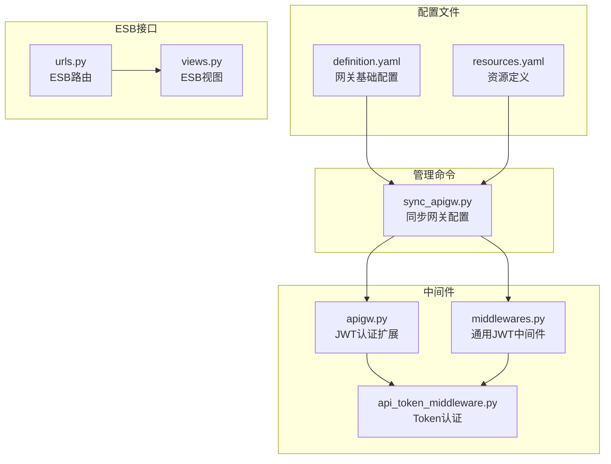
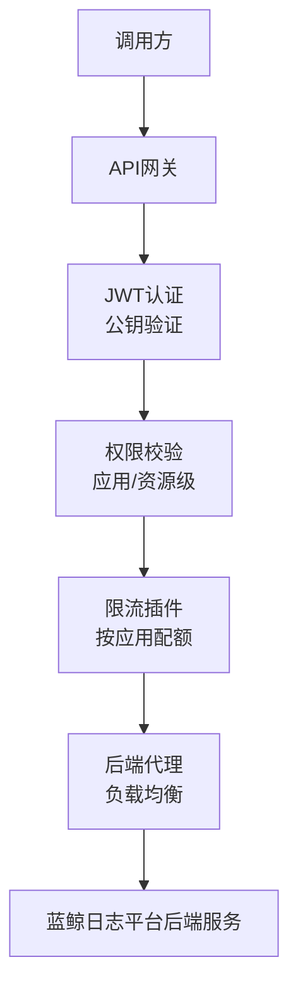
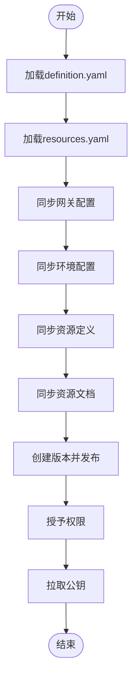
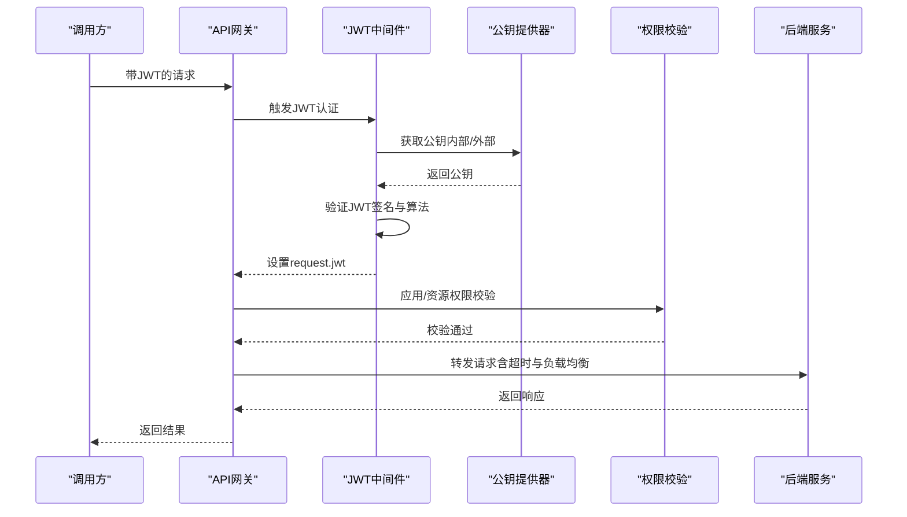
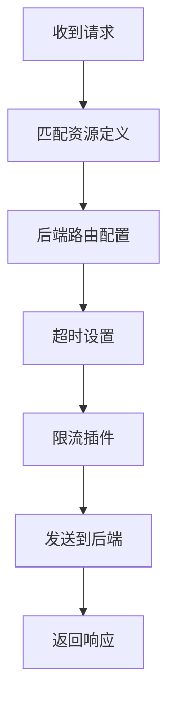
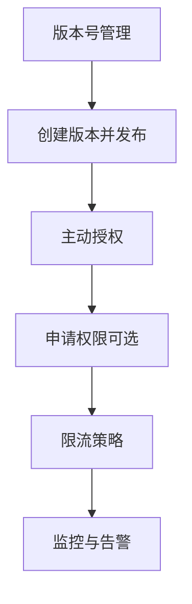
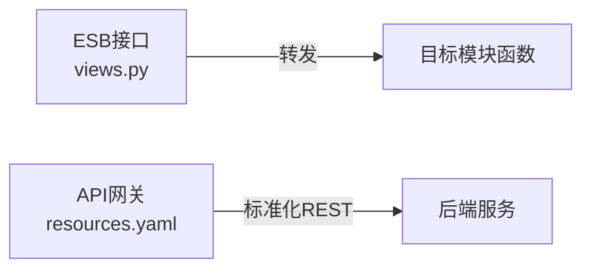
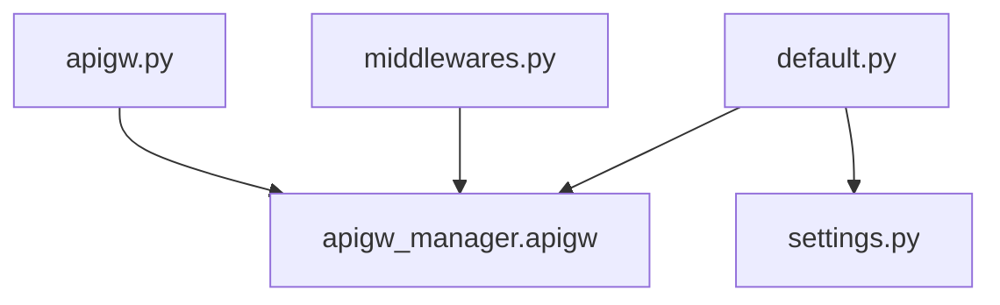

# API网关集成

<cite>
**本文档引用的文件**
- [definition.yaml](file://support-files/apigw/definition.yaml)
- [resources.yaml](file://support-files/apigw/resources.yaml)
- [apigw.py](file://apps/middleware/apigw.py)
- [sync_apigw.py](file://apps/api/management/commands/sync_apigw.py)
- [convert_apigw_yaml.py](file://scripts/convert_apigw_yaml.py)
- [views.py](file://apps/esb/views.py)
- [urls.py](file://apps/esb/urls.py)
- [api_token_middleware.py](file://apps/middleware/api_token_middleware.py)
- [middlewares.py](file://apps/middlewares.py)
- [default.py](file://config/default.py)
- [settings.py](file://settings.py)
</cite>

## 目录
1. [简介](#简介)
2. [项目结构](#项目结构)
3. [核心组件](#核心组件)
4. [架构概览](#架构概览)
5. [详细组件分析](#详细组件分析)
6. [依赖关系分析](#依赖关系分析)
7. [性能考虑](#性能考虑)
8. [故障排查指南](#故障排查指南)
9. [结论](#结论)

## 简介
本文件面向BK Monitor项目（蓝鲸日志平台）的API网关集成，系统化阐述蓝鲸API网关的集成方式、配置方法与运行机制，涵盖认证授权、请求路由、响应处理、版本管理、权限控制、流量控制等关键能力。同时对比ESB接口的使用方式与差异，提供配置文件格式、资源定义与访问控制策略说明，并给出调试方法、监控指标与故障排查建议，帮助开发者在微服务架构中高效、安全地使用API网关。

## 项目结构
BK Monitor项目中与API网关集成相关的核心位置如下：
- 配置文件：support-files/apigw/definition.yaml（网关基础配置）、support-files/apigw/resources.yaml（资源定义）
- 管理命令：apps/api/management/commands/sync_apigw.py（一键同步网关配置）
- 中间件：apps/middleware/apigw.py（JWT认证与公钥提供器扩展）、apps/middlewares.py（通用JWT中间件与外部网关支持）
- ESB接口：apps/esb/views.py、apps/esb/urls.py（传统ESB转发与权限校验）
- 认证令牌：apps/middleware/api_token_middleware.py（基于Token的认证中间件）
- 配置入口：config/default.py（安装应用、中间件注册）、settings.py（环境选择）

**图表来源**
- [definition.yaml:1-138](file://support-files/apigw/definition.yaml#L1-L138)
- [resources.yaml:1-800](file://support-files/apigw/resources.yaml#L1-L800)
- [sync_apigw.py:28-51](file://apps/api/management/commands/sync_apigw.py#L28-L51)
- [apigw.py:123-125](file://apps/middleware/apigw.py#L123-L125)
- [middlewares.py:225-233](file://apps/middlewares.py#L225-L233)
- [api_token_middleware.py:22-76](file://apps/middleware/api_token_middleware.py#L22-L76)
- [views.py:69-212](file://apps/esb/views.py#L69-L212)
- [urls.py:28-37](file://apps/esb/urls.py#L28-L37)

**章节来源**
- [definition.yaml:1-138](file://support-files/apigw/definition.yaml#L1-L138)
- [resources.yaml:1-800](file://support-files/apigw/resources.yaml#L1-L800)
- [sync_apigw.py:28-51](file://apps/api/management/commands/sync_apigw.py#L28-L51)
- [apigw.py:123-125](file://apps/middleware/apigw.py#L123-L125)
- [middlewares.py:225-233](file://apps/middlewares.py#L225-L233)
- [api_token_middleware.py:22-76](file://apps/middleware/api_token_middleware.py#L22-L76)
- [views.py:69-212](file://apps/esb/views.py#L69-L212)
- [urls.py:28-37](file://apps/esb/urls.py#L28-L37)

## 核心组件
- API网关配置文件
  - definition.yaml：定义网关基本信息、环境配置、发布版本、主动授权、关联应用、资源文档等
  - resources.yaml：定义资源路径、后端路由、认证配置、插件（如限流）、标签等
- 管理命令
  - sync_apigw.py：封装同步配置、同步环境、同步资源、创建版本发布、授予权限、拉取公钥等流程
- 中间件
  - apigw.py：自定义JWT提供器与公钥提供器，支持内部/外部网关公钥切换
  - middlewares.py：通用JWT中间件与外部网关公钥提供器
  - api_token_middleware.py：基于Token的认证中间件，支持多场景认证
- ESB接口
  - esb/views.py：ESB转发与权限校验，支持Meta转发与日志ESB转发
  - esb/urls.py：ESB路由注册

**章节来源**
- [definition.yaml:1-138](file://support-files/apigw/definition.yaml#L1-L138)
- [resources.yaml:1-800](file://support-files/apigw/resources.yaml#L1-L800)
- [sync_apigw.py:28-51](file://apps/api/management/commands/sync_apigw.py#L28-L51)
- [apigw.py:41-125](file://apps/middleware/apigw.py#L41-L125)
- [middlewares.py:213-233](file://apps/middlewares.py#L213-L233)
- [api_token_middleware.py:10-76](file://apps/middleware/api_token_middleware.py#L10-L76)
- [views.py:69-212](file://apps/esb/views.py#L69-L212)
- [urls.py:28-37](file://apps/esb/urls.py#L28-L37)

## 架构概览
API网关在微服务架构中的作用：
- 统一入口：对外暴露标准化REST接口，隐藏后端服务细节
- 安全防护：通过JWT认证、公钥验证、权限校验保障访问安全
- 流量治理：内置限流插件，支持不同应用差异化配额
- 版本管理：版本号与SDK版本一致，便于调用方升级与兼容
- 权限控制：支持按网关注解与按资源解，满足精细化授权需求
- 文档与运维：资源文档归档、关联应用、维护人员管理

**图表来源**
- [definition.yaml:15-31](file://support-files/apigw/definition.yaml#L15-L31)
- [resources.yaml:24-68](file://support-files/apigw/resources.yaml#L24-L68)
- [apigw.py:60-93](file://apps/middleware/apigw.py#L60-L93)
- [middlewares.py:225-233](file://apps/middlewares.py#L225-L233)

## 详细组件分析

### API网关配置文件
- definition.yaml
  - spec_version：固定为1，确保工具链正确识别
  - release：发布版本号、标题、描述，与SDK版本保持一致
  - apigateway：网关描述、是否公开、官方网关标记、认证参数策略、维护人员
  - stage：环境配置（生产），包含超时、上游主机、负载均衡策略
  - grant_permissions：主动授权列表，支持按网关注解或按资源解
  - related_apps：关联应用列表
  - resource_docs：资源文档归档或目录
- resources.yaml
  - Swagger 2.0格式，定义各资源路径、HTTP方法、后端路由、超时、插件（如限流）、认证配置
  - authConfig：用户验证、应用验证、资源权限要求
  - pluginConfigs：限流规则（默认与特定应用）

**图表来源**
- [sync_apigw.py:28-51](file://apps/api/management/commands/sync_apigw.py#L28-L51)
- [definition.yaml:5-138](file://support-files/apigw/definition.yaml#L5-L138)
- [resources.yaml:1-800](file://support-files/apigw/resources.yaml#L1-L800)

**章节来源**
- [definition.yaml:1-138](file://support-files/apigw/definition.yaml#L1-L138)
- [resources.yaml:1-800](file://support-files/apigw/resources.yaml#L1-L800)
- [sync_apigw.py:28-51](file://apps/api/management/commands/sync_apigw.py#L28-L51)

### 认证授权机制
- JWT认证与公钥提供
  - apigw.py：自定义CachePublicKeyProvider，支持内部网关与外部网关公钥切换；自定义ApiGatewayJWTProvider，解析请求头中的JWT并验证
  - middlewares.py：SettingsExternalPublicKeyProvider，从settings读取外部网关公钥；ApiGatewayJWTMiddleware根据请求头Is-External决定使用哪种公钥
- 应用与用户验证
  - resources.yaml中authConfig配置appVerifiedRequired与resourcePermissionRequired，确保应用身份与资源权限双重校验
- 权限控制
  - definition.yaml中grant_permissions支持按网关注解或按资源解授权；resources.yaml中authConfig细化到资源级权限

**图表来源**
- [apigw.py:60-121](file://apps/middleware/apigw.py#L60-L121)
- [middlewares.py:213-233](file://apps/middlewares.py#L213-L233)
- [resources.yaml:34-68](file://support-files/apigw/resources.yaml#L34-L68)

**章节来源**
- [apigw.py:41-125](file://apps/middleware/apigw.py#L41-L125)
- [middlewares.py:213-233](file://apps/middlewares.py#L213-L233)
- [resources.yaml:34-68](file://support-files/apigw/resources.yaml#L34-L68)

### 请求路由与响应处理
- 请求路由
  - resources.yaml中每条资源定义包含operationId、后端method/path、matchSubpath、timeout等
  - definition.yaml中stage.proxy_http配置上游主机与负载均衡策略
- 响应处理
  - 中间件统一处理异常与返回格式，确保调用方获得标准响应
  - ESB接口通过views.py实现参数重组与调用目标函数，返回统一格式

**图表来源**
- [resources.yaml:14-68](file://support-files/apigw/resources.yaml#L14-L68)
- [definition.yaml:43-56](file://support-files/apigw/definition.yaml#L43-L56)

**章节来源**
- [resources.yaml:14-68](file://support-files/apigw/resources.yaml#L14-L68)
- [definition.yaml:43-56](file://support-files/apigw/definition.yaml#L43-L56)
- [views.py:107-141](file://apps/esb/views.py#L107-L141)

### 版本管理、权限控制与流量控制
- 版本管理
  - definition.yaml.release.version与SDK版本保持一致，避免调用方使用错误版本
- 权限控制
  - definition.yaml.grant_permissions支持按网关注解或按资源解授权
  - resources.yaml.authConfig.resourcePermissionRequired确保资源级权限
- 流量控制
  - resources.yaml.pluginConfigs.bk-rate-limit定义默认与特定应用的令牌配额与周期

**图表来源**
- [definition.yaml:5-13](file://support-files/apigw/definition.yaml#L5-L13)
- [definition.yaml:58-126](file://support-files/apigw/definition.yaml#L58-L126)
- [resources.yaml:24-68](file://support-files/apigw/resources.yaml#L24-L68)

**章节来源**
- [definition.yaml:5-13](file://support-files/apigw/definition.yaml#L5-L13)
- [definition.yaml:58-126](file://support-files/apigw/definition.yaml#L58-L126)
- [resources.yaml:24-68](file://support-files/apigw/resources.yaml#L24-L68)

### ESB接口与API网关的区别
- ESB接口
  - apps/esb/views.py：提供日志ESB转发与Meta转发，动态解析目标URL并执行权限校验
  - apps/esb/urls.py：注册esb/meta/esb等路由
- 区别
  - ESB更偏向于内部模块间转发与权限校验，API网关提供对外标准化REST接口与统一安全治理
  - ESB支持按模块函数白名单控制，API网关通过JWT+IAM+限流实现统一治理

**图表来源**
- [views.py:69-212](file://apps/esb/views.py#L69-L212)
- [urls.py:28-37](file://apps/esb/urls.py#L28-L37)
- [resources.yaml:14-68](file://support-files/apigw/resources.yaml#L14-L68)

**章节来源**
- [views.py:69-212](file://apps/esb/views.py#L69-L212)
- [urls.py:28-37](file://apps/esb/urls.py#L28-L37)

### 配置文件格式、资源定义与访问控制策略
- 配置文件格式
  - definition.yaml：YAML，包含spec_version、release、apigateway、stage、grant_permissions、related_apps、resource_docs
  - resources.yaml：Swagger 2.0，包含paths与x-bk-apigateway-resource元数据
- 资源定义
  - operationId、description、tags、x-bk-apigateway-resource.backend、pluginConfigs、authConfig
- 访问控制策略
  - appVerifiedRequired、resourcePermissionRequired、userVerifiedRequired
  - grant_permissions按网关注解或按资源解授权

**章节来源**
- [definition.yaml:1-138](file://support-files/apigw/definition.yaml#L1-L138)
- [resources.yaml:1-800](file://support-files/apigw/resources.yaml#L1-L800)

### 调试方法、监控指标与故障排查
- 调试方法
  - 使用sync_apigw.py一键同步：同步配置、同步环境、同步资源、创建版本发布、授予权限、拉取公钥
  - 中间件日志：apigw.py与middlewares.py记录公钥获取、JWT解析与验证过程
  - ESB调试：views.py中参数重组与目标函数调用，结合权限配置定位问题
- 监控指标
  - 配置default.py启用django_prometheus，结合限流插件与中间件统计
- 故障排查
  - JWT公钥缺失：确认settings中EXTERNAL_APIGW_PUBLIC_KEY或NEW_INTERNAL_APIGW_PUBLIC_KEY配置
  - 权限不足：检查grant_permissions与资源级authConfig配置
  - 超时与限流：调整resources.yaml超时与pluginConfigs.bk-rate-limit配置

**章节来源**
- [sync_apigw.py:28-51](file://apps/api/management/commands/sync_apigw.py#L28-L51)
- [apigw.py:60-93](file://apps/middleware/apigw.py#L60-L93)
- [middlewares.py:213-233](file://apps/middlewares.py#L213-L233)
- [default.py:57-95](file://config/default.py#L57-L95)

## 依赖关系分析
- 中间件依赖
  - apigw.py依赖apigw_manager的JWT认证与公钥提供器
  - middlewares.py提供SettingsExternalPublicKeyProvider与ApiGatewayJWTMiddleware
- 应用与配置
  - config/default.py安装apigw_manager.apigw并注册中间件
  - settings.py根据环境变量选择配置模块

**图表来源**
- [apigw.py:22-31](file://apps/middleware/apigw.py#L22-L31)
- [middlewares.py:29-31](file://apps/middlewares.py#L29-L31)
- [default.py:94-154](file://config/default.py#L94-L154)
- [settings.py:39-47](file://settings.py#L39-L47)

**章节来源**
- [apigw.py:22-31](file://apps/middleware/apigw.py#L22-L31)
- [middlewares.py:29-31](file://apps/middlewares.py#L29-L31)
- [default.py:94-154](file://config/default.py#L94-L154)
- [settings.py:39-47](file://settings.py#L39-L47)

## 性能考虑
- 超时与负载均衡
  - definition.yaml.stage.proxy_http.timeout与upstreams.loadbalance优化请求延迟与稳定性
- 限流策略
  - resources.yaml.pluginConfigs.bk-rate-limit按应用差异化限流，避免热点资源被刷爆
- 中间件开销
  - JWT解析与权限校验在请求链路中增加少量开销，建议配合缓存与合理的公钥配置降低影响

## 故障排查指南
- 公钥问题
  - 确认settings中公钥配置，外部网关通过Is-External头触发SettingsExternalPublicKeyProvider
- 权限问题
  - 检查definition.yaml.grant_permissions与resources.yaml.authConfig
- 资源未生效
  - 确认sync_apigw.py执行顺序与resources.yaml同步成功
- ESB转发失败
  - 检查views.py中目标URL解析与ALLOWED_MODULES_FUNCS配置

**章节来源**
- [middlewares.py:225-233](file://apps/middlewares.py#L225-L233)
- [definition.yaml:58-126](file://support-files/apigw/definition.yaml#L58-L126)
- [resources.yaml:34-68](file://support-files/apigw/resources.yaml#L34-L68)
- [sync_apigw.py:28-51](file://apps/api/management/commands/sync_apigw.py#L28-L51)
- [views.py:73-106](file://apps/esb/views.py#L73-L106)

## 结论
BK Monitor项目通过API网关实现了对外统一入口、安全治理与流量控制，配合ESB完成内部模块间的灵活转发。借助definition.yaml与resources.yaml的标准化配置，结合管理命令与中间件，项目能够快速完成网关的配置、发布与运维。在微服务架构中，API网关提供了高内聚、低耦合的边界服务，有助于提升系统的安全性、可观测性与可维护性。