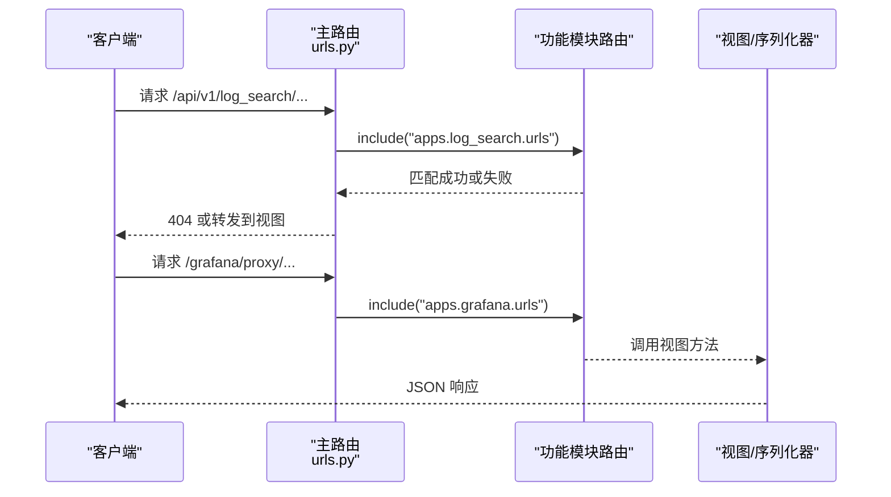
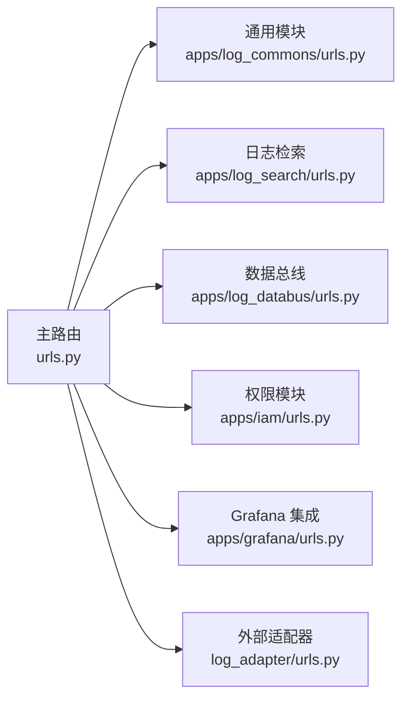

# URL路由机制

<cite>
**本文档引用的文件**
- [urls.py](file://urls.py)
- [console/urls.py](file://console/urls.py)
- [log_adapter/urls.py](file://log_adapter/urls.py)
- [log_adapter/home/urls.py](file://log_adapter/home/urls.py)
- [apps/log_commons/urls.py](file://apps/log_commons/urls.py)
- [apps/log_search/urls.py](file://apps/log_search/urls.py)
- [apps/log_databus/urls.py](file://apps/log_databus/urls.py)
- [apps/iam/urls.py](file://apps/iam/urls.py)
- [apps/grafana/urls.py](file://apps/grafana/urls.py)
- [apps/log_commons/views.py](file://apps/log_commons/views.py)
- [apps/grafana/views.py](file://apps/grafana/views.py)
- [apps/iam/views/resources.py](file://apps/iam/views/resources.py)
</cite>

## 目录
1. [简介](#简介)
2. [项目结构](#项目结构)
3. [核心组件](#核心组件)
4. [架构总览](#架构总览)
5. [详细组件分析](#详细组件分析)
6. [依赖关系分析](#依赖关系分析)
7. [性能考量](#性能考量)
8. [故障排查指南](#故障排查指南)
9. [结论](#结论)
10. [附录](#附录)

## 简介
本文件系统性梳理 BK Monitor（蓝鲸日志平台）项目的 Django URL 路由机制，涵盖主路由配置、RESTful API 设计原则、版本控制策略、命名规范、资源组织方式、动态路由与路径转换器、路由冲突处理、性能优化与安全考虑，并提供最佳实践与常见问题解决方案。目标是帮助开发者快速理解并高效维护路由体系。

## 项目结构
项目采用“主路由集中注册 + 功能模块子路由拆分”的组织方式：
- 主路由文件集中声明所有应用入口与静态资源映射
- 各功能模块（如日志检索、采集、权限、Grafana 集成等）通过独立的 urls.py 模块化注册
- 子路由中优先使用 DRF 路由器统一生成 CRUD 资源接口，辅以少量自定义路径

```mermaid
graph TB
Root["主路由配置<br/>urls.py"] --> Admin["管理后台<br/>/bklog_manage/"]
Root --> Account["账号系统<br/>/account/"]
Root --> Console["控制台<br/>/console/"]
Root --> ApiV1["API v1 根<br/>/api/v1/"]
Root --> Grafana["Grafana 集成<br/>/grafana*/"]
Root --> Adapter["外部适配器<br/>/log_adapter/"]
Root --> Home["前端页面<br/>/"]
Root --> Flower["任务监控<br/>/flower/"]
Root --> VersionLog["版本日志<br/>/version_log/"]
ApiV1 --> Commons["通用模块<br/>/api/v1/"]
ApiV1 --> IAM["权限模块<br/>/api/v1/iam/"]
ApiV1 --> Databus["采集模块<br/>/api/v1/databus/"]
ApiV1 --> Trace["链路追踪<br/>/api/v1/trace/"]
ApiV1 --> Search["日志检索<br/>/api/v1/"]
ApiV1 --> ESQuery["ES 查询<br/>/api/v1/"]
ApiV1 --> ESB["ESB 接口<br/>/api/v1/"]
ApiV1 --> AdminModule["后台管理<br/>/api/v1/"]
ApiV1 --> BCS["容器服务<br/>/api/v1/"]
ApiV1 --> Clustering["聚类<br/>/api/v1/"]
ApiV1 --> Desensitize["脱敏<br/>/api/v1/"]
ApiV1 --> Assistant["AI 助手<br/>/api/v1/"]
ApiV1 --> UnifyQuery["统一查询<br/>/api/v1/"]
ApiV1 --> Extract["日志提取<br/>/api/v1/log_extract/"]
ApiV1 --> Measure["度量<br/>/api/v1/"]
ApiV1 --> IPChooser["IP 选择器<br/>/api/v1/ipchooser/"]
ApiV1 --> SearchModule["搜索模块<br/>/api/v1/search_module/"]
```

图表来源
- [urls.py:42-74](file://urls.py#L42-L74)

章节来源
- [urls.py:42-85](file://urls.py#L42-L85)

## 核心组件
- 主路由配置：集中声明站点根路径、API 版本前缀、各功能模块路由入口与静态资源映射
- 功能模块子路由：每个模块独立维护自身资源路由，优先使用 DRF 路由器自动注册
- 动态路由与路径转换器：支持正则捕获组、命名捕获组与可选路径段
- 路由冲突与顺序：严格遵循“先匹配先命中”，需按从具体到抽象的顺序组织
- 安全与性能：结合 CSRF 放行、会话认证豁免、静态资源直出与条件加载

章节来源
- [urls.py:42-85](file://urls.py#L42-L85)
- [apps/log_commons/urls.py:29-42](file://apps/log_commons/urls.py#L29-L42)
- [apps/log_search/urls.py:40-66](file://apps/log_search/urls.py#L40-L66)
- [apps/log_databus/urls.py:39-57](file://apps/log_databus/urls.py#L39-L57)
- [apps/iam/urls.py:46-51](file://apps/iam/urls.py#L46-L51)
- [apps/grafana/urls.py:32-58](file://apps/grafana/urls.py#L32-L58)

## 架构总览
下图展示从请求进入至视图处理的关键流程，体现主路由如何将请求分发到各功能模块：

图表来源
- [urls.py:47-62](file://urls.py#L47-L62)
- [apps/log_search/urls.py:66](file://apps/log_search/urls.py#L66)
- [apps/grafana/urls.py:55](file://apps/grafana/urls.py#L55)

## 详细组件分析

### 主路由配置（集中式入口）
- 管理后台：/bklog_manage/ 映射 Django Admin
- 账号系统：/account/ 统一登录与退出
- 控制台：/console/ 提供登出等控制台专用接口
- API v1：/api/v1/ 下挂载多个子模块，遵循“越具体越靠前”的注册顺序
- Grafana 集成：/grafana* 与 /bk-dataview/... 提供代理与静态资源
- 外部适配器：/log_adapter/ 透传外部回调与代理
- 前端页面：/ 作为 SPA 入口
- 任务监控：/flower/ 访问 Celery Flower
- 版本日志：/version_log/ 条目入口
- 条件路由：根据环境变量与部署模式动态追加路由（如 TGPA 任务、K8S 静态资源）

章节来源
- [urls.py:42-85](file://urls.py#L42-L85)

### 控制台路由（/console/）
- 登出接口：/console/accounts/logout
- 作用：简化用户登出流程，避免跨域与会话复杂处理

章节来源
- [console/urls.py:5](file://console/urls.py#L5)

### 外部适配器路由（/log_adapter/）
- 子路由：/log_adapter/home/urls.py 提供外部回调、代理与空间列表等接口
- 作用：作为外部系统与内部服务的桥接层

章节来源
- [log_adapter/urls.py:6-8](file://log_adapter/urls.py#L6-L8)
- [log_adapter/home/urls.py:6-10](file://log_adapter/home/urls.py#L6-L10)

### 通用模块路由（/api/v1/ 通用能力）
- 路由器：DefaultRouter(trailing_slash=True) 注册多个资源集合
- 关键资源：
  - 外部权限：/api/v1/external_permission/
  - 分享：/api/v1/share/
  - API Token：/api/v1/api_token/
  - 前端事件：/api/v1/frontend_event/
- 其他：文档链接获取等非资源型接口

章节来源
- [apps/log_commons/urls.py:29-42](file://apps/log_commons/urls.py#L29-L42)
- [apps/log_commons/views.py:70-89](file://apps/log_commons/views.py#L70-L89)

### 日志检索模块路由（/api/v1/）
- 命名空间：app_name = "apps.log_search"
- 路由器注册资源：
  - 元数据：meta、meta/language、meta/menu
  - 业务：bizs
  - 索引集：index_set、index_group
  - 用户配置：user_custom_config
  - 检索：search/index_set（含聚合与收藏）
  - 结果表：result_table
  - 字段：field/index_set
  - 告警策略：alert_strategy

章节来源
- [apps/log_search/urls.py:40](file://apps/log_search/urls.py#L40)
- [apps/log_search/urls.py:42-66](file://apps/log_search/urls.py#L42-L66)

### 数据总线模块路由（/api/v1/databus/）
- 路由器注册资源：
  - 归档：archive
  - 恢复：restore
  - 存储：storage
  - 采集器：collectors
  - 采集插件：collector_plugins
  - 数据链路：data_link
  - ITSM 流程：collect_itsm、collect_itsm_cb
  - 清洗模板：clean_template、clean
  - 采集器检查：check_collector
  - 日志访问：log_access

章节来源
- [apps/log_databus/urls.py:39-57](file://apps/log_databus/urls.py#L39-L57)

### 权限模块路由（/api/v1/iam/）
- 路由器注册资源：meta
- 资源 API：/api/v1/iam/resource/ 通过 dispatcher 暴露资源提供器
- 作用：对接 IAM 资源目录与权限评估

章节来源
- [apps/iam/urls.py:46-51](file://apps/iam/urls.py#L46-L51)
- [apps/iam/views/resources.py:40-44](file://apps/iam/views/resources.py#L40-L44)

### Grafana 集成路由（/grafana* 与 /bk-dataview/...）
- Grafana API：/api/v1/grafana/ 通过路由器注册
- 代理路由：/grafana/proxy/ 透传 Grafana 请求
- 静态资源：/grafana/public/ 提供静态页面
- 切换组织：/bk-dataview/orgs/<org_name>/grafana/ 与 /grafana/ 用于组织切换
- 自定义 ES 数据源：/grafana/custom_es_datasource/... 支持 mapping 与 msearch
- 路径转换器：使用命名捕获组（如 <index_set_id>、<org_name>）实现动态参数传递

章节来源
- [apps/grafana/urls.py:32-58](file://apps/grafana/urls.py#L32-L58)
- [apps/grafana/views.py:67-100](file://apps/grafana/views.py#L67-L100)
- [apps/grafana/views.py:105-146](file://apps/grafana/views.py#L105-L146)

### API 设计原则与资源组织
- 版本控制：统一前缀 /api/v1/，未来升级通过新增 /api/v2/ 并保留旧版本
- 命名规范：
  - 资源集合使用复数形式（如 index_set、collectors）
  - 动作路径使用 url_path 指定（如 favorites 的 group、union 等）
- 资源组织：
  - 优先使用 DRF 路由器自动注册 CRUD
  - 对于特殊动作或非标准资源，使用 detail_route/list_route 或直接 re_path
- 参数传递：
  - 使用命名捕获组（如 <index_set_id>）传递动态参数
  - 查询参数通过 query_params 解析，请求体通过 request.data 解析

章节来源
- [apps/log_search/urls.py:55-59](file://apps/log_search/urls.py#L55-L59)
- [apps/grafana/views.py:105-146](file://apps/grafana/views.py#L105-L146)

### 路由冲突处理与顺序
- 冲突来源：
  - 重复注册相同前缀
  - 通配符路径覆盖具体路径
  - 未按从具体到抽象排序导致命中错误
- 处理建议：
  - 明确划分模块边界，避免重叠前缀
  - 将更具体的路径注册在前，通配符或通用路由放在后
  - 使用 include 时确保父路径唯一且明确

章节来源
- [urls.py:47-73](file://urls.py#L47-L73)

### 动态路由与路径转换器
- 正则捕获组：支持 (?P<name>pattern>) 命名捕获
- 示例：
  - /grafana/custom_es_datasource/(?P<index_set_id>.+)/_mapping$
  - /bk-dataview/orgs/(?P<org_name>[a-zA-Z0-9\-_]+)/grafana/
- 最佳实践：
  - 仅在必要时使用复杂正则，优先使用 DRF 路由器与命名捕获组
  - 为动态参数提供清晰的命名与约束范围

章节来源
- [apps/grafana/urls.py:46-55](file://apps/grafana/urls.py#L46-L55)

## 依赖关系分析
- 主路由对各模块的依赖为“include 导入”，模块内部再通过路由器或显式 re_path 定义
- Grafana 与 BK Dataview 的集成通过独立模块与视图类解耦
- 权限模块通过 ResourceApiDispatcher 将资源提供器暴露为路由

图表来源
- [urls.py:47-62](file://urls.py#L47-L62)
- [apps/log_commons/urls.py:39](file://apps/log_commons/urls.py#L39)
- [apps/log_search/urls.py:66](file://apps/log_search/urls.py#L66)
- [apps/log_databus/urls.py:57](file://apps/log_databus/urls.py#L57)
- [apps/iam/urls.py:51](file://apps/iam/urls.py#L51)
- [apps/grafana/urls.py:58](file://apps/grafana/urls.py#L58)
- [log_adapter/urls.py:8](file://log_adapter/urls.py#L8)

## 性能考量
- 路由匹配顺序：将高频命中路径前置，减少回溯
- 静态资源直出：K8S 部署模式下直接通过 Django serve 静态文件，避免额外代理开销
- 路由器尾斜杠：统一 trailing_slash=True，减少重定向
- 条件路由：仅在需要时启用（如 TGPA 任务），降低运行时分支

章节来源
- [urls.py:81-84](file://urls.py#L81-L84)
- [apps/log_commons/urls.py:29](file://apps/log_commons/urls.py#L29)
- [apps/log_search/urls.py:42](file://apps/log_search/urls.py#L42)

## 故障排查指南
- 404 问题：
  - 检查主路由是否正确 include 子模块
  - 确认 API 前缀与模块注册路径一致
- 权限相关：
  - Grafana 代理写操作需具备相应业务/实例权限
  - 资源 API /api/v1/iam/resource/ 需正确注册 dispatcher
- CSRF 与认证：
  - 部分视图使用 CSRF 放行装饰器，注意与会话认证组合
  - Grafana 视图移除 SessionAuthentication 并引入无 CSRF 会话认证
- 动态参数解析：
  - 确保命名捕获组与视图签名一致，避免参数缺失

章节来源
- [apps/grafana/views.py:149-165](file://apps/grafana/views.py#L149-L165)
- [apps/iam/urls.py:51](file://apps/iam/urls.py#L51)
- [apps/iam/views/resources.py:40-44](file://apps/iam/views/resources.py#L40-L44)

## 结论
本项目通过集中式主路由与模块化子路由实现了清晰的 URL 组织结构。RESTful 设计以 DRF 路由器为核心，配合命名规范与版本前缀，既保证了扩展性又提升了可维护性。动态路由与路径转换器为复杂场景提供了灵活性；同时，通过严格的注册顺序与条件路由，有效避免了冲突与性能问题。建议在新增模块时遵循现有规范，确保路由设计的一致性与安全性。

## 附录
- 最佳实践清单：
  - 所有 API 以 /api/v1/ 开头，避免硬编码版本号
  - 资源命名使用复数，动作路径通过 url_path 明确
  - 优先使用 DRF 路由器，必要时使用 detail_route/list_route
  - 动态参数使用命名捕获组，保持视图签名一致
  - 条件路由仅在需要时启用，减少运行时分支
  - K8S 部署模式下直接 serve 静态资源，提升性能
- 常见问题速查：
  - 404：核对 include 与前缀
  - 权限拒绝：确认业务/实例权限与白名单设置
  - CSRF 报错：检查装饰器与认证组合
  - 参数缺失：核对命名捕获组与视图签名