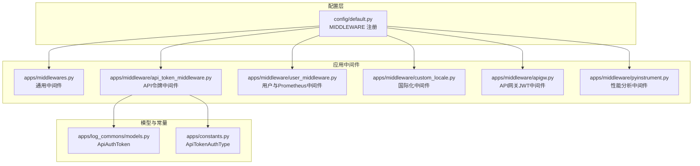
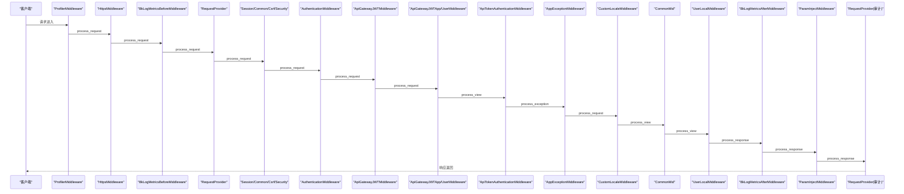
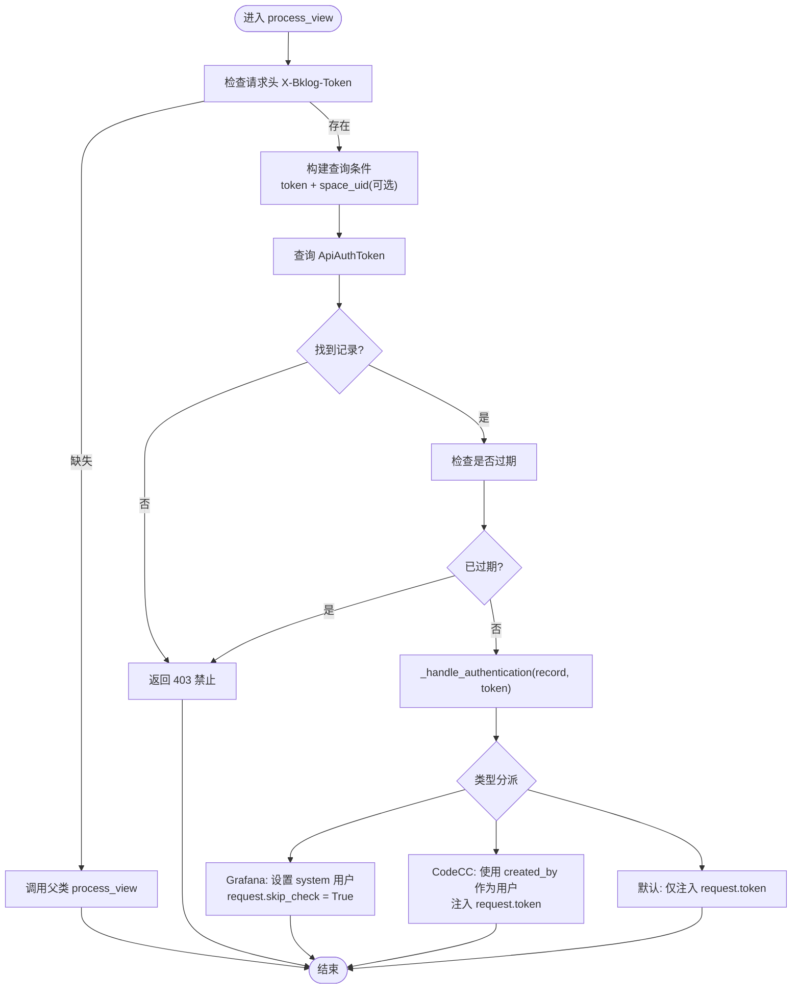

# 中间件系统

<cite>
**本文档引用的文件**
- [settings.py](file://settings.py)
- [config/default.py](file://config/default.py)
- [apps/middlewares.py](file://apps/middlewares.py)
- [apps/middleware/__init__.py](file://apps/middleware/__init__.py)
- [apps/middleware/api_token_middleware.py](file://apps/middleware/api_token_middleware.py)
- [apps/middleware/user_middleware.py](file://apps/middleware/user_middleware.py)
- [apps/middleware/custom_locale.py](file://apps/middleware/custom_locale.py)
- [apps/middleware/apigw.py](file://apps/middleware/apigw.py)
- [apps/middleware/pyinstrument.py](file://apps/middleware/pyinstrument.py)
- [apps/log_commons/models.py](file://apps/log_commons/models.py)
- [apps/constants.py](file://apps/constants.py)
- [apps/tests/middlewares.py](file://apps/tests/middlewares.py)
</cite>

## 目录
1. [简介](#简介)
2. [项目结构](#项目结构)
3. [核心组件](#核心组件)
4. [架构总览](#架构总览)
5. [详细组件分析](#详细组件分析)
6. [依赖分析](#依赖分析)
7. [性能考量](#性能考量)
8. [故障排查指南](#故障排查指南)
9. [结论](#结论)
10. [附录](#附录)

## 简介
本文件系统性梳理 BK Monitor 项目中的中间件体系，重点覆盖认证中间件、API 令牌中间件、用户中间件与自定义中间件的实现与集成方式。文档解释中间件的执行顺序、请求处理流程与响应处理机制，提供配置选项与性能优化建议，并给出扩展与自定义中间件的最佳实践，帮助开发者在权限控制、请求拦截与响应处理方面高效落地。

## 项目结构
中间件相关代码主要分布在以下位置：
- 应用级通用中间件：apps/middlewares.py
- 应用级专用中间件：apps/middleware/*
- 中间件注册与配置：config/default.py（MIDDLEWARE）
- 认证与令牌模型：apps/log_commons/models.py
- 常量与鉴权类型：apps/constants.py

图表来源
- [config/default.py:113-154](file://config/default.py#L113-L154)
- [apps/middlewares.py:125-233](file://apps/middlewares.py#L125-L233)
- [apps/middleware/api_token_middleware.py:10-76](file://apps/middleware/api_token_middleware.py#L10-L76)
- [apps/middleware/user_middleware.py:59-172](file://apps/middleware/user_middleware.py#L59-L172)
- [apps/middleware/custom_locale.py:18-69](file://apps/middleware/custom_locale.py#L18-L69)
- [apps/middleware/apigw.py:123-125](file://apps/middleware/apigw.py#L123-L125)
- [apps/middleware/pyinstrument.py:16-87](file://apps/middleware/pyinstrument.py#L16-L87)
- [apps/log_commons/models.py:47-68](file://apps/log_commons/models.py#L47-L68)
- [apps/constants.py:242-258](file://apps/constants.py#L242-L258)

章节来源
- [config/default.py:113-154](file://config/default.py#L113-L154)
- [apps/middlewares.py:125-233](file://apps/middlewares.py#L125-L233)

## 核心组件
- 通用中间件（CommonMid）：统一处理测试环境限制与异常转换，确保后台错误统一输出格式。
- 请求提供器（RequestProvider）：与信号协作，提供线程安全的请求上下文访问。
- API 令牌中间件（ApiTokenAuthenticationMiddleware）：基于请求头 X-Bklog-Token 与可选 space_uid 进行令牌校验与用户注入。
- 用户本地化中间件（UserLocalMiddleware）：从请求头或用户配置获取时区，激活本地时区与用户信息注入。
- Prometheus 指标中间件：在请求前后分别统计指标，便于可观测性。
- 国际化中间件（CustomLocaleMiddleware）：从请求头或路径解析语言，动态切换翻译。
- API 网关 JWT 中间件：解析并验证来自 API 网关的 JWT，注入 request.user 与 request.app。
- 性能分析中间件（ProfilerMiddleware）：按配置触发 pyinstrument 性能分析，生成 HTML 或文本报告。

章节来源
- [apps/middlewares.py:125-233](file://apps/middlewares.py#L125-L233)
- [apps/middleware/api_token_middleware.py:22-76](file://apps/middleware/api_token_middleware.py#L22-L76)
- [apps/middleware/user_middleware.py:59-172](file://apps/middleware/user_middleware.py#L59-L172)
- [apps/middleware/custom_locale.py:18-69](file://apps/middleware/custom_locale.py#L18-L69)
- [apps/middleware/apigw.py:123-125](file://apps/middleware/apigw.py#L123-L125)
- [apps/middleware/pyinstrument.py:16-87](file://apps/middleware/pyinstrument.py#L16-L87)

## 架构总览
中间件在 Django 请求生命周期中按注册顺序执行，贯穿请求进入、视图处理与响应返回阶段。关键流程包括：
- 令牌与认证：API 令牌中间件与 API 网关 JWT 中间件负责身份识别与注入。
- 用户上下文：用户本地化中间件设置时区与用户信息。
- 异常与统一处理：通用中间件捕获异常并统一返回 JSON。
- 指标与可观测性：Prometheus 中间件在请求前后打点。
- 国际化：国际化中间件动态切换语言。
- 性能分析：性能分析中间件按条件触发分析与输出。

图表来源
- [config/default.py:113-154](file://config/default.py#L113-L154)
- [apps/middlewares.py:125-233](file://apps/middlewares.py#L125-L233)
- [apps/middleware/api_token_middleware.py:22-76](file://apps/middleware/api_token_middleware.py#L22-L76)
- [apps/middleware/user_middleware.py:59-172](file://apps/middleware/user_middleware.py#L59-L172)
- [apps/middleware/custom_locale.py:18-69](file://apps/middleware/custom_locale.py#L18-L69)
- [apps/middleware/apigw.py:123-125](file://apps/middleware/apigw.py#L123-L125)
- [apps/middleware/pyinstrument.py:16-87](file://apps/middleware/pyinstrument.py#L16-L87)

## 详细组件分析

### 通用中间件（CommonMid）
- 功能要点
  - 测试环境限制：当 RUN_MODE 为 TEST 且未开启允许标志时，拒绝请求。
  - 异常统一处理：捕获自定义异常与蓝鲸异常，统一返回 JSON 结构；未捕获异常在非 DEBUG 模式下返回统一错误。
- 关键实现
  - process_view：测试环境限制。
  - process_exception：异常转换与响应构造。
- 性能与可靠性
  - 仅在异常路径执行，对正常请求无额外开销。
  - 保证错误输出一致性，便于前端与监控系统消费。

章节来源
- [apps/middlewares.py:125-197](file://apps/middlewares.py#L125-L197)

### 请求提供器（RequestProvider）
- 功能要点
  - 将当前线程的请求对象放入池中，通过信号绑定与线程 ID 定位，提供线程安全的请求访问。
  - 与信号 AccessorSignal 协作，限定接收者为 RequestProvider。
- 关键实现
  - process_request：注册当前线程的请求。
  - process_response：移除线程池中的请求。
  - get_request：按发送者线程 ID 获取请求。
- 使用场景
  - 在非视图上下文中获取当前请求，如后台任务或工具函数中。

章节来源
- [apps/middlewares.py:78-110](file://apps/middlewares.py#L78-L110)
- [apps/middlewares.py:51-76](file://apps/middlewares.py#L51-L76)

### API 令牌中间件（ApiTokenAuthenticationMiddleware）
- 功能要点
  - 从请求头 X-Bklog-Token 读取令牌，支持同时携带 space_uid 进行空间级过滤。
  - 校验令牌有效性与过期状态，注入用户与令牌信息。
  - 支持多种认证类型（Grafana、CodeCC、默认），不同类型注入不同的用户与标记。
- 关键实现
  - process_view：读取请求头、查询 ApiAuthToken、校验过期、调用认证处理。
  - _handle_authentication：根据类型分派处理逻辑。
  - _handle_grafana_auth/_handle_codecc_auth/_handle_default_auth：分别处理 Grafana、CodeCC 与默认类型。
- 依赖与模型
  - ApiAuthToken 模型：存储令牌、类型、过期时间等。
  - ApiTokenAuthType：令牌类型枚举。
- 性能与安全性
  - 查询与过期判断为 O(1)，整体复杂度低。
  - 令牌过期与无效均返回禁止响应，避免后续处理。

图表来源
- [apps/middleware/api_token_middleware.py:22-76](file://apps/middleware/api_token_middleware.py#L22-L76)
- [apps/log_commons/models.py:47-68](file://apps/log_commons/models.py#L47-L68)
- [apps/constants.py:242-258](file://apps/constants.py#L242-L258)

章节来源
- [apps/middleware/api_token_middleware.py:10-76](file://apps/middleware/api_token_middleware.py#L10-L76)
- [apps/log_commons/models.py:47-68](file://apps/log_commons/models.py#L47-L68)
- [apps/constants.py:242-258](file://apps/constants.py#L242-L258)

### 用户本地化与 Prometheus 中间件（UserLocalMiddleware、BkLogMetricsBeforeMiddleware、BkLogMetricsAfterMiddleware）
- 功能要点
  - UserLocalMiddleware：从请求头或用户配置获取时区，激活时区并注入用户信息；后台 API 场景直接使用系统时区。
  - BkLogMetricsBeforeMiddleware：在请求前增加指标计数与延迟观测准备。
  - BkLogMetricsAfterMiddleware：在响应后标注指标维度并记录延迟。
- 关键实现
  - get_timezone_from_headers：从 HTTP_X_BKLOG_TIMEZONE 解析时区。
  - _get_user_info：通过 BKLoginApi 获取用户信息并缓存。
  - 指标维度：hostname、stage、bk_app_code、app_name、module_name。
- 性能与可靠性
  - 时区解析与用户信息获取带缓存，降低重复调用成本。
  - 指标中间件仅在请求前后打点，开销可控。

章节来源
- [apps/middleware/user_middleware.py:45-172](file://apps/middleware/user_middleware.py#L45-L172)

### 国际化中间件（CustomLocaleMiddleware）
- 功能要点
  - 从请求头 X-BK_LANGUAGE_CODE 或默认机制解析语言，动态激活翻译。
  - 处理 404 时的语言前缀补全与重定向。
  - 设置 Content-Language 响应头。
- 关键实现
  - process_request：解析语言并激活。
  - process_response：根据路径与 i18n 配置决定是否设置 Vary 与 Content-Language。

章节来源
- [apps/middleware/custom_locale.py:18-69](file://apps/middleware/custom_locale.py#L18-L69)

### API 网关 JWT 中间件（ApiGatewayJWTMiddleware）
- 功能要点
  - 解析请求头中的 JWT，注入 request.user 与 request.app。
  - 支持外部网关与内部网关公钥切换，通过 Is-External 头与配置项区分。
- 关键实现
  - UserModelBackend：按用户名获取或构造用户对象。
  - CustomCachePublicKeyProvider：根据网关名称与 Is-External 决定使用外部或内部公钥。
  - ApiGatewayJWTProvider：解码 JWT 并提供 DecodedJWT。
  - ApiGatewayJWTMiddleware：继承通用 JWT 中间件，注入自定义 Provider。

章节来源
- [apps/middleware/apigw.py:41-125](file://apps/middleware/apigw.py#L41-L125)

### 性能分析中间件（ProfilerMiddleware）
- 功能要点
  - 通过 URL 参数或请求头触发性能分析，支持回调函数控制是否分析。
  - 支持将分析结果保存为 HTML 文件或直接返回响应。
- 关键实现
  - is_profile_request：判断是否触发分析。
  - process_request/process_response：启动/停止分析并渲染输出。

章节来源
- [apps/middleware/pyinstrument.py:16-87](file://apps/middleware/pyinstrument.py#L16-L87)

## 依赖分析
- 中间件注册顺序
  - 性能分析中间件位于最前，便于对后续中间件与视图处理进行完整分析。
  - HTTPS 中间件在指标之前，确保指标统计不受重定向影响。
  - 请求提供器在 Session 之后，确保会话可用。
  - 认证中间件在 API 网关与 API 令牌中间件之间，保证 JWT 与令牌的优先级。
  - 通用中间件与国际化中间件位于用户本地化之前，确保异常与语言切换在用户上下文之前完成。
- 外部依赖
  - blueapps：提供登录与认证相关中间件与后端。
  - apigw_manager：提供 API 网关 JWT 解析与注入能力。
  - django_prometheus：提供 Prometheus 指标中间件基类。
  - pyinstrument：提供性能分析能力。

图表来源
- [config/default.py:113-154](file://config/default.py#L113-L154)
- [apps/middlewares.py:125-233](file://apps/middlewares.py#L125-L233)

章节来源
- [config/default.py:113-154](file://config/default.py#L113-L154)

## 性能考量
- 中间件顺序优化
  - 将性能分析中间件置于首位，确保覆盖所有后续处理。
  - 将 HTTPS 中间件置于指标之前，避免重定向导致的指标偏差。
- 指标中间件
  - 前置指标中间件仅做计数与准备，延迟观测在后置中间件完成，减少对请求路径的影响。
- 缓存与网络调用
  - 用户信息获取使用缓存装饰器，降低对外部 API 的调用频率。
- 条件触发
  - 性能分析中间件支持按参数或回调函数控制触发，避免在生产环境造成不必要的开销。
- 异常处理
  - 通用中间件在异常路径统一处理，减少视图层重复逻辑，提升稳定性。

## 故障排查指南
- API 令牌校验失败
  - 检查请求头 X-Bklog-Token 是否正确传递。
  - 确认 ApiAuthToken 是否存在且未过期。
  - 如需空间级过滤，确认 space_uid 是否正确。
- API 网关 JWT 验证失败
  - 检查 Is-External 头与公钥配置是否匹配。
  - 确认网关名称与 kid 是否一致。
- 时区与用户信息异常
  - 检查 HTTP_X_BKLOG_TIMEZONE 是否为有效时区。
  - 确认 BKLoginApi 返回的用户信息是否可获取。
- 国际化语言切换无效
  - 检查 X-BK_LANGUAGE_CODE 是否正确。
  - 确认 i18n 模式与路径前缀配置。
- 性能分析未触发
  - 检查 URL 参数或请求头是否符合配置。
  - 确认回调函数返回值与配置项是否允许分析。

章节来源
- [apps/middleware/api_token_middleware.py:22-76](file://apps/middleware/api_token_middleware.py#L22-L76)
- [apps/middleware/apigw.py:60-121](file://apps/middleware/apigw.py#L60-L121)
- [apps/middleware/user_middleware.py:45-94](file://apps/middleware/user_middleware.py#L45-L94)
- [apps/middleware/custom_locale.py:27-69](file://apps/middleware/custom_locale.py#L27-L69)
- [apps/middleware/pyinstrument.py:18-87](file://apps/middleware/pyinstrument.py#L18-L87)

## 结论
本中间件体系通过明确的职责划分与合理的执行顺序，实现了认证、用户上下文、国际化、指标与性能分析的全面覆盖。API 令牌与 API 网关 JWT 中间件确保了多入口的身份验证一致性；用户本地化与国际化中间件提升了用户体验；通用中间件与指标中间件增强了系统的可观测性与稳定性。通过配置项与回调函数，系统在生产环境中具备良好的可控性与可扩展性。

## 附录

### 中间件注册与配置
- 中间件注册位置：config/default.py 的 MIDDLEWARE 元组。
- 关键配置项
  - PYINSTRUMENT_URL_ARGUMENT：性能分析触发参数名。
  - BKAPP_IS_BKLOG_API：后台 API 模式，影响会话与静态资源处理。
  - EXTERNAL_APIGW_PUBLIC_KEY / NEW_INTERNAL_APIGW_PUBLIC_KEY：API 网关公钥配置。
  - BK_APIGW_JWT_PROVIDER_CLS：JWT Provider 类路径。

章节来源
- [config/default.py:113-154](file://config/default.py#L113-L154)
- [config/default.py:108-110](file://config/default.py#L108-L110)
- [config/default.py:1127-1133](file://config/default.py#L1127-L1133)
- [config/default.py:400](file://config/default.py#L400)

### 扩展与自定义中间件最佳实践
- 继承 MiddlewareMixin 或使用 Django 旧版中间件模式
- 明确 process_request/process_view/process_response/process_exception 的职责边界
- 保持中间件的无状态性，避免共享可变状态
- 在异常路径使用通用中间件提供的统一异常处理能力
- 对外部依赖进行必要的缓存与降级处理

章节来源
- [apps/middlewares.py:78-110](file://apps/middlewares.py#L78-L110)
- [apps/tests/middlewares.py:29-45](file://apps/tests/middlewares.py#L29-L45)