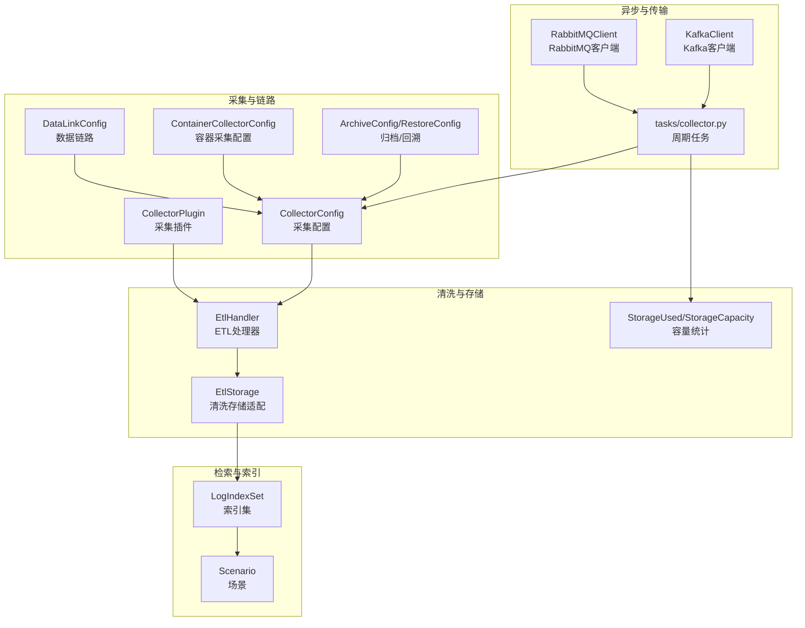
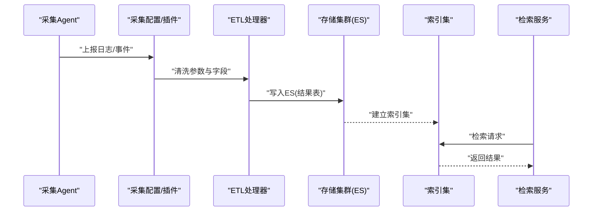
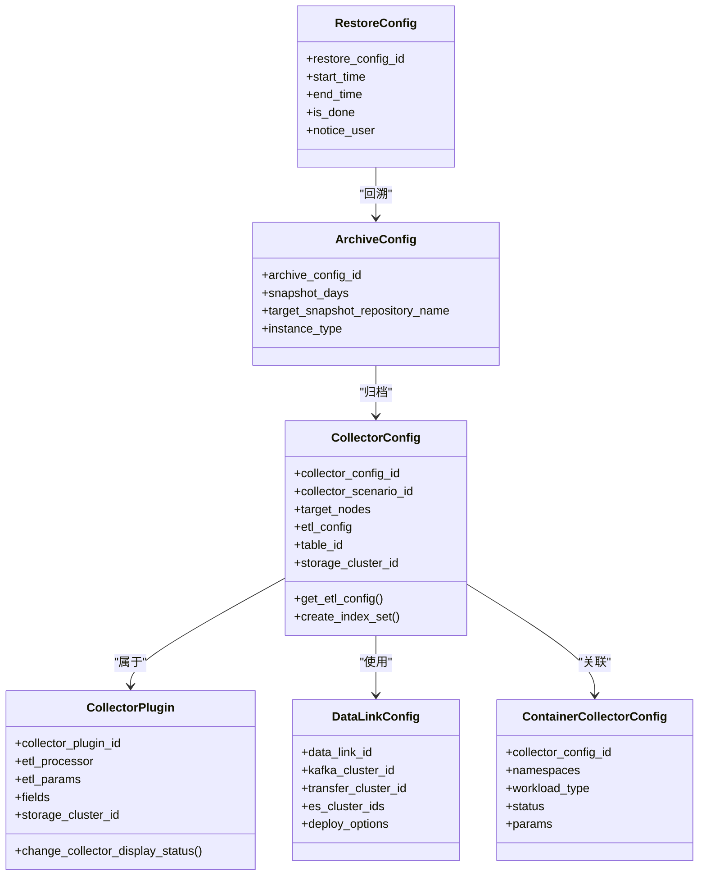
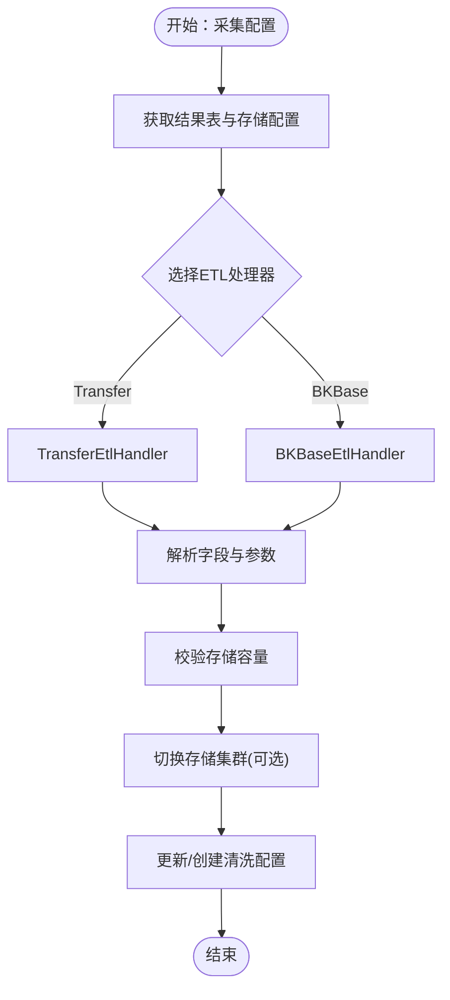
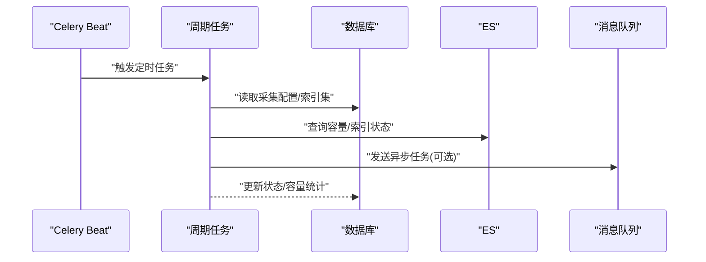
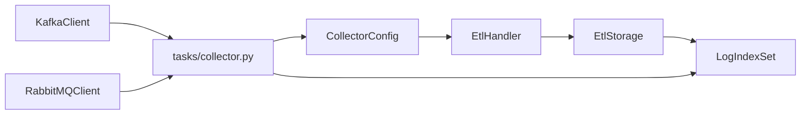

# 数据流设计

<cite>
**本文引用的文件**
- [apps/log_databus/models.py](file://apps/log_databus/models.py)
- [apps/log_databus/handlers/collector/__init__.py](file://apps/log_databus/handlers/collector/__init__.py)
- [apps/log_databus/tasks/collector.py](file://apps/log_databus/tasks/collector.py)
- [apps/log_databus/handlers/etl/__init__.py](file://apps/log_databus/handlers/etl/__init__.py)
- [apps/log_databus/handlers/etl_storage/__init__.py](file://apps/log_databus/handlers/etl_storage/__init__.py)
- [apps/log_search/models.py](file://apps/log_search/models.py)
- [home_application/utils/kafka.py](file://home_application/utils/kafka.py)
- [home_application/utils/rabbitmq.py](file://home_application/utils/rabbitmq.py)
- [apps/log_databus/constants.py](file://apps/log_databus/constants.py)
- [apps/log_databus/handlers/collector/base.py](file://apps/log_databus/handlers/collector/base.py)
- [apps/log_databus/handlers/etl/base.py](file://apps/log_databus/handlers/etl/base.py)
</cite>

## 目录
1. [简介](#简介)
2. [项目结构](#项目结构)
3. [核心组件](#核心组件)
4. [架构总览](#架构总览)
5. [详细组件分析](#详细组件分析)
6. [依赖分析](#依赖分析)
7. [性能考虑](#性能考虑)
8. [故障排查指南](#故障排查指南)
9. [结论](#结论)
10. [附录](#附录)

## 简介
本文件面向BK Monitor项目的数据流设计，聚焦“日志采集—传输—清洗—入库—检索”的完整链路，系统性阐述数据在各模块间的传递方式、格式转换与状态管理，说明异步处理机制、消息队列使用与任务调度策略，并给出一致性保障、错误恢复与重试机制、性能优化方案、监控指标与瓶颈分析，以及对系统可扩展性与可靠性的设计影响。

## 项目结构
围绕日志数据流的关键模块分布如下：
- 采集与链路配置：采集配置、采集插件、数据链路配置、容器采集配置、归档与回溯配置等模型与任务
- 清洗与存储：ETL处理器、存储集群管理、清洗模板与暂存
- 检索与索引：索引集、场景、字段与全局配置
- 异步与传输：Celery周期任务、Kafka/RabbitMQ客户端封装
- 常量与状态：采集、清洗、存储、容器等状态与常量定义

图表来源
- [apps/log_databus/models.py:102-411](file://apps/log_databus/models.py#L102-L411)
- [apps/log_databus/handlers/etl/base.py:72-200](file://apps/log_databus/handlers/etl/base.py#L72-L200)
- [apps/log_search/models.py:191-200](file://apps/log_search/models.py#L191-L200)
- [apps/log_databus/tasks/collector.py:99-192](file://apps/log_databus/tasks/collector.py#L99-L192)
- [home_application/utils/kafka.py:32-79](file://home_application/utils/kafka.py#L32-L79)
- [home_application/utils/rabbitmq.py:36-130](file://home_application/utils/rabbitmq.py#L36-L130)

章节来源
- [apps/log_databus/models.py:102-411](file://apps/log_databus/models.py#L102-L411)
- [apps/log_databus/tasks/collector.py:99-192](file://apps/log_databus/tasks/collector.py#L99-L192)
- [apps/log_search/models.py:191-200](file://apps/log_search/models.py#L191-L200)
- [home_application/utils/kafka.py:32-79](file://home_application/utils/kafka.py#L32-L79)
- [home_application/utils/rabbitmq.py:36-130](file://home_application/utils/rabbitmq.py#L36-L130)

## 核心组件
- 采集配置与插件
  - 采集配置：承载采集场景、目标节点、清洗策略、结果表、存储集群等关键元数据
  - 采集插件：定义清洗与存储能力、默认清洗参数与字段、是否允许独立配置
- 清洗与存储
  - ETL处理器：根据采集配置选择不同ETL实现（如Transfer/BKBase），负责清洗参数与字段的落地
  - 存储适配：解析结果表配置、存储集群信息，驱动清洗与入库参数
- 索引与检索
  - 索引集：绑定采集配置，承载检索场景、字段配置、标签与权限
  - 场景：区分日志、计算平台、ES等场景
- 异步与传输
  - 周期任务：定时检查采集状态、同步存储容量、切换容器采集存储、修改结果表等
  - Kafka/RabbitMQ：提供连通性探测与队列度量，支撑异步任务与监控

章节来源
- [apps/log_databus/models.py:102-411](file://apps/log_databus/models.py#L102-L411)
- [apps/log_databus/handlers/etl/base.py:72-200](file://apps/log_databus/handlers/etl/base.py#L72-L200)
- [apps/log_search/models.py:191-200](file://apps/log_search/models.py#L191-L200)
- [apps/log_databus/tasks/collector.py:99-192](file://apps/log_databus/tasks/collector.py#L99-L192)
- [home_application/utils/kafka.py:32-79](file://home_application/utils/kafka.py#L32-L79)
- [home_application/utils/rabbitmq.py:36-130](file://home_application/utils/rabbitmq.py#L36-L130)

## 架构总览
数据流从采集端产生，经链路配置与采集插件下发，进入清洗阶段，最终写入ES并建立索引集以供检索。期间通过周期任务维护状态、容量与存储配置，同时借助消息中间件保障异步任务的稳定性。

图表来源
- [apps/log_databus/handlers/collector/base.py:124-161](file://apps/log_databus/handlers/collector/base.py#L124-L161)
- [apps/log_databus/handlers/etl/base.py:72-200](file://apps/log_databus/handlers/etl/base.py#L72-L200)
- [apps/log_databus/models.py:102-411](file://apps/log_databus/models.py#L102-L411)

## 详细组件分析

### 采集与链路配置
- 采集配置（CollectorConfig）
  - 关键字段：采集场景、目标节点、清洗策略、结果表ID、存储集群、容器环境标记、打包数量与输出格式等
  - 行为：获取清洗配置、结果表配置、容量统计、索引集创建等
- 采集插件（CollectorPlugin）
  - 关键字段：清洗处理器、清洗参数、字段、存储集群、保留策略、副本与分片等
  - 行为：变更采集项可见状态、获取采集项ID等
- 数据链路（DataLinkConfig）
  - 关键字段：Kafka集群、Transfer集群、ES集群集合、是否可用、部署选项等
- 容器采集配置（ContainerCollectorConfig）
  - 关键字段：命名空间/工作负载/容器筛选、状态与详情、规则集等
- 归档与回溯（ArchiveConfig/RestoreConfig）
  - 关键字段：快照天数、仓库、回溯时间窗口、完成状态、通知等

图表来源
- [apps/log_databus/models.py:102-411](file://apps/log_databus/models.py#L102-L411)
- [apps/log_databus/models.py:414-437](file://apps/log_databus/models.py#L414-L437)
- [apps/log_databus/models.py:455-482](file://apps/log_databus/models.py#L455-L482)
- [apps/log_databus/models.py:414-437](file://apps/log_databus/models.py#L414-L437)
- [apps/log_databus/models.py:567-627](file://apps/log_databus/models.py#L567-L627)
- [apps/log_databus/models.py:629-681](file://apps/log_databus/models.py#L629-L681)

章节来源
- [apps/log_databus/models.py:102-411](file://apps/log_databus/models.py#L102-L411)
- [apps/log_databus/models.py:414-437](file://apps/log_databus/models.py#L414-L437)
- [apps/log_databus/models.py:455-482](file://apps/log_databus/models.py#L455-L482)
- [apps/log_databus/models.py:567-627](file://apps/log_databus/models.py#L567-L627)
- [apps/log_databus/models.py:629-681](file://apps/log_databus/models.py#L629-L681)

### 清洗与存储
- ETL处理器（EtlHandler）
  - 动态选择清洗实现（Transfer/BKBase），校验存储容量，处理聚类链路字段映射，更新或创建清洗配置
- 存储适配（EtlStorage）
  - 解析结果表配置与存储信息，生成ETL配置与字段清单
- 清洗模板与暂存（CleanTemplate/CleanStash）
  - 模板化清洗参数与字段，暂存未完成入库的清洗状态

图表来源
- [apps/log_databus/handlers/etl/base.py:72-200](file://apps/log_databus/handlers/etl/base.py#L72-L200)
- [apps/log_databus/handlers/etl/__init__.py:21-24](file://apps/log_databus/handlers/etl/__init__.py#L21-L24)
- [apps/log_databus/handlers/etl_storage/__init__.py:22-25](file://apps/log_databus/handlers/etl_storage/__init__.py#L22-L25)

章节来源
- [apps/log_databus/handlers/etl/base.py:72-200](file://apps/log_databus/handlers/etl/base.py#L72-L200)
- [apps/log_databus/handlers/etl/__init__.py:21-24](file://apps/log_databus/handlers/etl/__init__.py#L21-L24)
- [apps/log_databus/handlers/etl_storage/__init__.py:22-25](file://apps/log_databus/handlers/etl_storage/__init__.py#L22-L25)

### 检索与索引
- 索引集（LogIndexSet）
  - 绑定采集配置，设置场景、是否激活、标签与权限，用于检索与展示
- 场景（Scenario）
  - 区分日志、计算平台、ES等场景，影响索引与查询策略

章节来源
- [apps/log_search/models.py:191-200](file://apps/log_search/models.py#L191-L200)

### 异步处理与消息队列
- 周期任务（tasks/collector.py）
  - 定时检查采集状态、同步存储容量、切换容器采集存储、修改结果表、创建自定义日志组等
- Kafka/RabbitMQ客户端
  - 提供连通性探测、消费者组与偏移查询、队列长度与消费者计数等度量

图表来源
- [apps/log_databus/tasks/collector.py:99-192](file://apps/log_databus/tasks/collector.py#L99-L192)
- [home_application/utils/kafka.py:32-79](file://home_application/utils/kafka.py#L32-L79)
- [home_application/utils/rabbitmq.py:36-130](file://home_application/utils/rabbitmq.py#L36-L130)

章节来源
- [apps/log_databus/tasks/collector.py:99-192](file://apps/log_databus/tasks/collector.py#L99-L192)
- [home_application/utils/kafka.py:32-79](file://home_application/utils/kafka.py#L32-L79)
- [home_application/utils/rabbitmq.py:36-130](file://home_application/utils/rabbitmq.py#L36-L130)

## 依赖分析
- 组件耦合
  - 采集配置与ETL处理器强耦合：ETL处理器依赖采集配置的清洗参数与字段
  - 存储适配与索引集弱耦合：通过结果表配置与存储集群信息间接关联
  - 周期任务与采集配置/索引集强耦合：定期读取与更新状态
- 外部依赖
  - Kafka/RabbitMQ：用于异步任务与监控
  - Transfer/ES：用于结果表与存储集群管理

图表来源
- [apps/log_databus/handlers/collector/base.py:124-161](file://apps/log_databus/handlers/collector/base.py#L124-L161)
- [apps/log_databus/handlers/etl/base.py:72-200](file://apps/log_databus/handlers/etl/base.py#L72-L200)
- [apps/log_databus/tasks/collector.py:99-192](file://apps/log_databus/tasks/collector.py#L99-L192)
- [home_application/utils/kafka.py:32-79](file://home_application/utils/kafka.py#L32-L79)
- [home_application/utils/rabbitmq.py:36-130](file://home_application/utils/rabbitmq.py#L36-L130)

章节来源
- [apps/log_databus/handlers/collector/base.py:124-161](file://apps/log_databus/handlers/collector/base.py#L124-L161)
- [apps/log_databus/handlers/etl/base.py:72-200](file://apps/log_databus/handlers/etl/base.py#L72-L200)
- [apps/log_databus/tasks/collector.py:99-192](file://apps/log_databus/tasks/collector.py#L99-L192)
- [home_application/utils/kafka.py:32-79](file://home_application/utils/kafka.py#L32-L79)
- [home_application/utils/rabbitmq.py:36-130](file://home_application/utils/rabbitmq.py#L36-L130)

## 性能考虑
- 采集与清洗
  - 合理设置采集打包数量与输出格式，避免过大批次导致内存压力
  - 清洗参数与字段应尽量精简，减少ETL处理开销
- 存储与索引
  - 控制索引数量与分片大小，避免过多shards导致查询与写入性能下降
  - 启用冷热分层与副本策略，平衡写入吞吐与查询延迟
- 异步与队列
  - Kafka/RabbitMQ队列堆积阈值报警，及时扩容或优化消费者并发
  - Celery任务批处理（如批量Upsert）降低数据库写放大
- 监控与度量
  - 关注采集项24小时未入库自动停止、存储容量同步、容器配置下发等关键指标

章节来源
- [apps/log_databus/tasks/collector.py:124-192](file://apps/log_databus/tasks/collector.py#L124-L192)
- [home_application/utils/rabbitmq.py:83-130](file://home_application/utils/rabbitmq.py#L83-L130)

## 故障排查指南
- 采集状态异常
  - 检查采集配置状态与订阅信息，确认采集器是否正常运行
  - 关注24小时未入库自动停止逻辑，必要时手动启动
- 清洗配置问题
  - 校验ETL处理器选择与参数，确保字段映射正确
  - 容量超限会触发异常，需调整存储策略或清理历史数据
- 存储与索引
  - 通过ES路由查询索引状态与容量，核对索引集标签与权限
- 消息队列
  - 使用Kafka/RabbitMQ客户端探测连通性与队列长度，定位积压与消费者异常

章节来源
- [apps/log_databus/tasks/collector.py:99-192](file://apps/log_databus/tasks/collector.py#L99-L192)
- [apps/log_databus/handlers/etl/base.py:107-124](file://apps/log_databus/handlers/etl/base.py#L107-L124)
- [home_application/utils/kafka.py:32-79](file://home_application/utils/kafka.py#L32-L79)
- [home_application/utils/rabbitmq.py:36-130](file://home_application/utils/rabbitmq.py#L36-L130)

## 结论
本数据流设计以采集配置为核心，通过ETL处理器与存储适配实现清洗与入库，结合索引集提供检索能力。周期任务与消息中间件保障了系统的异步处理与可观测性。通过容量校验、状态监控与队列度量，系统在可扩展性与可靠性方面具备良好基础，建议持续优化ETL参数、存储分层与任务批处理策略以提升整体性能。

## 附录
- 状态与常量
  - 采集、清洗、存储、容器等状态枚举与常量定义，用于统一状态管理与流程控制

章节来源
- [apps/log_databus/constants.py:190-200](file://apps/log_databus/constants.py#L190-L200)