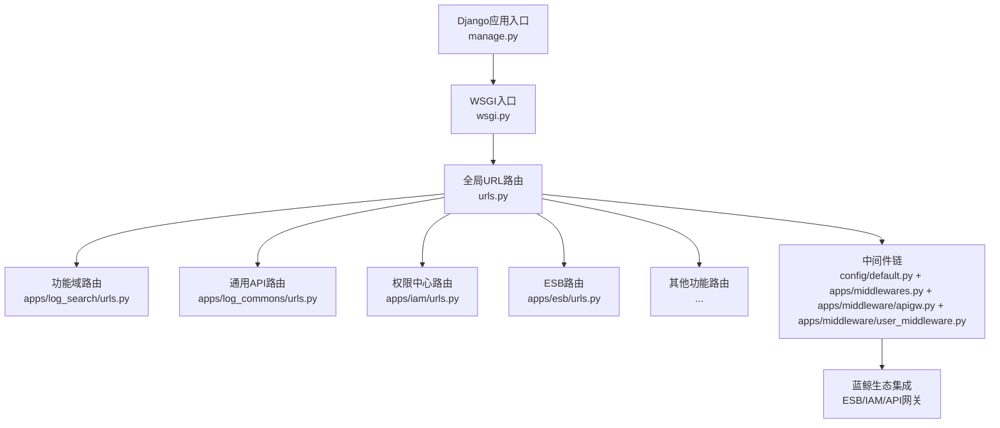
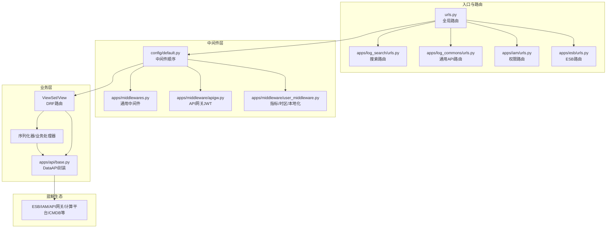
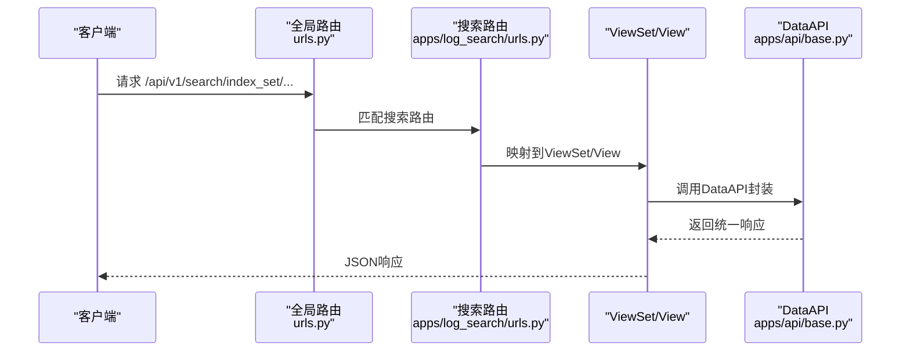
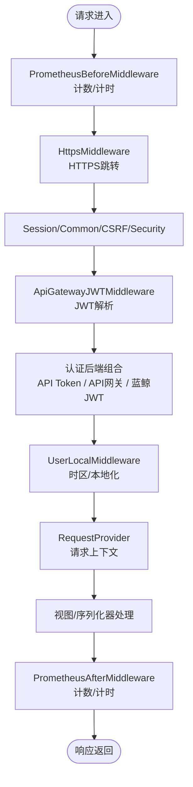
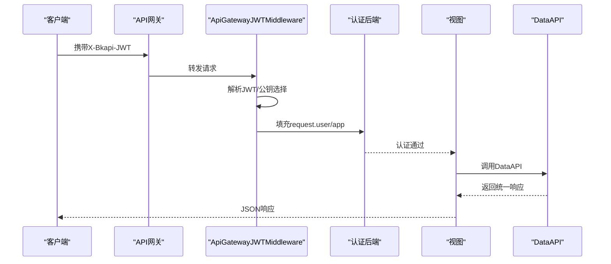
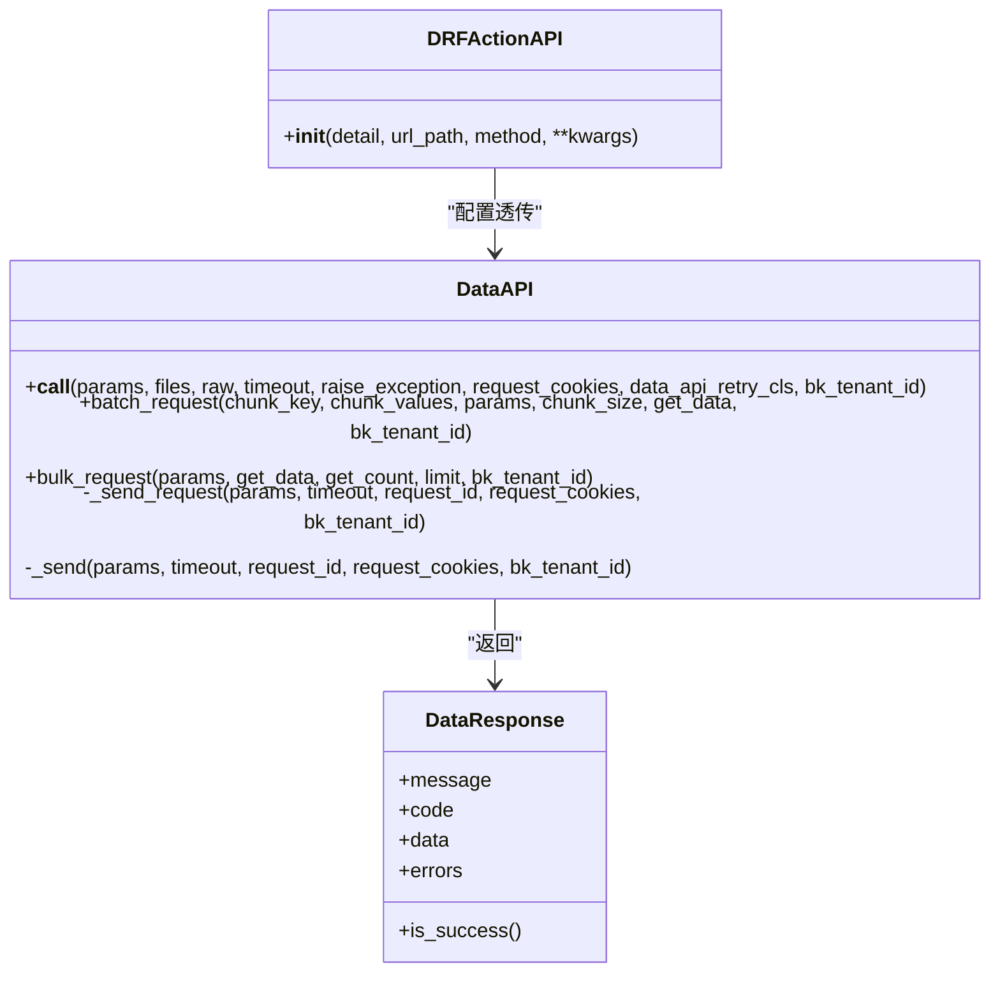
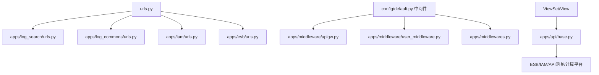

# 核心架构

<cite>
**本文引用的文件**
- [settings.py](file://settings.py)
- [urls.py](file://urls.py)
- [wsgi.py](file://wsgi.py)
- [manage.py](file://manage.py)
- [config/default.py](file://config/default.py)
- [apps/middlewares.py](file://apps/middlewares.py)
- [apps/middleware/apigw.py](file://apps/middleware/apigw.py)
- [apps/middleware/user_middleware.py](file://apps/middleware/user_middleware.py)
- [apps/api/base.py](file://apps/api/base.py)
- [apps/log_search/urls.py](file://apps/log_search/urls.py)
- [apps/log_commons/urls.py](file://apps/log_commons/urls.py)
- [apps/iam/urls.py](file://apps/iam/urls.py)
- [apps/esb/urls.py](file://apps/esb/urls.py)
- [config/dev.py](file://config/dev.py)
</cite>

## 目录
1. [简介](#简介)
2. [项目结构](#项目结构)
3. [核心组件](#核心组件)
4. [架构总览](#架构总览)
5. [详细组件分析](#详细组件分析)
6. [依赖分析](#依赖分析)
7. [性能考虑](#性能考虑)
8. [故障排查指南](#故障排查指南)
9. [结论](#结论)
10. [附录](#附录)

## 简介
本文件面向BK Monitor项目（蓝鲸日志平台子系统），系统性梳理其核心架构设计，覆盖分层架构、模块化组织、组件交互、Django框架使用方式、URL路由机制、中间件体系、API网关集成、蓝鲸生态对接（ESB、权限中心IAM）、数据流与请求处理流程、系统边界、架构决策的技术考量、性能优化策略与可扩展性设计。文档同时提供架构图与组件关系图，帮助开发者快速理解系统全貌。

## 项目结构
项目采用蓝鲸官方推荐的多应用（apps）分层组织方式，核心入口由Django应用负责，各功能域以独立app模块实现，便于职责分离与演进扩展。主要入口与配置如下：
- 应用入口与配置
  - settings.py：动态加载运行环境配置，按环境选择config.*模块
  - config/default.py：默认及生产环境配置，含中间件、安装应用、REST配置、特性开关、蓝鲸生态地址等
  - config/dev.py：开发环境特例配置（如数据库、IAM、Grafana）
  - urls.py：全局URL路由聚合，按API版本与功能域分发至各app
  - wsgi.py：WSGI入口
  - manage.py：Django命令入口
- 关键中间件与API网关
  - apps/middlewares.py：通用中间件、请求上下文、HTTPS跳转、异常处理等
  - apps/middleware/apigw.py：API网关JWT解析与用户认证后端
  - apps/middleware/user_middleware.py：Prometheus指标、时区与用户本地化、模块/应用识别
  - apps/api/base.py：统一数据API调用封装、重试、缓存、序列化与日志记录

**图表来源**
- [urls.py:42-74](file://urls.py#L42-L74)
- [apps/log_search/urls.py:42-66](file://apps/log_search/urls.py#L42-L66)
- [apps/log_commons/urls.py:29-42](file://apps/log_commons/urls.py#L29-L42)
- [apps/iam/urls.py:46-51](file://apps/iam/urls.py#L46-L51)
- [apps/esb/urls.py:28-37](file://apps/esb/urls.py#L28-L37)
- [config/default.py:113-154](file://config/default.py#L113-L154)
- [apps/middlewares.py:125-197](file://apps/middlewares.py#L125-L197)
- [apps/middleware/apigw.py:123-125](file://apps/middleware/apigw.py#L123-L125)
- [apps/middleware/user_middleware.py:96-172](file://apps/middleware/user_middleware.py#L96-L172)

**章节来源**
- [settings.py:39-46](file://settings.py#L39-L46)
- [urls.py:42-74](file://urls.py#L42-L74)
- [config/default.py:54-95](file://config/default.py#L54-L95)
- [config/dev.py:34-80](file://config/dev.py#L34-L80)

## 核心组件
- Django配置与环境选择
  - settings.py根据环境变量动态选择config.*模块，确保不同环境（dev/stag/prod/k8s）的配置隔离
- 全局URL路由
  - urls.py集中注册各功能域路由，按/api/v1/版本前缀区分能力域（搜索、ES查询、采集、集群、脱敏、统一查询、trace等），并挂载管理后台、ESB、Grafana适配、版本日志等
- 中间件体系
  - config/default.py定义中间件顺序，覆盖性能分析、HTTPS、会话、安全、白名单、API网关JWT、鉴权、异常处理、国际化、审计等
  - apps/middlewares.py提供通用异常处理、请求上下文、HTTPS跳转
  - apps/middleware/apigw.py提供API网关JWT解析与用户认证后端
  - apps/middleware/user_middleware.py提供Prometheus指标、时区与用户本地化
- API网关与蓝鲸生态
  - API网关JWT中间件与用户后端，结合config/default.py中的认证后端，实现蓝鲸统一鉴权
  - ESB路由与权限中心IAM路由，支撑对外接口转发与资源授权
- 统一数据API封装
  - apps/api/base.py提供DataAPI/DataResponse、重试策略、缓存、序列化、批量请求、并发请求等能力，统一蓝鲸生态调用风格

**章节来源**
- [settings.py:27-36](file://settings.py#L27-L36)
- [urls.py:42-74](file://urls.py#L42-L74)
- [config/default.py:113-154](file://config/default.py#L113-L154)
- [apps/middlewares.py:125-197](file://apps/middlewares.py#L125-L197)
- [apps/middleware/apigw.py:123-125](file://apps/middleware/apigw.py#L123-L125)
- [apps/middleware/user_middleware.py:96-172](file://apps/middleware/user_middleware.py#L96-L172)
- [apps/api/base.py:191-320](file://apps/api/base.py#L191-L320)

## 架构总览
系统采用“入口路由—中间件—视图/序列化器—数据API—蓝鲸生态”的分层架构。请求进入后经中间件链处理，匹配URL路由到对应app，app内DRF Router将请求映射到ViewSet/View，业务逻辑通过DataAPI统一调用蓝鲸生态能力（ESB、IAM、API网关、计算平台等），最终返回JSON响应。

**图表来源**
- [urls.py:42-74](file://urls.py#L42-L74)
- [apps/log_search/urls.py:42-66](file://apps/log_search/urls.py#L42-L66)
- [apps/log_commons/urls.py:29-42](file://apps/log_commons/urls.py#L29-L42)
- [apps/iam/urls.py:46-51](file://apps/iam/urls.py#L46-L51)
- [apps/esb/urls.py:28-37](file://apps/esb/urls.py#L28-L37)
- [config/default.py:113-154](file://config/default.py#L113-L154)
- [apps/middlewares.py:125-197](file://apps/middlewares.py#L125-L197)
- [apps/middleware/apigw.py:123-125](file://apps/middleware/apigw.py#L123-L125)
- [apps/middleware/user_middleware.py:96-172](file://apps/middleware/user_middleware.py#L96-L172)
- [apps/api/base.py:191-320](file://apps/api/base.py#L191-L320)

## 详细组件分析

### Django配置与环境选择
- 动态环境加载：settings.py依据BKPAAS_ENVIRONMENT或BK_ENV选择config.dev/stag/prod或config.default
- 配置模块化：config/default.py集中定义INSTALLED_APPS、MIDDLEWARE、REST_FRAMEWORK、特性开关、蓝鲸生态地址、Grafana、ESB转发白名单等
- 开发环境特例：config/dev.py覆盖数据库、IAM、Grafana等开发期配置

**章节来源**
- [settings.py:27-36](file://settings.py#L27-L36)
- [config/default.py:34-95](file://config/default.py#L34-L95)
- [config/dev.py:34-80](file://config/dev.py#L34-L80)

### URL路由机制与分发
- 全局路由：urls.py按/api/v1/前缀聚合各功能域路由，支持多版本并存与按需扩展
- 功能域路由：
  - 搜索与聚合：apps/log_search/urls.py注册Meta/Biz/IndexSet/Search/Field/Alert等路由
  - 通用API：apps/log_commons/urls.py提供外部权限、分享、Token等路由
  - 权限中心：apps/iam/urls.py注册Meta与资源API分发器
  - ESB：apps/esb/urls.py提供ESB接口转发与元数据路由

**图表来源**
- [urls.py:42-74](file://urls.py#L42-L74)
- [apps/log_search/urls.py:42-66](file://apps/log_search/urls.py#L42-L66)
- [apps/api/base.py:191-320](file://apps/api/base.py#L191-L320)

**章节来源**
- [urls.py:42-74](file://urls.py#L42-L74)
- [apps/log_search/urls.py:42-66](file://apps/log_search/urls.py#L42-L66)
- [apps/log_commons/urls.py:29-42](file://apps/log_commons/urls.py#L29-L42)
- [apps/iam/urls.py:46-51](file://apps/iam/urls.py#L46-L51)
- [apps/esb/urls.py:28-37](file://apps/esb/urls.py#L28-L37)

### 中间件系统与请求生命周期
- 中间件顺序与职责
  - 性能分析：PrometheusBefore/After中间件统计请求总量、延迟
  - HTTPS跳转：HttpsMiddleware按配置进行HTTP→HTTPS跳转
  - 会话与安全：Session/Common/CSRF/Security等
  - 白名单与国际化：Whitenoise、自定义Locale中间件
  - API网关JWT：ApiGatewayJWTMiddleware解析JWT，填充request.jwt/app/user
  - 鉴权后端：多种认证后端组合，支持API Token、API网关、蓝鲸JWT等
  - 异常处理：CommonMid统一异常转换为JSON响应
  - 审计与请求上下文：RequestProvider与信号配合，提供跨线程请求访问
- 用户本地化与时区
  - UserLocalMiddleware从BK_LOGIN获取用户时区，激活timezone并注入request.session

**图表来源**
- [config/default.py:113-154](file://config/default.py#L113-L154)
- [apps/middlewares.py:125-197](file://apps/middlewares.py#L125-L197)
- [apps/middleware/apigw.py:123-125](file://apps/middleware/apigw.py#L123-L125)
- [apps/middleware/user_middleware.py:96-172](file://apps/middleware/user_middleware.py#L96-L172)

**章节来源**
- [config/default.py:113-154](file://config/default.py#L113-L154)
- [apps/middlewares.py:125-197](file://apps/middlewares.py#L125-L197)
- [apps/middleware/apigw.py:123-125](file://apps/middleware/apigw.py#L123-L125)
- [apps/middleware/user_middleware.py:96-172](file://apps/middleware/user_middleware.py#L96-L172)

### API网关集成与认证
- API网关JWT中间件
  - apps/middleware/apigw.py提供自定义公钥提供器与JWT Provider，支持内部/外部网关切换
  - 支持新旧网关名称映射与外部公钥配置
- 认证后端
  - config/default.py中AUTHENTICATION_BACKENDS组合多种后端，确保API网关、API Token、蓝鲸JWT等认证方式兼容
- 请求头与租户
  - DataAPI封装自动注入X-Bkapi-Authorization、X-Bk-Tenant-Id等头部，支持多租户与请求追踪

**图表来源**
- [apps/middleware/apigw.py:123-125](file://apps/middleware/apigw.py#L123-L125)
- [config/default.py:544-550](file://config/default.py#L544-L550)
- [apps/api/base.py:528-554](file://apps/api/base.py#L528-L554)

**章节来源**
- [apps/middleware/apigw.py:60-121](file://apps/middleware/apigw.py#L60-L121)
- [config/default.py:544-550](file://config/default.py#L544-L550)
- [apps/api/base.py:528-554](file://apps/api/base.py#L528-L554)

### 蓝鲸生态集成（ESB、IAM、权限管理）
- ESB接口转发
  - apps/esb/urls.py提供ESB接口转发与元数据路由，支持白名单接口与权限校验
  - config/default.py中ALLOWED_MODULES_FUNCS/META_ESB_FORWARD_CONFIG定义允许转发的接口与IAM键
- 权限中心IAM
  - apps/iam/urls.py注册Meta与资源API分发器，对接蓝鲸权限中心
  - config/default.py中BK_IAM_*配置权限中心地址、系统ID、资源API地址等
- 权限模型
  - AUTH_TYPE=RBAC，定义项目/索引集/采集/提取/度量等动作标识，供业务侧使用

**章节来源**
- [apps/esb/urls.py:28-37](file://apps/esb/urls.py#L28-L37)
- [config/default.py:474-499](file://config/default.py#L474-L499)
- [apps/iam/urls.py:46-51](file://apps/iam/urls.py#L46-L51)
- [config/default.py:561-570](file://config/default.py#L561-L570)

### 统一数据API封装与调用
- DataAPI核心能力
  - 统一请求发送、响应清洗、序列化、缓存、重试、批量/并发请求、租户ID注入、请求追踪
  - 支持before_request/after_request钩子与自定义序列化器
- 错误处理与日志
  - 统一异常转换为ApiRequestError/ApiResultError，记录详细日志与耗时
- 并发与批处理
  - ThreadPool并发请求、分页/切片批量请求，提升吞吐与稳定性

**图表来源**
- [apps/api/base.py:191-320](file://apps/api/base.py#L191-L320)
- [apps/api/base.py:77-106](file://apps/api/base.py#L77-L106)
- [apps/api/base.py:788-800](file://apps/api/base.py#L788-L800)

**章节来源**
- [apps/api/base.py:191-320](file://apps/api/base.py#L191-L320)
- [apps/api/base.py:332-481](file://apps/api/base.py#L332-L481)
- [apps/api/base.py:632-741](file://apps/api/base.py#L632-L741)

## 依赖分析
- 组件耦合与内聚
  - 路由层与业务层通过DRF Router解耦；中间件层提供横切关注点；DataAPI作为统一出口降低对具体生态的耦合
- 外部依赖与集成点
  - ESB、IAM、API网关、Grafana、计算平台、CMDB等通过DataAPI与配置中心集成
- 潜在循环依赖
  - 通过模块化拆分与延迟导入避免循环依赖；中间件与认证后端通过配置组合避免直接耦合

**图表来源**
- [urls.py:42-74](file://urls.py#L42-L74)
- [apps/log_search/urls.py:42-66](file://apps/log_search/urls.py#L42-L66)
- [apps/log_commons/urls.py:29-42](file://apps/log_commons/urls.py#L29-L42)
- [apps/iam/urls.py:46-51](file://apps/iam/urls.py#L46-L51)
- [apps/esb/urls.py:28-37](file://apps/esb/urls.py#L28-L37)
- [config/default.py:113-154](file://config/default.py#L113-L154)
- [apps/middleware/apigw.py:123-125](file://apps/middleware/apigw.py#L123-L125)
- [apps/middleware/user_middleware.py:96-172](file://apps/middleware/user_middleware.py#L96-L172)
- [apps/middlewares.py:125-197](file://apps/middlewares.py#L125-L197)
- [apps/api/base.py:191-320](file://apps/api/base.py#L191-L320)

**章节来源**
- [urls.py:42-74](file://urls.py#L42-L74)
- [config/default.py:113-154](file://config/default.py#L113-L154)
- [apps/api/base.py:191-320](file://apps/api/base.py#L191-L320)

## 性能考虑
- 指标与可观测性
  - Prometheus中间件统计请求总量、响应量、延迟分布，按主机/阶段/应用/模块维度打标
- 中间件顺序优化
  - 将性能分析与异常处理置于靠前位置，减少后续处理开销
- 缓存与重试
  - DataAPI支持缓存与重试策略，降低外部依赖抖动影响
- 并发与批处理
  - ThreadPool并发请求与分页/切片批量请求，提升吞吐
- 静态资源与HTTPS
  - Whitenoise中间件与HTTPS跳转，保障前端体验与安全

**章节来源**
- [apps/middleware/user_middleware.py:96-172](file://apps/middleware/user_middleware.py#L96-L172)
- [apps/api/base.py:108-174](file://apps/api/base.py#L108-L174)
- [config/default.py:113-154](file://config/default.py#L113-L154)

## 故障排查指南
- 异常处理
  - CommonMid统一捕获BaseException与BlueException，返回标准化JSON响应
  - 未捕获异常记录详细堆栈与请求上下文，便于定位
- API调用异常
  - DataAPI将HTTP状态码、返回格式、敏感参数过滤、耗时等记录到日志，辅助排错
- 认证与权限
  - API网关JWT解析失败或公钥缺失时，中间件会记录告警并拒绝无效令牌
- ESB与IAM
  - ALLOWED_MODULES_FUNCS/META_ESB_FORWARD_CONFIG限制转发范围，避免越权调用

**章节来源**
- [apps/middlewares.py:139-197](file://apps/middlewares.py#L139-L197)
- [apps/api/base.py:318-481](file://apps/api/base.py#L318-L481)
- [apps/middleware/apigw.py:116-121](file://apps/middleware/apigw.py#L116-L121)
- [config/default.py:474-499](file://config/default.py#L474-L499)

## 结论
本架构以Django为核心，通过清晰的路由分层、完善的中间件体系与统一的数据API封装，实现了对蓝鲸生态的深度集成与稳定扩展。API网关、ESB、IAM等关键组件通过中间件与DataAPI解耦，既满足多租户与多场景需求，又具备良好的性能与可观测性。建议在演进过程中持续优化中间件顺序、完善缓存与重试策略，并加强对外部依赖的降级与熔断设计。

## 附录
- 系统边界
  - 内部：Django应用、中间件、业务视图、DataAPI
  - 外部：ESB、IAM、API网关、Grafana、计算平台、CMDB、Redis/RabbitMQ/Celery等基础设施
- 可扩展性设计
  - 新增功能域：在urls.py新增路由，按app模块化实现
  - 新增认证方式：在AUTHENTICATION_BACKENDS中追加后端
  - 新增外部系统：通过DataAPI封装统一接入，保持业务层一致