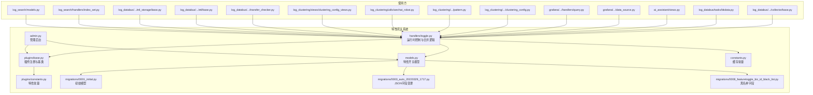
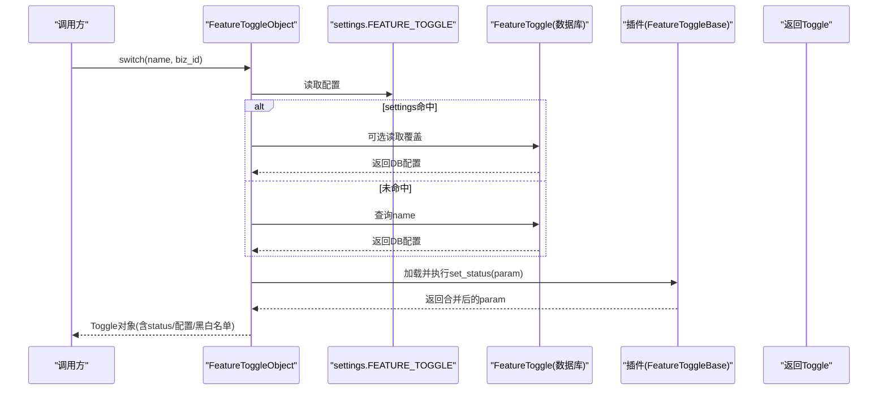
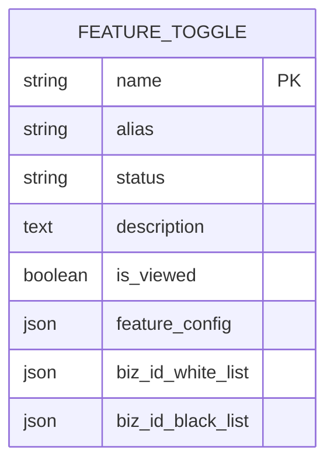
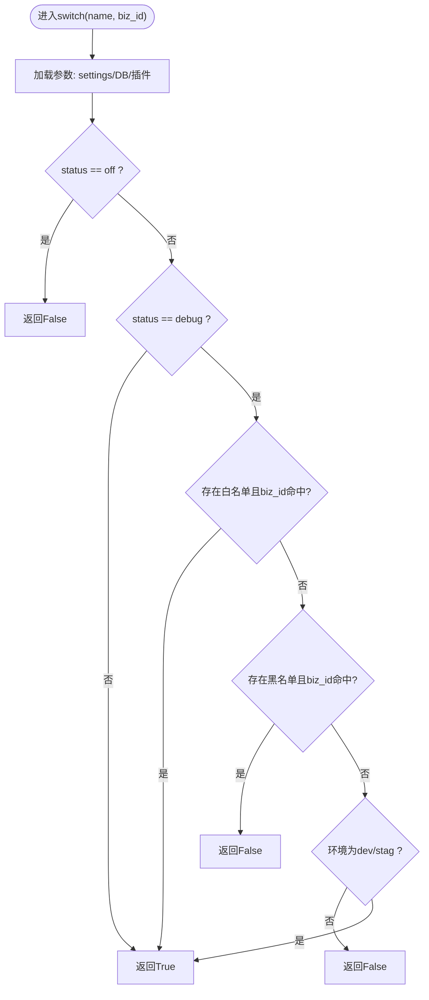
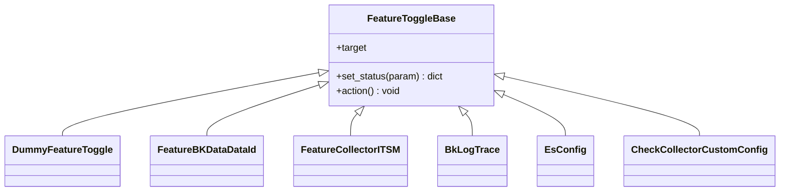
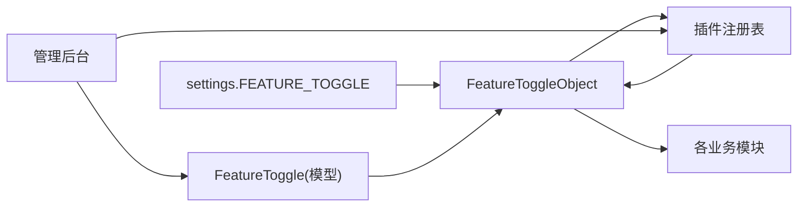

# 特性开关系统

<cite>
**本文引用的文件**
- [apps/feature_toggle/models.py](file://apps/feature_toggle/models.py)
- [apps/feature_toggle/handlers/toggle.py](file://apps/feature_toggle/handlers/toggle.py)
- [apps/feature_toggle/plugins/base.py](file://apps/feature_toggle/plugins/base.py)
- [apps/feature_toggle/plugins/constants.py](file://apps/feature_toggle/plugins/constants.py)
- [apps/feature_toggle/admin.py](file://apps/feature_toggle/admin.py)
- [apps/feature_toggle/constants.py](file://apps/feature_toggle/constants.py)
- [apps/feature_toggle/migrations/0001_initial.py](file://apps/feature_toggle/migrations/0001_initial.py)
- [apps/feature_toggle/migrations/0003_auto_20220329_1717.py](file://apps/feature_toggle/migrations/0003_auto_20220329_1717.py)
- [apps/feature_toggle/migrations/0008_featuretoggle_biz_id_black_list.py](file://apps/feature_toggle/migrations/0008_featuretoggle_biz_id_black_list.py)
- [apps/log_databus/handlers/collector/base.py](file://apps/log_databus/handlers/collector/base.py)
- [apps/log_databus/tasks/bkdata.py](file://apps/log_databus/tasks/bkdata.py)
- [apps/ai_assistant/views.py](file://apps/ai_assistant/views.py)
- [apps/grafana/data_source.py](file://apps/grafana/data_source.py)
- [apps/grafana/handlers/query.py](file://apps/grafana/handlers/query.py)
- [apps/log_clustering/handlers/clustering_config.py](file://apps/log_clustering/handlers/clustering_config.py)
- [apps/log_clustering/handlers/pattern.py](file://apps/log_clustering/handlers/pattern.py)
- [apps/log_clustering/utils/wechat_robot.py](file://apps/log_clustering/utils/wechat_robot.py)
- [apps/log_clustering/views/clustering_config_views.py](file://apps/log_clustering/views/clustering_config_views.py)
- [apps/log_databus/handlers/check_collector/checker/transfer_checker.py](file://apps/log_databus/handlers/check_collector/checker/transfer_checker.py)
- [apps/log_databus/handlers/etl/base.py](file://apps/log_databus/handlers/etl/base.py)
- [apps/log_databus/handlers/etl_storage/base.py](file://apps/log_databus/handlers/etl_storage/base.py)
- [apps/log_databus/tasks/bkdata.py](file://apps/log_databus/tasks/bkdata.py)
- [apps/log_search/handlers/index_set.py](file://apps/log_search/handlers/index_set.py)
- [apps/log_search/models.py](file://apps/log_search/models.py)
</cite>

## 目录
1. [简介](#简介)
2. [项目结构](#项目结构)
3. [核心组件](#核心组件)
4. [架构总览](#架构总览)
5. [详细组件分析](#详细组件分析)
6. [依赖分析](#依赖分析)
7. [性能考量](#性能考量)
8. [故障排查指南](#故障排查指南)
9. [结论](#结论)
10. [附录](#附录)

## 简介
本文件面向BK Monitor（蓝鲸日志平台）的“特性开关”系统，系统性阐述其设计原理、数据模型、配置管理、运行时控制机制、插件化扩展方式、生命周期与灰度发布策略、A/B测试支持、配置优先级与回滚机制，并给出最佳实践、性能影响与安全注意事项，帮助读者理解并正确使用该系统实现渐进式功能发布。

## 项目结构
特性开关系统主要由以下模块组成：
- 数据模型层：存储特性开关的元信息与配置
- 运行时控制层：提供开关判断、合并配置、插件加载与执行
- 插件层：按目标特性动态注入或调整配置
- 管理后台：可视化维护开关与触发插件动作
- 常量层：集中定义特性开关名称常量
- 迁移层：数据库演进与字段变更记录

图表来源
- [apps/feature_toggle/models.py:29-46](file://apps/feature_toggle/models.py#L29-L46)
- [apps/feature_toggle/handlers/toggle.py:62-259](file://apps/feature_toggle/handlers/toggle.py#L62-L259)
- [apps/feature_toggle/plugins/base.py:32-189](file://apps/feature_toggle/plugins/base.py#L32-L189)
- [apps/feature_toggle/plugins/constants.py:22-74](file://apps/feature_toggle/plugins/constants.py#L22-L74)
- [apps/feature_toggle/admin.py:30-44](file://apps/feature_toggle/admin.py#L30-L44)
- [apps/feature_toggle/constants.py:22-25](file://apps/feature_toggle/constants.py#L22-L25)
- [apps/feature_toggle/migrations/0001_initial.py:35-65](file://apps/feature_toggle/migrations/0001_initial.py#L35-L65)
- [apps/feature_toggle/migrations/0003_auto_20220329_1717.py:12-23](file://apps/feature_toggle/migrations/0003_auto_20220329_1717.py#L12-L23)
- [apps/feature_toggle/migrations/0008_featuretoggle_biz_id_black_list.py:12-18](file://apps/feature_toggle/migrations/0008_featuretoggle_biz_id_black_list.py#L12-L18)

章节来源
- [apps/feature_toggle/models.py:29-46](file://apps/feature_toggle/models.py#L29-L46)
- [apps/feature_toggle/handlers/toggle.py:62-259](file://apps/feature_toggle/handlers/toggle.py#L62-L259)
- [apps/feature_toggle/plugins/base.py:32-189](file://apps/feature_toggle/plugins/base.py#L32-L189)
- [apps/feature_toggle/plugins/constants.py:22-74](file://apps/feature_toggle/plugins/constants.py#L22-L74)
- [apps/feature_toggle/admin.py:30-44](file://apps/feature_toggle/admin.py#L30-L44)
- [apps/feature_toggle/constants.py:22-25](file://apps/feature_toggle/constants.py#L22-L25)
- [apps/feature_toggle/migrations/0001_initial.py:35-65](file://apps/feature_toggle/migrations/0001_initial.py#L35-L65)
- [apps/feature_toggle/migrations/0003_auto_20220329_1717.py:12-23](file://apps/feature_toggle/migrations/0003_auto_20220329_1717.py#L12-L23)
- [apps/feature_toggle/migrations/0008_featuretoggle_biz_id_black_list.py:12-18](file://apps/feature_toggle/migrations/0008_featuretoggle_biz_id_black_list.py#L12-L18)

## 核心组件
- 特性开关模型（FeatureToggle）
  - 字段：名称、别名、状态、描述、是否前端展示、特性配置、业务白名单、业务黑名单
  - 作用：持久化特性开关的元数据与可选配置
- 运行时控制（FeatureToggleObject）
  - 提供开关判断与合并逻辑：settings → 数据库 → 插件
  - 支持业务维度白/黑名单与环境维度灰度
- 插件系统（FeatureToggleBase）
  - 抽象基类与注册机制，按特性目标动态注入或调整配置
- 管理后台（FeatureToggleAdmin）
  - 列表、搜索与触发插件动作
- 常量与缓存
  - 特性名称常量集中管理
  - 缓存键与过期时间常量

章节来源
- [apps/feature_toggle/models.py:29-46](file://apps/feature_toggle/models.py#L29-L46)
- [apps/feature_toggle/handlers/toggle.py:62-259](file://apps/feature_toggle/handlers/toggle.py#L62-L259)
- [apps/feature_toggle/plugins/base.py:32-189](file://apps/feature_toggle/plugins/base.py#L32-L189)
- [apps/feature_toggle/admin.py:30-44](file://apps/feature_toggle/admin.py#L30-L44)
- [apps/feature_toggle/constants.py:22-25](file://apps/feature_toggle/constants.py#L22-L25)

## 架构总览
特性开关系统采用“配置源合并 + 插件注入”的运行时控制架构。调用方通过统一入口判断特性是否启用，并可获取配套配置；插件可在运行时对配置进行补充或修正，确保特性行为可控、可追踪。

图表来源
- [apps/feature_toggle/handlers/toggle.py:68-145](file://apps/feature_toggle/handlers/toggle.py#L68-L145)
- [apps/feature_toggle/plugins/base.py:32-38](file://apps/feature_toggle/plugins/base.py#L32-L38)

## 详细组件分析

### 数据模型设计
- 字段说明
  - 名称：唯一标识特性开关
  - 状态：off/debug/on
  - 配置：JSON结构，承载特性所需参数
  - 白名单/黑名单：JSON数组，支持业务维度灰度
- 设计要点
  - JSON字段便于灵活扩展配置项
  - 白/黑名单支持业务隔离与定向放量
  - 继承软删除模型，便于审计与回滚

图表来源
- [apps/feature_toggle/models.py:34-41](file://apps/feature_toggle/models.py#L34-L41)
- [apps/feature_toggle/migrations/0001_initial.py:46-59](file://apps/feature_toggle/migrations/0001_initial.py#L46-L59)
- [apps/feature_toggle/migrations/0003_auto_20220329_1717.py:13-22](file://apps/feature_toggle/migrations/0003_auto_20220329_1717.py#L13-L22)
- [apps/feature_toggle/migrations/0008_featuretoggle_biz_id_black_list.py:13-17](file://apps/feature_toggle/migrations/0008_featuretoggle_biz_id_black_list.py#L13-L17)

章节来源
- [apps/feature_toggle/models.py:29-46](file://apps/feature_toggle/models.py#L29-L46)
- [apps/feature_toggle/migrations/0001_initial.py:35-65](file://apps/feature_toggle/migrations/0001_initial.py#L35-L65)
- [apps/feature_toggle/migrations/0003_auto_20220329_1717.py:12-23](file://apps/feature_toggle/migrations/0003_auto_20220329_1717.py#L12-L23)
- [apps/feature_toggle/migrations/0008_featuretoggle_biz_id_black_list.py:12-18](file://apps/feature_toggle/migrations/0008_featuretoggle_biz_id_black_list.py#L12-L18)

### 配置管理与运行时控制
- 配置来源与优先级
  - settings.FEATURE_TOGGLE > 数据库FeatureToggle > 插件set_status
- 状态判定规则
  - off：直接禁用
  - debug：仅在开发/预发布环境生效；可叠加业务白/黑名单
  - on：默认启用
- 业务维度控制
  - 白名单命中：强制启用
  - 黑名单命中：强制禁用
- 插件注入
  - 通过注册表按target选择插件，执行set_status合并配置
  - action用于在开关更新时触发副作用（如初始化链路）

图表来源
- [apps/feature_toggle/handlers/toggle.py:68-105](file://apps/feature_toggle/handlers/toggle.py#L68-L105)

章节来源
- [apps/feature_toggle/handlers/toggle.py:62-259](file://apps/feature_toggle/handlers/toggle.py#L62-L259)

### 插件化扩展与自定义开关
- 插件基类与注册
  - FeatureToggleBase定义抽象接口
  - register装饰器将插件注册到全局映射表
  - get_feature_toggle按target获取插件类
- 常见插件类型
  - 条件关闭型：当上游特性关闭时自动降级
  - 配置补全型：为特性配置填充默认值
  - 副作用型：在开关更新时执行初始化动作
- 自定义开关步骤
  - 在plugins/constants.py中定义特性常量
  - 实现FeatureToggleBase子类，重写set_status与action
  - 使用@register注册target
  - 在settings中配置初始状态
  - 在数据库中创建FeatureToggle记录以支持运行时覆盖

图表来源
- [apps/feature_toggle/plugins/base.py:40-189](file://apps/feature_toggle/plugins/base.py#L40-L189)
- [apps/feature_toggle/plugins/constants.py:22-74](file://apps/feature_toggle/plugins/constants.py#L22-L74)

章节来源
- [apps/feature_toggle/plugins/base.py:32-189](file://apps/feature_toggle/plugins/base.py#L32-L189)
- [apps/feature_toggle/plugins/constants.py:22-74](file://apps/feature_toggle/plugins/constants.py#L22-L74)

### 生命周期管理、灰度发布与A/B测试
- 生命周期
  - 设计阶段：在plugins/constants.py定义常量
  - 开发阶段：在settings中配置初始状态
  - 测试阶段：数据库中创建记录，设置白名单/黑名单
  - 上线阶段：根据灰度策略逐步放量
  - 回滚阶段：恢复状态或删除记录
- 灰度发布
  - 环境维度：debug仅在dev/stag生效
  - 业务维度：通过biz_id_white_list/biz_id_black_list精准放量
- A/B测试
  - 通过feature_config注入实验分组参数
  - 在业务维度上对不同业务分配不同配置

章节来源
- [apps/feature_toggle/handlers/toggle.py:68-105](file://apps/feature_toggle/handlers/toggle.py#L68-L105)
- [apps/feature_toggle/models.py:39-41](file://apps/feature_toggle/models.py#L39-L41)

### 配置格式、优先级与回滚机制
- 配置格式
  - 状态：off/debug/on
  - 配置：JSON对象，承载特性所需参数
  - 白/黑名单：JSON数组，元素为业务ID
- 优先级
  - settings.FEATURE_TOGGLE > 数据库FeatureToggle > 插件set_status
- 回滚机制
  - 删除或修改数据库记录即可回滚至settings默认
  - 对于插件注入的配置，可通过插件action或数据库变更回滚

章节来源
- [apps/feature_toggle/handlers/toggle.py:180-221](file://apps/feature_toggle/handlers/toggle.py#L180-L221)
- [apps/feature_toggle/models.py:34-41](file://apps/feature_toggle/models.py#L34-L41)

### 使用场景与调用示例
- 收集器ITSM流程开关
  - 在采集器相关流程中判断是否启用ITSM审批
- AI助手开关
  - 控制AI助手功能的业务维度启用
- Grafana查询开关
  - 控制统一查询能力在Grafana中的可用性
- 聚类与模式分析
  - 控制聚类小型化、聚类订阅等功能的启用
- 数据链路与场景
  - 控制数据链路版本切换与场景开关

章节来源
- [apps/log_databus/handlers/collector/base.py:1043](file://apps/log_databus/handlers/collector/base.py#L1043)
- [apps/log_databus/handlers/collector/host.py:306](file://apps/log_databus/handlers/collector/host.py#L306)
- [apps/log_databus/handlers/collector/host.py:515](file://apps/log_databus/handlers/collector/host.py#L515)
- [apps/log_databus/handlers/etl/base.py:125](file://apps/log_databus/handlers/etl/base.py#L125)
- [apps/log_databus/handlers/etl/base.py:263](file://apps/log_databus/handlers/etl/base.py#L263)
- [apps/log_databus/handlers/etl_storage/base.py:1108](file://apps/log_databus/handlers/etl_storage/base.py#L1108)
- [apps/log_databus/tasks/bkdata.py:60](file://apps/log_databus/tasks/bkdata.py#L60)
- [apps/log_databus/tasks/bkdata.py:168](file://apps/log_databus/tasks/bkdata.py#L168)
- [apps/log_databus/tasks/bkdata.py:198](file://apps/log_databus/tasks/bkdata.py#L198)
- [apps/ai_assistant/views.py:76](file://apps/ai_assistant/views.py#L76)
- [apps/grafana/data_source.py:123](file://apps/grafana/data_source.py#L123)
- [apps/grafana/handlers/query.py:378](file://apps/grafana/handlers/query.py#L378)
- [apps/grafana/handlers/query.py:818](file://apps/grafana/handlers/query.py#L818)
- [apps/grafana/views.py:228](file://apps/grafana/views.py#L228)
- [apps/log_clustering/handlers/clustering_config.py:117](file://apps/log_clustering/handlers/clustering_config.py#L117)
- [apps/log_clustering/handlers/clustering_config.py:226](file://apps/log_clustering/handlers/clustering_config.py#L226)
- [apps/log_clustering/handlers/pattern.py:311](file://apps/log_clustering/handlers/pattern.py#L311)
- [apps/log_clustering/handlers/pattern.py:312](file://apps/log_clustering/handlers/pattern.py#L312)
- [apps/log_clustering/utils/wechat_robot.py:31](file://apps/log_clustering/utils/wechat_robot.py#L31)
- [apps/log_clustering/views/clustering_config_views.py:302](file://apps/log_clustering/views/clustering_config_views.py#L302)
- [apps/log_databus/handlers/check_collector/checker/transfer_checker.py:118](file://apps/log_databus/handlers/check_collector/checker/transfer_checker.py#L118)
- [apps/log_search/handlers/index_set.py:274](file://apps/log_search/handlers/index_set.py#L274)
- [apps/log_search/models.py:209](file://apps/log_search/models.py#L209)

## 依赖分析
- 组件耦合
  - 运行时控制依赖插件注册表与数据库模型
  - 插件依赖运行时控制以获取上下文并注入配置
  - 使用方仅依赖运行时控制接口，低耦合
- 外部依赖
  - settings.FEATURE_TOGGLE提供初始配置
  - 管理后台通过Django admin进行可视化维护

图表来源
- [apps/feature_toggle/handlers/toggle.py:108-145](file://apps/feature_toggle/handlers/toggle.py#L108-L145)
- [apps/feature_toggle/plugins/base.py:32-38](file://apps/feature_toggle/plugins/base.py#L32-L38)
- [apps/feature_toggle/admin.py:30-44](file://apps/feature_toggle/admin.py#L30-L44)

章节来源
- [apps/feature_toggle/handlers/toggle.py:62-259](file://apps/feature_toggle/handlers/toggle.py#L62-L259)
- [apps/feature_toggle/plugins/base.py:32-189](file://apps/feature_toggle/plugins/base.py#L32-L189)
- [apps/feature_toggle/admin.py:30-44](file://apps/feature_toggle/admin.py#L30-L44)

## 性能考量
- 计算复杂度
  - 单次开关判断为O(1)，合并配置为O(n)（n为插件数量），通常n很小
- 缓存建议
  - 可利用constants.py中的缓存键与过期时间常量进行结果缓存，减少重复查询
- 数据库访问
  - 建议在高频路径上增加本地缓存或进程内缓存，避免频繁ORM查询
- 插件执行
  - 插件内部尽量避免阻塞操作，必要时异步化

## 故障排查指南
- 常见问题
  - 开关未生效：检查settings与数据库记录是否冲突
  - 灰度不生效：确认环境是否为dev/stag，或业务ID是否在白名单/黑名单中
  - 插件异常：查看插件action日志，确认set_status是否抛出异常
- 排查步骤
  - 通过管理后台查看FeatureToggle记录与触发action
  - 在运行时控制处断点或日志输出，确认参数合并过程
  - 检查插件注册表target是否正确

章节来源
- [apps/feature_toggle/admin.py:30-44](file://apps/feature_toggle/admin.py#L30-L44)
- [apps/feature_toggle/handlers/toggle.py:161-177](file://apps/feature_toggle/handlers/toggle.py#L161-L177)

## 结论
特性开关系统通过“配置源合并 + 插件注入”的架构，实现了对多维度开关控制与灵活配置注入。结合业务白/黑名单与环境维度灰度，可有效支撑渐进式功能发布与A/B测试。建议在生产环境中配合缓存与可观测性，确保开关行为可追踪、可回滚、可治理。

## 附录
- 最佳实践
  - 在plugins/constants.py集中定义特性常量，避免魔法字符串
  - 使用插件封装跨模块的通用逻辑，降低重复代码
  - 对关键开关增加监控与告警，及时发现异常
  - 严格区分off/debug/on三态，避免误用
- 安全考虑
  - 业务白/黑名单仅允许受信任人员维护
  - 插件action需具备幂等性与异常兜底
  - 对敏感配置通过feature_config进行最小暴露