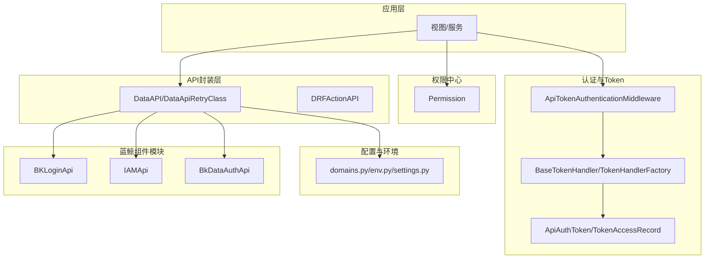
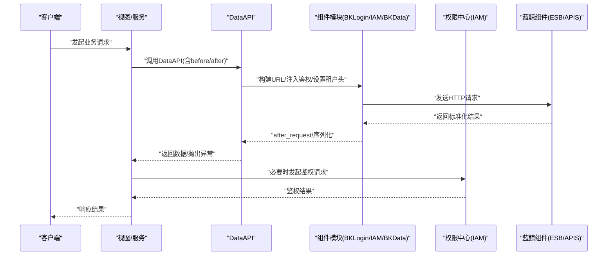
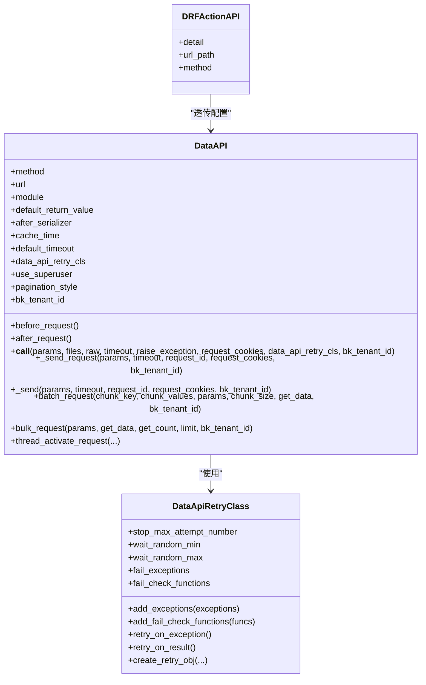
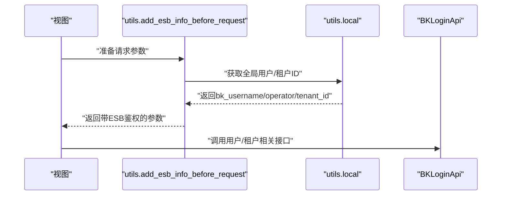
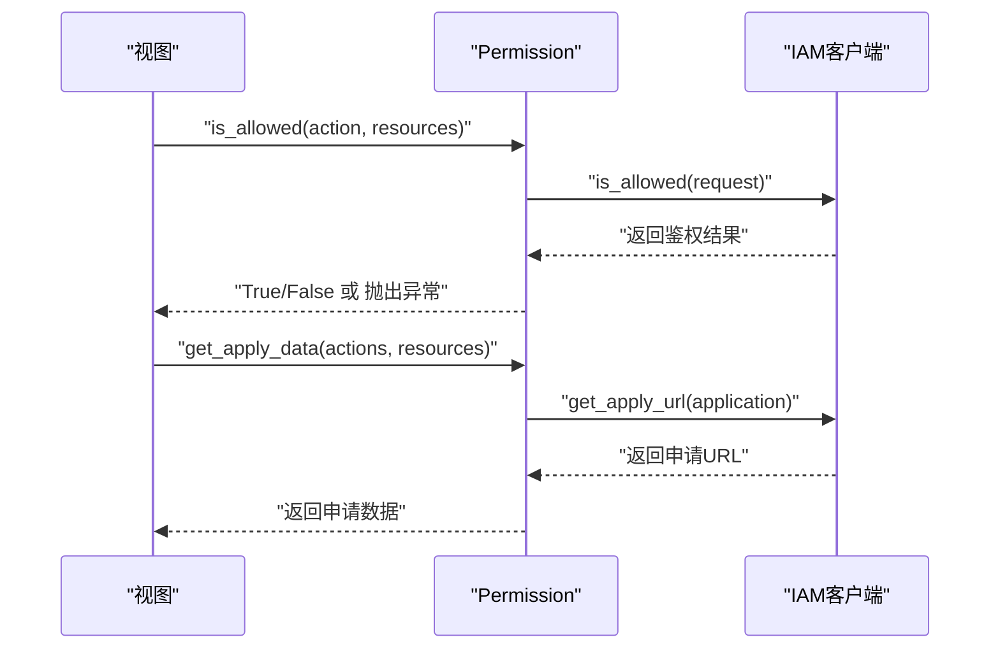
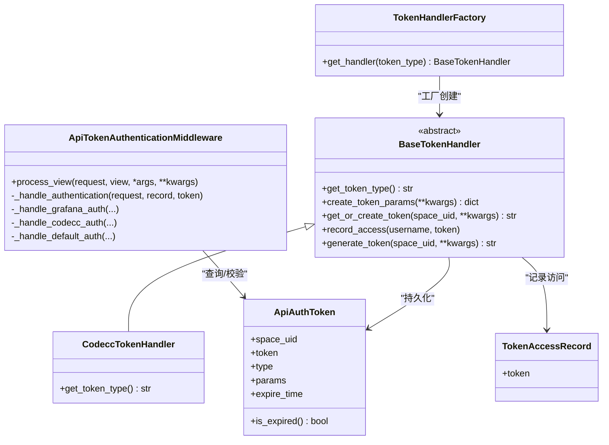
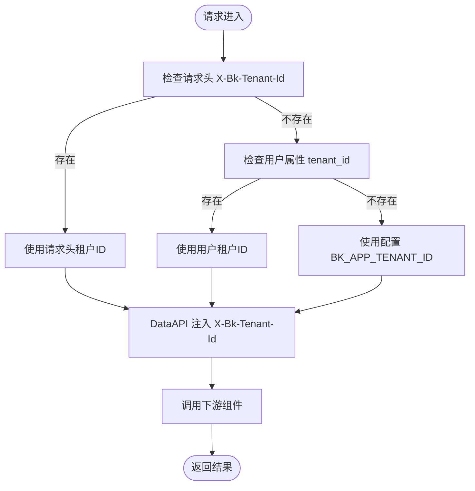
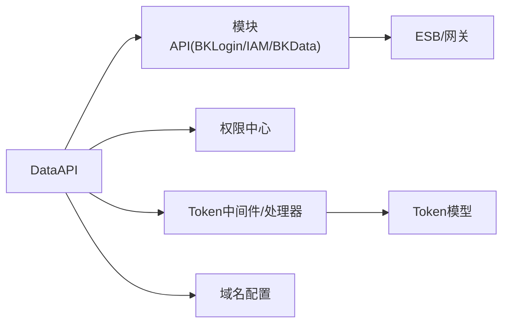

# 蓝鲸生态集成

<cite>
**本文档引用的文件**
- [apps/api/base.py](file://apps/api/base.py)
- [apps/api/modules/bk_login.py](file://apps/api/modules/bk_login.py)
- [apps/api/modules/iam.py](file://apps/api/modules/iam.py)
- [apps/api/modules/bkdata_auth.py](file://apps/api/modules/bkdata_auth.py)
- [apps/api/modules/utils.py](file://apps/api/modules/utils.py)
- [apps/iam/handlers/permission.py](file://apps/iam/handlers/permission.py)
- [apps/log_commons/token.py](file://apps/log_commons/token.py)
- [apps/middleware/api_token_middleware.py](file://apps/middleware/api_token_middleware.py)
- [apps/log_commons/models.py](file://apps/log_commons/models.py)
- [apps/utils/local.py](file://apps/utils/local.py)
- [apps/constants.py](file://apps/constants.py)
- [config/domains.py](file://config/domains.py)
- [config/env.py](file://config/env.py)
- [settings.py](file://settings.py)
- [apps/log_commons/cc.py](file://apps/log_commons/cc.py)
</cite>

## 目录
1. [简介](#简介)
2. [项目结构](#项目结构)
3. [核心组件](#核心组件)
4. [架构总览](#架构总览)
5. [详细组件分析](#详细组件分析)
6. [依赖关系分析](#依赖关系分析)
7. [性能考量](#性能考量)
8. [故障排查指南](#故障排查指南)
9. [结论](#结论)
10. [附录](#附录)

## 简介
本文件面向BK Monitor项目，系统性梳理蓝鲸生态集成方案，涵盖DataAPI封装机制、重试策略与错误处理、组件化API设计理念与使用方式（登录、权限、配置中心等）、多租户架构与租户隔离、认证流程与Token管理、权限校验、开发指南、调试工具与最佳实践，以及二次开发与功能扩展建议。

## 项目结构
围绕蓝鲸生态的关键模块分布如下：
- API封装与蓝鲸组件对接：apps/api/base.py、apps/api/modules/*.py
- 蓝鲸登录与用户体系：apps/api/modules/bk_login.py、apps/api/modules/utils.py、apps/utils/local.py
- 权限中心对接：apps/api/modules/iam.py、apps/iam/handlers/permission.py
- 数据平台鉴权：apps/api/modules/bkdata_auth.py、apps/api/modules/utils.py
- Token与中间件：apps/log_commons/token.py、apps/middleware/api_token_middleware.py
- 常量与权限映射：apps/constants.py
- 配置与域名解析：config/domains.py、config/env.py、settings.py
- 业务维护者与授权：apps/log_commons/cc.py

**图表来源**
- [apps/api/base.py](file://apps/api/base.py)
- [apps/api/modules/bk_login.py](file://apps/api/modules/bk_login.py)
- [apps/api/modules/iam.py](file://apps/api/modules/iam.py)
- [apps/api/modules/bkdata_auth.py](file://apps/api/modules/bkdata_auth.py)
- [apps/iam/handlers/permission.py](file://apps/iam/handlers/permission.py)
- [apps/middleware/api_token_middleware.py](file://apps/middleware/api_token_middleware.py)
- [apps/log_commons/token.py](file://apps/log_commons/token.py)
- [apps/log_commons/models.py](file://apps/log_commons/models.py)
- [config/domains.py](file://config/domains.py)
- [config/env.py](file://config/env.py)
- [settings.py](file://settings.py)

**章节来源**
- [apps/api/base.py](file://apps/api/base.py)
- [apps/api/modules/bk_login.py](file://apps/api/modules/bk_login.py)
- [apps/api/modules/iam.py](file://apps/api/modules/iam.py)
- [apps/api/modules/bkdata_auth.py](file://apps/api/modules/bkdata_auth.py)
- [apps/api/modules/utils.py](file://apps/api/modules/utils.py)
- [apps/iam/handlers/permission.py](file://apps/iam/handlers/permission.py)
- [apps/log_commons/token.py](file://apps/log_commons/token.py)
- [apps/middleware/api_token_middleware.py](file://apps/middleware/api_token_middleware.py)
- [apps/log_commons/models.py](file://apps/log_commons/models.py)
- [apps/utils/local.py](file://apps/utils/local.py)
- [apps/constants.py](file://apps/constants.py)
- [config/domains.py](file://config/domains.py)
- [config/env.py](file://config/env.py)
- [settings.py](file://settings.py)
- [apps/log_commons/cc.py](file://apps/log_commons/cc.py)

## 核心组件
- DataAPI与DataApiRetryClass：统一蓝鲸组件调用入口，内置参数清洗、缓存、序列化、重试、超时、日志与错误处理。
- 组件化API模块：按模块划分的DataAPI集合，如BKLoginApi、IAMApi、BkDataAuthApi，统一注入ESB鉴权信息与租户ID。
- 权限中心封装：Permission类，封装IAM鉴权请求、批量鉴权、表达式计算、系统元信息初始化等。
- 认证与Token：ApiTokenAuthenticationMiddleware与BaseTokenHandler体系，支持多种Token类型与访问记录。
- 多租户与隔离：通过X-Bk-Tenant-Id头、租户ID获取器、业务/空间到租户映射实现跨租户隔离。
- 配置与域名：domains.py集中加载各组件网关域名，env.py按环境加载配置，settings.py按环境导入配置模块。

**章节来源**
- [apps/api/base.py](file://apps/api/base.py)
- [apps/api/modules/bk_login.py](file://apps/api/modules/bk_login.py)
- [apps/api/modules/iam.py](file://apps/api/modules/iam.py)
- [apps/api/modules/bkdata_auth.py](file://apps/api/modules/bkdata_auth.py)
- [apps/iam/handlers/permission.py](file://apps/iam/handlers/permission.py)
- [apps/log_commons/token.py](file://apps/log_commons/token.py)
- [apps/middleware/api_token_middleware.py](file://apps/middleware/api_token_middleware.py)
- [apps/log_commons/models.py](file://apps/log_commons/models.py)
- [apps/api/modules/utils.py](file://apps/api/modules/utils.py)
- [apps/utils/local.py](file://apps/utils/local.py)
- [config/domains.py](file://config/domains.py)
- [config/env.py](file://config/env.py)
- [settings.py](file://settings.py)

## 架构总览
蓝鲸生态集成采用“统一API封装 + 组件化模块 + 权限中心 + 认证与Token + 多租户隔离”的分层设计。DataAPI负责底层HTTP调用与标准化返回，组件模块负责业务域的API声明，权限中心负责鉴权与授权，认证中间件与Token处理器负责身份与访问控制，多租户通过租户ID贯穿请求头与参数。

**图表来源**
- [apps/api/base.py](file://apps/api/base.py)
- [apps/api/modules/bk_login.py](file://apps/api/modules/bk_login.py)
- [apps/api/modules/iam.py](file://apps/api/modules/iam.py)
- [apps/api/modules/bkdata_auth.py](file://apps/api/modules/bkdata_auth.py)
- [apps/iam/handlers/permission.py](file://apps/iam/handlers/permission.py)

## 详细组件分析

### DataAPI封装与重试机制
- 设计理念
  - 单一职责：统一HTTP请求、参数清洗、缓存、序列化、错误处理与日志记录。
  - 可插拔：before_request/after_request/after_serializer钩子，支持模块定制。
  - 多租户：自动注入X-Bk-Tenant-Id，支持动态租户ID函数。
  - 可观测：记录请求/响应、耗时、用户、模块、URL等。
- 关键流程
  - 参数预处理：调用before_request，注入bk_tenant_id，剥离透传头。
  - 缓存命中：命中则直接返回缓存结果。
  - 请求发送：设置X-DATA-REQUEST-ID、语言、Cookie、X-Bkapi-Authorization等。
  - 结果处理：校验HTTP状态码与JSON格式，标准化result字段，after_request与序列化。
  - 错误处理：捕获ReadTimeout、RetryError与通用异常，统一包装为DataAPIException。
  - 日志记录：记录请求详情与结果，区分成功/异常。
- 重试策略
  - DataApiRetryClass支持配置最大尝试次数、等待随机范围、异常类型过滤、结果校验函数。
  - check_result_is_true默认基于result字段判断是否重试。
  - Retrying框架驱动，支持异常重试与结果重试双通道。
- 并发与分页
  - batch_request：按参数切片并发请求，合并结果。
  - bulk_request：按分页策略并发拉取，支持页码/偏移两种风格。
- 错误处理
  - HTTP状态非200：构造标准错误响应并抛出DataAPIException。
  - JSON解析失败：记录异常并提示返回格式不正确。
  - raise_exception：可选抛出ApiResultError，便于上层统一处理。

**图表来源**
- [apps/api/base.py](file://apps/api/base.py)

**章节来源**
- [apps/api/base.py](file://apps/api/base.py)

### 登录与用户体系集成
- 统一登录模块
  - BKLoginApi封装用户查询、租户列表、虚拟用户查找、部门档案查询等。
  - 多租户模式下动态切换租户列表，非多租户模式返回固定内容。
  - before_request统一注入ESB鉴权信息，after_request统一字段映射。
- 用户信息与全局用户
  - get_request_username/get_global_user：优先从请求中获取，其次本地线程变量，最后后台用户。
  - get_request_tenant_id：从请求头、用户属性或配置中获取租户ID。
  - get_admin_username：通过BKLoginApi批量查找虚拟管理员用户。
- 参数注入工具
  - add_esb_info_before_request：Web请求注入auth_info、bk_username/operator、语言等。
  - add_esb_info_before_request_for_bkdata_*：数据平台鉴权场景注入bkdata_authentication_method与token/user。

**图表来源**
- [apps/api/modules/bk_login.py](file://apps/api/modules/bk_login.py)
- [apps/api/modules/utils.py](file://apps/api/modules/utils.py)
- [apps/utils/local.py](file://apps/utils/local.py)

**章节来源**
- [apps/api/modules/bk_login.py](file://apps/api/modules/bk_login.py)
- [apps/api/modules/utils.py](file://apps/api/modules/utils.py)
- [apps/utils/local.py](file://apps/utils/local.py)

### 权限中心集成
- 权限封装
  - Permission类：构造IAM Request/MultiActionRequest，批量鉴权、表达式计算、系统元信息初始化。
  - 支持演示业务豁免、跳过鉴权、生成申请URL与数据。
  - 与业务ID/空间ID/索引集等资源类型解耦，通过Resource枚举与Action映射。
- 鉴权流程
  - is_allowed：单动作鉴权，支持抛出PermissionDeniedError。
  - batch_is_allowed：多资源多动作批量鉴权。
  - filter_space_list_by_action：按动作过滤用户有权限的空间列表。
- 与DataAPI结合
  - 通过CompatibleIAM客户端与BK_IAM_APIGATEWAY_URL对接。
  - 支持skip_check（来自Token中间件或配置）跳过鉴权。

**图表来源**
- [apps/iam/handlers/permission.py](file://apps/iam/handlers/permission.py)

**章节来源**
- [apps/iam/handlers/permission.py](file://apps/iam/handlers/permission.py)

### 数据平台鉴权集成
- BkDataAuthApi
  - 提供用户权限检查、权限范围查询、Token详情与更新、项目数据/资源组申请等接口。
  - 支持多租户：通过biz_to_tenant_getter/space_to_tenant_getter将业务/空间映射为租户ID。
- 鉴权方式
  - 支持token/user两种鉴权方式，自动注入bkdata_authentication_method与bk_username/operator。
  - 非Web请求场景自动注入admin用户或数据token。

**章节来源**
- [apps/api/modules/bkdata_auth.py](file://apps/api/modules/bkdata_auth.py)
- [apps/api/modules/utils.py](file://apps/api/modules/utils.py)

### 认证与Token管理
- 中间件
  - ApiTokenAuthenticationMiddleware：从HTTP头读取X-BkLog-Token与可选X-BkLog-Space-Uid，查询ApiAuthToken并执行不同类型的认证处理。
  - 支持Grafana/CodeCC等类型，分别设置system用户跳过权限或使用token创建者作为用户。
- Token处理器
  - BaseTokenHandler：抽象基类，提供生成/获取Token、记录访问等通用能力。
  - CodeccTokenHandler：具体实现，按类型生成Token。
  - TokenHandlerFactory：按类型获取处理器实例。
- 数据模型
  - ApiAuthToken：存储space_uid、token、type、params、expire_time。
  - TokenAccessRecord：记录访问者与token的访问记录。

**图表来源**
- [apps/middleware/api_token_middleware.py](file://apps/middleware/api_token_middleware.py)
- [apps/log_commons/token.py](file://apps/log_commons/token.py)
- [apps/log_commons/models.py](file://apps/log_commons/models.py)

**章节来源**
- [apps/middleware/api_token_middleware.py](file://apps/middleware/api_token_middleware.py)
- [apps/log_commons/token.py](file://apps/log_commons/token.py)
- [apps/log_commons/models.py](file://apps/log_commons/models.py)

### 多租户架构与租户隔离
- 租户ID来源
  - 请求头X-Bk-Tenant-Id优先，其次用户属性tenant_id，最后配置BK_APP_TENANT_ID。
  - DataAPI自动注入X-Bk-Tenant-Id，确保下游组件识别租户。
- 租户ID映射
  - biz_to_tenant_getter/space_to_tenant_getter：将业务ID/空间UID映射为租户ID。
  - get_admin_username：在多租户模式下通过BKLoginApi批量查找虚拟管理员。
- 隔离策略
  - API层：X-Bk-Tenant-Id贯穿请求。
  - 数据层：迁移脚本增加bk_tenant_id字段，确保数据按租户隔离。
  - 权限层：权限校验与资源绑定到租户维度。

**图表来源**
- [apps/utils/local.py](file://apps/utils/local.py)
- [apps/api/base.py](file://apps/api/base.py)
- [apps/api/modules/utils.py](file://apps/api/modules/utils.py)

**章节来源**
- [apps/utils/local.py](file://apps/utils/local.py)
- [apps/api/base.py](file://apps/api/base.py)
- [apps/api/modules/utils.py](file://apps/api/modules/utils.py)

### 配置中心与域名解析
- domains.py
  - 统一加载蓝鲸平台、数据平台、权限中心、ITSM、CMSI、JOB、BCS、AIOPS、UNIFY QUERY等组件的API网关根域名。
- env.py
  - 加载环境变量与环境配置文件(.env.yml)，支持格式化与FEATURE_TOGGLE合并。
- settings.py
  - 根据BKPAAS_ENVIRONMENT或BK_ENV确定环境，动态导入config.{env}模块。

**章节来源**
- [config/domains.py](file://config/domains.py)
- [config/env.py](file://config/env.py)
- [settings.py](file://settings.py)

## 依赖关系分析
- 组件耦合
  - DataAPI与各模块API强耦合，通过统一的before/after钩子与租户注入实现低耦合高内聚。
  - 权限中心与业务域解耦，通过Action/Resource枚举与Action映射表对接。
  - 认证中间件与Token模型解耦，通过工厂与处理器实现类型扩展。
- 外部依赖
  - 蓝鲸ESB/网关：DataAPI统一接入。
  - 权限中心：IAM客户端与网关。
  - 数据平台：鉴权网关与Token管理。
- 循环依赖
  - 通过延迟导入与模块边界控制，避免循环依赖。

**图表来源**
- [apps/api/base.py](file://apps/api/base.py)
- [apps/api/modules/bk_login.py](file://apps/api/modules/bk_login.py)
- [apps/api/modules/iam.py](file://apps/api/modules/iam.py)
- [apps/api/modules/bkdata_auth.py](file://apps/api/modules/bkdata_auth.py)
- [apps/middleware/api_token_middleware.py](file://apps/middleware/api_token_middleware.py)
- [apps/log_commons/models.py](file://apps/log_commons/models.py)
- [config/domains.py](file://config/domains.py)

**章节来源**
- [apps/api/base.py](file://apps/api/base.py)
- [apps/api/modules/bk_login.py](file://apps/api/modules/bk_login.py)
- [apps/api/modules/iam.py](file://apps/api/modules/iam.py)
- [apps/api/modules/bkdata_auth.py](file://apps/api/modules/bkdata_auth.py)
- [apps/middleware/api_token_middleware.py](file://apps/middleware/api_token_middleware.py)
- [apps/log_commons/models.py](file://apps/log_commons/models.py)
- [config/domains.py](file://config/domains.py)

## 性能考量
- 缓存策略：DataAPI支持cache_time缓存，减少重复请求。
- 并发优化：bulk_request/batch_request通过线程池并发拉取，提升吞吐。
- 超时与重试：合理设置default_timeout与DataApiRetryClass，平衡可靠性与延迟。
- 日志与可观测：统一记录请求/响应、耗时、用户、模块、URL，便于定位性能瓶颈。
- 多租户开销：租户ID映射与注入为O(1)，对整体性能影响有限。

## 故障排查指南
- 常见错误
  - DataAPIException：HTTP状态非200或JSON解析失败，检查URL、鉴权头与返回格式。
  - ApiResultError：result为False，检查模块返回结构与业务逻辑。
  - PermissionDeniedError：权限不足，检查Action/Resource映射与申请URL。
  - Token校验失败：确认X-BkLog-Token与X-BkLog-Space-Uid是否正确，检查过期时间。
- 调试建议
  - 开启DataAPI日志，关注请求ID与模块路径。
  - 使用DRFActionAPI配置输出标准化，便于前后端联调。
  - 在utils.add_esb_info_before_request处打印auth_info与bk_username/operator。
  - 检查domains.py与env.py加载的网关域名与环境变量。

**章节来源**
- [apps/api/base.py](file://apps/api/base.py)
- [apps/iam/handlers/permission.py](file://apps/iam/handlers/permission.py)
- [apps/middleware/api_token_middleware.py](file://apps/middleware/api_token_middleware.py)

## 结论
本项目通过DataAPI统一封装、组件化模块、权限中心对接、认证与Token管理、多租户隔离与配置中心，实现了与蓝鲸生态的深度集成。遵循本文档的架构与最佳实践，可在保证安全与可维护性的前提下快速扩展与迭代。

## 附录
- 开发指南
  - 新增组件API：参考BKLoginApi/IAMApi/BkDataAuthApi的DataAPI声明方式，统一注入ESB鉴权与租户ID。
  - 自定义重试策略：使用DataApiRetryClass配置异常与结果重试函数。
  - 权限校验：通过Permission类进行单动作或多动作鉴权，必要时生成申请URL。
  - Token扩展：继承BaseTokenHandler实现新类型，注册到TokenHandlerFactory。
- 调试工具
  - DataAPI日志：关注请求ID与模块路径，定位问题。
  - 网关域名：核对domains.py与env.py加载的网关根域名。
  - 环境变量：核对BKPAAS_ENVIRONMENT/BK_ENV与.env.yml配置。
- 最佳实践
  - 优先使用DataAPI而非直接requests，确保统一鉴权、缓存与可观测。
  - 明确Action/Resource映射，避免权限配置遗漏。
  - 多租户场景下务必注入X-Bk-Tenant-Id，避免跨租户数据泄露。
  - 对外接口使用Token中间件，内部接口可通过配置跳过鉴权。