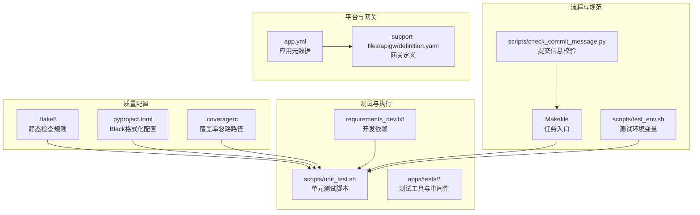
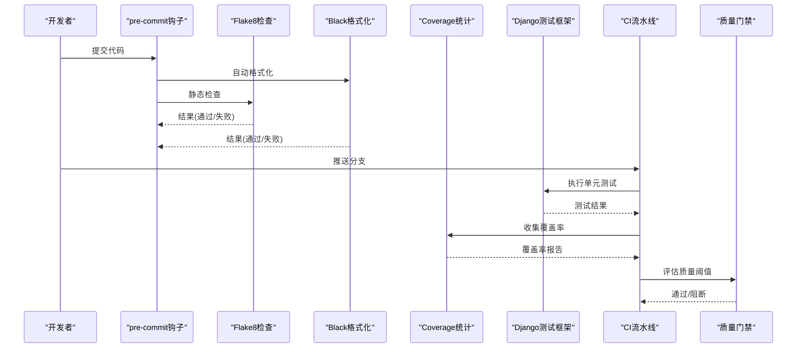
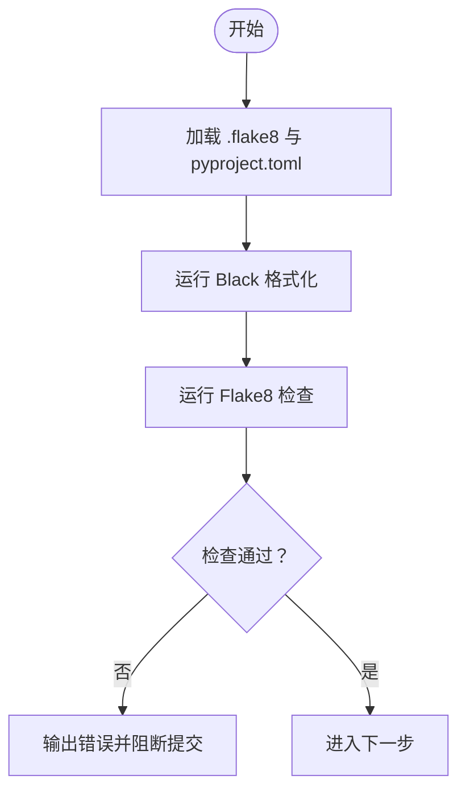
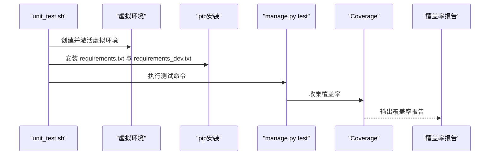
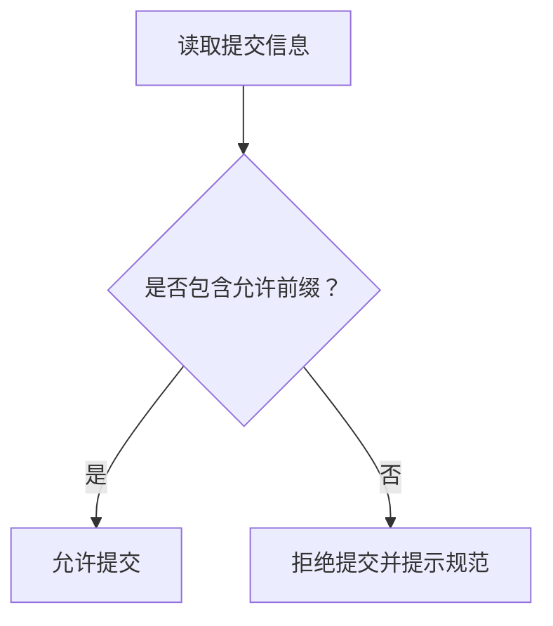
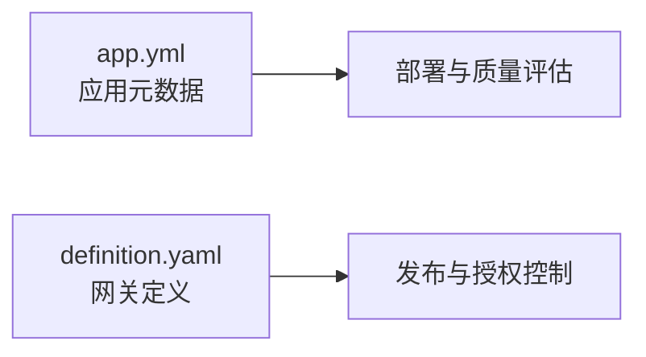
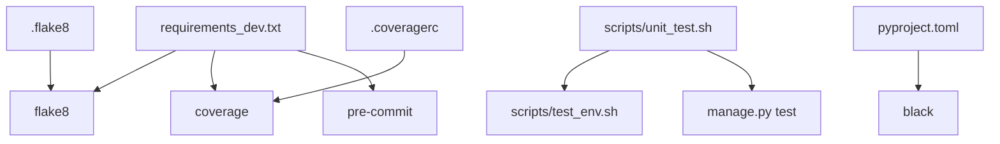

# 代码质量保证

<cite>
**本文引用的文件**
- [.flake8](file://.flake8)
- [.coveragerc](file://.coveragerc)
- [pyproject.toml](file://pyproject.toml)
- [requirements_dev.txt](file://requirements_dev.txt)
- [scripts/unit_test.sh](file://scripts/unit_test.sh)
- [scripts/check_commit_message.py](file://scripts/check_commit_message.py)
- [Makefile](file://Makefile)
- [scripts/test_env.sh](file://scripts/test_env.sh)
- [apps/tests/utils.py](file://apps/tests/utils.py)
- [apps/tests/middlewares.py](file://apps/tests/middlewares.py)
- [apps/log_clustering/tests.py](file://apps/log_clustering/tests.py)
- [support-files/apigw/definition.yaml](file://support-files/apigw/definition.yaml)
- [app.yml](file://app.yml)
</cite>

## 目录
1. [简介](#简介)
2. [项目结构](#项目结构)
3. [核心组件](#核心组件)
4. [架构总览](#架构总览)
5. [详细组件分析](#详细组件分析)
6. [依赖分析](#依赖分析)
7. [性能考虑](#性能考虑)
8. [故障排查指南](#故障排查指南)
9. [结论](#结论)
10. [附录](#附录)

## 简介
本文件系统化梳理本项目的代码质量保证机制，覆盖代码审查流程、静态代码分析、自动化测试、代码规范与执行、覆盖率监控与提升策略、持续集成中的质量门禁设置，以及工具使用指南（Flake8、Coverage 等）。文档旨在帮助开发者在日常开发中高效落地质量标准，并为团队协作与持续交付提供统一的规范与流程参考。

## 项目结构
围绕代码质量的关键文件与脚本分布如下：
- 静态检查与格式化配置：.flake8、pyproject.toml
- 测试与覆盖率：requirements_dev.txt、scripts/unit_test.sh、.coveragerc、apps/tests/*
- 提交规范与质量门禁：scripts/check_commit_message.py
- 构建与任务编排：Makefile、scripts/test_env.sh
- 平台与网关配置：support-files/apigw/definition.yaml、app.yml

图表来源
- [.flake8:1-31](file://.flake8#L1-L31)
- [pyproject.toml:1-16](file://pyproject.toml#L1-L16)
- [.coveragerc:1-3](file://.coveragerc#L1-L3)
- [requirements_dev.txt:1-13](file://requirements_dev.txt#L1-L13)
- [scripts/unit_test.sh:1-19](file://scripts/unit_test.sh#L1-L19)
- [apps/tests/utils.py:1-95](file://apps/tests/utils.py#L1-L95)
- [apps/tests/middlewares.py:1-45](file://apps/tests/middlewares.py#L1-L45)
- [Makefile:1-19](file://Makefile#L1-L19)
- [scripts/test_env.sh:1-5](file://scripts/test_env.sh#L1-L5)
- [scripts/check_commit_message.py:1-56](file://scripts/check_commit_message.py#L1-L56)
- [app.yml:1-19](file://app.yml#L1-L19)
- [support-files/apigw/definition.yaml:1-138](file://support-files/apigw/definition.yaml#L1-L138)

章节来源
- [.flake8:1-31](file://.flake8#L1-L31)
- [pyproject.toml:1-16](file://pyproject.toml#L1-L16)
- [.coveragerc:1-3](file://.coveragerc#L1-L3)
- [requirements_dev.txt:1-13](file://requirements_dev.txt#L1-L13)
- [scripts/unit_test.sh:1-19](file://scripts/unit_test.sh#L1-L19)
- [Makefile:1-19](file://Makefile#L1-L19)
- [scripts/test_env.sh:1-5](file://scripts/test_env.sh#L1-L5)
- [scripts/check_commit_message.py:1-56](file://scripts/check_commit_message.py#L1-L56)
- [apps/tests/utils.py:1-95](file://apps/tests/utils.py#L1-L95)
- [apps/tests/middlewares.py:1-45](file://apps/tests/middlewares.py#L1-L45)
- [support-files/apigw/definition.yaml:1-138](file://support-files/apigw/definition.yaml#L1-L138)
- [app.yml:1-19](file://app.yml#L1-L19)

## 核心组件
- 静态代码分析与格式化
  - 使用 Flake8 进行 Python 风格与复杂度检查，配置忽略项与最大行长度、复杂度阈值。
  - 使用 Black 作为代码格式化工具，统一缩进与行宽。
- 自动化测试与覆盖率
  - 通过 requirements_dev.txt 引入 coverage、flake8、pre-commit 等工具。
  - 单元测试脚本 scripts/unit_test.sh 完成虚拟环境准备、依赖安装与测试执行。
  - .coveragerc 控制覆盖率统计忽略路径。
- 提交规范与质量门禁
  - scripts/check_commit_message.py 校验提交信息前缀，确保变更可追溯与可读性。
- 平台与网关配置
  - app.yml 描述应用元数据，support-files/apigw/definition.yaml 定义网关发布与授权策略，支撑 API 质量与安全。

章节来源
- [.flake8:1-31](file://.flake8#L1-L31)
- [pyproject.toml:1-16](file://pyproject.toml#L1-L16)
- [requirements_dev.txt:1-13](file://requirements_dev.txt#L1-L13)
- [scripts/unit_test.sh:1-19](file://scripts/unit_test.sh#L1-L19)
- [.coveragerc:1-3](file://.coveragerc#L1-L3)
- [scripts/check_commit_message.py:1-56](file://scripts/check_commit_message.py#L1-L56)
- [app.yml:1-19](file://app.yml#L1-L19)
- [support-files/apigw/definition.yaml:1-138](file://support-files/apigw/definition.yaml#L1-L138)

## 架构总览
整体质量保证体系由“规范制定—工具执行—测试验证—门禁控制—结果反馈”构成的闭环：

图表来源
- [requirements_dev.txt:1-13](file://requirements_dev.txt#L1-L13)
- [scripts/unit_test.sh:1-19](file://scripts/unit_test.sh#L1-L19)
- [.coveragerc:1-3](file://.coveragerc#L1-L3)
- [scripts/check_commit_message.py:1-56](file://scripts/check_commit_message.py#L1-L56)

## 详细组件分析

### 静态代码分析与格式化
- 规则与忽略项
  - 忽略特定警告（如二元运算符换行、切片空格），设定最大行长度与复杂度阈值，排除迁移脚本与第三方目录。
- 格式化策略
  - Black 统一行宽与缩进，排除构建产物与虚拟环境目录，保持仓库整洁。
- 工具链
  - requirements_dev.txt 引入 flake8、coverage、pre-commit 等，形成本地与 CI 的统一检查基线。

图表来源
- [.flake8:1-31](file://.flake8#L1-L31)
- [pyproject.toml:1-16](file://pyproject.toml#L1-L16)
- [requirements_dev.txt:1-13](file://requirements_dev.txt#L1-L13)

章节来源
- [.flake8:1-31](file://.flake8#L1-L31)
- [pyproject.toml:1-16](file://pyproject.toml#L1-L16)
- [requirements_dev.txt:1-13](file://requirements_dev.txt#L1-L13)

### 自动化测试与覆盖率
- 测试执行
  - scripts/unit_test.sh 创建临时测试环境，安装依赖，执行 manage.py test 命令，保留数据库以便复用。
- 测试工具
  - apps/tests/utils.py 提供 Redis Mock 与动态 patch 能力，apps/tests/middlewares.py 提供测试中间件，简化测试上下文。
- 覆盖率统计
  - .coveragerc 配置忽略 blueapps/*，避免第三方库影响覆盖率指标。
- 测试覆盖率报告
  - 在 CI 中收集覆盖率数据并生成报告，结合阈值进行质量门禁控制。

图表来源
- [scripts/unit_test.sh:1-19](file://scripts/unit_test.sh#L1-L19)
- [.coveragerc:1-3](file://.coveragerc#L1-L3)
- [apps/tests/utils.py:1-95](file://apps/tests/utils.py#L1-L95)
- [apps/tests/middlewares.py:1-45](file://apps/tests/middlewares.py#L1-L45)

章节来源
- [scripts/unit_test.sh:1-19](file://scripts/unit_test.sh#L1-L19)
- [.coveragerc:1-3](file://.coveragerc#L1-L3)
- [apps/tests/utils.py:1-95](file://apps/tests/utils.py#L1-L95)
- [apps/tests/middlewares.py:1-45](file://apps/tests/middlewares.py#L1-L45)

### 提交规范与质量门禁
- 提交信息前缀校验
  - scripts/check_commit_message.py 限定允许的前缀集合，确保每次提交具备明确语义。
- 质量门禁
  - Makefile 将提交校验纳入构建流程，结合 CI 的静态检查、测试与覆盖率阈值共同决定是否允许合并。

图表来源
- [scripts/check_commit_message.py:1-56](file://scripts/check_commit_message.py#L1-L56)
- [Makefile:1-19](file://Makefile#L1-L19)

章节来源
- [scripts/check_commit_message.py:1-56](file://scripts/check_commit_message.py#L1-L56)
- [Makefile:1-19](file://Makefile#L1-L19)

### 平台与网关配置对质量的影响
- 应用元数据
  - app.yml 提供应用名称、版本、容器内存等信息，便于 CI/CD 与部署质量评估。
- 网关定义
  - support-files/apigw/definition.yaml 定义网关发布版本、环境、授权与资源文档路径，确保 API 变更受控且可审计。

图表来源
- [app.yml:1-19](file://app.yml#L1-L19)
- [support-files/apigw/definition.yaml:1-138](file://support-files/apigw/definition.yaml#L1-L138)

章节来源
- [app.yml:1-19](file://app.yml#L1-L19)
- [support-files/apigw/definition.yaml:1-138](file://support-files/apigw/definition.yaml#L1-L138)

## 依赖分析
- 工具依赖关系
  - requirements_dev.txt 明确开发期依赖：flake8、coverage、pre-commit 等，确保本地与 CI 一致性。
- 脚本与工具耦合
  - scripts/unit_test.sh 依赖 scripts/test_env.sh 提供的环境变量，统一测试执行上下文。
- 配置文件耦合
  - .flake8 与 pyproject.toml 分别约束静态检查与格式化，.coveragerc 控制覆盖率统计范围。

图表来源
- [requirements_dev.txt:1-13](file://requirements_dev.txt#L1-L13)
- [scripts/unit_test.sh:1-19](file://scripts/unit_test.sh#L1-L19)
- [scripts/test_env.sh:1-5](file://scripts/test_env.sh#L1-L5)
- [.flake8:1-31](file://.flake8#L1-L31)
- [pyproject.toml:1-16](file://pyproject.toml#L1-L16)
- [.coveragerc:1-3](file://.coveragerc#L1-L3)

章节来源
- [requirements_dev.txt:1-13](file://requirements_dev.txt#L1-L13)
- [scripts/unit_test.sh:1-19](file://scripts/unit_test.sh#L1-L19)
- [scripts/test_env.sh:1-5](file://scripts/test_env.sh#L1-L5)
- [.flake8:1-31](file://.flake8#L1-L31)
- [pyproject.toml:1-16](file://pyproject.toml#L1-L16)
- [.coveragerc:1-3](file://.coveragerc#L1-L3)

## 性能考虑
- 静态检查与格式化
  - 合理设置 max-line-length 与 max-complexity，避免过度放宽导致代码可读性下降。
  - 使用 Black 与 Flake8 的缓存与增量检查能力，缩短 CI 时间。
- 测试执行
  - 利用 --keepdb 与虚拟环境隔离，减少重复初始化成本。
  - 将耗时测试拆分为独立任务，配合并发执行提升吞吐。
- 覆盖率统计
  - 通过 .coveragerc 精准排除第三方库，聚焦业务代码覆盖率，提高报告有效性。

## 故障排查指南
- 提交被拒绝
  - 检查提交信息是否包含允许前缀；参考 scripts/check_commit_message.py 的前缀清单。
- 本地通过但 CI 失败
  - 对齐 Python 版本与依赖版本，确认 requirements.txt 与 requirements_dev.txt 的安装顺序。
  - 核对 scripts/test_env.sh 的环境变量是否与 CI 一致。
- 覆盖率异常
  - 检查 .coveragerc 的忽略路径是否过宽；确认测试用例是否覆盖目标模块。
- 静态检查失败
  - 查看 .flake8 的忽略项与阈值；确认 Black 格式化是否与 Flake8 冲突。

章节来源
- [scripts/check_commit_message.py:1-56](file://scripts/check_commit_message.py#L1-L56)
- [scripts/unit_test.sh:1-19](file://scripts/unit_test.sh#L1-L19)
- [scripts/test_env.sh:1-5](file://scripts/test_env.sh#L1-L5)
- [.coveragerc:1-3](file://.coveragerc#L1-L3)
- [.flake8:1-31](file://.flake8#L1-L31)

## 结论
本项目通过统一的静态检查与格式化配置、完善的测试与覆盖率体系、严格的提交规范与质量门禁，形成了可落地、可扩展的代码质量保证机制。建议在后续迭代中持续优化阈值与报告维度，强化测试用例与覆盖率的联动，进一步提升交付质量与可维护性。

## 附录
- 代码规范与执行要点
  - PEP8 规范：遵循命名、缩进、空行等基础约定。
  - Django 编码规范：模型、视图、序列化器与管理命令的组织与命名。
  - 项目特定风格：依据 .flake8 与 pyproject.toml 的约束统一风格。
- 覆盖率监控与提升策略
  - 设定最小覆盖率阈值；定期分析未覆盖路径并补充用例。
  - 使用 .coveragerc 精准定位业务模块，避免第三方库干扰。
- 持续集成中的质量门禁
  - 静态检查、测试执行与覆盖率三者缺一不可；提交信息前缀校验作为前置门禁。
- 工具使用指南
  - Flake8：安装与运行，结合 .flake8 配置。
  - Coverage：安装与运行，结合 .coveragerc 生成报告。
  - pre-commit：安装钩子，自动在提交前执行格式化与检查。