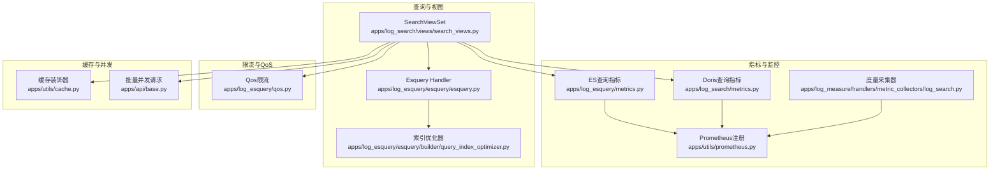
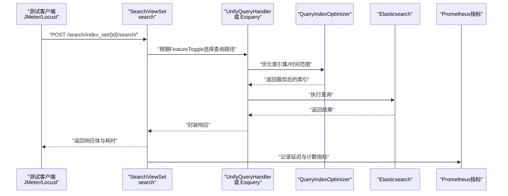
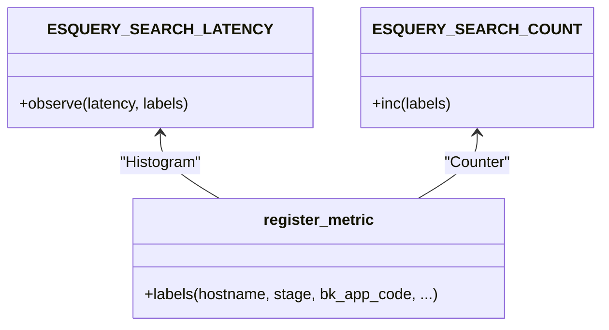
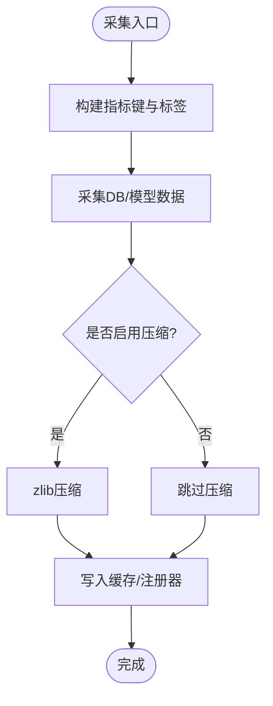
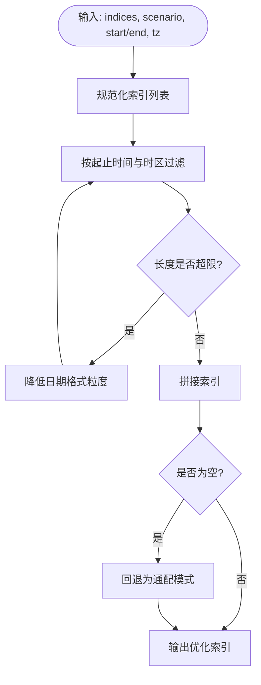
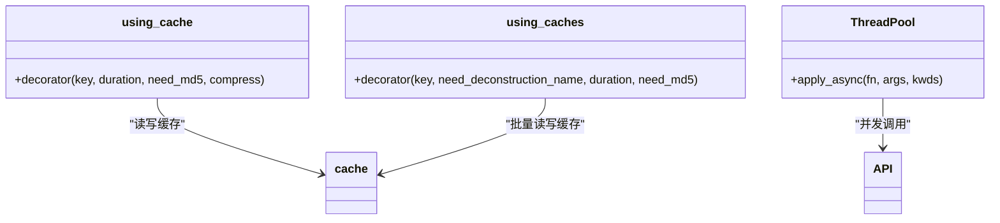
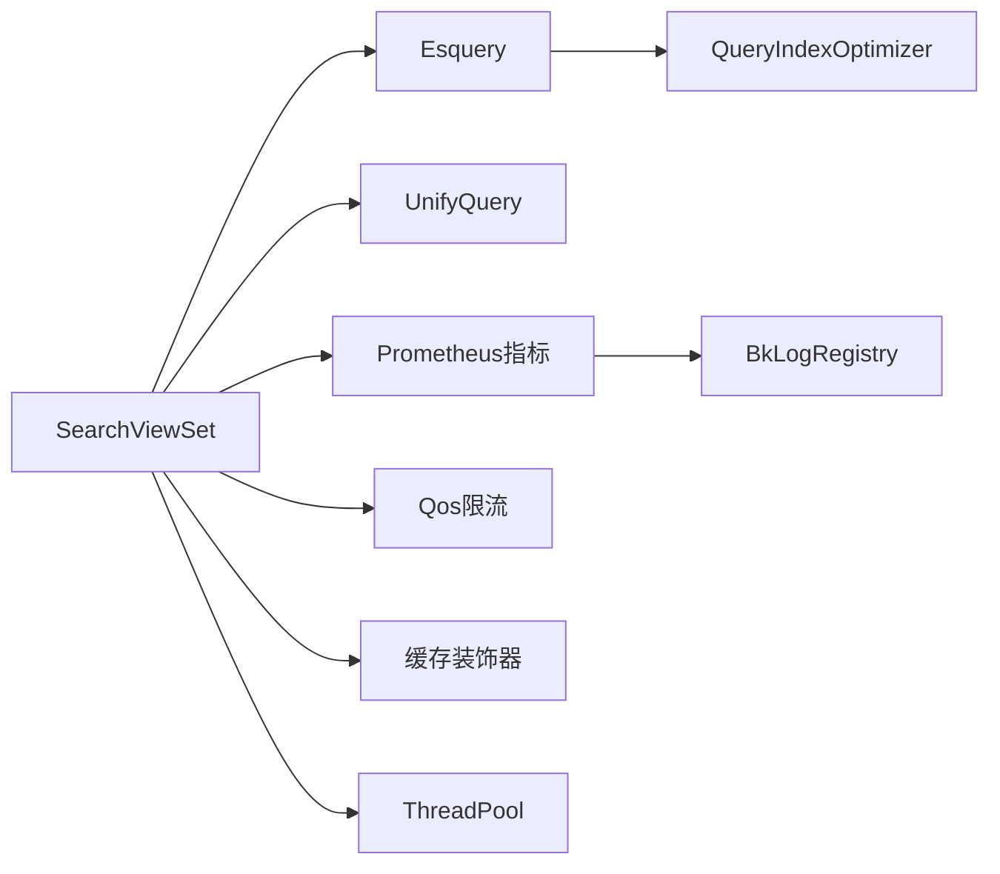

# 性能测试

<cite>
**本文档引用的文件**   
- [apps/log_esquery/metrics.py](file://apps/log_esquery/metrics.py)
- [apps/log_search/metrics.py](file://apps/log_search/metrics.py)
- [apps/utils/prometheus.py](file://apps/utils/prometheus.py)
- [apps/log_measure/handlers/metric_collectors/log_search.py](file://apps/log_measure/handlers/metric_collectors/log_search.py)
- [apps/log_esquery/qos.py](file://apps/log_esquery/qos.py)
- [apps/log_esquery/esquery/builder/query_index_optimizer.py](file://apps/log_esquery/esquery/builder/query_index_optimizer.py)
- [apps/log_esquery/esquery/esquery.py](file://apps/log_esquery/esquery/esquery.py)
- [apps/log_search/views/search_views.py](file://apps/log_search/views/search_views.py)
- [apps/utils/cache.py](file://apps/utils/cache.py)
- [apps/api/base.py](file://apps/api/base.py)
- [apps/log_databus/handlers/check_collector/checker/transfer_checker.py](file://apps/log_databus/handlers/check_collector/checker/transfer_checker.py)
- [apps/log_measure/handlers/metric_collectors/log_search.py](file://apps/log_measure/handlers/metric_collectors/log_search.py)
</cite>

## 目录
1. [简介](#简介)
2. [项目结构](#项目结构)
3. [核心组件](#核心组件)
4. [架构总览](#架构总览)
5. [详细组件分析](#详细组件分析)
6. [依赖分析](#依赖分析)
7. [性能考量](#性能考量)
8. [故障排查指南](#故障排查指南)
9. [结论](#结论)
10. [附录](#附录)

## 简介
本技术文档面向性能测试工程师与研发人员，围绕日志检索与查询能力，系统性阐述压力测试、负载测试与性能基准测试的设计与执行要点；详解ES查询性能、API响应时间、系统资源使用等关键指标的采集与分析；给出JMeter/Locust等工具的配置与脚本编写建议；总结性能瓶颈识别与优化策略（数据库查询、缓存、并发处理）；并提供性能测试报告分析方法与最佳实践。

## 项目结构
本项目以Django为核心，日志检索与查询能力主要分布在以下模块：
- 查询与指标：log_esquery（ES查询）、log_search（统一查询与视图）、log_search/metrics（Doris查询指标）
- 指标采集与导出：utils/prometheus（Prometheus注册与采集）、log_measure（度量采集器）
- 限流与QoS：log_esquery/qos（Redis窗口计数与限流）
- 索引优化：log_esquery/esquery/builder/query_index_optimizer（按时间与场景裁剪索引）
- 缓存与并发：utils/cache（缓存装饰器）、api/base（批量并发请求）

**图表来源**
- [apps/log_search/views/search_views.py:280-378](file://apps/log_search/views/search_views.py#L280-L378)
- [apps/log_esquery/esquery/esquery.py:96-130](file://apps/log_esquery/esquery/esquery.py#L96-L130)
- [apps/log_esquery/esquery/builder/query_index_optimizer.py:33-74](file://apps/log_esquery/esquery/builder/query_index_optimizer.py#L33-L74)
- [apps/log_esquery/metrics.py:7-21](file://apps/log_esquery/metrics.py#L7-L21)
- [apps/log_search/metrics.py:7-21](file://apps/log_search/metrics.py#L7-L21)
- [apps/utils/prometheus.py:16-67](file://apps/utils/prometheus.py#L16-L67)
- [apps/log_measure/handlers/metric_collectors/log_search.py:46-117](file://apps/log_measure/handlers/metric_collectors/log_search.py#L46-L117)
- [apps/log_esquery/qos.py:118-144](file://apps/log_esquery/qos.py#L118-L144)
- [apps/utils/cache.py:36-81](file://apps/utils/cache.py#L36-L81)
- [apps/api/base.py:649-674](file://apps/api/base.py#L649-L674)

**章节来源**
- [apps/log_search/views/search_views.py:280-378](file://apps/log_search/views/search_views.py#L280-L378)
- [apps/log_esquery/esquery/esquery.py:96-130](file://apps/log_esquery/esquery/esquery.py#L96-L130)
- [apps/log_esquery/metrics.py:7-21](file://apps/log_esquery/metrics.py#L7-L21)
- [apps/log_search/metrics.py:7-21](file://apps/log_search/metrics.py#L7-L21)
- [apps/utils/prometheus.py:16-67](file://apps/utils/prometheus.py#L16-L67)
- [apps/log_measure/handlers/metric_collectors/log_search.py:46-117](file://apps/log_measure/handlers/metric_collectors/log_search.py#L46-L117)
- [apps/log_esquery/qos.py:118-144](file://apps/log_esquery/qos.py#L118-L144)
- [apps/utils/cache.py:36-81](file://apps/utils/cache.py#L36-L81)
- [apps/api/base.py:649-674](file://apps/api/base.py#L649-L674)

## 核心组件
- ES查询与指标
  - ES查询延迟与计数指标：ESQUERY_SEARCH_LATENCY、ESQUERY_SEARCH_COUNT
  - 统一查询入口：SearchViewSet.search路由根据开关选择UnifyQuery或Esquery
  - 索引优化：QueryIndexOptimizer按场景与时区裁剪索引集，减少扫描范围
- Doris查询指标
  - Doris查询延迟与计数指标：DORIS_QUERY_LATENCY、DORIS_QUERY_COUNT
- 指标采集与导出
  - Prometheus注册器BkLogRegistry与register_metric增强，自动注入主机/阶段/应用标签
  - 度量采集器LogSearchMetricCollector产出搜索、收藏、导出、索引集等指标
- 限流与QoS
  - Redis窗口计数+缓存限流键，防止瞬时高峰冲击
- 缓存与并发
  - using_cache/using_caches装饰器实现结果缓存与压缩
  - ThreadPool批量并发请求，提升大分页/批量场景吞吐

**章节来源**
- [apps/log_esquery/metrics.py:7-21](file://apps/log_esquery/metrics.py#L7-L21)
- [apps/log_search/metrics.py:7-21](file://apps/log_search/metrics.py#L7-L21)
- [apps/utils/prometheus.py:45-67](file://apps/utils/prometheus.py#L45-L67)
- [apps/log_measure/handlers/metric_collectors/log_search.py:46-117](file://apps/log_measure/handlers/metric_collectors/log_search.py#L46-L117)
- [apps/log_esquery/qos.py:118-144](file://apps/log_esquery/qos.py#L118-L144)
- [apps/utils/cache.py:36-81](file://apps/utils/cache.py#L36-L81)
- [apps/api/base.py:649-674](file://apps/api/base.py#L649-L674)

## 架构总览

**图表来源**
- [apps/log_search/views/search_views.py:280-378](file://apps/log_search/views/search_views.py#L280-L378)
- [apps/log_esquery/esquery/esquery.py:96-130](file://apps/log_esquery/esquery/esquery.py#L96-L130)
- [apps/log_esquery/esquery/builder/query_index_optimizer.py:33-74](file://apps/log_esquery/esquery/builder/query_index_optimizer.py#L33-L74)
- [apps/log_esquery/metrics.py:7-21](file://apps/log_esquery/metrics.py#L7-L21)

## 详细组件分析

### ES查询与指标
- 指标定义
  - ESQUERY_SEARCH_LATENCY：Histogram，按索引集、场景、集群、状态、来源应用等标签统计查询延迟
  - ESQUERY_SEARCH_COUNT：Counter，累计查询次数
- 注册与标签
  - register_metric增强：自动注入hostname、stage、bk_app_code等标签，便于跨实例聚合
- 使用建议
  - 在查询前后分别记录延迟与计数，结合状态标签（如错误/成功）定位异常
  - 通过标签聚合定位热点索引集与场景，指导索引优化与容量规划

**图表来源**
- [apps/log_esquery/metrics.py:7-21](file://apps/log_esquery/metrics.py#L7-L21)
- [apps/utils/prometheus.py:45-67](file://apps/utils/prometheus.py#L45-L67)

**章节来源**
- [apps/log_esquery/metrics.py:7-21](file://apps/log_esquery/metrics.py#L7-L21)
- [apps/utils/prometheus.py:45-67](file://apps/utils/prometheus.py#L45-L67)

### Doris查询指标
- 指标定义
  - DORIS_QUERY_LATENCY：Histogram，按索引集、结果表、状态、来源应用统计查询延迟
  - DORIS_QUERY_COUNT：Counter，累计查询次数
- 使用建议
  - 与ES指标并行采集，对比不同存储介质的查询性能
  - 通过标签聚合定位慢查询与高负载时段

**章节来源**
- [apps/log_search/metrics.py:7-21](file://apps/log_search/metrics.py#L7-L21)

### 指标采集与导出
- Prometheus注册器
  - BkLogRegistry：多实例上报时清空指标避免重复累加，交由上层聚合
  - register_metric：自动注入hostname、stage、bk_app_code等标签
- 度量采集器
  - LogSearchMetricCollector：产出搜索次数、收藏次数、导出次数、索引集统计等指标
  - 采用register_metric装饰器，按分钟级窗口上报

**图表来源**
- [apps/log_measure/handlers/metric_collectors/log_search.py:46-117](file://apps/log_measure/handlers/metric_collectors/log_search.py#L46-L117)
- [apps/utils/prometheus.py:16-67](file://apps/utils/prometheus.py#L16-L67)

**章节来源**
- [apps/log_measure/handlers/metric_collectors/log_search.py:46-117](file://apps/log_measure/handlers/metric_collectors/log_search.py#L46-L117)
- [apps/utils/prometheus.py:16-67](file://apps/utils/prometheus.py#L16-L67)

### 限流与QoS
- 窗口计数
  - Redis zset记录每分钟请求时间戳，窗口内计数超过阈值触发限流
- 限流键
  - 缓存设置限流键，限流期间拒绝请求并提示等待时间
- 键生成
  - 基于路径、索引集ID、场景ID、索引串（超长时MD5）生成稳定键
- 恢复
  - 无异常且计数归零时清理zset，允许恢复

```mermaid
flowchart TD
Req(["请求进入"]) --> CheckRedis{"是否启用Redis?"}
CheckRedis --> |否| Allow["直接放行"]
CheckRedis --> |是| BuildKey["生成Qos键"]
BuildKey --> AddZset["zadd时间戳到zset"]
AddZset --> WindowCount["统计窗口内请求数"]
WindowCount --> OverLimit{"超过阈值?"}
OverLimit --> |是| SetLimit["设置限流键并拒绝"]
OverLimit --> |否| Allow
SetLimit --> Wait["返回等待时间"]
Allow --> End(["结束"])
Wait --> End
```

**图表来源**
- [apps/log_esquery/qos.py:66-144](file://apps/log_esquery/qos.py#L66-L144)

**章节来源**
- [apps/log_esquery/qos.py:66-144](file://apps/log_esquery/qos.py#L66-L144)

### 索引优化
- 场景与时区
  - LOG场景使用GMT时区，BKDATA场景使用服务器时区，按天/月粒度裁剪索引
- 索引长度控制
  - 通过日期格式推导与长度阈值，避免索引列表过长
- 回退策略
  - 若裁剪后为空，回退为通配模式

**图表来源**
- [apps/log_esquery/esquery/builder/query_index_optimizer.py:33-74](file://apps/log_esquery/esquery/builder/query_index_optimizer.py#L33-L74)
- [apps/log_esquery/esquery/builder/query_index_optimizer.py:76-137](file://apps/log_esquery/esquery/builder/query_index_optimizer.py#L76-L137)

**章节来源**
- [apps/log_esquery/esquery/builder/query_index_optimizer.py:33-74](file://apps/log_esquery/esquery/builder/query_index_optimizer.py#L33-L74)
- [apps/log_esquery/esquery/builder/query_index_optimizer.py:76-137](file://apps/log_esquery/esquery/builder/query_index_optimizer.py#L76-L137)

### 缓存与并发
- 缓存装饰器
  - using_cache：单键缓存，支持MD5与zlib压缩
  - using_caches：批量键缓存，先命中再回源，最后合并写回
- 并发请求
  - ThreadPool批量请求，支持分片并发与线程池复用

**图表来源**
- [apps/utils/cache.py:36-81](file://apps/utils/cache.py#L36-L81)
- [apps/utils/cache.py:84-136](file://apps/utils/cache.py#L84-L136)
- [apps/api/base.py:649-674](file://apps/api/base.py#L649-L674)

**章节来源**
- [apps/utils/cache.py:36-81](file://apps/utils/cache.py#L36-L81)
- [apps/utils/cache.py:84-136](file://apps/utils/cache.py#L84-L136)
- [apps/api/base.py:649-674](file://apps/api/base.py#L649-L674)

## 依赖分析
- 组件耦合
  - SearchViewSet对Esquery/UnifyQuery存在运行时选择依赖，受FeatureToggle影响
  - 指标模块通过register_metric与Prometheus注册器解耦
  - Qos依赖Redis与缓存，作为查询侧的保护机制
- 外部依赖
  - Elasticsearch（ES）、Doris（Doris）、Redis（限流与缓存）、MySQL（度量采集器聚合）

**图表来源**
- [apps/log_search/views/search_views.py:280-378](file://apps/log_search/views/search_views.py#L280-L378)
- [apps/log_esquery/esquery/esquery.py:96-130](file://apps/log_esquery/esquery/esquery.py#L96-L130)
- [apps/log_esquery/esquery/builder/query_index_optimizer.py:33-74](file://apps/log_esquery/esquery/builder/query_index_optimizer.py#L33-L74)
- [apps/log_esquery/metrics.py:7-21](file://apps/log_esquery/metrics.py#L7-L21)
- [apps/utils/prometheus.py:16-67](file://apps/utils/prometheus.py#L16-L67)
- [apps/log_esquery/qos.py:118-144](file://apps/log_esquery/qos.py#L118-L144)
- [apps/utils/cache.py:36-81](file://apps/utils/cache.py#L36-L81)
- [apps/api/base.py:649-674](file://apps/api/base.py#L649-L674)

**章节来源**
- [apps/log_search/views/search_views.py:280-378](file://apps/log_search/views/search_views.py#L280-L378)
- [apps/log_esquery/esquery/esquery.py:96-130](file://apps/log_esquery/esquery/esquery.py#L96-L130)
- [apps/log_esquery/metrics.py:7-21](file://apps/log_esquery/metrics.py#L7-L21)
- [apps/utils/prometheus.py:16-67](file://apps/utils/prometheus.py#L16-L67)
- [apps/log_esquery/qos.py:118-144](file://apps/log_esquery/qos.py#L118-L144)
- [apps/utils/cache.py:36-81](file://apps/utils/cache.py#L36-L81)
- [apps/api/base.py:649-674](file://apps/api/base.py#L649-L674)

## 性能考量
- 查询路径选择
  - FeatureToggle控制UnifyQuery与Esquery路径，需在压测中对比两种路径的延迟与吞吐差异
- 索引优化
  - 合理的时间范围与场景时区设置可显著减少ES扫描范围
- 指标采集
  - 使用Histogram统计延迟分位，结合Counter统计请求量，便于定位异常时段与热点
- 缓存策略
  - 对高频查询结果启用缓存，注意键命名与压缩策略
- 并发处理
  - 大分页/批量导出场景使用并发请求提升吞吐
- QoS限流
  - 在峰值流量下启用限流，避免雪崩效应

[本节为通用性能讨论，无需列出具体文件来源]

## 故障排查指南
- 指标缺失或异常
  - 检查Prometheus注册器是否正确初始化与标签注入
  - 确认指标是否在视图中正确记录
- QoS限流告警
  - 检查Redis连接与键空间，确认限流键是否存在
  - 分析请求路径与索引串长度，必要时缩短索引列表
- 缓存命中率低
  - 检查键命名策略（MD5）与压缩阈值
  - 观察批量缓存装饰器的命中与回源比例
- 并发请求异常
  - 检查线程池大小与分片参数，避免过大导致资源争用

**章节来源**
- [apps/utils/prometheus.py:16-67](file://apps/utils/prometheus.py#L16-L67)
- [apps/log_esquery/qos.py:118-144](file://apps/log_esquery/qos.py#L118-L144)
- [apps/utils/cache.py:36-81](file://apps/utils/cache.py#L36-L81)
- [apps/api/base.py:649-674](file://apps/api/base.py#L649-L674)

## 结论
通过指标体系、索引优化、缓存与并发、限流与QoS等手段，可在保证稳定性的同时最大化查询性能。建议在压测中覆盖不同规模与复杂度的查询场景，并持续监控延迟分布与资源使用，逐步完善容量规划与优化策略。

[本节为总结性内容，无需列出具体文件来源]

## 附录

### 性能测试设计与执行
- 压力测试
  - 逐步提升并发与查询强度，观察延迟分位与错误率变化，确定系统上限
- 负载测试
  - 在稳定负载下长时间运行，观察指标趋势与资源占用，评估稳定性
- 基准测试
  - 固定参数与数据规模，对比不同版本/配置下的查询延迟与吞吐

[本节为通用流程说明，无需列出具体文件来源]

### 监控指标采集与分析
- ES查询性能
  - ESQUERY_SEARCH_LATENCY/Histogram，按索引集/场景/集群/状态聚合
- API响应时间
  - 结合视图返回的took字段与自定义指标，分析端到端延迟
- 系统资源
  - CPU、内存、磁盘I/O、网络带宽与Redis队列长度（参考队列长度告警阈值）

**章节来源**
- [apps/log_esquery/metrics.py:7-21](file://apps/log_esquery/metrics.py#L7-L21)
- [apps/log_search/views/search_views.py:332-365](file://apps/log_search/views/search_views.py#L332-L365)
- [apps/log_databus/handlers/check_collector/checker/transfer_checker.py:78-111](file://apps/log_databus/handlers/check_collector/checker/transfer_checker.py#L78-L111)

### 性能测试工具使用
- JMeter
  - 创建HTTP请求，配置线程组与定时器，添加聚合报告与断言
  - 关注95/99分位延迟与错误率
- Locust
  - 定义用户行为与并发用户数，输出统计与失败详情
  - 结合Prometheus/Grafana可视化指标

[本节为通用工具使用说明，无需列出具体文件来源]

### 性能瓶颈识别与优化策略
- 数据库查询优化
  - 通过度量采集器与SQL日志定位慢查询，优化索引与查询计划
- 缓存策略
  - 启用合适缓存装饰器，合理设置TTL与压缩阈值
- 并发处理优化
  - 合理设置线程池大小与分片参数，避免过度并发导致上下文切换开销

**章节来源**
- [apps/log_measure/handlers/metric_collectors/log_search.py:46-117](file://apps/log_measure/handlers/metric_collectors/log_search.py#L46-L117)
- [apps/utils/cache.py:36-81](file://apps/utils/cache.py#L36-L81)
- [apps/api/base.py:649-674](file://apps/api/base.py#L649-L674)

### 性能测试报告分析方法与最佳实践
- 报告要素
  - 场景描述、并发配置、数据规模、延迟分位、错误率、资源占用、指标趋势
- 最佳实践
  - 先基线再变更，对比不同配置的指标差异
  - 关注尾延迟与异常波动，避免“平均值掩盖问题”

[本节为通用方法论，无需列出具体文件来源]