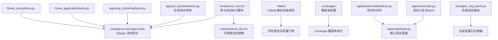
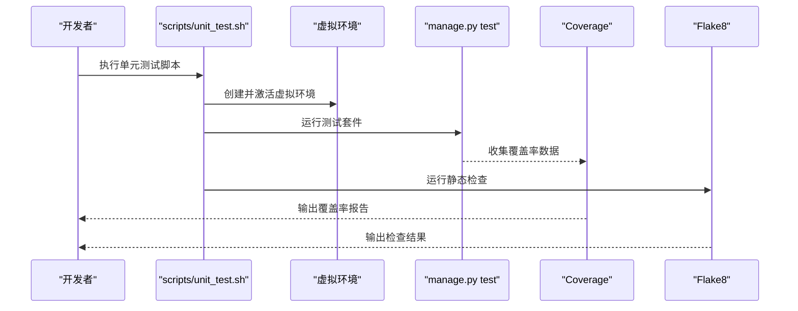
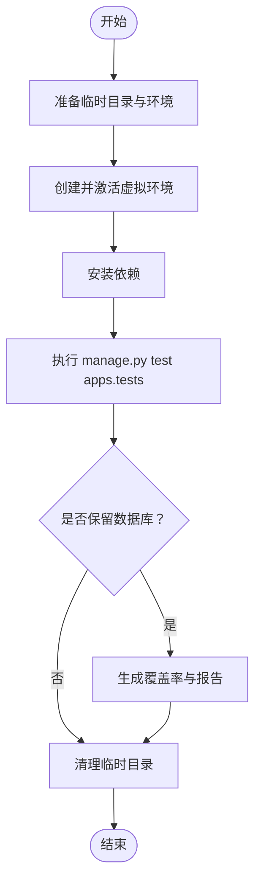
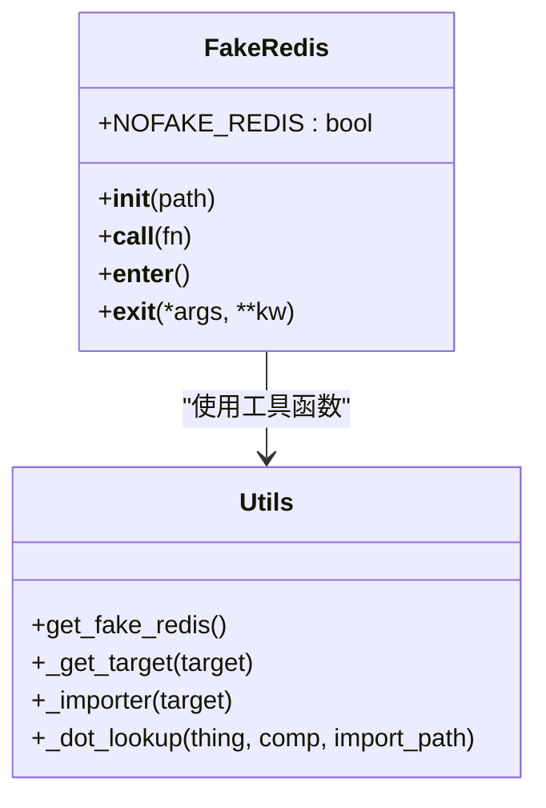
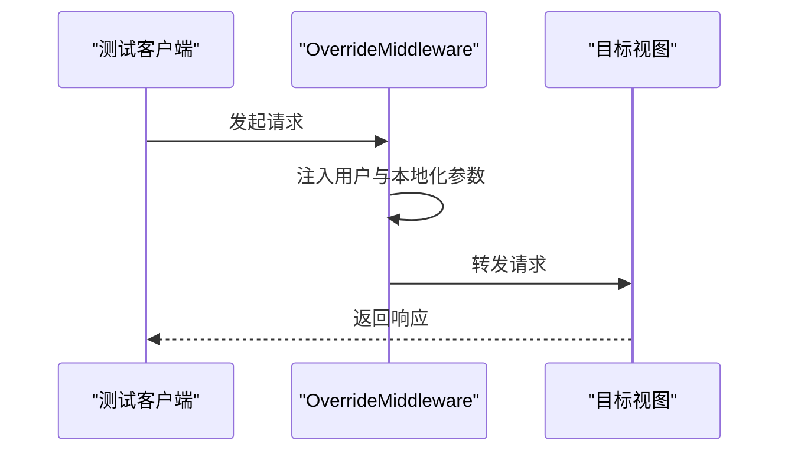
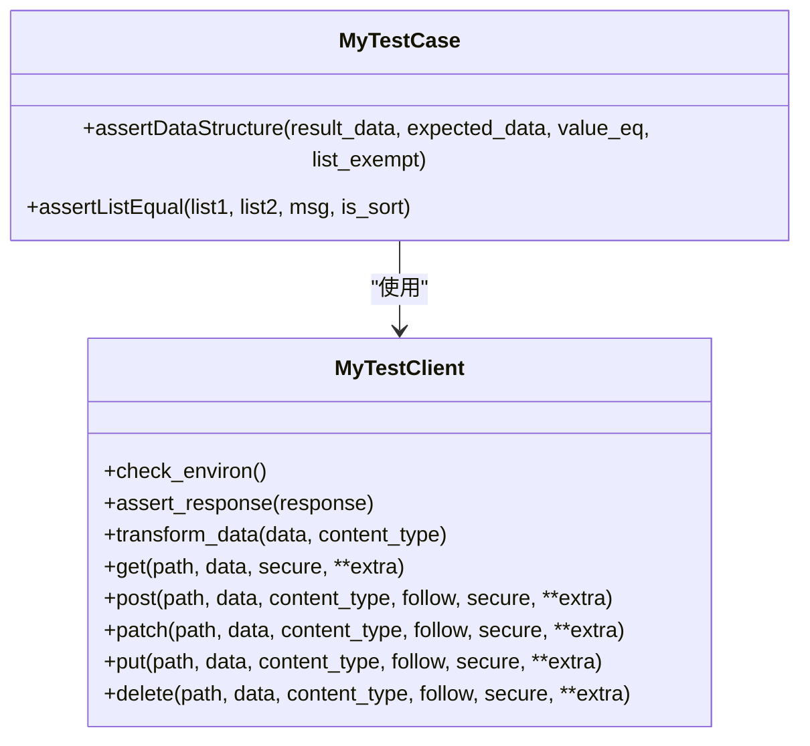
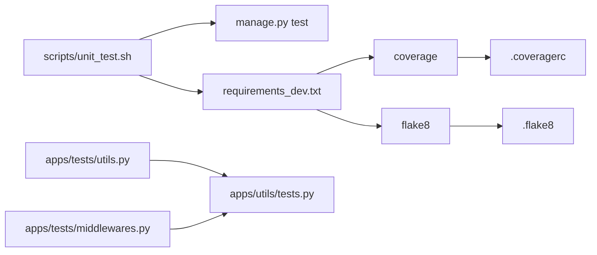

# 测试和质量保证

<cite>
**本文引用的文件**
- [scripts/unit_test.sh](file://scripts/unit_test.sh)
- [requirements_dev.txt](file://requirements_dev.txt)
- [.flake8](file://.flake8)
- [.coveragerc](file://.coveragerc)
- [apps/tests/utils.py](file://apps/tests/utils.py)
- [apps/tests/middlewares.py](file://apps/tests/middlewares.py)
- [apps/utils/tests.py](file://apps/utils/tests.py)
- [apps/ai_assistant/tests.py](file://apps/ai_assistant/tests.py)
- [apps/log_clustering/tests.py](file://apps/log_clustering/tests.py)
- [home_application/tests.py](file://home_application/tests.py)
- [flower_proxy/tests.py](file://flower_proxy/tests.py)
- [tests/gen_log_batch.py](file://tests/gen_log_batch.py)
</cite>

## 目录
1. [简介](#简介)
2. [项目结构](#项目结构)
3. [核心组件](#核心组件)
4. [架构总览](#架构总览)
5. [详细组件分析](#详细组件分析)
6. [依赖分析](#依赖分析)
7. [性能考虑](#性能考虑)
8. [故障排查指南](#故障排查指南)
9. [结论](#结论)
10. [附录](#附录)

## 简介
本文件面向测试与质量保证，系统化梳理本仓库的测试体系与质量保障机制，覆盖单元测试框架使用、测试用例编写、测试覆盖率分析、持续集成配置建议、性能测试方法（压力/负载/基准）、代码质量保证（代码审查、静态检查、自动化测试）、测试环境搭建与管理（测试数据准备、环境隔离、结果分析），并提供最佳实践与工具使用指南。

## 项目结构
围绕测试与质量保证的关键目录与文件如下：
- 单元测试执行脚本：scripts/unit_test.sh
- 开发期测试依赖：requirements_dev.txt
- 静态检查规则：.flake8
- 覆盖率配置：.coveragerc
- 测试通用工具与中间件：apps/tests/utils.py、apps/tests/middlewares.py
- 接口测试基类与客户端封装：apps/utils/tests.py
- 各应用测试入口与样例：apps/ai_assistant/tests.py、apps/log_clustering/tests.py、home_application/tests.py、flower_proxy/tests.py
- 性能测试辅助：tests/gen_log_batch.py

**图表来源**
- [scripts/unit_test.sh:1-19](file://scripts/unit_test.sh#L1-L19)
- [requirements_dev.txt:1-13](file://requirements_dev.txt#L1-L13)
- [.flake8:1-31](file://.flake8#L1-L31)
- [.coveragerc:1-3](file://.coveragerc#L1-L3)
- [apps/tests/utils.py:1-95](file://apps/tests/utils.py#L1-L95)
- [apps/tests/middlewares.py:1-45](file://apps/tests/middlewares.py#L1-L45)
- [apps/utils/tests.py:1-220](file://apps/utils/tests.py#L1-L220)
- [apps/ai_assistant/tests.py:1-4](file://apps/ai_assistant/tests.py#L1-L4)
- [apps/log_clustering/tests.py:1-22](file://apps/log_clustering/tests.py#L1-L22)
- [home_application/tests.py:1-25](file://home_application/tests.py#L1-L25)
- [flower_proxy/tests.py:1-25](file://flower_proxy/tests.py#L1-L25)
- [tests/gen_log_batch.py](file://tests/gen_log_batch.py)

**章节来源**
- [scripts/unit_test.sh:1-19](file://scripts/unit_test.sh#L1-L19)
- [requirements_dev.txt:1-13](file://requirements_dev.txt#L1-L13)
- [.flake8:1-31](file://.flake8#L1-L31)
- [.coveragerc:1-3](file://.coveragerc#L1-L3)
- [apps/tests/utils.py:1-95](file://apps/tests/utils.py#L1-L95)
- [apps/tests/middlewares.py:1-45](file://apps/tests/middlewares.py#L1-L45)
- [apps/utils/tests.py:1-220](file://apps/utils/tests.py#L1-L220)
- [apps/ai_assistant/tests.py:1-4](file://apps/ai_assistant/tests.py#L1-L4)
- [apps/log_clustering/tests.py:1-22](file://apps/log_clustering/tests.py#L1-L22)
- [home_application/tests.py:1-25](file://home_application/tests.py#L1-L25)
- [flower_proxy/tests.py:1-25](file://flower_proxy/tests.py#L1-L25)
- [tests/gen_log_batch.py](file://tests/gen_log_batch.py)

## 核心组件
- 单元测试执行脚本：scripts/unit_test.sh 提供了在临时目录中准备测试环境、安装依赖、执行 Django 测试套件的完整流程，并通过 keepdb 保持数据库以便复用。
- 测试依赖与工具：requirements_dev.txt 引入 coverage、flake8、pre-commit 等工具，用于覆盖率统计与代码风格检查。
- 静态检查规则：.flake8 定义忽略项、最大行长度、最大复杂度与排除路径，确保跨模块一致性。
- 覆盖率配置：.coveragerc 指定忽略 blueapps/* 包，聚焦业务代码覆盖率。
- 测试工具与 Mock：apps/tests/utils.py 提供 Redis Mock、override_settings 与 patch 的组合装饰器，支持在测试中替换缓存后端与第三方调用。
- 测试中间件：apps/tests/middlewares.py 在测试环境中注入用户上下文与本地参数，便于权限与本地化逻辑测试。
- 接口测试基类：apps/utils/tests.py 定义 MyTestClient 与 MyTestCase，统一处理登录态、断言、数据结构校验与排序断言，降低重复代码。
- 应用测试样例：各应用的 tests.py 文件作为测试入口，配合 manage.py test 执行。
- 性能测试辅助：tests/gen_log_batch.py 提供批量日志生成能力，可用于性能压测场景的数据准备。

**章节来源**
- [scripts/unit_test.sh:1-19](file://scripts/unit_test.sh#L1-L19)
- [requirements_dev.txt:1-13](file://requirements_dev.txt#L1-L13)
- [.flake8:1-31](file://.flake8#L1-L31)
- [.coveragerc:1-3](file://.coveragerc#L1-L3)
- [apps/tests/utils.py:1-95](file://apps/tests/utils.py#L1-L95)
- [apps/tests/middlewares.py:1-45](file://apps/tests/middlewares.py#L1-L45)
- [apps/utils/tests.py:1-220](file://apps/utils/tests.py#L1-L220)
- [apps/ai_assistant/tests.py:1-4](file://apps/ai_assistant/tests.py#L1-L4)
- [apps/log_clustering/tests.py:1-22](file://apps/log_clustering/tests.py#L1-L22)
- [home_application/tests.py:1-25](file://home_application/tests.py#L1-L25)
- [flower_proxy/tests.py:1-25](file://flower_proxy/tests.py#L1-L25)
- [tests/gen_log_batch.py](file://tests/gen_log_batch.py)

## 架构总览
下图展示从测试执行到结果输出的整体链路，包括脚本、Django 测试框架、覆盖率与静态检查工具的协作关系。

**图表来源**
- [scripts/unit_test.sh:1-19](file://scripts/unit_test.sh#L1-L19)
- [requirements_dev.txt:1-13](file://requirements_dev.txt#L1-L13)
- [.coveragerc:1-3](file://.coveragerc#L1-L3)
- [.flake8:1-31](file://.flake8#L1-L31)

## 详细组件分析

### 组件一：单元测试执行与持续集成配置
- 执行流程
  - 使用临时目录复制源码并准备测试环境，加载测试环境脚本，安装开发依赖。
  - 创建 Python3 虚拟环境，固定 pip 版本，安装生产依赖。
  - 运行 manage.py test apps.tests 并保留数据库以提升效率。
  - 清理临时目录。
- 持续集成建议
  - 在 CI 中复用该脚本或其等价步骤，确保每次提交均运行测试与覆盖率统计。
  - 将覆盖率阈值纳入质量门禁，失败即阻断合并。
  - 结合 Flake8 与自定义 lint 规则，实现“先检查再测试”的流水线。

**图表来源**
- [scripts/unit_test.sh:1-19](file://scripts/unit_test.sh#L1-L19)

**章节来源**
- [scripts/unit_test.sh:1-19](file://scripts/unit_test.sh#L1-L19)

### 组件二：测试工具与 Mock（Redis 与第三方）
- 功能概述
  - 提供 FakeRedis 工具，通过 override_settings 将默认缓存后端切换为内存缓存，减少外部依赖。
  - 支持按路径动态 patch 第三方模块或函数，便于隔离外部服务。
  - 通过环境变量 NOFAKE_REDIS 控制是否启用 FakeRedis，便于调试真实连接。
- 使用要点
  - 在测试类或测试方法上使用装饰器，自动注入 override_settings 与 patch。
  - 对于可调用对象，自动打补丁；对于模块属性（如 django.cache），需额外处理。

**图表来源**
- [apps/tests/utils.py:38-95](file://apps/tests/utils.py#L38-L95)

**章节来源**
- [apps/tests/utils.py:1-95](file://apps/tests/utils.py#L1-L95)

### 组件三：测试中间件（OverrideMiddleware）
- 功能概述
  - 在测试请求中注入用户对象与权限标记，设置本地化参数，模拟真实请求上下文。
- 使用要点
  - 将该中间件加入测试配置，确保涉及权限与本地化的视图能正常运行。

**图表来源**
- [apps/tests/middlewares.py:29-45](file://apps/tests/middlewares.py#L29-L45)

**章节来源**
- [apps/tests/middlewares.py:1-45](file://apps/tests/middlewares.py#L1-L45)

### 组件四：接口测试基类与客户端（MyTestClient / MyTestCase）
- 功能概述
  - MyTestClient：封装登录态获取、Cookie 设置、GET/POST/PATCH/PUT/DELETE 统一断言与数据转换。
  - MyTestCase：提供 assertDataStructure 递归断言数据结构与类型、assertListEqual 支持排序断言，简化接口测试。
- 使用要点
  - 在测试类中继承 MyTestCase，使用 MyTestClient 发起请求，自动断言返回结构与状态。
  - 对于需要登录态的接口，确保环境变量已配置，否则会触发异常提示。

**图表来源**
- [apps/utils/tests.py:38-116](file://apps/utils/tests.py#L38-L116)
- [apps/utils/tests.py:140-220](file://apps/utils/tests.py#L140-L220)

**章节来源**
- [apps/utils/tests.py:1-220](file://apps/utils/tests.py#L1-L220)

### 组件五：应用测试样例（AI 助手、聚类、首页、代理）
- AI 助手：提供空的 tests.py 作为测试入口，后续可扩展具体用例。
- 日志聚类：提供空的 tests.py 作为测试入口，后续可扩展具体用例。
- 首页应用：提供空的 tests.py 作为测试入口。
- Flower 代理：提供空的 tests.py 作为测试入口。
- 建议
  - 在各应用的 views、handlers、serializers 中补充单元测试与集成测试。
  - 复用 apps/utils/tests.py 的基类与客户端，统一测试风格。

**章节来源**
- [apps/ai_assistant/tests.py:1-4](file://apps/ai_assistant/tests.py#L1-L4)
- [apps/log_clustering/tests.py:1-22](file://apps/log_clustering/tests.py#L1-L22)
- [home_application/tests.py:1-25](file://home_application/tests.py#L1-L25)
- [flower_proxy/tests.py:1-25](file://flower_proxy/tests.py#L1-L25)

### 组件六：性能测试辅助（批量日志生成）
- 功能概述
  - tests/gen_log_batch.py 提供批量日志生成能力，可用于性能压测场景的数据准备。
- 使用建议
  - 在压测前生成指定规模的日志数据集，导入到目标存储或索引中。
  - 结合压测工具（如 Locust、JMeter 或自研压测脚本）进行并发与吞吐测试。

**章节来源**
- [tests/gen_log_batch.py](file://tests/gen_log_batch.py)

## 依赖分析
- 工具链耦合
  - scripts/unit_test.sh 依赖 manage.py test 与 Django 测试框架。
  - 覆盖率由 .coveragerc 配置，结合 requirements_dev.txt 中的 coverage。
  - 静态检查由 .flake8 配置，结合 requirements_dev.txt 中的 flake8。
- 组件内聚
  - apps/tests/utils.py 与 apps/tests/middlewares.py 为测试基础设施，被各应用测试广泛复用。
  - apps/utils/tests.py 为接口测试基类，统一断言与客户端行为。

**图表来源**
- [scripts/unit_test.sh:1-19](file://scripts/unit_test.sh#L1-L19)
- [requirements_dev.txt:1-13](file://requirements_dev.txt#L1-L13)
- [.coveragerc:1-3](file://.coveragerc#L1-L3)
- [.flake8:1-31](file://.flake8#L1-L31)
- [apps/tests/utils.py:1-95](file://apps/tests/utils.py#L1-L95)
- [apps/tests/middlewares.py:1-45](file://apps/tests/middlewares.py#L1-L45)
- [apps/utils/tests.py:1-220](file://apps/utils/tests.py#L1-L220)

**章节来源**
- [scripts/unit_test.sh:1-19](file://scripts/unit_test.sh#L1-L19)
- [requirements_dev.txt:1-13](file://requirements_dev.txt#L1-L13)
- [.coveragerc:1-3](file://.coveragerc#L1-L3)
- [.flake8:1-31](file://.flake8#L1-L31)
- [apps/tests/utils.py:1-95](file://apps/tests/utils.py#L1-L95)
- [apps/tests/middlewares.py:1-45](file://apps/tests/middlewares.py#L1-L45)
- [apps/utils/tests.py:1-220](file://apps/utils/tests.py#L1-L220)

## 性能考虑
- 压力测试
  - 使用 tests/gen_log_batch.py 生成大规模日志数据，结合压测工具对搜索、聚合、导出等接口施加并发压力。
  - 关注响应时间、错误率与资源占用（CPU、内存、磁盘 IO、网络）。
- 负载测试
  - 在稳定流量下长时间运行，观察系统稳定性与资源耗散趋势。
- 性能基准测试
  - 固定数据规模与并发配置，记录关键指标（P50/P95/P99 延迟、吞吐量），形成基线。
- 优化建议
  - 对热点接口进行缓存与索引优化，减少数据库与外部服务调用。
  - 使用异步任务与队列解耦非关键路径，避免阻塞主流程。
  - 在测试环境模拟生产数据分布，提高测试代表性。

[本节为通用指导，无需特定文件分析]

## 故障排查指南
- 测试环境变量缺失
  - 现象：MyTestClient 在初始化时检查环境变量，若未设置会抛出异常。
  - 处理：在本地或 CI 中补齐 APP_CODE、APP_TOKEN、BK_PAAS_HOST、PAAS_ADMIN_USER、PAAS_ADMIN_PASS。
- Redis 相关问题
  - 现象：测试中出现 Redis 连接异常。
  - 处理：确认是否启用了 NOFAKE_REDIS；如需使用 FakeRedis，请确保覆盖默认缓存后端。
- 权限与本地化上下文
  - 现象：涉及权限或本地化的接口在测试中行为异常。
  - 处理：确保测试中间件已注入用户与本地化参数。
- 覆盖率统计不准确
  - 现象：覆盖率报告未包含预期模块。
  - 处理：检查 .coveragerc 的 omit 规则，必要时调整忽略范围。

**章节来源**
- [apps/utils/tests.py:38-116](file://apps/utils/tests.py#L38-L116)
- [apps/tests/utils.py:38-95](file://apps/tests/utils.py#L38-L95)
- [apps/tests/middlewares.py:29-45](file://apps/tests/middlewares.py#L29-L45)
- [.coveragerc:1-3](file://.coveragerc#L1-L3)

## 结论
本仓库已具备完善的测试与质量保证基础：统一的测试执行脚本、覆盖率与静态检查工具、可复用的测试基类与 Mock 工具、以及针对接口测试的断言与客户端封装。建议在现有基础上逐步完善各应用的测试用例，建立持续集成的质量门禁，并引入性能测试与基准测试，形成闭环的质量保障体系。

[本节为总结性内容，无需特定文件分析]

## 附录
- 测试最佳实践
  - 用例分层：单元测试覆盖核心逻辑，集成测试覆盖接口与外部依赖，性能测试覆盖高负载场景。
  - 数据隔离：使用内存缓存与 Mock 替代真实外部服务，避免跨用例污染。
  - 断言策略：优先断言结构与类型，必要时断言值相等；对列表使用排序断言以提升健壮性。
  - 环境管理：通过测试中间件与环境变量统一注入上下文，确保测试一致性。
- 质量保证策略
  - 代码审查：强制 PR 必须通过静态检查与测试，覆盖率阈值达标。
  - 自动化测试：CI 中自动执行单元测试、覆盖率统计与静态检查。
  - 持续改进：定期回顾测试用例与性能基线，优化测试效率与覆盖面。

[本节为通用指导，无需特定文件分析]