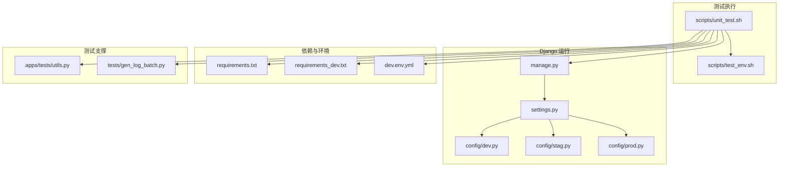
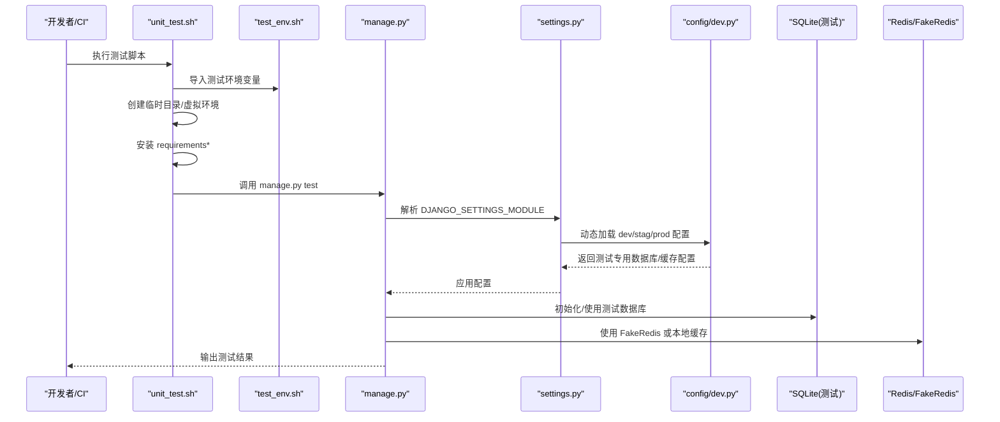
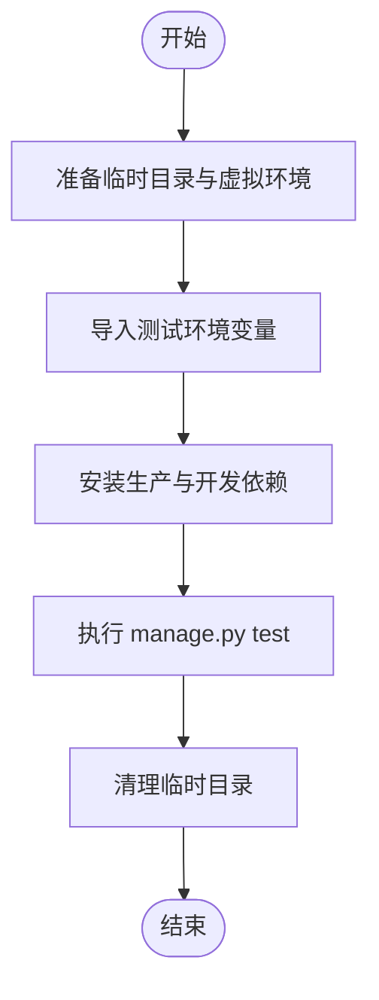
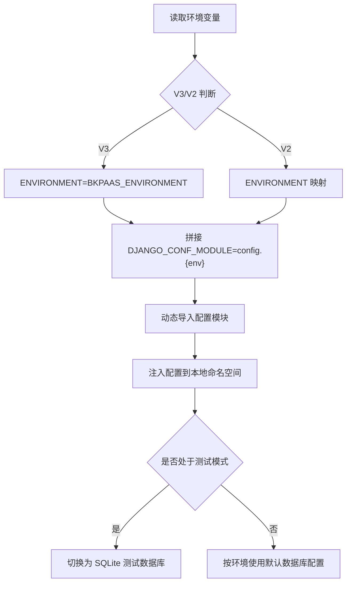
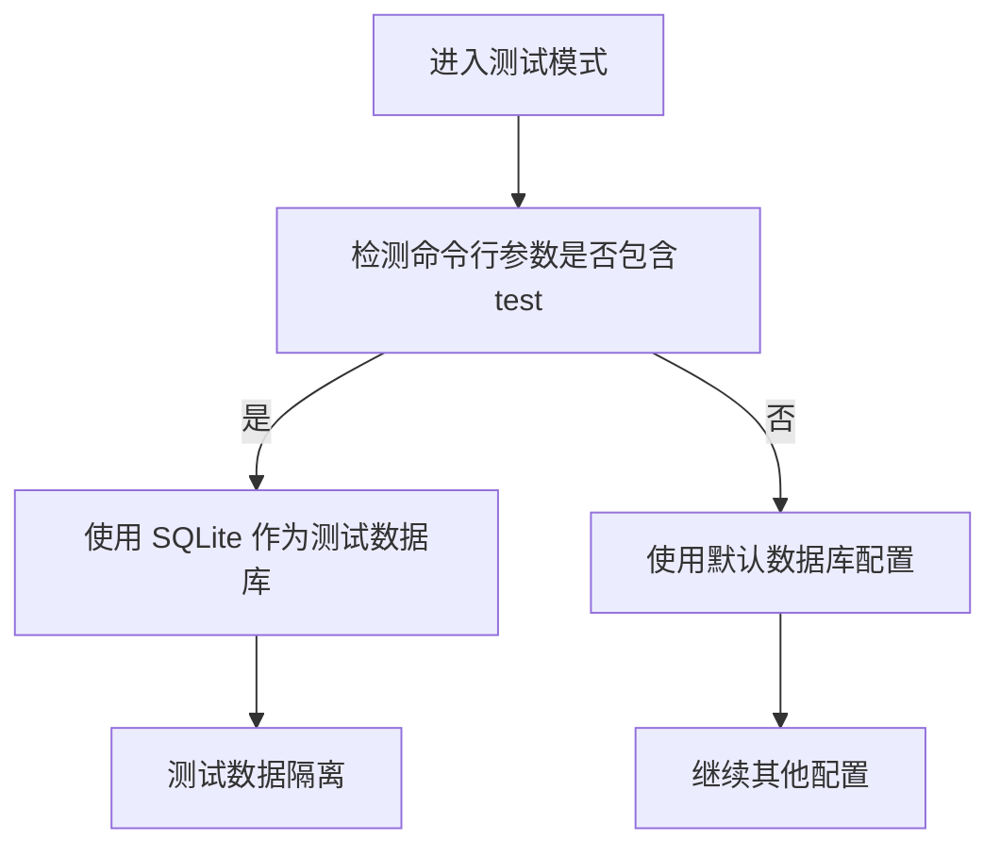
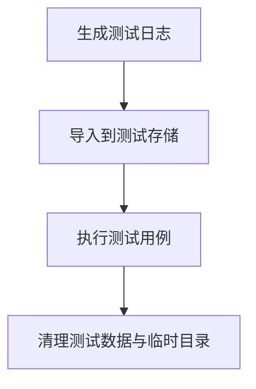
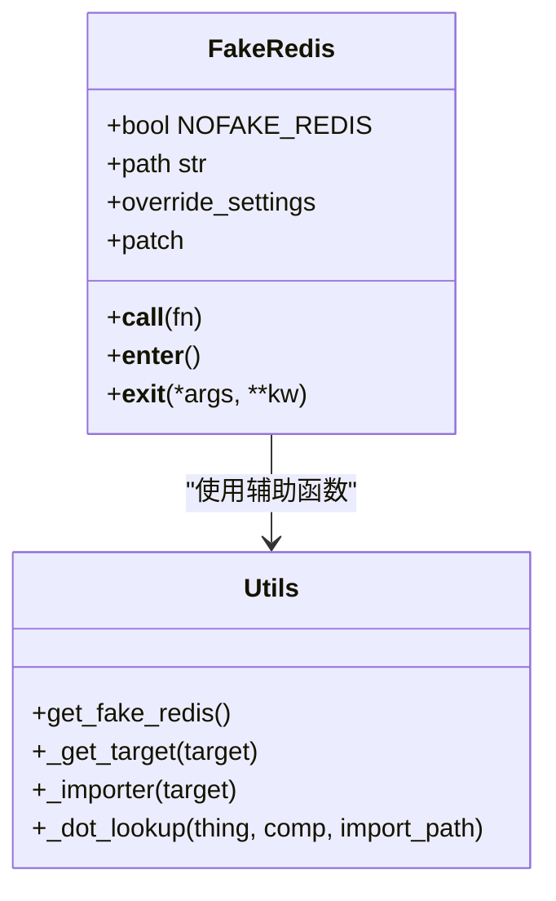
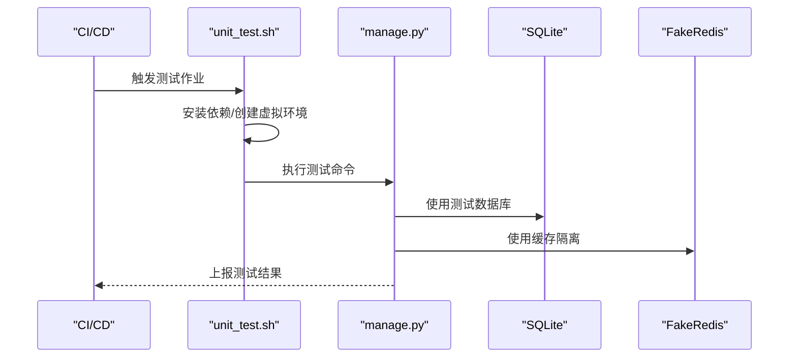
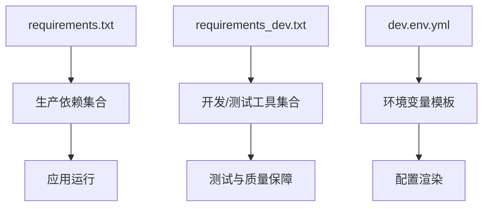

# 测试环境管理

<cite>
**本文引用的文件**
- [scripts/unit_test.sh](file://scripts/unit_test.sh)
- [scripts/test_env.sh](file://scripts/test_env.sh)
- [manage.py](file://manage.py)
- [settings.py](file://settings.py)
- [config/dev.py](file://config/dev.py)
- [config/stag.py](file://config/stag.py)
- [config/prod.py](file://config/prod.py)
- [requirements.txt](file://requirements.txt)
- [requirements_dev.txt](file://requirements_dev.txt)
- [dev.env.yml](file://dev.env.yml)
- [apps/tests/utils.py](file://apps/tests/utils.py)
- [tests/gen_log_batch.py](file://tests/gen_log_batch.py)
</cite>

## 目录
1. [简介](#简介)
2. [项目结构](#项目结构)
3. [核心组件](#核心组件)
4. [架构总览](#架构总览)
5. [详细组件分析](#详细组件分析)
6. [依赖分析](#依赖分析)
7. [性能考虑](#性能考虑)
8. [故障排查指南](#故障排查指南)
9. [结论](#结论)
10. [附录](#附录)

## 简介
本文件面向测试环境管理，系统化梳理测试环境的搭建、配置、隔离与维护流程，覆盖测试数据库初始化、测试数据准备与清理、测试执行环境（含 CI/CD）配置、并行与分布式测试协调、故障排查与数据安全策略，并提供可操作的运维最佳实践。文档以仓库现有脚本与配置为依据，结合 Django 项目的测试运行机制，给出可落地的实施建议。

## 项目结构
围绕测试环境的关键文件与目录如下：
- 测试执行脚本：scripts/unit_test.sh、scripts/test_env.sh
- Django 入口与配置：manage.py、settings.py、config/*.py
- 依赖清单：requirements.txt、requirements_dev.txt
- 环境变量模板：dev.env.yml
- 测试辅助工具：apps/tests/utils.py
- 测试数据生成器：tests/gen_log_batch.py

图表来源
- [scripts/unit_test.sh:1-19](file://scripts/unit_test.sh#L1-L19)
- [scripts/test_env.sh:1-5](file://scripts/test_env.sh#L1-L5)
- [manage.py:22-31](file://manage.py#L22-L31)
- [settings.py:24-47](file://settings.py#L24-L47)
- [config/dev.py:50-68](file://config/dev.py#L50-L68)
- [config/stag.py:48-62](file://config/stag.py#L48-L62)
- [config/prod.py:102-120](file://config/prod.py#L102-L120)
- [requirements.txt:1-146](file://requirements.txt#L1-L146)
- [requirements_dev.txt:1-13](file://requirements_dev.txt#L1-L13)
- [dev.env.yml:1-88](file://dev.env.yml#L1-L88)
- [apps/tests/utils.py:1-95](file://apps/tests/utils.py#L1-L95)
- [tests/gen_log_batch.py:1-56](file://tests/gen_log_batch.py#L1-L56)

章节来源
- [scripts/unit_test.sh:1-19](file://scripts/unit_test.sh#L1-L19)
- [manage.py:22-31](file://manage.py#L22-L31)
- [settings.py:24-47](file://settings.py#L24-L47)

## 核心组件
- 测试执行脚本：负责在临时目录构建隔离的测试环境，安装依赖，注入测试环境变量，执行 Django 测试命令，并清理现场。
- Django 设置与环境选择：根据环境变量动态选择配置模块，加载对应环境的数据库、中间件、服务地址等。
- 测试数据库与隔离：在测试模式下自动切换到 SQLite 内存数据库，避免污染主库；同时提供 Redis Mock 工具以隔离缓存依赖。
- 测试数据与生成：提供批量日志生成脚本，便于构造大规模测试数据。
- 依赖与工具：统一的生产与开发依赖清单，以及测试开发期的工具链（虚拟环境、覆盖率、规范检查等）。

章节来源
- [scripts/unit_test.sh:1-19](file://scripts/unit_test.sh#L1-L19)
- [config/dev.py:64-68](file://config/dev.py#L64-L68)
- [apps/tests/utils.py:38-95](file://apps/tests/utils.py#L38-L95)
- [tests/gen_log_batch.py:1-56](file://tests/gen_log_batch.py#L1-L56)

## 架构总览
下图展示测试执行从脚本到 Django 设置、再到数据库与外部依赖的整体流程。

图表来源
- [scripts/unit_test.sh:7-16](file://scripts/unit_test.sh#L7-L16)
- [scripts/test_env.sh:1-5](file://scripts/test_env.sh#L1-L5)
- [manage.py:25-30](file://manage.py#L25-L30)
- [settings.py:37-46](file://settings.py#L37-L46)
- [config/dev.py:50-68](file://config/dev.py#L50-L68)
- [apps/tests/utils.py:38-95](file://apps/tests/utils.py#L38-L95)

## 详细组件分析

### 组件一：测试执行脚本与环境注入
- 作用：在隔离环境中安装依赖、注入测试变量、执行 Django 测试命令，并清理临时目录。
- 关键点：
  - 使用临时目录与虚拟环境，避免污染宿主环境。
  - 注入测试环境变量（如网关、鉴权等），确保测试对外部系统的依赖可控。
  - 通过 Django 命令行触发测试，支持 keepdb 参数复用数据库以提升速度。

图表来源
- [scripts/unit_test.sh:1-19](file://scripts/unit_test.sh#L1-L19)
- [scripts/test_env.sh:1-5](file://scripts/test_env.sh#L1-L5)

章节来源
- [scripts/unit_test.sh:1-19](file://scripts/unit_test.sh#L1-L19)
- [scripts/test_env.sh:1-5](file://scripts/test_env.sh#L1-L5)

### 组件二：Django 设置与环境选择
- 作用：根据环境变量动态选择配置模块，加载对应环境的数据库、中间件、服务地址等。
- 关键点：
  - 支持 V3（BKPAAS_ENVIRONMENT）与 V2（BK_ENV）两种环境变量。
  - 将配置模块路径拼接为 config.{env}，并在运行时注入到本地命名空间。
  - 在测试模式下自动切换数据库为 SQLite，保证隔离性。

图表来源
- [settings.py:26-46](file://settings.py#L26-L46)
- [config/dev.py:64-68](file://config/dev.py#L64-L68)

章节来源
- [settings.py:24-47](file://settings.py#L24-L47)
- [config/dev.py:50-68](file://config/dev.py#L50-L68)

### 组件三：测试数据库初始化与隔离策略
- 作用：在测试模式下自动切换到 SQLite 内存数据库，避免对真实数据库造成影响。
- 关键点：
  - 通过 sys.argv 中是否包含 test 字段触发测试数据库配置。
  - SQLite 的使用确保每次测试的独立性与快速回滚。
  - 建议配合 keepdb 与分库策略，进一步提升并行测试效率。

图表来源
- [config/dev.py:64-68](file://config/dev.py#L64-L68)

章节来源
- [config/dev.py:64-68](file://config/dev.py#L64-L68)

### 组件四：测试数据管理（生成、导入与清理）
- 生成：tests/gen_log_batch.py 提供批量日志生成能力，可按需生成大量日志文件用于检索与聚类等场景测试。
- 导入：建议在测试前通过采集器或导入接口将生成的数据导入目标存储（如 ES/MySQL），并确保测试用例只访问测试专属索引或表。
- 清理：测试结束后清理临时目录与测试数据库，避免残留影响后续测试。

图表来源
- [tests/gen_log_batch.py:1-56](file://tests/gen_log_batch.py#L1-L56)
- [scripts/unit_test.sh:2-3](file://scripts/unit_test.sh#L2-L3)

章节来源
- [tests/gen_log_batch.py:1-56](file://tests/gen_log_batch.py#L1-L56)
- [scripts/unit_test.sh:1-19](file://scripts/unit_test.sh#L1-L19)

### 组件五：缓存与外部依赖的隔离（Redis/FakeRedis）
- 作用：在测试中使用 FakeRedis 或本地缓存替代真实 Redis，避免跨测试干扰。
- 关键点：
  - apps/tests/utils.py 提供 FakeRedis 装饰器与上下文，支持覆盖 CACHES 设置并打补丁替换 Redis 客户端。
  - 通过环境变量 NOFAKE_REDIS 控制是否启用 FakeRedis，便于对比真实行为。

图表来源
- [apps/tests/utils.py:38-95](file://apps/tests/utils.py#L38-L95)

章节来源
- [apps/tests/utils.py:1-95](file://apps/tests/utils.py#L1-L95)

### 组件六：测试执行环境与 CI/CD 集成
- 作用：在 CI/CD 中复用本地测试脚本，确保测试一致性。
- 关键点：
  - 在流水线中调用 scripts/unit_test.sh，确保安装依赖、注入环境变量、执行测试与清理的全流程自动化。
  - 建议在流水线中配置并行任务，结合测试数据库与缓存隔离策略，提升吞吐量。

图表来源
- [scripts/unit_test.sh:7-16](file://scripts/unit_test.sh#L7-L16)
- [apps/tests/utils.py:38-95](file://apps/tests/utils.py#L38-L95)

章节来源
- [scripts/unit_test.sh:1-19](file://scripts/unit_test.sh#L1-L19)

## 依赖分析
- 生产依赖：集中于 requirements.txt，包含 Django、Celery、Redis、ES 客户端、OpenTelemetry、蓝鲸生态组件等。
- 开发与测试依赖：集中于 requirements_dev.txt，包含虚拟环境、覆盖率、规范检查等工具。
- 环境变量模板：dev.env.yml 提供域名与网关根地址等占位符，便于在不同环境渲染。

图表来源
- [requirements.txt:1-146](file://requirements.txt#L1-L146)
- [requirements_dev.txt:1-13](file://requirements_dev.txt#L1-L13)
- [dev.env.yml:1-88](file://dev.env.yml#L1-L88)

章节来源
- [requirements.txt:1-146](file://requirements.txt#L1-L146)
- [requirements_dev.txt:1-13](file://requirements_dev.txt#L1-L13)
- [dev.env.yml:1-88](file://dev.env.yml#L1-L88)

## 性能考虑
- 测试数据库：优先使用 SQLite 内存数据库，减少 IO 压力；若需真实 ES/MySQL 行为，建议使用容器化实例并启用增量测试。
- 缓存隔离：使用 FakeRedis 或本地缓存，避免跨用例竞争；必要时开启 keepdb 以减少迁移开销。
- 并行测试：按功能域拆分测试集，结合独立数据库/索引与缓存隔离，避免锁争用。
- 依赖安装：在 CI 中缓存 pip/虚拟环境，缩短构建时间。

## 故障排查指南
- 环境变量缺失：确认 scripts/test_env.sh 中的变量已注入，或在 CI 中补充对应密钥。
- 数据库异常：检查 settings 是否正确选择 config.dev/stag/prod；在测试模式下确认使用 SQLite。
- 缓存冲突：确认 apps/tests/utils.py 的 FakeRedis 配置生效，必要时设置 NOFAKE_REDIS=1 排查真实 Redis 行为。
- 依赖不一致：核对 requirements.txt 与 requirements_dev.txt 的版本，确保本地与 CI 一致。
- 日志数据问题：使用 tests/gen_log_batch.py 生成测试数据后，确认导入路径与索引映射正确。

章节来源
- [scripts/test_env.sh:1-5](file://scripts/test_env.sh#L1-L5)
- [settings.py:24-47](file://settings.py#L24-L47)
- [apps/tests/utils.py:38-95](file://apps/tests/utils.py#L38-L95)
- [tests/gen_log_batch.py:1-56](file://tests/gen_log_batch.py#L1-L56)

## 结论
本项目提供了完整的测试执行脚本与 Django 环境适配机制，结合 SQLite 测试数据库与 FakeRedis 缓存隔离，能够高效、稳定地支撑单元测试与集成测试。建议在 CI/CD 中复用现有脚本，配合并行与容器化依赖，持续优化测试性能与稳定性。

## 附录
- 测试环境搭建步骤（基于现有脚本）
  1) 准备工作：确保 Python 与 pip 版本满足要求，准备好 scripts/test_env.sh 中的环境变量。
  2) 执行脚本：运行 scripts/unit_test.sh，它会自动创建虚拟环境、安装依赖、注入变量并执行测试。
  3) 查看结果：关注 manage.py test 的输出，必要时开启更详细的日志。
  4) 清理现场：脚本会自动清理临时目录，确保环境干净。

章节来源
- [scripts/unit_test.sh:1-19](file://scripts/unit_test.sh#L1-L19)
- [scripts/test_env.sh:1-5](file://scripts/test_env.sh#L1-L5)
- [manage.py:25-30](file://manage.py#L25-L30)