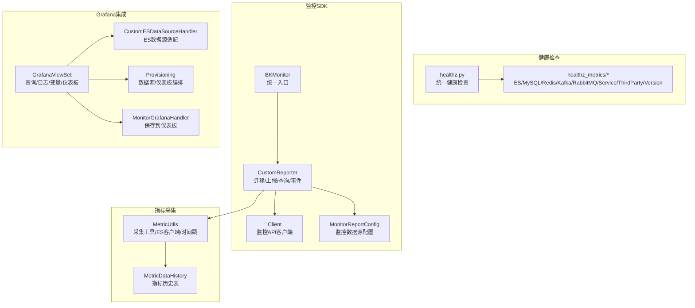
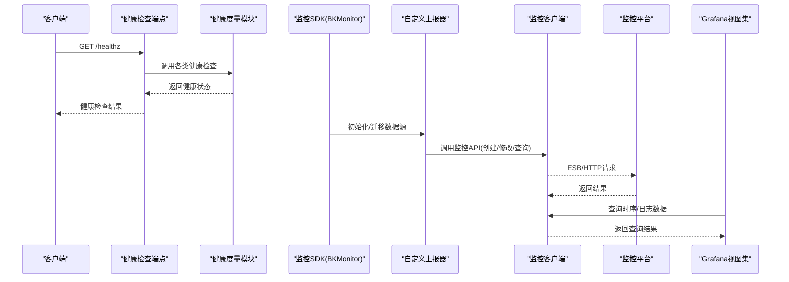
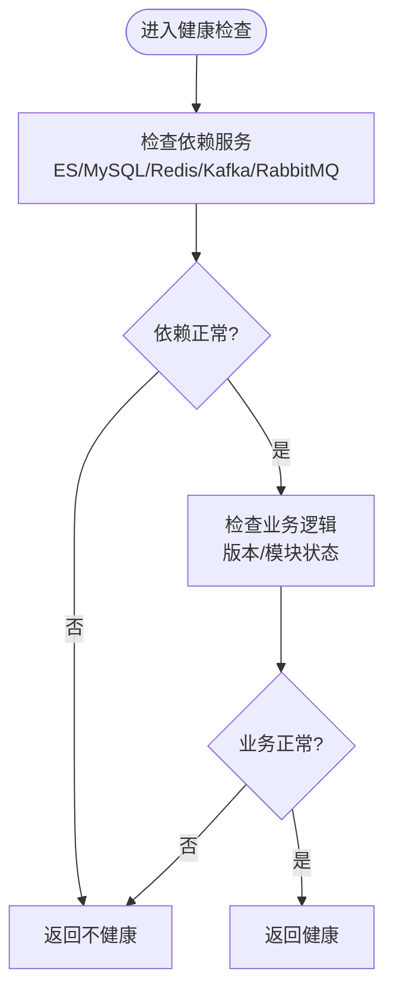
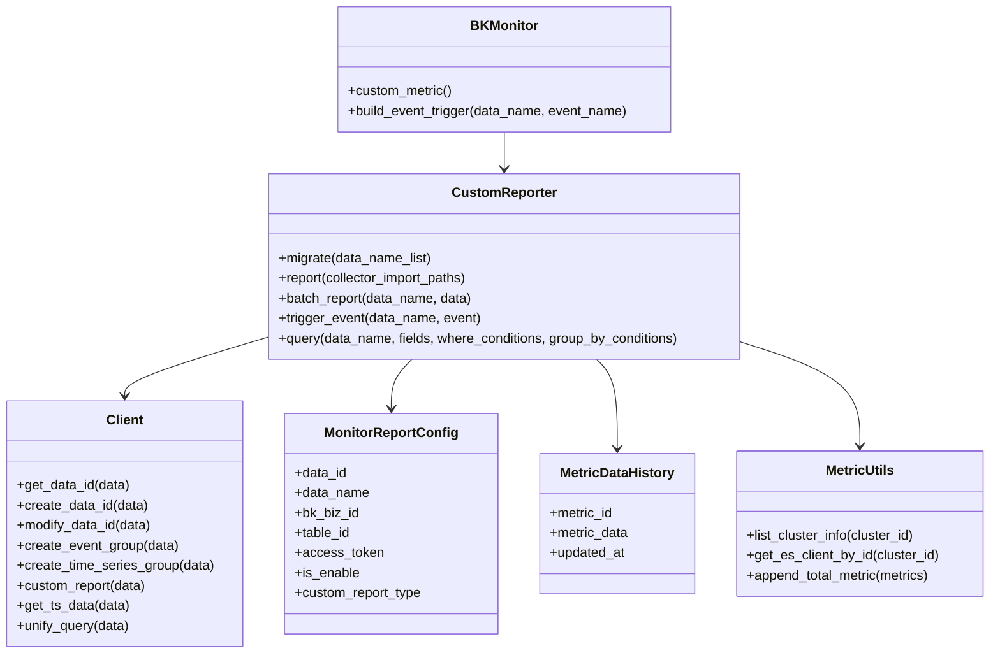
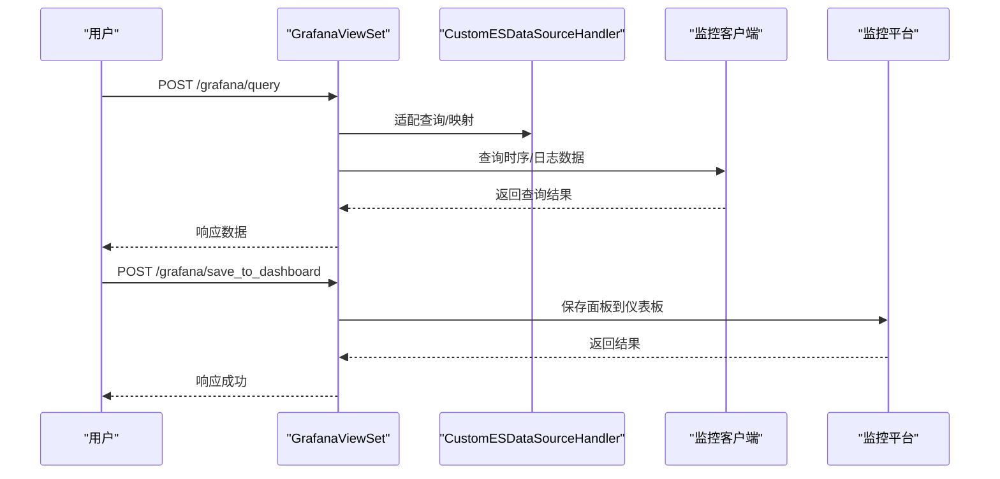
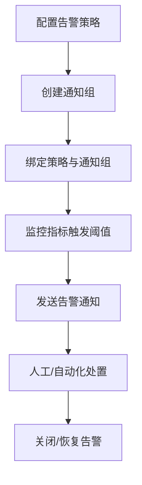
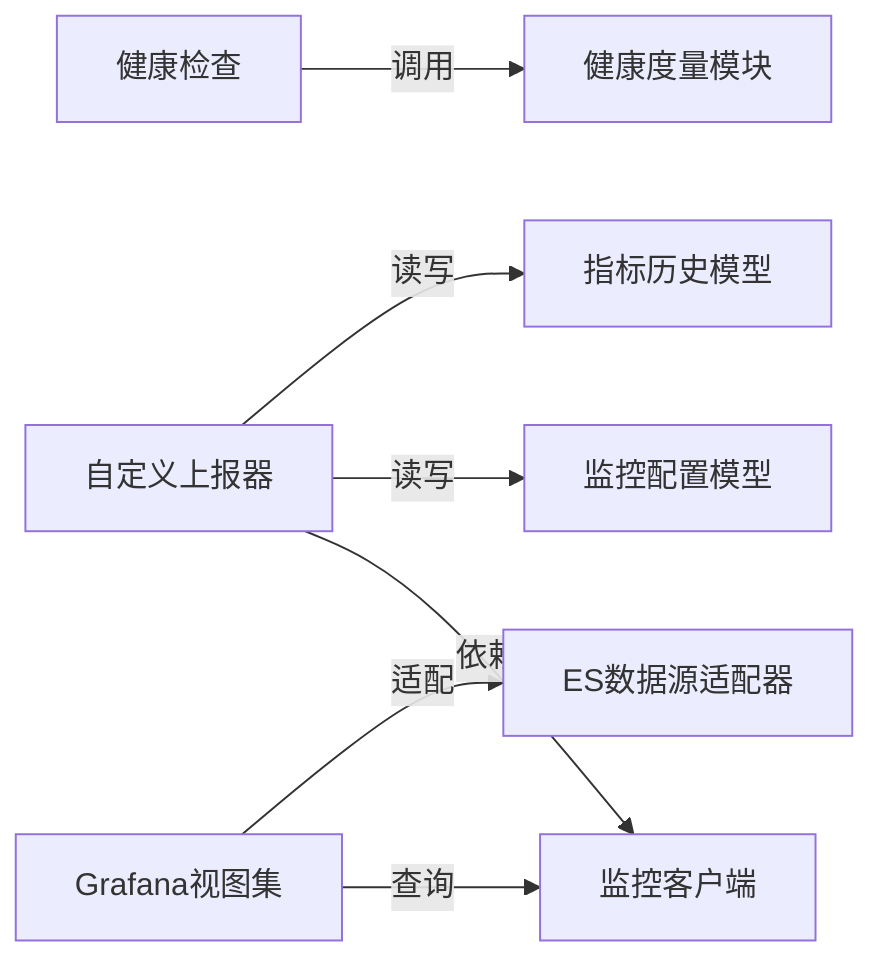

# 健康检查和监控

<cite>
**本文引用的文件**   
- [bk_monitor/models.py](file://bk_monitor/models.py)
- [bk_monitor/handler/monitor.py](file://bk_monitor/handler/monitor.py)
- [bk_monitor/utils/metric.py](file://bk_monitor/utils/metric.py)
- [bk_monitor/utils/query.py](file://bk_monitor/utils/query.py)
- [bk_monitor/constants.py](file://bk_monitor/constants.py)
- [bk_monitor/api/client.py](file://bk_monitor/api/client.py)
- [apps/grafana/views.py](file://apps/grafana/views.py)
- [apps/grafana/data_source.py](file://apps/grafana/data_source.py)
- [apps/grafana/provisioning.py](file://apps/grafana/provisioning.py)
- [apps/grafana/handlers/monitor.py](file://apps/grafana/handlers/monitor.py)
- [apps/log_measure/utils/metric.py](file://apps/log_measure/utils/metric.py)
- [apps/log_measure/models.py](file://apps/log_measure/models.py)
- [apps/log_measure/tasks/__init__.py](file://apps/log_measure/tasks/__init__.py)
- [home_application/handlers/healthz.py](file://home_application/handlers/healthz.py)
- [home_application/handlers/healthz_metrics/es.py](file://home_application/handlers/healthz_metrics/es.py)
- [home_application/handlers/healthz_metrics/mysql.py](file://home_application/handlers/healthz_metrics/mysql.py)
- [home_application/handlers/healthz_metrics/redis.py](file://home_application/handlers/healthz_metrics/redis.py)
- [home_application/handlers/healthz_metrics/kafka.py](file://home_application/handlers/healthz_metrics/kafka.py)
- [home_application/handlers/healthz_metrics/rabbitmq.py](file://home_application/handlers/healthz_metrics/rabbitmq.py)
- [home_application/handlers/healthz_metrics/service_module.py](file://home_application/handlers/healthz_metrics/service_module.py)
- [home_application/handlers/healthz_metrics/third_party.py](file://home_application/handlers/healthz_metrics/third_party.py)
- [home_application/handlers/healthz_metrics/version.py](file://home_application/handlers/healthz_metrics/version.py)
- [apps/log_esquery/metrics.py](file://apps/log_esquery/metrics.py)
- [apps/log_search/metrics.py](file://apps/log_search/metrics.py)
- [apps/ai_assistant/metrics.py](file://apps/ai_assistant/metrics.py)
- [apps/log_measure/handlers/metrics.py](file://apps/log_measure/handlers/metrics.py)
- [apps/log_measure/tasks/subscription.py](file://apps/log_measure/tasks/subscription.py)
- [apps/log_measure/tasks/msg.py](file://apps/log_measure/tasks/msg.py)
- [apps/log_measure/tasks/flow.py](file://apps/log_measure/tasks/flow.py)
- [apps/log_measure/tasks/sync_pattern.py](file://apps/log_measure/tasks/sync_pattern.py)
</cite>

## 目录
1. [简介](#简介)
2. [项目结构](#项目结构)
3. [核心组件](#核心组件)
4. [架构总览](#架构总览)
5. [详细组件分析](#详细组件分析)
6. [依赖分析](#依赖分析)
7. [性能考虑](#性能考虑)
8. [故障排查指南](#故障排查指南)
9. [结论](#结论)
10. [附录](#附录)

## 简介
本文件面向健康检查与监控体系，系统化梳理蓝鲸日志平台（bk-log）中的健康检查机制、监控指标设计与采集、告警配置与处理流程，以及基于 Grafana 的监控仪表板搭建方案。内容覆盖服务可用性检查、依赖服务检查、业务逻辑检查；系统指标、应用指标与业务指标的采集与上报；监控数据源接入与查询；以及告警策略、通知渠道与处理流程的落地实践。

## 项目结构
围绕健康检查与监控，项目主要由以下模块构成：
- 健康检查：home_application 提供统一健康检查端点与多维度健康度量（数据库、消息队列、第三方服务等）
- 监控SDK与上报：bk_monitor 提供指标注册、上报、查询、事件触发能力
- 指标采集与存储：apps/log_measure 提供指标采集工具、模型与定时任务
- Grafana 集成：apps/grafana 提供代理、查询、数据源、仪表板编排与探针数据源
- 业务指标：各业务子应用（如 log_esquery、log_search、ai_assistant）提供业务指标

**图表来源**
- [home_application/handlers/healthz.py](file://home_application/handlers/healthz.py)
- [home_application/handlers/healthz_metrics/es.py](file://home_application/handlers/healthz_metrics/es.py)
- [bk_monitor/handler/monitor.py](file://bk_monitor/handler/monitor.py)
- [bk_monitor/api/client.py](file://bk_monitor/api/client.py)
- [bk_monitor/models.py](file://bk_monitor/models.py)
- [apps/log_measure/utils/metric.py](file://apps/log_measure/utils/metric.py)
- [apps/log_measure/models.py](file://apps/log_measure/models.py)
- [apps/grafana/views.py](file://apps/grafana/views.py)
- [apps/grafana/data_source.py](file://apps/grafana/data_source.py)
- [apps/grafana/provisioning.py](file://apps/grafana/provisioning.py)
- [apps/grafana/handlers/monitor.py](file://apps/grafana/handlers/monitor.py)

**章节来源**
- [home_application/handlers/healthz.py](file://home_application/handlers/healthz.py)
- [bk_monitor/handler/monitor.py](file://bk_monitor/handler/monitor.py)
- [apps/grafana/views.py](file://apps/grafana/views.py)

## 核心组件
- 健康检查端点与度量
  - 统一健康检查入口，聚合数据库、消息中间件、第三方服务、版本信息等健康状态
- 监控SDK
  - 统一入口类负责初始化监控客户端与自定义上报器
  - 自定义上报器负责数据源迁移、指标批量上报、事件上报、SQL查询
  - 客户端封装监控EBS/HTTP接口调用，统一错误处理
- 指标采集与存储
  - 指标工具类提供ES客户端、时间片对齐、业务/空间信息缓存
  - 指标历史模型用于暂存待上报指标
- Grafana 集成
  - Grafana 视图集提供指标查询、日志查询、变量与维度、仪表板目录与创建
  - ES数据源适配器兼容不同场景（日志、第三方ES、BK-Data）
  - 配置管理负责数据源与仪表板的自动编排

**章节来源**
- [bk_monitor/handler/monitor.py](file://bk_monitor/handler/monitor.py)
- [bk_monitor/api/client.py](file://bk_monitor/api/client.py)
- [bk_monitor/models.py](file://bk_monitor/models.py)
- [apps/log_measure/utils/metric.py](file://apps/log_measure/utils/metric.py)
- [apps/log_measure/models.py](file://apps/log_measure/models.py)
- [apps/grafana/views.py](file://apps/grafana/views.py)
- [apps/grafana/data_source.py](file://apps/grafana/data_source.py)
- [apps/grafana/provisioning.py](file://apps/grafana/provisioning.py)

## 架构总览
下图展示健康检查与监控的整体交互路径：健康检查端点聚合多维健康度量；监控SDK通过客户端对接监控平台，完成数据源初始化、指标批量上报与事件上报；Grafana 通过视图集与数据源适配器对接日志检索与时序数据，支撑仪表板可视化。

**图表来源**
- [home_application/handlers/healthz.py](file://home_application/handlers/healthz.py)
- [home_application/handlers/healthz_metrics/es.py](file://home_application/handlers/healthz_metrics/es.py)
- [bk_monitor/handler/monitor.py](file://bk_monitor/handler/monitor.py)
- [bk_monitor/api/client.py](file://bk_monitor/api/client.py)
- [apps/grafana/views.py](file://apps/grafana/views.py)

## 详细组件分析

### 健康检查机制
- 服务可用性检查
  - 统一健康检查端点聚合数据库连接、消息中间件连通性、第三方服务可达性
- 依赖服务检查
  - ES/MySQL/Redis/Kafka/RabbitMQ 等依赖服务的连通性与可用性检测
- 业务逻辑检查
  - 版本信息、模块状态等业务层面的健康度量

**图表来源**
- [home_application/handlers/healthz.py](file://home_application/handlers/healthz.py)
- [home_application/handlers/healthz_metrics/es.py](file://home_application/handlers/healthz_metrics/es.py)
- [home_application/handlers/healthz_metrics/mysql.py](file://home_application/handlers/healthz_metrics/mysql.py)
- [home_application/handlers/healthz_metrics/redis.py](file://home_application/handlers/healthz_metrics/redis.py)
- [home_application/handlers/healthz_metrics/kafka.py](file://home_application/handlers/healthz_metrics/kafka.py)
- [home_application/handlers/healthz_metrics/rabbitmq.py](file://home_application/handlers/healthz_metrics/rabbitmq.py)
- [home_application/handlers/healthz_metrics/service_module.py](file://home_application/handlers/healthz_metrics/service_module.py)
- [home_application/handlers/healthz_metrics/third_party.py](file://home_application/handlers/healthz_metrics/third_party.py)
- [home_application/handlers/healthz_metrics/version.py](file://home_application/handlers/healthz_metrics/version.py)

**章节来源**
- [home_application/handlers/healthz.py](file://home_application/handlers/healthz.py)
- [home_application/handlers/healthz_metrics/es.py](file://home_application/handlers/healthz_metrics/es.py)
- [home_application/handlers/healthz_metrics/mysql.py](file://home_application/handlers/healthz_metrics/mysql.py)
- [home_application/handlers/healthz_metrics/redis.py](file://home_application/handlers/healthz_metrics/redis.py)
- [home_application/handlers/healthz_metrics/kafka.py](file://home_application/handlers/healthz_metrics/kafka.py)
- [home_application/handlers/healthz_metrics/rabbitmq.py](file://home_application/handlers/healthz_metrics/rabbitmq.py)
- [home_application/handlers/healthz_metrics/service_module.py](file://home_application/handlers/healthz_metrics/service_module.py)
- [home_application/handlers/healthz_metrics/third_party.py](file://home_application/handlers/healthz_metrics/third_party.py)
- [home_application/handlers/healthz_metrics/version.py](file://home_application/handlers/healthz_metrics/version.py)

### 监控指标设计与采集
- 指标注册与命名
  - 通过装饰器注册指标，生成唯一指标ID，支持命名空间、前缀、子类型与时间过滤
- 指标采集与上报
  - 工具类按采集周期对齐时间戳，构造ES客户端，执行指标采集
  - 指标历史模型暂存待上报数据，批量上报至监控平台
- 查询与事件
  - 提供SQL拼接与查询封装，支持事件上报

**图表来源**
- [bk_monitor/handler/monitor.py](file://bk_monitor/handler/monitor.py)
- [bk_monitor/api/client.py](file://bk_monitor/api/client.py)
- [bk_monitor/models.py](file://bk_monitor/models.py)
- [apps/log_measure/utils/metric.py](file://apps/log_measure/utils/metric.py)
- [apps/log_measure/models.py](file://apps/log_measure/models.py)

**章节来源**
- [bk_monitor/utils/metric.py](file://bk_monitor/utils/metric.py)
- [bk_monitor/utils/query.py](file://bk_monitor/utils/query.py)
- [bk_monitor/constants.py](file://bk_monitor/constants.py)
- [apps/log_measure/utils/metric.py](file://apps/log_measure/utils/metric.py)
- [apps/log_measure/models.py](file://apps/log_measure/models.py)

### Grafana 集成与仪表板
- Grafana 视图集
  - 提供指标查询、日志查询、变量与维度、仪表板目录树、创建与保存到仪表板
- ES 数据源适配
  - 兼容不同场景（日志、第三方ES、BK-Data），统一mapping与查询
- 自动编排
  - 数据源与仪表板的自动创建、更新与删除，确保与业务空间一致

**图表来源**
- [apps/grafana/views.py](file://apps/grafana/views.py)
- [apps/grafana/data_source.py](file://apps/grafana/data_source.py)
- [apps/grafana/provisioning.py](file://apps/grafana/provisioning.py)
- [apps/grafana/handlers/monitor.py](file://apps/grafana/handlers/monitor.py)
- [bk_monitor/api/client.py](file://bk_monitor/api/client.py)

**章节来源**
- [apps/grafana/views.py](file://apps/grafana/views.py)
- [apps/grafana/data_source.py](file://apps/grafana/data_source.py)
- [apps/grafana/provisioning.py](file://apps/grafana/provisioning.py)
- [apps/grafana/handlers/monitor.py](file://apps/grafana/handlers/monitor.py)

### 告警系统配置与处理流程
- 告警规则
  - 通过监控平台接口保存/删除告警策略，结合业务指标与阈值设定
- 通知渠道
  - 通过监控平台接口保存/删除通知组，支持多种通知方式
- 处理流程
  - 告警触发后，系统通过通知渠道推送告警信息，支持人工处置与自动化处理

**图表来源**
- [bk_monitor/api/client.py](file://bk_monitor/api/client.py)

**章节来源**
- [bk_monitor/api/client.py](file://bk_monitor/api/client.py)

## 依赖分析
- 组件耦合
  - 健康检查模块与各依赖服务模块低耦合，便于扩展与替换
  - 监控SDK通过客户端抽象与监控平台解耦，便于切换或扩展
  - Grafana 集成通过视图集与数据源适配器，屏蔽不同数据源差异
- 外部依赖
  - 监控平台（ESB/HTTP）、Grafana、日志检索引擎（ES/BK-Data）

**图表来源**
- [home_application/handlers/healthz.py](file://home_application/handlers/healthz.py)
- [bk_monitor/handler/monitor.py](file://bk_monitor/handler/monitor.py)
- [bk_monitor/api/client.py](file://bk_monitor/api/client.py)
- [bk_monitor/models.py](file://bk_monitor/models.py)
- [apps/log_measure/models.py](file://apps/log_measure/models.py)
- [apps/grafana/views.py](file://apps/grafana/views.py)
- [apps/grafana/data_source.py](file://apps/grafana/data_source.py)

**章节来源**
- [bk_monitor/handler/monitor.py](file://bk_monitor/handler/monitor.py)
- [apps/grafana/views.py](file://apps/grafana/views.py)

## 性能考虑
- 指标批量上报
  - 采用批量大小限制，避免单次上报过大导致超时
- 时间片对齐
  - 指标时间戳按采集周期对齐，减少重复上报与查询开销
- 缓存与复用
  - ES客户端与集群信息缓存，降低连接与查询成本
- 并发查询
  - 批量查询使用并发执行，提升查询效率

**章节来源**
- [bk_monitor/constants.py](file://bk_monitor/constants.py)
- [apps/log_measure/utils/metric.py](file://apps/log_measure/utils/metric.py)

## 故障排查指南
- 健康检查失败
  - 检查依赖服务连通性与认证配置，确认各健康度量模块返回状态
- 监控上报异常
  - 查看数据源初始化是否成功，确认 data_id、table_id、access_token 完整
  - 检查批量上报日志，定位具体批次错误
- Grafana 查询失败
  - 校验数据源配置与权限，确认mapping与查询语法兼容
  - 检查特征开关与业务空间映射

**章节来源**
- [home_application/handlers/healthz.py](file://home_application/handlers/healthz.py)
- [bk_monitor/handler/monitor.py](file://bk_monitor/handler/monitor.py)
- [apps/grafana/views.py](file://apps/grafana/views.py)

## 结论
本方案通过统一的健康检查端点与多维健康度量，结合监控SDK的指标注册、批量上报与查询能力，以及 Grafana 的数据源适配与仪表板编排，形成了完整的健康检查与监控体系。建议在生产环境中持续优化指标采集周期、完善告警策略与通知渠道，并定期审查健康检查覆盖范围与监控数据质量。

## 附录
- 业务指标参考
  - 日志检索、日志查询、AI助手等模块均提供业务指标文件，可用于补充业务侧监控
- 采集任务
  - 指标采集任务与订阅任务位于 log_measure 子模块，可作为定时任务调度参考

**章节来源**
- [apps/log_esquery/metrics.py](file://apps/log_esquery/metrics.py)
- [apps/log_search/metrics.py](file://apps/log_search/metrics.py)
- [apps/ai_assistant/metrics.py](file://apps/ai_assistant/metrics.py)
- [apps/log_measure/handlers/metrics.py](file://apps/log_measure/handlers/metrics.py)
- [apps/log_measure/tasks/subscription.py](file://apps/log_measure/tasks/subscription.py)
- [apps/log_measure/tasks/msg.py](file://apps/log_measure/tasks/msg.py)
- [apps/log_measure/tasks/flow.py](file://apps/log_measure/tasks/flow.py)
- [apps/log_measure/tasks/sync_pattern.py](file://apps/log_measure/tasks/sync_pattern.py)